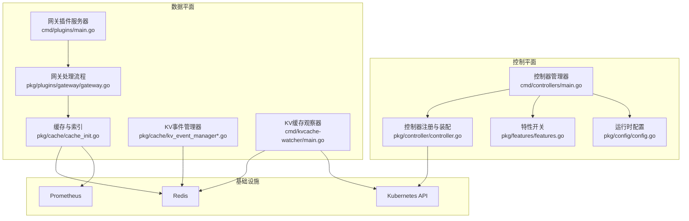
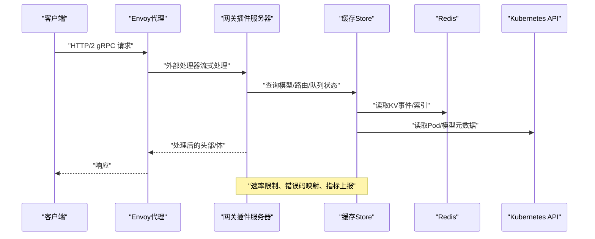
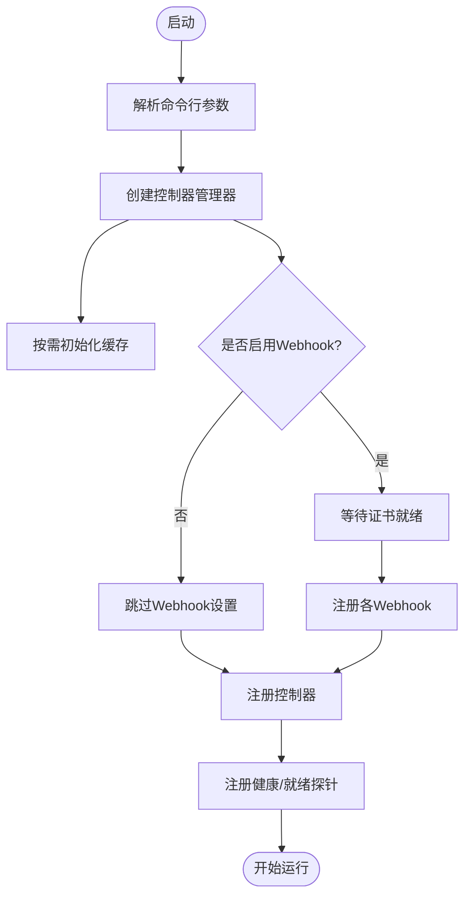
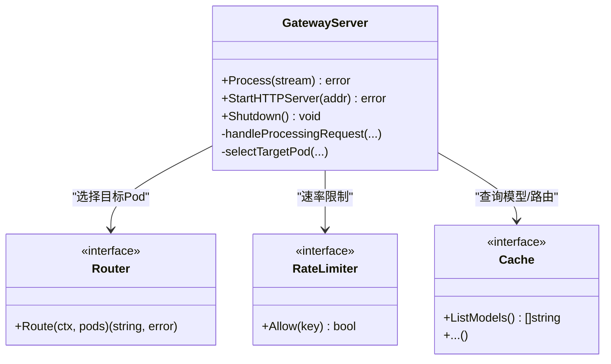
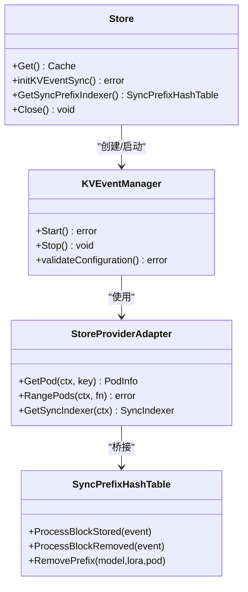
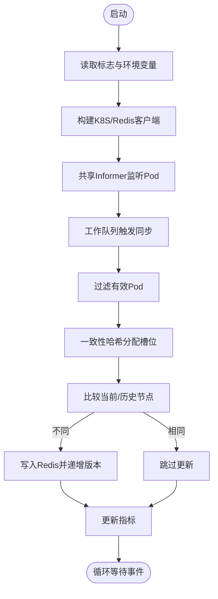
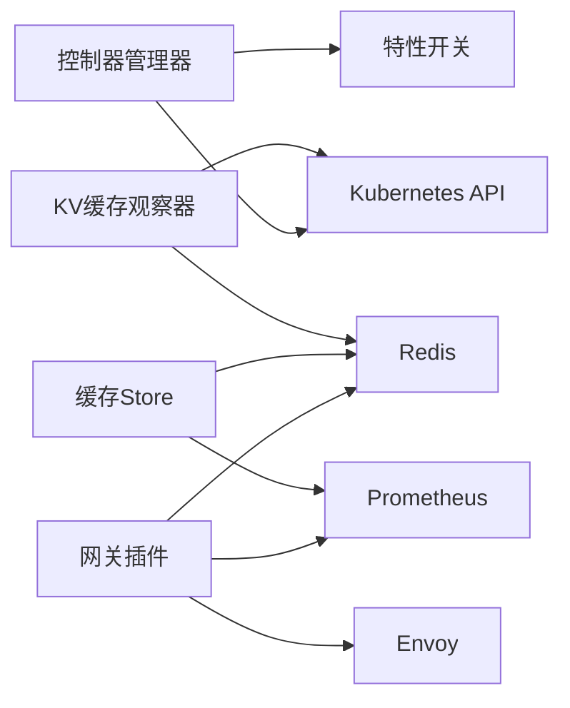

# 核心架构

<cite>
**本文引用的文件**
- [cmd/controllers/main.go](file://cmd/controllers/main.go)
- [cmd/plugins/main.go](file://cmd/plugins/main.go)
- [cmd/kvcache-watcher/main.go](file://cmd/kvcache-watcher/main.go)
- [pkg/controller/controller.go](file://pkg/controller/controller.go)
- [pkg/cache/cache_init.go](file://pkg/cache/cache_init.go)
- [pkg/cache/kv_event_manager.go](file://pkg/cache/kv_event_manager.go)
- [pkg/cache/kv_event_manager_zmq.go](file://pkg/cache/kv_event_manager_zmq.go)
- [pkg/cache/store_providers.go](file://pkg/cache/store_providers.go)
- [pkg/plugins/gateway/gateway.go](file://pkg/plugins/gateway/gateway.go)
- [pkg/features/features.go](file://pkg/features/features.go)
- [pkg/config/config.go](file://pkg/config/config.go)
- [api/orchestration/v1alpha1/groupversion_info.go](file://api/orchestration/v1alpha1/groupversion_info.go)
- [pkg/types/router.go](file://pkg/types/router.go)
- [pkg/cache/model.go](file://pkg/cache/model.go)
- [pkg/cache/pod.go](file://pkg/cache/pod.go)
</cite>

## 目录
1. [引言](#引言)
2. [项目结构](#项目结构)
3. [核心组件](#核心组件)
4. [架构总览](#架构总览)
5. [详细组件分析](#详细组件分析)
6. [依赖分析](#依赖分析)
7. [性能考量](#性能考量)
8. [故障排查指南](#故障排查指南)
9. [结论](#结论)
10. [附录](#附录)

## 引言
本文件面向AIBrix核心架构，系统化阐述控制平面与数据平面的分离设计、微服务组件交互模式、事件驱动的数据流设计，并深入解析控制器管理器、网关插件系统、缓存与事件同步机制。文档同时总结技术决策与权衡，覆盖Kubernetes原生设计、云原生部署策略以及分布式系统设计原则，辅以系统边界图与组件关系图，帮助开发者快速建立对整体架构的理解。

## 项目结构
AIBrix采用分层与功能域结合的组织方式：
- 控制平面：以controller-manager为核心，通过Kubernetes CRD与控制器实现编排与治理。
- 数据平面：以网关插件（Envoy外部处理器）与缓存系统为核心，负责请求路由、速率限制、模型发现与事件同步。
- 配置与特性开关：通过features与配置选项控制控制器启用与运行时行为。
- 命令入口：分别提供控制平面、网关插件、KV缓存观察器三类可执行程序。

图表来源
- [cmd/controllers/main.go:112-360](file://cmd/controllers/main.go#L112-L360)
- [pkg/controller/controller.go:48-130](file://pkg/controller/controller.go#L48-L130)
- [pkg/cache/cache_init.go:302-376](file://pkg/cache/cache_init.go#L302-L376)
- [pkg/plugins/gateway/gateway.go:94-121](file://pkg/plugins/gateway/gateway.go#L94-L121)
- [cmd/kvcache-watcher/main.go:228-346](file://cmd/kvcache-watcher/main.go#L228-L346)

章节来源
- [cmd/controllers/main.go:112-360](file://cmd/controllers/main.go#L112-L360)
- [pkg/controller/controller.go:48-130](file://pkg/controller/controller.go#L48-L130)
- [pkg/cache/cache_init.go:302-376](file://pkg/cache/cache_init.go#L302-L376)
- [pkg/plugins/gateway/gateway.go:94-121](file://pkg/plugins/gateway/gateway.go#L94-L121)
- [cmd/kvcache-watcher/main.go:228-346](file://cmd/kvcache-watcher/main.go#L228-L346)

## 核心组件
- 控制器管理器（Controller Manager）
  - 负责创建与管理控制器生命周期，支持特性开关与CRD存在性检测，按需注册控制器。
  - 支持Leader选举、健康探针、指标端点与Webhook服务器。
- 网关插件（Gateway Plugin）
  - 基于Envoy外部处理器协议，实现请求头/体处理、响应头/体处理、速率限制、模型路由与HTTP API。
  - 提供独立HTTP服务用于模型列表查询与指标暴露。
- 缓存与事件同步
  - 统一缓存Store承载Pod/模型/指标等状态；支持基于Redis的KV事件同步与一致性哈希索引。
  - 在ZMQ构建标签下启用事件驱动的KV块存储同步。
- KV缓存观察器
  - 观察Kubernetes中KV缓存Pod状态，计算一致性哈希槽位分布并写入Redis，支撑数据平面路由与调度。

章节来源
- [cmd/controllers/main.go:112-360](file://cmd/controllers/main.go#L112-L360)
- [pkg/controller/controller.go:48-130](file://pkg/controller/controller.go#L48-L130)
- [pkg/plugins/gateway/gateway.go:94-121](file://pkg/plugins/gateway/gateway.go#L94-L121)
- [pkg/cache/cache_init.go:302-376](file://pkg/cache/cache_init.go#L302-L376)
- [cmd/kvcache-watcher/main.go:228-346](file://cmd/kvcache-watcher/main.go#L228-L346)

## 架构总览
AIBrix采用“控制平面 + 数据平面”的双平面架构：
- 控制平面：通过controller-manager统一编排，依据特性开关动态启用控制器；控制器监听Kubernetes资源变化，更新缓存与状态。
- 数据平面：网关插件作为Envoy扩展处理器，实时处理请求并调用缓存进行路由与限流；缓存通过服务发现与指标采集维持全局视图；KV事件同步在ZMQ构建下实现跨引擎的KV块一致性。

图表来源
- [pkg/plugins/gateway/gateway.go:123-303](file://pkg/plugins/gateway/gateway.go#L123-L303)
- [pkg/cache/cache_init.go:302-376](file://pkg/cache/cache_init.go#L302-L376)

章节来源
- [pkg/plugins/gateway/gateway.go:123-303](file://pkg/plugins/gateway/gateway.go#L123-L303)
- [pkg/cache/cache_init.go:302-376](file://pkg/cache/cache_init.go#L302-L376)

## 详细组件分析

### 控制器管理器工作原理
- 特性开关与控制器注册
  - 通过特性表决定是否启用Pod自动伸缩、模型适配器、分布式推理、KV缓存、StormService等控制器。
  - 注册阶段检查CRD是否存在，不存在则跳过对应控制器，避免失败启动。
- 运行时配置
  - 支持启用Runtime Sidecar、调试模式、模型适配器调度策略等。
- Webhook与证书轮换
  - 在Webhook未禁用时，等待证书就绪后再注册各Webhook，确保安全通信。
- 健康与就绪检查
  - 提供健康与就绪探针，就绪检查会等待Webhook就绪或显式跳过。

图表来源
- [cmd/controllers/main.go:112-360](file://cmd/controllers/main.go#L112-L360)
- [pkg/controller/controller.go:48-130](file://pkg/controller/controller.go#L48-L130)
- [pkg/config/config.go:19-41](file://pkg/config/config.go#L19-L41)

章节来源
- [cmd/controllers/main.go:112-360](file://cmd/controllers/main.go#L112-L360)
- [pkg/controller/controller.go:48-130](file://pkg/controller/controller.go#L48-L130)
- [pkg/config/config.go:19-41](file://pkg/config/config.go#L19-L41)

### 网关插件系统扩展机制
- 外部处理器接口
  - 实现Envoy扩展处理器协议，按消息类型（请求头/体、响应头/体）分发处理。
- 路由与算法
  - 通过路由上下文选择目标Pod，支持多种路由算法与队列能力。
- 速率限制与认证
  - 基于Redis实现账户级与模型级速率限制；支持用户认证与错误码映射。
- 指标与可观测性
  - 暴露Prometheus指标，记录请求成功/失败、错误码、响应时间等。
- HTTP API
  - 在本地/独立模式下提供/v1/models接口，列举可用模型。

图表来源
- [pkg/plugins/gateway/gateway.go:62-121](file://pkg/plugins/gateway/gateway.go#L62-L121)
- [pkg/types/router.go:19-56](file://pkg/types/router.go#L19-L56)

章节来源
- [pkg/plugins/gateway/gateway.go:62-121](file://pkg/plugins/gateway/gateway.go#L62-L121)
- [pkg/types/router.go:19-56](file://pkg/types/router.go#L19-L56)

### 缓存系统与事件同步架构
- 缓存Store
  - 统一管理Pod/模型/指标/请求追踪等状态；支持并发安全访问与异步指标更新。
  - 可选启用KV事件同步与一致性哈希索引，提升跨引擎KV块同步效率。
- KV事件管理器
  - 在ZMQ构建下，通过kvevent.Manager桥接Store与索引器，实现块存储事件的订阅与处理。
  - 非ZMQ构建下提供空实现，便于无依赖编译。
- 服务发现与指标
  - 通过Provider接口抽象发现逻辑，支持Kubernetes Informer与静态文件两种模式。
  - 定期从Prometheus/Pod注解拉取指标，维护Pod与模型维度的度量。

图表来源
- [pkg/cache/cache_init.go:71-122](file://pkg/cache/cache_init.go#L71-L122)
- [pkg/cache/kv_event_manager_zmq.go:28-77](file://pkg/cache/kv_event_manager_zmq.go#L28-L77)
- [pkg/cache/store_providers.go:58-201](file://pkg/cache/store_providers.go#L58-L201)

章节来源
- [pkg/cache/cache_init.go:71-122](file://pkg/cache/cache_init.go#L71-L122)
- [pkg/cache/kv_event_manager_zmq.go:28-77](file://pkg/cache/kv_event_manager_zmq.go#L28-L77)
- [pkg/cache/store_providers.go:58-201](file://pkg/cache/store_providers.go#L58-L201)

### KV缓存观察器（数据平面辅助）
- 功能职责
  - 观察指定命名空间与标签的KV缓存Pod，过滤有效实例，提取IP（优先RDMA注解，回退到容器内执行命令）。
  - 计算一致性哈希槽位分布，生成节点列表与版本号，写入Redis键值。
- 指标与可观测性
  - 暴露Pod状态计数、元数据版本、升级次数、失败计数等指标，便于监控与排障。
- 参数与环境变量
  - 支持后端类型（HPKV/InfiniStore）、命名空间、集群标识、RDMA/Admin端口、哈希槽与虚拟节点数量等。

图表来源
- [cmd/kvcache-watcher/main.go:228-346](file://cmd/kvcache-watcher/main.go#L228-L346)
- [cmd/kvcache-watcher/main.go:406-515](file://cmd/kvcache-watcher/main.go#L406-L515)

章节来源
- [cmd/kvcache-watcher/main.go:228-346](file://cmd/kvcache-watcher/main.go#L228-L346)
- [cmd/kvcache-watcher/main.go:406-515](file://cmd/kvcache-watcher/main.go#L406-L515)

## 依赖分析
- 控制平面依赖
  - Kubernetes API：CRD、Informer、RBAC与Leader选举资源。
  - 特性开关：根据特性表动态注册控制器，避免不必要的依赖。
- 数据平面依赖
  - Redis：KV事件同步、速率限制、请求追踪持久化。
  - Prometheus：Pod/模型指标采集与查询。
  - Envoy：外部处理器协议与HTTP API。
- 构建与运行时差异
  - ZMQ构建：启用KV事件同步与相关适配器。
  - 非ZMQ构建：KV事件管理器为空实现，便于无依赖部署。

图表来源
- [pkg/controller/controller.go:48-130](file://pkg/controller/controller.go#L48-L130)
- [pkg/plugins/gateway/gateway.go:94-121](file://pkg/plugins/gateway/gateway.go#L94-L121)
- [pkg/cache/cache_init.go:302-376](file://pkg/cache/cache_init.go#L302-L376)
- [cmd/kvcache-watcher/main.go:228-346](file://cmd/kvcache-watcher/main.go#L228-L346)

章节来源
- [pkg/controller/controller.go:48-130](file://pkg/controller/controller.go#L48-L130)
- [pkg/plugins/gateway/gateway.go:94-121](file://pkg/plugins/gateway/gateway.go#L94-L121)
- [pkg/cache/cache_init.go:302-376](file://pkg/cache/cache_init.go#L302-L376)
- [cmd/kvcache-watcher/main.go:228-346](file://cmd/kvcache-watcher/main.go#L228-L346)

## 性能考量
- 并发与异步
  - 缓存Store采用读写锁与工作池，PromQL查询通过队列与定时器削峰填谷。
- 指标与追踪
  - 定期刷新指标与请求追踪窗口对齐，减少写放大；追踪写入周期性批量落盘。
- 路由与队列
  - 路由器支持内置队列与长度查询，便于在高负载场景下进行排队与节流。
- 网关处理
  - 分阶段处理请求/响应，错误路径快速返回并记录指标，避免阻塞主链路。

## 故障排查指南
- 控制器管理器
  - 探针失败：检查Webhook证书是否就绪、健康/就绪端口是否可达。
  - 控制器不生效：确认特性开关与CRD存在性，查看日志中的CRD缺失提示。
- 网关插件
  - 速率限制异常：确认Redis连接与键空间；检查账户/模型级限流配置。
  - 路由失败：检查HTTPRoute状态与模型路由算法；验证Pod可路由性与标签选择器。
- 缓存与事件同步
  - KV事件同步未生效：确认ZMQ构建标签、远程分词器配置与端点；检查事件管理器验证结果。
  - 指标缺失：检查Prometheus API可用性与查询超时；核对Pod Ready状态。
- KV缓存观察器
  - 节点列表未更新：检查Pod过滤条件、RDMA IP提取与注解格式；关注元数据版本与失败计数指标。

章节来源
- [cmd/controllers/main.go:294-318](file://cmd/controllers/main.go#L294-L318)
- [pkg/plugins/gateway/gateway.go:362-397](file://pkg/plugins/gateway/gateway.go#L362-L397)
- [pkg/cache/kv_event_manager_zmq.go:42-74](file://pkg/cache/kv_event_manager_zmq.go#L42-L74)
- [cmd/kvcache-watcher/main.go:447-515](file://cmd/kvcache-watcher/main.go#L447-L515)

## 结论
AIBrix通过清晰的控制平面与数据平面分离，结合Kubernetes原生能力与云原生部署策略，实现了可扩展、可观测且可演进的AI推理系统。控制器管理器以特性开关与CRD感知保障灵活性；网关插件以事件驱动与缓存聚合实现低延迟与高吞吐；KV事件同步与观察器进一步强化了跨引擎的一致性与可观测性。该架构在保证生产稳定性的同时，为未来扩展（如多引擎、多集群、边缘部署）提供了坚实基础。

## 附录
- 关键类型与职责
  - Router/QueueRouter：定义路由与队列能力，支持策略化选择与排队统计。
  - Model/Pod：封装模型与Pod状态、指标与实时统计，支撑路由与限流决策。
  - GroupVersion：声明Orchestration API组版本，统一CRD注册入口。

章节来源
- [pkg/types/router.go:19-56](file://pkg/types/router.go#L19-L56)
- [pkg/cache/model.go:27-42](file://pkg/cache/model.go#L27-L42)
- [pkg/cache/pod.go:29-59](file://pkg/cache/pod.go#L29-L59)
- [api/orchestration/v1alpha1/groupversion_info.go:27-50](file://api/orchestration/v1alpha1/groupversion_info.go#L27-L50)