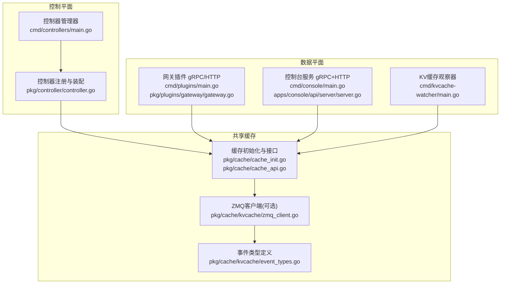
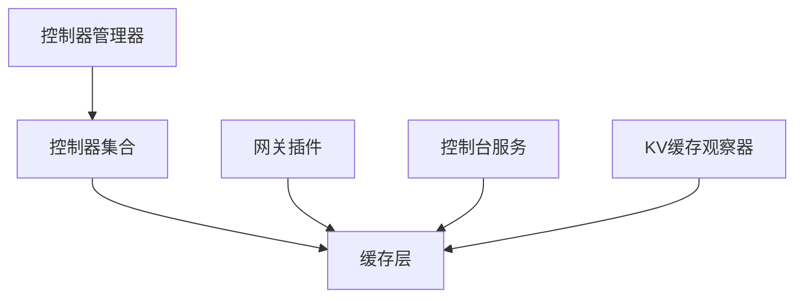
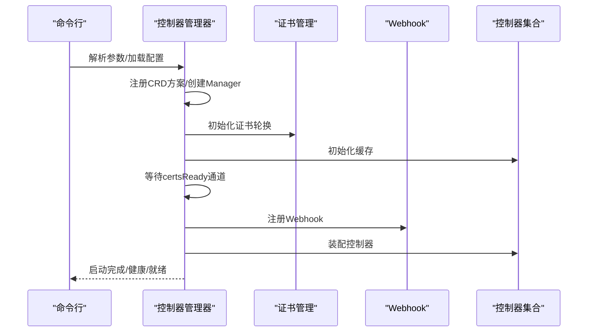
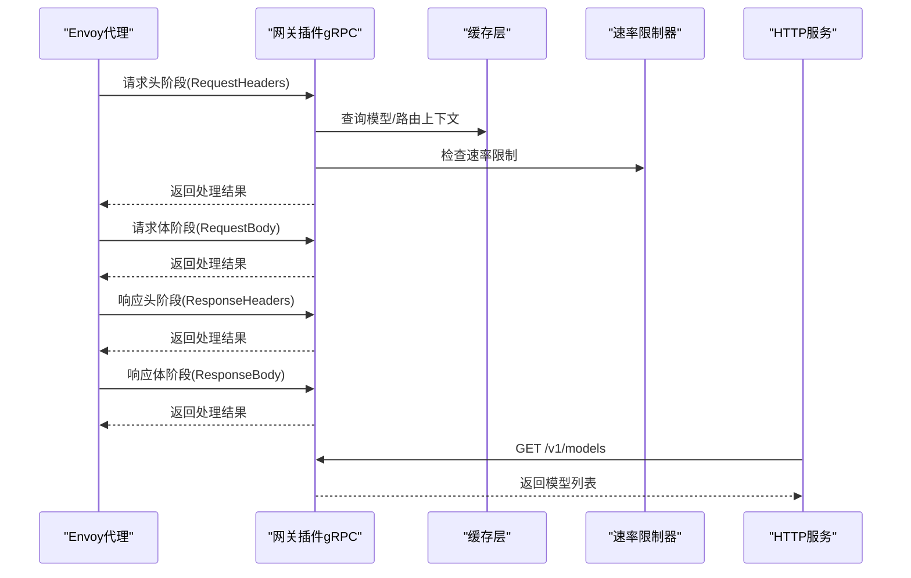
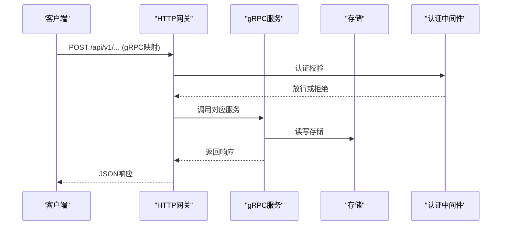
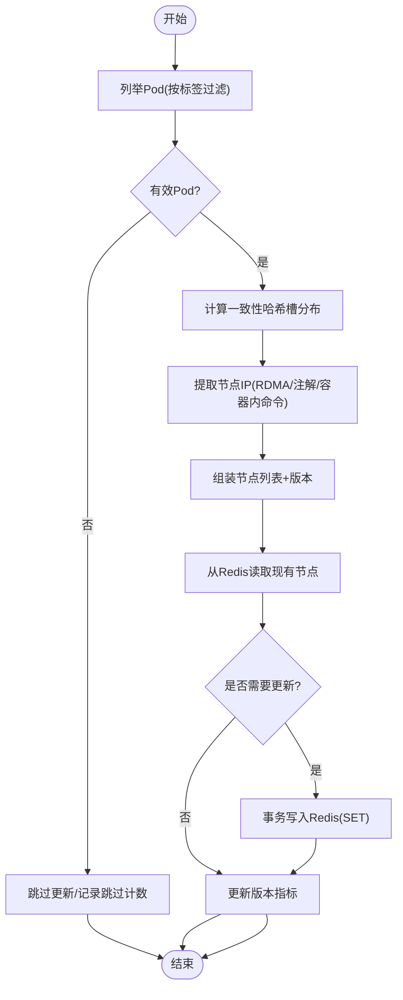
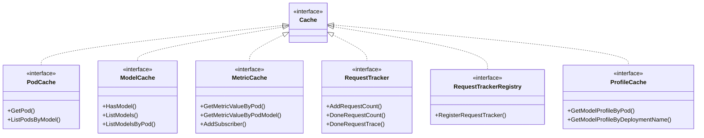
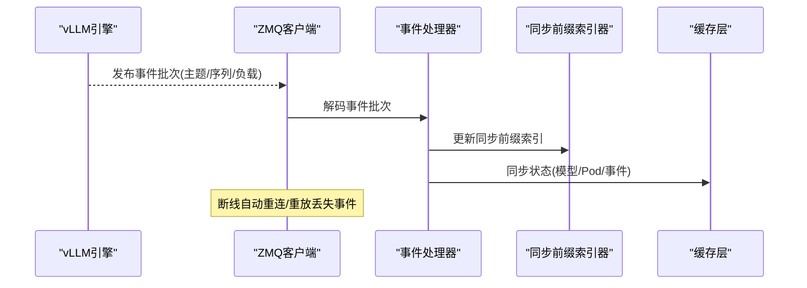
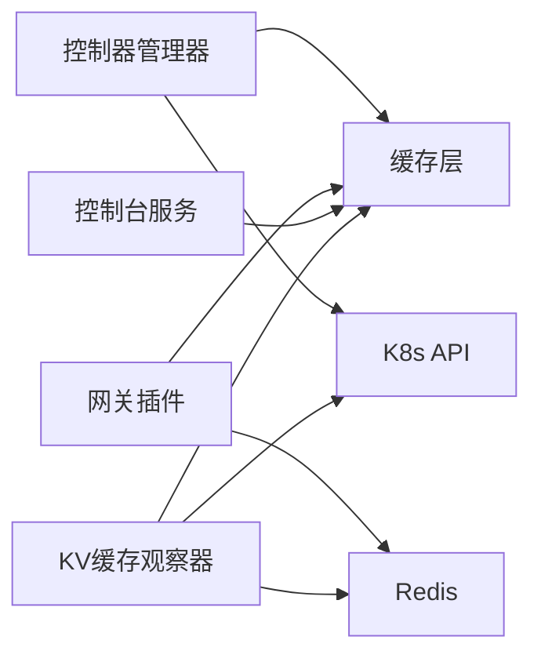

# 组件交互模式

<cite>
**本文引用的文件**
- [cmd/controllers/main.go](file://cmd/controllers/main.go)
- [pkg/controller/controller.go](file://pkg/controller/controller.go)
- [cmd/plugins/main.go](file://cmd/plugins/main.go)
- [pkg/plugins/gateway/gateway.go](file://pkg/plugins/gateway/gateway.go)
- [cmd/console/main.go](file://cmd/console/main.go)
- [apps/console/api/server/server.go](file://apps/console/api/server/server.go)
- [cmd/kvcache-watcher/main.go](file://cmd/kvcache-watcher/main.go)
- [pkg/cache/cache_init.go](file://pkg/cache/cache_init.go)
- [pkg/cache/cache_api.go](file://pkg/cache/cache_api.go)
- [pkg/cache/kvcache/zmq_client.go](file://pkg/cache/kvcache/zmq_client.go)
- [pkg/cache/kvcache/event_types.go](file://pkg/cache/kvcache/event_types.go)
- [pkg/cache/kv_event_manager.go](file://pkg/cache/kv_event_manager.go)
</cite>

## 目录
1. [简介](#简介)
2. [项目结构](#项目结构)
3. [核心组件](#核心组件)
4. [架构总览](#架构总览)
5. [详细组件分析](#详细组件分析)
6. [依赖关系分析](#依赖关系分析)
7. [性能考量](#性能考量)
8. [故障排查指南](#故障排查指南)
9. [结论](#结论)

## 简介
本文件面向AIBrix组件交互模式，聚焦控制平面与数据平面的协同机制，涵盖事件传递、状态同步与配置下发；详述gRPC接口、HTTP API与ZeroMQ消息传递协议；阐明组件生命周期管理（启动顺序、优雅关闭、故障恢复）；并通过时序图与状态图帮助开发者在复杂场景下理解组件协作行为。

## 项目结构
AIBrix采用多进程/多模块架构：控制平面由控制器管理器统一调度；数据平面包含网关插件、控制台服务、KV缓存观察器以及基于ZeroMQ的KV事件同步子系统。缓存层作为跨组件共享的状态中心，提供模型/引擎/指标等信息。

图表来源
- [cmd/controllers/main.go:112-360](file://cmd/controllers/main.go#L112-L360)
- [pkg/controller/controller.go:48-130](file://pkg/controller/controller.go#L48-L130)
- [cmd/plugins/main.go:54-198](file://cmd/plugins/main.go#L54-L198)
- [pkg/plugins/gateway/gateway.go:62-121](file://pkg/plugins/gateway/gateway.go#L62-L121)
- [cmd/console/main.go:34-118](file://cmd/console/main.go#L34-L118)
- [apps/console/api/server/server.go:46-135](file://apps/console/api/server/server.go#L46-L135)
- [cmd/kvcache-watcher/main.go:228-346](file://cmd/kvcache-watcher/main.go#L228-L346)
- [pkg/cache/cache_init.go:302-376](file://pkg/cache/cache_init.go#L302-L376)
- [pkg/cache/cache_api.go:25-170](file://pkg/cache/cache_api.go#L25-L170)
- [pkg/cache/kvcache/zmq_client.go:30-70](file://pkg/cache/kvcache/zmq_client.go#L30-L70)
- [pkg/cache/kvcache/event_types.go:45-178](file://pkg/cache/kvcache/event_types.go#L45-L178)

章节来源
- [cmd/controllers/main.go:112-360](file://cmd/controllers/main.go#L112-L360)
- [pkg/controller/controller.go:48-130](file://pkg/controller/controller.go#L48-L130)
- [cmd/plugins/main.go:54-198](file://cmd/plugins/main.go#L54-L198)
- [pkg/plugins/gateway/gateway.go:62-121](file://pkg/plugins/gateway/gateway.go#L62-L121)
- [cmd/console/main.go:34-118](file://cmd/console/main.go#L34-L118)
- [apps/console/api/server/server.go:46-135](file://apps/console/api/server/server.go#L46-L135)
- [cmd/kvcache-watcher/main.go:228-346](file://cmd/kvcache-watcher/main.go#L228-L346)
- [pkg/cache/cache_init.go:302-376](file://pkg/cache/cache_init.go#L302-L376)
- [pkg/cache/cache_api.go:25-170](file://pkg/cache/cache_api.go#L25-L170)
- [pkg/cache/kvcache/zmq_client.go:30-70](file://pkg/cache/kvcache/zmq_client.go#L30-L70)
- [pkg/cache/kvcache/event_types.go:45-178](file://pkg/cache/kvcache/event_types.go#L45-L178)

## 核心组件
- 控制器管理器：负责控制器生命周期、健康检查、证书轮换与Webhook注册。
- 网关插件：以Envoy扩展处理器形式工作，提供请求头/体处理、路由选择、速率限制、HTTP指标端点。
- 控制台服务：提供gRPC与HTTP网关，承载部署、作业、模型、密钥、配额等管理能力。
- KV缓存观察器：监听K8s Pod变更，维护KV集群节点元数据到Redis。
- 缓存层：统一聚合Pod/模型/指标/请求追踪/模型画像等，支持可选的ZMQ KV事件同步。

章节来源
- [cmd/controllers/main.go:112-360](file://cmd/controllers/main.go#L112-L360)
- [pkg/controller/controller.go:48-130](file://pkg/controller/controller.go#L48-L130)
- [cmd/plugins/main.go:54-198](file://cmd/plugins/main.go#L54-L198)
- [pkg/plugins/gateway/gateway.go:62-121](file://pkg/plugins/gateway/gateway.go#L62-L121)
- [cmd/console/main.go:34-118](file://cmd/console/main.go#L34-L118)
- [apps/console/api/server/server.go:46-135](file://apps/console/api/server/server.go#L46-L135)
- [cmd/kvcache-watcher/main.go:228-346](file://cmd/kvcache-watcher/main.go#L228-L346)
- [pkg/cache/cache_init.go:302-376](file://pkg/cache/cache_init.go#L302-L376)
- [pkg/cache/cache_api.go:25-170](file://pkg/cache/cache_api.go#L25-L170)

## 架构总览
控制平面通过控制器管理器统一编排各控制器；数据平面由网关插件、控制台服务与KV缓存观察器组成；缓存层作为共享状态中心，支撑路由决策、速率限制与可观测性。

图表来源
- [cmd/controllers/main.go:112-360](file://cmd/controllers/main.go#L112-L360)
- [pkg/controller/controller.go:48-130](file://pkg/controller/controller.go#L48-L130)
- [pkg/cache/cache_init.go:302-376](file://pkg/cache/cache_init.go#L302-L376)
- [pkg/plugins/gateway/gateway.go:62-121](file://pkg/plugins/gateway/gateway.go#L62-L121)
- [apps/console/api/server/server.go:46-135](file://apps/console/api/server/server.go#L46-L135)
- [cmd/kvcache-watcher/main.go:228-346](file://cmd/kvcache-watcher/main.go#L228-L346)

## 详细组件分析

### 控制器管理器与控制器装配
- 启动流程：解析参数、构建K8s配置、注册CRD方案、创建Manager、初始化缓存、等待证书就绪后注册Webhook与控制器。
- 控制器装配：根据特性开关动态启用/禁用控制器，按需检查CRD存在性，避免在缺失依赖时崩溃。
- 健康检查：提供健康/就绪探针，就绪检查会等待Webhook证书可用。

图表来源
- [cmd/controllers/main.go:112-360](file://cmd/controllers/main.go#L112-L360)
- [pkg/controller/controller.go:48-130](file://pkg/controller/controller.go#L48-L130)

章节来源
- [cmd/controllers/main.go:112-360](file://cmd/controllers/main.go#L112-L360)
- [pkg/controller/controller.go:48-130](file://pkg/controller/controller.go#L48-L130)

### 网关插件：gRPC与HTTP交互
- gRPC：实现Envoy外部处理器接口，分阶段处理请求头/体、响应头/体，支持错误码映射与指标上报。
- HTTP：提供/health与/v1/models等端点，用于健康检查与模型列表查询。
- 速率限制：基于Redis的账户级与模型级限流器。
- 路由算法：通过可插拔路由器工厂选择路由策略。

图表来源
- [pkg/plugins/gateway/gateway.go:123-303](file://pkg/plugins/gateway/gateway.go#L123-L303)
- [pkg/plugins/gateway/gateway.go:399-431](file://pkg/plugins/gateway/gateway.go#L399-L431)
- [pkg/plugins/gateway/gateway.go:433-462](file://pkg/plugins/gateway/gateway.go#L433-L462)

章节来源
- [cmd/plugins/main.go:54-198](file://cmd/plugins/main.go#L54-L198)
- [pkg/plugins/gateway/gateway.go:62-121](file://pkg/plugins/gateway/gateway.go#L62-L121)
- [pkg/plugins/gateway/gateway.go:123-303](file://pkg/plugins/gateway/gateway.go#L123-L303)
- [pkg/plugins/gateway/gateway.go:399-431](file://pkg/plugins/gateway/gateway.go#L399-L431)
- [pkg/plugins/gateway/gateway.go:433-462](file://pkg/plugins/gateway/gateway.go#L433-L462)

### 控制台服务：gRPC与HTTP网关
- gRPC：注册部署、作业、模型、模板、API密钥、密文、配额等服务。
- HTTP网关：使用grpc-gateway将gRPC映射为HTTP，注册Playground/SSE代理与静态资源路由。
- 中间件：认证中间件、CORS、静态文件回退。

图表来源
- [apps/console/api/server/server.go:105-135](file://apps/console/api/server/server.go#L105-L135)
- [apps/console/api/server/server.go:137-198](file://apps/console/api/server/server.go#L137-L198)
- [cmd/console/main.go:34-118](file://cmd/console/main.go#L34-L118)

章节来源
- [cmd/console/main.go:34-118](file://cmd/console/main.go#L34-L118)
- [apps/console/api/server/server.go:46-135](file://apps/console/api/server/server.go#L46-L135)
- [apps/console/api/server/server.go:137-198](file://apps/console/api/server/server.go#L137-L198)

### KV缓存观察器：K8s到Redis的元数据同步
- 监听命名空间内带特定标签的KV缓存Pod，过滤运行中且未删除的Pod。
- 计算一致性哈希槽分布，提取RDMA IP（优先注解，失败则执行容器内命令）。
- 将节点列表与版本写入Redis键，支持版本递增与失败计数。

图表来源
- [cmd/kvcache-watcher/main.go:406-515](file://cmd/kvcache-watcher/main.go#L406-L515)
- [cmd/kvcache-watcher/main.go:517-554](file://cmd/kvcache-watcher/main.go#L517-L554)
- [cmd/kvcache-watcher/main.go:556-644](file://cmd/kvcache-watcher/main.go#L556-L644)

章节来源
- [cmd/kvcache-watcher/main.go:228-346](file://cmd/kvcache-watcher/main.go#L228-L346)
- [cmd/kvcache-watcher/main.go:406-515](file://cmd/kvcache-watcher/main.go#L406-L515)
- [cmd/kvcache-watcher/main.go:517-554](file://cmd/kvcache-watcher/main.go#L517-L554)
- [cmd/kvcache-watcher/main.go:556-644](file://cmd/kvcache-watcher/main.go#L556-L644)

### 缓存层：接口与初始化
- 接口：聚合Pod/模型/指标/请求追踪/模型画像与输出预测器、路由器提供者。
- 初始化：根据服务角色决定是否启用追踪/画像缓存；初始化发现提供者（K8s或静态）；周期刷新指标；可选启用KV事件同步；可选启用Redis追踪写入。

图表来源
- [pkg/cache/cache_api.go:25-170](file://pkg/cache/cache_api.go#L25-L170)

章节来源
- [pkg/cache/cache_api.go:25-170](file://pkg/cache/cache_api.go#L25-L170)
- [pkg/cache/cache_init.go:302-376](file://pkg/cache/cache_init.go#L302-L376)

### ZeroMQ KV事件同步：事件传递与状态同步
- ZMQ客户端：SUB订阅发布者，DEALER向ROUTER发起重放请求；支持指数退避重连、序列号校验与丢包统计。
- 事件类型：块存储、块移除、全部清空；批量事件携带时间戳与事件数组。
- KV事件管理器：默认构建禁用ZMQ时为桩实现；启用时创建共享前缀索引器并启动事件管理。

图表来源
- [pkg/cache/kvcache/zmq_client.go:72-160](file://pkg/cache/kvcache/zmq_client.go#L72-L160)
- [pkg/cache/kvcache/zmq_client.go:197-255](file://pkg/cache/kvcache/zmq_client.go#L197-L255)
- [pkg/cache/kvcache/zmq_client.go:294-367](file://pkg/cache/kvcache/zmq_client.go#L294-L367)
- [pkg/cache/kvcache/event_types.go:45-178](file://pkg/cache/kvcache/event_types.go#L45-L178)
- [pkg/cache/kv_event_manager.go:28-71](file://pkg/cache/kv_event_manager.go#L28-L71)

章节来源
- [pkg/cache/kvcache/zmq_client.go:30-70](file://pkg/cache/kvcache/zmq_client.go#L30-L70)
- [pkg/cache/kvcache/zmq_client.go:72-160](file://pkg/cache/kvcache/zmq_client.go#L72-L160)
- [pkg/cache/kvcache/zmq_client.go:197-255](file://pkg/cache/kvcache/zmq_client.go#L197-L255)
- [pkg/cache/kvcache/zmq_client.go:294-367](file://pkg/cache/kvcache/zmq_client.go#L294-L367)
- [pkg/cache/kvcache/event_types.go:45-178](file://pkg/cache/kvcache/event_types.go#L45-L178)
- [pkg/cache/kv_event_manager.go:28-71](file://pkg/cache/kv_event_manager.go#L28-L71)

## 依赖关系分析
- 控制器管理器依赖缓存层进行Pod/模型/指标等状态查询；依赖Webhook服务器进行准入控制。
- 网关插件依赖缓存层进行路由上下文与模型列表查询；依赖Redis进行速率限制与可选追踪。
- 控制台服务依赖存储抽象与认证中间件；通过gRPC网关暴露HTTP接口。
- KV缓存观察器依赖K8s Informer与Redis；通过一致性哈希将Pod映射到槽位。

图表来源
- [cmd/controllers/main.go:112-360](file://cmd/controllers/main.go#L112-L360)
- [pkg/plugins/gateway/gateway.go:62-121](file://pkg/plugins/gateway/gateway.go#L62-L121)
- [apps/console/api/server/server.go:46-135](file://apps/console/api/server/server.go#L46-L135)
- [cmd/kvcache-watcher/main.go:228-346](file://cmd/kvcache-watcher/main.go#L228-L346)

章节来源
- [cmd/controllers/main.go:112-360](file://cmd/controllers/main.go#L112-L360)
- [pkg/plugins/gateway/gateway.go:62-121](file://pkg/plugins/gateway/gateway.go#L62-L121)
- [apps/console/api/server/server.go:46-135](file://apps/console/api/server/server.go#L46-L135)
- [cmd/kvcache-watcher/main.go:228-346](file://cmd/kvcache-watcher/main.go#L228-L346)

## 性能考量
- 缓存层指标刷新：周期性拉取PromQL并异步写入队列，避免阻塞主路径；PromQL工作池并发处理。
- 网关插件：gRPC流式处理，按阶段返回；HTTP端点仅做简单聚合与转发。
- KV事件同步：ZMQ客户端具备指数退避与重放机制，降低断连影响；事件批处理减少处理开销。
- 控制器管理器：健康/就绪探针与证书就绪门控，确保组件稳定上线。

[本节为通用指导，不直接分析具体文件]

## 故障排查指南
- 控制器管理器就绪失败：检查Webhook证书是否生成完成；确认certsReady通道是否被阻塞。
- 网关插件gRPC错误：关注Recv阶段错误与非gRPC错误包装；检查路由上下文与HTTPRoute状态。
- 控制台服务HTTP 500：检查gRPC网关注册与认证中间件链路；确认静态文件目录与CORS配置。
- KV缓存观察器更新失败：查看Redis写入失败计数与节点列表比较逻辑；确认RDMA IP提取路径。
- KV事件同步未生效：确认构建标签包含ZMQ；检查远程分词器开关与缓存初始化日志。

章节来源
- [cmd/controllers/main.go:294-312](file://cmd/controllers/main.go#L294-L312)
- [pkg/plugins/gateway/gateway.go:181-236](file://pkg/plugins/gateway/gateway.go#L181-L236)
- [apps/console/api/server/server.go:137-198](file://apps/console/api/server/server.go#L137-L198)
- [cmd/kvcache-watcher/main.go:470-515](file://cmd/kvcache-watcher/main.go#L470-L515)
- [pkg/cache/kv_event_manager.go:47-51](file://pkg/cache/kv_event_manager.go#L47-L51)

## 结论
AIBrix通过清晰的控制平面与数据平面分离，结合共享缓存层与多种协议（gRPC、HTTP、ZeroMQ），实现了高可用、可观测与可扩展的推理与路由基础设施。控制器管理器负责编排与保障，网关插件与控制台服务提供高效的数据面能力，KV缓存观察器与ZMQ事件同步确保状态一致与低延迟。建议在生产环境启用TLS与限流、完善监控告警，并按需开启KV事件同步以提升路由精度与稳定性。