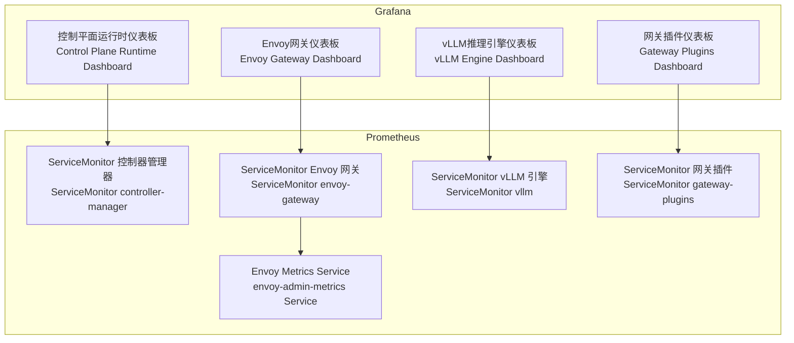
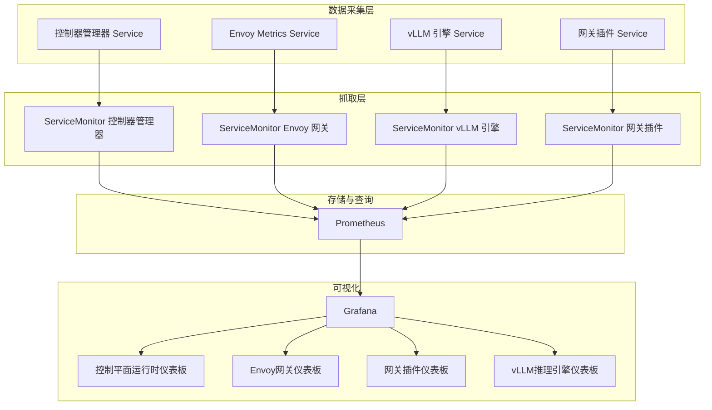
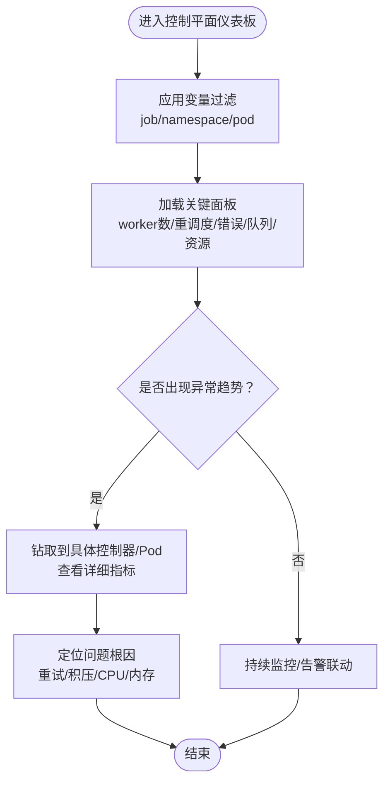
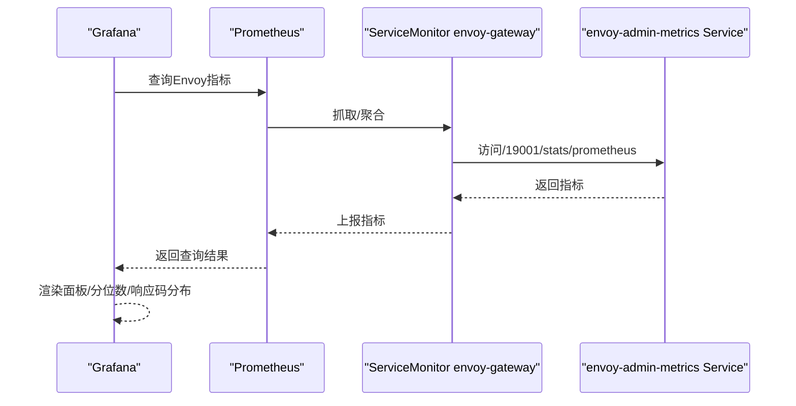
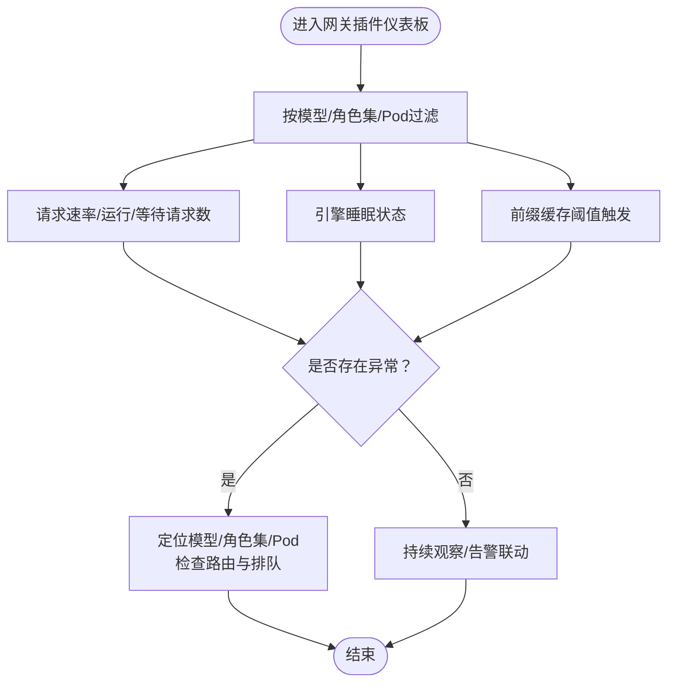
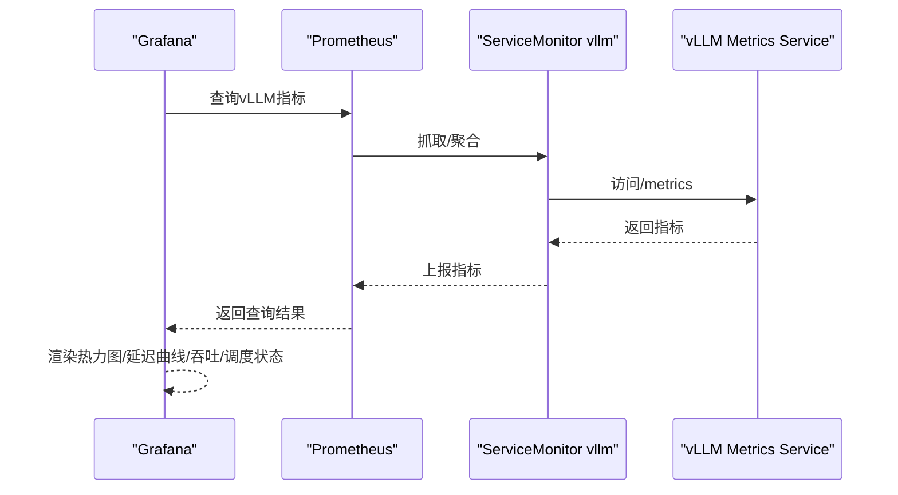
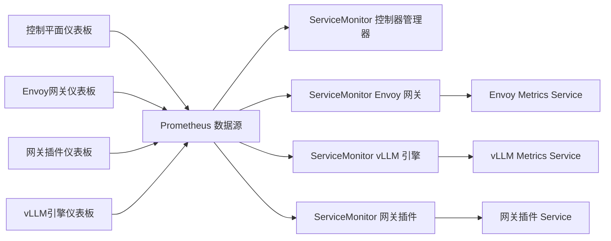

# 可视化与仪表板

<cite>
**本文引用的文件**   
- [AIBrix_Control_Plane_Runtime_Dashboard.json](file://observability/grafana/AIBrix_Control_Plane_Runtime_Dashboard.json)
- [AIBrix_Envoy_Gateway_Dashboard.json](file://observability/grafana/AIBrix_Envoy_Gateway_Dashboard.json)
- [AIBrix_Envoy_Gateway_Plugins_Dashboard.json](file://observability/grafana/AIBrix_Envoy_Gateway_Plugins_Dashboard.json)
- [AIBrix_vLLM_Engine_Dashboard.json](file://observability/grafana/AIBrix_vLLM_Engine_Dashboard.json)
- [envoy_metrics_service.yaml](file://observability/monitor/envoy_metrics_service.yaml)
- [service_monitor_controller_manager.yaml](file://observability/monitor/service_monitor_controller_manager.yaml)
- [service_monitor_gateway.yaml](file://observability/monitor/service_monitor_gateway.yaml)
- [service_monitor_vllm.yaml](file://observability/monitor/service_monitor_vllm.yaml)
- [service_monitor_gateway_plugin.yaml](file://observability/monitor/service_monitor_gateway_plugin.yaml)
- [cache_metrics.go](file://pkg/cache/cache_metrics.go)
- [gateway.go](file://pkg/plugins/gateway/gateway.go)
</cite>

## 目录
1. [简介](#简介)
2. [项目结构](#项目结构)
3. [核心组件](#核心组件)
4. [架构总览](#架构总览)
5. [详细组件分析](#详细组件分析)
6. [依赖关系分析](#依赖关系分析)
7. [性能考虑](#性能考虑)
8. [故障排查指南](#故障排查指南)
9. [结论](#结论)
10. [附录](#附录)

## 简介
本文件面向AIBrix可视化与仪表板系统，围绕Grafana仪表板的设计理念与架构进行系统性说明，覆盖数据源配置、面板布局设计、主题定制、变量与查询编辑、响应式布局、最佳实践（性能监控、容量规划、故障诊断、业务洞察）、维护与扩展指南以及与Prometheus等监控系统的集成方案。文档聚焦以下核心仪表板：
- 控制平面运行时仪表板：用于观察控制器工作队列、重试、CPU/内存等运行时指标。
- Envoy网关仪表板：用于观测Envoy代理的请求速率、连接状态、gRPC/HTTP响应码、延迟与流量。
- 网关插件仪表板：用于观测网关插件侧的请求处理、排队与引擎睡眠状态等。
- vLLM推理引擎仪表板：用于观测端到端延迟、首Token时间、吞吐、调度状态与缓存命中率等。

## 项目结构
AIBrix的可观测性由两部分组成：
- Grafana仪表板：位于observability/grafana目录，包含JSON格式的仪表板定义。
- Prometheus服务发现与抓取配置：位于observability/monitor目录，通过Service与ServiceMonitor暴露并抓取目标指标。

图表来源
- [AIBrix_Control_Plane_Runtime_Dashboard.json:1157-1216](file://observability/grafana/AIBrix_Control_Plane_Runtime_Dashboard.json#L1157-L1216)
- [AIBrix_Envoy_Gateway_Dashboard.json:1-200](file://observability/grafana/AIBrix_Envoy_Gateway_Dashboard.json#L1-L200)
- [AIBrix_Envoy_Gateway_Plugins_Dashboard.json:1-120](file://observability/grafana/AIBrix_Envoy_Gateway_Plugins_Dashboard.json#L1-L120)
- [AIBrix_vLLM_Engine_Dashboard.json:1-120](file://observability/grafana/AIBrix_vLLM_Engine_Dashboard.json#L1-L120)
- [service_monitor_controller_manager.yaml:1-19](file://observability/monitor/service_monitor_controller_manager.yaml#L1-L19)
- [service_monitor_gateway.yaml:1-20](file://observability/monitor/service_monitor_gateway.yaml#L1-L20)
- [service_monitor_vllm.yaml:1-19](file://observability/monitor/service_monitor_vllm.yaml#L1-L19)
- [service_monitor_gateway_plugin.yaml:1-19](file://observability/monitor/service_monitor_gateway_plugin.yaml#L1-L19)
- [envoy_metrics_service.yaml:1-21](file://observability/monitor/envoy_metrics_service.yaml#L1-L21)

章节来源
- [AIBrix_Control_Plane_Runtime_Dashboard.json:1157-1216](file://observability/grafana/AIBrix_Control_Plane_Runtime_Dashboard.json#L1157-L1216)
- [AIBrix_Envoy_Gateway_Dashboard.json:1-200](file://observability/grafana/AIBrix_Envoy_Gateway_Dashboard.json#L1-L200)
- [AIBrix_Envoy_Gateway_Plugins_Dashboard.json:1-120](file://observability/grafana/AIBrix_Envoy_Gateway_Plugins_Dashboard.json#L1-L120)
- [AIBrix_vLLM_Engine_Dashboard.json:1-120](file://observability/grafana/AIBrix_vLLM_Engine_Dashboard.json#L1-L120)
- [service_monitor_controller_manager.yaml:1-19](file://observability/monitor/service_monitor_controller_manager.yaml#L1-L19)
- [service_monitor_gateway.yaml:1-20](file://observability/monitor/service_monitor_gateway.yaml#L1-L20)
- [service_monitor_vllm.yaml:1-19](file://observability/monitor/service_monitor_vllm.yaml#L1-L19)
- [service_monitor_gateway_plugin.yaml:1-19](file://observability/monitor/service_monitor_gateway_plugin.yaml#L1-L19)
- [envoy_metrics_service.yaml:1-21](file://observability/monitor/envoy_metrics_service.yaml#L1-L21)

## 核心组件
- 控制平面运行时仪表板：聚焦控制器运行时指标，如活动worker数、每控制器的重调度次数、错误计数、工作队列深度与耗时、CPU/内存使用等。
- Envoy网关仪表板：聚焦Envoy代理指标，如存活实例、平均运行时、内存占用、集群健康、下游/上游请求速率、gRPC状态码分布、连接重置、延迟分位数等。
- 网关插件仪表板：聚焦网关插件侧指标，如请求速率、运行/等待中的请求数、引擎睡眠状态、前缀缓存阈值触发等。
- vLLM推理引擎仪表板：聚焦推理引擎指标，如成功请求计数、提示/生成长度热力图、端到端延迟与首Token延迟、吞吐、调度状态、缓存命中率等。

章节来源
- [AIBrix_Control_Plane_Runtime_Dashboard.json:66-1228](file://observability/grafana/AIBrix_Control_Plane_Runtime_Dashboard.json#L66-L1228)
- [AIBrix_Envoy_Gateway_Dashboard.json:67-1599](file://observability/grafana/AIBrix_Envoy_Gateway_Dashboard.json#L67-L1599)
- [AIBrix_Envoy_Gateway_Plugins_Dashboard.json:23-720](file://observability/grafana/AIBrix_Envoy_Gateway_Plugins_Dashboard.json#L23-L720)
- [AIBrix_vLLM_Engine_Dashboard.json:73-1599](file://observability/grafana/AIBrix_vLLM_Engine_Dashboard.json#L73-L1599)

## 架构总览
下图展示从数据采集到可视化呈现的整体链路：各组件通过Service暴露指标端点，ServiceMonitor按标签选择器抓取；Grafana通过Prometheus数据源查询并渲染仪表板。

图表来源
- [service_monitor_controller_manager.yaml:1-19](file://observability/monitor/service_monitor_controller_manager.yaml#L1-L19)
- [service_monitor_gateway.yaml:1-20](file://observability/monitor/service_monitor_gateway.yaml#L1-L20)
- [service_monitor_vllm.yaml:1-19](file://observability/monitor/service_monitor_vllm.yaml#L1-L19)
- [service_monitor_gateway_plugin.yaml:1-19](file://observability/monitor/service_monitor_gateway_plugin.yaml#L1-L19)
- [envoy_metrics_service.yaml:1-21](file://observability/monitor/envoy_metrics_service.yaml#L1-L21)
- [AIBrix_Control_Plane_Runtime_Dashboard.json:1-120](file://observability/grafana/AIBrix_Control_Plane_Runtime_Dashboard.json#L1-L120)
- [AIBrix_Envoy_Gateway_Dashboard.json:1-120](file://observability/grafana/AIBrix_Envoy_Gateway_Dashboard.json#L1-L120)
- [AIBrix_Envoy_Gateway_Plugins_Dashboard.json:1-120](file://observability/grafana/AIBrix_Envoy_Gateway_Plugins_Dashboard.json#L1-L120)
- [AIBrix_vLLM_Engine_Dashboard.json:1-120](file://observability/grafana/AIBrix_vLLM_Engine_Dashboard.json#L1-L120)

## 详细组件分析

### 控制平面运行时仪表板
- 设计理念：以“控制器运行时健康”为核心，通过工作队列深度、处理耗时、重试与错误率、CPU/内存等指标，帮助识别控制器积压、阻塞与资源瓶颈。
- 关键面板与指标
  - 活动worker数：反映当前并发处理能力。
  - 每控制器重调度速率：定位热点控制器与重调度压力。
  - 重调度错误速率：识别控制器内部异常或外部依赖失败。
  - 工作队列深度与排队耗时（P50/P90/P99）：评估积压与延迟。
  - 工作队列重试速率：识别退避与抖动。
  - CPU/内存使用：评估资源占用与潜在OOM风险。
- 变量与过滤
  - job、namespace、pod等变量用于限定查询范围，支持多命名空间/多Pod对比。
- 面板样式与响应式
  - 使用统计面板、时间序列、分位数曲线等组合，适配不同分辨率与告警联动。

图表来源
- [AIBrix_Control_Plane_Runtime_Dashboard.json:66-1228](file://observability/grafana/AIBrix_Control_Plane_Runtime_Dashboard.json#L66-L1228)

章节来源
- [AIBrix_Control_Plane_Runtime_Dashboard.json:66-1228](file://observability/grafana/AIBrix_Control_Plane_Runtime_Dashboard.json#L66-L1228)

### Envoy网关仪表板
- 设计理念：以“网关代理健康与流量”为核心，覆盖存活节点、运行时、内存、集群健康、请求速率、响应码分布、连接重置与延迟分位数。
- 关键面板与指标
  - Live服务器、平均运行时、内存占用、堆大小：评估代理整体健康。
  - 不健康集群数量、集群状态：快速识别上游不可用。
  - 下游/上游字节速率、请求速率：评估入出站流量。
  - gRPC/HTTP响应码分布：定位错误模式。
  - 连接重置速率：识别网络或上游异常。
  - 延迟分位数（P50/P90/P95/P99）：评估SLA达成度。
- 变量与过滤
  - hosts变量用于筛选特定实例，便于跨实例对比与故障隔离。
- 面板样式与响应式
  - 统计面板、条形图、时间序列组合，颜色编码区分不同响应码类别。

图表来源
- [AIBrix_Envoy_Gateway_Dashboard.json:67-1599](file://observability/grafana/AIBrix_Envoy_Gateway_Dashboard.json#L67-L1599)
- [service_monitor_gateway.yaml:1-20](file://observability/monitor/service_monitor_gateway.yaml#L1-L20)
- [envoy_metrics_service.yaml:1-21](file://observability/monitor/envoy_metrics_service.yaml#L1-L21)

章节来源
- [AIBrix_Envoy_Gateway_Dashboard.json:67-1599](file://observability/grafana/AIBrix_Envoy_Gateway_Dashboard.json#L67-L1599)
- [service_monitor_gateway.yaml:1-20](file://observability/monitor/service_monitor_gateway.yaml#L1-L20)
- [envoy_metrics_service.yaml:1-21](file://observability/monitor/envoy_metrics_service.yaml#L1-L21)

### 网关插件仪表板
- 设计理念：聚焦网关插件侧的请求处理与引擎状态，辅助定位路由策略、排队与引擎休眠等问题。
- 关键面板与指标
  - 请求速率（按模型/状态码聚合）：观察不同模型与状态码的请求分布。
  - 运行/等待中的请求数：评估排队与背压。
  - 引擎睡眠状态：判断推理引擎是否处于节能态。
  - 前缀缓存阈值触发：识别缓存命中异常。
- 变量与过滤
  - 支持按模型、角色集、Pod等维度过滤，便于多模型对比。
- 面板样式与响应式
  - 时间序列与条形图结合，突出关键阈值与异常波动。

图表来源
- [AIBrix_Envoy_Gateway_Plugins_Dashboard.json:23-720](file://observability/grafana/AIBrix_Envoy_Gateway_Plugins_Dashboard.json#L23-L720)

章节来源
- [AIBrix_Envoy_Gateway_Plugins_Dashboard.json:23-720](file://observability/grafana/AIBrix_Envoy_Gateway_Plugins_Dashboard.json#L23-L720)

### vLLM推理引擎仪表板
- 设计理念：以“推理性能与吞吐”为核心，覆盖端到端延迟、首Token延迟、吞吐、调度状态与缓存命中。
- 关键面板与指标
  - 成功请求计数（按完成原因）：评估推理成功率。
  - 提示/生成长度热力图：识别输入/输出长度分布。
  - 端到端延迟与首Token延迟（P50/P90/P95/P99/均值）：评估SLA与首屏体验。
  - 提示/解码吞吐：评估整体处理能力。
  - 调度状态（运行/等待/交换）：评估队列与资源分配。
  - 缓存命中率：评估KV缓存与前缀缓存效果。
- 变量与过滤
  - model_name、job等变量用于限定模型与抓取范围。
- 面板样式与响应式
  - 热力图、时间序列与统计面板组合，突出分位数与异常峰值。

图表来源
- [AIBrix_vLLM_Engine_Dashboard.json:73-1599](file://observability/grafana/AIBrix_vLLM_Engine_Dashboard.json#L73-L1599)
- [service_monitor_vllm.yaml:1-19](file://observability/monitor/service_monitor_vllm.yaml#L1-L19)

章节来源
- [AIBrix_vLLM_Engine_Dashboard.json:73-1599](file://observability/grafana/AIBrix_vLLM_Engine_Dashboard.json#L73-L1599)
- [service_monitor_vllm.yaml:1-19](file://observability/monitor/service_monitor_vllm.yaml#L1-L19)

## 依赖关系分析
- 仪表板对数据源的依赖
  - 所有仪表板均声明Prometheus数据源，并在查询中使用变量（如job、namespace、pod、hosts、model_name）进行动态过滤。
- 抓取配置对目标的依赖
  - ServiceMonitor通过selector匹配Service标签，确保正确抓取对应组件的/metrics端点。
  - Envoy通过独立Service暴露19001端口，供ServiceMonitor抓取/stats/prometheus。
- 指标来源与代码关联
  - 网关插件与引擎侧指标通过pkg/cache与pkg/plugins/gateway模块导出，Prometheus通过ServiceMonitor抓取。

图表来源
- [AIBrix_Control_Plane_Runtime_Dashboard.json:1-120](file://observability/grafana/AIBrix_Control_Plane_Runtime_Dashboard.json#L1-L120)
- [AIBrix_Envoy_Gateway_Dashboard.json:1-120](file://observability/grafana/AIBrix_Envoy_Gateway_Dashboard.json#L1-L120)
- [AIBrix_Envoy_Gateway_Plugins_Dashboard.json:1-120](file://observability/grafana/AIBrix_Envoy_Gateway_Plugins_Dashboard.json#L1-L120)
- [AIBrix_vLLM_Engine_Dashboard.json:1-120](file://observability/grafana/AIBrix_vLLM_Engine_Dashboard.json#L1-L120)
- [service_monitor_controller_manager.yaml:1-19](file://observability/monitor/service_monitor_controller_manager.yaml#L1-L19)
- [service_monitor_gateway.yaml:1-20](file://observability/monitor/service_monitor_gateway.yaml#L1-L20)
- [service_monitor_vllm.yaml:1-19](file://observability/monitor/service_monitor_vllm.yaml#L1-L19)
- [service_monitor_gateway_plugin.yaml:1-19](file://observability/monitor/service_monitor_gateway_plugin.yaml#L1-L19)
- [envoy_metrics_service.yaml:1-21](file://observability/monitor/envoy_metrics_service.yaml#L1-L21)

章节来源
- [AIBrix_Control_Plane_Runtime_Dashboard.json:1-120](file://observability/grafana/AIBrix_Control_Plane_Runtime_Dashboard.json#L1-L120)
- [AIBrix_Envoy_Gateway_Dashboard.json:1-120](file://observability/grafana/AIBrix_Envoy_Gateway_Dashboard.json#L1-L120)
- [AIBrix_Envoy_Gateway_Plugins_Dashboard.json:1-120](file://observability/grafana/AIBrix_Envoy_Gateway_Plugins_Dashboard.json#L1-L120)
- [AIBrix_vLLM_Engine_Dashboard.json:1-120](file://observability/grafana/AIBrix_vLLM_Engine_Dashboard.json#L1-L120)
- [service_monitor_controller_manager.yaml:1-19](file://observability/monitor/service_monitor_controller_manager.yaml#L1-L19)
- [service_monitor_gateway.yaml:1-20](file://observability/monitor/service_monitor_gateway.yaml#L1-L20)
- [service_monitor_vllm.yaml:1-19](file://observability/monitor/service_monitor_vllm.yaml#L1-L19)
- [service_monitor_gateway_plugin.yaml:1-19](file://observability/monitor/service_monitor_gateway_plugin.yaml#L1-L19)
- [envoy_metrics_service.yaml:1-21](file://observability/monitor/envoy_metrics_service.yaml#L1-L21)

## 性能考虑
- 查询优化
  - 合理使用rate/histogram_quantile等函数，避免对高基数指标进行全量聚合。
  - 利用变量限制查询范围（如job/namespace/pod/hosts/model_name），减少数据量。
- 面板渲染
  - 对热力图与高密度时间序列，建议开启spanNulls与采样策略，降低渲染开销。
- 抓取频率
  - 根据指标变化频率调整ServiceMonitor的interval，平衡实时性与资源消耗。
- 缓存与预聚合
  - 在Prometheus侧启用适当的记录规则，将高频查询转换为低频预计算指标，提升查询性能。

## 故障排查指南
- 控制平面仪表板
  - 若工作队列深度持续上升且P99排队耗时升高，优先检查控制器重试与错误率，定位热点资源或外部依赖。
  - CPU/内存异常升高可能引发Unfinished Seconds增长，需结合日志与资源配额分析。
- Envoy网关仪表板
  - 集群健康下降与上游错误码激增通常指向后端服务异常，结合hosts变量定位具体实例。
  - 连接重置频繁可能源于网络抖动或上游超时，需检查网络策略与超时配置。
- 网关插件仪表板
  - 运行/等待请求数异常升高可能由路由策略或引擎侧排队导致，结合模型维度与角色集进行隔离。
  - 引擎睡眠状态长时间为非活跃，需检查负载与唤醒策略。
- vLLM引擎仪表板
  - 首Token延迟与端到端延迟同时升高，可能由GPU显存不足或KV缓存命中率低导致，需结合吞吐与缓存命中率面板综合分析。

章节来源
- [AIBrix_Control_Plane_Runtime_Dashboard.json:66-1228](file://observability/grafana/AIBrix_Control_Plane_Runtime_Dashboard.json#L66-L1228)
- [AIBrix_Envoy_Gateway_Dashboard.json:67-1599](file://observability/grafana/AIBrix_Envoy_Gateway_Dashboard.json#L67-L1599)
- [AIBrix_Envoy_Gateway_Plugins_Dashboard.json:23-720](file://observability/grafana/AIBrix_Envoy_Gateway_Plugins_Dashboard.json#L23-L720)
- [AIBrix_vLLM_Engine_Dashboard.json:73-1599](file://observability/grafana/AIBrix_vLLM_Engine_Dashboard.json#L73-L1599)

## 结论
AIBrix的可视化与仪表板体系通过清晰的仪表板分层与完善的Prometheus抓取配置，实现了对控制平面、网关代理、推理引擎的全栈可观测。结合变量与查询优化、响应式布局与最佳实践，可有效支撑性能监控、容量规划、故障诊断与业务洞察。建议在生产环境中持续完善告警策略、记录规则与面板权限，确保可视化系统的长期可用与高效运维。

## 附录

### 配置与使用指南
- 数据源配置
  - 在Grafana中添加Prometheus数据源，确保数据源名称与仪表板声明一致（如DS_PROMETHEUS）。
- 变量定义
  - 控制平面：job、namespace、pod
  - Envoy网关：hosts
  - vLLM引擎：model_name、job
- 查询编辑
  - 使用rate/histogram_quantile/sum by等函数进行聚合与分位数计算。
  - 通过变量实现动态过滤，避免硬编码标签。
- 面板样式设置
  - 使用统计面板展示关键指标，时间序列展示趋势，热力图展示分布。
  - 设置阈值与颜色映射，增强可读性与告警联动。
- 响应式布局
  - 合理设置面板尺寸与网格，保证在不同分辨率下的可读性。

章节来源
- [AIBrix_Control_Plane_Runtime_Dashboard.json:1157-1216](file://observability/grafana/AIBrix_Control_Plane_Runtime_Dashboard.json#L1157-L1216)
- [AIBrix_Envoy_Gateway_Dashboard.json:1-200](file://observability/grafana/AIBrix_Envoy_Gateway_Dashboard.json#L1-L200)
- [AIBrix_Envoy_Gateway_Plugins_Dashboard.json:1-120](file://observability/grafana/AIBrix_Envoy_Gateway_Plugins_Dashboard.json#L1-L120)
- [AIBrix_vLLM_Engine_Dashboard.json:1-120](file://observability/grafana/AIBrix_vLLM_Engine_Dashboard.json#L1-L120)

### 维护与扩展指南
- 维护
  - 定期校验ServiceMonitor与Service标签一致性，确保抓取正常。
  - 优化查询与面板，避免高基数与高采样率带来的性能问题。
- 扩展
  - 新增组件指标后，补充Service与ServiceMonitor，并在Grafana中新增或复用现有模板。
  - 通过记录规则沉淀常用聚合，提升查询效率与稳定性。

章节来源
- [service_monitor_controller_manager.yaml:1-19](file://observability/monitor/service_monitor_controller_manager.yaml#L1-L19)
- [service_monitor_gateway.yaml:1-20](file://observability/monitor/service_monitor_gateway.yaml#L1-L20)
- [service_monitor_vllm.yaml:1-19](file://observability/monitor/service_monitor_vllm.yaml#L1-L19)
- [service_monitor_gateway_plugin.yaml:1-19](file://observability/monitor/service_monitor_gateway_plugin.yaml#L1-L19)
- [envoy_metrics_service.yaml:1-21](file://observability/monitor/envoy_metrics_service.yaml#L1-L21)

### 与监控系统的集成
- Prometheus
  - 通过ServiceMonitor自动发现并抓取指标，Service负责端口暴露。
- Grafana
  - 通过Prometheus数据源查询指标，渲染仪表板。
- 网关与引擎侧指标导出
  - 网关插件与引擎侧指标通过模块导出，Prometheus抓取后供仪表板使用。

章节来源
- [cache_metrics.go:37-77](file://pkg/cache/cache_metrics.go#L37-L77)
- [gateway.go:238-512](file://pkg/plugins/gateway/gateway.go#L238-L512)
- [service_monitor_gateway.yaml:1-20](file://observability/monitor/service_monitor_gateway.yaml#L1-L20)
- [service_monitor_vllm.yaml:1-19](file://observability/monitor/service_monitor_vllm.yaml#L1-L19)
- [service_monitor_gateway_plugin.yaml:1-19](file://observability/monitor/service_monitor_gateway_plugin.yaml#L1-L19)
- [envoy_metrics_service.yaml:1-21](file://observability/monitor/envoy_metrics_service.yaml#L1-L21)