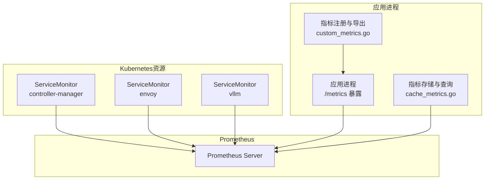
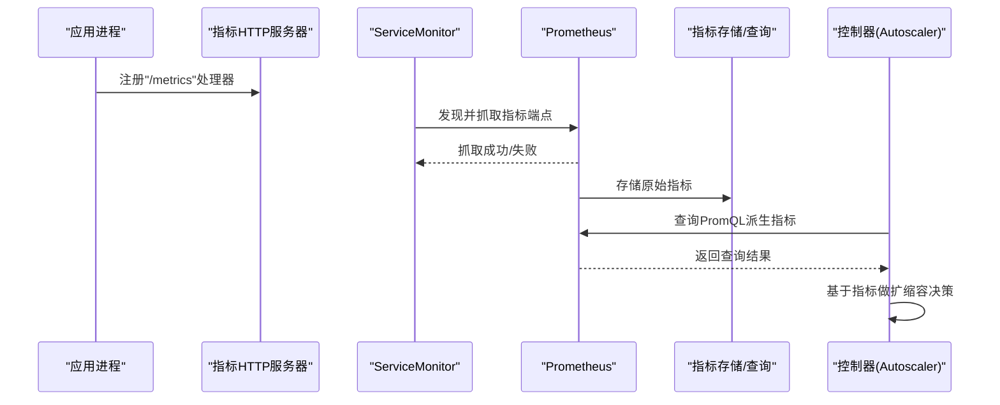
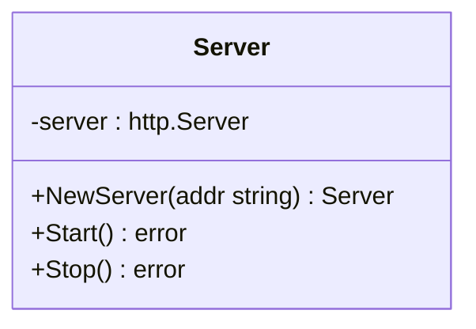
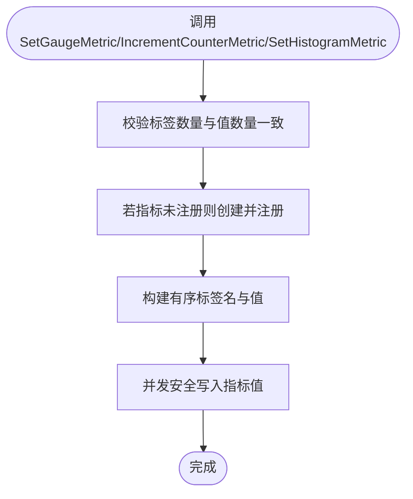
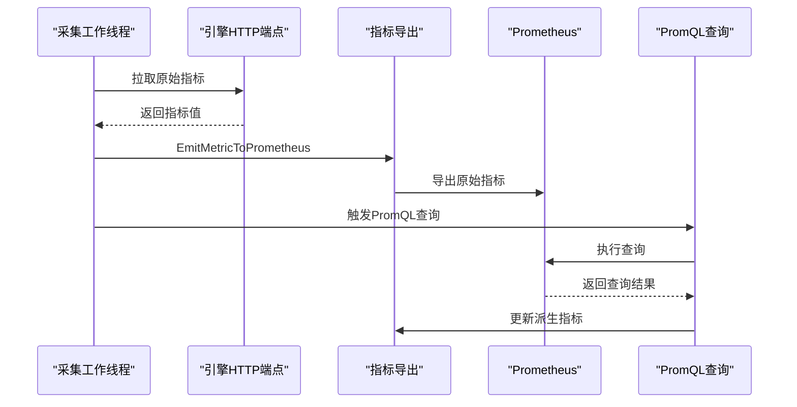
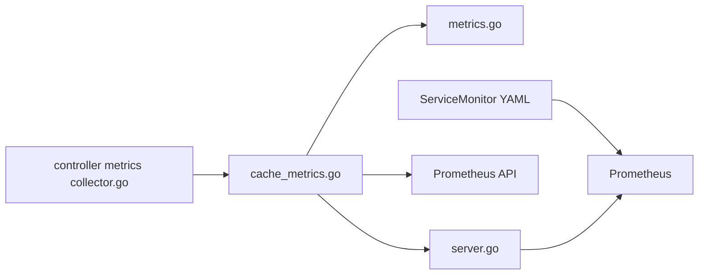

# Prometheus集成

<cite>
**本文引用的文件**
- [config/prometheus/monitor.yaml](file://config/prometheus/monitor.yaml)
- [config/prometheus/kustomization.yaml](file://config/prometheus/kustomization.yaml)
- [pkg/metrics/server.go](file://pkg/metrics/server.go)
- [pkg/metrics/custom_metrics.go](file://pkg/metrics/custom_metrics.go)
- [pkg/metrics/metrics.go](file://pkg/metrics/metrics.go)
- [pkg/cache/cache_metrics.go](file://pkg/cache/cache_metrics.go)
- [pkg/cache/cache_init.go](file://pkg/cache/cache_init.go)
- [pkg/controller/podautoscaler/metrics/collector.go](file://pkg/controller/podautoscaler/metrics/collector.go)
- [pkg/controller/podautoscaler/metrics/client.go](file://pkg/controller/podautoscaler/metrics/client.go)
- [observability/monitor/service_monitor_controller_manager.yaml](file://observability/monitor/service_monitor_controller_manager.yaml)
- [observability/monitor/service_monitor_gateway.yaml](file://observability/monitor/service_monitor_gateway.yaml)
- [observability/monitor/service_monitor_vllm.yaml](file://observability/monitor/service_monitor_vllm.yaml)
</cite>

## 目录
1. [简介](#简介)
2. [项目结构](#项目结构)
3. [核心组件](#核心组件)
4. [架构总览](#架构总览)
5. [详细组件分析](#详细组件分析)
6. [依赖关系分析](#依赖关系分析)
7. [性能考量](#性能考量)
8. [故障排查指南](#故障排查指南)
9. [结论](#结论)
10. [附录：Prometheus集成配置示例](#附录prometheus集成配置示例)

## 简介
本技术文档面向AIBrix Prometheus集成系统，围绕Prometheus服务器配置、指标暴露机制、HTTP端点管理、指标收集器实现（含注册、采集周期、并发安全与性能优化）、PromQL查询接口与使用方式、服务发现与抓取配置、告警规则与监控最佳实践进行系统化说明，并提供故障排查指南，帮助读者在生产环境中稳定、高效地运行Prometheus监控。

## 项目结构
AIBrix在多处位置提供了Prometheus相关的配置与实现：
- 配置层：Kubernetes CRD ServiceMonitor定义，用于自动发现并抓取控制器与引擎的指标端点。
- 指标暴露层：应用内部内置HTTP指标服务器，向Prometheus暴露标准指标端点。
- 指标采集层：缓存与查询模块负责从引擎拉取原始指标，并通过PromQL查询Prometheus以获取聚合与派生指标。
- 控制器层：HPA/Autoscaler控制器基于采集到的指标进行扩缩容决策。

图表来源
- [config/prometheus/monitor.yaml:1-19](file://config/prometheus/monitor.yaml#L1-L19)
- [observability/monitor/service_monitor_controller_manager.yaml:1-19](file://observability/monitor/service_monitor_controller_manager.yaml#L1-L19)
- [observability/monitor/service_monitor_gateway.yaml:1-20](file://observability/monitor/service_monitor_gateway.yaml#L1-L20)
- [observability/monitor/service_monitor_vllm.yaml:1-19](file://observability/monitor/service_monitor_vllm.yaml#L1-L19)
- [pkg/metrics/server.go:32-42](file://pkg/metrics/server.go#L32-L42)
- [pkg/metrics/custom_metrics.go:49-90](file://pkg/metrics/custom_metrics.go#L49-L90)
- [pkg/cache/cache_metrics.go:353-420](file://pkg/cache/cache_metrics.go#L353-L420)

章节来源
- [config/prometheus/monitor.yaml:1-19](file://config/prometheus/monitor.yaml#L1-L19)
- [config/prometheus/kustomization.yaml:1-3](file://config/prometheus/kustomization.yaml#L1-L3)
- [observability/monitor/service_monitor_controller_manager.yaml:1-19](file://observability/monitor/service_monitor_controller_manager.yaml#L1-L19)
- [observability/monitor/service_monitor_gateway.yaml:1-20](file://observability/monitor/service_monitor_gateway.yaml#L1-L20)
- [observability/monitor/service_monitor_vllm.yaml:1-19](file://observability/monitor/service_monitor_vllm.yaml#L1-L19)
- [pkg/metrics/server.go:32-42](file://pkg/metrics/server.go#L32-L42)
- [pkg/metrics/custom_metrics.go:49-90](file://pkg/metrics/custom_metrics.go#L49-L90)

## 核心组件
- 指标暴露HTTP服务器：在指定地址注册“/metrics”端点，使用Prometheus官方HTTP处理程序统一导出指标。
- 自定义指标注册与导出：提供Gauge/Counter/Histogram三类指标的注册、并发安全写入与标签规范化。
- 指标采集与查询：从引擎拉取原始指标，同时通过PromQL查询Prometheus以获得派生指标与聚合统计。
- ServiceMonitor配置：定义抓取目标、端口、路径、命名空间选择器与抓取间隔，确保Prometheus自动发现并抓取。

章节来源
- [pkg/metrics/server.go:32-42](file://pkg/metrics/server.go#L32-L42)
- [pkg/metrics/custom_metrics.go:49-90](file://pkg/metrics/custom_metrics.go#L49-L90)
- [pkg/metrics/metrics.go:102-796](file://pkg/metrics/metrics.go#L102-L796)
- [pkg/cache/cache_metrics.go:353-420](file://pkg/cache/cache_metrics.go#L353-L420)
- [config/prometheus/monitor.yaml:11-19](file://config/prometheus/monitor.yaml#L11-L19)

## 架构总览
下图展示了Prometheus在AIBrix中的整体工作流：应用进程暴露指标、ServiceMonitor自动发现并抓取、Prometheus存储与查询、控制器消费指标进行扩缩容。

图表来源
- [pkg/metrics/server.go:32-42](file://pkg/metrics/server.go#L32-L42)
- [observability/monitor/service_monitor_controller_manager.yaml:11-19](file://observability/monitor/service_monitor_controller_manager.yaml#L11-L19)
- [pkg/cache/cache_metrics.go:353-420](file://pkg/cache/cache_metrics.go#L353-L420)
- [pkg/controller/podautoscaler/metrics/collector.go:86-110](file://pkg/controller/podautoscaler/metrics/collector.go#L86-L110)

## 详细组件分析

### 指标暴露HTTP服务器
- 功能：创建HTTP服务器，将“/metrics”路由绑定到Prometheus标准处理程序，统一导出所有已注册指标。
- 启动与关闭：异步启动监听；优雅关闭时设置超时上下文，避免阻塞。
- 地址可配置：通过构造函数参数传入监听地址。

图表来源
- [pkg/metrics/server.go:28-61](file://pkg/metrics/server.go#L28-L61)

章节来源
- [pkg/metrics/server.go:32-61](file://pkg/metrics/server.go#L32-L61)

### 自定义指标注册与导出
- 指标类型：Gauge、Counter、Histogram三类，均支持动态注册与并发安全写入。
- 并发安全：使用读写锁保护指标映射表，避免竞态；标签顺序规范化以保证同一指标的标签维度一致。
- 标签构建：默认包含命名空间、Pod、模型、引擎类型、角色等；支持额外自定义标签合并。
- Histogram实现：自定义Collector，按标签键快照直方图状态，导出时重建直方图对象。

图表来源
- [pkg/metrics/custom_metrics.go:49-90](file://pkg/metrics/custom_metrics.go#L49-L90)
- [pkg/metrics/custom_metrics.go:118-155](file://pkg/metrics/custom_metrics.go#L118-L155)
- [pkg/metrics/custom_metrics.go:157-255](file://pkg/metrics/custom_metrics.go#L157-L255)

章节来源
- [pkg/metrics/custom_metrics.go:49-90](file://pkg/metrics/custom_metrics.go#L49-L90)
- [pkg/metrics/custom_metrics.go:118-155](file://pkg/metrics/custom_metrics.go#L118-L155)
- [pkg/metrics/custom_metrics.go:157-255](file://pkg/metrics/custom_metrics.go#L157-L255)

### 指标定义与分类
- 指标清单：集中定义了请求计数、延迟直方图、吞吐量、缓存命中率、KV缓存统计、NIXL传输统计、实时速率等指标。
- 分类与来源：
  - 原始指标：来自引擎HTTP端点的直接数值或直方图。
  - Prometheus查询指标：通过PromQL计算得到的派生指标（如5分钟P95 TTFT、平均E2E延迟等）。
  - 标签查询指标：通过查询标签值获取的静态或动态标签信息（如LoRA适配器数量）。
- 引擎映射：每类指标提供不同引擎（vLLM、SGLang、TRT-LLM等）的名称映射，便于跨引擎抽象。

章节来源
- [pkg/metrics/metrics.go:102-796](file://pkg/metrics/metrics.go#L102-L796)

### 指标采集器与PromQL查询
- 采集流程：
  - 从引擎拉取原始指标，写入Prometheus后端。
  - 定期（可配置）对Prometheus执行预定义的PromQL，更新派生指标。
  - 对每个Pod及其模型维度分别查询，支持实例与模型维度替换。
- 并发与限速：
  - 使用工作池与队列控制采集并发，避免过载。
  - PromQL查询循环采用定时器与FIFO队列，限制QPS并保证公平性。
- 错误处理：
  - 查询失败时上报失败计数指标，避免中断后续处理。
  - 对不可达Pod跳过处理，维持系统稳定性。

图表来源
- [pkg/cache/cache_metrics.go:242-351](file://pkg/cache/cache_metrics.go#L242-L351)
- [pkg/cache/cache_metrics.go:353-420](file://pkg/cache/cache_metrics.go#L353-L420)
- [pkg/cache/cache_init.go:635-719](file://pkg/cache/cache_init.go#L635-L719)

章节来源
- [pkg/cache/cache_metrics.go:242-351](file://pkg/cache/cache_metrics.go#L242-L351)
- [pkg/cache/cache_metrics.go:353-420](file://pkg/cache/cache_metrics.go#L353-L420)
- [pkg/cache/cache_init.go:635-719](file://pkg/cache/cache_init.go#L635-L719)

### ServiceMonitor与服务发现
- 控制器管理器指标：通过ServiceMonitor选择器匹配控制器Pod标签，抓取“/metrics”端点。
- Envoy指标：抓取Envoy的/stats/prometheus端点，路径与端口由ServiceMonitor定义。
- vLLM引擎：通过标签选择器与命名空间选择器，抓取引擎Pod的“/metrics”端点。

章节来源
- [config/prometheus/monitor.yaml:11-19](file://config/prometheus/monitor.yaml#L11-L19)
- [observability/monitor/service_monitor_controller_manager.yaml:11-19](file://observability/monitor/service_monitor_controller_manager.yaml#L11-L19)
- [observability/monitor/service_monitor_gateway.yaml:15-20](file://observability/monitor/service_monitor_gateway.yaml#L15-L20)
- [observability/monitor/service_monitor_vllm.yaml:9-19](file://observability/monitor/service_monitor_vllm.yaml#L9-L19)

### 控制器指标采集与窗口管理
- 指标客户端：维护稳定窗口与紧急窗口，记录时间序列并生成历史快照。
- 时间窗口：按固定时长与粒度切分，支持稳定与紧急两种策略窗口。
- 外部指标：支持从外部来源（如Prometheus）采集指标，组合错误信息返回。

章节来源
- [pkg/controller/podautoscaler/metrics/client.go:76-151](file://pkg/controller/podautoscaler/metrics/client.go#L76-L151)
- [pkg/controller/podautoscaler/metrics/collector.go:86-128](file://pkg/controller/podautoscaler/metrics/collector.go#L86-L128)

## 依赖关系分析
- 组件耦合：
  - 指标导出依赖Prometheus客户端库；指标定义集中于metrics包，被导出与查询模块共享。
  - 缓存与查询模块依赖Prometheus API初始化与认证配置，支持从Secret或环境变量加载凭据。
  - 控制器通过查询模块消费指标，形成闭环。
- 外部依赖：
  - Prometheus Server：作为指标存储与查询后端。
  - Kubernetes：通过ServiceMonitor实现服务发现与抓取配置。

图表来源
- [pkg/cache/cache_metrics.go:166-182](file://pkg/cache/cache_metrics.go#L166-L182)
- [pkg/metrics/metrics.go:102-796](file://pkg/metrics/metrics.go#L102-L796)
- [pkg/metrics/server.go:32-42](file://pkg/metrics/server.go#L32-L42)
- [observability/monitor/service_monitor_controller_manager.yaml:11-19](file://observability/monitor/service_monitor_controller_manager.yaml#L11-L19)

章节来源
- [pkg/cache/cache_metrics.go:166-182](file://pkg/cache/cache_metrics.go#L166-L182)
- [pkg/metrics/metrics.go:102-796](file://pkg/metrics/metrics.go#L102-L796)
- [pkg/metrics/server.go:32-42](file://pkg/metrics/server.go#L32-L42)
- [observability/monitor/service_monitor_controller_manager.yaml:11-19](file://observability/monitor/service_monitor_controller_manager.yaml#L11-L19)

## 性能考量
- 指标导出：
  - 使用Prometheus标准HTTP处理器，具备高吞吐与低开销特性。
  - 标签规范化与并发锁粒度控制，避免频繁注册与写入竞争。
- 指标采集：
  - 工作池与非阻塞队列防止采集阻塞；对不可达Pod跳过处理，降低抖动。
  - PromQL查询循环采用定时器与FIFO队列，限制QPS并重试失败任务。
- 查询优化：
  - 使用rate/histogram_quantile等聚合函数减少原始直方图的传输与计算成本。
  - 合理设置抓取间隔与超时，平衡实时性与资源消耗。

[本节为通用性能建议，无需特定文件引用]

## 故障排查指南
- 连接问题
  - Prometheus端点不可达：检查PROMETHEUS_ENDPOINT环境变量是否正确；确认网络连通与TLS配置。
  - 认证失败：若启用Basic Auth，确认用户名/密码来源（环境变量或Kubernetes Secret）配置正确。
- 查询超时
  - 调整AIBRIX_PROMETHEUS_QUERY_TIMEOUT_MS与AIBRIX_PROMETHEUS_QUERY_INTERVAL_MS，避免PromQL查询超时或过于频繁。
- 数据不一致
  - 检查引擎指标导出端点可达性与格式一致性；核对ServiceMonitor的端口与路径配置。
  - 关注PrometheusQueryFail指标，定位查询失败原因并重试。
- 采集停滞
  - 查看工作池饱和日志与PromQL队列长度，适当增大worker数量或降低查询频率。

章节来源
- [pkg/cache/cache_metrics.go:166-182](file://pkg/cache/cache_metrics.go#L166-L182)
- [pkg/cache/cache_metrics.go:353-420](file://pkg/cache/cache_metrics.go#L353-L420)
- [pkg/cache/cache_init.go:644-719](file://pkg/cache/cache_init.go#L644-L719)

## 结论
AIBrix通过标准化的指标导出、完善的ServiceMonitor服务发现、以及基于PromQL的派生指标查询，构建了可观测性闭环。结合并发安全的指标注册与限速的查询循环，系统在高负载场景下仍能保持稳定与高效。建议在生产中合理配置抓取间隔、超时与认证参数，并持续关注关键失败指标以快速定位问题。

[本节为总结性内容，无需特定文件引用]

## 附录：Prometheus集成配置示例

- ServiceMonitor（控制器管理器）
  - 选择器匹配控制器Pod标签，抓取“/metrics”端点。
  - 参考路径：[config/prometheus/monitor.yaml:11-19](file://config/prometheus/monitor.yaml#L11-L19)

- ServiceMonitor（Envoy网关）
  - 抓取“/stats/prometheus”端点，端口与命名空间按需调整。
  - 参考路径：[observability/monitor/service_monitor_gateway.yaml:15-20](file://observability/monitor/service_monitor_gateway.yaml#L15-L20)

- ServiceMonitor（vLLM引擎）
  - 通过标签与命名空间选择器抓取引擎Pod的“/metrics”端点。
  - 参考路径：[observability/monitor/service_monitor_vllm.yaml:9-19](file://observability/monitor/service_monitor_vllm.yaml#L9-L19)

- 指标暴露HTTP服务器
  - 在应用中注册“/metrics”端点，使用Prometheus标准HTTP处理程序。
  - 参考路径：[pkg/metrics/server.go:32-42](file://pkg/metrics/server.go#L32-L42)

- Prometheus查询接口与PromQL
  - 指标定义与查询模板集中在指标清单中，包含派生指标与标签查询。
  - 参考路径：[pkg/metrics/metrics.go:589-796](file://pkg/metrics/metrics.go#L589-L796)

- 控制器指标采集与窗口
  - 维护稳定与紧急窗口，记录时间序列并生成历史快照；支持外部指标采集。
  - 参考路径：[pkg/controller/podautoscaler/metrics/client.go:76-151](file://pkg/controller/podautoscaler/metrics/client.go#L76-L151)
  - [pkg/controller/podautoscaler/metrics/collector.go:86-128](file://pkg/controller/podautoscaler/metrics/collector.go#L86-L128)

- 告警规则与最佳实践
  - 建议基于以下指标设置告警：
    - 请求失败率/成功率异常
    - E2E延迟P95/P99突增
    - TTFT异常升高
    - 生成吞吐下降
    - KV缓存命中率骤降
    - Prometheus查询失败计数
  - 最佳实践：
    - 合理设置抓取间隔与超时，避免Prometheus压力过大。
    - 使用标签规范化与稳定的指标命名，提升查询效率。
    - 对关键路径增加失败计数与延迟直方图，便于快速定位瓶颈。

[本节为配置与实践建议，无需特定文件引用]