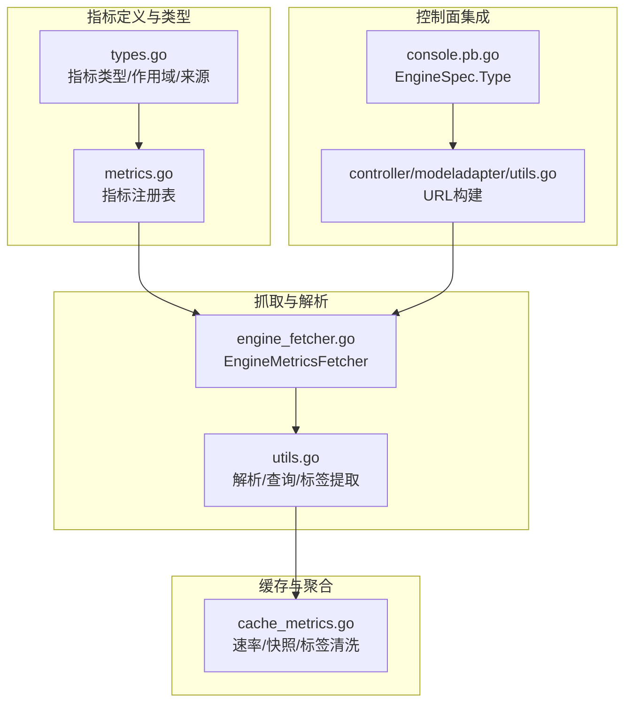
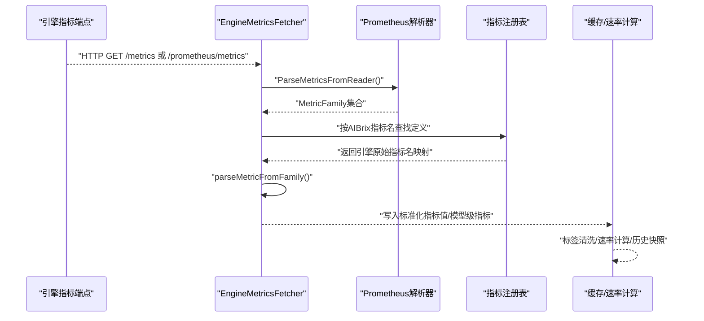
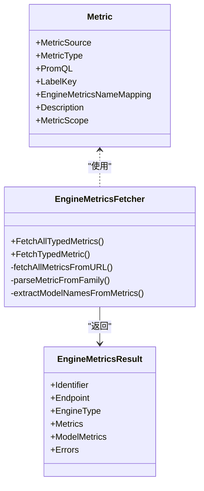
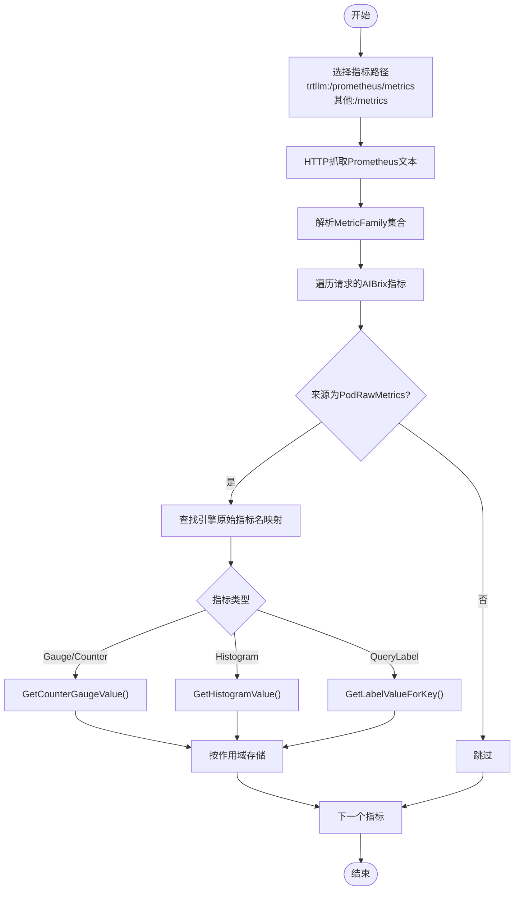
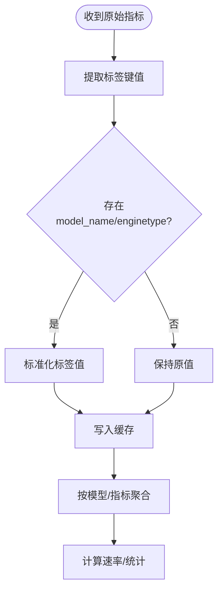
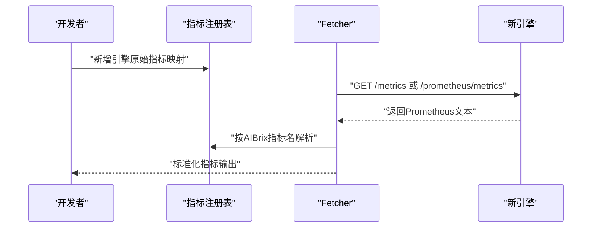
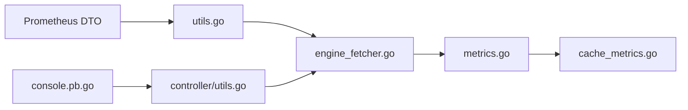

# 引擎指标适配

<cite>
**本文引用的文件**   
- [pkg/metrics/engine_fetcher.go](file://pkg/metrics/engine_fetcher.go)
- [pkg/metrics/types.go](file://pkg/metrics/types.go)
- [pkg/metrics/metrics.go](file://pkg/metrics/metrics.go)
- [pkg/metrics/utils.go](file://pkg/metrics/utils.go)
- [pkg/cache/cache_metrics.go](file://pkg/cache/cache_metrics.go)
- [pkg/constants/model.go](file://pkg/constants/model.go)
- [pkg/controller/modeladapter/utils.go](file://pkg/controller/modeladapter/utils.go)
- [apps/console/api/gen/console/v1/console.pb.go](file://apps/console/api/gen/console/v1/console.pb.go)
</cite>

## 目录
1. [简介](#简介)
2. [项目结构](#项目结构)
3. [核心组件](#核心组件)
4. [架构总览](#架构总览)
5. [详细组件分析](#详细组件分析)
6. [依赖分析](#依赖分析)
7. [性能考虑](#性能考虑)
8. [故障排查指南](#故障排查指南)
9. [结论](#结论)
10. [附录](#附录)

## 简介
本技术文档面向AIBrix引擎指标适配系统，聚焦于多推理引擎（vLLM、SGLang、TensorRT-LLM等）的指标标准化与适配流程。文档从指标定义、适配器实现、数据解析与转换、聚合与标签处理、错误与异常处理等方面进行系统化梳理，并提供扩展指南与性能优化建议。

## 项目结构
围绕引擎指标适配的关键模块如下：
- 指标定义与类型系统：集中定义指标元数据、类型、作用域与来源
- 引擎指标抓取器：统一抓取各引擎/raw指标并解析
- 指标工具集：解析Prometheus文本格式、构建查询、提取标签与值
- 缓存与速率计算：对指标进行速率计算、历史快照管理与标签清洗
- 常量与标签：模型与引擎标签、端口等约定
- 控制器工具：根据引擎类型与运行模式生成访问URL

**图表来源**
- [pkg/metrics/types.go:28-88](file://pkg/metrics/types.go#L28-L88)
- [pkg/metrics/metrics.go:102-796](file://pkg/metrics/metrics.go#L102-L796)
- [pkg/metrics/engine_fetcher.go:51-263](file://pkg/metrics/engine_fetcher.go#L51-L263)
- [pkg/metrics/utils.go:175-257](file://pkg/metrics/utils.go#L175-L257)
- [pkg/cache/cache_metrics.go:1-200](file://pkg/cache/cache_metrics.go#L1-L200)
- [pkg/controller/modeladapter/utils.go:118-158](file://pkg/controller/modeladapter/utils.go#L118-L158)
- [apps/console/api/gen/console/v1/console.pb.go:1827-1836](file://apps/console/api/gen/console/v1/console.pb.go#L1827-L1836)

**章节来源**
- [pkg/metrics/types.go:28-88](file://pkg/metrics/types.go#L28-L88)
- [pkg/metrics/metrics.go:102-796](file://pkg/metrics/metrics.go#L102-L796)
- [pkg/metrics/engine_fetcher.go:51-263](file://pkg/metrics/engine_fetcher.go#L51-L263)
- [pkg/metrics/utils.go:175-257](file://pkg/metrics/utils.go#L175-L257)
- [pkg/cache/cache_metrics.go:1-200](file://pkg/cache/cache_metrics.go#L1-L200)
- [pkg/controller/modeladapter/utils.go:118-158](file://pkg/controller/modeladapter/utils.go#L118-L158)
- [apps/console/api/gen/console/v1/console.pb.go:1827-1836](file://apps/console/api/gen/console/v1/console.pb.go#L1827-L1836)

## 核心组件
- 指标注册表与类型系统
  - 定义指标来源（PodRawMetrics/PrometheusEndpoint）、类型（Gauge/Counter/Histogram/QueryLabel）、作用域（Pod/Model/PodModel），以及AIBrix标准指标名与引擎原始指标名的映射。
- 引擎指标抓取器
  - 统一抓取引擎指标端点，按需重试，解析Prometheus文本格式，提取指定指标值或模型级指标集合。
- 指标解析与查询工具
  - 支持从Prometheus文本响应中解析直方图、计数器/仪表盘、标签键值；支持动态构建PromQL查询模板。
- 缓存与速率计算
  - 对指标进行历史快照存储、速率计算与标签清洗，确保跨引擎标签一致性。
- 控制面URL构建
  - 根据引擎类型与是否使用sidecar，生成模型列表、加载/卸载LoRA等API路径。

**章节来源**
- [pkg/metrics/metrics.go:102-796](file://pkg/metrics/metrics.go#L102-L796)
- [pkg/metrics/types.go:28-88](file://pkg/metrics/types.go#L28-L88)
- [pkg/metrics/engine_fetcher.go:51-263](file://pkg/metrics/engine_fetcher.go#L51-L263)
- [pkg/metrics/utils.go:175-257](file://pkg/metrics/utils.go#L175-L257)
- [pkg/cache/cache_metrics.go:1-200](file://pkg/cache/cache_metrics.go#L1-L200)
- [pkg/controller/modeladapter/utils.go:118-158](file://pkg/controller/modeladapter/utils.go#L118-L158)

## 架构总览
下图展示从引擎指标端点到AIBrix标准指标的完整链路：抓取器获取原始指标，解析器按类型提取值，注册表驱动标准化映射，缓存层完成聚合与标签清洗。

**图表来源**
- [pkg/metrics/engine_fetcher.go:159-263](file://pkg/metrics/engine_fetcher.go#L159-L263)
- [pkg/metrics/utils.go:249-257](file://pkg/metrics/utils.go#L249-L257)
- [pkg/metrics/metrics.go:102-796](file://pkg/metrics/metrics.go#L102-L796)
- [pkg/cache/cache_metrics.go:535-580](file://pkg/cache/cache_metrics.go#L535-L580)

## 详细组件分析

### 指标注册与标准化映射
- 指标来源与类型
  - PodRawMetrics：直接从引擎Pod的/metrics或/trtllm专用路径抓取
  - PrometheusEndpoint：通过PromQL在远端Prometheus查询派生指标
  - QueryLabel：从raw指标中抽取标签值
- 标准化映射
  - 以AIBrix标准指标名为键，记录引擎类型到原始指标名的映射，覆盖vllm、sglang、trtllm等
- 作用域
  - Pod/Model/PodModel三类作用域，决定指标是按Pod聚合还是按模型聚合

**图表来源**
- [pkg/metrics/metrics.go:102-796](file://pkg/metrics/metrics.go#L102-L796)
- [pkg/metrics/engine_fetcher.go:51-263](file://pkg/metrics/engine_fetcher.go#L51-L263)

**章节来源**
- [pkg/metrics/metrics.go:102-796](file://pkg/metrics/metrics.go#L102-L796)
- [pkg/metrics/types.go:28-88](file://pkg/metrics/types.go#L28-L88)

### 引擎指标抓取器与解析流程
- 抓取策略
  - 针对trtllm使用/prometheus/metrics，其他引擎使用/metrics
  - 支持指数回退重试，避免瞬时失败影响观测
- 解析策略
  - raw指标：按Gauge/Counter/Histogram分别解析
  - label查询：从raw指标中提取指定标签键值
  - 模型级指标：从raw指标标签中提取model_name，形成“模型/指标”键空间
- 错误处理
  - 记录失败原因并汇总到结果中的Errors字段

**图表来源**
- [pkg/metrics/engine_fetcher.go:89-332](file://pkg/metrics/engine_fetcher.go#L89-L332)
- [pkg/metrics/utils.go:175-219](file://pkg/metrics/utils.go#L175-L219)

**章节来源**
- [pkg/metrics/engine_fetcher.go:89-332](file://pkg/metrics/engine_fetcher.go#L89-L332)
- [pkg/metrics/utils.go:175-219](file://pkg/metrics/utils.go#L175-L219)

### 指标标准化与标签处理
- 标签清洗
  - 将model_name与engine_type标准化，必要时回退至Pod标签
- 速率计算与历史快照
  - 历史窗口与最大条目限制，定期清理过期条目，防止内存膨胀
- 聚合与模型级指标
  - 从raw指标中提取model_name，生成“模型/指标”的键空间

**图表来源**
- [pkg/cache/cache_metrics.go:535-580](file://pkg/cache/cache_metrics.go#L535-L580)
- [pkg/metrics/utils.go:175-182](file://pkg/metrics/utils.go#L175-L182)

**章节来源**
- [pkg/cache/cache_metrics.go:535-580](file://pkg/cache/cache_metrics.go#L535-L580)
- [pkg/metrics/utils.go:175-182](file://pkg/metrics/utils.go#L175-L182)

### 引擎特定处理逻辑
- vLLM
  - 支持num_requests_running/waiting/swapped、engine_sleep_state、HTTP请求数、预填/解码队列长度、各类耗时直方图、吞吐、KV缓存利用率等
- SGLang
  - 支持num_running_reqs/queue_reqs/retracted_reqs、e2e/request阶段耗时、吞吐等
- TensorRT-LLM
  - 使用/prometheus/metrics路径；支持e2e耗时、队列时延、KV缓存利用率/命中率、TTFT/TPOT等
- 标签与模型名
  - 通过raw指标中的model_name标签进行模型级聚合
- 时间戳与速率
  - 通过历史快照与PromQL派生指标实现近似实时速率与分位数

**章节来源**
- [pkg/metrics/metrics.go:102-796](file://pkg/metrics/metrics.go#L102-L796)
- [pkg/metrics/engine_fetcher.go:89-96](file://pkg/metrics/engine_fetcher.go#L89-L96)
- [pkg/cache/cache_metrics.go:1-200](file://pkg/cache/cache_metrics.go#L1-L200)

### 扩展指南：新增引擎支持
- 步骤
  - 在指标注册表中为新引擎添加原始指标名映射
  - 若使用/trtllm专用路径，更新路径选择逻辑
  - 如需PromQL派生指标，补充PromQL模板与占位符
  - 如需从raw指标抽取标签，确认标签键名一致
- 配置与验证
  - 通过控制面配置引擎类型与版本，确保MetricsEndpoint正确
  - 单元测试覆盖抓取、解析、聚合与标签清洗流程

**图表来源**
- [pkg/metrics/metrics.go:102-796](file://pkg/metrics/metrics.go#L102-L796)
- [pkg/metrics/engine_fetcher.go:89-96](file://pkg/metrics/engine_fetcher.go#L89-L96)

**章节来源**
- [pkg/metrics/metrics.go:102-796](file://pkg/metrics/metrics.go#L102-L796)
- [apps/console/api/gen/console/v1/console.pb.go:1827-1836](file://apps/console/api/gen/console/v1/console.pb.go#L1827-L1836)

## 依赖分析
- 指标注册表依赖Prometheus客户端模型（dto）
- 抓取器依赖HTTP客户端与expfmt解析器
- 缓存层依赖Kubernetes标签与环境变量配置
- 控制器工具依赖引擎类型常量与运行模式判断

**图表来源**
- [pkg/metrics/utils.go:250-257](file://pkg/metrics/utils.go#L250-L257)
- [pkg/metrics/engine_fetcher.go:19-29](file://pkg/metrics/engine_fetcher.go#L19-L29)
- [pkg/metrics/metrics.go:102-796](file://pkg/metrics/metrics.go#L102-L796)
- [pkg/cache/cache_metrics.go:1-200](file://pkg/cache/cache_metrics.go#L1-L200)
- [pkg/controller/modeladapter/utils.go:118-158](file://pkg/controller/modeladapter/utils.go#L118-L158)
- [apps/console/api/gen/console/v1/console.pb.go:1827-1836](file://apps/console/api/gen/console/v1/console.pb.go#L1827-L1836)

**章节来源**
- [pkg/metrics/utils.go:250-257](file://pkg/metrics/utils.go#L250-L257)
- [pkg/metrics/engine_fetcher.go:19-29](file://pkg/metrics/engine_fetcher.go#L19-L29)
- [pkg/metrics/metrics.go:102-796](file://pkg/metrics/metrics.go#L102-L796)
- [pkg/cache/cache_metrics.go:1-200](file://pkg/cache/cache_metrics.go#L1-L200)
- [pkg/controller/modeladapter/utils.go:118-158](file://pkg/controller/modeladapter/utils.go#L118-L158)
- [apps/console/api/gen/console/v1/console.pb.go:1827-1836](file://apps/console/api/gen/console/v1/console.pb.go#L1827-L1836)

## 性能考虑
- 抓取与解析
  - 合理设置超时与重试间隔，避免频繁失败导致观测延迟
  - 对直方图与计数器采用批量解析，减少多次HTTP往返
- 聚合与缓存
  - 控制历史快照数量与保留时长，避免内存增长
  - 对高频指标采用滑动窗口与采样策略
- 查询优化
  - PromQL尽量限定实例与模型维度，减少匹配范围
  - 复用已解析的MetricFamily，避免重复解析

[本节为通用指导，无需具体文件引用]

## 故障排查指南
- 抓取失败
  - 检查引擎端点路径（trtllm使用/prometheus/metrics）
  - 查看HTTP状态码分类与上下文错误
- 解析失败
  - 确认原始指标名映射是否存在
  - 检查直方图/_sum/_count/_bucket命名是否符合预期
- 标签缺失
  - 确认raw指标中是否存在model_name等关键标签
  - 回退逻辑：若缺失则保留原始值或使用默认值
- 速率异常
  - 检查历史快照是否被清理过早
  - 确认PromQL派生指标的时间窗口与采样频率

**章节来源**
- [pkg/metrics/engine_fetcher.go:357-382](file://pkg/metrics/engine_fetcher.go#L357-L382)
- [pkg/metrics/utils.go:268-310](file://pkg/metrics/utils.go#L268-L310)
- [pkg/cache/cache_metrics.go:535-580](file://pkg/cache/cache_metrics.go#L535-L580)

## 结论
AIBrix引擎指标适配系统通过统一的指标注册表与类型系统，结合可扩展的抓取器与解析器，实现了对vLLM、SGLang、TensorRT-LLM等引擎的标准化指标采集与聚合。通过标签清洗、速率计算与历史快照管理，系统能够在多引擎环境下提供一致的可观测性体验。扩展新引擎时，只需完善映射与路径配置，并通过测试验证抓取、解析与聚合流程即可快速上线。

[本节为总结，无需具体文件引用]

## 附录
- 关键常量与标签
  - 模型标签键：name、engine、metric-port、port、adapter.enabled
  - 默认指标端口与引擎回退值
- 控制面配置
  - EngineSpec.Type支持"vllm"|"sglang"|"trtllm"|...，用于识别引擎类型

**章节来源**
- [pkg/constants/model.go:22-53](file://pkg/constants/model.go#L22-L53)
- [apps/console/api/gen/console/v1/console.pb.go:1827-1836](file://apps/console/api/gen/console/v1/console.pb.go#L1827-L1836)