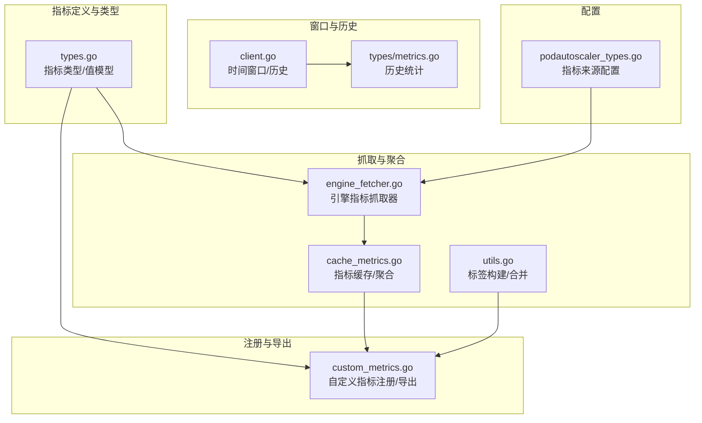
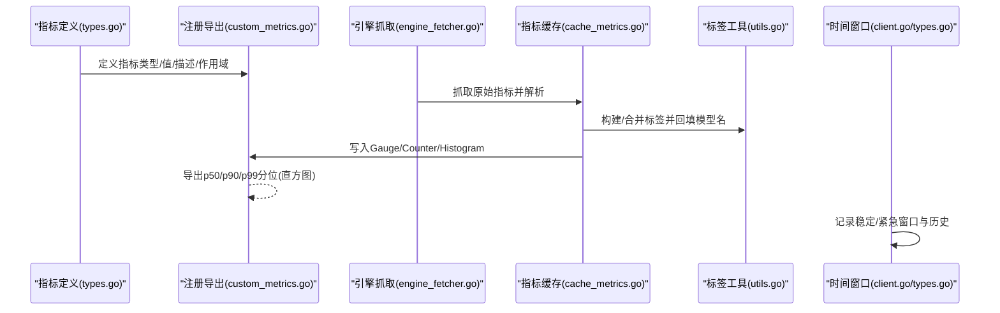
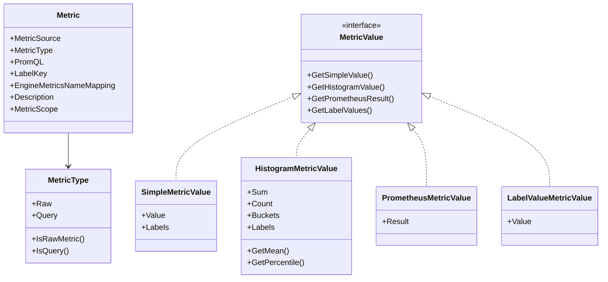
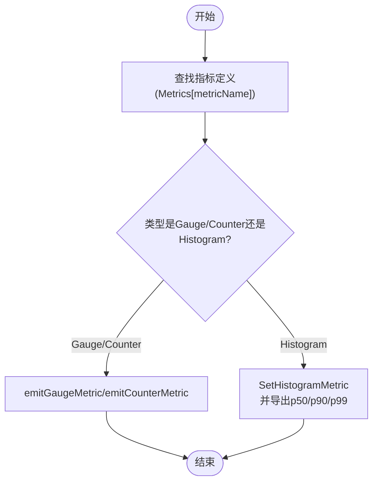
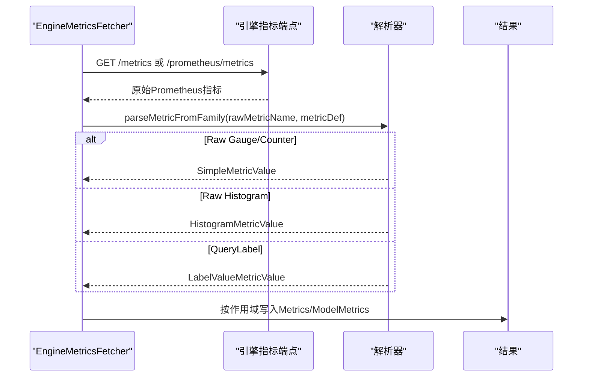
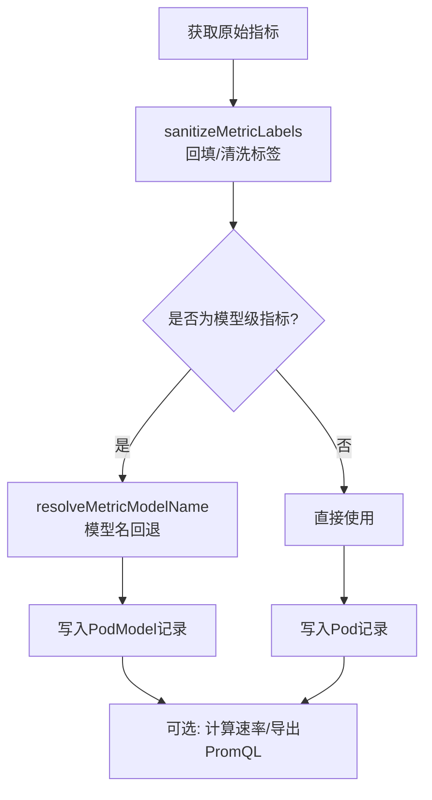
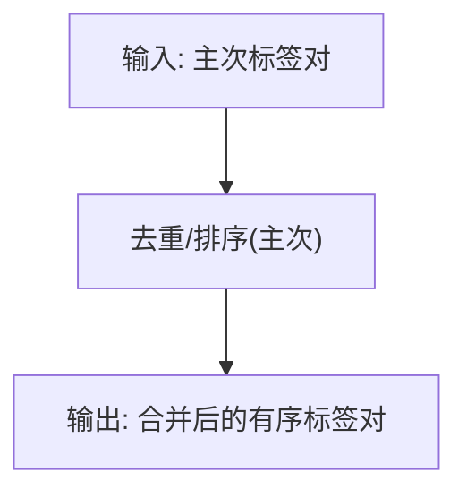
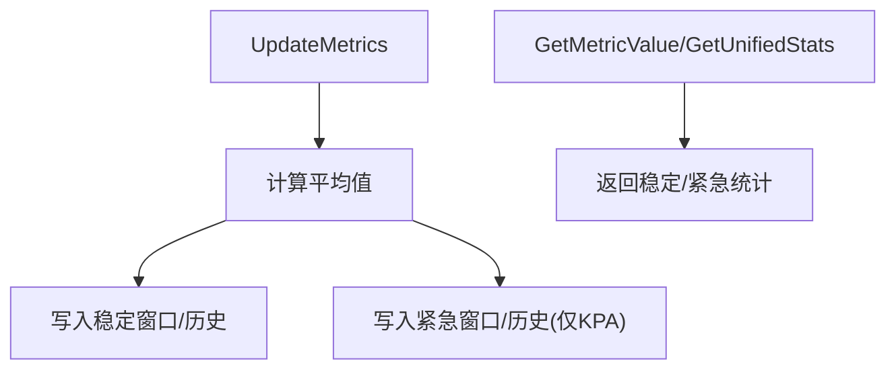
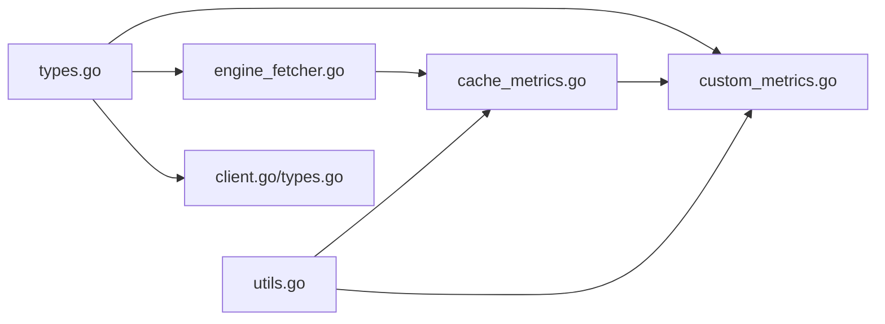

# 指标定义与注册

<cite>
**本文引用的文件**
- [pkg/metrics/types.go](file://pkg/metrics/types.go)
- [pkg/metrics/custom_metrics.go](file://pkg/metrics/custom_metrics.go)
- [pkg/metrics/engine_fetcher.go](file://pkg/metrics/engine_fetcher.go)
- [pkg/cache/cache_metrics.go](file://pkg/cache/cache_metrics.go)
- [pkg/cache/utils.go](file://pkg/cache/utils.go)
- [pkg/controller/podautoscaler/metrics/client.go](file://pkg/controller/podautoscaler/metrics/client.go)
- [pkg/controller/podautoscaler/types/metrics.go](file://pkg/controller/podautoscaler/types/metrics.go)
- [api/autoscaling/v1alpha1/podautoscaler_types.go](file://api/autoscaling/v1alpha1/podautoscaler_types.go)
</cite>

## 目录
1. [简介](#简介)
2. [项目结构](#项目结构)
3. [核心组件](#核心组件)
4. [架构总览](#架构总览)
5. [详细组件分析](#详细组件分析)
6. [依赖分析](#依赖分析)
7. [性能考量](#性能考量)
8. [故障排查指南](#故障排查指南)
9. [结论](#结论)
10. [附录：指标定义最佳实践](#附录指标定义最佳实践)

## 简介
本文件面向AIBrix指标定义与注册系统，系统性梳理指标常量、指标类型与作用域、注册机制、映射表结构、引擎名称映射、描述与标签配置，并给出指标分类体系（原始指标 vs 查询指标）、来源类型（Pod原始指标、Prometheus端点）与作用域分类（Pod、PodModel），最后提供命名规范、标签设计、性能与兼容性最佳实践。

## 项目结构
围绕指标定义与注册的关键模块分布如下：
- 指标类型与值模型：pkg/metrics/types.go
- 自定义指标注册与导出：pkg/metrics/custom_metrics.go
- 引擎指标抓取器：pkg/metrics/engine_fetcher.go
- 指标缓存与聚合：pkg/cache/cache_metrics.go
- 标签构建与合并：pkg/cache/utils.go
- Pod自动伸缩指标窗口与历史：pkg/controller/podautoscaler/metrics/client.go、types/metrics.go
- 指标来源配置（API CRD）：api/autoscaling/v1alpha1/podautoscaler_types.go

**图表来源**
- [pkg/metrics/types.go:1-305](file://pkg/metrics/types.go#L1-L305)
- [pkg/metrics/custom_metrics.go:1-390](file://pkg/metrics/custom_metrics.go#L1-L390)
- [pkg/metrics/engine_fetcher.go:1-383](file://pkg/metrics/engine_fetcher.go#L1-L383)
- [pkg/cache/cache_metrics.go:1-581](file://pkg/cache/cache_metrics.go#L1-L581)
- [pkg/cache/utils.go:1-237](file://pkg/cache/utils.go#L1-L237)
- [pkg/controller/podautoscaler/metrics/client.go:1-277](file://pkg/controller/podautoscaler/metrics/client.go#L1-L277)
- [pkg/controller/podautoscaler/types/metrics.go:1-125](file://pkg/controller/podautoscaler/types/metrics.go#L1-L125)
- [api/autoscaling/v1alpha1/podautoscaler_types.go:123-152](file://api/autoscaling/v1alpha1/podautoscaler_types.go#L123-L152)

**章节来源**
- [pkg/metrics/types.go:1-305](file://pkg/metrics/types.go#L1-L305)
- [pkg/metrics/custom_metrics.go:1-390](file://pkg/metrics/custom_metrics.go#L1-L390)
- [pkg/metrics/engine_fetcher.go:1-383](file://pkg/metrics/engine_fetcher.go#L1-L383)
- [pkg/cache/cache_metrics.go:1-581](file://pkg/cache/cache_metrics.go#L1-L581)
- [pkg/cache/utils.go:1-237](file://pkg/cache/utils.go#L1-L237)
- [pkg/controller/podautoscaler/metrics/client.go:1-277](file://pkg/controller/podautoscaler/metrics/client.go#L1-L277)
- [pkg/controller/podautoscaler/types/metrics.go:1-125](file://pkg/controller/podautoscaler/types/metrics.go#L1-L125)
- [api/autoscaling/v1alpha1/podautoscaler_types.go:123-152](file://api/autoscaling/v1alpha1/podautoscaler_types.go#L123-L152)

## 核心组件
- 指标类型与值模型：定义指标来源（Pod原始指标、Prometheus端点）、指标类型（Gauge、Counter、Histogram、PromQL、QueryLabel）、作用域（Pod、Model、PodModel），以及统一的MetricValue接口与具体实现。
- 注册与导出：通过自定义指标注册器将指标值写入Prometheus，支持Gauge/Counter/Histogram，并在Histogram时自动导出p50/p90/p99分位。
- 引擎指标抓取器：从引擎Pod的指标端点拉取原始指标，按中心化注册表进行类型解析与作用域划分（Pod/PodModel）。
- 指标缓存与聚合：维护计数器/直方图/标签查询等指标清单，负责标签回填与模型名回退，支持PromQL查询与速率计算。
- 标签构建与合并：统一构建默认标签集（namespace、pod、model、engine_type、roleset、role、role_replica_index、gateway_pod），并处理重复键与优先级覆盖。
- 时间窗口与历史：为自动伸缩提供稳定/紧急窗口与历史统计，支持均值、最小、最大与方差等统计量。

**章节来源**
- [pkg/metrics/types.go:28-88](file://pkg/metrics/types.go#L28-L88)
- [pkg/metrics/custom_metrics.go:33-335](file://pkg/metrics/custom_metrics.go#L33-L335)
- [pkg/metrics/engine_fetcher.go:51-87](file://pkg/metrics/engine_fetcher.go#L51-L87)
- [pkg/cache/cache_metrics.go:52-124](file://pkg/cache/cache_metrics.go#L52-L124)
- [pkg/cache/utils.go:55-140](file://pkg/cache/utils.go#L55-L140)
- [pkg/controller/podautoscaler/metrics/client.go:75-187](file://pkg/controller/podautoscaler/metrics/client.go#L75-L187)
- [pkg/controller/podautoscaler/types/metrics.go:63-125](file://pkg/controller/podautoscaler/types/metrics.go#L63-L125)

## 架构总览
下图展示指标从“定义—注册—抓取—导出”的全链路：

**图表来源**
- [pkg/metrics/types.go:28-88](file://pkg/metrics/types.go#L28-L88)
- [pkg/metrics/custom_metrics.go:308-335](file://pkg/metrics/custom_metrics.go#L308-L335)
- [pkg/metrics/engine_fetcher.go:98-263](file://pkg/metrics/engine_fetcher.go#L98-L263)
- [pkg/cache/cache_metrics.go:475-510](file://pkg/cache/cache_metrics.go#L475-L510)
- [pkg/cache/utils.go:55-140](file://pkg/cache/utils.go#L55-L140)
- [pkg/controller/podautoscaler/metrics/client.go:106-187](file://pkg/controller/podautoscaler/metrics/client.go#L106-L187)
- [pkg/controller/podautoscaler/types/metrics.go:63-125](file://pkg/controller/podautoscaler/types/metrics.go#L63-L125)

## 详细组件分析

### 指标类型与值模型
- 指标来源：PodRawMetrics（从Pod指标端口抓取）、PrometheusEndpoint（从远端Prometheus查询）。
- 指标类型：Raw（Gauge/Counter/Histogram）与Query（PromQL、QueryLabel）。
- 作用域：Pod、Model、PodModel。
- 统一值接口：MetricValue，包含简单值、直方图、PromQL结果、标签值等。

**图表来源**
- [pkg/metrics/types.go:79-101](file://pkg/metrics/types.go#L79-L101)
- [pkg/metrics/types.go:103-124](file://pkg/metrics/types.go#L103-L124)
- [pkg/metrics/types.go:125-171](file://pkg/metrics/types.go#L125-L171)
- [pkg/metrics/types.go:239-279](file://pkg/metrics/types.go#L239-L279)

**章节来源**
- [pkg/metrics/types.go:28-88](file://pkg/metrics/types.go#L28-L88)
- [pkg/metrics/types.go:90-101](file://pkg/metrics/types.go#L90-L101)
- [pkg/metrics/types.go:103-171](file://pkg/metrics/types.go#L103-L171)
- [pkg/metrics/types.go:239-279](file://pkg/metrics/types.go#L239-L279)

### 注册与导出机制
- 全局注册表：以指标名为键，延迟创建GaugeVec/CounterVec/HistogramCollector，保证标签顺序一致与去重。
- 导出策略：根据MetricType.Raw选择Gauge/Counter或Histogram；Histogram自动导出p50/p90/p99分位作为独立Gauge。
- 帮助信息：通过GetMetricHelp从注册表读取Description用于Prometheus帮助文本。

**图表来源**
- [pkg/metrics/custom_metrics.go:308-335](file://pkg/metrics/custom_metrics.go#L308-L335)
- [pkg/metrics/custom_metrics.go:49-155](file://pkg/metrics/custom_metrics.go#L49-L155)
- [pkg/metrics/custom_metrics.go:157-255](file://pkg/metrics/custom_metrics.go#L157-L255)

**章节来源**
- [pkg/metrics/custom_metrics.go:33-90](file://pkg/metrics/custom_metrics.go#L33-L90)
- [pkg/metrics/custom_metrics.go:96-155](file://pkg/metrics/custom_metrics.go#L96-L155)
- [pkg/metrics/custom_metrics.go:157-255](file://pkg/metrics/custom_metrics.go#L157-L255)
- [pkg/metrics/custom_metrics.go:308-335](file://pkg/metrics/custom_metrics.go#L308-L335)

### 引擎指标抓取器
- 支持单指标与批量抓取，带指数退避重试；对trtllm使用特定路径。
- 解析逻辑：依据指标定义的MetricType.Raw或Query，分别解析为Simple/Histogram/Label值。
- 作用域划分：Pod/PodModel两类，PodModel需从原始指标中提取model_name并生成“model/metric”键。

**图表来源**
- [pkg/metrics/engine_fetcher.go:98-157](file://pkg/metrics/engine_fetcher.go#L98-L157)
- [pkg/metrics/engine_fetcher.go:159-263](file://pkg/metrics/engine_fetcher.go#L159-L263)
- [pkg/metrics/engine_fetcher.go:289-332](file://pkg/metrics/engine_fetcher.go#L289-L332)

**章节来源**
- [pkg/metrics/engine_fetcher.go:51-87](file://pkg/metrics/engine_fetcher.go#L51-L87)
- [pkg/metrics/engine_fetcher.go:98-157](file://pkg/metrics/engine_fetcher.go#L98-L157)
- [pkg/metrics/engine_fetcher.go:159-263](file://pkg/metrics/engine_fetcher.go#L159-L263)
- [pkg/metrics/engine_fetcher.go:289-332](file://pkg/metrics/engine_fetcher.go#L289-L332)

### 指标缓存与聚合
- 指标清单：计数器/直方图/标签查询/PromQL四类指标名集合，便于统一处理。
- 标签回填：若原始标签缺失或为占位符，回退到Pod标签（如model、engine_type）。
- 模型名回退：当指标携带的model为空或未定义时，尝试从Pod标签获取。
- 速率计算：基于历史快照计算每秒速率，支持1分钟近似窗口。

**图表来源**
- [pkg/cache/cache_metrics.go:475-510](file://pkg/cache/cache_metrics.go#L475-L510)
- [pkg/cache/cache_metrics.go:521-547](file://pkg/cache/cache_metrics.go#L521-L547)
- [pkg/cache/utils.go:55-89](file://pkg/cache/utils.go#L55-L89)
- [pkg/cache/utils.go:201-225](file://pkg/cache/utils.go#L201-L225)

**章节来源**
- [pkg/cache/cache_metrics.go:52-124](file://pkg/cache/cache_metrics.go#L52-L124)
- [pkg/cache/cache_metrics.go:475-510](file://pkg/cache/cache_metrics.go#L475-L510)
- [pkg/cache/cache_metrics.go:521-547](file://pkg/cache/cache_metrics.go#L521-L547)
- [pkg/cache/utils.go:55-89](file://pkg/cache/utils.go#L55-L89)
- [pkg/cache/utils.go:201-225](file://pkg/cache/utils.go#L201-L225)

### 标签构建与合并
- 默认标签集：namespace、pod、model、engine_type、roleset、role、role_replica_index、gateway_pod。
- 合并策略：主次标签合并，同名键以次级值为准（last-wins），并去重排序，避免重复标签导致注册失败。

**图表来源**
- [pkg/cache/utils.go:55-89](file://pkg/cache/utils.go#L55-L89)
- [pkg/cache/utils.go:79-140](file://pkg/cache/utils.go#L79-L140)

**章节来源**
- [pkg/cache/utils.go:55-89](file://pkg/cache/utils.go#L55-L89)
- [pkg/cache/utils.go:79-140](file://pkg/cache/utils.go#L79-L140)

### 时间窗口与历史统计
- 窗口：稳定窗口与紧急窗口并存，自动初始化；支持记录平均值、最小值、最大值。
- 历史：维护固定窗口的历史点，计算均值、方差、标准差等统计量。
- 用途：为KPA/APA提供窗口统计与趋势分析基础。

**图表来源**
- [pkg/controller/podautoscaler/metrics/client.go:106-187](file://pkg/controller/podautoscaler/metrics/client.go#L106-L187)
- [pkg/controller/podautoscaler/types/metrics.go:63-125](file://pkg/controller/podautoscaler/types/metrics.go#L63-L125)

**章节来源**
- [pkg/controller/podautoscaler/metrics/client.go:75-187](file://pkg/controller/podautoscaler/metrics/client.go#L75-L187)
- [pkg/controller/podautoscaler/types/metrics.go:63-125](file://pkg/controller/podautoscaler/types/metrics.go#L63-L125)

## 依赖分析
- 类型依赖：所有指标相关能力均依赖types.go中的类型与值模型。
- 注册依赖：custom_metrics依赖types中的Metric定义与描述信息。
- 抓取依赖：engine_fetcher依赖types中的类型与值模型，以及中心化注册表。
- 缓存依赖：cache_metrics依赖custom_metrics的导出函数与utils的标签工具。
- 窗口依赖：autoscaler侧的窗口与历史统计相互独立于核心指标系统。

**图表来源**
- [pkg/metrics/types.go:1-305](file://pkg/metrics/types.go#L1-L305)
- [pkg/metrics/custom_metrics.go:1-390](file://pkg/metrics/custom_metrics.go#L1-L390)
- [pkg/metrics/engine_fetcher.go:1-383](file://pkg/metrics/engine_fetcher.go#L1-L383)
- [pkg/cache/cache_metrics.go:1-581](file://pkg/cache/cache_metrics.go#L1-L581)
- [pkg/cache/utils.go:1-237](file://pkg/cache/utils.go#L1-L237)
- [pkg/controller/podautoscaler/metrics/client.go:1-277](file://pkg/controller/podautoscaler/metrics/client.go#L1-L277)
- [pkg/controller/podautoscaler/types/metrics.go:1-125](file://pkg/controller/podautoscaler/types/metrics.go#L1-L125)

**章节来源**
- [pkg/metrics/types.go:1-305](file://pkg/metrics/types.go#L1-L305)
- [pkg/metrics/custom_metrics.go:1-390](file://pkg/metrics/custom_metrics.go#L1-L390)
- [pkg/metrics/engine_fetcher.go:1-383](file://pkg/metrics/engine_fetcher.go#L1-L383)
- [pkg/cache/cache_metrics.go:1-581](file://pkg/cache/cache_metrics.go#L1-L581)
- [pkg/cache/utils.go:1-237](file://pkg/cache/utils.go#L1-L237)
- [pkg/controller/podautoscaler/metrics/client.go:1-277](file://pkg/controller/podautoscaler/metrics/client.go#L1-L277)
- [pkg/controller/podautoscaler/types/metrics.go:1-125](file://pkg/controller/podautoscaler/types/metrics.go#L1-L125)

## 性能考量
- 注册开销：延迟创建GaugeVec/CounterVec/HistogramCollector，避免重复注册与标签顺序问题。
- 并发安全：全局注册表使用读写锁保护，确保高并发下的稳定性。
- 速率计算：历史快照上限与窗口大小限制，防止内存无限增长。
- 抓取重试：指数退避减少抖动，超时控制降低阻塞风险。
- 标签合并：去重与last-wins策略减少冗余标签，避免Prometheus注册失败。

[本节为通用指导，无需特定文件来源]

## 故障排查指南
- 指标未出现：检查指标定义是否存在且描述存在；确认注册器已创建对应指标。
- 标签异常：检查标签合并逻辑，确认同名键是否被正确覆盖；验证默认标签集是否完整。
- 引擎指标缺失：确认引擎类型与指标名映射；检查端点路径与权限；查看抓取器错误日志。
- 速率计算为负：检查历史数据点数量与时间戳；确认计数器未回绕或重置。
- Prometheus查询失败：检查PROMETHEUS_ENDPOINT与认证配置；确认查询间隔与超时设置合理。

**章节来源**
- [pkg/metrics/custom_metrics.go:257-263](file://pkg/metrics/custom_metrics.go#L257-L263)
- [pkg/cache/utils.go:79-140](file://pkg/cache/utils.go#L79-L140)
- [pkg/metrics/engine_fetcher.go:357-382](file://pkg/metrics/engine_fetcher.go#L357-L382)
- [pkg/cache/utils.go:201-225](file://pkg/cache/utils.go#L201-L225)

## 结论
AIBrix指标系统通过中心化的类型与值模型、延迟注册与导出、引擎指标抓取与标签回填、以及时间窗口与历史统计，实现了对原始指标与查询指标的统一管理。清晰的来源类型与作用域分类，配合完善的标签策略与性能优化，为自动伸缩与可观测性提供了坚实基础。

[本节为总结，无需特定文件来源]

## 附录：指标定义最佳实践
- 命名规范
  - 使用清晰语义的指标名，避免缩写；采用小写与下划线组合。
  - 直方图建议以“_seconds/_tokens”等单位后缀结尾，便于PromQL处理。
- 标签设计
  - 固定使用默认标签集（namespace、pod、model、engine_type、roleset、role、role_replica_index、gateway_pod）。
  - 避免重复标签键；若需扩展，确保与默认标签不冲突。
- 指标类型选择
  - 快照值用Gauge；单调递增用Counter；分布用Histogram；复杂聚合用PromQL；从原始指标抽取标签值用QueryLabel。
- 来源与作用域
  - 原始指标：明确引擎类型到指标名的映射；区分Pod/PodModel作用域。
  - 查询指标：编写稳定的PromQL表达式；注意时序与采样间隔。
- 性能与兼容
  - 控制标签基数，避免高基数标签导致查询膨胀。
  - 为不同引擎提供差异化映射，确保抓取兼容性。
  - 设置合理的抓取与查询间隔、超时与重试策略。

[本节为通用指导，无需特定文件来源]