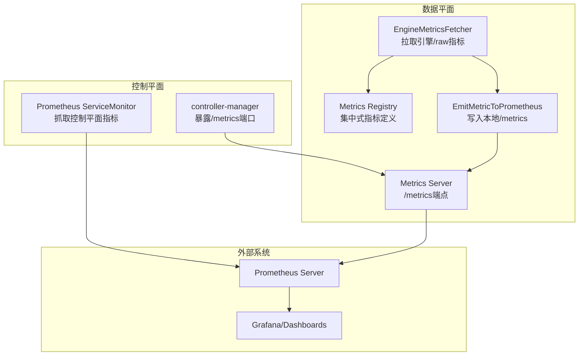
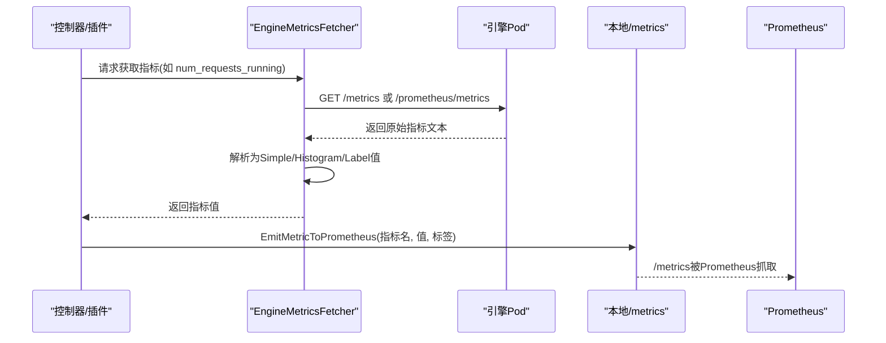
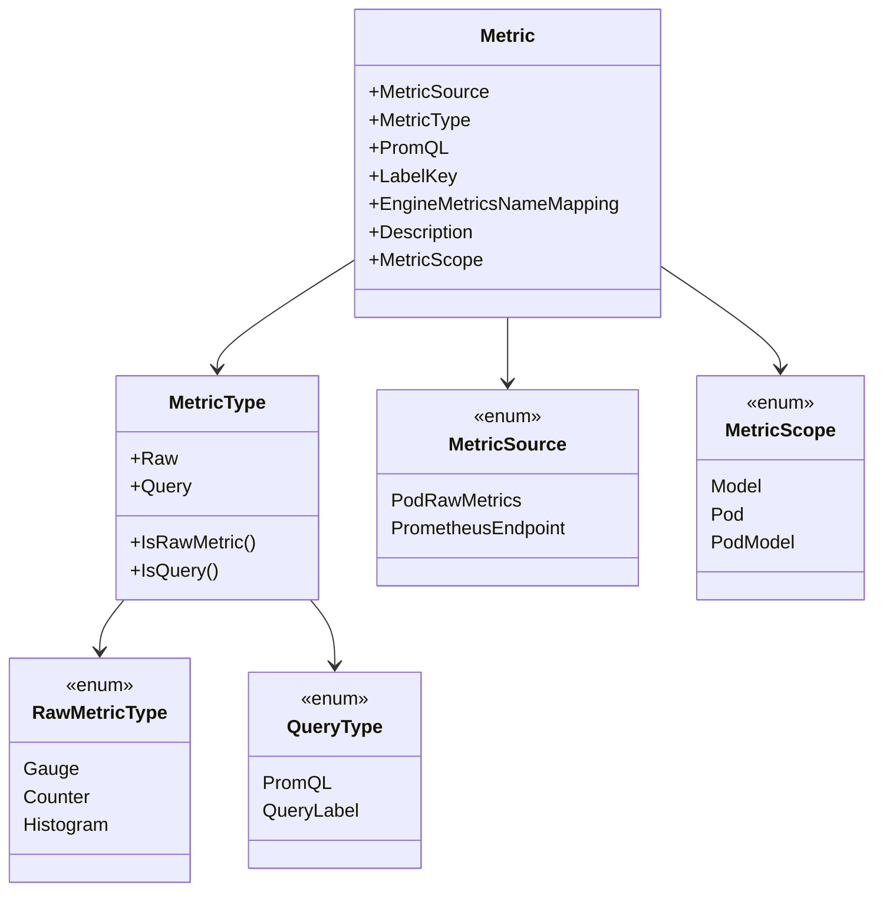
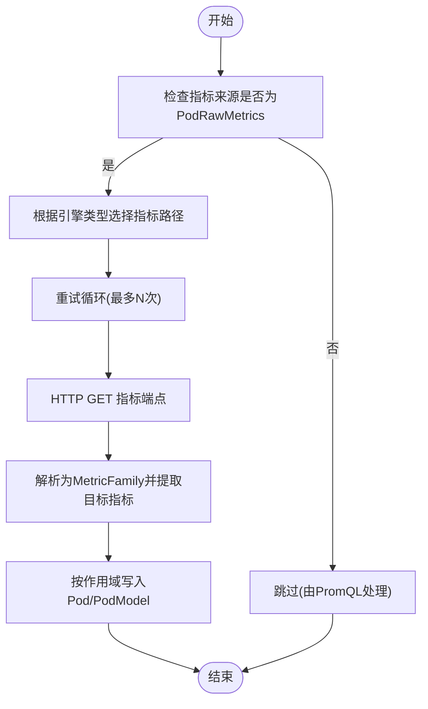
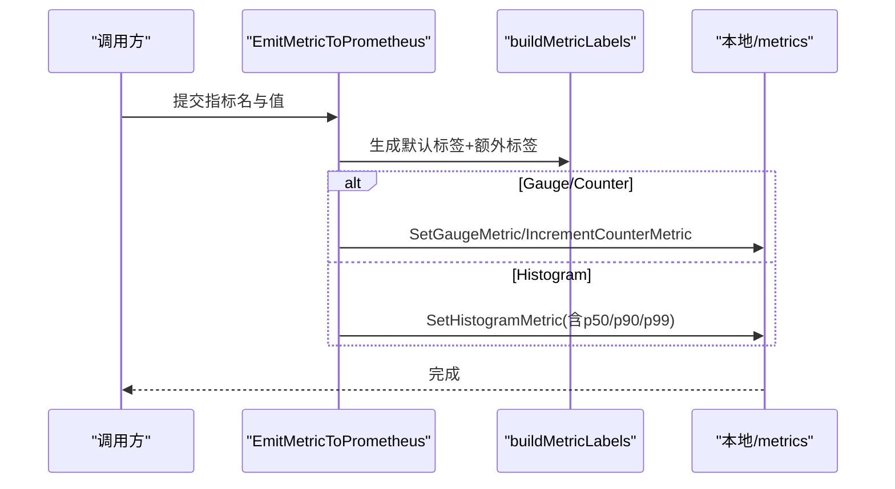
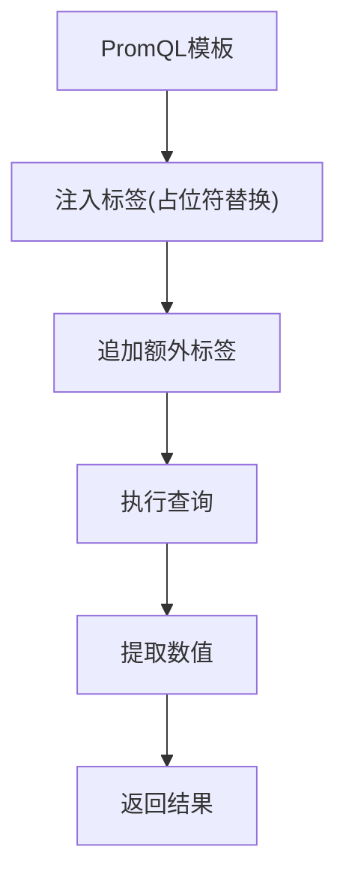
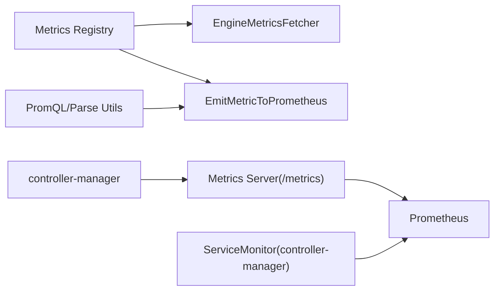

# 指标收集与管理

<cite>
**本文引用的文件**
- [pkg/metrics/metrics.go](file://pkg/metrics/metrics.go)
- [pkg/metrics/types.go](file://pkg/metrics/types.go)
- [pkg/metrics/custom_metrics.go](file://pkg/metrics/custom_metrics.go)
- [pkg/metrics/engine_fetcher.go](file://pkg/metrics/engine_fetcher.go)
- [pkg/metrics/utils.go](file://pkg/metrics/utils.go)
- [pkg/metrics/server.go](file://pkg/metrics/server.go)
- [pkg/constants/metrics.go](file://pkg/constants/metrics.go)
- [config/prometheus/monitor.yaml](file://config/prometheus/monitor.yaml)
- [cmd/controllers/main.go](file://cmd/controllers/main.go)
- [pkg/controller/podautoscaler/monitor/metrics.go](file://pkg/controller/podautoscaler/monitor/metrics.go)
- [pkg/cache/kvcache/metrics.go](file://pkg/cache/kvcache/metrics.go)
</cite>

## 目录
1. [简介](#简介)
2. [项目结构](#项目结构)
3. [核心组件](#核心组件)
4. [架构总览](#架构总览)
5. [详细组件分析](#详细组件分析)
6. [依赖分析](#依赖分析)
7. [性能考虑](#性能考虑)
8. [故障排查指南](#故障排查指南)
9. [结论](#结论)
10. [附录](#附录)

## 简介
本技术文档面向AIBrix指标收集与管理系统，聚焦Prometheus集成架构与指标体系设计，涵盖指标定义、注册机制、查询接口与数据采集流程；详解自定义指标（原始指标与查询指标）的差异、指标作用域与来源分类；阐述多推理引擎指标映射至AIBrix标准格式的机制；提供指标查询API的使用方法（含PromQL语法、标签过滤、时间范围选择）；并给出指标配置示例、性能优化建议与故障排查指南。

## 项目结构
AIBrix通过集中式指标注册表与类型系统，统一管理原始引擎指标与查询型指标，并通过HTTP服务暴露/metrics端点供Prometheus抓取。控制器与插件可按需从引擎Pod或远程Prometheus查询指标，实现跨引擎的一致化观测。

图示来源
- [cmd/controllers/main.go:227-253](file://cmd/controllers/main.go#L227-L253)
- [pkg/metrics/server.go:32-42](file://pkg/metrics/server.go#L32-L42)
- [pkg/metrics/engine_fetcher.go:159-263](file://pkg/metrics/engine_fetcher.go#L159-L263)
- [pkg/metrics/custom_metrics.go:308-335](file://pkg/metrics/custom_metrics.go#L308-L335)
- [config/prometheus/monitor.yaml:12-16](file://config/prometheus/monitor.yaml#L12-L16)

章节来源
- [cmd/controllers/main.go:227-253](file://cmd/controllers/main.go#L227-L253)
- [config/prometheus/monitor.yaml:12-16](file://config/prometheus/monitor.yaml#L12-L16)

## 核心组件
- 指标注册与类型系统：集中定义指标名称、来源、类型、作用域、映射与描述，支持原始指标与查询指标两类。
- 引擎指标抓取器：按引擎类型拉取/raw指标，解析为统一的值类型，支持重试与指数退避。
- 自定义指标发射器：将指标值以标准标签写入本地/metrics端点，支持Gauge/Counter/Histogram。
- Prometheus查询工具：构建PromQL查询模板、注入标签、执行查询并提取数值。
- 指标HTTP服务：提供/metrics端点，供Prometheus抓取。

章节来源
- [pkg/metrics/metrics.go:102-795](file://pkg/metrics/metrics.go#L102-L795)
- [pkg/metrics/types.go:28-305](file://pkg/metrics/types.go#L28-L305)
- [pkg/metrics/engine_fetcher.go:51-383](file://pkg/metrics/engine_fetcher.go#L51-L383)
- [pkg/metrics/custom_metrics.go:33-390](file://pkg/metrics/custom_metrics.go#L33-L390)
- [pkg/metrics/utils.go:123-173](file://pkg/metrics/utils.go#L123-L173)
- [pkg/metrics/server.go:28-61](file://pkg/metrics/server.go#L28-L61)

## 架构总览
AIBrix采用“集中式指标注册 + 多源采集 + 统一发射”的架构：
- 集中式注册表：统一定义指标元数据（来源、类型、作用域、映射），确保跨引擎一致性。
- 原始指标采集：通过EngineMetricsFetcher按引擎类型访问引擎Pod的/metrics或/prometheus/metrics端点，解析为Simple/Histogram/Label值。
- 查询指标采集：通过PromQL在远程Prometheus上查询，返回Scalar/Vector/Matrix结果，再提取数值。
- 指标发射：EmitMetricToPrometheus根据指标类型与作用域，写入本地/metrics端点，自动附加默认标签（命名空间、Pod、模型、引擎类型等）。

图示来源
- [pkg/metrics/engine_fetcher.go:159-263](file://pkg/metrics/engine_fetcher.go#L159-L263)
- [pkg/metrics/custom_metrics.go:308-335](file://pkg/metrics/custom_metrics.go#L308-L335)
- [pkg/metrics/server.go:32-42](file://pkg/metrics/server.go#L32-L42)

## 详细组件分析

### 指标注册与类型系统
- 指标来源与类型
  - 来源：PodRawMetrics（直接从引擎Pod拉取）、PrometheusEndpoint（通过PromQL查询）。
  - 类型：Raw（Gauge/Counter/Histogram）、Query（PromQL/QueryLabel）。
- 指标作用域：Model、Pod、PodModel（Pod内按模型聚合）。
- 映射机制：EngineMetricsNameMapping将AIBrix指标名映射到不同引擎的原始指标名，实现跨引擎统一。
- 示例：num_requests_running、e2e_request_latency_seconds、time_to_first_token_seconds等。

图示来源
- [pkg/metrics/types.go:28-88](file://pkg/metrics/types.go#L28-L88)
- [pkg/metrics/metrics.go:102-795](file://pkg/metrics/metrics.go#L102-L795)

章节来源
- [pkg/metrics/types.go:28-88](file://pkg/metrics/types.go#L28-L88)
- [pkg/metrics/metrics.go:102-795](file://pkg/metrics/metrics.go#L102-L795)

### 引擎指标抓取器（EngineMetricsFetcher）
- 功能：按引擎类型访问引擎Pod指标端点，解析为统一值类型；支持重试与指数退避；支持单指标与批量指标抓取。
- 关键点：
  - 不同引擎使用不同的指标路径（如trtllm使用/prometheus/metrics，其他使用/metrics）。
  - 对于PromQL查询型指标，需走PrometheusEndpoint路径，不在此Fetcher范围内。
  - 支持按模型维度提取模型名，生成Pod+Model级指标键。

图示来源
- [pkg/metrics/engine_fetcher.go:98-157](file://pkg/metrics/engine_fetcher.go#L98-L157)
- [pkg/metrics/engine_fetcher.go:159-263](file://pkg/metrics/engine_fetcher.go#L159-L263)

章节来源
- [pkg/metrics/engine_fetcher.go:51-383](file://pkg/metrics/engine_fetcher.go#L51-L383)

### 自定义指标发射器（EmitMetricToPrometheus）
- 功能：将指标值写入本地/metrics端点，自动附加默认标签（命名空间、Pod、模型、引擎类型、角色集等），并支持额外标签。
- 支持类型：
  - Gauge/Counter：直接设置/累加。
  - Histogram：通过自定义Collector接收直方图快照（count/sum/buckets）。
  - Label：从原始指标中抽取指定标签键值。
- 默认标签生成逻辑：从Pod与路由上下文推导模型名与引擎类型等标签。

图示来源
- [pkg/metrics/custom_metrics.go:308-335](file://pkg/metrics/custom_metrics.go#L308-L335)
- [pkg/metrics/custom_metrics.go:337-390](file://pkg/metrics/custom_metrics.go#L337-L390)

章节来源
- [pkg/metrics/custom_metrics.go:33-390](file://pkg/metrics/custom_metrics.go#L33-L390)

### Prometheus查询工具与API
- 查询构建：BuildQuery支持将模板中的${key}占位符替换为实际标签值，并追加额外标签。
- API初始化：InitializePrometheusAPI基于环境变量或Secret配置Basic Auth，创建Prometheus v1 API客户端。
- 结果提取：ExtractNumericFromPromResult支持从Vector/Scalar/Matrix中提取数值。

图示来源
- [pkg/metrics/utils.go:123-173](file://pkg/metrics/utils.go#L123-L173)
- [pkg/metrics/utils.go:281-305](file://pkg/metrics/utils.go#L281-L305)

章节来源
- [pkg/metrics/utils.go:123-173](file://pkg/metrics/utils.go#L123-L173)
- [pkg/metrics/utils.go:281-305](file://pkg/metrics/utils.go#L281-L305)

### 指标HTTP服务
- 提供/metrics端点，使用promhttp.Handler暴露本地注册的指标。
- 控制器管理器可通过参数启用安全服务与TLS选项。

章节来源
- [pkg/metrics/server.go:28-61](file://pkg/metrics/server.go#L28-L61)
- [cmd/controllers/main.go:227-253](file://cmd/controllers/main.go#L227-L253)

## 依赖分析
- 指标注册表与类型系统是核心依赖，所有采集与发射均围绕其展开。
- EngineMetricsFetcher依赖集中式注册表进行指标定义解析与引擎映射。
- 自定义指标发射器依赖默认标签生成逻辑与Prometheus客户端库。
- Prometheus查询工具依赖client_golang的v1 API与expfmt解析器。
- 控制器管理器负责启动metrics server并与Prometheus ServiceMonitor对接。

图示来源
- [pkg/metrics/metrics.go:102-795](file://pkg/metrics/metrics.go#L102-L795)
- [pkg/metrics/engine_fetcher.go:159-263](file://pkg/metrics/engine_fetcher.go#L159-L263)
- [pkg/metrics/custom_metrics.go:308-335](file://pkg/metrics/custom_metrics.go#L308-L335)
- [pkg/metrics/utils.go:123-173](file://pkg/metrics/utils.go#L123-L173)
- [pkg/metrics/server.go:32-42](file://pkg/metrics/server.go#L32-L42)
- [config/prometheus/monitor.yaml:12-16](file://config/prometheus/monitor.yaml#L12-L16)
- [cmd/controllers/main.go:227-253](file://cmd/controllers/main.go#L227-L253)

章节来源
- [pkg/metrics/metrics.go:102-795](file://pkg/metrics/metrics.go#L102-L795)
- [pkg/metrics/engine_fetcher.go:159-263](file://pkg/metrics/engine_fetcher.go#L159-L263)
- [pkg/metrics/custom_metrics.go:308-335](file://pkg/metrics/custom_metrics.go#L308-L335)
- [pkg/metrics/utils.go:123-173](file://pkg/metrics/utils.go#L123-L173)
- [pkg/metrics/server.go:32-42](file://pkg/metrics/server.go#L32-L42)
- [config/prometheus/monitor.yaml:12-16](file://config/prometheus/monitor.yaml#L12-L16)
- [cmd/controllers/main.go:227-253](file://cmd/controllers/main.go#L227-L253)

## 性能考虑
- 指标抓取重试与退避：EngineMetricsFetcher采用指数退避策略，避免瞬时失败放大影响。
- 批量抓取优先：单指标抓取会先拉取全部指标再解析，建议批量请求以减少网络往返。
- 直方图快照缓存：HistogramCollector按标签键缓存快照，避免重复解析。
- 标签最小化：仅保留必要标签，减少Series数量与内存占用。
- 查询优化：PromQL中尽量使用标签过滤与时间窗口，避免全量扫描。
- 本地/metrics端点：将指标写入本地端点，降低跨节点抓取成本。

## 故障排查指南
- 引擎指标抓取失败
  - 检查引擎类型与指标路径是否匹配（trtllm使用/prometheus/metrics）。
  - 查看HTTP状态码与超时错误，确认网络连通性与证书配置。
  - 观察LLMEngineMetricsQueryFail计数器增长。
- Prometheus查询失败
  - 检查PROMETHEUS_ENDPOINT与Basic Auth配置。
  - 使用BuildQuery验证占位符替换与额外标签拼接。
- 指标未出现在/metrics
  - 确认指标已通过EmitMetricToPrometheus写入且标签完整。
  - 检查默认标签生成逻辑（Pod、模型、引擎类型）。
- 控制器管理器指标未被抓取
  - 确认ServiceMonitor的selector与端口名称一致。
  - 检查controller-manager的metrics绑定地址与安全配置。

章节来源
- [pkg/metrics/engine_fetcher.go:357-383](file://pkg/metrics/engine_fetcher.go#L357-L383)
- [pkg/metrics/utils.go:157-173](file://pkg/metrics/utils.go#L157-L173)
- [pkg/metrics/utils.go:268-310](file://pkg/metrics/utils.go#L268-L310)
- [config/prometheus/monitor.yaml:12-16](file://config/prometheus/monitor.yaml#L12-L16)
- [cmd/controllers/main.go:227-253](file://cmd/controllers/main.go#L227-L253)

## 结论
AIBrix通过集中式指标注册与类型系统，实现了对多推理引擎指标的统一抽象与发射；结合EngineMetricsFetcher与PromQL查询工具，既支持原始指标的高效采集，也支持复杂查询场景的灵活分析；通过/metrics端点与ServiceMonitor，无缝接入Prometheus生态，满足生产级可观测性需求。

## 附录

### 指标作用域与来源分类
- 作用域
  - Model：按模型维度聚合。
  - Pod：按Pod维度聚合。
  - PodModel：Pod内按模型聚合。
- 来源
  - PodRawMetrics：直接从引擎Pod的/metrics或/prometheus/metrics抓取。
  - PrometheusEndpoint：通过PromQL在远程Prometheus查询。

章节来源
- [pkg/metrics/types.go:70-78](file://pkg/metrics/types.go#L70-L78)
- [pkg/metrics/types.go:28-37](file://pkg/metrics/types.go#L28-L37)

### 指标映射机制（多引擎统一）
- 通过EngineMetricsNameMapping将AIBrix指标名映射到不同引擎的原始指标名，实现跨引擎一致性。
- 示例：num_requests_running映射到vllm:xxx与sglang:xxx等。

章节来源
- [pkg/metrics/metrics.go:102-795](file://pkg/metrics/metrics.go#L102-L795)

### 指标查询API使用方法
- PromQL语法
  - 使用PromQL模板（如histogram_quantile、rate、increase等）。
  - 通过BuildQuery注入instance、model_name等标签。
- 标签过滤
  - 在模板中使用{...}过滤标签，或通过额外标签追加。
- 时间范围选择
  - 在PromQL中指定时间窗口（如[5m]、[1m]）。
- 数值提取
  - 使用ExtractNumericFromPromResult从Vector/Scalar/Matrix中提取数值。

章节来源
- [pkg/metrics/metrics.go:589-795](file://pkg/metrics/metrics.go#L589-L795)
- [pkg/metrics/utils.go:123-173](file://pkg/metrics/utils.go#L123-L173)
- [pkg/metrics/utils.go:281-305](file://pkg/metrics/utils.go#L281-L305)

### 指标配置示例
- 控制器管理器指标抓取
  - ServiceMonitor配置抓取controller-manager的/metrics端点。
- Prometheus查询
  - 设置PROMETHEUS_ENDPOINT与Basic Auth（用户名/密码）环境变量。
- 引擎指标抓取
  - 通过EngineMetricsFetcher按引擎类型访问对应指标端点。

章节来源
- [config/prometheus/monitor.yaml:12-16](file://config/prometheus/monitor.yaml#L12-L16)
- [pkg/metrics/utils.go:157-173](file://pkg/metrics/utils.go#L157-L173)
- [pkg/metrics/engine_fetcher.go:89-96](file://pkg/metrics/engine_fetcher.go#L89-L96)

### 其他内置指标示例（来自控制平面与KV缓存）
- 控制平面：autoscaler_scale_action（缩放决策）。
- KV缓存：ZMQ连接/事件/回放/错误/状态等指标。

章节来源
- [pkg/controller/podautoscaler/monitor/metrics.go:26-40](file://pkg/controller/podautoscaler/monitor/metrics.go#L26-L40)
- [pkg/cache/kvcache/metrics.go:96-264](file://pkg/cache/kvcache/metrics.go#L96-L264)