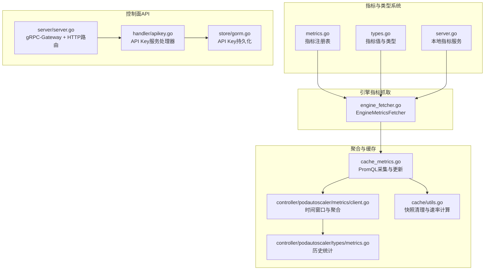
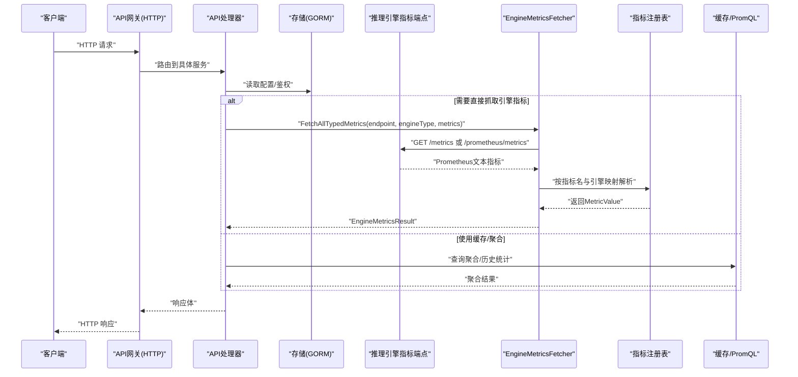
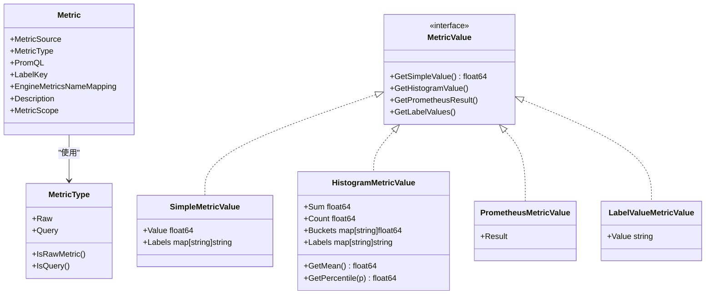
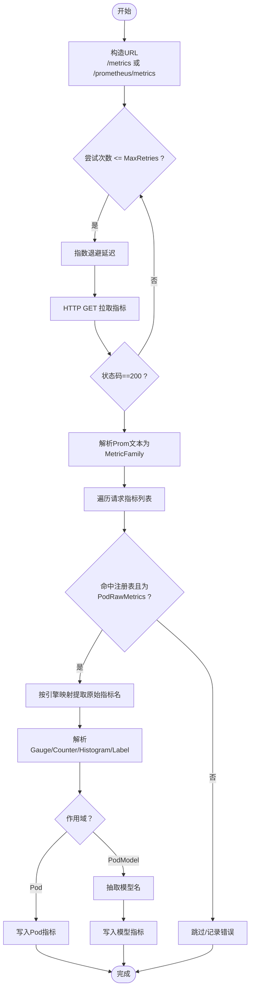
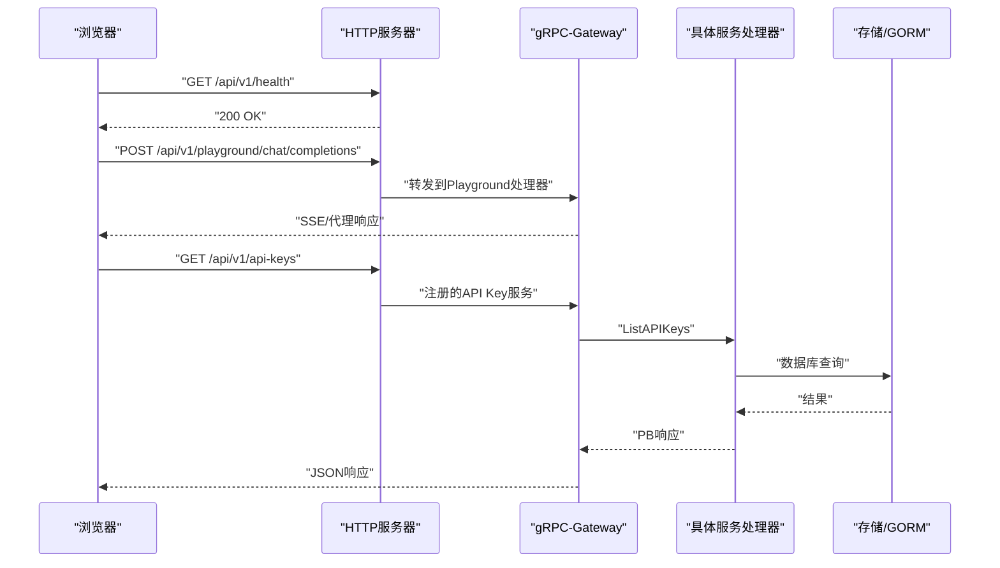
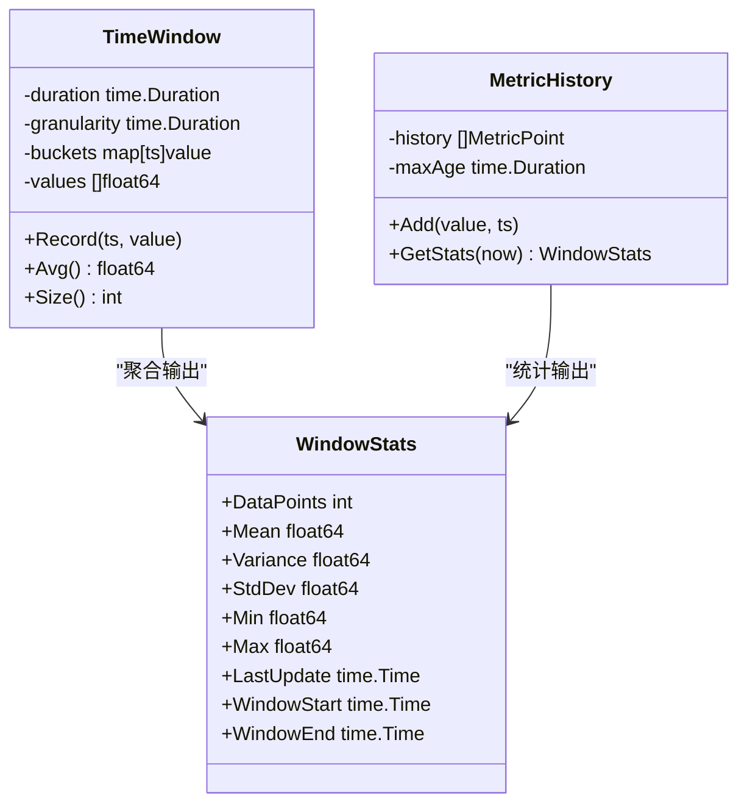
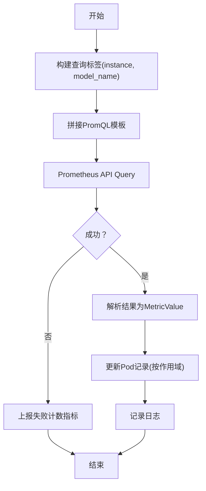
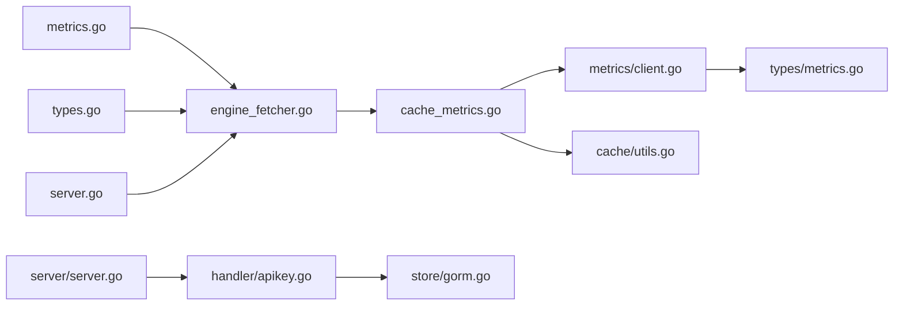

# 查询接口与API

<cite>
**本文引用的文件**
- [pkg/metrics/engine_fetcher.go](file://pkg/metrics/engine_fetcher.go)
- [pkg/metrics/types.go](file://pkg/metrics/types.go)
- [pkg/metrics/metrics.go](file://pkg/metrics/metrics.go)
- [pkg/metrics/server.go](file://pkg/metrics/server.go)
- [apps/console/api/server/server.go](file://apps/console/api/server/server.go)
- [apps/console/api/proto/console/v1/console.proto](file://apps/console/api/proto/console/v1/console.proto)
- [apps/console/api/handler/apikey.go](file://apps/console/api/handler/apikey.go)
- [apps/console/api/store/gorm.go](file://apps/console/api/store/gorm.go)
- [pkg/controller/podautoscaler/metrics/client.go](file://pkg/controller/podautoscaler/metrics/client.go)
- [pkg/controller/podautoscaler/types/metrics.go](file://pkg/controller/podautoscaler/types/metrics.go)
- [pkg/cache/cache_metrics.go](file://pkg/cache/cache_metrics.go)
- [pkg/cache/utils.go](file://pkg/cache/utils.go)
- [pkg/cache/cache_init.go](file://pkg/cache/cache_init.go)
- [pkg/controller/podautoscaler/metrics/fetcher_test.go](file://pkg/controller/podautoscaler/metrics/fetcher_test.go)
- [pkg/plugins/gateway/algorithms/pd_disaggregation_test.go](file://pkg/plugins/gateway/algorithms/pd_disaggregation_test.go)
- [pkg/plugins/gateway/algorithms/pd_disaggregation_benchmark_test.go](file://pkg/plugins/gateway/algorithms/pd_disaggregation_benchmark_test.go)
- [pkg/plugins/gateway/algorithms/util.go](file://pkg/plugins/gateway/algorithms/util.go)
</cite>

## 目录
1. [简介](#简介)
2. [项目结构](#项目结构)
3. [核心组件](#核心组件)
4. [架构总览](#架构总览)
5. [详细组件分析](#详细组件分析)
6. [依赖分析](#依赖分析)
7. [性能考虑](#性能考虑)
8. [故障排查指南](#故障排查指南)
9. [结论](#结论)
10. [附录](#附录)

## 简介
本技术文档聚焦于AIBrix的查询接口与API系统，围绕指标查询API的设计与实现展开，涵盖HTTP接口规范、请求参数校验、响应格式与错误处理；深入解析引擎指标获取器的工作原理，说明如何从不同推理引擎（vLLM、SGLang、TensorRT）统一采集指标、进行数据转换与标准化；阐述自定义指标API在聚合、时间序列处理、标签管理与数据导出方面的能力；并提供API使用示例、查询语法、参数组合、结果解析与性能优化建议，以及API版本管理、向后兼容性与迁移指南。

## 项目结构
AIBrix的查询与指标体系由“指标注册与类型系统”“引擎指标抓取器”“缓存与聚合层”“控制面API网关”等模块协同组成。核心路径如下：
- 指标注册与类型：pkg/metrics
- 引擎指标抓取：pkg/metrics/engine_fetcher.go
- 控制面API：apps/console/api
- 聚合与历史窗口：pkg/controller/podautoscaler
- 缓存与PromQL采集：pkg/cache

图表来源
- [pkg/metrics/metrics.go:104-794](file://pkg/metrics/metrics.go#L104-L794)
- [pkg/metrics/types.go:28-305](file://pkg/metrics/types.go#L28-L305)
- [pkg/metrics/server.go:28-61](file://pkg/metrics/server.go#L28-L61)
- [pkg/metrics/engine_fetcher.go:51-383](file://pkg/metrics/engine_fetcher.go#L51-L383)
- [apps/console/api/server/server.go:142-198](file://apps/console/api/server/server.go#L142-L198)
- [apps/console/api/handler/apikey.go:46-62](file://apps/console/api/handler/apikey.go#L46-L62)
- [apps/console/api/store/gorm.go:533-575](file://apps/console/api/store/gorm.go#L533-L575)
- [pkg/controller/podautoscaler/metrics/client.go:71-192](file://pkg/controller/podautoscaler/metrics/client.go#L71-L192)
- [pkg/controller/podautoscaler/types/metrics.go:26-183](file://pkg/controller/podautoscaler/types/metrics.go#L26-L183)
- [pkg/cache/cache_metrics.go:353-420](file://pkg/cache/cache_metrics.go#L353-L420)
- [pkg/cache/utils.go:274-313](file://pkg/cache/utils.go#L274-L313)

章节来源
- [pkg/metrics/metrics.go:1-796](file://pkg/metrics/metrics.go#L1-L796)
- [pkg/metrics/types.go:1-305](file://pkg/metrics/types.go#L1-L305)
- [pkg/metrics/server.go:1-61](file://pkg/metrics/server.go#L1-L61)
- [pkg/metrics/engine_fetcher.go:1-383](file://pkg/metrics/engine_fetcher.go#L1-L383)
- [apps/console/api/server/server.go:142-198](file://apps/console/api/server/server.go#L142-L198)
- [apps/console/api/handler/apikey.go:46-62](file://apps/console/api/handler/apikey.go#L46-L62)
- [apps/console/api/store/gorm.go:533-575](file://apps/console/api/store/gorm.go#L533-L575)
- [pkg/controller/podautoscaler/metrics/client.go:71-192](file://pkg/controller/podautoscaler/metrics/client.go#L71-L192)
- [pkg/controller/podautoscaler/types/metrics.go:26-183](file://pkg/controller/podautoscaler/types/metrics.go#L26-L183)
- [pkg/cache/cache_metrics.go:353-420](file://pkg/cache/cache_metrics.go#L353-L420)
- [pkg/cache/utils.go:274-313](file://pkg/cache/utils.go#L274-L313)

## 核心组件
- 指标注册与类型系统：集中定义指标元数据、来源、类型、作用域与映射关系，并提供指标值抽象与序列化工具。
- 引擎指标获取器：面向vLLM、SGLang、TensorRT等引擎，统一抓取/raw与/histogram指标，支持重试、指数退避与模型维度聚合。
- 控制面API网关：通过gRPC-Gateway暴露REST风格API，内置认证、CORS与静态资源代理，提供健康检查与业务服务路由。
- 聚合与缓存：维护稳定/紧急时间窗口与历史统计，支持滑动窗口聚合、方差/标准差计算与趋势分析占位。
- Prometheus采集：基于PromQL对Pod级与Pod+模型级指标进行查询与更新，支持标签注入与错误上报。

章节来源
- [pkg/metrics/metrics.go:104-794](file://pkg/metrics/metrics.go#L104-L794)
- [pkg/metrics/types.go:28-305](file://pkg/metrics/types.go#L28-L305)
- [pkg/metrics/engine_fetcher.go:51-383](file://pkg/metrics/engine_fetcher.go#L51-L383)
- [apps/console/api/server/server.go:142-198](file://apps/console/api/server/server.go#L142-L198)
- [pkg/controller/podautoscaler/metrics/client.go:71-192](file://pkg/controller/podautoscaler/metrics/client.go#L71-L192)
- [pkg/cache/cache_metrics.go:353-420](file://pkg/cache/cache_metrics.go#L353-L420)

## 架构总览
下图展示从引擎到API的端到端查询链路：引擎暴露指标端点 → 抓取器解析 → 注册表校验 → 缓存/聚合 → API网关对外提供REST接口。

图表来源
- [apps/console/api/server/server.go:142-198](file://apps/console/api/server/server.go#L142-L198)
- [apps/console/api/handler/apikey.go:46-62](file://apps/console/api/handler/apikey.go#L46-L62)
- [apps/console/api/store/gorm.go:533-575](file://apps/console/api/store/gorm.go#L533-L575)
- [pkg/metrics/engine_fetcher.go:159-263](file://pkg/metrics/engine_fetcher.go#L159-L263)
- [pkg/metrics/metrics.go:104-794](file://pkg/metrics/metrics.go#L104-L794)
- [pkg/cache/cache_metrics.go:353-420](file://pkg/cache/cache_metrics.go#L353-L420)

## 详细组件分析

### 指标注册与类型系统
- 指标注册表：集中声明所有可用指标，含原始指标与查询型指标，标注来源（PodRawMetrics或PrometheusEndpoint）、类型（Gauge/Counter/Histogram/PromQL/QueryLabel）、作用域（Pod/Model/PodModel）与引擎映射。
- 指标值抽象：提供Simple/Histogram/Prometheus/Label四类指标值接口，统一Get方法族，便于上层解析与序列化。
- 查询型指标：PromQL模板中可注入instance、model_name等标签，用于跨引擎一致性查询。

图表来源
- [pkg/metrics/types.go:28-305](file://pkg/metrics/types.go#L28-L305)
- [pkg/metrics/metrics.go:79-88](file://pkg/metrics/metrics.go#L79-L88)

章节来源
- [pkg/metrics/metrics.go:104-794](file://pkg/metrics/metrics.go#L104-L794)
- [pkg/metrics/types.go:28-305](file://pkg/metrics/types.go#L28-L305)

### 引擎指标获取器（EngineMetricsFetcher）
- 统一入口：支持单指标与全量指标抓取，自动选择/histogram或/prometheus/metrics端点（TensorRT专用）。
- 指标解析：依据注册表中的引擎映射提取原始指标名，解析Gauge/Counter/Histogram/Label值。
- 错误处理：失败时记录查询失败计数指标，支持最大重试次数与指数退避延迟。
- 模型维度：针对PodModel指标，从原始指标标签抽取模型名并生成“model/metric”键空间。

图表来源
- [pkg/metrics/engine_fetcher.go:98-263](file://pkg/metrics/engine_fetcher.go#L98-L263)

章节来源
- [pkg/metrics/engine_fetcher.go:51-383](file://pkg/metrics/engine_fetcher.go#L51-L383)

### 控制面API网关与HTTP接口规范
- 路由注册：通过gRPC-Gateway将多个服务注册为REST端点，包含部署、作业、模型、模板、API Key、Secret、配额等。
- 中间件：认证中间件、CORS中间件、静态文件代理、健康检查端点。
- Playground与文件代理：提供聊天补全代理与元数据文件代理路由。
- 认证与鉴权：API Key服务提供创建、删除与列表能力，配合认证中间件实现访问控制。

图表来源
- [apps/console/api/server/server.go:142-198](file://apps/console/api/server/server.go#L142-L198)
- [apps/console/api/proto/console/v1/console.proto:588-671](file://apps/console/api/proto/console/v1/console.proto#L588-L671)
- [apps/console/api/handler/apikey.go:46-62](file://apps/console/api/handler/apikey.go#L46-L62)
- [apps/console/api/store/gorm.go:533-575](file://apps/console/api/store/gorm.go#L533-L575)

章节来源
- [apps/console/api/server/server.go:142-198](file://apps/console/api/server/server.go#L142-L198)
- [apps/console/api/proto/console/v1/console.proto:588-671](file://apps/console/api/proto/console/v1/console.proto#L588-L671)
- [apps/console/api/handler/apikey.go:46-62](file://apps/console/api/handler/apikey.go#L46-L62)
- [apps/console/api/store/gorm.go:533-575](file://apps/console/api/store/gorm.go#L533-L575)

### 自定义指标API：聚合、时间序列与标签管理
- 时间窗口与聚合：维护稳定/紧急两个滑动窗口，按粒度分桶记录，支持平均值、方差、标准差、最值等统计。
- 历史统计：保留固定时长的历史快照，支持窗口起止时间与最后更新时间。
- 标签管理：查询型指标通过PromQL注入instance、model_name等标签；Label型指标从原始指标中抽取指定标签键值。
- 数据导出：通过指标值接口统一导出数值或直方图结构，便于上层序列化与可视化。

图表来源
- [pkg/controller/podautoscaler/types/metrics.go:149-183](file://pkg/controller/podautoscaler/types/metrics.go#L149-L183)
- [pkg/controller/podautoscaler/metrics/client.go:71-192](file://pkg/controller/podautoscaler/metrics/client.go#L71-L192)

章节来源
- [pkg/controller/podautoscaler/types/metrics.go:26-183](file://pkg/controller/podautoscaler/types/metrics.go#L26-L183)
- [pkg/controller/podautoscaler/metrics/client.go:71-192](file://pkg/controller/podautoscaler/metrics/client.go#L71-L192)

### Prometheus采集与缓存更新
- 采集流程：按Pod与模型维度构建查询标签，执行PromQL查询，解析结果并写入缓存记录。
- 错误处理：查询失败时上报失败计数指标，避免脏数据污染。
- 历史清理：对旧快照进行裁剪，限制最大年龄与数量，保证内存占用可控。

图表来源
- [pkg/cache/cache_metrics.go:353-420](file://pkg/cache/cache_metrics.go#L353-L420)
- [pkg/cache/utils.go:295-313](file://pkg/cache/utils.go#L295-L313)

章节来源
- [pkg/cache/cache_metrics.go:353-420](file://pkg/cache/cache_metrics.go#L353-L420)
- [pkg/cache/utils.go:274-313](file://pkg/cache/utils.go#L274-L313)

### 引擎差异与兼容性
- 端点差异：TensorRT使用/prometheus/metrics，其他引擎使用/metrics。
- 指标命名：通过EngineMetricsNameMapping将统一指标名映射到各引擎原始指标名。
- 测试覆盖：包含对vLLM/SGLang/TensorRT的预填充请求与错误场景测试，确保兼容性与鲁棒性。

章节来源
- [pkg/metrics/engine_fetcher.go:89-96](file://pkg/metrics/engine_fetcher.go#L89-L96)
- [pkg/plugins/gateway/algorithms/pd_disaggregation_test.go:784-832](file://pkg/plugins/gateway/algorithms/pd_disaggregation_test.go#L784-L832)
- [pkg/plugins/gateway/algorithms/pd_disaggregation_benchmark_test.go:265-328](file://pkg/plugins/gateway/algorithms/pd_disaggregation_benchmark_test.go#L265-L328)

## 依赖分析
- 指标注册表与类型系统被引擎抓取器与缓存模块共同依赖，形成“统一指标语义”的基础。
- API网关依赖gRPC-Gateway与认证中间件，向上提供REST接口，向下调用具体服务处理器与存储。
- 聚合模块依赖时间窗口与历史统计类型，提供稳定/紧急两种窗口以适配不同策略需求。
- Prometheus采集依赖Prometheus客户端库与查询API，结合标签注入与错误上报机制。

图表来源
- [pkg/metrics/metrics.go:104-794](file://pkg/metrics/metrics.go#L104-L794)
- [pkg/metrics/types.go:28-305](file://pkg/metrics/types.go#L28-L305)
- [pkg/metrics/server.go:28-61](file://pkg/metrics/server.go#L28-L61)
- [pkg/metrics/engine_fetcher.go:51-383](file://pkg/metrics/engine_fetcher.go#L51-L383)
- [apps/console/api/server/server.go:142-198](file://apps/console/api/server/server.go#L142-L198)
- [apps/console/api/handler/apikey.go:46-62](file://apps/console/api/handler/apikey.go#L46-L62)
- [apps/console/api/store/gorm.go:533-575](file://apps/console/api/store/gorm.go#L533-L575)
- [pkg/controller/podautoscaler/metrics/client.go:71-192](file://pkg/controller/podautoscaler/metrics/client.go#L71-L192)
- [pkg/controller/podautoscaler/types/metrics.go:149-183](file://pkg/controller/podautoscaler/types/metrics.go#L149-L183)
- [pkg/cache/cache_metrics.go:353-420](file://pkg/cache/cache_metrics.go#L353-L420)
- [pkg/cache/utils.go:274-313](file://pkg/cache/utils.go#L274-L313)

章节来源
- [pkg/metrics/metrics.go:104-794](file://pkg/metrics/metrics.go#L104-L794)
- [pkg/metrics/types.go:28-305](file://pkg/metrics/types.go#L28-L305)
- [pkg/metrics/server.go:28-61](file://pkg/metrics/server.go#L28-L61)
- [pkg/metrics/engine_fetcher.go:51-383](file://pkg/metrics/engine_fetcher.go#L51-L383)
- [apps/console/api/server/server.go:142-198](file://apps/console/api/server/server.go#L142-L198)
- [apps/console/api/handler/apikey.go:46-62](file://apps/console/api/handler/apikey.go#L46-L62)
- [apps/console/api/store/gorm.go:533-575](file://apps/console/api/store/gorm.go#L533-L575)
- [pkg/controller/podautoscaler/metrics/client.go:71-192](file://pkg/controller/podautoscaler/metrics/client.go#L71-L192)
- [pkg/controller/podautoscaler/types/metrics.go:149-183](file://pkg/controller/podautoscaler/types/metrics.go#L149-L183)
- [pkg/cache/cache_metrics.go:353-420](file://pkg/cache/cache_metrics.go#L353-L420)
- [pkg/cache/utils.go:274-313](file://pkg/cache/utils.go#L274-L313)

## 性能考虑
- 指标抓取：启用指数退避与最大重试，避免瞬时抖动放大；对TensorRT使用独立端点减少解析成本。
- 时间窗口：合理设置粒度与窗口长度，避免过小粒度导致内存压力过大；滑动窗口按桶清理，降低复杂度。
- 历史统计：限制最大年龄与快照数量，防止无限增长；仅保留必要统计量（均值、方差、极值）。
- Prometheus查询：尽量使用聚合与rate/histogram_quantile等原生函数，减少客户端计算；为高频查询建立索引与缓存。
- API网关：开启CORS白名单与认证缓存，减少重复鉴权开销；静态资源与代理路径明确，避免不必要的中间层。

## 故障排查指南
- 引擎指标抓取失败
  - 确认引擎端点可达与端口正确；检查TLS配置（默认允许自签名证书）。
  - 查看失败计数指标是否上升，定位具体指标名与引擎映射是否缺失。
  - 参考测试用例验证端点响应格式与指标名一致性。
- Prometheus查询异常
  - 检查PromQL模板中的instance/model_name标签是否正确注入。
  - 关注查询警告与空结果，确认指标是否存在与标签是否匹配。
- API Key相关问题
  - 列表/创建/删除接口返回内部错误时，检查数据库连接与事务一致性。
  - 创建时仅一次性返回完整密钥，后续不再回显明文，注意安全存储。

章节来源
- [pkg/metrics/engine_fetcher.go:357-382](file://pkg/metrics/engine_fetcher.go#L357-L382)
- [pkg/cache/cache_metrics.go:398-420](file://pkg/cache/cache_metrics.go#L398-L420)
- [apps/console/api/handler/apikey.go:46-62](file://apps/console/api/handler/apikey.go#L46-L62)
- [apps/console/api/store/gorm.go:533-575](file://apps/console/api/store/gorm.go#L533-L575)
- [pkg/controller/podautoscaler/metrics/fetcher_test.go:46-98](file://pkg/controller/podautoscaler/metrics/fetcher_test.go#L46-L98)

## 结论
AIBrix查询接口与API系统通过“统一指标注册表 + 引擎指标抓取器 + 聚合与缓存 + 控制面API网关”的分层设计，实现了对多引擎指标的统一采集、标准化与对外服务能力。借助PromQL与直方图统计，系统既能满足实时观测，也能支撑长期趋势分析。建议在生产环境中结合指数退避、窗口粒度与历史快照上限等策略，持续优化查询性能与资源占用。

## 附录

### API使用示例与最佳实践
- API Key管理
  - 创建：携带name字段，仅在创建时返回完整密钥，需妥善保存。
  - 删除：按ID删除，若不存在返回未找到错误。
  - 列表：按创建时间倒序返回，便于审计与检索。
- Playground与文件代理
  - 通过POST /api/v1/playground/chat/completions进行流式对话；文件代理路由用于元数据服务访问。
- 参数组合与查询语法
  - 对于查询型指标，按PromQL模板注入instance与model_name标签；对于Label型指标，确保原始指标包含目标标签键。
  - 聚合场景优先使用rate、histogram_quantile等函数，减少客户端计算负担。
- 性能优化建议
  - 合理设置聚合窗口与粒度，避免过小导致高CPU/内存消耗。
  - 对高频查询建立缓存与索引，减少PromQL执行频率。
  - 在API网关侧启用CORS白名单与认证缓存，降低鉴权开销。

章节来源
- [apps/console/api/proto/console/v1/console.proto:588-671](file://apps/console/api/proto/console/v1/console.proto#L588-L671)
- [apps/console/api/handler/apikey.go:46-62](file://apps/console/api/handler/apikey.go#L46-L62)
- [apps/console/api/store/gorm.go:533-575](file://apps/console/api/store/gorm.go#L533-L575)
- [apps/console/api/server/server.go:142-198](file://apps/console/api/server/server.go#L142-L198)

### 版本管理、向后兼容与迁移
- 指标注册表演进
  - 新增指标时，同时完善引擎映射与描述；对已弃用指标保留兼容期并在文档中标注。
- 引擎端点变更
  - 当引擎端点变化（如TensorRT端点），在抓取器中同步调整路径与解析逻辑，并补充测试用例。
- API演进
  - 保持gRPC-Gateway的REST映射稳定，新增字段采用可选方式，避免破坏既有客户端。
- 迁移指南
  - 从旧版本升级时，先在灰度环境验证PromQL与指标映射，再逐步切换流量；对历史数据导出与导入制定计划，确保统计连续性。

章节来源
- [pkg/metrics/metrics.go:19-100](file://pkg/metrics/metrics.go#L19-L100)
- [pkg/metrics/engine_fetcher.go:89-96](file://pkg/metrics/engine_fetcher.go#L89-L96)
- [apps/console/api/server/server.go:142-198](file://apps/console/api/server/server.go#L142-L198)