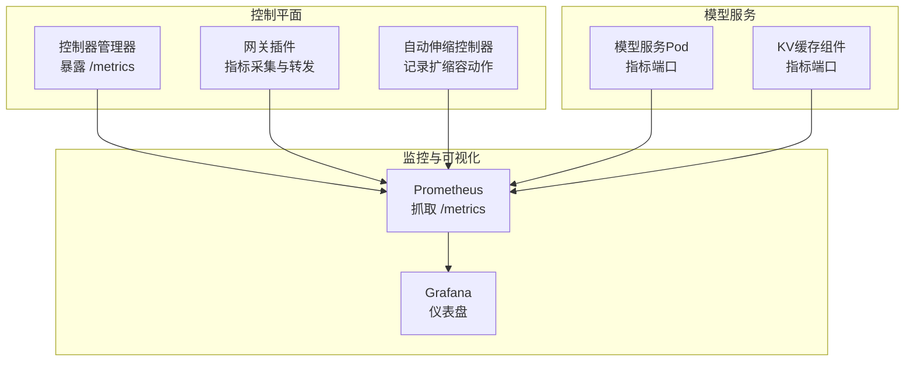
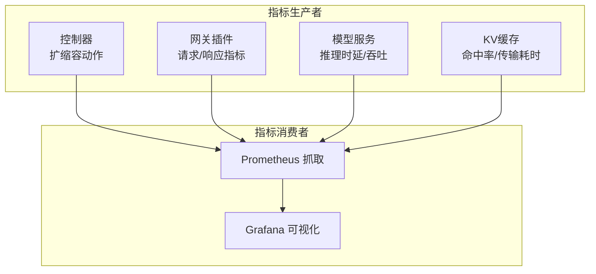
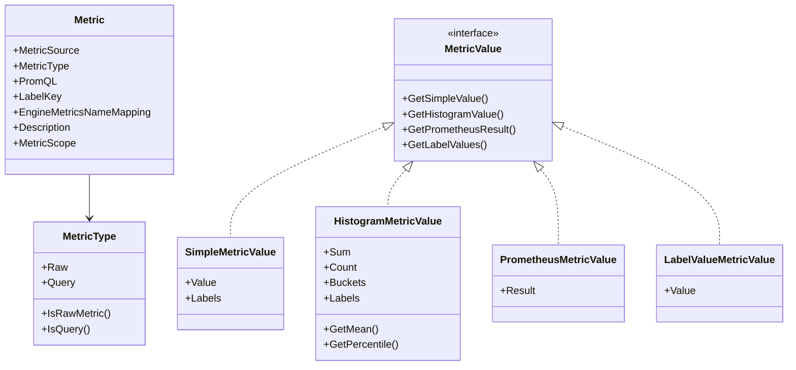
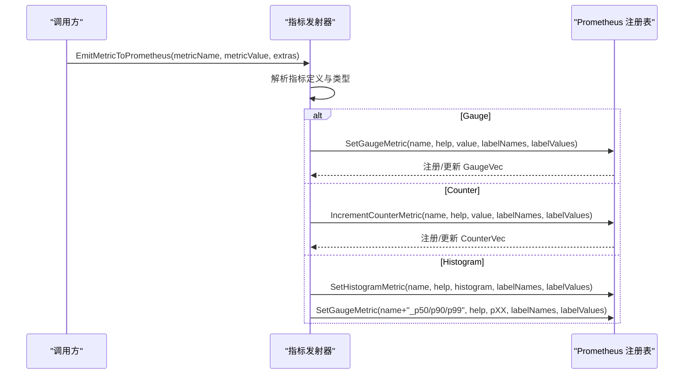
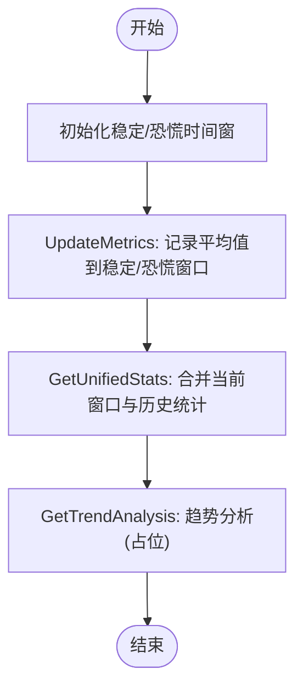
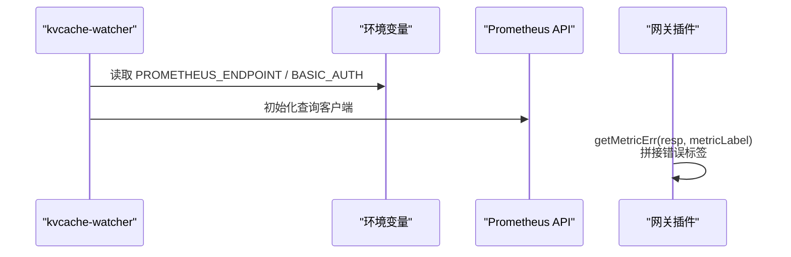
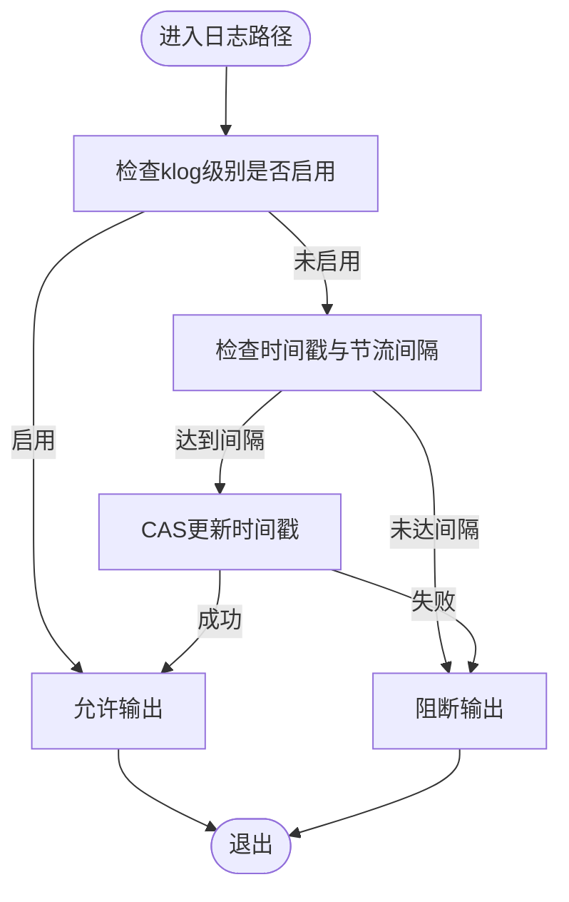
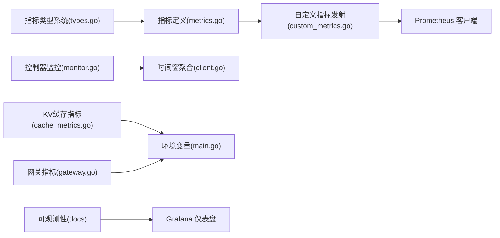

# 日志与告警系统

<cite>
**本文引用的文件**
- [observability.rst](file://docs/source/production/observability.rst)
- [AIBrix_Control_Plane_Runtime_Dashboard.json](file://observability/grafana/AIBrix_Control_Plane_Runtime_Dashboard.json)
- [AIBrix_Envoy_Gateway_Dashboard.json](file://observability/grafana/AIBrix_Envoy_Gateway_Dashboard.json)
- [metrics.go](file://pkg/metrics/metrics.go)
- [custom_metrics.go](file://pkg/metrics/custom_metrics.go)
- [types.go](file://pkg/metrics/types.go)
- [monitor.go](file://pkg/controller/podautoscaler/monitor/monitor.go)
- [client.go](file://pkg/controller/podautoscaler/metrics/client.go)
- [cache_metrics.go](file://pkg/cache/cache_metrics.go)
- [main.go](file://cmd/kvcache-watcher/main.go)
- [gateway.go](file://pkg/plugins/gateway/gateway.go)
- [pod.go](file://pkg/cache/pod.go)
</cite>

## 目录
1. [简介](#简介)
2. [项目结构](#项目结构)
3. [核心组件](#核心组件)
4. [架构总览](#架构总览)
5. [详细组件分析](#详细组件分析)
6. [依赖关系分析](#依赖关系分析)
7. [性能考量](#性能考量)
8. [故障排查指南](#故障排查指南)
9. [结论](#结论)
10. [附录](#附录)

## 简介
本技术文档面向AIBrix的日志与告警系统，聚焦于日志采集与聚合、结构化日志格式、日志级别管理、日志轮转策略与存储方案；深入解析日志分析方法（模式识别、异常检测、性能分析、趋势预测）；阐述告警规则配置、阈值设定、告警级别分类与通知渠道管理；并提供日志查询与分析工具的使用指南（聚合查询、实时监控、历史数据分析）。最后给出日志安全、隐私保护与合规性实施建议。

## 项目结构
AIBrix通过多组件协同实现可观测性与告警能力：
- 控制平面与网关：暴露Prometheus指标端点，支持Grafana仪表盘可视化。
- 模型服务与KV缓存：通过统一指标定义与自定义指标发射器上报关键性能指标。
- 自动伸缩控制器：记录扩缩容动作指标，便于审计与趋势分析。
- 日志与追踪：通过klog与日志节流控制，结合Pod级追踪开关，实现可控的日志输出与调试能力。

图表来源
- [observability.rst](file://docs/source/production/observability.rst)
- [AIBrix_Control_Plane_Runtime_Dashboard.json](file://observability/grafana/AIBrix_Control_Plane_Runtime_Dashboard.json)
- [AIBrix_Envoy_Gateway_Dashboard.json](file://observability/grafana/AIBrix_Envoy_Gateway_Dashboard.json)

章节来源
- [observability.rst](file://docs/source/production/observability.rst)

## 核心组件
- 指标定义与类型系统：集中定义指标名称、来源、类型与描述，并提供直方图分位数计算等工具。
- 自定义指标发射器：按Pod与模型维度构建标签，动态注册Gauge/Counter/Histogram指标并上报。
- 控制器指标采集：时间窗聚合、稳定窗口与恐慌窗口分离，支持趋势分析占位接口。
- KV缓存与网关指标：从环境变量读取Prometheus端点与鉴权信息，初始化远程查询API。
- 日志与追踪：基于klog的级别控制与日志节流，Pod级追踪开关避免高频日志影响性能。

章节来源
- [metrics.go](file://pkg/metrics/metrics.go)
- [custom_metrics.go](file://pkg/metrics/custom_metrics.go)
- [types.go](file://pkg/metrics/types.go)
- [monitor.go](file://pkg/controller/podautoscaler/monitor/monitor.go)
- [client.go](file://pkg/controller/podautoscaler/metrics/client.go)
- [cache_metrics.go](file://pkg/cache/cache_metrics.go)
- [main.go](file://cmd/kvcache-watcher/main.go)
- [pod.go](file://pkg/cache/pod.go)

## 架构总览
AIBrix采用“指标驱动”的可观测性架构：
- 组件在本地或远端暴露指标端点，Prometheus定期抓取。
- Grafana通过数据源连接Prometheus，加载预置仪表盘进行可视化。
- 控制器与网关通过统一指标类型系统与自定义发射器上报关键业务指标。
- 自动伸缩控制器记录扩缩容动作，结合时间窗聚合与历史统计辅助决策。

图表来源
- [observability.rst](file://docs/source/production/observability.rst)
- [metrics.go](file://pkg/metrics/metrics.go)
- [custom_metrics.go](file://pkg/metrics/custom_metrics.go)

## 详细组件分析

### 指标定义与类型系统
- 指标来源与类型：区分原始指标（Pod指标端口）与查询指标（PromQL），支持Gauge/Counter/Histogram与标签查询。
- 指标作用域：支持Model/Pod/PodModel三个维度，便于跨层级聚合与对比。
- 直方图分位数：提供分位数计算工具，支持p50/p90/p99等关键指标提取。

图表来源
- [types.go](file://pkg/metrics/types.go)

章节来源
- [metrics.go](file://pkg/metrics/metrics.go)
- [types.go](file://pkg/metrics/types.go)

### 自定义指标发射器
- 动态注册：按需创建Gauge/Counter/Histogram向量，确保标签顺序一致。
- 标签构建：默认包含命名空间、Pod名、模型、引擎类型、角色集/角色/副本索引、网关Pod名等。
- 发射策略：根据指标类型选择Set/Add，同时对直方图补充p50/p90/p99指标，便于快速定位尾延迟问题。

图表来源
- [custom_metrics.go](file://pkg/metrics/custom_metrics.go)

章节来源
- [custom_metrics.go](file://pkg/metrics/custom_metrics.go)

### 控制器指标采集与时间窗聚合
- 时间窗设计：稳定窗口用于常规决策，恐慌窗口用于突发场景；两者独立维护并可按需合并。
- 历史统计：维护稳定/恐慌历史窗口，支持历史统计与趋势分析占位接口。
- 扩缩容动作：记录目标副本数，便于审计与回溯。

图表来源
- [client.go](file://pkg/controller/podautoscaler/metrics/client.go)
- [monitor.go](file://pkg/controller/podautoscaler/monitor/monitor.go)

章节来源
- [client.go](file://pkg/controller/podautoscaler/metrics/client.go)
- [monitor.go](file://pkg/controller/podautoscaler/monitor/monitor.go)

### KV缓存与网关指标
- 远程查询初始化：从环境变量读取Prometheus端点与基础认证信息，初始化查询API。
- 网关错误指标：根据响应头动态拼接指标标签，增强错误分类粒度。

图表来源
- [cache_metrics.go](file://pkg/cache/cache_metrics.go)
- [main.go](file://cmd/kvcache-watcher/main.go)
- [gateway.go](file://pkg/plugins/gateway/gateway.go)

章节来源
- [cache_metrics.go](file://pkg/cache/cache_metrics.go)
- [main.go](file://cmd/kvcache-watcher/main.go)
- [gateway.go](file://pkg/plugins/gateway/gateway.go)

### 日志与追踪控制
- 日志级别与节流：基于klog级别与时间戳节流，避免高频日志影响性能。
- Pod级追踪：提供CanLogPodTrace以控制追踪日志输出频率，降低开销。

图表来源
- [pod.go](file://pkg/cache/pod.go)

章节来源
- [pod.go](file://pkg/cache/pod.go)

## 依赖关系分析
- 指标系统依赖Prometheus客户端库，通过统一类型系统与发射器解耦具体来源。
- 控制器指标采集依赖时间窗与历史窗口抽象，支持稳定/恐慌双通道。
- KV缓存与网关依赖环境变量配置，实现灵活部署与安全认证。
- 可观测性依赖kube-prometheus-stack，Grafana仪表盘提供可视化。

图表来源
- [types.go](file://pkg/metrics/types.go)
- [metrics.go](file://pkg/metrics/metrics.go)
- [custom_metrics.go](file://pkg/metrics/custom_metrics.go)
- [monitor.go](file://pkg/controller/podautoscaler/monitor/monitor.go)
- [client.go](file://pkg/controller/podautoscaler/metrics/client.go)
- [cache_metrics.go](file://pkg/cache/cache_metrics.go)
- [main.go](file://cmd/kvcache-watcher/main.go)
- [gateway.go](file://pkg/plugins/gateway/gateway.go)
- [observability.rst](file://docs/source/production/observability.rst)

章节来源
- [observability.rst](file://docs/source/production/observability.rst)

## 性能考量
- 指标发射：动态注册与标签排序保证一致性，避免重复创建与标签错位导致的指标分裂。
- 时间窗聚合：稳定/恐慌双通道减少误判，历史窗口支持长周期趋势分析。
- 日志节流：基于CAS的时间戳更新与klog级别检查，有效降低高并发下的日志开销。
- 远程查询：基础认证与端点配置分离，便于在不同环境中切换与优化网络路径。

## 故障排查指南
- 指标缺失或为空：
  - 检查Prometheus抓取配置与ServiceMonitor是否正确。
  - 验证指标名称与标签是否与定义一致。
- 查询失败：
  - 确认PROMETHEUS_ENDPOINT与基础认证信息是否正确设置。
  - 查看Prometheus查询失败计数指标，定位具体查询问题。
- 扩缩容动作异常：
  - 检查控制器日志中的扩缩容动作指标，确认算法与原因标签。
- 网关错误分类不准确：
  - 检查响应头中错误标签的拼接逻辑，确保唯一性与可读性。

章节来源
- [cache_metrics.go](file://pkg/cache/cache_metrics.go)
- [monitor.go](file://pkg/controller/podautoscaler/monitor/monitor.go)
- [gateway.go](file://pkg/plugins/gateway/gateway.go)

## 结论
AIBrix的日志与告警体系以指标为核心，结合统一类型系统、动态指标发射与时间窗聚合，形成可观测性闭环。通过Grafana仪表盘与控制平面、网关、模型服务的协同，能够实现对系统健康、性能与异常的全面监控。建议在生产环境中完善日志安全与合规策略，持续优化指标覆盖与告警阈值，提升整体稳定性与可运维性。

## 附录
- 生产监控与仪表盘导入参考：[生产可观测性文档](file://docs/source/production/observability.rst)
- 控制平面运行时仪表盘：[控制平面仪表盘](file://observability/grafana/AIBrix_Control_Plane_Runtime_Dashboard.json)
- Envoy网关仪表盘：[Envoy网关仪表盘](file://observability/grafana/AIBrix_Envoy_Gateway_Dashboard.json)