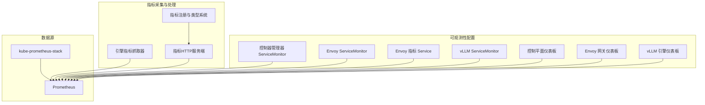
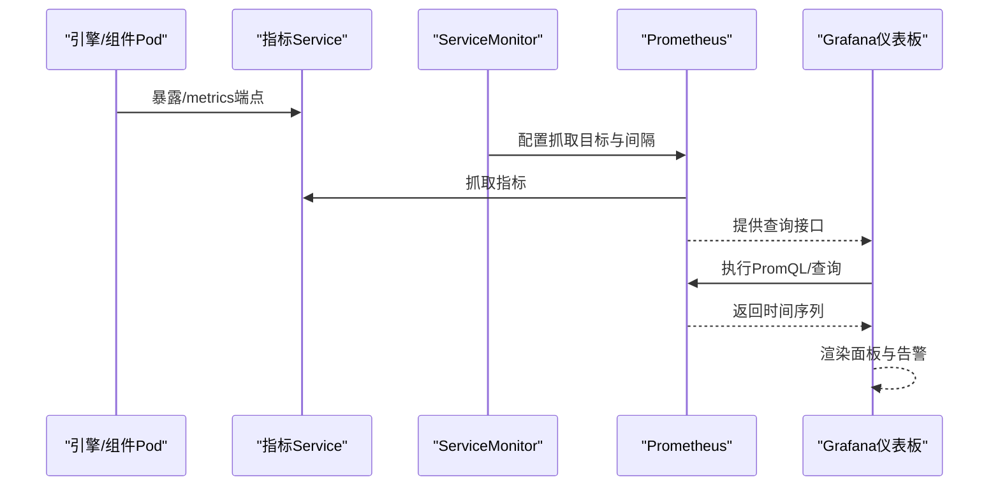
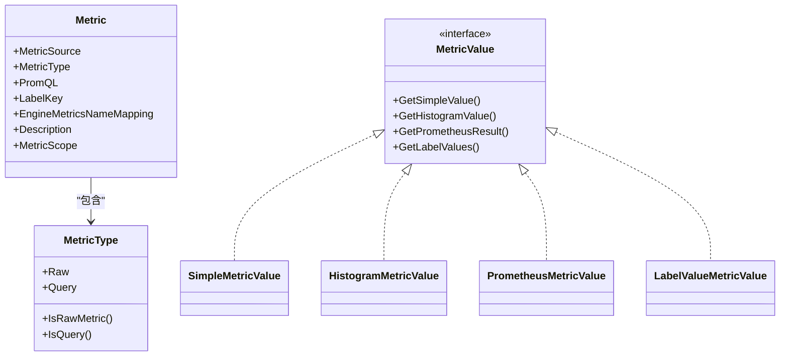
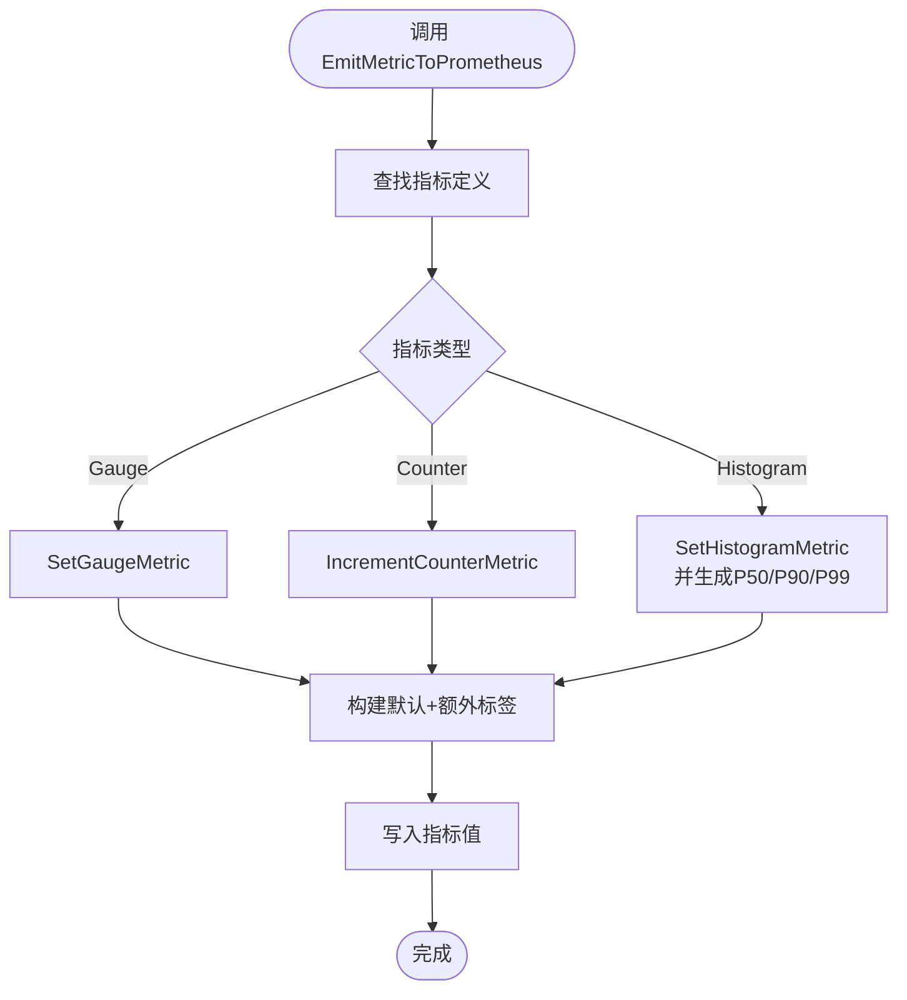
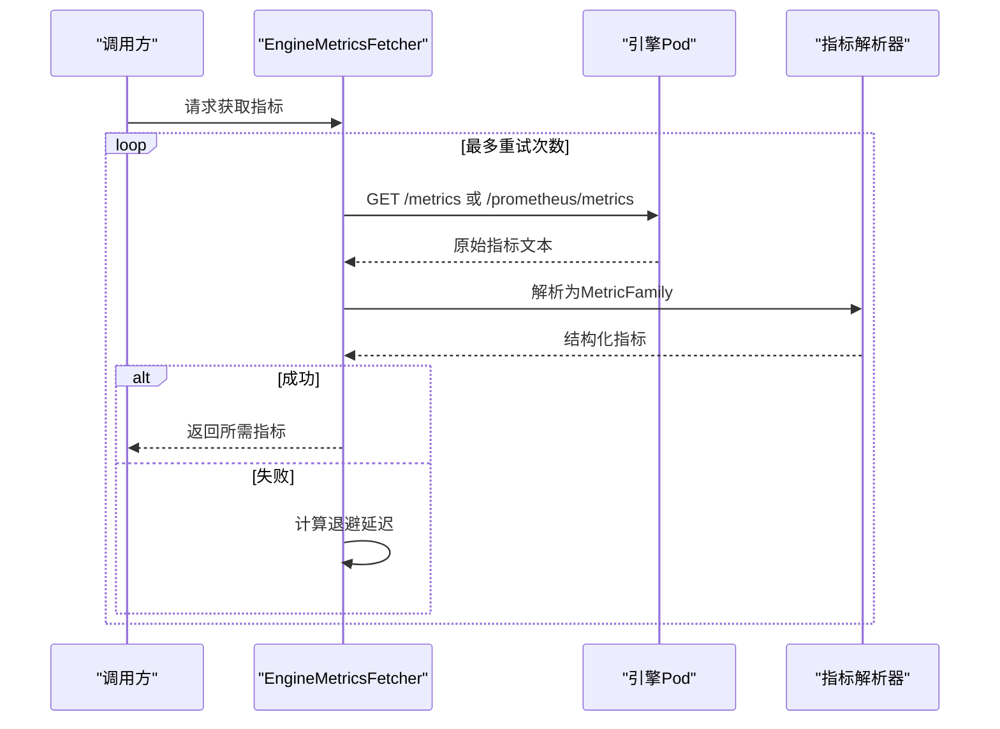
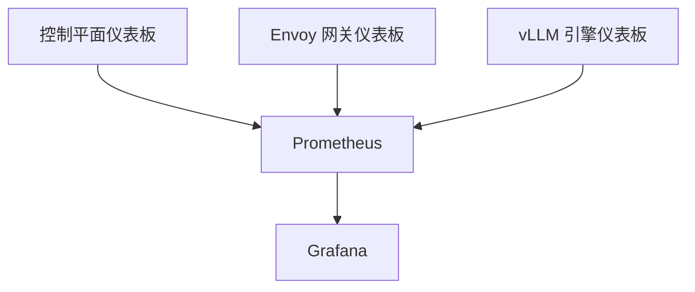
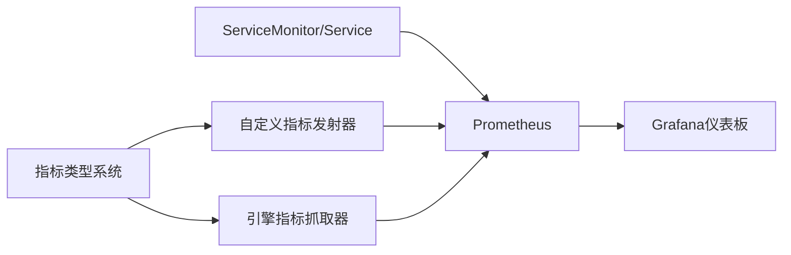

# 监控与可观测性

<cite>
**本文引用的文件**   
- [AIBrix 控制平面运行时仪表板.json](file://observability/grafana/AIBrix_Control_Plane_Runtime_Dashboard.json)
- [AIBrix Envoy 网关仪表板.json](file://observability/grafana/AIBrix_Envoy_Gateway_Dashboard.json)
- [AIBrix vLLM 引擎仪表板.json](file://observability/grafana/AIBrix_vLLM_Engine_Dashboard.json)
- [控制器管理器指标 ServiceMonitor](file://observability/monitor/service_monitor_controller_manager.yaml)
- [Envoy 指标 ServiceMonitor](file://observability/monitor/service_monitor_gateway.yaml)
- [Envoy 指标 Service](file://observability/monitor/envoy_metrics_service.yaml)
- [vLLM 指标 ServiceMonitor](file://observability/monitor/service_monitor_vllm.yaml)
- [自定义指标（Go）](file://pkg/metrics/custom_metrics.go)
- [引擎指标抓取器（Go）](file://pkg/metrics/engine_fetcher.go)
- [通用指标定义（Go）](file://pkg/metrics/metrics.go)
- [指标类型与值（Go）](file://pkg/metrics/types.go)
- [指标服务端（Go）](file://pkg/metrics/server.go)
- [网关指标常量（Go）](file://pkg/metrics/gateway_metrics.go)
- [指标子系统常量（Go）](file://pkg/constants/metrics.go)
- [生产可观测性文档](file://docs/source/production/observability.rst)
</cite>

## 目录
1. [简介](#简介)
2. [项目结构](#项目结构)
3. [核心组件](#核心组件)
4. [架构总览](#架构总览)
5. [详细组件分析](#详细组件分析)
6. [依赖关系分析](#依赖关系分析)
7. [性能考量](#性能考量)
8. [故障排查指南](#故障排查指南)
9. [结论](#结论)
10. [附录](#附录)

## 简介
本文件面向AIBrix监控与可观测性系统，系统性梳理指标采集、Prometheus集成、自定义指标定义、指标查询与分析、日志管理策略、Grafana仪表板设计与使用、分布式追踪与性能监控、资源使用监控等能力，并提供配置指南、告警策略建议与故障诊断方法，帮助用户在生产环境中稳定、高效地观测系统。

## 项目结构
可观测性相关代码与配置主要分布在以下位置：
- observability/grafana：预置的Grafana仪表板JSON
- observability/monitor：ServiceMonitor与辅助Service，用于Prometheus抓取指标
- pkg/metrics：指标注册、类型系统、抓取器、HTTP指标服务端
- pkg/constants：指标子系统命名常量
- docs/source/production/observability.rst：生产可观测性使用说明

**图表来源**
- [控制器管理器指标 ServiceMonitor:1-19](file://observability/monitor/service_monitor_controller_manager.yaml#L1-L19)
- [Envoy 指标 ServiceMonitor:1-20](file://observability/monitor/service_monitor_gateway.yaml#L1-L20)
- [Envoy 指标 Service:1-21](file://observability/monitor/envoy_metrics_service.yaml#L1-L21)
- [vLLM 指标 ServiceMonitor:1-19](file://observability/monitor/service_monitor_vllm.yaml#L1-L19)
- [AIBrix 控制平面运行时仪表板.json:1-120](file://observability/grafana/AIBrix_Control_Plane_Runtime_Dashboard.json#L1-L120)
- [AIBrix Envoy 网关仪表板.json:1-120](file://observability/grafana/AIBrix_Envoy_Gateway_Dashboard.json#L1-L120)
- [AIBrix vLLM 引擎仪表板.json:1-120](file://observability/grafana/AIBrix_vLLM_Engine_Dashboard.json#L1-L120)
- [通用指标定义（Go）:102-796](file://pkg/metrics/metrics.go#L102-L796)
- [引擎指标抓取器（Go）:51-77](file://pkg/metrics/engine_fetcher.go#L51-L77)
- [指标服务端（Go）:28-61](file://pkg/metrics/server.go#L28-L61)

**章节来源**
- [生产可观测性文档:1-72](file://docs/source/production/observability.rst#L1-L72)

## 核心组件
- 指标注册与类型系统：统一定义原始指标与查询型指标，支持Gauge/Counter/Histogram与PromQL/Label提取，便于跨引擎抽象。
- 自定义指标发射器：提供Gauge/Counter/Histogram三类指标的动态注册与标签对齐，支持测试替身函数。
- 引擎指标抓取器：从推理引擎Pod拉取原始指标，解析并按中心类型系统映射到AIBrix指标名，支持重试与指数退避。
- 指标HTTP服务端：暴露/metrics端点，供Prometheus抓取。
- ServiceMonitor与辅助Service：为控制器、Envoy、vLLM等组件建立抓取目标，确保Prometheus可采集。
- Grafana仪表板：提供控制平面、Envoy网关、vLLM引擎三类关键监控界面。

**章节来源**
- [通用指标定义（Go）:102-796](file://pkg/metrics/metrics.go#L102-L796)
- [指标类型与值（Go）:28-305](file://pkg/metrics/types.go#L28-L305)
- [自定义指标（Go）:33-390](file://pkg/metrics/custom_metrics.go#L33-L390)
- [引擎指标抓取器（Go）:51-383](file://pkg/metrics/engine_fetcher.go#L51-L383)
- [指标服务端（Go）:28-61](file://pkg/metrics/server.go#L28-L61)
- [控制器管理器指标 ServiceMonitor:1-19](file://observability/monitor/service_monitor_controller_manager.yaml#L1-L19)
- [Envoy 指标 ServiceMonitor:1-20](file://observability/monitor/service_monitor_gateway.yaml#L1-L20)
- [Envoy 指标 Service:1-21](file://observability/monitor/envoy_metrics_service.yaml#L1-L21)
- [vLLM 指标 ServiceMonitor:1-19](file://observability/monitor/service_monitor_vllm.yaml#L1-L19)
- [AIBrix 控制平面运行时仪表板.json:1-120](file://observability/grafana/AIBrix_Control_Plane_Runtime_Dashboard.json#L1-L120)
- [AIBrix Envoy 网关仪表板.json:1-120](file://observability/grafana/AIBrix_Envoy_Gateway_Dashboard.json#L1-L120)
- [AIBrix vLLM 引擎仪表板.json:1-120](file://observability/grafana/AIBrix_vLLM_Engine_Dashboard.json#L1-L120)

## 架构总览
下图展示从组件指标暴露到Prometheus抓取、再到Grafana可视化的完整链路，以及指标类型系统如何支撑跨引擎的统一观测。

**图表来源**
- [指标服务端（Go）:32-42](file://pkg/metrics/server.go#L32-L42)
- [控制器管理器指标 ServiceMonitor:12-16](file://observability/monitor/service_monitor_controller_manager.yaml#L12-L16)
- [Envoy 指标 ServiceMonitor:15-19](file://observability/monitor/service_monitor_gateway.yaml#L15-L19)
- [vLLM 指标 ServiceMonitor:9-12](file://observability/monitor/service_monitor_vllm.yaml#L9-L12)
- [AIBrix 控制平面运行时仪表板.json:131-143](file://observability/grafana/AIBrix_Control_Plane_Runtime_Dashboard.json#L131-L143)
- [AIBrix Envoy 网关仪表板.json:682-711](file://observability/grafana/AIBrix_Envoy_Gateway_Dashboard.json#L682-L711)
- [AIBrix vLLM 引擎仪表板.json:126-141](file://observability/grafana/AIBrix_vLLM_Engine_Dashboard.json#L126-L141)

## 详细组件分析

### 指标注册与类型系统
- 统一指标元数据：包含来源（Pod原始/Prometheus查询）、类型（Gauge/Counter/Histogram/PromQL/Label）、作用域（Pod/模型/Pod+模型）、引擎映射、描述等。
- 查询型指标：通过PromQL表达式在Prometheus侧进行聚合与派生，如P95 TTFT、平均吞吐等。
- 引擎映射：将引擎原生指标名映射到AIBrix指标名，屏蔽引擎差异。

**图表来源**
- [通用指标定义（Go）:79-88](file://pkg/metrics/metrics.go#L79-L88)
- [指标类型与值（Go）:56-101](file://pkg/metrics/types.go#L56-L101)
- [指标类型与值（Go）:103-147](file://pkg/metrics/types.go#L103-L147)
- [指标类型与值（Go）:239-279](file://pkg/metrics/types.go#L239-L279)

**章节来源**
- [通用指标定义（Go）:102-796](file://pkg/metrics/metrics.go#L102-L796)
- [指标类型与值（Go）:28-305](file://pkg/metrics/types.go#L28-L305)

### 自定义指标发射器
- 动态注册：首次使用时自动创建Gauge/Counter/Histogram向量，后续复用并按标签顺序写入。
- 标签对齐：将传入标签映射到已注册的规范标签顺序，保证查询一致性。
- 测试替身：提供可替换的Set/Increment函数，便于单元测试注入。

**图表来源**
- [自定义指标（Go）:308-335](file://pkg/metrics/custom_metrics.go#L308-L335)
- [自定义指标（Go）:337-390](file://pkg/metrics/custom_metrics.go#L337-L390)

**章节来源**
- [自定义指标（Go）:33-390](file://pkg/metrics/custom_metrics.go#L33-L390)

### 引擎指标抓取器
- 单指标抓取：仅支持“原始Pod指标”，通过重试与指数退避提升鲁棒性。
- 全量抓取：拉取所有原始指标，按中心类型系统解析并分类存储，支持模型级指标拆分。
- 引擎路径适配：不同引擎的指标端点路径存在差异，抓取器根据引擎类型选择路径。

**图表来源**
- [引擎指标抓取器（Go）:98-157](file://pkg/metrics/engine_fetcher.go#L98-L157)
- [引擎指标抓取器（Go）:159-263](file://pkg/metrics/engine_fetcher.go#L159-L263)
- [引擎指标抓取器（Go）:357-383](file://pkg/metrics/engine_fetcher.go#L357-L383)

**章节来源**
- [引擎指标抓取器（Go）:51-383](file://pkg/metrics/engine_fetcher.go#L51-L383)

### 指标HTTP服务端
- 路由：/metrics 暴露Prometheus标准格式指标。
- 启停：异步启动，优雅关闭时等待短超时。

**章节来源**
- [指标服务端（Go）:28-61](file://pkg/metrics/server.go#L28-L61)

### ServiceMonitor与辅助Service
- 控制器管理器：默认暴露/metrics，通过ServiceMonitor抓取。
- Envoy：需要额外部署指标Service以暴露/admin/stats/prometheus，再由ServiceMonitor抓取。
- vLLM：示例ServiceMonitor，可按需调整命名空间与标签选择器。

**章节来源**
- [控制器管理器指标 ServiceMonitor:1-19](file://observability/monitor/service_monitor_controller_manager.yaml#L1-L19)
- [Envoy 指标 ServiceMonitor:1-20](file://observability/monitor/service_monitor_gateway.yaml#L1-L20)
- [Envoy 指标 Service:1-21](file://observability/monitor/envoy_metrics_service.yaml#L1-L21)
- [vLLM 指标 ServiceMonitor:1-19](file://observability/monitor/service_monitor_vllm.yaml#L1-L19)

### Grafana仪表板
- 控制平面运行时仪表板：聚焦控制器运行时、工作队列、重建速率与错误率等。
- Envoy 网关仪表板：展示请求量、流量、内存、集群健康、延迟分位数等。
- vLLM 引擎仪表板：覆盖请求成功计数、提示/生成长度分布、端到端延迟、TTFT/TPOT分位数等。

**图表来源**
- [AIBrix 控制平面运行时仪表板.json:66-146](file://observability/grafana/AIBrix_Control_Plane_Runtime_Dashboard.json#L66-L146)
- [AIBrix Envoy 网关仪表板.json:67-137](file://observability/grafana/AIBrix_Envoy_Gateway_Dashboard.json#L67-L137)
- [AIBrix vLLM 引擎仪表板.json:73-142](file://observability/grafana/AIBrix_vLLM_Engine_Dashboard.json#L73-L142)

**章节来源**
- [AIBrix 控制平面运行时仪表板.json:1-800](file://observability/grafana/AIBrix_Control_Plane_Runtime_Dashboard.json#L1-L800)
- [AIBrix Envoy 网关仪表板.json:1-800](file://observability/grafana/AIBrix_Envoy_Gateway_Dashboard.json#L1-L800)
- [AIBrix vLLM 引擎仪表板.json:1-800](file://observability/grafana/AIBrix_vLLM_Engine_Dashboard.json#L1-L800)

### 日志管理与分析（概念性）
- 日志聚合策略：建议通过容器标准输出采集至集中式日志系统（如ELK/EFK或云原生日志服务），结合命名空间/标签过滤。
- 日志格式标准化：统一采用结构化JSON字段（如level、ts、logger、msg、trace_id等），便于检索与告警。
- 日志分析与告警：基于Promtail/Fluent等采集器配合Prometheus Alertmanager，针对错误率、异常峰值、延迟突增等触发告警。

[本节为概念性说明，不直接分析具体文件，故无“章节来源”]

## 依赖关系分析
- 指标类型系统被自定义指标发射器与引擎抓取器共同依赖，确保跨组件的一致性。
- ServiceMonitor与辅助Service是Prometheus抓取的关键入口，直接影响Grafana数据可用性。
- Grafana仪表板依赖Prometheus数据源，查询表达式与标签维度与指标注册保持一致。

**图表来源**
- [通用指标定义（Go）:102-796](file://pkg/metrics/metrics.go#L102-L796)
- [自定义指标（Go）:33-390](file://pkg/metrics/custom_metrics.go#L33-L390)
- [引擎指标抓取器（Go）:51-383](file://pkg/metrics/engine_fetcher.go#L51-L383)
- [控制器管理器指标 ServiceMonitor:1-19](file://observability/monitor/service_monitor_controller_manager.yaml#L1-L19)
- [Envoy 指标 ServiceMonitor:1-20](file://observability/monitor/service_monitor_gateway.yaml#L1-L20)
- [Envoy 指标 Service:1-21](file://observability/monitor/envoy_metrics_service.yaml#L1-L21)
- [vLLM 指标 ServiceMonitor:1-19](file://observability/monitor/service_monitor_vllm.yaml#L1-L19)

**章节来源**
- [指标类型与值（Go）:28-305](file://pkg/metrics/types.go#L28-L305)
- [指标子系统常量（Go）:19-22](file://pkg/constants/metrics.go#L19-L22)

## 性能考量
- 指标抓取退避：引擎抓取器采用指数退避，避免瞬时失败放大影响。
- 标签规范化：自定义指标发射器对标签排序与对齐，降低查询开销与维度爆炸风险。
- 采样与分位数：通过直方图与PromQL分位数计算，平衡精度与资源消耗。
- 服务端优雅停机：指标HTTP服务端支持短超时优雅关闭，减少重启抖动。

[本节提供一般性指导，不直接分析具体文件，故无“章节来源”]

## 故障排查指南
- Prometheus无法抓取指标
  - 检查ServiceMonitor命名空间与标签选择器是否匹配目标Pod。
  - 确认ServiceMonitor指向的端口与路径正确；对于Envoy需确认辅助Service已暴露/admin/stats/prometheus。
  - 查看ServiceMonitor状态与抓取任务健康度。
- 指标缺失或为空
  - 确认组件已暴露/metrics端点且未被防火墙阻断。
  - 对于查询型指标，检查PromQL语法与变量（如instance、model_name、job）是否正确。
- 指标不一致或维度异常
  - 检查自定义指标发射器的标签顺序与对齐逻辑，确保查询时标签键一致。
  - 核对指标类型系统中的引擎映射，确认引擎类型识别正确。
- Grafana仪表板无数据
  - 确认数据源指向正确的Prometheus实例。
  - 检查面板查询表达式与变量替换，确保与ServiceMonitor抓取的标签一致。

**章节来源**
- [控制器管理器指标 ServiceMonitor:1-19](file://observability/monitor/service_monitor_controller_manager.yaml#L1-L19)
- [Envoy 指标 ServiceMonitor:1-20](file://observability/monitor/service_monitor_gateway.yaml#L1-L20)
- [Envoy 指标 Service:1-21](file://observability/monitor/envoy_metrics_service.yaml#L1-L21)
- [vLLM 指标 ServiceMonitor:1-19](file://observability/monitor/service_monitor_vllm.yaml#L1-L19)
- [通用指标定义（Go）:589-796](file://pkg/metrics/metrics.go#L589-L796)
- [自定义指标（Go）:337-390](file://pkg/metrics/custom_metrics.go#L337-L390)

## 结论
AIBrix通过统一的指标类型系统与自定义指标发射器，实现了跨引擎的可观测性抽象；借助ServiceMonitor与辅助Service，Prometheus可稳定抓取控制平面、Envoy网关与推理引擎指标；Grafana预置仪表板则提供了直观的可视化界面。结合查询型指标与分位数分析，可在生产环境中快速定位性能瓶颈与异常行为。

## 附录

### 监控配置指南
- 安装 kube-prometheus-stack 并确保Prometheus、Grafana与ServiceMonitor CRD可用。
- 部署对应组件的ServiceMonitor与必要时的辅助Service。
- 导入预置Grafana仪表板，配置Prometheus数据源后即可查看实时指标。

**章节来源**
- [生产可观测性文档:18-72](file://docs/source/production/observability.rst#L18-L72)

### 关键指标清单（示例）
- 控制平面：活动worker数、重建速率、重建错误率、工作队列深度、未完成耗时等。
- Envoy 网关：存活节点数、平均运行时长、内存占用、不健康集群数、入出站字节速率等。
- vLLM 引擎：请求成功计数（按停止原因）、提示/生成长度分布、端到端延迟分位数、TTFT/TPOT分位数等。

**章节来源**
- [AIBrix 控制平面运行时仪表板.json:131-146](file://observability/grafana/AIBrix_Control_Plane_Runtime_Dashboard.json#L131-L146)
- [AIBrix Envoy 网关仪表板.json:121-137](file://observability/grafana/AIBrix_Envoy_Gateway_Dashboard.json#L121-L137)
- [AIBrix vLLM 引擎仪表板.json:126-142](file://observability/grafana/AIBrix_vLLM_Engine_Dashboard.json#L126-L142)

### 告警策略建议（概念性）
- 控制平面：重建错误率突增、工作队列积压、未完成耗时持续增长。
- Envoy 网关：请求错误率上升、连接重置增多、集群不健康、延迟分位数越线。
- 推理引擎：请求失败率升高、TTFT/TPOT异常升高、吞吐骤降、缓存命中率下降。

[本节为概念性说明，不直接分析具体文件，故无“章节来源”]