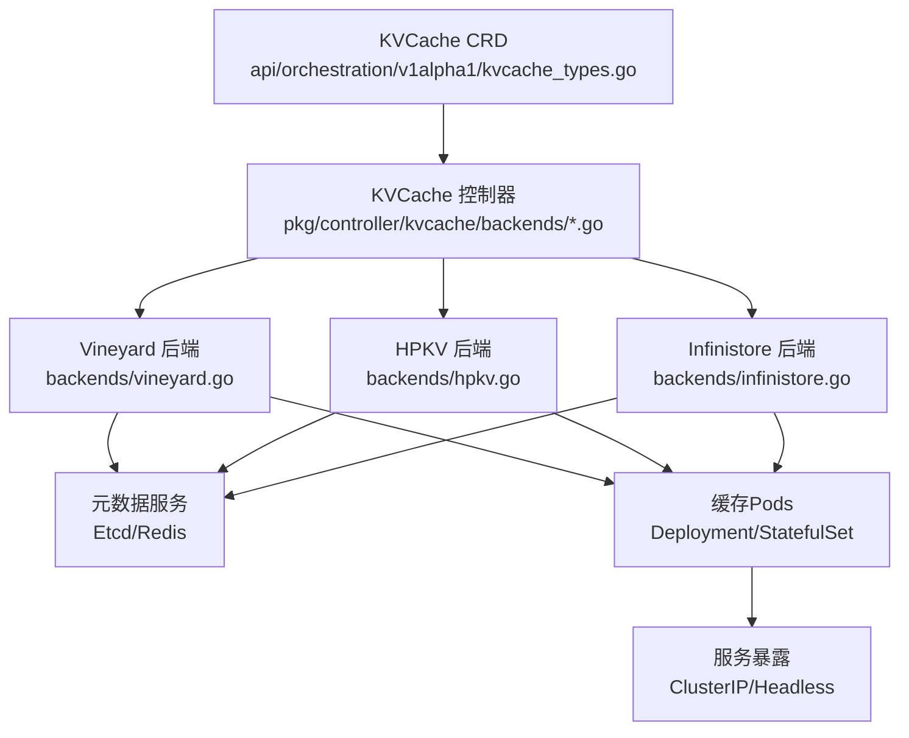
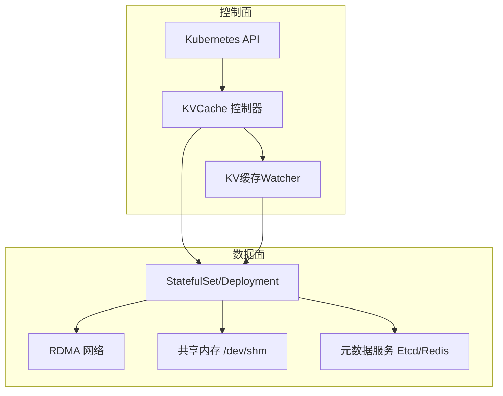
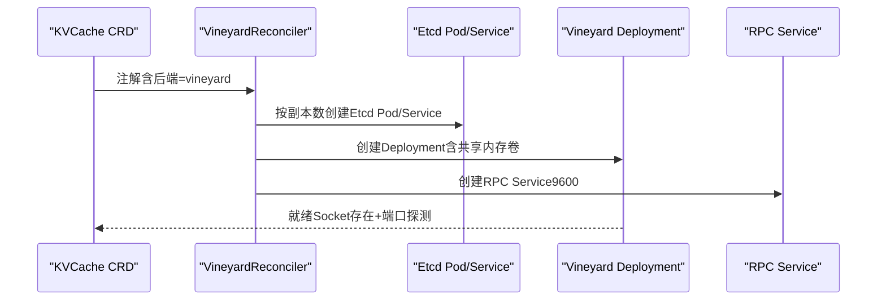
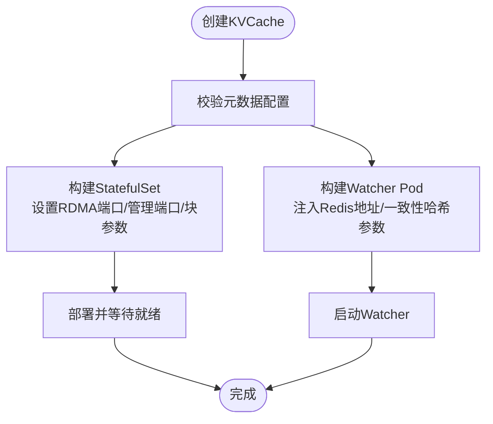
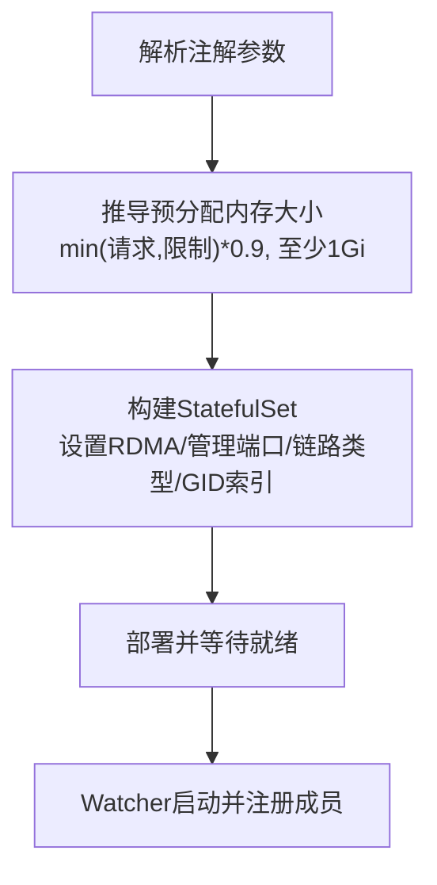
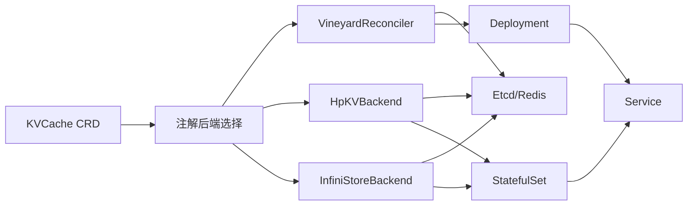

# KV缓存配置

<cite>
**本文引用的文件**
- [kvcache_types.go](file://api/orchestration/v1alpha1/kvcache_types.go)
- [kvcache.go](file://pkg/constants/kvcache.go)
- [vineyard.go](file://pkg/controller/kvcache/backends/vineyard.go)
- [infinistore.go](file://pkg/controller/kvcache/backends/infinistore.go)
- [hpkv.go](file://pkg/controller/kvcache/backends/hpkv.go)
- [types.go](file://pkg/cache/kvcache/types.go)
- [kvcache_controller_test.go](file://pkg/controller/kvcache/kvcache_controller_test.go)
- [kvcache_controller_ginkgo_test.go](file://pkg/controller/kvcache/kvcache_controller_ginkgo_test.go)
- [orchestration.aibrix.ai_kvcaches.yaml](file://config/crd/orchestration/orchestration.aibrix.ai_kvcaches.yaml)
</cite>

## 目录
1. [简介](#简介)
2. [项目结构](#项目结构)
3. [核心组件](#核心组件)
4. [架构总览](#架构总览)
5. [详细组件分析](#详细组件分析)
6. [依赖分析](#依赖分析)
7. [性能考虑](#性能考虑)
8. [故障排查指南](#故障排查指南)
9. [结论](#结论)
10. [附录](#附录)

## 简介
本教程面向AIBrix KV缓存系统的运维与开发人员，提供从架构原理到配置实践的完整指南。内容涵盖：
- KV缓存的三层架构：L1缓存（本地共享内存）、L2缓存（RDMA高性能缓存）与分布式缓存（跨节点一致性）
- 后端选择与配置：Vineyard、HPKV、Infinistore
- 参数调优：内存预分配、槽位与虚拟节点、RDMA端口与链路类型
- 内存管理、淘汰策略与性能优化
- 监控、故障排查与容量规划最佳实践

## 项目结构
AIBrix通过自定义资源KVCache统一编排缓存层，控制器根据注解选择后端并生成对应Deployment/StatefulSet、Service与元数据服务（Etcd/Redis）。关键目录与文件：
- CRD定义：api/orchestration/v1alpha1/kvcache_types.go
- 常量与标签：pkg/constants/kvcache.go
- 后端控制器：pkg/controller/kvcache/backends/{vineyard,infinistore,hpkv}.go
- 缓存事件与ZMQ客户端：pkg/cache/kvcache/types.go
- 示例与测试：config/crd/orchestration/... 与pkg/controller/kvcache/*_test.go

**图表来源**
- [kvcache_types.go:85-107](file://api/orchestration/v1alpha1/kvcache_types.go#L85-L107)
- [vineyard.go:43-64](file://pkg/controller/kvcache/backends/vineyard.go#L43-L64)
- [hpkv.go:98-104](file://pkg/controller/kvcache/backends/hpkv.go#L98-L104)
- [infinistore.go:93-99](file://pkg/controller/kvcache/backends/infinistore.go#L93-L99)

**章节来源**
- [kvcache_types.go:85-107](file://api/orchestration/v1alpha1/kvcache_types.go#L85-L107)
- [kvcache.go:19-43](file://pkg/constants/kvcache.go#L19-L43)

## 核心组件
- KVCache CRD：定义缓存模式（集中式/分布式）、元数据配置、缓存容器配置、Watcher与Service规格
- 后端选择：通过注解指定后端（vineyard/hpkv/infinistore），控制器据此生成对应资源
- 元数据服务：Etcd或Redis，用于KV缓存成员注册与状态同步
- 缓存实例：Deployment（Vineyard）或StatefulSet（HPKV/Infinistore），绑定RDMA网络与共享内存
- 服务暴露：ClusterIP或Headless Service，支持客户端直连或通过Watcher进行一致性哈希路由

**章节来源**
- [kvcache_types.go:85-107](file://api/orchestration/v1alpha1/kvcache_types.go#L85-L107)
- [kvcache.go:39-42](file://pkg/constants/kvcache.go#L39-L42)
- [kvcache_controller_test.go:28-61](file://pkg/controller/kvcache/kvcache_controller_test.go#L28-L61)

## 架构总览
AIBrix KV缓存采用“控制面+数据面”的分层设计：
- 控制面：控制器解析CRD与注解，生成后端资源；Watcher负责成员发现与一致性哈希
- 数据面：缓存实例通过RDMA与共享内存提供低延迟访问；元数据服务保障一致性

**图表来源**
- [vineyard.go:319-401](file://pkg/controller/kvcache/backends/vineyard.go#L319-L401)
- [hpkv.go:291-377](file://pkg/controller/kvcache/backends/hpkv.go#L291-L377)
- [infinistore.go:186-364](file://pkg/controller/kvcache/backends/infinistore.go#L186-L364)

## 详细组件分析

### 架构与策略选择
- L1缓存（本地共享内存）：通过共享内存卷与进程内缓存实现极低延迟；适用于单机多进程推理场景
- L2缓存（RDMA高性能）：基于RDMA网络与大块内存池，支持高吞吐与低时延；适合多节点协作
- 分布式缓存：通过一致性哈希与Watcher实现跨节点成员管理与路由

**章节来源**
- [vineyard.go:358-396](file://pkg/controller/kvcache/backends/vineyard.go#L358-L396)
- [hpkv.go:354-371](file://pkg/controller/kvcache/backends/hpkv.go#L354-L371)
- [infinistore.go:349-358](file://pkg/controller/kvcache/backends/infinistore.go#L349-L358)

### 后端配置详解

#### Vineyard 后端
- 元数据：当前支持Etcd，可按副本数部署；Redis支持在后续版本中启用
- 缓存实例：Deployment，挂载共享内存与日志卷，健康检查基于Unix Socket与端口探测
- 调度：支持节点亲和（GPU类型与键名可配置）、Pod亲/反亲和
- 服务：RPC服务暴露9600端口

**图表来源**
- [vineyard.go:43-64](file://pkg/controller/kvcache/backends/vineyard.go#L43-L64)
- [vineyard.go:109-159](file://pkg/controller/kvcache/backends/vineyard.go#L109-L159)
- [vineyard.go:219-401](file://pkg/controller/kvcache/backends/vineyard.go#L219-L401)

**章节来源**
- [vineyard.go:67-108](file://pkg/controller/kvcache/backends/vineyard.go#L67-L108)
- [vineyard.go:219-401](file://pkg/controller/kvcache/backends/vineyard.go#L219-L401)

#### HPKV 后端
- 元数据：Redis（可选外部连接）
- 缓存实例：StatefulSet，使用共享内存与RDMA能力；通过命令行参数配置RDMA端口、管理端口、块大小与块数量
- Watcher：以Pod形式运行，注入Redis地址与一致性哈希参数
- 服务：Headless Service，便于客户端直接连接各副本

**图表来源**
- [hpkv.go:74-79](file://pkg/controller/kvcache/backends/hpkv.go#L74-L79)
- [hpkv.go:106-189](file://pkg/controller/kvcache/backends/hpkv.go#L106-L189)
- [hpkv.go:191-377](file://pkg/controller/kvcache/backends/hpkv.go#L191-L377)

**章节来源**
- [hpkv.go:74-79](file://pkg/controller/kvcache/backends/hpkv.go#L74-L79)
- [hpkv.go:106-189](file://pkg/controller/kvcache/backends/hpkv.go#L106-L189)
- [hpkv.go:191-377](file://pkg/controller/kvcache/backends/hpkv.go#L191-L377)

#### Infinistore 后端
- 元数据：Redis（可选外部连接）
- 缓存实例：StatefulSet，自动推导预分配内存大小（基于容器内存限制的0.9倍），支持RDMA与管理端口
- Watcher：以Pod形式运行，注入Redis地址与一致性哈希参数
- 服务：Headless Service，暴露服务端口与管理端口

**图表来源**
- [infinistore.go:402-412](file://pkg/controller/kvcache/backends/infinistore.go#L402-L412)
- [infinistore.go:417-437](file://pkg/controller/kvcache/backends/infinistore.go#L417-L437)
- [infinistore.go:186-364](file://pkg/controller/kvcache/backends/infinistore.go#L186-L364)

**章节来源**
- [infinistore.go:402-412](file://pkg/controller/kvcache/backends/infinistore.go#L402-L412)
- [infinistore.go:417-437](file://pkg/controller/kvcache/backends/infinistore.go#L417-L437)
- [infinistore.go:186-364](file://pkg/controller/kvcache/backends/infinistore.go#L186-L364)

### 配置参数与调优

#### 后端选择与注解
- 通过注解选择后端：vineyard、hpkv、infinistore
- 控制器会根据注解读取端口、槽位、虚拟节点、块大小等参数

**章节来源**
- [kvcache.go:39-42](file://pkg/constants/kvcache.go#L39-L42)
- [kvcache_controller_test.go:28-61](file://pkg/controller/kvcache/kvcache_controller_test.go#L28-L61)

#### HPKV 参数
- RDMA端口、管理端口、块大小（字节）、块数量、总槽位、虚拟节点数
- 可通过注解覆盖默认值

**章节来源**
- [hpkv.go:35-51](file://pkg/controller/kvcache/backends/hpkv.go#L35-L51)
- [hpkv.go:415-424](file://pkg/controller/kvcache/backends/hpkv.go#L415-L424)

#### Infinistore 参数
- RDMA端口、管理端口、链路类型（如Ethernet）、总槽位、虚拟节点数、GID索引
- 预分配内存大小自动推导：min(请求,限制)*0.9，至少1Gi

**章节来源**
- [infinistore.go:35-47](file://pkg/controller/kvcache/backends/infinistore.go#L35-L47)
- [infinistore.go:402-412](file://pkg/controller/kvcache/backends/infinistore.go#L402-L412)
- [infinistore.go:417-437](file://pkg/controller/kvcache/backends/infinistore.go#L417-L437)

#### Vineyard 参数
- 通过环境变量注入UID/名称/命名空间/主机名/Pod IP等
- 支持节点亲和（GPU类型与键名可配置）、Pod亲/反亲和

**章节来源**
- [vineyard.go:220-231](file://pkg/controller/kvcache/backends/vineyard.go#L220-L231)
- [vineyard.go:235-294](file://pkg/controller/kvcache/backends/vineyard.go#L235-L294)

### 缓存事件与ZMQ客户端
- ZMQ客户端配置包含发布/路由端口、轮询超时、重放超时、重连间隔与缓冲区大小
- 提供默认配置与校验逻辑（IP格式、端口范围）

**章节来源**
- [types.go:28-92](file://pkg/cache/kvcache/types.go#L28-L92)

## 依赖分析
- KVCache CRD定义了缓存模式、元数据与缓存容器规格
- 控制器根据注解选择后端，生成对应Deployment/StatefulSet与Service
- 元数据服务（Etcd/Redis）由控制器或用户提供的外部连接配置驱动
- Watcher负责成员注册与一致性哈希路由

**图表来源**
- [kvcache_types.go:85-107](file://api/orchestration/v1alpha1/kvcache_types.go#L85-L107)
- [kvcache.go:39-42](file://pkg/constants/kvcache.go#L39-L42)
- [vineyard.go:43-64](file://pkg/controller/kvcache/backends/vineyard.go#L43-L64)
- [hpkv.go:98-104](file://pkg/controller/kvcache/backends/hpkv.go#L98-L104)
- [infinistore.go:93-99](file://pkg/controller/kvcache/backends/infinistore.go#L93-L99)

**章节来源**
- [kvcache_types.go:85-107](file://api/orchestration/v1alpha1/kvcache_types.go#L85-L107)
- [kvcache.go:39-42](file://pkg/constants/kvcache.go#L39-L42)

## 性能考虑
- RDMA与共享内存：确保容器具备IPC_LOCK能力与共享内存卷，避免跨节点网络开销
- 预分配内存：Infinistore按容器内存限制的0.9倍推导，建议为缓存预留充足内存并避免过度压缩
- 一致性哈希：合理设置总槽位与虚拟节点数，平衡分布均匀性与内存占用
- 端口与链路：HPKV/Infinistore的RDMA端口与管理端口需避免冲突，并与集群防火墙策略一致
- 调度与亲和：通过节点与Pod亲/反亲和减少跨机调度带来的网络抖动

[本节为通用指导，无需特定文件引用]

## 故障排查指南
- 后端未生效：确认注解是否正确设置为vineyard/hpkv/infinistore
- 元数据缺失：Etcd/Redis配置必须至少提供其一；否则控制器会返回错误
- RDMA不可用：检查RDMA资源与CNI配置，确保容器具备IPC_LOCK权限
- 服务端口冲突：核对RDMA与管理端口，避免与其他服务重复
- 监控指标：Watcher与缓存实例均暴露Prometheus指标端口，可通过ServiceMonitor采集

**章节来源**
- [kvcache_controller_test.go:28-61](file://pkg/controller/kvcache/kvcache_controller_test.go#L28-L61)
- [hpkv.go:74-79](file://pkg/controller/kvcache/backends/hpkv.go#L74-L79)
- [infinistore.go:402-412](file://pkg/controller/kvcache/backends/infinistore.go#L402-L412)
- [types.go:28-92](file://pkg/cache/kvcache/types.go#L28-L92)

## 结论
AIBrix KV缓存通过统一的CRD与控制器，实现了对多种后端的标准化编排。通过合理选择后端、配置参数与调度策略，可在不同场景下获得稳定的低延迟与高吞吐表现。建议结合监控与容量规划持续优化，确保生产环境的稳定性与可扩展性。

[本节为总结，无需特定文件引用]

## 附录

### CRD与示例参考
- KVCache CRD定义：包含模式、元数据、缓存容器、Watcher与Service字段
- 示例与测试：控制器单元测试展示了注解后端选择与默认值行为

**章节来源**
- [kvcache_types.go:85-107](file://api/orchestration/v1alpha1/kvcache_types.go#L85-L107)
- [kvcache_controller_test.go:28-61](file://pkg/controller/kvcache/kvcache_controller_test.go#L28-L61)
- [kvcache_controller_ginkgo_test.go:50-85](file://pkg/controller/kvcache/kvcache_controller_ginkgo_test.go#L50-L85)