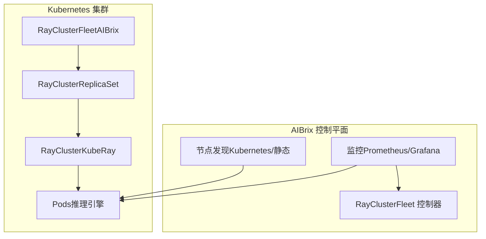
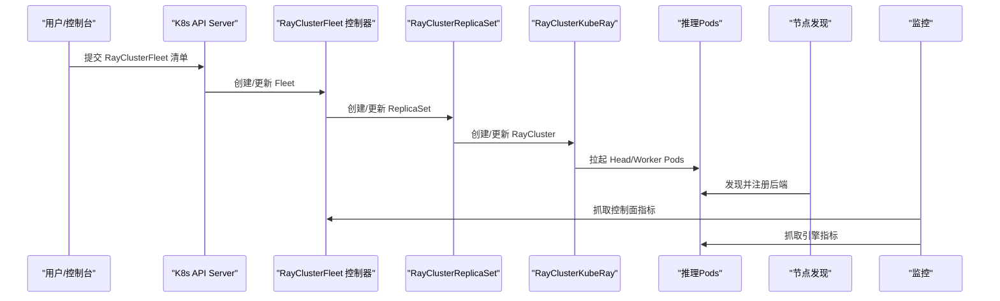
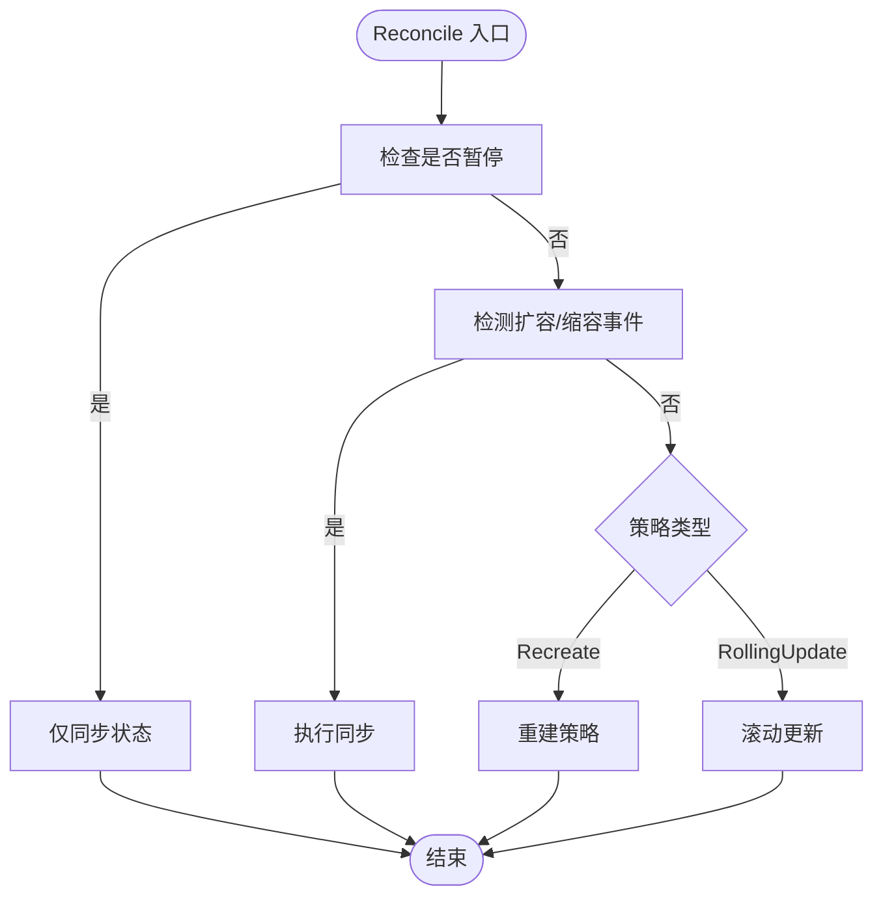
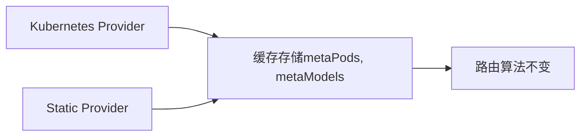
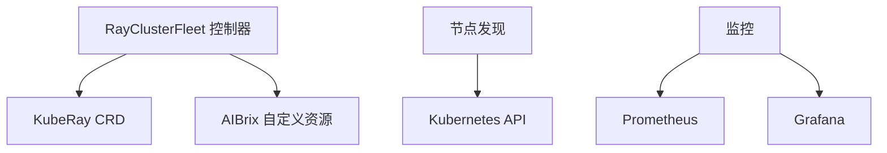

# 分布式推理配置

<cite>
**本文引用的文件**
- [rayclusterfleet_types.go](file://api/orchestration/v1alpha1/rayclusterfleet_types.go)
- [raycluster_type.go](file://api/orchestration/v1alpha1/raycluster_type.go)
- [rayclusterfleet_controller.go](file://pkg/controller/rayclusterfleet/rayclusterfleet_controller.go)
- [fleet.yaml（示例）](file://samples/distributed/fleet.yaml)
- [fleet.yaml（开发教程）](file://development/tutorials/distributed/fleet.yaml)
- [raycluster.yaml（开发教程）](file://development/tutorials/distributed/raycluster.yaml)
- [monitor.yaml](file://config/prometheus/monitor.yaml)
- [AIBrix_Control_Plane_Runtime_Dashboard.json](file://observability/grafana/AIBrix_Control_Plane_Runtime_Dashboard.json)
- [kubernetes.go](file://pkg/cache/discovery/kubernetes.go)
- [static.go](file://pkg/cache/discovery/static.go)
- [README.md（节点发现）](file://pkg/cache/discovery/README.md)
- [console.pb.go](file://apps/console/api/gen/console/v1/console.pb.go)
- [CreateModelDeploymentTemplate.tsx](file://apps/console/web/src/components/CreateModelDeploymentTemplate.tsx)
</cite>

## 目录
1. [简介](#简介)
2. [项目结构](#项目结构)
3. [核心组件](#核心组件)
4. [架构总览](#架构总览)
5. [详细组件分析](#详细组件分析)
6. [依赖分析](#依赖分析)
7. [性能考虑](#性能考虑)
8. [故障排查指南](#故障排查指南)
9. [结论](#结论)
10. [附录](#附录)

## 简介
本教程面向希望在Kubernetes上构建多节点分布式推理集群的用户，基于AIBrix的Ray集群编排与Fleet控制器能力，提供从部署到运维的完整配置指南。内容涵盖：
- 多节点推理集群的部署与配置（Ray集群、Fleet编排）
- 分布式推理池的设置与管理
- 完整的YAML部署清单与参数说明
- 节点发现、负载均衡与故障转移策略
- 数据并行、模型并行与流水线并行的配置思路与适用场景
- 性能调优、网络优化与监控告警实践

## 项目结构
AIBrix通过自定义资源类型与控制器实现对Ray集群的编排与管理，并提供节点发现、路由与监控等配套能力：
- 自定义资源：RayClusterFleet、RayCluster等
- 控制器：RayClusterFleet控制器负责编排与滚动更新
- 节点发现：支持Kubernetes与静态配置两种模式
- 监控：Prometheus ServiceMonitor与Grafana仪表盘

**图表来源**
- [rayclusterfleet_types.go:27-74](file://api/orchestration/v1alpha1/rayclusterfleet_types.go#L27-L74)
- [raycluster_type.go:24-34](file://api/orchestration/v1alpha1/raycluster_type.go#L24-L34)
- [rayclusterfleet_controller.go:74-87](file://pkg/controller/rayclusterfleet/rayclusterfleet_controller.go#L74-L87)
- [monitor.yaml:1-19](file://config/prometheus/monitor.yaml#L1-L19)
- [AIBrix_Control_Plane_Runtime_Dashboard.json:1-1228](file://observability/grafana/AIBrix_Control_Plane_Runtime_Dashboard.json#L1-L1228)

**章节来源**
- [rayclusterfleet_types.go:27-74](file://api/orchestration/v1alpha1/rayclusterfleet_types.go#L27-L74)
- [raycluster_type.go:24-34](file://api/orchestration/v1alpha1/raycluster_type.go#L24-L34)
- [rayclusterfleet_controller.go:74-87](file://pkg/controller/rayclusterfleet/rayclusterfleet_controller.go#L74-L87)
- [monitor.yaml:1-19](file://config/prometheus/monitor.yaml#L1-L19)
- [AIBrix_Control_Plane_Runtime_Dashboard.json:1-1228](file://observability/grafana/AIBrix_Control_Plane_Runtime_Dashboard.json#L1-L1228)

## 核心组件
- RayClusterFleet：用于声明式管理一组RayCluster实例，支持滚动更新与回滚策略，自动匹配标签选择器并维护期望副本数。
- RayClusterReplicaSet：作为Fleet的子资源，负责具体RayCluster的创建与生命周期管理。
- RayCluster：由KubeRay提供的标准CRD，描述Head与Worker组的规格、镜像、资源与端口等。
- 节点发现：通过Kubernetes Provider或静态配置加载推理后端地址，形成统一的路由与调度视图。
- 监控：通过ServiceMonitor暴露指标，Grafana仪表盘展示控制面与工作队列状态。

**章节来源**
- [rayclusterfleet_types.go:27-74](file://api/orchestration/v1alpha1/rayclusterfleet_types.go#L27-L74)
- [raycluster_type.go:24-34](file://api/orchestration/v1alpha1/raycluster_type.go#L24-L34)
- [rayclusterfleet_controller.go:107-183](file://pkg/controller/rayclusterfleet/rayclusterfleet_controller.go#L107-L183)
- [kubernetes.go:34-129](file://pkg/cache/discovery/kubernetes.go#L34-L129)
- [static.go:66-160](file://pkg/cache/discovery/static.go#L66-L160)

## 架构总览
下图展示了从Fleet到RayCluster再到Pod的工作流，以及节点发现与监控如何贯穿其中：

**图表来源**
- [rayclusterfleet_controller.go:107-183](file://pkg/controller/rayclusterfleet/rayclusterfleet_controller.go#L107-L183)
- [rayclusterfleet_types.go:27-74](file://api/orchestration/v1alpha1/rayclusterfleet_types.go#L27-L74)
- [raycluster_type.go:24-34](file://api/orchestration/v1alpha1/raycluster_type.go#L24-L34)
- [monitor.yaml:1-19](file://config/prometheus/monitor.yaml#L1-L19)

## 详细组件分析

### RayClusterFleet 编排
- 关键字段
  - replicas：期望副本数
  - selector：标签选择器，用于匹配RayCluster
  - template：RayCluster模板，含headGroupSpec与workerGroupSpec
  - strategy：滚动更新策略（maxSurge、maxUnavailable）
- 控制器行为
  - 基于选择器列出RayCluster并映射到ReplicaSet
  - 在暂停状态下仅同步状态
  - 支持回滚到指定版本
  - 根据策略执行重建或滚动更新

**图表来源**
- [rayclusterfleet_controller.go:107-183](file://pkg/controller/rayclusterfleet/rayclusterfleet_controller.go#L107-L183)

**章节来源**
- [rayclusterfleet_types.go:27-74](file://api/orchestration/v1alpha1/rayclusterfleet_types.go#L27-L74)
- [rayclusterfleet_controller.go:107-183](file://pkg/controller/rayclusterfleet/rayclusterfleet_controller.go#L107-L183)

### RayCluster 模板与端口
- headGroupSpec：定义Head节点的启动参数、容器命令与端口映射（如GCS、Dashboard、客户端、服务端口）
- workerGroupSpec：定义Worker组的副本数、最小/最大副本、容器命令与生命周期钩子（如停止时优雅退出）

**章节来源**
- [raycluster_type.go:24-34](file://api/orchestration/v1alpha1/raycluster_type.go#L24-L34)
- [raycluster.yaml（开发教程）:9-66](file://development/tutorials/distributed/raycluster.yaml#L9-L66)

### Fleet 示例与参数说明
- 示例清单：提供完整的Fleet定义，包含Head与Worker的镜像、资源、端口与滚动更新策略
- 关键参数
  - replicas：期望副本数
  - selector.matchLabels：用于匹配RayCluster
  - template.headGroupSpec：Head节点配置
  - template.workerGroupSpecs：Worker组配置
  - template.annotations：覆盖容器命令注入

**章节来源**
- [fleet.yaml（示例）:1-55](file://samples/distributed/fleet.yaml#L1-L55)
- [fleet.yaml（开发教程）:1-79](file://development/tutorials/distributed/fleet.yaml#L1-L79)

### 节点发现与路由
- Kubernetes Provider：通过Informers监听Pod与ModelAdapter变更，进行初始同步与后续增量更新
- Static Provider：读取静态YAML配置，将地址转换为合成Pod对象，便于离线或非Kubernetes环境使用
- 架构图：展示Provider接口、缓存存储与路由算法的关系

**图表来源**
- [kubernetes.go:34-129](file://pkg/cache/discovery/kubernetes.go#L34-L129)
- [static.go:66-160](file://pkg/cache/discovery/static.go#L66-L160)
- [README.md（节点发现）:75-109](file://pkg/cache/discovery/README.md#L75-L109)

**章节来源**
- [kubernetes.go:34-129](file://pkg/cache/discovery/kubernetes.go#L34-L129)
- [static.go:66-160](file://pkg/cache/discovery/static.go#L66-L160)
- [README.md（节点发现）:75-109](file://pkg/cache/discovery/README.md#L75-L109)

### 并行化配置与控制台集成
- 控制台支持在部署模板中设置并行维度（tp、pp、dp、ep、sp、cp），用于指导推理引擎的并行策略
- 引擎参数可通过engineArgs传递给推理后端（如vLLM的张量并行大小等）

**章节来源**
- [console.pb.go:2087-2097](file://apps/console/api/gen/console/v1/console.pb.go#L2087-L2097)
- [CreateModelDeploymentTemplate.tsx:491-509](file://apps/console/web/src/components/CreateModelDeploymentTemplate.tsx#L491-L509)

## 依赖分析
- 控制器依赖KubeRay CRD与AIBrix自定义资源（RayClusterFleet、RayClusterReplicaSet）
- 节点发现依赖Kubernetes API与CRD Informers
- 监控依赖Prometheus ServiceMonitor与Grafana仪表盘

**图表来源**
- [rayclusterfleet_controller.go:74-87](file://pkg/controller/rayclusterfleet/rayclusterfleet_controller.go#L74-L87)
- [monitor.yaml:1-19](file://config/prometheus/monitor.yaml#L1-L19)

**章节来源**
- [rayclusterfleet_controller.go:74-87](file://pkg/controller/rayclusterfleet/rayclusterfleet_controller.go#L74-L87)
- [monitor.yaml:1-19](file://config/prometheus/monitor.yaml#L1-L19)

## 性能考虑
- 资源与副本
  - 合理设置CPU/GPU配额与requests/limits，避免过度竞争
  - Worker组的min/max副本应结合流量峰值与弹性伸缩策略
- 网络与端口
  - Head节点需开放GCS、Dashboard、客户端与服务端口，确保Worker可连接
  - 使用稳定的服务名与端口，避免频繁DNS解析
- 并行策略
  - 数据并行：通过增加Worker副本提升吞吐
  - 模型并行：通过引擎参数设置张量并行大小
  - 流水线并行：结合Prefill/Decode角色集实现解码加速
- 滚动更新
  - 使用合理的maxSurge与maxUnavailable，降低更新过程中的抖动

[本节为通用建议，无需特定文件引用]

## 故障排查指南
- 控制面指标
  - 使用ServiceMonitor暴露控制面指标，Grafana仪表盘查看工作队列深度、重试速率与错误计数
- 常见问题定位
  - Fleet未选择任何RayCluster：检查selector是否为空或不匹配
  - 更新失败或进度超时：检查progressDeadlineSeconds与策略配置
  - Worker无法加入集群：核对Head端口连通性与容器命令注入
- 日志与事件
  - 关注控制器事件记录与Pod状态变化，定位异常删除或创建失败

**章节来源**
- [monitor.yaml:1-19](file://config/prometheus/monitor.yaml#L1-L19)
- [AIBrix_Control_Plane_Runtime_Dashboard.json:1-1228](file://observability/grafana/AIBrix_Control_Plane_Runtime_Dashboard.json#L1-L1228)
- [rayclusterfleet_controller.go:125-137](file://pkg/controller/rayclusterfleet/rayclusterfleet_controller.go#L125-L137)

## 结论
通过AIBrix的RayClusterFleet与KubeRay编排，可以高效地在Kubernetes上构建稳定的多节点分布式推理集群。结合节点发现与监控体系，能够实现从部署、扩缩容到运行时可观测性的全链路管理。根据业务需求选择合适的并行策略与网络配置，可进一步提升吞吐与稳定性。

[本节为总结，无需特定文件引用]

## 附录

### 完整部署清单与参数说明
- RayClusterFleet（示例）
  - 字段参考：replicas、selector、template、strategy
  - 参考路径：[fleet.yaml（示例）:1-55](file://samples/distributed/fleet.yaml#L1-L55)
- RayCluster（示例）
  - 字段参考：headGroupSpec、workerGroupSpecs、ports、command/args
  - 参考路径：[raycluster.yaml（开发教程）:1-66](file://development/tutorials/distributed/raycluster.yaml#L1-L66)
- 开发教程中的Fleet
  - 包含Head/Worker端口、滚动更新策略与命令注入
  - 参考路径：[fleet.yaml（开发教程）:1-79](file://development/tutorials/distributed/fleet.yaml#L1-L79)

**章节来源**
- [fleet.yaml（示例）:1-55](file://samples/distributed/fleet.yaml#L1-L55)
- [raycluster.yaml（开发教程）:1-66](file://development/tutorials/distributed/raycluster.yaml#L1-L66)
- [fleet.yaml（开发教程）:1-79](file://development/tutorials/distributed/fleet.yaml#L1-L79)

### 负载均衡与故障转移
- 负载均衡
  - 通过节点发现聚合后端，结合路由算法实现请求分发
- 故障转移
  - Worker组的min副本保障可用性；滚动更新策略减少停机时间
  - 控制器对异常状态进行记录与重试

**章节来源**
- [kubernetes.go:34-129](file://pkg/cache/discovery/kubernetes.go#L34-L129)
- [static.go:66-160](file://pkg/cache/discovery/static.go#L66-L160)
- [rayclusterfleet_controller.go:107-183](file://pkg/controller/rayclusterfleet/rayclusterfleet_controller.go#L107-L183)