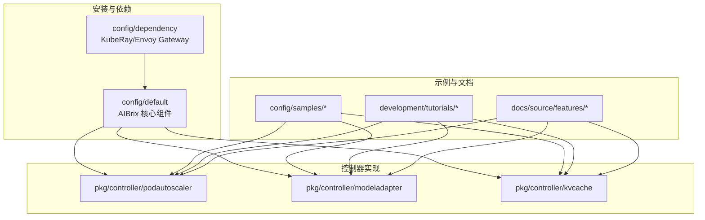
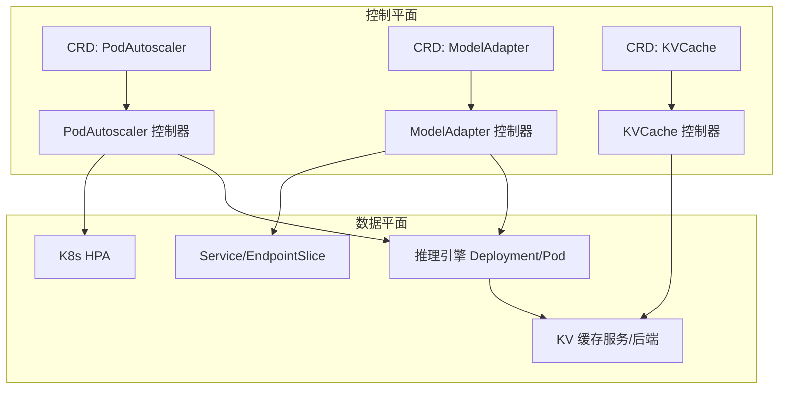
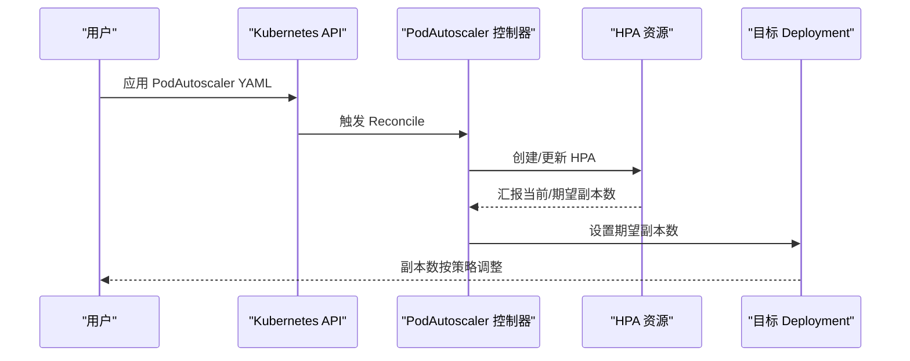
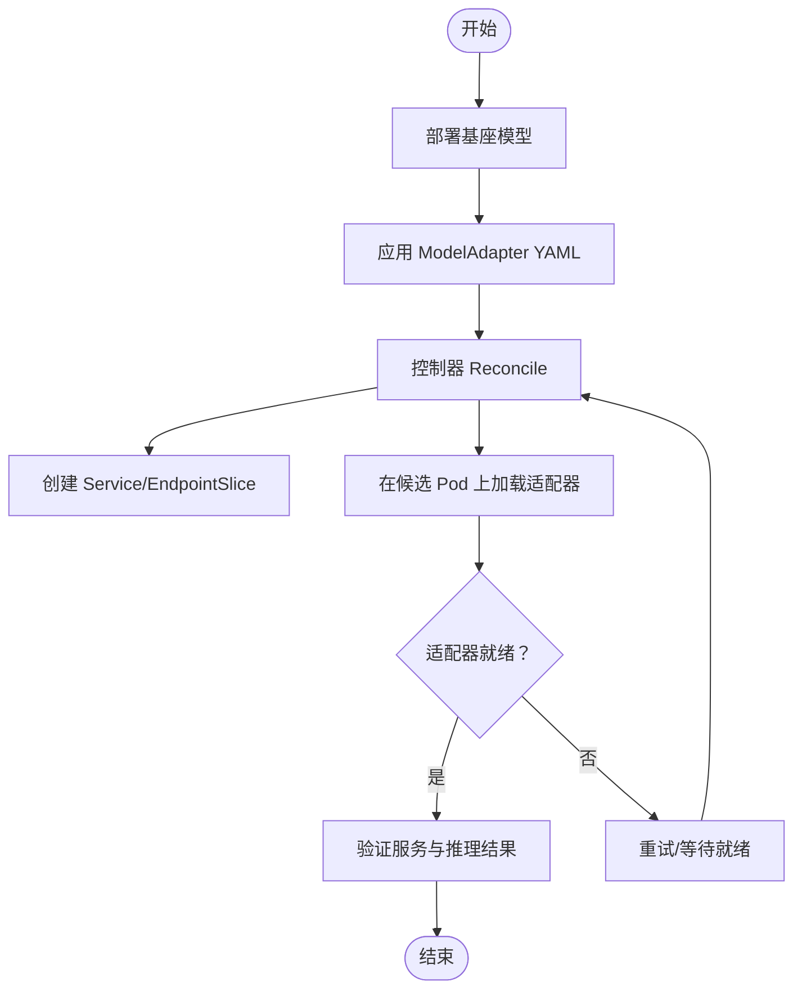
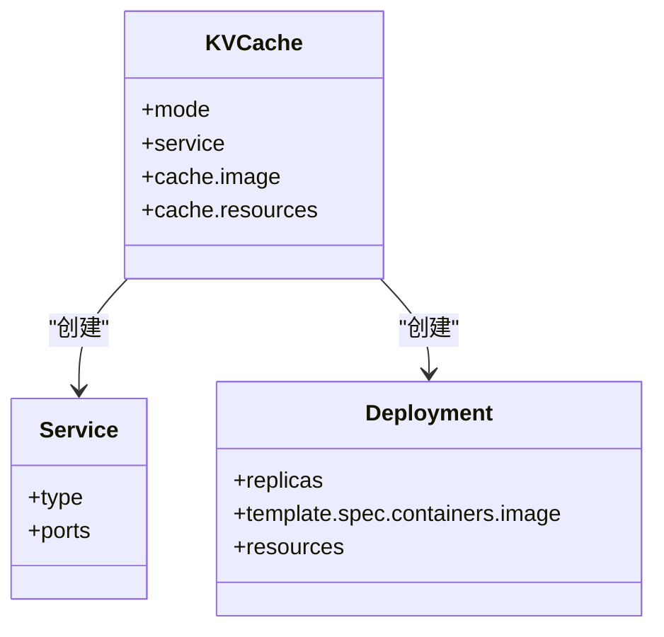
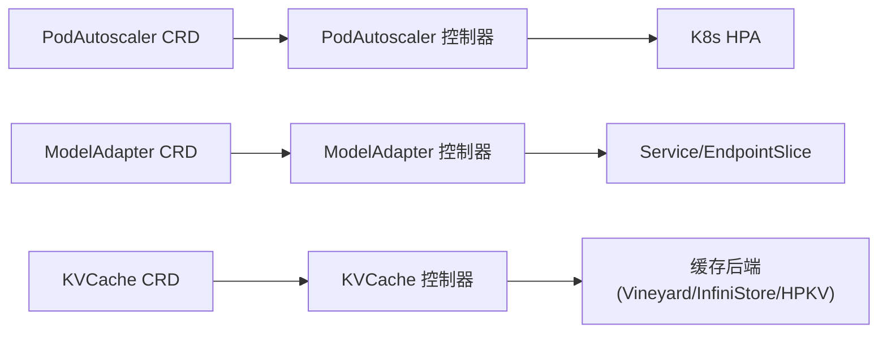

# 基础教程

<cite>
**本文引用的文件**
- [README.md](file://README.md)
- [autoscaling_v1alpha1_podautoscaler.yaml](file://config/samples/autoscaling_v1alpha1_podautoscaler.yaml)
- [model_v1alpha1_modeladapter.yaml](file://config/samples/model_v1alpha1_modeladapter.yaml)
- [orchestration_v1alpha1_kvcache.yaml](file://config/samples/orchestration_v1alpha1_kvcache.yaml)
- [podautoscaler/README.md](file://development/tutorials/podautoscaler/README.md)
- [kvcache/kvcache.yaml](file://development/tutorials/kvcache/kvcache.yaml)
- [model_adapter.yaml](file://development/tutorials/lora/model_adapter.yaml)
- [model_adapter_api_key.yaml](file://development/tutorials/lora/model_adapter_api_key.yaml)
- [kvcache_controller.go](file://pkg/controller/kvcache/kvcache_controller.go)
- [modeladapter_controller.go](file://pkg/controller/modeladapter/modeladapter_controller.go)
- [podautoscaler_controller.go](file://pkg/controller/podautoscaler/podautoscaler_controller.go)
- [kvcache-offloading.rst](file://docs/source/features/kvcache-offloading.rst)
</cite>

## 目录
1. [简介](#简介)
2. [项目结构](#项目结构)
3. [核心组件](#核心组件)
4. [架构总览](#架构总览)
5. [详细组件分析](#详细组件分析)
6. [依赖关系分析](#依赖关系分析)
7. [性能考虑](#性能考虑)
8. [故障排查指南](#故障排查指南)
9. [结论](#结论)
10. [附录](#附录)

## 简介
本教程面向首次接触 AIBrix 的用户，系统性介绍其基础能力与实操方法，重点覆盖以下主题：
- 自动伸缩配置：HPA/KPA/APA 三种策略的差异、适用场景与参数调优
- 模型适配器部署：LoRA 动态加载、服务暴露与状态管理
- KV 缓存设置：集中式缓存模式、后端选择与缓存策略
- 推理引擎对接：不同引擎（如 vLLM/SGLang）的连接器与环境变量配置
- 部署与验证：完整的 YAML 示例、kubectl 操作与输出解读

通过循序渐进的学习路径，帮助您快速掌握 AIBrix 的基本使用技能。

## 项目结构
AIBrix 采用分层与按功能域组织的结构：
- api：自定义资源类型定义（CRD），涵盖 autoscaling、model、orchestration 三大域
- pkg/controller：控制器实现，负责 CR 的实际编排与落地
- config/samples：官方示例，展示各组件的最小可用配置
- development/tutorials：教学示例与演示流程
- docs：官方文档，包含特性说明与最佳实践
- config：安装清单与依赖项（含 KubeRay、Envoy Gateway 等）

图示来源
- [README.md:50-69](file://README.md#L50-L69)
- [podautoscaler_controller.go:103-111](file://pkg/controller/podautoscaler/podautoscaler_controller.go#L103-L111)
- [modeladapter_controller.go:127-135](file://pkg/controller/modeladapter/modeladapter_controller.go#L127-L135)
- [kvcache_controller.go:51-59](file://pkg/controller/kvcache/kvcache_controller.go#L51-L59)

章节来源
- [README.md:46-69](file://README.md#L46-L69)

## 核心组件
- 自动伸缩控制器（PodAutoscaler）
  - 支持 HPA、KPA、APA 三种策略，统一在控制器内按需实例化算法
  - 提供规范校验、冲突检测、状态更新与事件记录
- 模型适配器控制器（ModelAdapter）
  - 负责 LoRA 等适配器的动态加载、服务与 EndpointSlice 管理
  - 支持单节点/全节点加载模式与调度策略
- KV 缓存控制器（KVCache）
  - 支持集中式模式与多种后端（Vineyard/InfiniStore/HPKV）
  - 通过注解与标签选择后端，自动编排缓存服务与缓存 Pod

章节来源
- [podautoscaler_controller.go:18-27](file://pkg/controller/podautoscaler/podautoscaler_controller.go#L18-L27)
- [modeladapter_controller.go:177-190](file://pkg/controller/modeladapter/modeladapter_controller.go#L177-L190)
- [kvcache_controller.go:62-75](file://pkg/controller/kvcache/kvcache_controller.go#L62-L75)

## 架构总览
下图展示了 AIBrix 控制平面与数据平面的交互关系：控制器监听 CR 变更，生成或更新工作负载与服务；推理引擎通过连接器与 KV 缓存协作，实现高效推理。

图示来源
- [podautoscaler_controller.go:200-206](file://pkg/controller/podautoscaler/podautoscaler_controller.go#L200-L206)
- [modeladapter_controller.go:243-255](file://pkg/controller/modeladapter/modeladapter_controller.go#L243-L255)
- [kvcache_controller.go:102-124](file://pkg/controller/kvcache/kvcache_controller.go#L102-L124)

## 详细组件分析

### 自动伸缩：HPA/KPA/APA 差异与配置
- HPA 策略
  - 由控制器生成并维护标准 HPA 资源，目标指标可为 CPU/内存或外部指标
  - 适合已有成熟 HPA 生态的场景，部署简单
- KPA 策略
  - 基于 Knative 风格的 Panic/Stable 窗口，适用于低延迟响应需求
  - 适合对抖动敏感的应用，但当前默认 HPA 响应速度有限
- APA 策略
  - 应用自定义指标驱动的伸缩，适合业务指标明确的推理服务
  - 通过 WorkloadScaler 对 Deployment/StormService 等进行直接缩放

配置要点与验证步骤
- 配置示例参考
  - [autoscaling_v1alpha1_podautoscaler.yaml](file://config/samples/autoscaling_v1alpha1_podautoscaler.yaml)
- 部署与验证
  - 安装 AIBrix 依赖与核心组件
  - 创建 Nginx 示例与 PodAutoscaler
  - 使用压测工具提升 CPU 利用率，观察副本数变化
  - 查看 HPA/事件日志确认策略生效

图示来源
- [podautoscaler_controller.go:664-715](file://pkg/controller/podautoscaler/podautoscaler_controller.go#L664-L715)
- [podautoscaler/README.md:92-162](file://development/tutorials/podautoscaler/README.md#L92-L162)

章节来源
- [podautoscaler_controller.go:18-27](file://pkg/controller/podautoscaler/podautoscaler_controller.go#L18-L27)
- [podautoscaler/README.md:92-162](file://development/tutorials/podautoscaler/README.md#L92-L162)
- [autoscaling_v1alpha1_podautoscaler.yaml:1-18](file://config/samples/autoscaling_v1alpha1_podautoscaler.yaml#L1-L18)

### 模型适配器：LoRA 动态加载与服务暴露
- 关键能力
  - 通过 ModelAdapter CR 管理 LoRA 等轻量适配器
  - 自动创建 Service 与 EndpointSlice，支持多副本与 API Key 注入
  - 支持“全节点加载”与“单节点加载”，并内置调度策略
- 配置示例
  - 基础 LoRA 适配器：[model_adapter.yaml](file://development/tutorials/lora/model_adapter.yaml)
  - 带 API Key 的适配器：[model_adapter_api_key.yaml](file://development/tutorials/lora/model_adapter_api_key.yaml)
- 部署与验证
  - 先部署基座模型（如 llama2-7b），再应用 ModelAdapter
  - 使用 kubectl get/endpoints/事件查看适配器状态与加载进度
  - 通过 Service 访问推理接口，验证 LoRA 生效

图示来源
- [modeladapter_controller.go:417-493](file://pkg/controller/modeladapter/modeladapter_controller.go#L417-L493)
- [model_adapter.yaml:1-16](file://development/tutorials/lora/model_adapter.yaml#L1-L16)
- [model_adapter_api_key.yaml:1-19](file://development/tutorials/lora/model_adapter_api_key.yaml#L1-L19)

章节来源
- [modeladapter_controller.go:311-369](file://pkg/controller/modeladapter/modeladapter_controller.go#L311-L369)
- [model_adapter.yaml:1-16](file://development/tutorials/lora/model_adapter.yaml#L1-L16)
- [model_adapter_api_key.yaml:1-19](file://development/tutorials/lora/model_adapter_api_key.yaml#L1-L19)

### KV 缓存：集中式模式与后端选择
- 模式与组件
  - 集中式模式：统一的缓存服务与 Deployment，便于跨引擎复用
  - 后端支持：Vineyard、InfiniStore、HPKV 等，通过注解选择
- 配置示例
  - 集中式 KVCache 示例：[orchestration_v1alpha1_kvcache.yaml](file://config/samples/orchestration_v1alpha1_kvcache.yaml)
  - 教学示例（带亲和性与资源限制）：[kvcache/kvcache.yaml](file://development/tutorials/kvcache/kvcache.yaml)
- 部署与验证
  - 应用 KVCache YAML，观察 Service/Deployment/Pod 状态
  - 在推理引擎中配置连接参数（如元数据服务地址、连接类型等）
  - 通过网关或本地端口转发访问推理服务，验证 KV 复用效果

图示来源
- [kvcache_controller.go:102-124](file://pkg/controller/kvcache/kvcache_controller.go#L102-L124)
- [orchestration_v1alpha1_kvcache.yaml:1-25](file://config/samples/orchestration_v1alpha1_kvcache.yaml#L1-L25)
- [kvcache/kvcache.yaml:1-30](file://development/tutorials/kvcache/kvcache.yaml#L1-L30)

章节来源
- [kvcache_controller.go:159-181](file://pkg/controller/kvcache/kvcache_controller.go#L159-L181)
- [kvcache-offloading.rst:22-332](file://docs/source/features/kvcache-offloading.rst#L22-L332)
- [orchestration_v1alpha1_kvcache.yaml:1-25](file://config/samples/orchestration_v1alpha1_kvcache.yaml#L1-L25)
- [kvcache/kvcache.yaml:1-30](file://development/tutorials/kvcache/kvcache.yaml#L1-L30)

## 依赖关系分析
- 控制器与 CRD
  - 控制器通过 manager 为 CRD 注册 Watcher，并在 Reconcile 中读取/更新状态
- 组件间耦合
  - PodAutoscaler 与 HPA 资源强耦合，与目标工作负载通过 OwnerReference 关联
  - ModelAdapter 与 Service/EndpointSlice 强耦合，与推理引擎通过端口/协议对接
  - KVCache 与缓存后端通过注解选择，与引擎通过元数据服务/连接参数对接
- 外部依赖
  - KubeRay Operator、Envoy Gateway、Prometheus/自定义指标客户端等

图示来源
- [podautoscaler_controller.go:200-206](file://pkg/controller/podautoscaler/podautoscaler_controller.go#L200-L206)
- [modeladapter_controller.go:243-255](file://pkg/controller/modeladapter/modeladapter_controller.go#L243-L255)
- [kvcache_controller.go:102-124](file://pkg/controller/kvcache/kvcache_controller.go#L102-L124)

章节来源
- [podautoscaler_controller.go:263-268](file://pkg/controller/podautoscaler/podautoscaler_controller.go#L263-L268)
- [modeladapter_controller.go:301-310](file://pkg/controller/modeladapter/modeladapter_controller.go#L301-L310)
- [kvcache_controller.go:142-158](file://pkg/controller/kvcache/kvcache_controller.go#L142-L158)

## 性能考虑
- 自动伸缩参数调优
  - HPA：合理设置目标利用率与上下界，避免频繁扩缩；结合压力测试确定稳定窗口
  - KPA/APA：根据业务指标（如吞吐/时延）设定 Panic/Stable 窗口，降低抖动
- KV 缓存策略
  - L1/L2 组合：根据模型大小与内存预算选择 L1 容量，L2 用于跨引擎共享
  - 连接器与传输：InfiniStore/RDMA 下需正确配置元数据服务与可见设备列表
- 调度与亲和性
  - 使用节点亲和与 Pod 亲和绑定到特定工作负载，减少跨节点通信开销

## 故障排查指南
- 自动伸缩
  - 检查 PodAutoscaler 状态与事件，确认是否冲突或规格无效
  - HPA 未生效：检查指标服务可用性与权限
- 模型适配器
  - 适配器未就绪：查看 Pod 就绪状态与控制器事件，确认候选 Pod 数量与调度决策
  - API Key 注入失败：核对额外配置字段与 Secret/密钥管理
- KV 缓存
  - 后端不可用：检查注解与缓存服务/Deployment 状态
  - 引擎无法连接：核对元数据服务地址、连接类型与可见设备列表

章节来源
- [podautoscaler_controller.go:516-546](file://pkg/controller/podautoscaler/podautoscaler_controller.go#L516-L546)
- [modeladapter_controller.go:495-505](file://pkg/controller/modeladapter/modeladapter_controller.go#L495-L505)
- [kvcache_controller.go:173-194](file://pkg/controller/kvcache/kvcache_controller.go#L173-L194)

## 结论
通过本教程，您已掌握 AIBrix 的三项核心能力：自动伸缩、模型适配器与 KV 缓存的基础配置与部署流程。建议在实验环境中先以最小示例完成验证，再逐步引入更复杂的策略与后端配置，最终形成稳定的生产化流水线。

## 附录
- 快速安装与卸载
  - 依赖安装与核心组件安装命令可参考根目录说明
- 教学示例
  - 自动伸缩演示：参见开发教程中的 Nginx 与 Mocked Llama 场景
  - KV 缓存演示：参见 L1/L2 示例与 Profiling 使用

章节来源
- [README.md:50-69](file://README.md#L50-L69)
- [podautoscaler/README.md:16-403](file://development/tutorials/podautoscaler/README.md#L16-L403)
- [kvcache-offloading.rst:22-332](file://docs/source/features/kvcache-offloading.rst#L22-L332)