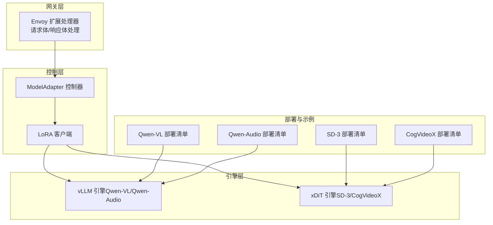
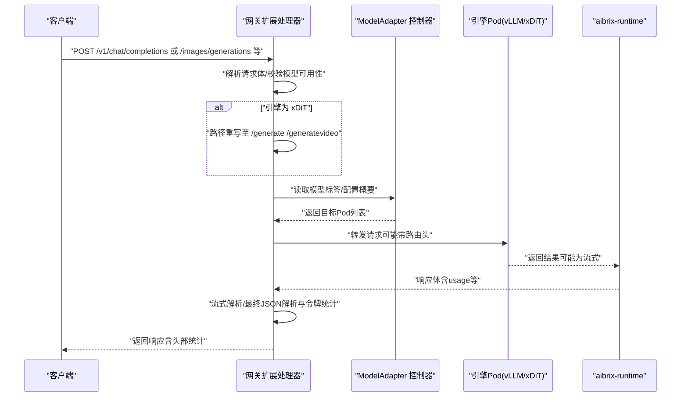
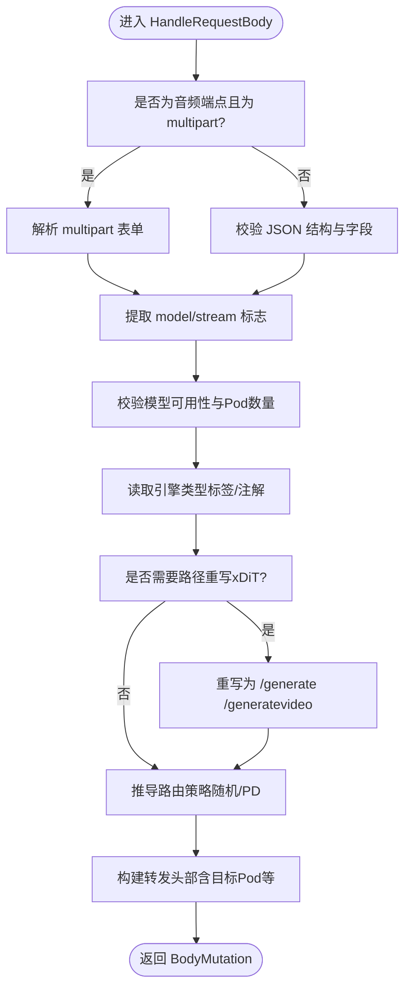
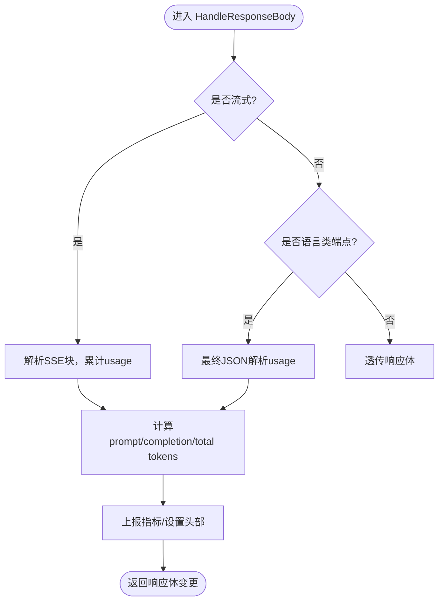
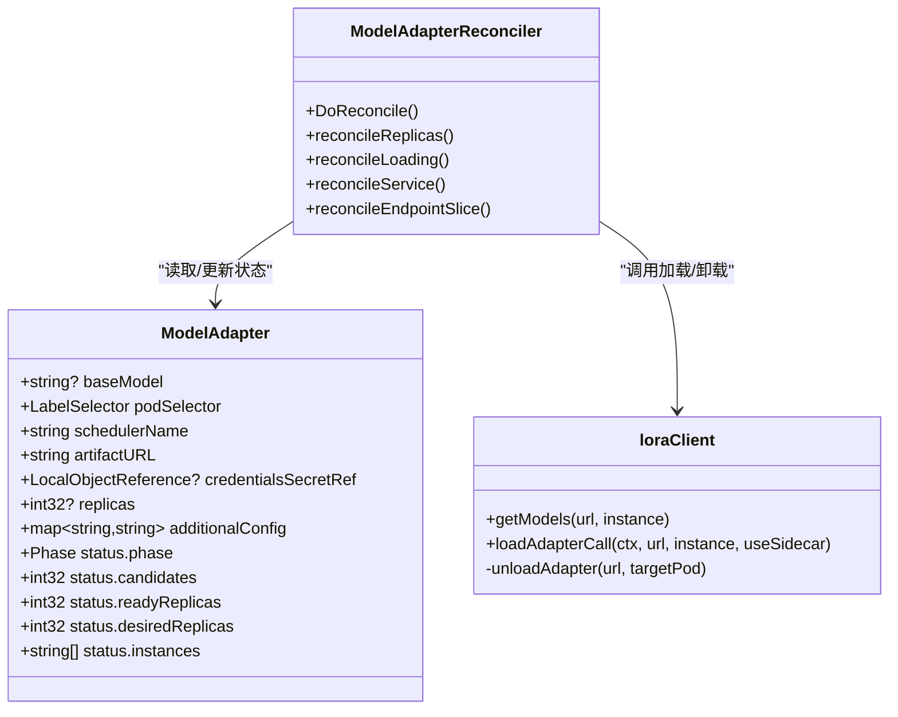
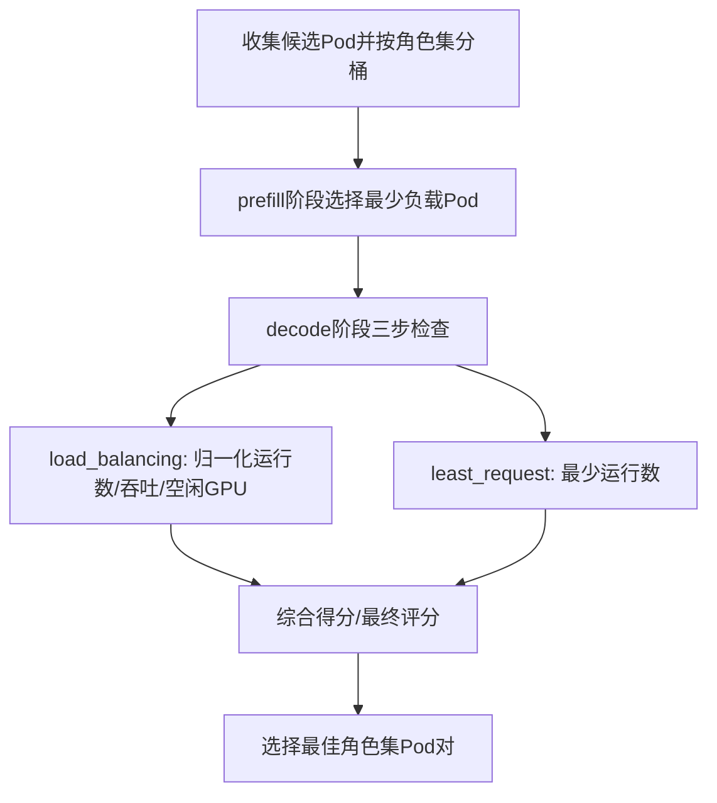
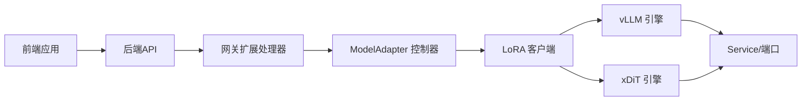

# 多模态集成

<cite>
**本文引用的文件**
- [samples/multimodality/vllm/README.md](file://samples/multimodality/vllm/README.md)
- [samples/multimodality/vllm/qwen-vl.yaml](file://samples/multimodality/vllm/qwen-vl.yaml)
- [samples/multimodality/vllm/qwen-audio.yaml](file://samples/multimodality/vllm/qwen-audio.yaml)
- [samples/multimodality/xDiT/README.md](file://samples/multimodality/xDiT/README.md)
- [samples/multimodality/xDiT/image-generation/aibrix_vke_kv_image_sd_parallel.yaml](file://samples/multimodality/xDiT/image-generation/aibrix_vke_kv_image_sd_parallel.yaml)
- [samples/multimodality/xDiT/video-generation/aibrix_vke_staging_video_cogvideo_parallel.yaml](file://samples/multimodality/xDiT/video-generation/aibrix_vke_staging_video_cogvideo_parallel.yaml)
- [api/model/v1alpha1/modeladapter_types.go](file://api/model/v1alpha1/modeladapter_types.go)
- [pkg/controller/modeladapter/modeladapter_controller.go](file://pkg/controller/modeladapter/modeladapter_controller.go)
- [pkg/controller/modeladapter/lora_client.go](file://pkg/controller/modeladapter/lora_client.go)
- [pkg/plugins/gateway/gateway_req_body.go](file://pkg/plugins/gateway/gateway_req_body.go)
- [pkg/plugins/gateway/gateway_rsp_body.go](file://pkg/plugins/gateway/gateway_rsp_body.go)
- [pkg/plugins/gateway/algorithms/pd_readme.md](file://pkg/plugins/gateway/algorithms/pd_readme.md)
- [pkg/plugins/gateway/algorithms/pd/decode_scorer.go](file://pkg/plugins/gateway/algorithms/pd/decode_scorer.go)
- [apps/chat/web/src/api/client.ts](file://apps/chat/web/src/api/client.ts)
- [apps/chat/web/src/app/components/chat-page.tsx](file://apps/chat/web/src/app/components/chat-page.tsx)
- [apps/chat/chat.yaml](file://apps/chat/chat.yaml)
- [development/tutorials/runtime/runtime-hf-download.yaml](file://development/tutorials/runtime/runtime-hf-download.yaml)
</cite>

## 目录
1. [简介](#简介)
2. [项目结构](#项目结构)
3. [核心组件](#核心组件)
4. [架构总览](#架构总览)
5. [详细组件分析](#详细组件分析)
6. [依赖分析](#依赖分析)
7. [性能考虑](#性能考虑)
8. [故障排查指南](#故障排查指南)
9. [结论](#结论)
10. [附录](#附录)

## 简介
本教程面向在 AIBrix 平台上集成与部署多模态模型（文本、图像、音频、视频）的工程师与运维人员。内容覆盖从部署配置、输入格式规范、输出处理到适配器管理、资源分配与性能优化策略，并提供可复用的应用场景与最佳实践。

## 项目结构
AIBrix 将多模态能力通过“网关插件 + 模型适配器控制器 + 引擎容器”协同实现：
- 网关层：统一接入 OpenAI 兼容接口，支持路径重写、路由策略、流式处理与令牌统计。
- 控制器层：管理 ModelAdapter 资源，负责模型适配器的加载、卸载与实例状态维护。
- 引擎层：以 vLLM 或 xDiT 作为推理后端，分别支撑图文/音视频生成与推理。
- 示例与部署：提供 Qwen-VL、Qwen-Audio、SD-3、CogVideoX 等示例清单与说明文档。

图示来源
- [pkg/plugins/gateway/gateway_req_body.go:38-175](file://pkg/plugins/gateway/gateway_req_body.go#L38-L175)
- [pkg/controller/modeladapter/modeladapter_controller.go:313-493](file://pkg/controller/modeladapter/modeladapter_controller.go#L313-L493)
- [pkg/controller/modeladapter/lora_client.go:208-218](file://pkg/controller/modeladapter/lora_client.go#L208-L218)
- [samples/multimodality/vllm/qwen-vl.yaml:1-136](file://samples/multimodality/vllm/qwen-vl.yaml#L1-L136)
- [samples/multimodality/vllm/qwen-audio.yaml:1-128](file://samples/multimodality/vllm/qwen-audio.yaml#L1-L128)
- [samples/multimodality/xDiT/image-generation/aibrix_vke_kv_image_sd_parallel.yaml:1-130](file://samples/multimodality/xDiT/image-generation/aibrix_vke_kv_image_sd_parallel.yaml#L1-L130)
- [samples/multimodality/xDiT/video-generation/aibrix_vke_staging_video_cogvideo_parallel.yaml:1-136](file://samples/multimodality/xDiT/video-generation/aibrix_vke_staging_video_cogvideo_parallel.yaml#L1-L136)

章节来源
- [samples/multimodality/vllm/README.md:1-224](file://samples/multimodality/vllm/README.md#L1-L224)
- [samples/multimodality/xDiT/README.md:1-203](file://samples/multimodality/xDiT/README.md#L1-L203)

## 核心组件
- 网关请求/响应处理：解析请求体、识别音频 multipart 请求、进行模型可用性校验、路径重写、路由策略选择与令牌统计。
- 模型适配器控制器：根据 ModelAdapter 规格选择目标 Pod，加载/卸载适配器，维护状态机与条件。
- LoRA 客户端：向引擎 Pod 发起模型列表查询与适配器加载/卸载请求，支持 Sidecar 模式下的代理下载。
- 引擎部署清单：提供 vLLM 与 xDiT 的完整部署模板，含初始化容器、资源限制、环境变量与服务暴露。

章节来源
- [pkg/plugins/gateway/gateway_req_body.go:38-175](file://pkg/plugins/gateway/gateway_req_body.go#L38-L175)
- [pkg/plugins/gateway/gateway_rsp_body.go:62-156](file://pkg/plugins/gateway/gateway_rsp_body.go#L62-L156)
- [api/model/v1alpha1/modeladapter_types.go:26-116](file://api/model/v1alpha1/modeladapter_types.go#L26-L116)
- [pkg/controller/modeladapter/modeladapter_controller.go:417-493](file://pkg/controller/modeladapter/modeladapter_controller.go#L417-L493)
- [pkg/controller/modeladapter/lora_client.go:138-218](file://pkg/controller/modeladapter/lora_client.go#L138-L218)

## 架构总览
下图展示一次典型多模态请求从客户端到引擎的端到端流程，包括路径重写、路由策略与令牌统计。

图示来源
- [pkg/plugins/gateway/gateway_req_body.go:38-175](file://pkg/plugins/gateway/gateway_req_body.go#L38-L175)
- [pkg/plugins/gateway/gateway_rsp_body.go:62-156](file://pkg/plugins/gateway/gateway_rsp_body.go#L62-L156)
- [pkg/controller/modeladapter/modeladapter_controller.go:417-493](file://pkg/controller/modeladapter/modeladapter_controller.go#L417-L493)

## 详细组件分析

### 组件A：网关请求体处理（多模态输入）
- 功能要点
  - 音频端点识别与 multipart 解析：对 /v1/audio/transcriptions 与 /v1/audio/translations 使用 multipart/form-data，其余端点按 JSON 校验。
  - 模型可用性检查：确保模型存在且有可路由 Pod。
  - 引擎类型识别：从 Pod 标签/注解中提取引擎类型，用于路径重写。
  - 路由策略：支持随机/基于 PD 的策略，设置目标 Pod 头部。
  - 路径重写：当引擎为 xDiT 时，将 /images/generations 与 /video/generations 重写为其原生端点。
- 输入格式规范
  - 文本类：OpenAI 兼容 JSON；消息数组支持 text 与 image_url/video_url 等复合内容。
  - 图像/视频：支持 URL、本地文件路径或 Base64 数据（示例见 vLLM README）。
  - 音频：multipart/form-data，字段包含 file、model、response_format 等。
- 输出处理
  - 流式响应：按 SSE 块解析，抽取 usage 统计。
  - 非流式响应：最终 JSON 中解析 usage 字段，记录 prompt/completion/total tokens。

图示来源
- [pkg/plugins/gateway/gateway_req_body.go:38-175](file://pkg/plugins/gateway/gateway_req_body.go#L38-L175)

章节来源
- [pkg/plugins/gateway/gateway_req_body.go:38-175](file://pkg/plugins/gateway/gateway_req_body.go#L38-L175)
- [samples/multimodality/vllm/README.md:19-158](file://samples/multimodality/vllm/README.md#L19-L158)
- [apps/chat/web/src/api/client.ts:333-396](file://apps/chat/web/src/api/client.ts#L333-L396)

### 组件B：网关响应体处理（多模态输出）
- 功能要点
  - 流式处理：对 SSE 流逐块解析，提取 usage 统计。
  - 非流式处理：对最终 JSON 进行反序列化，提取 usage 与错误码映射。
  - 令牌统计：按用户维度累加 TPM，更新 RPM/TPM 头部。
  - 指标上报：按桶统计 TTFT、路由时间、解码时间等。
- 输出格式
  - 文本类：OpenAI 兼容 JSON，包含 usage 与 choices。
  - 图像/视频：返回任务状态、输出路径或 base64（视部署与请求而定）。

图示来源
- [pkg/plugins/gateway/gateway_rsp_body.go:62-156](file://pkg/plugins/gateway/gateway_rsp_body.go#L62-L156)

章节来源
- [pkg/plugins/gateway/gateway_rsp_body.go:62-156](file://pkg/plugins/gateway/gateway_rsp_body.go#L62-L156)
- [apps/chat/web/src/api/client.ts:367-396](file://apps/chat/web/src/api/client.ts#L367-L396)

### 组件C：模型适配器控制器与 LoRA 客户端
- 功能要点
  - ModelAdapter 生命周期：Pending/Scheduled/Bound/ResourceCreated/Ready/Failed/Scaled/Unknown。
  - 实例管理：根据 Pod 选择器匹配候选 Pod，支持“全部加载”与“单实例加载”两种模式。
  - 适配器加载：向引擎 Pod 发送 GET /models 查询已有模型，POST /load 加载指定适配器；支持 Sidecar 模式下直接透传原始 artifact URL。
  - 卸载与清理：删除 CR 时卸载适配器并移除 Finalizer。
- 关键参数
  - BaseModel：基座模型标识。
  - PodSelector：匹配目标 Pod 的标签选择器。
  - ArtifactURL：适配器资源地址（支持 s3/gcs/huggingface 等）。
  - Replicas：实例分布策略（nil 表示全部，1 表示单实例）。
  - AdditionalConfig：附加配置（如鉴权 token）。

图示来源
- [api/model/v1alpha1/modeladapter_types.go:26-116](file://api/model/v1alpha1/modeladapter_types.go#L26-L116)
- [pkg/controller/modeladapter/modeladapter_controller.go:417-493](file://pkg/controller/modeladapter/modeladapter_controller.go#L417-L493)
- [pkg/controller/modeladapter/lora_client.go:138-218](file://pkg/controller/modeladapter/lora_client.go#L138-L218)

章节来源
- [api/model/v1alpha1/modeladapter_types.go:26-116](file://api/model/v1alpha1/modeladapter_types.go#L26-L116)
- [pkg/controller/modeladapter/modeladapter_controller.go:417-493](file://pkg/controller/modeladapter/modeladapter_controller.go#L417-L493)
- [pkg/controller/modeladapter/lora_client.go:138-218](file://pkg/controller/modeladapter/lora_client.go#L138-L218)

### 组件D：路由与调度（PD 策略）
- 功能要点
  - 收集并分桶候选 Pod（按角色集），区分 prefill/decode 角色。
  - 负载不均衡检测：基于 outstanding prefill 请求差值与 decode 请求差值/吞吐差异/排水率评分进行选择。
  - 得分策略：load_balancing（运行数、吞吐、空闲 GPU 百分比）与 least_request（仅运行数）。
  - 可配置权重：通过环境变量调整负载均衡权重。
- 性能影响
  - 合理的路由策略可降低 TTFT、提升吞吐与 GPU 利用率。
  - 对于多 GPU/分布式引擎（如 xDiT），建议结合 PD 策略与路径重写实现更优吞吐。

图示来源
- [pkg/plugins/gateway/algorithms/pd_readme.md:69-210](file://pkg/plugins/gateway/algorithms/pd_readme.md#L69-L210)
- [pkg/plugins/gateway/algorithms/pd/decode_scorer.go:44-146](file://pkg/plugins/gateway/algorithms/pd/decode_scorer.go#L44-L146)

章节来源
- [pkg/plugins/gateway/algorithms/pd_readme.md:69-210](file://pkg/plugins/gateway/algorithms/pd_readme.md#L69-L210)
- [pkg/plugins/gateway/algorithms/pd/decode_scorer.go:44-146](file://pkg/plugins/gateway/algorithms/pd/decode_scorer.go#L44-L146)

## 依赖分析
- 网关与控制器耦合
  - 网关通过缓存查询模型与 Pod 列表，控制器负责 Pod 的健康与实例状态。
  - 路由策略与引擎类型决定路径重写，进而影响引擎容器的端点兼容性。
- 引擎与部署清单
  - vLLM 清单包含初始化容器下载模型、主容器运行 vLLM 服务、runtime 容器暴露管理端口。
  - xDiT 清单包含自定义镜像、分布式启动参数与共享存储卷。
- 前端与后端
  - 前端通过 /api/audio/transcribe、/api/video/generate 等接口对接后端，后端再经网关路由到引擎。

图示来源
- [apps/chat/web/src/api/client.ts:333-396](file://apps/chat/web/src/api/client.ts#L333-L396)
- [apps/chat/chat.yaml:1-54](file://apps/chat/chat.yaml#L1-L54)
- [samples/multimodality/vllm/qwen-vl.yaml:1-136](file://samples/multimodality/vllm/qwen-vl.yaml#L1-L136)
- [samples/multimodality/xDiT/image-generation/aibrix_vke_kv_image_sd_parallel.yaml:1-130](file://samples/multimodality/xDiT/image-generation/aibrix_vke_kv_image_sd_parallel.yaml#L1-L130)

章节来源
- [apps/chat/web/src/api/client.ts:333-396](file://apps/chat/web/src/api/client.ts#L333-L396)
- [apps/chat/chat.yaml:1-54](file://apps/chat/chat.yaml#L1-L54)

## 性能考虑
- 路由策略
  - 对高并发场景优先采用 PD 策略，结合 decode 得分策略与权重，平衡运行数、吞吐与 GPU 空闲率。
- 超时与资源
  - vLLM 提供图像/视频/音频抓取超时配置，需根据网络与存储环境调优。
  - xDiT 分布式部署需合理设置 world_size、并行度参数与共享内存大小。
- 缓存与预热
  - 启用前缀缓存与 KV 缓存可显著降低 TTFT。
  - 首次请求前进行模型预热，避免冷启动抖动。
- 指标监控
  - 通过网关指标桶统计 TTFT、路由时间、解码时间，定位瓶颈。

章节来源
- [samples/multimodality/vllm/qwen-vl.yaml:84-91](file://samples/multimodality/vllm/qwen-vl.yaml#L84-L91)
- [samples/multimodality/xDiT/image-generation/aibrix_vke_kv_image_sd_parallel.yaml:64-72](file://samples/multimodality/xDiT/image-generation/aibrix_vke_kv_image_sd_parallel.yaml#L64-L72)
- [pkg/plugins/gateway/gateway_rsp_body.go:234-301](file://pkg/plugins/gateway/gateway_rsp_body.go#L234-L301)

## 故障排查指南
- 模型不存在或无可用 Pod
  - 现象：返回模型不存在或无可用后端。
  - 排查：确认模型名称、标签与 Service/EndpointSlice 是否正确，查看控制器状态。
- 适配器加载失败
  - 现象：适配器 Ready 条件为 False，控制器日志出现 HTTP 错误。
  - 排查：检查 ArtifactURL、凭据 Secret、引擎 Pod 状态与端口可达性。
- 路由策略无效
  - 现象：请求被拒绝或无法选择目标 Pod。
  - 排查：核对 routing-strategy 头部、模型配置概要与 PD 策略配置。
- 响应解析错误
  - 现象：非流式响应 JSON 解析失败或 usage 缺失。
  - 排查：检查引擎返回体格式、网关日志与错误头部。

章节来源
- [pkg/plugins/gateway/gateway_req_body.go:206-227](file://pkg/plugins/gateway/gateway_req_body.go#L206-L227)
- [pkg/controller/modeladapter/lora_client.go:138-160](file://pkg/controller/modeladapter/lora_client.go#L138-L160)
- [pkg/plugins/gateway/gateway_rsp_body.go:173-232](file://pkg/plugins/gateway/gateway_rsp_body.go#L173-L232)

## 结论
通过网关插件与模型适配器控制器的协同，AIBrix 能够在 Kubernetes 上稳定地部署与调度多模态模型，支持文本、图像、音频与视频的联合推理。结合 PD 路由策略、合理的资源与超时配置以及完善的指标监控，可在生产环境中获得低延迟与高吞吐的体验。

## 附录

### 部署与配置清单
- vLLM 图文模型（Qwen-VL）
  - 清单：[qwen-vl.yaml:1-136](file://samples/multimodality/vllm/qwen-vl.yaml#L1-L136)
  - 说明：包含初始化容器下载模型、vLLM 服务容器、runtime 容器与 Service。
- vLLM 音频模型（Qwen-Audio）
  - 清单：[qwen-audio.yaml:1-128](file://samples/multimodality/vllm/qwen-audio.yaml#L1-L128)
  - 说明：安装 vllm[audio] 后启动服务，支持转录与翻译。
- xDiT 图像生成（SD-3）
  - 清单：[aibrix_vke_kv_image_sd_parallel.yaml:1-130](file://samples/multimodality/xDiT/image-generation/aibrix_vke_kv_image_sd_parallel.yaml#L1-L130)
  - 说明：分布式并行参数与共享存储卷配置。
- xDiT 视频生成（CogVideoX）
  - 清单：[aibrix_vke_staging_video_cogvideo_parallel.yaml:1-136](file://samples/multimodality/xDiT/video-generation/aibrix_vke_staging_video_cogvideo_parallel.yaml#L1-L136)
  - 说明：分布式并行参数与共享内存配置。
- 运行时下载（HuggingFace）
  - 清单：[runtime-hf-download.yaml:1-161](file://development/tutorials/runtime/runtime-hf-download.yaml#L1-L161)
  - 说明：演示 initContainer 下载模型与健康探针配置。

章节来源
- [samples/multimodality/vllm/qwen-vl.yaml:1-136](file://samples/multimodality/vllm/qwen-vl.yaml#L1-L136)
- [samples/multimodality/vllm/qwen-audio.yaml:1-128](file://samples/multimodality/vllm/qwen-audio.yaml#L1-L128)
- [samples/multimodality/xDiT/image-generation/aibrix_vke_kv_image_sd_parallel.yaml:1-130](file://samples/multimodality/xDiT/image-generation/aibrix_vke_kv_image_sd_parallel.yaml#L1-L130)
- [samples/multimodality/xDiT/video-generation/aibrix_vke_staging_video_cogvideo_parallel.yaml:1-136](file://samples/multimodality/xDiT/video-generation/aibrix_vke_staging_video_cogvideo_parallel.yaml#L1-L136)
- [development/tutorials/runtime/runtime-hf-download.yaml:1-161](file://development/tutorials/runtime/runtime-hf-download.yaml#L1-L161)

### 输入格式与输出处理规范
- 文本类（聊天/补全/嵌入）
  - 输入：OpenAI 兼容 JSON，支持多轮消息与工具调用。
  - 输出：包含 usage 字段的 JSON。
- 图像生成
  - 端点：/v1/images/generations（OpenAI 兼容）或 /generate（xDiT 原生）。
  - 输入：prompt、尺寸、模型等；可选保存路径或返回 base64。
  - 输出：任务状态、耗时、输出路径或 base64。
- 视频生成
  - 端点：/v1/video/generations（OpenAI 兼容）或 /generatevideo（xDiT 原生）。
  - 输入：prompt、时长、分辨率、模型等。
  - 输出：任务状态、耗时、输出路径或下载链接。
- 音频转录/翻译
  - 端点：/v1/audio/transcriptions、/v1/audio/translations。
  - 输入：multipart/form-data，包含 file、model、response_format 等。
  - 输出：JSON 文本或错误信息。

章节来源
- [pkg/plugins/gateway/gateway_req_body.go:51-66](file://pkg/plugins/gateway/gateway_req_body.go#L51-L66)
- [pkg/plugins/gateway/gateway_rsp_body.go:158-171](file://pkg/plugins/gateway/gateway_rsp_body.go#L158-L171)
- [samples/multimodality/vllm/README.md:160-224](file://samples/multimodality/vllm/README.md#L160-L224)
- [apps/chat/web/src/api/client.ts:367-396](file://apps/chat/web/src/api/client.ts#L367-L396)

### 最佳实践案例
- 混合模态对话
  - 场景：用户上传图片并提问，后端将 text 与 image_url 组合发送给 Qwen-VL。
  - 建议：开启前缀缓存与 KV 缓存，使用 PD 策略动态选择 GPU 负载较低的 Pod。
- 高并发图像生成
  - 场景：批量生成多张图像，统一尺寸与提示词。
  - 建议：为 xDiT 设置合适的 world_size 与并行度，启用共享存储卷减少 IO 抖动。
- 音频转录流水线
  - 场景：上传音频文件，自动转录并翻译为英文。
  - 建议：为音频端点单独设置超时阈值，避免大文件导致的超时。
- 视频生成编排
  - 场景：根据提示词生成短视频，支持进度轮询与下载。
  - 建议：为视频生成任务设置合理的时长与分辨率上限，结合 PD 策略保障吞吐。

章节来源
- [samples/multimodality/vllm/README.md:19-158](file://samples/multimodality/vllm/README.md#L19-L158)
- [samples/multimodality/xDiT/README.md:29-182](file://samples/multimodality/xDiT/README.md#L29-L182)
- [apps/chat/web/src/app/components/chat-page.tsx:169-288](file://apps/chat/web/src/app/components/chat-page.tsx#L169-L288)