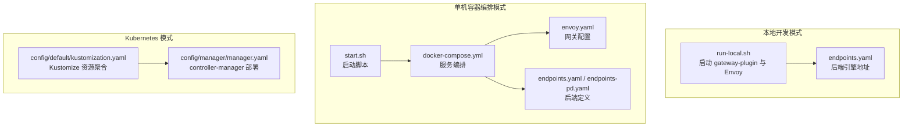
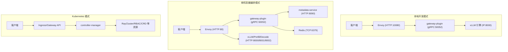
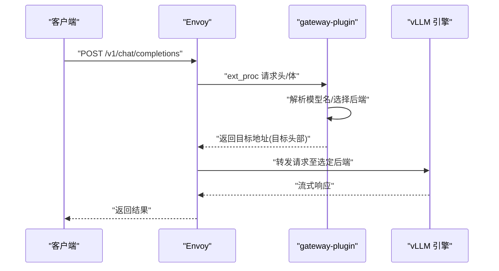
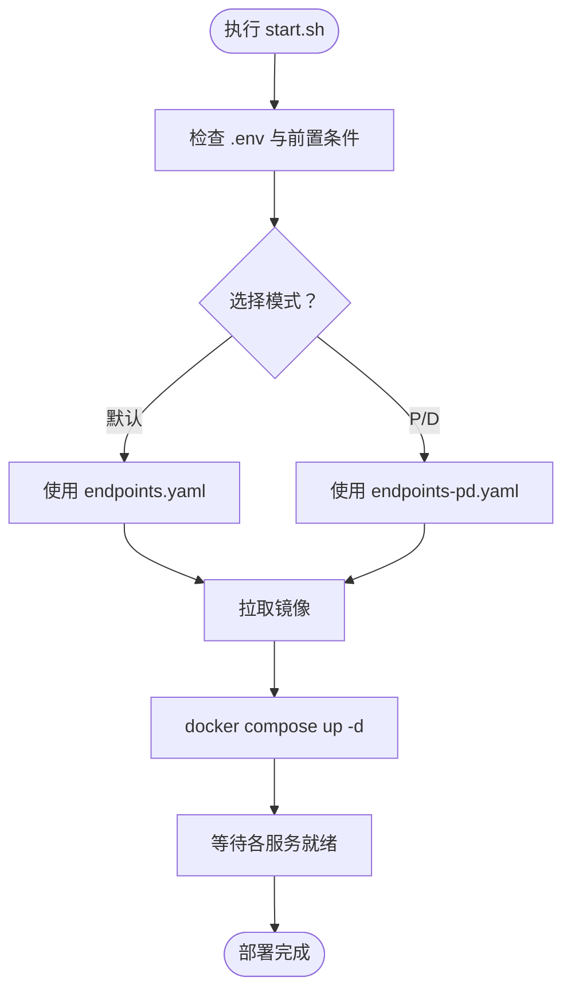
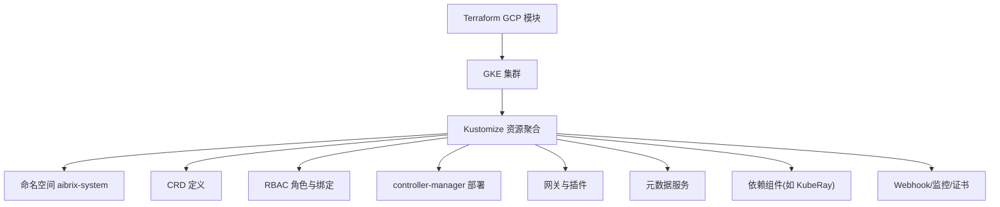
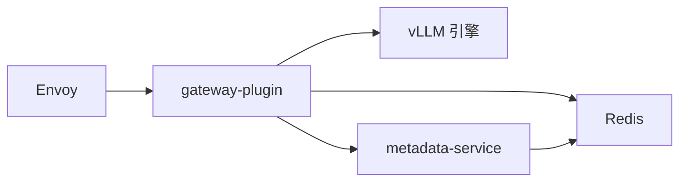

# 快速开始部署

<cite>
**本文引用的文件**
- [deployment/local/README.md](file://deployment/local/README.md)
- [deployment/local/run-local.sh](file://deployment/local/run-local.sh)
- [deployment/local/stop-local.sh](file://deployment/local/stop-local.sh)
- [deployment/local/configs/endpoints.yaml](file://deployment/local/configs/endpoints.yaml)
- [deployment/standalone/README.md](file://deployment/standalone/README.md)
- [deployment/standalone/start.sh](file://deployment/standalone/start.sh)
- [deployment/standalone/docker-compose.yml](file://deployment/standalone/docker-compose.yml)
- [deployment/standalone/configs/envoy.yaml](file://deployment/standalone/configs/envoy.yaml)
- [deployment/standalone/configs/endpoints.yaml](file://deployment/standalone/configs/endpoints.yaml)
- [deployment/standalone/configs/endpoints-pd.yaml](file://deployment/standalone/configs/endpoints-pd.yaml)
- [config/default/kustomization.yaml](file://config/default/kustomization.yaml)
- [config/manager/manager.yaml](file://config/manager/manager.yaml)
- [deployment/terraform/gcp/README.md](file://deployment/terraform/gcp/README.md)
- [deployment/terraform/kubernetes/README.md](file://deployment/terraform/kubernetes/README.md)
</cite>

## 目录
1. [简介](#简介)
2. [项目结构](#项目结构)
3. [核心组件](#核心组件)
4. [架构总览](#架构总览)
5. [详细组件分析](#详细组件分析)
6. [依赖关系分析](#依赖关系分析)
7. [性能与容量规划](#性能与容量规划)
8. [故障排查指南](#故障排查指南)
9. [结论](#结论)
10. [附录：命令与配置清单](#附录命令与配置清单)

## 简介
本教程面向首次部署 AIBrix 的用户，提供从本地到生产环境的完整快速入门路径。内容覆盖环境准备、依赖安装、基础配置与验证步骤，并对三种典型部署模式进行对比说明：本地开发模式（裸进程）、单机容器编排模式（Docker Compose）与生产级 Kubernetes 集群模式（含 Terraform 示例）。同时给出常见问题排查建议与最佳实践，帮助您在最短时间内完成系统上线。

## 项目结构
围绕“快速开始”，本次文档聚焦以下三类部署入口与配套配置：
- 本地开发模式：直接运行 Envoy 与 gateway-plugin 两个进程，无需容器或 Kubernetes，适合路由算法调试与单机验证。
- 单机容器编排模式：通过 Docker Compose 启动 Envoy、gateway-plugin、vLLM 引擎、元数据服务与 Redis，支持 P/D 解耦模式。
- 生产级 Kubernetes 模式：使用 Kustomize 构建清单，结合 Terraform 在云上快速搭建集群并部署 AIBrix。

图表来源
- [deployment/local/run-local.sh:1-165](file://deployment/local/run-local.sh#L1-L165)
- [deployment/local/configs/endpoints.yaml:1-33](file://deployment/local/configs/endpoints.yaml#L1-L33)
- [deployment/standalone/start.sh:1-373](file://deployment/standalone/start.sh#L1-L373)
- [deployment/standalone/docker-compose.yml:1-261](file://deployment/standalone/docker-compose.yml#L1-L261)
- [deployment/standalone/configs/envoy.yaml:1-320](file://deployment/standalone/configs/envoy.yaml#L1-L320)
- [deployment/standalone/configs/endpoints.yaml:1-15](file://deployment/standalone/configs/endpoints.yaml#L1-L15)
- [deployment/standalone/configs/endpoints-pd.yaml:1-22](file://deployment/standalone/configs/endpoints-pd.yaml#L1-L22)
- [config/default/kustomization.yaml:1-90](file://config/default/kustomization.yaml#L1-L90)
- [config/manager/manager.yaml:1-87](file://config/manager/manager.yaml#L1-L87)

章节来源
- [deployment/local/README.md:1-195](file://deployment/local/README.md#L1-L195)
- [deployment/standalone/README.md:1-397](file://deployment/standalone/README.md#L1-L397)
- [config/default/kustomization.yaml:1-90](file://config/default/kustomization.yaml#L1-L90)

## 核心组件
- 网关插件（gateway-plugin）
  - 作为 Envoy 的外部处理器（ext_proc），负责模型名解析、路由算法选择、速率限制与指标采集。
  - 支持多种路由算法；在单机模式下可独立进程运行，在容器/集群模式下以服务形式暴露 gRPC 与指标端口。
- Envoy
  - L7 代理，统一入口、健康检查、重试与熔断；与 gateway-plugin 协作实现智能路由。
- vLLM 引擎
  - 推理后端，支持单引擎或多引擎（P/D 解耦）。
- 元数据服务（metadata-service）
  - 提供模型注册与文件管理能力，供网关查询模型信息。
- Redis
  - 分布式状态存储，用于速率限制等共享状态。

章节来源
- [deployment/standalone/configs/envoy.yaml:156-176](file://deployment/standalone/configs/envoy.yaml#L156-L176)
- [deployment/standalone/docker-compose.yml:218-249](file://deployment/standalone/docker-compose.yml#L218-L249)
- [deployment/standalone/docker-compose.yml:56-76](file://deployment/standalone/docker-compose.yml#L56-L76)
- [deployment/standalone/docker-compose.yml:32-50](file://deployment/standalone/docker-compose.yml#L32-L50)

## 架构总览
三种部署模式的组件交互如下：

图表来源
- [deployment/local/README.md:14-27](file://deployment/local/README.md#L14-L27)
- [deployment/standalone/README.md:63-107](file://deployment/standalone/README.md#L63-L107)
- [config/manager/manager.yaml:1-87](file://config/manager/manager.yaml#L1-L87)

## 详细组件分析

### 本地开发模式（裸进程）
- 适用场景
  - 本地开发与路由算法调试
  - 无容器/无 Kubernetes 的单机测试
- 关键流程
  - 启动 gateway-plugin（gRPC 与指标端口）
  - 启动 Envoy（HTTP 与 Admin 端口）
  - 配置 endpoints.yaml 指向 vLLM 引擎地址
- 常用命令
  - 启动：参考脚本参数与日志输出
  - 停止：清理进程与共享内存
- 验证步骤
  - 访问 /v1/chat/completions 进行推理
  - 查看 /healthz 与 /metrics
- 故障排查
  - “无健康上游”：确认 vLLM 地址可达
  - “ext_proc gRPC 错误”：检查 gateway-plugin 日志
  - Envoy 启动失败：检查端口占用与配置

图表来源
- [deployment/local/README.md:14-27](file://deployment/local/README.md#L14-L27)
- [deployment/local/run-local.sh:74-140](file://deployment/local/run-local.sh#L74-L140)

章节来源
- [deployment/local/README.md:1-195](file://deployment/local/README.md#L1-L195)
- [deployment/local/run-local.sh:1-165](file://deployment/local/run-local.sh#L1-L165)
- [deployment/local/stop-local.sh:1-35](file://deployment/local/stop-local.sh#L1-L35)
- [deployment/local/configs/endpoints.yaml:1-33](file://deployment/local/configs/endpoints.yaml#L1-L33)

### 单机容器编排模式（Docker Compose）
- 适用场景
  - 开发、测试与单 GPU/多 GPU 推理工作负载
  - 需要 Envoy 的 L7 能力与 P/D 解耦
- 关键流程
  - 读取 .env 配置，按模式选择 endpoints 文件
  - 拉取镜像并启动服务，等待各组件健康
  - 通过 /v1/chat/completions、/v1/models、/health 等端点验证
- 常用命令
  - 启动：默认模式或 P/D 模式
  - 日志：查看各服务日志与资源使用
  - 缩放：注意每副本需独占 GPU
- 配置要点
  - endpoints.yaml：单引擎模式
  - endpoints-pd.yaml：P/D 模式（prefill/decode）
  - envoy.yaml：ext_proc 过滤器、路由规则与健康检查

图表来源
- [deployment/standalone/start.sh:97-321](file://deployment/standalone/start.sh#L97-L321)
- [deployment/standalone/docker-compose.yml:218-249](file://deployment/standalone/docker-compose.yml#L218-L249)
- [deployment/standalone/configs/envoy.yaml:156-176](file://deployment/standalone/configs/envoy.yaml#L156-L176)

章节来源
- [deployment/standalone/README.md:1-397](file://deployment/standalone/README.md#L1-L397)
- [deployment/standalone/start.sh:1-373](file://deployment/standalone/start.sh#L1-L373)
- [deployment/standalone/docker-compose.yml:1-261](file://deployment/standalone/docker-compose.yml#L1-L261)
- [deployment/standalone/configs/envoy.yaml:1-320](file://deployment/standalone/configs/envoy.yaml#L1-L320)
- [deployment/standalone/configs/endpoints.yaml:1-15](file://deployment/standalone/configs/endpoints.yaml#L1-L15)
- [deployment/standalone/configs/endpoints-pd.yaml:1-22](file://deployment/standalone/configs/endpoints-pd.yaml#L1-L22)

### 生产级 Kubernetes 模式（含 Terraform 示例）
- 适用场景
  - 多节点、自动扩缩容、动态服务发现与网关 API 的生产环境
- 关键流程
  - 使用 Kustomize 聚合命名空间、CRD、RBAC、控制器、网关、元数据、GPU 优化器与依赖组件
  - 可选启用 Webhook、Prometheus 监控与内部证书
  - 通过 Terraform 在 GCP 快速创建 GKE 集群并部署 AIBrix
- 验证步骤
  - 获取公网 IP 并调用 /v1/chat/completions
  - 使用 kubectl 检查 Pod/Service/CRD 状态

图表来源
- [config/default/kustomization.yaml:20-31](file://config/default/kustomization.yaml#L20-L31)
- [config/manager/manager.yaml:1-87](file://config/manager/manager.yaml#L1-L87)
- [deployment/terraform/gcp/README.md:1-77](file://deployment/terraform/gcp/README.md#L1-L77)

章节来源
- [config/default/kustomization.yaml:1-90](file://config/default/kustomization.yaml#L1-L90)
- [config/manager/manager.yaml:1-87](file://config/manager/manager.yaml#L1-L87)
- [deployment/terraform/gcp/README.md:1-77](file://deployment/terraform/gcp/README.md#L1-L77)
- [deployment/terraform/kubernetes/README.md:1-3](file://deployment/terraform/kubernetes/README.md#L1-L3)

## 依赖关系分析
- 组件耦合
  - Envoy 依赖 gateway-plugin 的 ext_proc 服务；后端可为 vLLM 或 P/D 引擎。
  - gateway-plugin 依赖 Redis 以实现速率限制与共享状态。
  - metadata-service 依赖 Redis 存储元数据。
- 外部依赖
  - 本地模式：Go、Envoy、可选 Redis；vLLM 引擎需可用。
  - 单机模式：Docker、Compose、NVIDIA Container Toolkit（GPU）。
  - 生产模式：Kubernetes 集群、Terraform（可选）。

图表来源
- [deployment/standalone/docker-compose.yml:218-249](file://deployment/standalone/docker-compose.yml#L218-L249)
- [deployment/standalone/docker-compose.yml:32-50](file://deployment/standalone/docker-compose.yml#L32-L50)
- [deployment/standalone/docker-compose.yml:56-76](file://deployment/standalone/docker-compose.yml#L56-L76)

章节来源
- [deployment/standalone/docker-compose.yml:1-261](file://deployment/standalone/docker-compose.yml#L1-L261)

## 性能与容量规划
- 单机模式
  - GPU 内存利用率与上下文长度直接影响加载时间与吞吐；可通过环境变量调整。
  - P/D 模式可提升多卡场景下的吞吐与延迟表现。
- 生产模式
  - 利用 Kubernetes 自动扩缩容与网关 API 实现弹性；结合 Prometheus/Grafana 观测。
  - 注意网络与存储的 IOPS/带宽瓶颈。

[本节为通用指导，不直接分析具体文件]

## 故障排查指南
- 本地模式
  - “无健康上游”：检查 endpoints.yaml 中的引擎地址是否可达。
  - “ext_proc gRPC 错误”：查看 gateway-plugin 日志，确认 gRPC 服务已就绪。
  - Envoy 启动失败：检查端口冲突（10080/9901）与配置文件。
- 单机模式
  - GPU 不可见：检查 nvidia-smi 与 Docker GPU 访问；安装 NVIDIA Container Toolkit。
  - 模型加载失败：查看 vLLM 日志、确认缓存目录与显存；降低上下文长度或内存利用率。
  - 连接错误：检查 Envoy /ready、clusters 与直接访问 vLLM 的健康端点。
  - 内存不足：降低 GPU_MEMORY_UTILIZATION 或 MAX_MODEL_LEN，或更换更小模型。
- 生产模式
  - 通过 Terraform 创建集群时遇到配额不足：检查 GPU 配额与实例类型。
  - 集群就绪后验证：使用公网 IP 调用 /v1/chat/completions 并检查 Pod/Service 状态。

章节来源
- [deployment/local/README.md:186-195](file://deployment/local/README.md#L186-L195)
- [deployment/standalone/README.md:210-280](file://deployment/standalone/README.md#L210-L280)
- [deployment/terraform/gcp/README.md:13-36](file://deployment/terraform/gcp/README.md#L13-L36)

## 结论
通过本教程，您可以根据需求选择合适的部署模式：
- 本地开发：快速验证路由与单机推理
- 单机编排：获得接近生产的 L7 能力与 P/D 解耦
- 生产集群：借助 K8s 与 Terraform 实现弹性与可观测性

建议在正式上线前完成压测与容量评估，并完善监控告警体系。

[本节为总结性内容，不直接分析具体文件]

## 附录：命令与配置清单

- 本地开发模式
  - 启动/停止
    - [run-local.sh:100-121](file://deployment/local/run-local.sh#L100-L121)
    - [stop-local.sh:1-35](file://deployment/local/stop-local.sh#L1-L35)
  - 配置
    - [endpoints.yaml:1-33](file://deployment/local/configs/endpoints.yaml#L1-L33)
  - 端点
    - [本地模式端点说明:170-178](file://deployment/local/README.md#L170-L178)

- 单机容器编排模式
  - 启动/停止/日志/状态
    - [start.sh:161-200](file://deployment/standalone/start.sh#L161-L200)
    - [docker-compose.yml:1-261](file://deployment/standalone/docker-compose.yml#L1-L261)
  - 配置
    - [envoy.yaml:1-320](file://deployment/standalone/configs/envoy.yaml#L1-L320)
    - [endpoints.yaml:1-15](file://deployment/standalone/configs/endpoints.yaml#L1-L15)
    - [endpoints-pd.yaml:1-22](file://deployment/standalone/configs/endpoints-pd.yaml#L1-L22)
  - 端点
    - [单机模式端点说明:139-160](file://deployment/standalone/README.md#L139-L160)

- 生产级 Kubernetes 模式
  - Kustomize 资源
    - [kustomization.yaml:20-31](file://config/default/kustomization.yaml#L20-L31)
    - [manager.yaml:1-87](file://config/manager/manager.yaml#L1-L87)
  - Terraform（GCP）
    - [GCP 模块说明:1-77](file://deployment/terraform/gcp/README.md#L1-L77)
    - [Kubernetes 模块说明:1-3](file://deployment/terraform/kubernetes/README.md#L1-L3)