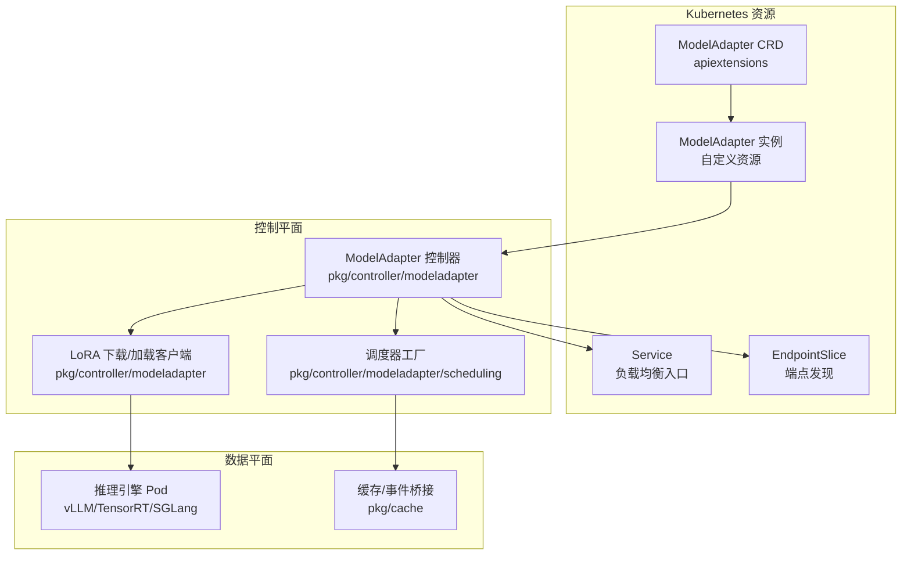
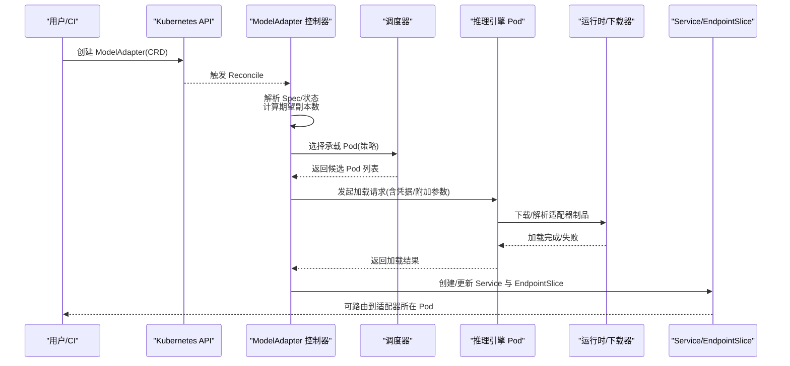
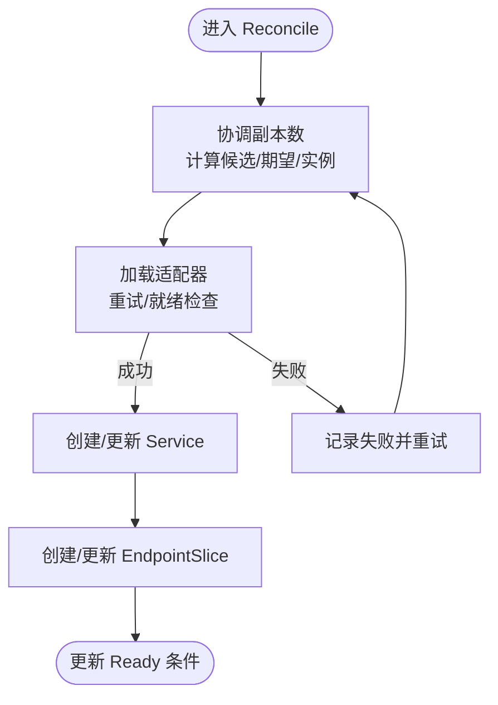
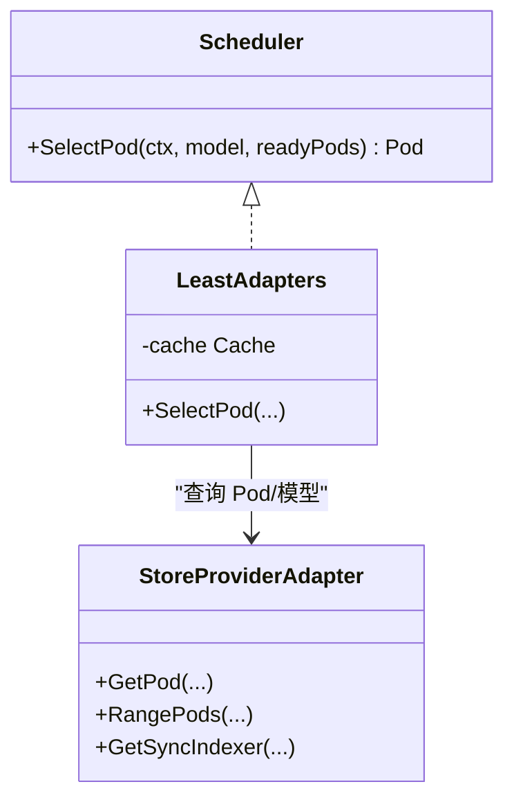
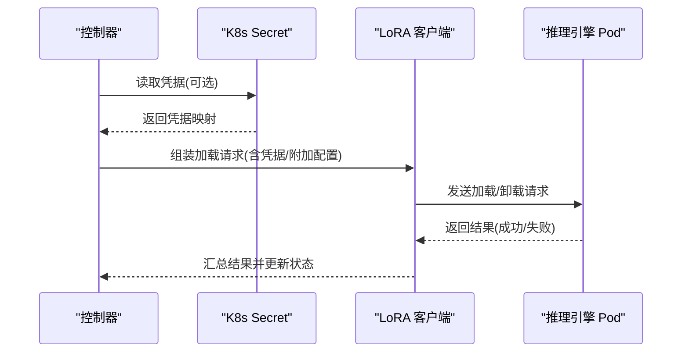
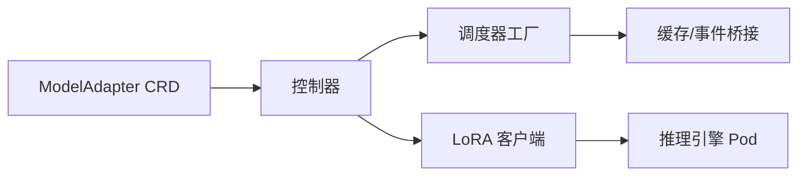

# 模型适配器部署

<cite>
**本文引用的文件**
- [api/model/v1alpha1/modeladapter_types.go](file://api/model/v1alpha1/modeladapter_types.go)
- [config/crd/model/model.aibrix.ai_modeladapters.yaml](file://config/crd/model/model.aibrix.ai_modeladapters.yaml)
- [pkg/controller/modeladapter/modeladapter_controller.go](file://pkg/controller/modeladapter/modeladapter_controller.go)
- [pkg/controller/modeladapter/scheduling/scheduler.go](file://pkg/controller/modeladapter/scheduling/scheduler.go)
- [pkg/controller/modeladapter/scheduling/least_adapters.go](file://pkg/controller/modeladapter/scheduling/least_adapters.go)
- [pkg/controller/modeladapter/lora_client.go](file://pkg/controller/modeladapter/lora_client.go)
- [samples/adapter/adapter.yaml](file://samples/adapter/adapter.yaml)
- [samples/adapter/adapter-s3-example.yaml](file://samples/adapter/adapter-s3-example.yaml)
- [samples/adapter/adapter-multi-replica.yaml](file://samples/adapter/adapter-multi-replica.yaml)
- [development/app/config.json](file://development/app/config.json)
- [pkg/cache/store_providers.go](file://pkg/cache/store_providers.go)
</cite>

## 目录
1. [简介](#简介)
2. [项目结构](#项目结构)
3. [核心组件](#核心组件)
4. [架构总览](#架构总览)
5. [详细组件分析](#详细组件分析)
6. [依赖分析](#依赖分析)
7. [性能考虑](#性能考虑)
8. [故障排查指南](#故障排查指南)
9. [结论](#结论)
10. [附录](#附录)

## 简介
本教程面向希望在 Kubernetes 上部署与管理多推理引擎（如 vLLM、TensorRT-LLM、SGLang 等）的模型适配器（LoRA/Adapter）的工程师与运维人员。文档将系统讲解以下内容：
- 针对不同推理引擎的适配器配置要点与差异
- 完整的 ModelAdapter YAML 示例与字段说明
- API 密钥与凭证管理、存储后端（HuggingFace、S3/TOS、本地）配置
- 运行时参数设置、模型加载策略、资源分配、多副本部署与版本管理
- 调度策略与服务发现、健康检查与可观测性

## 项目结构
AIBrix 将“模型适配器”作为 Kubernetes 自定义资源（CRD），通过控制器实现生命周期编排：从 Pod 选择、适配器下载与加载、到服务与 EndpointSlice 的创建与维护。

图表来源
- [config/crd/model/model.aibrix.ai_modeladapters.yaml:1-160](file://config/crd/model/model.aibrix.ai_modeladapters.yaml#L1-L160)
- [pkg/controller/modeladapter/modeladapter_controller.go:127-191](file://pkg/controller/modeladapter/modeladapter_controller.go#L127-L191)
- [pkg/controller/modeladapter/scheduling/scheduler.go:34-50](file://pkg/controller/modeladapter/scheduling/scheduler.go#L34-L50)
- [pkg/controller/modeladapter/lora_client.go:220-252](file://pkg/controller/modeladapter/lora_client.go#L220-L252)
- [pkg/cache/store_providers.go:48-201](file://pkg/cache/store_providers.go#L48-L201)

章节来源
- [config/crd/model/model.aibrix.ai_modeladapters.yaml:1-160](file://config/crd/model/model.aibrix.ai_modeladapters.yaml#L1-L160)
- [pkg/controller/modeladapter/modeladapter_controller.go:127-191](file://pkg/controller/modeladapter/modeladapter_controller.go#L127-L191)

## 核心组件
- 自定义资源定义（CRD）：定义 ModelAdapter 的规范与状态字段，支持基础模型标识、Pod 选择器、适配器制品地址、凭证引用、副本策略与附加配置。
- 控制器：负责实例化 Service 与 EndpointSlice、选择目标 Pod、调用运行时进行适配器加载、维护状态与条件。
- 调度器：按策略（随机、最少适配器、最低延迟、最低吞吐、绑包）选择承载 Pod。
- LoRA 客户端：封装下载与加载请求，支持凭据注入与附加参数透传。
- 缓存与事件桥接：为调度器提供 Pod 与模型列表查询能力，支撑“最少适配器”等策略。

章节来源
- [api/model/v1alpha1/modeladapter_types.go:26-116](file://api/model/v1alpha1/modeladapter_types.go#L26-L116)
- [pkg/controller/modeladapter/modeladapter_controller.go:281-300](file://pkg/controller/modeladapter/modeladapter_controller.go#L281-L300)
- [pkg/controller/modeladapter/scheduling/scheduler.go:28-50](file://pkg/controller/modeladapter/scheduling/scheduler.go#L28-L50)
- [pkg/controller/modeladapter/lora_client.go:220-252](file://pkg/controller/modeladapter/lora_client.go#L220-L252)
- [pkg/cache/store_providers.go:48-201](file://pkg/cache/store_providers.go#L48-L201)

## 架构总览
下图展示从用户提交 ModelAdapter 到适配器在推理引擎 Pod 中加载并可被路由访问的关键流程。

图表来源
- [pkg/controller/modeladapter/modeladapter_controller.go:417-493](file://pkg/controller/modeladapter/modeladapter_controller.go#L417-L493)
- [pkg/controller/modeladapter/scheduling/scheduler.go:34-50](file://pkg/controller/modeladapter/scheduling/scheduler.go#L34-L50)
- [pkg/controller/modeladapter/lora_client.go:220-252](file://pkg/controller/modeladapter/lora_client.go#L220-L252)

## 详细组件分析

### ModelAdapter CRD 字段详解
- 基础模型标识：用于声明该适配器所依附的基础模型名称。
- Pod 选择器：匹配可承载适配器的推理引擎 Pod；需满足控制器约定标签。
- 推荐副本策略：
  - 不指定 replicas：将适配器加载到所有匹配 Pod（高可用与负载分发）。
  - replicas=1：由调度器选择单个 Pod 承载。
- 附加配置：向引擎加载阶段传递参数（如 LoRA rank/alpha、超时等）。
- 凭证引用：指向命名空间内 Secret，用于访问 S3/TOS 等私有存储。

章节来源
- [api/model/v1alpha1/modeladapter_types.go:27-61](file://api/model/v1alpha1/modeladapter_types.go#L27-L61)
- [config/crd/model/model.aibrix.ai_modeladapters.yaml:46-100](file://config/crd/model/model.aibrix.ai_modeladapters.yaml#L46-L100)

### 控制器工作流与状态机
控制器按步骤推进适配器生命周期：
- 复制数协调：根据 Pod 选择器与期望副本，确定实例集合。
- 加载协调：尝试在目标 Pod 上加载适配器，带重试与就绪检查。
- 资源协调：创建/更新 Service 与 EndpointSlice。
- 状态更新：基于条件与阶段更新 CR 状态。

图表来源
- [pkg/controller/modeladapter/modeladapter_controller.go:417-493](file://pkg/controller/modeladapter/modeladapter_controller.go#L417-L493)

章节来源
- [pkg/controller/modeladapter/modeladapter_controller.go:417-493](file://pkg/controller/modeladapter/modeladapter_controller.go#L417-L493)

### 调度策略与缓存
- 工厂模式：根据 schedulerName 返回具体调度器实现。
- 最少适配器策略：查询每个候选 Pod 已加载的模型数量，选择数量最少者，提升整体资源利用率。
- 缓存桥接：通过适配器将缓存层暴露为 kvevent 接口，供调度器查询 Pod 与模型列表。

图表来源
- [pkg/controller/modeladapter/scheduling/scheduler.go:28-50](file://pkg/controller/modeladapter/scheduling/scheduler.go#L28-L50)
- [pkg/controller/modeladapter/scheduling/least_adapters.go:28-55](file://pkg/controller/modeladapter/scheduling/least_adapters.go#L28-L55)
- [pkg/cache/store_providers.go:48-201](file://pkg/cache/store_providers.go#L48-L201)

章节来源
- [pkg/controller/modeladapter/scheduling/scheduler.go:34-50](file://pkg/controller/modeladapter/scheduling/scheduler.go#L34-L50)
- [pkg/controller/modeladapter/scheduling/least_adapters.go:38-55](file://pkg/controller/modeladapter/scheduling/least_adapters.go#L38-L55)
- [pkg/cache/store_providers.go:76-146](file://pkg/cache/store_providers.go#L76-L146)

### 适配器加载与运行时交互
- 凭证注入：若提供 credentialsSecretRef，则读取 Secret 并以键值形式注入到加载请求。
- 附加配置：additionalConfig 会原样透传给引擎加载阶段。
- 存储协议：支持 huggingface://、s3:// 等协议；控制器会根据协议类型决定是否走运行时代理下载或直接路径转换。

图表来源
- [pkg/controller/modeladapter/lora_client.go:220-252](file://pkg/controller/modeladapter/lora_client.go#L220-L252)

章节来源
- [pkg/controller/modeladapter/lora_client.go:220-252](file://pkg/controller/modeladapter/lora_client.go#L220-L252)

### 不同推理引擎的适配器配置要点
- vLLM
  - 启用 LoRA 支持：在引擎启动参数中开启相应开关，并设置最大 LoRA 数量与 rank 等。
  - 运行时参数：可通过 additionalConfig 传递 rank、alpha、超时等。
  - 示例参考：[samples/adapter/adapter-s3-example.yaml:101-121](file://samples/adapter/adapter-s3-example.yaml#L101-L121)
- TensorRT-LLM
  - 通过网关插件与 Snowflake 风格请求 ID 支持分布式解耦推理；适配器加载与路由策略需结合部署拓扑。
  - 参考：[pkg/plugins/gateway/algorithms/util.go:40-59](file://pkg/plugins/gateway/algorithms/util.go#L40-L59)
- SGLang
  - 适配器加载流程与 vLLM 类似，注意引擎参数与运行时镜像版本一致性。
  - 参考：[apps/console/api/gen/console/v1/console.pb.go:1827-1839](file://apps/console/api/gen/console/v1/console.pb.go#L1827-L1839)

章节来源
- [samples/adapter/adapter-s3-example.yaml:101-121](file://samples/adapter/adapter-s3-example.yaml#L101-L121)
- [pkg/plugins/gateway/algorithms/util.go:40-59](file://pkg/plugins/gateway/algorithms/util.go#L40-L59)
- [apps/console/api/gen/console/v1/console.pb.go:1827-1839](file://apps/console/api/gen/console/v1/console.pb.go#L1827-L1839)

### 存储后端与凭证管理
- HuggingFace
  - 使用 huggingface:// 协议；可配合 Secret 注入 HF Token。
  - 示例参考：[development/app/config.json:1-3](file://development/app/config.json#L1-L3)
- S3/TOS
  - 使用 s3:// 或兼容 S3 的对象存储；通过 credentialsSecretRef 引用 Secret，注入访问密钥与区域等。
  - 示例参考：[samples/adapter/adapter-s3-example.yaml:175-189](file://samples/adapter/adapter-s3-example.yaml#L175-L189)
- 本地存储
  - 使用绝对路径或卷挂载方式；确保 Pod 内可见且具备读权限。

章节来源
- [development/app/config.json:1-3](file://development/app/config.json#L1-L3)
- [samples/adapter/adapter-s3-example.yaml:175-189](file://samples/adapter/adapter-s3-example.yaml#L175-L189)

### 运行时参数与资源分配
- 资源限制：为容器设置 GPU/CPU/内存限额与预留，确保稳定吞吐。
- 引擎参数：如并发批大小、最大序列长度、张量并行度等，直接影响吞吐与显存占用。
- 可观测性：通过 Service 暴露指标端点，结合 Prometheus 抓取。

章节来源
- [samples/adapter/adapter-s3-example.yaml:129-152](file://samples/adapter/adapter-s3-example.yaml#L129-L152)

### 多副本部署与版本管理
- 多副本：不指定 replicas 时，控制器将适配器加载到所有匹配 Pod；适合高可用与水平扩展。
- 版本管理：通过不同 ModelAdapter 实例指向同一基础模型的不同适配器制品，实现 A/B 或灰度发布。

章节来源
- [samples/adapter/adapter-multi-replica.yaml:13-16](file://samples/adapter/adapter-multi-replica.yaml#L13-L16)
- [samples/adapter/adapter-multi-replica.yaml:43-46](file://samples/adapter/adapter-multi-replica.yaml#L43-L46)

## 依赖分析
- 控制器依赖调度器工厂与缓存接口，以实现按策略选择 Pod。
- LoRA 客户端依赖 K8s Secret 读取与运行时 API，负责适配器的下载与加载。
- CRD 定义了稳定的 API，控制器通过状态字段与条件驱动 UI/CLI 展示。

图表来源
- [config/crd/model/model.aibrix.ai_modeladapters.yaml:1-160](file://config/crd/model/model.aibrix.ai_modeladapters.yaml#L1-L160)
- [pkg/controller/modeladapter/modeladapter_controller.go:127-191](file://pkg/controller/modeladapter/modeladapter_controller.go#L127-L191)
- [pkg/controller/modeladapter/scheduling/scheduler.go:34-50](file://pkg/controller/modeladapter/scheduling/scheduler.go#L34-L50)
- [pkg/cache/store_providers.go:48-201](file://pkg/cache/store_providers.go#L48-L201)
- [pkg/controller/modeladapter/lora_client.go:220-252](file://pkg/controller/modeladapter/lora_client.go#L220-L252)

## 性能考虑
- 调度策略：优先使用“最少适配器”策略，降低热点 Pod 的适配器密度，提升整体弹性。
- 资源规划：根据模型规模与并发需求合理设置 GPU/内存；避免过度并行导致显存不足。
- 超时与重试：适当增大加载超时与重试间隔，平衡稳定性与恢复速度。
- 服务发现：确保 EndpointSlice 与 Service 正确生成，避免路由抖动。

## 故障排查指南
- 适配器未加载
  - 检查 Pod 就绪与标签；确认 PodSelector 匹配。
  - 查看控制器日志与 CR 状态条件，定位失败原因。
- 凭证错误
  - 确认 Secret 名称与键名正确；核对访问密钥与区域。
- 路由异常
  - 检查 Service/EndpointSlice 是否存在；确认端口与健康检查路径。
- 调度问题
  - 更换调度策略（如 random/leastLatency）验证；查看缓存层是否返回有效 Pod 列表。

章节来源
- [pkg/controller/modeladapter/modeladapter_controller.go:417-493](file://pkg/controller/modeladapter/modeladapter_controller.go#L417-L493)
- [pkg/controller/modeladapter/lora_client.go:220-252](file://pkg/controller/modeladapter/lora_client.go#L220-L252)

## 结论
通过 AIBrix 的 ModelAdapter CRD 与控制器，可以标准化地在 Kubernetes 上部署与管理多引擎适配器。结合合适的调度策略、凭证与存储配置、以及完善的资源与运行时参数，可在保证高可用的同时获得良好的性能与可观测性。

## 附录

### 完整 YAML 示例与字段说明
- 基础示例（HuggingFace）
  - 参考：[samples/adapter/adapter.yaml:1-40](file://samples/adapter/adapter.yaml#L1-L40)
- S3 示例（含 Secret 引用）
  - 参考：[samples/adapter/adapter-s3-example.yaml:160-189](file://samples/adapter/adapter-s3-example.yaml#L160-L189)
- 多副本示例（全部 Pod 加载）
  - 参考：[samples/adapter/adapter-multi-replica.yaml:1-46](file://samples/adapter/adapter-multi-replica.yaml#L1-L46)

### API 密钥与存储配置最佳实践
- HuggingFace
  - 使用 Secret 注入 HF Token；在运行时侧处理鉴权。
  - 参考：[development/app/config.json:1-3](file://development/app/config.json#L1-L3)
- S3/TOS
  - 通过 credentialsSecretRef 提供访问密钥与区域；确保端点与区域一致。
  - 参考：[samples/adapter/adapter-s3-example.yaml:175-189](file://samples/adapter/adapter-s3-example.yaml#L175-L189)