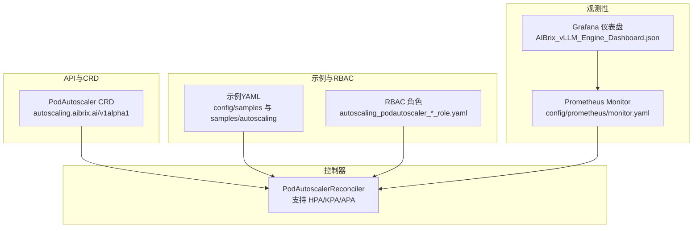
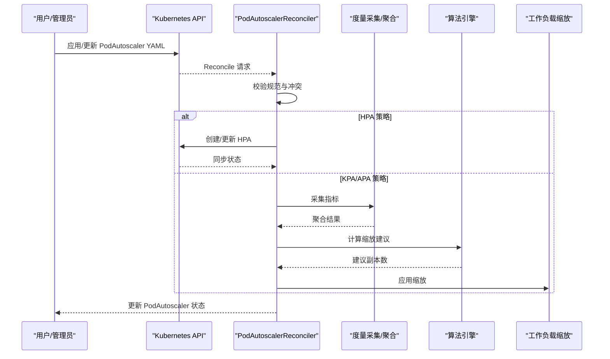
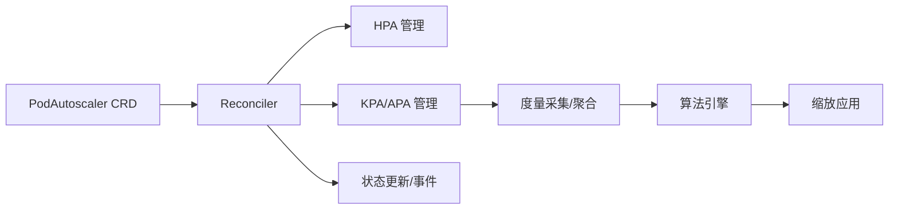

# 自动伸缩配置

<cite>
**本文引用的文件**
- [api/autoscaling/v1alpha1/podautoscaler_types.go](file://api/autoscaling/v1alpha1/podautoscaler_types.go)
- [pkg/controller/podautoscaler/podautoscaler_controller.go](file://pkg/controller/podautoscaler/podautoscaler_controller.go)
- [pkg/controller/podautoscaler/autoscaler.go](file://pkg/controller/podautoscaler/autoscaler.go)
- [config/samples/autoscaling_v1alpha1_podautoscaler.yaml](file://config/samples/autoscaling_v1alpha1_podautoscaler.yaml)
- [config/samples/autoscaling_v1alpha1_kpa.yaml](file://config/samples/autoscaling_v1alpha1_kpa.yaml)
- [config/samples/autoscaling_v1alpha1_mock_llama_apa.yaml](file://config/samples/autoscaling_v1alpha1_mock_llama_apa.yaml)
- [samples/autoscaling/hpa.yaml](file://samples/autoscaling/hpa.yaml)
- [samples/autoscaling/kpa.yaml](file://samples/autoscaling/kpa.yaml)
- [samples/autoscaling/apa.yaml](file://samples/autoscaling/apa.yaml)
- [samples/autoscaling/multimetrics-apa.yaml](file://samples/autoscaling/multimetrics-apa.yaml)
- [samples/autoscaling/apa-resource.yaml](file://samples/autoscaling/apa-resource.yaml)
- [config/crd/autoscaling/autoscaling.aibrix.ai_podautoscalers.yaml](file://config/crd/autoscaling/autoscaling.aibrix.ai_podautoscalers.yaml)
- [config/rbac/autoscaling/autoscaling_podautoscaler_editor_role.yaml](file://config/rbac/autoscaling/autoscaling_podautoscaler_editor_role.yaml)
- [config/rbac/autoscaling/autoscaling_podautoscaler_viewer_role.yaml](file://config/rbac/autoscaling/autoscaling_podautoscaler_viewer_role.yaml)
- [config/prometheus/monitor.yaml](file://config/prometheus/monitor.yaml)
- [observability/grafana/AIBrix_vLLM_Engine_Dashboard.json](file://observability/grafana/AIBrix_vLLM_Engine_Dashboard.json)
- [benchmarks/scenarios/autoscaling/README.md](file://benchmarks/scenarios/autoscaling/README.md)
</cite>

## 目录
1. [简介](#简介)
2. [项目结构](#项目结构)
3. [核心组件](#核心组件)
4. [架构总览](#架构总览)
5. [详细组件分析](#详细组件分析)
6. [依赖分析](#依赖分析)
7. [性能考虑](#性能考虑)
8. [故障排查指南](#故障排查指南)
9. [结论](#结论)
10. [附录](#附录)

## 简介
本教程面向AIBrix自动伸缩能力，系统性讲解三类策略的配置与调优：HPA（基于K8s原生HPA的封装）、KPA（基于指标的Knative风格自动伸缩）与APA（应用感知的自适应自动伸缩）。内容覆盖策略选择、触发条件、扩缩容窗口、资源限制、多指标聚合、监控与告警以及成本优化实践，并提供可直接落地的YAML配置示例与参数说明。

## 项目结构
与自动伸缩相关的关键位置如下：
- CRD定义：autoscaling.aibrix.ai/v1alpha1/PodAutoscaler
- 控制器：PodAutoscalerReconciler，支持HPA/KPA/APA三种策略
- 示例：config/samples与samples/autoscaling目录下提供多种策略的完整YAML示例
- 监控：Prometheus ServiceMonitor与Grafana仪表盘
- 基准场景：benchmarks/scenarios/autoscaling提供运行与评估脚本

图示来源
- [config/crd/autoscaling/autoscaling.aibrix.ai_podautoscalers.yaml](file://config/crd/autoscaling/autoscaling.aibrix.ai_podautoscalers.yaml)
- [pkg/controller/podautoscaler/podautoscaler_controller.go](file://pkg/controller/podautoscaler/podautoscaler_controller.go)
- [config/prometheus/monitor.yaml](file://config/prometheus/monitor.yaml)
- [observability/grafana/AIBrix_vLLM_Engine_Dashboard.json](file://observability/grafana/AIBrix_vLLM_Engine_Dashboard.json)

章节来源
- [config/crd/autoscaling/autoscaling.aibrix.ai_podautoscalers.yaml](file://config/crd/autoscaling/autoscaling.aibrix.ai_podautoscalers.yaml)
- [pkg/controller/podautoscaler/podautoscaler_controller.go](file://pkg/controller/podautoscaler/podautoscaler_controller.go)

## 核心组件
- PodAutoscaler CRD：定义目标工作负载、最小/最大副本数、度量来源与策略类型等
- PodAutoscalerReconciler：根据策略类型执行不同路径（HPA/KPA/APA），并维护状态与事件
- DefaultAutoScaler：统一的度量采集、聚合与算法决策流水线，支持多指标取最大推荐值

章节来源
- [api/autoscaling/v1alpha1/podautoscaler_types.go](file://api/autoscaling/v1alpha1/podautoscaler_types.go)
- [pkg/controller/podautoscaler/podautoscaler_controller.go](file://pkg/controller/podautoscaler/podautoscaler_controller.go)
- [pkg/controller/podautoscaler/autoscaler.go](file://pkg/controller/podautoscaler/autoscaler.go)

## 架构总览
控制器在每次协调周期中：
- 解析并校验PodAutoscaler规范
- 按策略类型分发处理：
  - HPA：生成/更新K8s HorizontalPodAutoscaler
  - KPA/APA：采集指标、聚合、算法计算、应用缩放
- 更新PodAutoscaler状态（当前/期望副本、条件、最近缩放时间）

图示来源
- [pkg/controller/podautoscaler/podautoscaler_controller.go](file://pkg/controller/podautoscaler/podautoscaler_controller.go)
- [pkg/controller/podautoscaler/autoscaler.go](file://pkg/controller/podautoscaler/autoscaler.go)

## 详细组件分析

### PodAutoscaler CRD与字段说明
- 关键字段
  - scaleTargetRef：目标工作负载（如Deployment）
  - minReplicas/maxReplicas：副本上下限
  - metricsSources：度量来源列表（支持pod/resource/custom/external）
  - scalingStrategy：策略类型（HPA/KPA/APA）
- 典型度量来源
  - pod：从Pod端点拉取指标（需指定协议、端口、路径）
  - resource：CPU/内存等资源指标
  - custom：自定义指标
  - external：外部服务（如gpu-optimizer）

章节来源
- [api/autoscaling/v1alpha1/podautoscaler_types.go](file://api/autoscaling/v1alpha1/podautoscaler_types.go)

### HPA（基于K8s原生HPA）策略
- 工作方式
  - 控制器生成/管理K8s HorizontalPodAutoscaler资源
  - 适用于已有成熟HPA场景或需要与KEDA等生态对齐的场景
- 配置要点
  - scalingStrategy: HPA
  - minReplicas/maxReplicas：控制上下限
  - metricsSources：使用resource或custom类型
- 示例参考
  - [samples/autoscaling/hpa.yaml](file://samples/autoscaling/hpa.yaml)
  - [config/samples/autoscaling_v1alpha1_podautoscaler.yaml](file://config/samples/autoscaling_v1alpha1_podautoscaler.yaml)

章节来源
- [samples/autoscaling/hpa.yaml](file://samples/autoscaling/hpa.yaml)
- [config/samples/autoscaling_v1alpha1_podautoscaler.yaml](file://config/samples/autoscaling_v1alpha1_podautoscaler.yaml)
- [pkg/controller/podautoscaler/podautoscaler_controller.go](file://pkg/controller/podautoscaler/podautoscaler_controller.go)

### KPA（基于指标的Knative风格）策略
- 工作方式
  - 使用panic/stable窗口进行缩放，适合波动较大的请求场景
  - 支持通过注解设置缩放延迟等行为
- 配置要点
  - scalingStrategy: KPA
  - metricsSources：通常使用pod类型，目标指标为GPU缓存利用率等
  - 注解：如缩放延迟等
- 示例参考
  - [samples/autoscaling/kpa.yaml](file://samples/autoscaling/kpa.yaml)
  - [config/samples/autoscaling_v1alpha1_kpa.yaml](file://config/samples/autoscaling_v1alpha1_kpa.yaml)

章节来源
- [samples/autoscaling/kpa.yaml](file://samples/autoscaling/kpa.yaml)
- [config/samples/autoscaling_v1alpha1_kpa.yaml](file://config/samples/autoscaling_v1alpha1_kpa.yaml)
- [pkg/controller/podautoscaler/podautoscaler_controller.go](file://pkg/controller/podautoscaler/podautoscaler_controller.go)

### APA（自适应自动伸缩）策略
- 工作方式
  - 多指标聚合后取最大推荐副本数，支持更精细的窗口与波动容忍度
  - 通过注解配置上/下波动容忍度与窗口大小
- 配置要点
  - scalingStrategy: APA
  - metricsSources：可配置多个指标（如GPU缓存利用率、等待请求数等）
  - 注解：up-fluctuation-tolerance、down-fluctuation-tolerance、window
- 示例参考
  - [samples/autoscaling/apa.yaml](file://samples/autoscaling/apa.yaml)
  - [samples/autoscaling/multimetrics-apa.yaml](file://samples/autoscaling/multimetrics-apa.yaml)
  - [samples/autoscaling/apa-resource.yaml](file://samples/autoscaling/apa-resource.yaml)
  - [config/samples/autoscaling_v1alpha1_mock_llama_apa.yaml](file://config/samples/autoscaling_v1alpha1_mock_llama_apa.yaml)

章节来源
- [samples/autoscaling/apa.yaml](file://samples/autoscaling/apa.yaml)
- [samples/autoscaling/multimetrics-apa.yaml](file://samples/autoscaling/multimetrics-apa.yaml)
- [samples/autoscaling/apa-resource.yaml](file://samples/autoscaling/apa-resource.yaml)
- [config/samples/autoscaling_v1alpha1_mock_llama_apa.yaml](file://config/samples/autoscaling_v1alpha1_mock_llama_apa.yaml)
- [pkg/controller/podautoscaler/autoscaler.go](file://pkg/controller/podautoscaler/autoscaler.go)

### 策略选择与触发条件
- 选择建议
  - HPA：追求与K8s生态一致、简单稳定；适合CPU/内存等通用资源指标
  - KPA：需要快速响应突发流量，具备panic/stable窗口
  - APA：需要多指标协同与更细粒度的波动控制，适合推理/训练等复杂场景
- 触发条件
  - 指标阈值与目标值比较（如GPU缓存利用率、等待请求数）
  - 多指标时采用最大推荐副本数，避免过度缩放

章节来源
- [pkg/controller/podautoscaler/autoscaler.go](file://pkg/controller/podautoscaler/autoscaler.go)
- [samples/autoscaling/multimetrics-apa.yaml](file://samples/autoscaling/multimetrics-apa.yaml)

### 扩缩容策略与窗口
- KPA/APA支持通过注解配置窗口与波动容忍度，以减少抖动
- HPA由K8s原生窗口与目标值决定

章节来源
- [samples/autoscaling/kpa.yaml](file://samples/autoscaling/kpa.yaml)
- [samples/autoscaling/apa.yaml](file://samples/autoscaling/apa.yaml)

### 资源限制与成本优化
- 副本上下限：合理设置minReplicas/maxReplicas，避免过度扩缩
- 多指标聚合：优先选择与业务强相关的指标，降低误触发概率
- 窗口与容忍度：适当增大窗口与容忍度，减少频繁缩放带来的成本波动

章节来源
- [samples/autoscaling/apa.yaml](file://samples/autoscaling/apa.yaml)
- [samples/autoscaling/multimetrics-apa.yaml](file://samples/autoscaling/multimetrics-apa.yaml)

### 监控指标与告警
- 指标采集
  - Prometheus ServiceMonitor用于抓取控制器与引擎指标
  - Grafana仪表盘展示关键指标（如吞吐、延迟、缓存利用率）
- 建议指标
  - GPU缓存利用率、等待请求数、QPS、CPU/内存使用率
- 告警建议
  - 缩放频率过高：检查窗口与容忍度
  - 指标异常：检查端点可达性与路径正确性

章节来源
- [config/prometheus/monitor.yaml](file://config/prometheus/monitor.yaml)
- [observability/grafana/AIBrix_vLLM_Engine_Dashboard.json](file://observability/grafana/AIBrix_vLLM_Engine_Dashboard.json)

### 性能调优案例
- 多指标APA：同时关注GPU缓存利用率与等待请求数，取最大推荐副本数
- 资源APA：以CPU使用率为指标，结合窗口与容忍度平滑缩放
- 基准场景：参考benchmarks/scenarios/autoscaling下的运行与评估脚本，进行压测与调参

章节来源
- [samples/autoscaling/multimetrics-apa.yaml](file://samples/autoscaling/multimetrics-apa.yaml)
- [samples/autoscaling/apa-resource.yaml](file://samples/autoscaling/apa-resource.yaml)
- [benchmarks/scenarios/autoscaling/README.md](file://benchmarks/scenarios/autoscaling/README.md)

## 依赖分析
- 控制器依赖
  - K8s资源指标客户端与自定义指标客户端
  - RESTMapper与动态客户端，用于解析目标工作负载
  - 事件记录器与状态更新
- 算法与度量
  - DefaultAutoScaler统一调度度量采集、聚合与算法决策
  - 多指标取最大推荐副本数，提升鲁棒性

图示来源
- [pkg/controller/podautoscaler/podautoscaler_controller.go](file://pkg/controller/podautoscaler/podautoscaler_controller.go)
- [pkg/controller/podautoscaler/autoscaler.go](file://pkg/controller/podautoscaler/autoscaler.go)

章节来源
- [pkg/controller/podautoscaler/podautoscaler_controller.go](file://pkg/controller/podautoscaler/podautoscaler_controller.go)
- [pkg/controller/podautoscaler/autoscaler.go](file://pkg/controller/podautoscaler/autoscaler.go)

## 性能考虑
- 缩放频率控制：通过窗口与容忍度降低抖动
- 指标质量：确保端点可达、路径正确、单位一致
- 多指标融合：仅在有效指标存在时才做决策，避免单点失效
- 成本优化：结合业务峰值与空闲时段，合理设置上下限与窗口

## 故障排查指南
- 常见问题
  - 规范无效：检查scaleTargetRef、副本上下限、指标来源必填项
  - 冲突：同一目标被多个PodAutoscaler控制
  - HPA未生效：确认HPA资源已创建且状态正常
  - 指标不可用：检查端点协议/端口/路径、网络连通性
- 状态与事件
  - 关注PodAutoscaler状态中的条件（ValidSpec、ScalingActive、AbleToScale、Ready）
  - 查看事件记录器输出的缩放原因与错误信息

章节来源
- [pkg/controller/podautoscaler/podautoscaler_controller.go](file://pkg/controller/podautoscaler/podautoscaler_controller.go)

## 结论
AIBrix提供了统一的PodAutoscaler抽象，覆盖HPA/KPA/APA三大策略，既能与K8s生态无缝对接，又能满足复杂业务场景下的精细化控制需求。通过合理的指标选择、窗口与容忍度配置，以及完善的监控与告警体系，可在保证SLA的同时实现成本优化与稳定性平衡。

## 附录

### 完整YAML配置示例与参数说明
- HPA示例
  - [samples/autoscaling/hpa.yaml](file://samples/autoscaling/hpa.yaml)
  - 字段要点：scalingStrategy=HPA、minReplicas/maxReplicas、metricsSources（pod/resource/custom）
- KPA示例
  - [samples/autoscaling/kpa.yaml](file://samples/autoscaling/kpa.yaml)
  - 字段要点：scalingStrategy=KPA、metricsSources（pod）、注解（如缩放延迟）
- APA示例
  - [samples/autoscaling/apa.yaml](file://samples/autoscaling/apa.yaml)
  - 字段要点：scalingStrategy=APA、metricsSources（pod）、注解（波动容忍度、窗口）
  - 多指标APA：[samples/autoscaling/multimetrics-apa.yaml](file://samples/autoscaling/multimetrics-apa.yaml)
  - 资源APA：[samples/autoscaling/apa-resource.yaml](file://samples/autoscaling/apa-resource.yaml)
- 基础示例
  - [config/samples/autoscaling_v1alpha1_podautoscaler.yaml](file://config/samples/autoscaling_v1alpha1_podautoscaler.yaml)
  - [config/samples/autoscaling_v1alpha1_kpa.yaml](file://config/samples/autoscaling_v1alpha1_kpa.yaml)
  - [config/samples/autoscaling_v1alpha1_mock_llama_apa.yaml](file://config/samples/autoscaling_v1alpha1_mock_llama_apa.yaml)

### RBAC与安装
- RBAC角色
  - [config/rbac/autoscaling/autoscaling_podautoscaler_editor_role.yaml](file://config/rbac/autoscaling/autoscaling_podautoscaler_editor_role.yaml)
  - [config/rbac/autoscaling/autoscaling_podautoscaler_viewer_role.yaml](file://config/rbac/autoscaling/autoscaling_podautoscaler_viewer_role.yaml)
- CRD
  - [config/crd/autoscaling/autoscaling.aibrix.ai_podautoscalers.yaml](file://config/crd/autoscaling/autoscaling.aibrix.ai_podautoscalers.yaml)