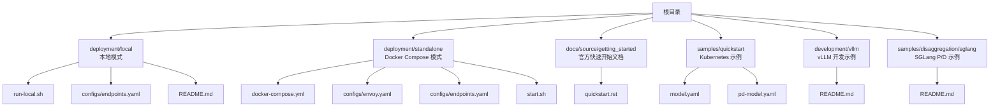
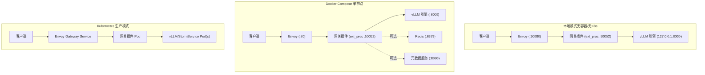
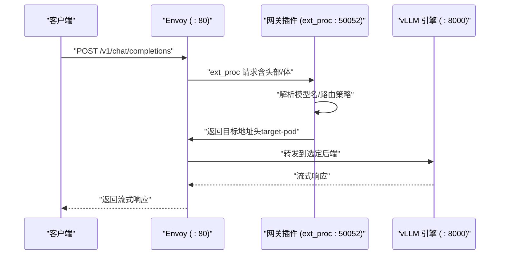
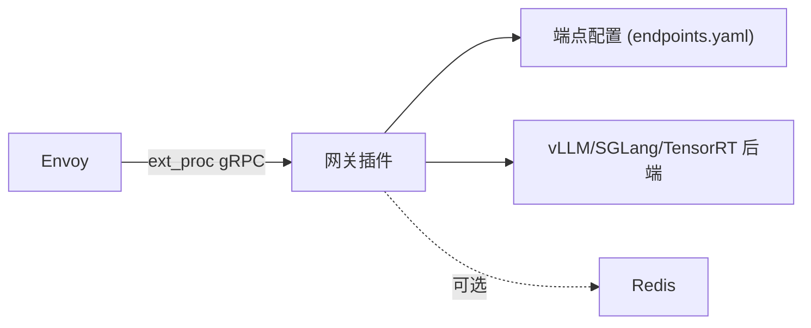

# 快速开始

<cite>
**本文引用的文件**
- [README.md](file://README.md)
- [deployment/local/README.md](file://deployment/local/README.md)
- [deployment/local/run-local.sh](file://deployment/local/run-local.sh)
- [deployment/local/configs/endpoints.yaml](file://deployment/local/configs/endpoints.yaml)
- [deployment/standalone/README.md](file://deployment/standalone/README.md)
- [deployment/standalone/docker-compose.yml](file://deployment/standalone/docker-compose.yml)
- [deployment/standalone/configs/envoy.yaml](file://deployment/standalone/configs/envoy.yaml)
- [deployment/standalone/configs/endpoints.yaml](file://deployment/standalone/configs/endpoints.yaml)
- [deployment/standalone/start.sh](file://deployment/standalone/start.sh)
- [docs/source/getting_started/quickstart.rst](file://docs/source/getting_started/quickstart.rst)
- [samples/quickstart/model.yaml](file://samples/quickstart/model.yaml)
- [samples/quickstart/pd-model.yaml](file://samples/quickstart/pd-model.yaml)
- [development/vllm/README.md](file://development/vllm/README.md)
- [samples/disaggregation/sglang/README.md](file://samples/disaggregation/sglang/README.md)
</cite>

## 目录
1. [简介](#简介)
2. [项目结构](#项目结构)
3. [核心组件](#核心组件)
4. [架构总览](#架构总览)
5. [详细组件分析](#详细组件分析)
6. [依赖关系分析](#依赖关系分析)
7. [性能考虑](#性能考虑)
8. [故障排查指南](#故障排查指南)
9. [结论](#结论)
10. [附录](#附录)

## 简介
本指南面向首次接触 AIBrix 的用户，提供从零开始的完整部署与验证流程，覆盖本地开发模式、Docker Compose 单节点模式以及 Kubernetes 生产模式。文档重点围绕三种主流推理引擎（vLLM、SGLang、TensorRT）的最小可用示例，帮助你在最短时间内启动第一个 AI 推理服务，并给出可直接复制粘贴的命令与配置路径。

## 项目结构
以下图示展示了与“快速开始”相关的关键目录与文件，便于你按需查阅：

图表来源
- [deployment/local/README.md:1-195](file://deployment/local/README.md#L1-L195)
- [deployment/standalone/README.md:1-397](file://deployment/standalone/README.md#L1-L397)
- [docs/source/getting_started/quickstart.rst:1-194](file://docs/source/getting_started/quickstart.rst#L1-L194)
- [samples/quickstart/model.yaml:1-76](file://samples/quickstart/model.yaml#L1-L76)
- [samples/quickstart/pd-model.yaml:1-133](file://samples/quickstart/pd-model.yaml#L1-L133)
- [development/vllm/README.md:1-97](file://development/vllm/README.md#L1-L97)
- [samples/disaggregation/sglang/README.md:1-151](file://samples/disaggregation/sglang/README.md#L1-L151)

章节来源
- [README.md:46-69](file://README.md#L46-L69)
- [docs/source/getting_started/quickstart.rst:1-194](file://docs/source/getting_started/quickstart.rst#L1-L194)

## 核心组件
- 网关与路由
  - Envoy：L7 代理，负责健康检查、重试、熔断与请求转发。
  - 网关插件（ext_proc）：作为外部处理器，解析请求、提取模型名、选择后端、返回目标地址头。
- 推理引擎
  - vLLM：高性能 LLM 推理引擎，支持 OpenAI 兼容接口。
  - SGLang：支持预填充/解码拆分与动态路由。
  - TensorRT：通过适配器或自定义镜像接入（本快速开始以 vLLM/SGLang 为主）。
- 辅助服务
  - Redis：共享状态存储（速率限制等）。
  - 元数据服务：模型注册与文件管理。

章节来源
- [deployment/standalone/configs/envoy.yaml:1-320](file://deployment/standalone/configs/envoy.yaml#L1-L320)
- [deployment/standalone/docker-compose.yml:1-261](file://deployment/standalone/docker-compose.yml#L1-L261)
- [deployment/local/README.md:1-195](file://deployment/local/README.md#L1-L195)

## 架构总览
下图展示了三种部署形态的总体架构与数据流：

图表来源
- [deployment/local/README.md:14-27](file://deployment/local/README.md#L14-L27)
- [deployment/standalone/README.md:63-108](file://deployment/standalone/README.md#L63-L108)
- [docs/source/getting_started/quickstart.rst:62-126](file://docs/source/getting_started/quickstart.rst#L62-L126)

## 详细组件分析

### 本地模式（无容器/无 Kubernetes）
适合本地开发调试、单机测试与快速验证路由行为。

- 启动步骤
  - 安装 Go 与 Envoy。
  - 编译网关插件二进制。
  - 启动 vLLM 引擎。
  - 使用脚本或手动启动 Envoy 与网关插件。
  - 配置 endpoints.yaml 指向 vLLM 地址。
  - 发送 OpenAI 兼容请求进行验证。

- 关键文件与命令
  - 运行脚本：[run-local.sh:1-165](file://deployment/local/run-local.sh#L1-L165)
  - 端点配置：[endpoints.yaml:1-33](file://deployment/local/configs/endpoints.yaml#L1-L33)
  - 健康检查与测试：见本地模式 README 中的端点与测试示例。

- 端口与日志
  - 网关插件 gRPC/HTTP：50052/8080
  - Envoy HTTP/Admin：10080/9901
  - 日志位置：logs/gateway-plugin.log、logs/envoy.log

- 路由算法
  - 通过环境变量设置（如 random、round_robin、least_request、prefix_cache_aware 等），在启动前设置即可生效。

章节来源
- [deployment/local/README.md:31-121](file://deployment/local/README.md#L31-L121)
- [deployment/local/run-local.sh:1-165](file://deployment/local/run-local.sh#L1-L165)
- [deployment/local/configs/endpoints.yaml:1-33](file://deployment/local/configs/endpoints.yaml#L1-L33)

### Docker Compose 单节点模式
适合开发测试与单 GPU/多 GPU 推理场景，提供 P/D 拆分能力。

- 启动步骤
  - 准备 Docker 与 Compose v2、NVIDIA Container Toolkit。
  - 复制并编辑 .env，设置模型名称、缓存目录、Token、GPU 等。
  - 启动：默认模式或 P/D 模式。
  - 健康检查与测试：使用提供的 curl 命令验证。

- 关键文件与命令
  - 配置模板：[docker-compose.yml:1-261](file://deployment/standalone/docker-compose.yml#L1-L261)
  - Envoy 配置：[envoy.yaml:1-320](file://deployment/standalone/configs/envoy.yaml#L1-L320)
  - 端点配置（简单/PD）：[endpoints.yaml:1-15](file://deployment/standalone/configs/endpoints.yaml#L1-L15)
  - 启动脚本：[start.sh:1-373](file://deployment/standalone/start.sh#L1-L373)

- 端口与服务
  - Envoy：80/9901
  - vLLM/Prefill/Decode：8000/8001/8002
  - 网关插件：50052/8080
  - 元数据服务：8090
  - Redis：6379

- P/D 拆分
  - 通过 --profile pd 启用，分别在不同 GPU 上运行 prefill 与 decode 引擎；路由策略自动切换为 pd。

章节来源
- [deployment/standalone/README.md:14-209](file://deployment/standalone/README.md#L14-L209)
- [deployment/standalone/docker-compose.yml:1-261](file://deployment/standalone/docker-compose.yml#L1-L261)
- [deployment/standalone/configs/envoy.yaml:1-320](file://deployment/standalone/configs/envoy.yaml#L1-L320)
- [deployment/standalone/configs/endpoints.yaml:1-15](file://deployment/standalone/configs/endpoints.yaml#L1-L15)
- [deployment/standalone/start.sh:1-373](file://deployment/standalone/start.sh#L1-L373)

### Kubernetes 生产模式
适合多节点、需要自动扩缩容与动态服务发现的生产环境。

- 安装与部署
  - 安装依赖与核心组件（官方发布包或 Kustomize）。
  - 应用示例 CRD（模型部署、P/D 拆分）。
  - 通过 Envoy Gateway 获取入口，发送 OpenAI 兼容请求。

- 关键文件与命令
  - 快速开始文档：[quickstart.rst:1-194](file://docs/source/getting_started/quickstart.rst#L1-L194)
  - 基础模型示例：[model.yaml:1-76](file://samples/quickstart/model.yaml#L1-L76)
  - P/D 模型示例：[pd-model.yaml:1-133](file://samples/quickstart/pd-model.yaml#L1-L133)
  - vLLM 开发示例（Kind/K8s）：[development/vllm/README.md:1-97](file://development/vllm/README.md#L1-L97)

- 访问入口
  - 通过 LoadBalancer 或端口转发获取网关地址。
  - 支持 routing-strategy 请求头（如 random、least-request、pd）。

章节来源
- [docs/source/getting_started/quickstart.rst:1-194](file://docs/source/getting_started/quickstart.rst#L1-L194)
- [samples/quickstart/model.yaml:1-76](file://samples/quickstart/model.yaml#L1-L76)
- [samples/quickstart/pd-model.yaml:1-133](file://samples/quickstart/pd-model.yaml#L1-L133)
- [development/vllm/README.md:1-97](file://development/vllm/README.md#L1-L97)

### 不同推理引擎的最小可用示例

#### vLLM（本地/Compose/K8s）
- 本地模式
  - 启动 vLLM 引擎（例如监听 8000 端口）。
  - 在 endpoints.yaml 中配置该地址。
  - 使用 curl 或 OpenAI SDK 调用 /v1/chat/completions。
- Docker Compose
  - 默认模式：vllm 服务承载推理。
  - P/D 模式：prefill-engine 与 decode-engine 分别监听 8001/8002。
- Kubernetes
  - 使用 vLLM 镜像部署，通过 Service 暴露；网关通过模型标签与服务名匹配后端。

章节来源
- [deployment/local/README.md:74-121](file://deployment/local/README.md#L74-L121)
- [deployment/standalone/docker-compose.yml:108-211](file://deployment/standalone/docker-compose.yml#L108-L211)
- [samples/quickstart/model.yaml:1-76](file://samples/quickstart/model.yaml#L1-L76)
- [samples/quickstart/pd-model.yaml:1-133](file://samples/quickstart/pd-model.yaml#L1-L133)

#### SGLang（仅 P/D 拆分示例）
- 说明
  - 提供 SGLang 预构建镜像与路由器镜像的构建方法。
  - 支持两种路由方案：SGLang 自带路由器与 AIBrix Envoy 动态路由（routing-strategy: pd）。
- 关键点
  - 模型字段需与 Deployment 标签一致。
  - 发送 /v1/chat/completions 并携带 routing-strategy: pd。

章节来源
- [samples/disaggregation/sglang/README.md:1-151](file://samples/disaggregation/sglang/README.md#L1-L151)

#### TensorRT（概念性说明）
- 说明
  - 本快速开始以 vLLM 与 SGLang 为主；TensorRT 可通过适配器或自定义镜像接入。
  - 若需使用，请参考官方容器镜像与部署规范，确保网关能识别引擎类型并在 endpoints.yaml 中正确配置。

[本节为概念性说明，不直接分析具体文件]

### API 工作流（以 Docker Compose 为例）

图表来源
- [deployment/standalone/configs/envoy.yaml:152-176](file://deployment/standalone/configs/envoy.yaml#L152-L176)
- [deployment/standalone/docker-compose.yml:218-249](file://deployment/standalone/docker-compose.yml#L218-L249)

## 依赖关系分析
- 组件耦合
  - Envoy 与网关插件通过 gRPC ext_proc 紧密耦合，负责请求解析与路由决策。
  - 网关插件依赖 endpoints.yaml（或 endpoints-pd.yaml）中的后端列表与路由策略。
  - vLLM/SGLang/TensorRT 作为后端，需与网关插件在同一网络中可达。
- 外部依赖
  - Docker/Compose（单节点模式）
  - Kubernetes（生产模式）
  - Redis（可选，用于速率限制等）
  - HuggingFace Token（私有/受限模型）

图表来源
- [deployment/standalone/configs/envoy.yaml:152-176](file://deployment/standalone/configs/envoy.yaml#L152-L176)
- [deployment/standalone/docker-compose.yml:218-249](file://deployment/standalone/docker-compose.yml#L218-L249)
- [deployment/standalone/configs/endpoints.yaml:1-15](file://deployment/standalone/configs/endpoints.yaml#L1-L15)

## 性能考虑
- 上游健康检查与熔断
  - Envoy 配置了上游健康检查与熔断阈值，避免故障传播。
- 流式响应
  - Envoy 对 LLM 响应启用流式传输，降低首字节延迟。
- 路由策略
  - 根据负载与缓存命中情况选择最优后端，建议在生产中结合前缀缓存与最少连接策略。
- P/D 拆分
  - 将预填充与解码阶段分离至不同 GPU，提升吞吐与内存利用率。

章节来源
- [deployment/standalone/configs/envoy.yaml:254-277](file://deployment/standalone/configs/envoy.yaml#L254-L277)
- [deployment/standalone/docker-compose.yml:145-211](file://deployment/standalone/docker-compose.yml#L145-L211)

## 故障排查指南
- 本地模式
  - “无健康上游”：检查 endpoints.yaml 中后端地址是否可达。
  - “ext_proc gRPC 错误”：查看网关插件日志，确认进程正常。
  - Envoy 启动失败：检查端口占用（10080/9901）。
  - 路由不生效：确认请求中的模型名与 endpoints.yaml 完全一致。
- Docker Compose
  - GPU 未找到：检查 nvidia-smi 与 Docker GPU 访问。
  - 模型加载失败：查看 vLLM 日志、确认缓存目录与上下文长度。
  - 连接错误：检查 Envoy 健康与上游集群状态，尝试直连 vLLM。
  - 内存不足：降低 GPU 内存利用率或上下文长度，或更换更小模型。
- Kubernetes
  - 外部 IP 无法暴露：使用端口转发或检查云厂商的 LoadBalancer 字段。
  - P/D 路由：发送请求时添加 routing-strategy: pd。

章节来源
- [deployment/local/README.md:186-195](file://deployment/local/README.md#L186-L195)
- [deployment/standalone/README.md:210-268](file://deployment/standalone/README.md#L210-L268)
- [docs/source/getting_started/quickstart.rst:184-193](file://docs/source/getting_started/quickstart.rst#L184-L193)

## 结论
通过本指南，你可以基于本地模式、Docker Compose 单节点模式与 Kubernetes 生产模式，快速完成 AIBrix 的部署与验证。建议先从本地模式熟悉路由与端点配置，再过渡到 Docker Compose 体验 P/D 拆分，最后在 Kubernetes 中集成控制器与网关插件，实现企业级的弹性与可观测性。

## 附录

### 快速命令清单（可直接复制）
- 本地模式
  - 启动：[run-local.sh:108-121](file://deployment/local/run-local.sh#L108-L121)
  - 测试：[run-local.sh:155-159](file://deployment/local/run-local.sh#L155-L159)
- Docker Compose
  - 启动（默认）：[start.sh:165-177](file://deployment/standalone/start.sh#L165-L177)
  - 启动（P/D）：[start.sh:169-171](file://deployment/standalone/start.sh#L169-L171)
  - 健康检查与模型列表：[README.md:48-61](file://deployment/standalone/README.md#L48-L61)
- Kubernetes
  - 安装组件与示例：[quickstart.rst:19-57](file://docs/source/getting_started/quickstart.rst#L19-L57)
  - 访问与测试：[quickstart.rst:62-126](file://docs/source/getting_started/quickstart.rst#L62-L126)

### 示例配置文件路径
- 本地模式端点：[endpoints.yaml:1-33](file://deployment/local/configs/endpoints.yaml#L1-L33)
- Docker Compose 端点（简单）：[endpoints.yaml:1-15](file://deployment/standalone/configs/endpoints.yaml#L1-L15)
- Docker Compose Envoy：[envoy.yaml:1-320](file://deployment/standalone/configs/envoy.yaml#L1-L320)
- 基础模型示例：[model.yaml:1-76](file://samples/quickstart/model.yaml#L1-L76)
- P/D 模型示例：[pd-model.yaml:1-133](file://samples/quickstart/pd-model.yaml#L1-L133)