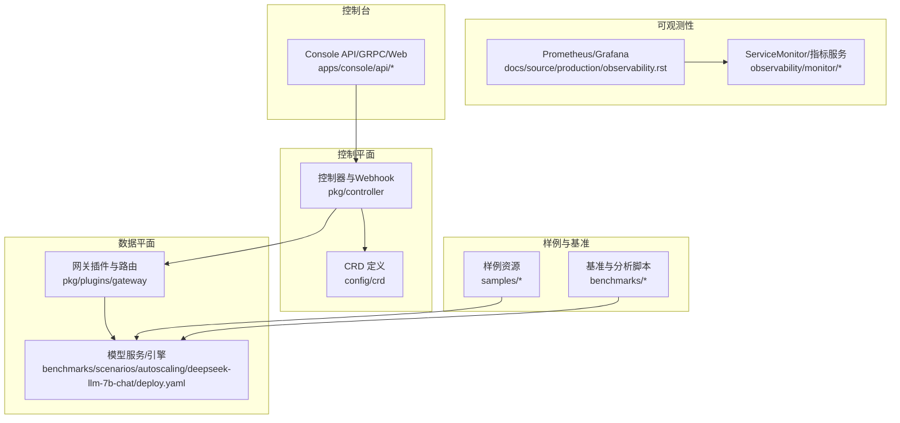
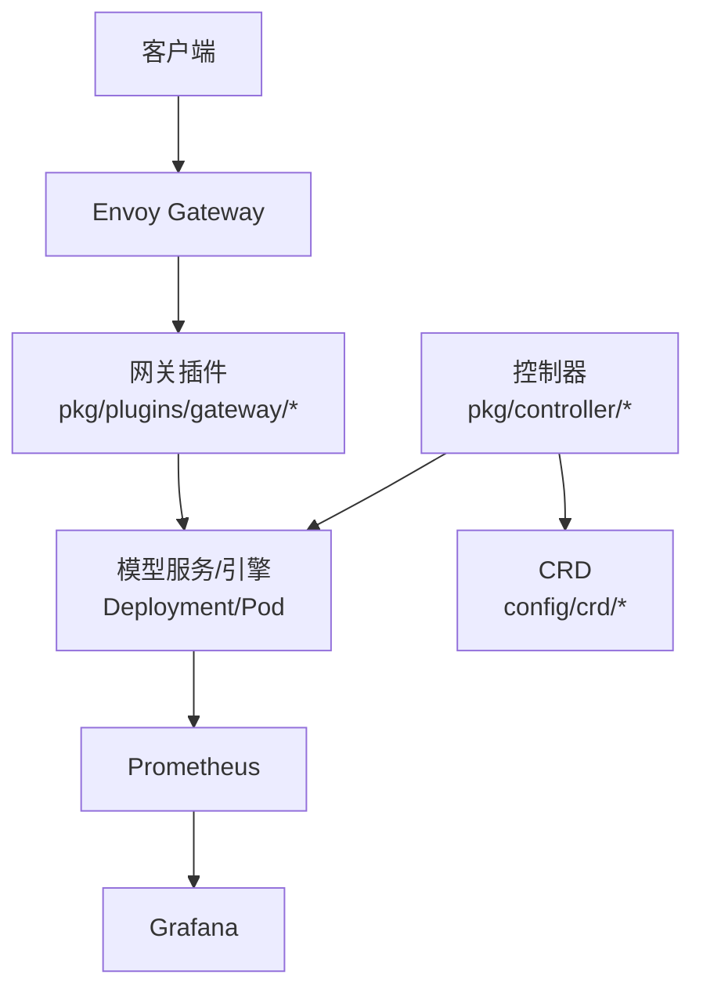
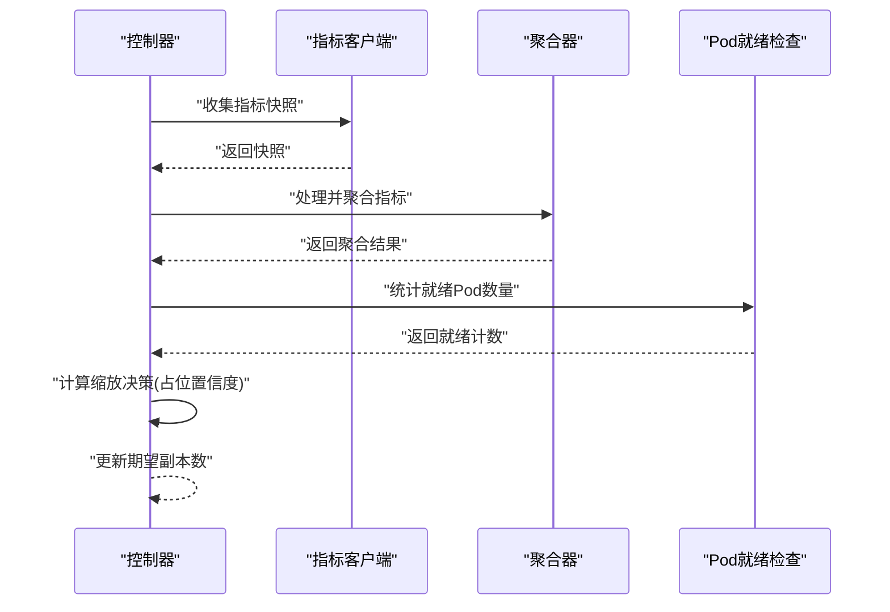
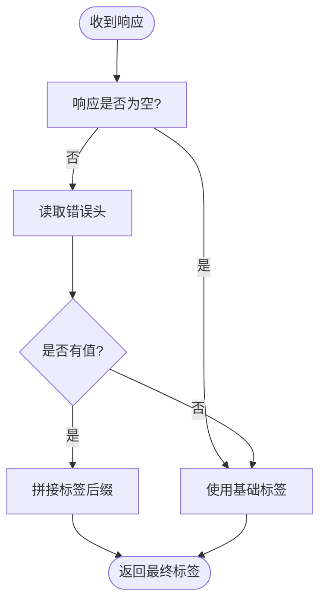
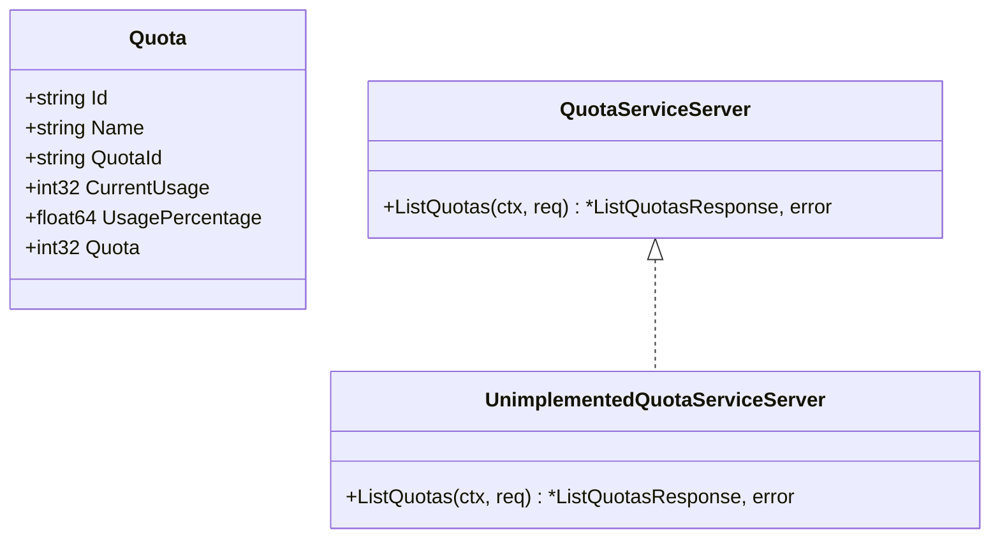
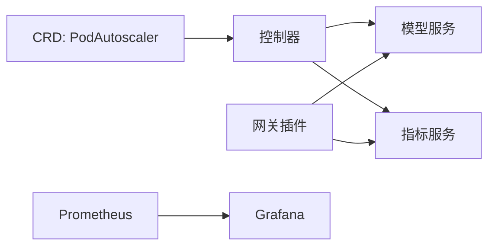

# 故障排除

<cite>
**本文引用的文件**
- [README.md](file://README.md)
- [docs/source/getting_started/faq.rst](file://docs/source/getting_started/faq.rst)
- [docs/source/production/observability.rst](file://docs/source/production/observability.rst)
- [pkg/controller/podautoscaler/utils.go](file://pkg/controller/podautoscaler/utils.go)
- [pkg/controller/podautoscaler/autoscaler.go](file://pkg/controller/podautoscaler/autoscaler.go)
- [pkg/controller/podautoscaler/metrics/client.go](file://pkg/controller/podautoscaler/metrics/client.go)
- [pkg/controller/rayclusterfleet/util/fleet.go](file://pkg/controller/rayclusterfleet/util/fleet.go)
- [pkg/controller/modeladapter/modeladapter_controller.go](file://pkg/controller/modeladapter/modeladapter_controller.go)
- [pkg/controller/modeladapter/modeladapter_controller_unit_tests.go](file://pkg/controller/modeladapter/modeladapter_controller_unit_tests.go)
- [pkg/plugins/gateway/gateway.go](file://pkg/plugins/gateway/gateway.go)
- [pkg/plugins/gateway/gateway_rsp_body.go](file://pkg/plugins/gateway/gateway_rsp_body.go)
- [benchmarks/scenarios/autoscaling/deepseek-llm-7b-chat/deploy.yaml](file://benchmarks/scenarios/autoscaling/deepseek-llm-7b-chat/deploy.yaml)
- [benchmarks/scenarios/utils/check_k8s_is_ready.py](file://benchmarks/scenarios/utils/check_k8s_is_ready.py)
- [benchmarks/scenarios/utils/count_num_pods.py](file://benchmarks/scenarios/utils/count_num_pods.py)
- [benchmarks/client/analyze.py](file://benchmarks/client/analyze.py)
- [apps/console/api/gen/console/v1/console_grpc.pb.go](file://apps/console/api/gen/console/v1/console_grpc.pb.go)
- [apps/console/api/gen/console/v1/console.pb.gw.go](file://apps/console/api/gen/console/v1/console.pb.gw.go)
- [apps/console/api/resource_manager/catalog/kubernetes.go](file://apps/console/api/resource_manager/catalog/kubernetes.go)
- [config/crd/autoscaling/autoscaling.aibrix.ai_podautoscalers.yaml](file://config/crd/autoscaling/autoscaling.aibrix.ai_podautoscalers.yaml)
- [config/samples/autoscaling_v1alpha1_podautoscaler.yaml](file://config/samples/autoscaling_v1alpha1_podautoscaler.yaml)
- [scripts/port-forward.sh](file://scripts/port-forward.sh)
</cite>

## 目录
1. [简介](#简介)
2. [项目结构](#项目结构)
3. [核心组件](#核心组件)
4. [架构总览](#架构总览)
5. [详细组件分析](#详细组件分析)
6. [依赖关系分析](#依赖关系分析)
7. [性能考量](#性能考量)
8. [故障排除指南](#故障排除指南)
9. [结论](#结论)
10. [附录](#附录)

## 简介
本手册面向AIBrix生产运维与开发人员，系统化梳理部署失败、服务不可用、性能异常、配置错误等常见问题的诊断路径与解决策略。内容覆盖从日志分析、指标监控到kubectl与脚本工具的实操技巧，并提供问题分类索引与快速查找指南，以及预防性维护与应急响应建议。

## 项目结构
AIBrix采用云原生分层架构：控制平面（控制器与Webhook）、数据面（网关与模型服务）、可观测性（Prometheus/Grafana）与样例/基准测试。关键目录与职责概览如下：
- 控制器与CRD：pkg/controller、config/crd
- 网关插件与路由：pkg/plugins/gateway
- 指标与可观测性：observability、pkg/metrics
- 样例与基准：samples、benchmarks
- 控制台API与前端：apps/console
- 部署与本地运行：deployment、scripts

图表来源
- [docs/source/production/observability.rst:18-72](file://docs/source/production/observability.rst#L18-L72)
- [benchmarks/scenarios/autoscaling/deepseek-llm-7b-chat/deploy.yaml:47-84](file://benchmarks/scenarios/autoscaling/deepseek-llm-7b-chat/deploy.yaml#L47-L84)

章节来源
- [README.md:41-90](file://README.md#L41-L90)

## 核心组件
- 控制器与自动伸缩：负责Pod副本数、Ray集群编排、模型适配器生命周期管理与重试退避。
- 网关插件：实现请求路由、速率限制、头部/响应体处理与延迟拆解指标。
- 指标采集与聚合：支持稳定/紧急窗口聚合、趋势分析占位、历史统计回放。
- 可观测性：提供控制面、网关、模型服务仪表盘与ServiceMonitor参考。
- 基准与分析：端到端延迟、TTFT/TPOT、吞吐统计与可视化脚本。

章节来源
- [pkg/controller/podautoscaler/autoscaler.go:257-285](file://pkg/controller/podautoscaler/autoscaler.go#L257-L285)
- [pkg/controller/podautoscaler/metrics/client.go:71-277](file://pkg/controller/podautoscaler/metrics/client.go#L71-L277)
- [pkg/plugins/gateway/gateway.go:514-534](file://pkg/plugins/gateway/gateway.go#L514-L534)
- [pkg/plugins/gateway/gateway_rsp_body.go:268-284](file://pkg/plugins/gateway/gateway_rsp_body.go#L268-L284)
- [docs/source/production/observability.rst:18-72](file://docs/source/production/observability.rst#L18-L72)

## 架构总览
下图展示AIBrix在Kubernetes中的典型流量与组件交互：客户端经Envoy Gateway进入，由网关插件进行路由与限流，转发至模型服务；控制平面通过CRD与控制器管理资源状态；Prometheus抓取指标，Grafana可视化。

图表来源
- [docs/source/production/observability.rst:18-72](file://docs/source/production/observability.rst#L18-L72)
- [pkg/plugins/gateway/gateway.go:514-534](file://pkg/plugins/gateway/gateway.go#L514-L534)

## 详细组件分析

### 自动伸缩组件分析
- 指标采集与聚合：MetricsClient按稳定/紧急窗口存储与聚合指标，记录日志便于诊断。
- 缩放决策：控制器收集快照、聚合指标、增强置信度（占位），输出目标副本数。
- Pod就绪判断：isPodReady基于Pod条件判断健康状态。
- Ray Fleet参数校验：surge/unavailable边界处理与进度/历史保留策略开关。

图表来源
- [pkg/controller/podautoscaler/autoscaler.go:257-285](file://pkg/controller/podautoscaler/autoscaler.go#L257-L285)
- [pkg/controller/podautoscaler/metrics/client.go:156-187](file://pkg/controller/podautoscaler/metrics/client.go#L156-L187)
- [pkg/controller/podautoscaler/utils.go:38-55](file://pkg/controller/podautoscaler/utils.go#L38-L55)

章节来源
- [pkg/controller/podautoscaler/autoscaler.go:257-285](file://pkg/controller/podautoscaler/autoscaler.go#L257-L285)
- [pkg/controller/podautoscaler/metrics/client.go:71-277](file://pkg/controller/podautoscaler/metrics/client.go#L71-L277)
- [pkg/controller/podautoscaler/utils.go:38-55](file://pkg/controller/podautoscaler/utils.go#L38-L55)
- [pkg/controller/rayclusterfleet/util/fleet.go:889-912](file://pkg/controller/rayclusterfleet/util/fleet.go#L889-L912)

### 网关组件分析
- 错误指标标签：根据响应头动态生成错误标签，辅助定位路由/适配器错误。
- 路由时序拆解：对路由、预填充、KV传输、解码阶段分别统计耗时并上报Prometheus桶计数。
- 请求/响应体处理：支持头部与响应体的注入与修改，便于可观测与限流。

图表来源
- [pkg/plugins/gateway/gateway.go:514-534](file://pkg/plugins/gateway/gateway.go#L514-L534)

章节来源
- [pkg/plugins/gateway/gateway.go:514-534](file://pkg/plugins/gateway/gateway.go#L514-L534)
- [pkg/plugins/gateway/gateway_rsp_body.go:268-284](file://pkg/plugins/gateway/gateway_rsp_body.go#L268-L284)

### 控制台API组件分析
- 未实现方法：ListDeployments/CreateDeployment/DeleteDeployment等返回“未实现”错误，用于接口演进与兼容。
- Quota服务：定义了Quota模型与RPC接口，当前客户端侧可能未实现具体实现。
- 资源量纲转换：将CPU等资源单位转换为整数值，便于统一统计。

图表来源
- [apps/console/api/gen/console/v1/console.pb.go:3202-3272](file://apps/console/api/gen/console/v1/console.pb.go#L3202-L3272)
- [apps/console/api/gen/console/v1/console_grpc.pb.go:119-139](file://apps/console/api/gen/console/v1/console_grpc.pb.go#L119-L139)
- [apps/console/api/gen/console/v1/console.pb.gw.go:875-888](file://apps/console/api/gen/console/v1/console.pb.gw.go#L875-L888)
- [apps/console/api/resource_manager/catalog/kubernetes.go:221-239](file://apps/console/api/resource_manager/catalog/kubernetes.go#L221-L239)

章节来源
- [apps/console/api/gen/console/v1/console_grpc.pb.go:119-139](file://apps/console/api/gen/console/v1/console_grpc.pb.go#L119-L139)
- [apps/console/api/gen/console/v1/console.pb.gw.go:875-888](file://apps/console/api/gen/console/v1/console.pb.gw.go#L875-L888)
- [apps/console/api/resource_manager/catalog/kubernetes.go:221-239](file://apps/console/api/resource_manager/catalog/kubernetes.go#L221-L239)

## 依赖关系分析
- CRD与控制器：控制器依赖CRD定义的自定义资源（如PodAutoscaler），通过client-go与informers监听状态变更。
- 网关与模型服务：网关插件依赖模型服务可达性与健康探针；Ray Fleet参数影响滚动升级与可用性。
- 指标与监控：控制器与网关均产生指标，需ServiceMonitor与辅助指标服务暴露给Prometheus。

图表来源
- [config/crd/autoscaling/autoscaling.aibrix.ai_podautoscalers.yaml:1-198](file://config/crd/autoscaling/autoscaling.aibrix.ai_podautoscalers.yaml#L1-L198)
- [config/samples/autoscaling_v1alpha1_podautoscaler.yaml:1-18](file://config/samples/autoscaling_v1alpha1_podautoscaler.yaml#L1-L18)
- [docs/source/production/observability.rst:18-72](file://docs/source/production/observability.rst#L18-L72)

章节来源
- [config/crd/autoscaling/autoscaling.aibrix.ai_podautoscalers.yaml:1-198](file://config/crd/autoscaling/autoscaling.aibrix.ai_podautoscalers.yaml#L1-L198)
- [config/samples/autoscaling_v1alpha1_podautoscaler.yaml:1-18](file://config/samples/autoscaling_v1alpha1_podautoscaler.yaml#L1-L18)
- [docs/source/production/observability.rst:18-72](file://docs/source/production/observability.rst#L18-L72)

## 性能考量
- 指标窗口与聚合：稳定/紧急窗口长度与粒度影响缩放响应速度与抖动；日志中会打印窗口内值以辅助诊断。
- 趋势与置信度：当前实现为占位，后续可结合Pod数量与历史统计提升决策稳健性。
- 路由时序拆解：将TTFT/解码等阶段拆分统计，有助于定位瓶颈（网络、KV、解码）。
- 基准分析：端到端延迟、TTFT/TPOT、吞吐统计与可视化脚本可用于回归对比。

章节来源
- [pkg/controller/podautoscaler/metrics/client.go:71-277](file://pkg/controller/podautoscaler/metrics/client.go#L71-L277)
- [pkg/plugins/gateway/gateway_rsp_body.go:268-284](file://pkg/plugins/gateway/gateway_rsp_body.go#L268-L284)
- [benchmarks/client/analyze.py:48-65](file://benchmarks/client/analyze.py#L48-L65)

## 故障排除指南

### 一、部署失败
- 症状
  - 命名空间删除卡住，残留Finalizer导致对象无法清理。
  - CRD安装或应用失败，资源未被识别。
- 诊断步骤
  - 查看命名空间删除状态与阻塞原因，编辑对应对象移除Finalizer后等待自动清理。
  - 使用kubectl检查CRD是否存在且版本正确，确认RBAC与ServiceAccount权限。
- 解决方案
  - 手动移除Finalizer后重试删除；确保依赖组件（如Envoy Gateway Operator）已安装。
  - 使用官方依赖清单或Kustomize overlay正确安装CRD与RBAC。

章节来源
- [docs/source/getting_started/faq.rst:10-24](file://docs/source/getting_started/faq.rst#L10-L24)
- [README.md:50-69](file://README.md#L50-L69)

### 二、服务不可用
- 症状
  - 网关访问报错（如多节点推理场景下的500），直接port-forward可访问。
  - 模型服务Pod未就绪，Readiness Probe失败。
- 诊断步骤
  - 多节点推理需要ReferenceGrant允许网关跨命名空间访问Service。
  - 检查模型服务Pod Phase/容器ready状态，查看探针配置与健康端点。
- 解决方案
  - 创建ReferenceGrant，允许HTTPRoute从aibrix-system命名空间访问其他命名空间的Service。
  - 调整探针参数、健康端点与初始延时，确保服务完全启动后再标记就绪。

章节来源
- [docs/source/getting_started/faq.rst:26-66](file://docs/source/getting_started/faq.rst#L26-L66)
- [benchmarks/scenarios/autoscaling/deepseek-llm-7b-chat/deploy.yaml:47-84](file://benchmarks/scenarios/autoscaling/deepseek-llm-7b-chat/deploy.yaml#L47-L84)

### 三、性能异常
- 症状
  - 延迟升高、吞吐下降、TTFT/TPOT异常。
- 诊断步骤
  - 通过Grafana仪表盘观察控制面、网关与模型服务指标。
  - 使用基准分析脚本统计端到端延迟、TTFT/TPOT与吞吐，定位异常区间。
- 解决方案
  - 结合路由阶段拆解指标（路由、预填充、KV传输、解码）定位瓶颈。
  - 调整自动伸缩策略、资源配额与探针阈值，优化模型服务启动与运行时行为。

章节来源
- [docs/source/production/observability.rst:18-72](file://docs/source/production/observability.rst#L18-L72)
- [benchmarks/client/analyze.py:48-65](file://benchmarks/client/analyze.py#L48-L65)
- [pkg/plugins/gateway/gateway_rsp_body.go:268-284](file://pkg/plugins/gateway/gateway_rsp_body.go#L268-L284)

### 四、配置错误
- 症状
  - 网关暴露方式不正确（NodePort/ClusterIP），导致外部无法访问。
  - 自动伸缩目标值或指标类型配置不当，导致扩缩异常。
- 诊断步骤
  - 检查EnvoyProxy配置的服务类型，避免直接修改受控Service。
  - 对比PodAutoscaler CRD字段与示例，核对scaleTargetRef、targetMetric、targetValue与scalingStrategy。
- 解决方案
  - 在EnvoyProxy配置中设置服务类型为NodePort或ClusterIP，并重新生成端点。
  - 根据实际业务调整目标指标与阈值，必要时切换为KPA/APA策略。

章节来源
- [docs/source/getting_started/faq.rst:67-143](file://docs/source/getting_started/faq.rst#L67-L143)
- [config/crd/autoscaling/autoscaling.aibrix.ai_podautoscalers.yaml:1-198](file://config/crd/autoscaling/autoscaling.aibrix.ai_podautoscalers.yaml#L1-L198)
- [config/samples/autoscaling_v1alpha1_podautoscaler.yaml:1-18](file://config/samples/autoscaling_v1alpha1_podautoscaler.yaml#L1-L18)

### 五、控制台API相关问题
- 症状
  - 调用某些RPC返回“未实现”，如ListDeployments/CreateDeployment/DeleteDeployment。
  - Quota服务接口存在但未实现具体逻辑。
- 诊断步骤
  - 确认客户端是否调用了未实现的方法；检查服务端实现状态。
- 解决方案
  - 在服务端补全未实现的RPC；或在客户端侧避免调用未实现接口。

章节来源
- [apps/console/api/gen/console/v1/console_grpc.pb.go:119-139](file://apps/console/api/gen/console/v1/console_grpc.pb.go#L119-L139)
- [apps/console/api/gen/console/v1/console.pb.gw.go:875-888](file://apps/console/api/gen/console/v1/console.pb.gw.go#L875-L888)

### 六、自动伸缩与重试退避
- 症状
  - 控制器频繁重试导致资源压力增大或缩放不稳定。
- 诊断步骤
  - 观察控制器日志中的重试次数与退避时间，确认指数退避上限。
- 解决方案
  - 调整最大退避秒数与重试基数，避免过长退避导致恢复缓慢。

章节来源
- [pkg/controller/modeladapter/modeladapter_controller.go:1223-1235](file://pkg/controller/modeladapter/modeladapter_controller.go#L1223-L1235)
- [pkg/controller/modeladapter/modeladapter_controller_unit_tests.go:415-464](file://pkg/controller/modeladapter/modeladapter_controller_unit_tests.go#L415-L464)

### 七、Ray Fleet滚动升级与可用性
- 症状
  - 升级过程中出现长时间不可用或回滚。
- 诊断步骤
  - 检查surge与unavailable边界处理、进度超时与历史保留策略。
- 解决方案
  - 合理设置progressDeadlineSeconds与revisionHistoryLimit，确保升级过程可观察与可回滚。

章节来源
- [pkg/controller/rayclusterfleet/util/fleet.go:889-912](file://pkg/controller/rayclusterfleet/util/fleet.go#L889-L912)

### 八、可观测性与日志
- 症状
  - 指标缺失、仪表盘无数据、日志难以定位问题。
- 诊断步骤
  - 确认kube-prometheus-stack已安装，ServiceMonitor与辅助指标服务已部署。
  - 使用脚本检查Pod就绪状态与容器ready标志，统计各状态数量。
- 解决方案
  - 按文档启用控制面、网关与模型服务的ServiceMonitor与指标服务，导入Grafana仪表盘。

章节来源
- [docs/source/production/observability.rst:18-72](file://docs/source/production/observability.rst#L18-L72)
- [benchmarks/scenarios/utils/check_k8s_is_ready.py:1-28](file://benchmarks/scenarios/utils/check_k8s_is_ready.py#L1-L28)
- [benchmarks/scenarios/utils/count_num_pods.py:1-24](file://benchmarks/scenarios/utils/count_num_pods.py#L1-L24)

### 九、常用kubectl与脚本技巧
- 快速端到端验证
  - 使用port-forward脚本临时暴露服务进行验证。
  - 通过脚本统计Pod状态分布，快速发现Pending/Init异常。
- 环境准备
  - 安装依赖组件与核心组件，参考根目录README与FAQ中的安装说明。

章节来源
- [scripts/port-forward.sh](file://scripts/port-forward.sh)
- [benchmarks/scenarios/utils/count_num_pods.py:1-24](file://benchmarks/scenarios/utils/count_num_pods.py#L1-L24)
- [README.md:50-69](file://README.md#L50-L69)

## 结论
本手册提供了从部署、服务可用性、性能异常到配置错误的系统化诊断流程与解决方案，并配套可观测性与工具链建议。建议在生产环境中结合Grafana仪表盘与ServiceMonitor持续监控，定期复盘自动伸缩与路由策略，以实现稳定高效的GenAI推理基础设施。

## 附录

### 问题分类索引与快速查找
- 部署失败
  - 命名空间删除卡住：移除Finalizer
  - CRD安装失败：检查RBAC与依赖
- 服务不可用
  - 多节点推理500：创建ReferenceGrant
  - 探针失败：调整健康端点与初始延时
- 性能异常
  - 延迟/吞吐异常：使用基准分析与路由阶段拆解
- 配置错误
  - 网关暴露方式：通过EnvoyProxy配置设置服务类型
  - 自动伸缩配置：核对CRD字段与示例
- 控制台API
  - 未实现RPC：补齐服务端实现或避免调用
- Ray Fleet
  - 升级不可用：合理设置surge/unavailable与历史保留

章节来源
- [docs/source/getting_started/faq.rst:10-143](file://docs/source/getting_started/faq.rst#L10-L143)
- [config/crd/autoscaling/autoscaling.aibrix.ai_podautoscalers.yaml:1-198](file://config/crd/autoscaling/autoscaling.aibrix.ai_podautoscalers.yaml#L1-L198)
- [config/samples/autoscaling_v1alpha1_podautoscaler.yaml:1-18](file://config/samples/autoscaling_v1alpha1_podautoscaler.yaml#L1-L18)
- [apps/console/api/gen/console/v1/console_grpc.pb.go:119-139](file://apps/console/api/gen/console/v1/console_grpc.pb.go#L119-L139)
- [pkg/controller/rayclusterfleet/util/fleet.go:889-912](file://pkg/controller/rayclusterfleet/util/fleet.go#L889-L912)

### 预防性维护与应急响应
- 预防性维护
  - 定期评估自动伸缩策略与指标阈值，结合基准测试进行回归验证。
  - 持续完善可观测性，确保关键路径均有指标覆盖与告警。
- 应急响应
  - 快速定位：先检查网关与服务可达性，再核查自动伸缩与Ray Fleet状态。
  - 降级策略：临时降低目标指标阈值或切换为保守策略，保障SLA。

章节来源
- [docs/source/production/observability.rst:18-72](file://docs/source/production/observability.rst#L18-L72)
- [benchmarks/client/analyze.py:48-65](file://benchmarks/client/analyze.py#L48-L65)