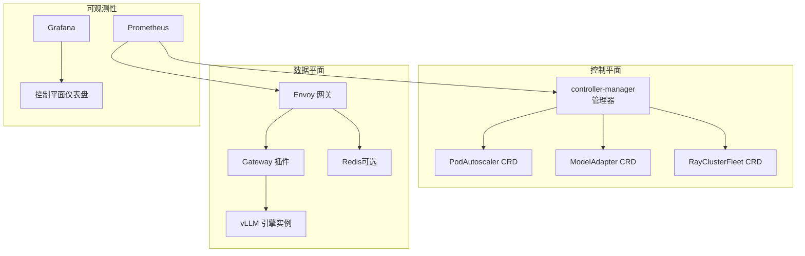
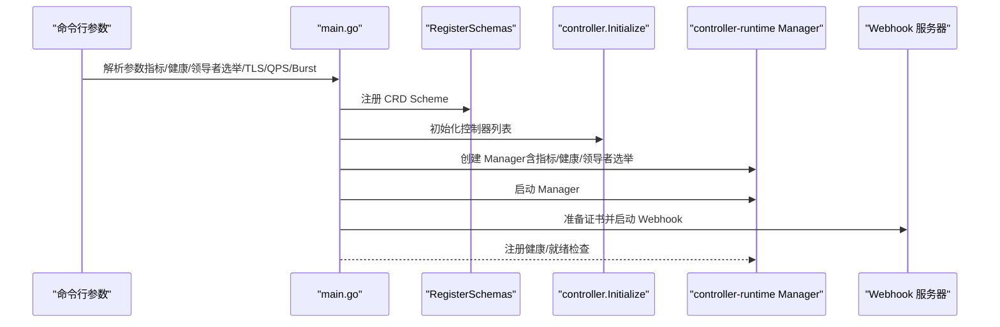
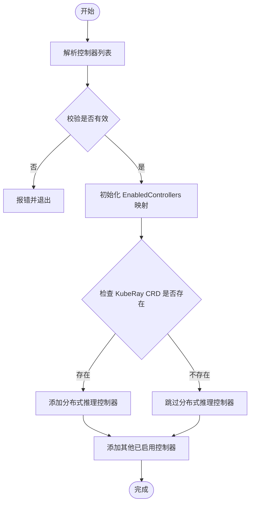
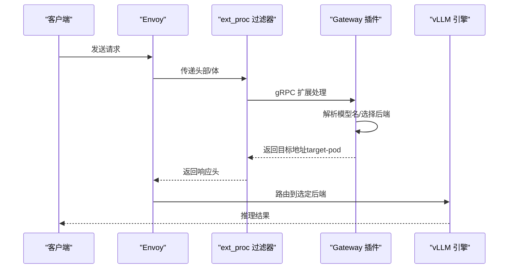
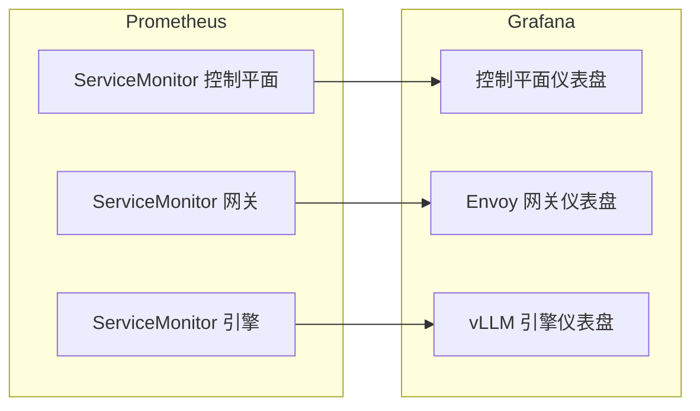
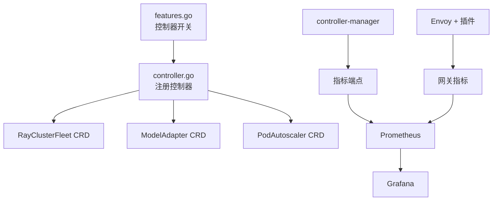

# 最佳实践

<cite>
**本文引用的文件**
- [README.md](file://README.md)
- [docs/source/index.rst](file://docs/source/index.rst)
- [docs/source/production/observability.rst](file://docs/source/production/observability.rst)
- [cmd/controllers/main.go](file://cmd/controllers/main.go)
- [cmd/console/main.go](file://cmd/console/main.go)
- [pkg/controller/controller.go](file://pkg/controller/controller.go)
- [pkg/config/config.go](file://pkg/config/config.go)
- [pkg/features/features.go](file://pkg/features/features.go)
- [config/crd/autoscaling/autoscaling.aibrix.ai_podautoscalers.yaml](file://config/crd/autoscaling/autoscaling.aibrix.ai_podautoscalers.yaml)
- [config/crd/model/model.aibrix.ai_modeladapters.yaml](file://config/crd/model/model.aibrix.ai_modeladapters.yaml)
- [config/crd/orchestration/orchestration.aibrix.ai_rayclusterfleets.yaml](file://config/crd/orchestration/orchestration.aibrix.ai_rayclusterfleets.yaml)
- [config/manager/manager.yaml](file://config/manager/manager.yaml)
- [observability/grafana/AIBrix_Control_Plane_Runtime_Dashboard.json](file://observability/grafana/AIBrix_Control_Plane_Runtime_Dashboard.json)
- [benchmarks/README.md](file://benchmarks/README.md)
- [deployment/local/README.md](file://deployment/local/README.md)
- [deployment/standalone/README.md](file://deployment/standalone/README.md)
- [development/README.md](file://development/README.md)
</cite>

## 目录
1. [简介](#简介)
2. [项目结构](#项目结构)
3. [核心组件](#核心组件)
4. [架构总览](#架构总览)
5. [详细组件分析](#详细组件分析)
6. [依赖关系分析](#依赖关系分析)
7. [性能考量](#性能考量)
8. [故障排查指南](#故障排查指南)
9. [结论](#结论)
10. [附录](#附录)

## 简介
本指南面向在生产环境中使用 AIBrix 的工程团队与平台工程师，系统总结从安装部署到运维监控、性能优化、安全加固、容量规划与成本控制、故障处理与升级迁移的最佳实践。文档覆盖小规模测试环境、中型企业部署、大规模生产集群等不同规模与类型的场景，并提供可操作的配置策略、基准测试方法与常见陷阱规避建议。

## 项目结构
AIBrix 采用云原生分层架构：控制平面（controller-manager）通过 CRD 扩展 Kubernetes 资源，管理推理工作负载；数据面由网关（Envoy + gateway 插件）与引擎（如 vLLM）组成；可观测性通过 Prometheus/Grafana 提供仪表盘；同时提供本地模式与 Docker Compose 单机模式用于开发与验证。



图示来源
- [cmd/controllers/main.go:112-360](file://cmd/controllers/main.go#L112-L360)
- [config/crd/autoscaling/autoscaling.aibrix.ai_podautoscalers.yaml:1-198](file://config/crd/autoscaling/autoscaling.aibrix.ai_podautoscalers.yaml#L1-L198)
- [config/crd/model/model.aibrix.ai_modeladapters.yaml:1-160](file://config/crd/model/model.aibrix.ai_modeladapters.yaml#L1-L160)
- [config/crd/orchestration/orchestration.aibrix.ai_rayclusterfleets.yaml:1-800](file://config/crd/orchestration/orchestration.aibrix.ai_rayclusterfleets.yaml#L1-L800)
- [config/manager/manager.yaml:1-87](file://config/manager/manager.yaml#L1-L87)
- [docs/source/production/observability.rst:1-72](file://docs/source/production/observability.rst#L1-L72)

章节来源
- [README.md:1-90](file://README.md#L1-L90)
- [docs/source/index.rst:1-84](file://docs/source/index.rst#L1-L84)

## 核心组件
- 控制器管理器（controller-manager）
  - 支持多控制器开关与动态启用/禁用，具备健康检查与就绪检查端点，支持指标与 Webhook 安全配置。
  - 关键参数：指标绑定地址、健康探针地址、领导者选举、资源锁类型、并发控制器数量等。
- 自定义资源定义（CRD）
  - PodAutoscaler、ModelAdapter、RayClusterFleet 等，分别对应弹性伸缩、模型适配与分布式推理编排。
- 数据平面
  - Envoy + gateway 插件负责路由与扩展处理；vLLM 作为推理引擎；可选 Redis 用于限流等状态存储。
- 可观测性
  - 预置 Grafana 仪表盘与 ServiceMonitor 配置，覆盖控制平面、网关与引擎指标。

章节来源
- [cmd/controllers/main.go:112-360](file://cmd/controllers/main.go#L112-L360)
- [pkg/controller/controller.go:48-130](file://pkg/controller/controller.go#L48-L130)
- [pkg/features/features.go:24-120](file://pkg/features/features.go#L24-L120)
- [config/crd/autoscaling/autoscaling.aibrix.ai_podautoscalers.yaml:1-198](file://config/crd/autoscaling/autoscaling.aibrix.ai_podautoscalers.yaml#L1-L198)
- [config/crd/model/model.aibrix.ai_modeladapters.yaml:1-160](file://config/crd/model/model.aibrix.ai_modeladapters.yaml#L1-L160)
- [config/crd/orchestration/orchestration.aibrix.ai_rayclusterfleets.yaml:1-800](file://config/crd/orchestration/orchestration.aibrix.ai_rayclusterfleets.yaml#L1-L800)
- [docs/source/production/observability.rst:1-72](file://docs/source/production/observability.rst#L1-L72)

## 架构总览
下图展示 AIBrix 在生产环境中的典型部署形态：控制平面通过 CRD 管理资源，数据平面通过网关进行请求接入与路由，引擎侧承载推理任务，Prometheus/Grafana 提供统一观测。

```mermaid
graph TB
subgraph "客户端"
APP["应用/SDK"]
end
subgraph "入口层"
EG["Envoy 入口"]
EXT["ext_proc 过滤器"]
GP["Gateway 插件"]
end
subgraph "控制平面"
K8S["Kubernetes API"]
CM["controller-manager"]
CRD["CRD/自定义资源"]
end
subgraph "推理引擎"
VLLM1["vLLM 实例 A"]
VLLM2["vLLM 实例 B"]
REDIS["Redis可选"]
end
subgraph "监控"
PROM["Prometheus"]
GRAF["Grafana"]
end
APP --> EG
EG --> EXT --> GP
GP --> VLLM1
GP --> VLLM2
GP --> REDIS
K8S <- --> CM
CM --> CRD
PROM --> CM
PROM --> EG
GRAF --> PROM
```

图示来源
- [deployment/standalone/README.md:63-108](file://deployment/standalone/README.md#L63-L108)
- [deployment/local/README.md:12-29](file://deployment/local/README.md#L12-L29)
- [docs/source/production/observability.rst:18-72](file://docs/source/production/observability.rst#L18-L72)

## 详细组件分析

### 控制器管理器（controller-manager）
- 启动流程
  - 解析命令行参数（指标、健康探针、领导者选举、Webhook TLS、Kubernetes API QPS/Burst 等）。
  - 注册 CRD Scheme 并初始化控制器集合。
  - 启动 Manager，注册健康/就绪检查，等待证书准备后启动 Webhook。
- 安全与高可用
  - 默认禁用 HTTP/2 或显式关闭以规避相关漏洞；支持资源锁类型与租约时长配置。
  - 支持领导者选举，确保单实例写一致性。
- 运行时配置
  - RuntimeConfig 支持启用运行时 Sidecar、调试模式与调度策略名称。



图示来源
- [cmd/controllers/main.go:112-360](file://cmd/controllers/main.go#L112-L360)
- [pkg/config/config.go:19-42](file://pkg/config/config.go#L19-L42)

章节来源
- [cmd/controllers/main.go:112-360](file://cmd/controllers/main.go#L112-L360)
- [pkg/config/config.go:19-42](file://pkg/config/config.go#L19-L42)

### 控制器注册与特性开关
- 特性开关
  - 通过逗号分隔列表启用/禁用控制器，支持通配符“*”启用全部。
  - 有效控制器包括 PodAutoscaler、ModelAdapter、DistributedInference、ModelRoute、KVCache、StormService。
- 注册逻辑
  - 按需注册 CRD 与控制器；若缺少 KubeRay CRD，则跳过分布式推理控制器。



图示来源
- [pkg/features/features.go:48-120](file://pkg/features/features.go#L48-L120)
- [pkg/controller/controller.go:48-130](file://pkg/controller/controller.go#L48-L130)

章节来源
- [pkg/features/features.go:24-120](file://pkg/features/features.go#L24-L120)
- [pkg/controller/controller.go:48-130](file://pkg/controller/controller.go#L48-L130)

### 网关与路由（Envoy + gateway 插件）
- 本地模式
  - 无需 Kubernetes，直接以进程方式运行 Envoy 与 gateway 插件，静态 endpoints 配置直连 vLLM。
  - 支持多种路由算法（随机、轮询、最少连接、前缀缓存感知等）。
- Docker Compose 单机模式
  - 提供 OpenAI 兼容 API、Envoy 代理、vLLM 引擎、元数据服务与 Redis 的一键部署。
  - 支持 P/D 解耦（Prefill/Decode 分离）以提升多 GPU 利用率。



图示来源
- [deployment/local/README.md:12-29](file://deployment/local/README.md#L12-L29)
- [deployment/standalone/README.md:63-108](file://deployment/standalone/README.md#L63-L108)

章节来源
- [deployment/local/README.md:12-29](file://deployment/local/README.md#L12-L29)
- [deployment/standalone/README.md:63-108](file://deployment/standalone/README.md#L63-L108)

### 可观测性与监控
- 前提条件
  - 集群需安装 kube-prometheus-stack，提供 Prometheus、Grafana 与 ServiceMonitor CRD。
- 启用步骤
  - 控制平面：默认暴露指标端点，按需部署 ServiceMonitor。
  - 网关：除 ServiceMonitor 外，还需辅助指标服务暴露 Envoy admin 接口统计。
  - 引擎：提供 ServiceMonitor 示例，可根据实际模型服务调整。
- 仪表盘
  - 提供控制平面、Envoy 网关、vLLM 引擎三类预置 Grafana 仪表盘，便于观察吞吐、延迟、错误率等关键指标。



图示来源
- [docs/source/production/observability.rst:18-72](file://docs/source/production/observability.rst#L18-L72)
- [observability/grafana/AIBrix_Control_Plane_Runtime_Dashboard.json:1-200](file://observability/grafana/AIBrix_Control_Plane_Runtime_Dashboard.json#L1-L200)

章节来源
- [docs/source/production/observability.rst:18-72](file://docs/source/production/observability.rst#L18-L72)

### 性能基准与分析
- 组件构成
  - 数据集生成（合成/会话/外部 Trace 转换）、工作负载生成（恒定/波动/统计/真实 Trace）、基准客户端（批量/流式）、分析器（吞吐、TTFT/TPOT 等）。
- 使用建议
  - 通过 config.yaml 统一配置各阶段参数，先生成数据集与工作负载，再执行客户端压测，最后进行分析输出。
  - 流式客户端支持 TTFT/TPOT 等细粒度指标，便于评估首字节延迟与后续吞吐表现。

章节来源
- [benchmarks/README.md:1-431](file://benchmarks/README.md#L1-L431)

## 依赖关系分析
- 控制器与 CRD
  - 控制器根据特性开关注册，若缺少相应 CRD（如 KubeRay），则跳过相关控制器。
- 控制平面与数据平面
  - 控制平面通过 CRD 编排资源；数据平面通过网关插件与引擎交互。
- 可观测性
  - 控制平面与网关均暴露指标端点，Prometheus 抓取后由 Grafana 展示。



图示来源
- [pkg/features/features.go:24-120](file://pkg/features/features.go#L24-L120)
- [pkg/controller/controller.go:48-130](file://pkg/controller/controller.go#L48-L130)
- [config/crd/orchestration/orchestration.aibrix.ai_rayclusterfleets.yaml:1-800](file://config/crd/orchestration/orchestration.aibrix.ai_rayclusterfleets.yaml#L1-L800)
- [config/crd/model/model.aibrix.ai_modeladapters.yaml:1-160](file://config/crd/model/model.aibrix.ai_modeladapters.yaml#L1-L160)
- [config/crd/autoscaling/autoscaling.aibrix.ai_podautoscalers.yaml:1-198](file://config/crd/autoscaling/autoscaling.aibrix.ai_podautoscalers.yaml#L1-L198)
- [config/manager/manager.yaml:60-87](file://config/manager/manager.yaml#L60-L87)

章节来源
- [pkg/features/features.go:24-120](file://pkg/features/features.go#L24-L120)
- [pkg/controller/controller.go:48-130](file://pkg/controller/controller.go#L48-L130)

## 性能考量
- 控制平面
  - 合理设置领导者选举租约时长与续租期限，避免频繁切换导致控制抖动。
  - 限制指标与 Webhook 的并发与 TLS 协议版本，降低握手开销与安全风险。
- 数据平面
  - 路由策略选择应结合缓存命中与后端负载，优先采用前缀缓存感知或最少连接策略。
  - 对于多 GPU 场景，考虑 P/D 解耦以提升 KV 与生成阶段并行度。
- 压测与基线
  - 使用基准工具链生成真实流量模式，关注 TTFT/TPOT、P95/P99 延迟与吞吐曲线，建立回归基线。

章节来源
- [cmd/controllers/main.go:132-253](file://cmd/controllers/main.go#L132-L253)
- [deployment/standalone/README.md:87-108](file://deployment/standalone/README.md#L87-L108)
- [benchmarks/README.md:1-431](file://benchmarks/README.md#L1-L431)

## 故障排查指南
- 控制平面
  - Webhook 未就绪：确认证书生成完成后再启动控制器；检查健康/就绪探针返回。
  - CRD 未安装：控制器对缺失 CRD 将执行 no-op，需安装对应 CRD 或禁用相关控制器。
- 网关与路由
  - “无健康上游”：检查 endpoints 配置与后端可达性。
  - ext_proc gRPC 错误：检查 gateway 插件日志与进程状态。
  - Envoy 启动失败：检查端口占用与配置文件。
- 单机与本地模式
  - Docker Compose：查看各容器日志与资源使用；确认 GPU 访问权限与驱动版本。
  - 本地模式：核对 /etc/hosts 解析与端口映射。

章节来源
- [cmd/controllers/main.go:287-312](file://cmd/controllers/main.go#L287-L312)
- [pkg/controller/controller.go:111-130](file://pkg/controller/controller.go#L111-L130)
- [deployment/local/README.md:186-195](file://deployment/local/README.md#L186-L195)
- [deployment/standalone/README.md:210-270](file://deployment/standalone/README.md#L210-L270)

## 结论
AIBrix 在生产环境中强调“控制平面集中编排、数据平面高效路由与推理”的分层设计。通过严格的特性开关、可观测性与基准测试体系，可在不同规模与场景下实现稳定、可扩展与可运营的 GenAI 推理基础设施。建议在上线前完成压测与容量规划，并持续完善监控与告警策略。

## 附录

### 不同规模与类型部署场景的配置策略
- 小规模测试环境
  - 使用本地模式或 Docker Compose，快速验证路由与推理链路；禁用不必要的控制器，减少资源占用。
- 中型企业部署
  - 基于 Kubernetes 部署，启用控制平面与网关；按需开启分布式推理与 KV Cache 控制器；配置 Prometheus/Grafana 观测。
- 大规模生产集群
  - 强化领导者选举与资源锁配置；启用 P/D 解耦与多副本；完善 SLA 与弹性伸缩策略；定期进行压测与容量评估。

章节来源
- [deployment/local/README.md:1-195](file://deployment/local/README.md#L1-L195)
- [deployment/standalone/README.md:1-397](file://deployment/standalone/README.md#L1-L397)
- [development/README.md:16-147](file://development/README.md#L16-L147)

### 容量规划与成本控制
- 容量规划
  - 基于基准测试的 QPS/延迟曲线确定副本数与资源配额；结合 TTFT/TPOT 评估首屏体验。
- 成本控制
  - 采用异构 GPU 推理与 P/D 解耦，提升设备利用率；通过弹性伸缩与多策略路由平衡峰值与空闲时段。

章节来源
- [benchmarks/README.md:1-431](file://benchmarks/README.md#L1-L431)
- [deployment/standalone/README.md:87-108](file://deployment/standalone/README.md#L87-L108)

### 升级迁移的安全策略
- 升级路径
  - 采用滚动更新与金丝雀发布；在非高峰时段执行；保留旧版本回滚镜像与配置。
- 迁移策略
  - 逐步替换后端引擎实例，保持网关路由策略不变；迁移前后进行压测对比与指标回归。

章节来源
- [cmd/controllers/main.go:227-253](file://cmd/controllers/main.go#L227-L253)
- [deployment/standalone/README.md:384-397](file://deployment/standalone/README.md#L384-L397)