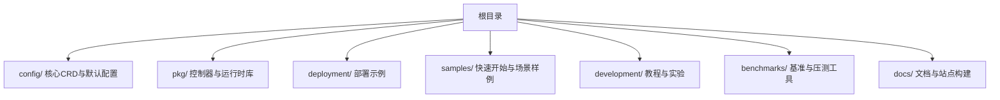
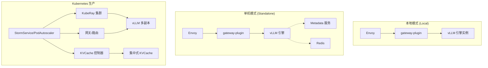
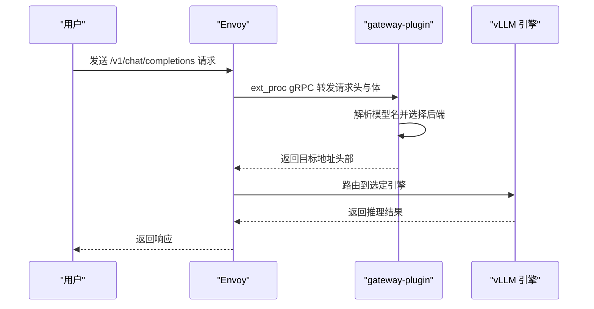
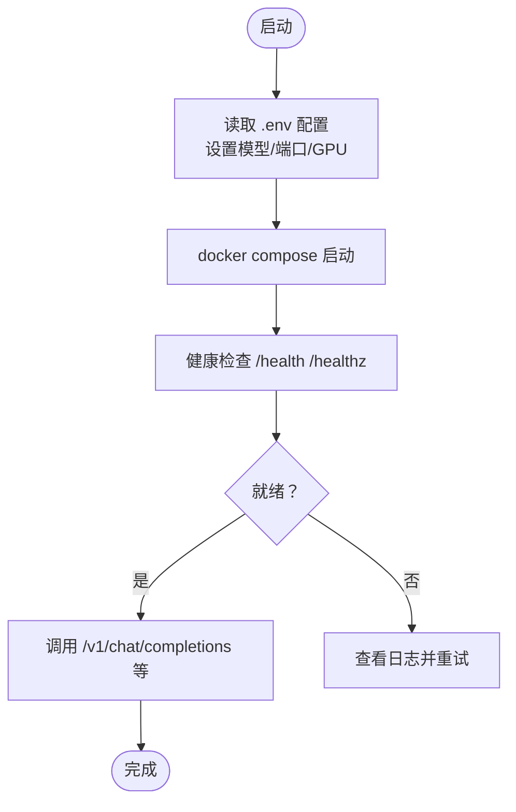
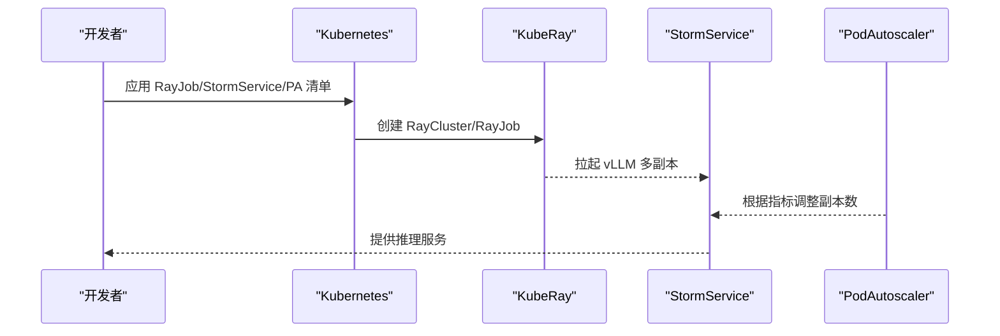
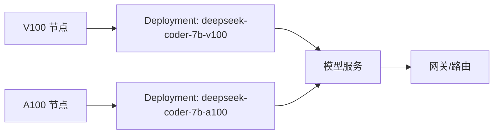
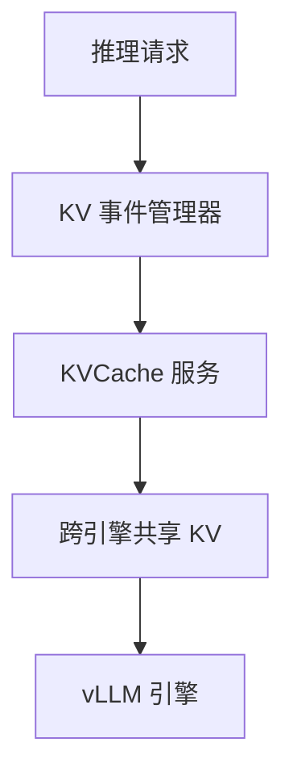
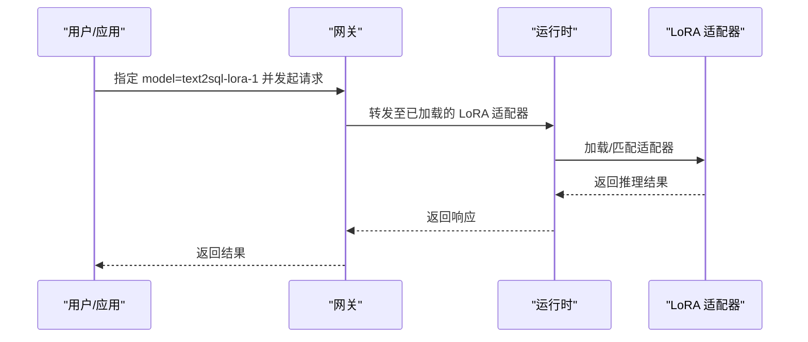
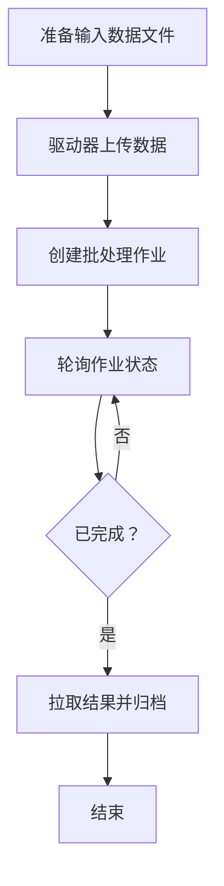
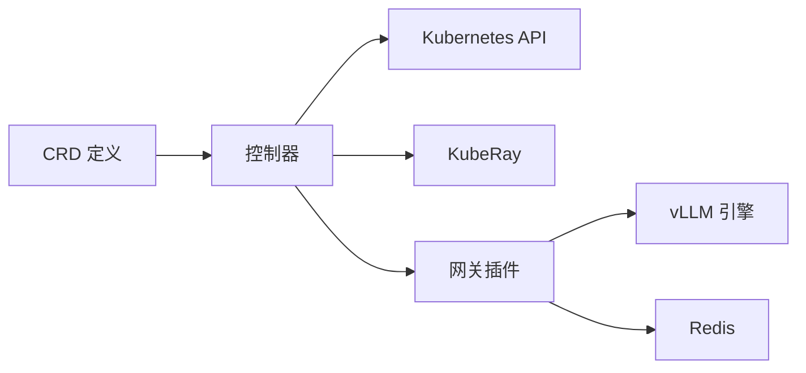

# 示例与教程

<cite>
**本文引用的文件**
- [README.md](file://README.md)
- [deployment/local/README.md](file://deployment/local/README.md)
- [deployment/standalone/README.md](file://deployment/standalone/README.md)
- [development/README.md](file://development/README.md)
- [development/tutorials/distributed/README.md](file://development/tutorials/distributed/README.md)
- [development/tutorials/lora/README.md](file://development/tutorials/lora/README.md)
- [development/tutorials/batch/README.md](file://development/tutorials/batch/README.md)
- [development/tutorials/kvcache/kvcache.yaml](file://development/tutorials/kvcache/kvcache.yaml)
- [samples/quickstart/model.yaml](file://samples/quickstart/model.yaml)
- [samples/quickstart/pd-model.yaml](file://samples/quickstart/pd-model.yaml)
- [samples/heterogeneous/deepseek-coder-7b-v100-deployment.yaml](file://samples/heterogeneous/deepseek-coder-7b-v100-deployment.yaml)
- [samples/autoscaling/stormservice-pool.yaml](file://samples/autoscaling/stormservice-pool.yaml)
- [benchmarks/config.yaml](file://benchmarks/config.yaml)
</cite>

## 目录
1. [简介](#简介)
2. [项目结构](#项目结构)
3. [核心组件](#核心组件)
4. [架构总览](#架构总览)
5. [详细组件分析](#详细组件分析)
6. [依赖关系分析](#依赖关系分析)
7. [性能考虑](#性能考虑)
8. [故障排除指南](#故障排除指南)
9. [结论](#结论)
10. [附录](#附录)

## 简介
本学习文档面向希望系统掌握 AIBrix 的开发者与运维工程师，提供从入门到高级的完整学习路径：快速开始示例、本地/单机部署、分布式推理、缓存优化、异构 GPU 服务、LoRA 微调、批处理 API、路由与限流策略、性能调优与可观测性等。文档以循序渐进的方式组织，既适合初学者快速上手，也为专家级用户提供深入配置与调优参考。

## 项目结构
AIBrix 仓库采用模块化与分层组织方式：
- 核心控制平面与 CRD 定义位于 config/ 与 pkg/，提供控制器、网关插件、缓存框架等能力
- 部署与示例位于 deployment/ 与 samples/，覆盖本地模式、Docker Compose 单机模式、Kubernetes 快速开始
- 教程与实验位于 development/tutorials/，涵盖分布式推理、LoRA、批处理、KV Cache 等专题
- 基准测试与工作负载生成位于 benchmarks/，支持数据集生成、工作负载合成与客户端压测
- 文档与站点构建位于 docs/，使用 Sphinx 构建静态网站

章节来源
- [README.md:1-90](file://README.md#L1-L90)

## 核心组件
- 网关与路由：Envoy + gateway-plugin，支持多种路由算法（随机、轮询、最少连接、前缀缓存感知等），并集成速率限制与指标导出
- 分布式推理：基于 KubeRay 的多节点 vLLM 推理池，支持 P/D 解耦与弹性扩缩容
- KV 缓存：集中式/去中心化 KV Cache，支持跨引擎复用与事件同步
- 自动扩缩容：PodAutoscaler 支持按队列长度、利用率等指标独立扩缩不同角色（prefill/decode）
- 异构 GPU 服务：通过节点亲和与资源标签，混合不同 GPU 类型进行成本优化
- 批处理 API：驱动器上传输入、提交作业、查询状态与拉取结果
- 运行时与模型适配：统一 AI Runtime 辅助模型下载、注册与生命周期管理

章节来源
- [README.md:28-40](file://README.md#L28-L40)
- [deployment/local/README.md:123-178](file://deployment/local/README.md#L123-L178)
- [deployment/standalone/README.md:109-160](file://deployment/standalone/README.md#L109-L160)
- [development/tutorials/distributed/README.md:1-70](file://development/tutorials/distributed/README.md#L1-L70)
- [development/tutorials/lora/README.md:1-100](file://development/tutorials/lora/README.md#L1-L100)
- [development/tutorials/batch/README.md:1-45](file://development/tutorials/batch/README.md#L1-L45)
- [development/tutorials/kvcache/kvcache.yaml:1-30](file://development/tutorials/kvcache/kvcache.yaml#L1-L30)
- [samples/autoscaling/stormservice-pool.yaml:1-121](file://samples/autoscaling/stormservice-pool.yaml#L1-L121)

## 架构总览
下图展示 AIBrix 在不同部署形态下的关键组件与交互关系，包括本地模式、单机 Docker Compose 以及生产级 Kubernetes 场景。

图表来源
- [deployment/local/README.md:14-27](file://deployment/local/README.md#L14-L27)
- [deployment/standalone/README.md:63-107](file://deployment/standalone/README.md#L63-L107)
- [development/tutorials/distributed/README.md:47-70](file://development/tutorials/distributed/README.md#L47-L70)

## 详细组件分析

### 快速开始：本地模式
- 适用场景：本地开发调试、单机验证、无容器开销
- 组件：Envoy + gateway-plugin（纯 Go，无 ZMQ 依赖）+ vLLM 引擎
- 关键点：通过 endpoints.yaml 配置后端地址；通过环境变量选择路由算法；支持 Prometheus 指标导出

图表来源
- [deployment/local/README.md:14-27](file://deployment/local/README.md#L14-L27)

章节来源
- [deployment/local/README.md:1-195](file://deployment/local/README.md#L1-L195)

### 快速开始：单机 Docker Compose
- 适用场景：开发测试、单 GPU/多 GPU 推理
- 组件：Envoy、vLLM、Metadata 服务、Redis
- 特性：P/D 解耦（Prefill/Decode 分离）、健康检查、指标端口、OpenAI 兼容 API

图表来源
- [deployment/standalone/README.md:14-61](file://deployment/standalone/README.md#L14-L61)

章节来源
- [deployment/standalone/README.md:1-397](file://deployment/standalone/README.md#L1-L397)

### 分布式部署：Kubernetes + KubeRay
- 适用场景：多节点、多 GPU、弹性扩缩容
- 关键点：镜像组合与 RayJob 配置；通过 StormService/RoleSet 管理 prefill/decode 角色；结合 PodAutoscaler 实现独立扩缩容

图表来源
- [development/tutorials/distributed/README.md:47-70](file://development/tutorials/distributed/README.md#L47-L70)
- [samples/autoscaling/stormservice-pool.yaml:74-121](file://samples/autoscaling/stormservice-pool.yaml#L74-L121)

章节来源
- [development/tutorials/distributed/README.md:1-70](file://development/tutorials/distributed/README.md#L1-L70)
- [samples/autoscaling/stormservice-pool.yaml:1-121](file://samples/autoscaling/stormservice-pool.yaml#L1-L121)

### 异构 GPU 服务
- 适用场景：混合不同 GPU 类型降低成本，同时保证 SLO
- 关键点：通过节点亲和与资源标签限定部署；结合自动扩缩容在不同 GPU 上动态分配

图表来源
- [samples/heterogeneous/deepseek-coder-7b-v100-deployment.yaml:28-100](file://samples/heterogeneous/deepseek-coder-7b-v100-deployment.yaml#L28-L100)

章节来源
- [samples/heterogeneous/deepseek-coder-7b-v100-deployment.yaml:1-172](file://samples/heterogeneous/deepseek-coder-7b-v100-deployment.yaml#L1-L172)

### KV Cache 与缓存优化
- 适用场景：大模型长上下文、高并发会话复用
- 关键点：集中式 KVCache（如 Vineyard）提升跨引擎复用率；事件同步保障一致性；可通过 affinities 与资源限制优化性能

图表来源
- [development/tutorials/kvcache/kvcache.yaml:1-30](file://development/tutorials/kvcache/kvcache.yaml#L1-L30)

章节来源
- [development/tutorials/kvcache/kvcache.yaml:1-30](file://development/tutorials/kvcache/kvcache.yaml#L1-L30)

### LoRA 微调与动态加载
- 适用场景：多租户/多任务场景下的轻量适配
- 关键点：通过 ModelAdapter 控制器与运行时 API 动态加载/卸载 LoRA；支持网关侧路由策略选择后端

图表来源
- [development/tutorials/lora/README.md:18-47](file://development/tutorials/lora/README.md#L18-L47)

章节来源
- [development/tutorials/lora/README.md:1-100](file://development/tutorials/lora/README.md#L1-L100)

### 批处理 API
- 适用场景：离线批量推理、大规模数据处理
- 关键流程：准备数据 -> 上传数据 -> 创建作业 -> 查询状态 -> 拉取结果

图表来源
- [development/tutorials/batch/README.md:3-45](file://development/tutorials/batch/README.md#L3-L45)

章节来源
- [development/tutorials/batch/README.md:1-45](file://development/tutorials/batch/README.md#L1-L45)

### 自定义路由算法与缓存策略
- 路由算法：随机、轮询、最少连接、前缀缓存感知等，可通过环境变量或配置切换
- 缓存策略：KV Cache 模式（集中式/去中心化）、前缀缓存索引、输出预测器减少重复计算
- 专家技巧：结合指标（队列长度、利用率）与速率限制，实现低抖动与高吞吐

章节来源
- [deployment/local/README.md:154-168](file://deployment/local/README.md#L154-L168)
- [deployment/standalone/README.md:350-368](file://deployment/standalone/README.md#L350-L368)

### 性能调优与基准测试
- 工具链：benchmarks/ 下的数据集生成、工作负载合成、客户端压测与分析
- 关键参数：并发会话、QPS、提示/生成长度分布、超时与重试策略、流式输出开关
- 输出指标：吞吐、延迟、有效吞吐（goodput）、会话轨迹分析

章节来源
- [benchmarks/config.yaml:1-114](file://benchmarks/config.yaml#L1-L114)

## 依赖关系分析
- 控制平面依赖：Kubernetes CRD、KubeRay Operator、Envoy Gateway 插件
- 运行时依赖：vLLM 引擎、Redis（可选）、Metadata 服务
- 开发与测试：Docker Compose、本地二进制、Mock 服务器

图表来源
- [development/README.md:88-94](file://development/README.md#L88-L94)
- [deployment/standalone/README.md:109-138](file://deployment/standalone/README.md#L109-L138)

章节来源
- [development/README.md:1-147](file://development/README.md#L1-L147)

## 性能考虑
- 资源规划：根据模型大小与上下文长度合理设置 GPU 内存利用率与最大上下文
- 网络与通信：启用 RDMA/UCX 等加速通道（视硬件与驱动支持），减少跨进程通信开销
- 调度与亲和：利用节点/拓扑亲和避免跨节点 NVLink 中断
- 缓存与预取：开启 KV Cache 与前缀缓存，结合输出预测器降低重复计算
- 扩缩容策略：针对 prefill/decode 角色分别设置扩缩容阈值与稳定窗口，避免频繁震荡

## 故障排除指南
- 本地模式
  - “无健康上游”：检查 endpoints.yaml 中引擎地址可达性
  - “ext_proc gRPC 错误”：确认 gateway-plugin 正常运行
  - Envoy 启动失败：排查端口冲突（10080/9901）
- 单机模式
  - GPU 未找到：检查驱动与容器工具包安装
  - 模型加载失败：查看 vLLM 日志、确认模型路径与显存
  - 连接错误：检查 Envoy 就绪与上游集群健康
  - 显存不足：降低 GPU 内存利用率或上下文长度
- 分布式模式
  - Ray/KubeRay 集群异常：检查 Head/Worker Pod 状态与网络策略
  - StormService/RoleSet 不生效：核对角色名称与选择器匹配
- 自动扩缩容
  - 指标不可用：确认引擎暴露 /metrics 端点与端口正确
  - 扩缩容不触发：检查 PodAutoscaler 的指标源与阈值

章节来源
- [deployment/local/README.md:186-195](file://deployment/local/README.md#L186-L195)
- [deployment/standalone/README.md:210-270](file://deployment/standalone/README.md#L210-L270)
- [development/tutorials/distributed/README.md:22-54](file://development/tutorials/distributed/README.md#L22-L54)

## 结论
AIBrix 提供从本地到生产的全栈 GenAI 推理基础设施方案。通过统一的网关、灵活的路由与扩缩容、可插拔的 KV Cache 与运行时，用户可在不同规模与复杂度场景中实现高性能、低成本与高可用的推理服务。建议从本地/单机模式起步，逐步过渡到分布式与生产级部署，并结合基准测试与可观测性持续优化。

## 附录
- 快速开始清单
  - 本地模式：安装 Go/Envoy，构建 gateway-plugin，启动 vLLM，验证 /v1/chat/completions
  - 单机模式：复制 .env，配置模型与 GPU，启动 Compose，验证 /health 与 /v1/models
  - 分布式模式：准备 KubeRay 集群，应用 StormService/PA，观察扩缩容行为
- 参考样例
  - 快速开始：[samples/quickstart/model.yaml](file://samples/quickstart/model.yaml)、[samples/quickstart/pd-model.yaml](file://samples/quickstart/pd-model.yaml)
  - 异构 GPU：[samples/heterogeneous/deepseek-coder-7b-v100-deployment.yaml](file://samples/heterogeneous/deepseek-coder-7b-v100-deployment.yaml)
  - 自动扩缩容：[samples/autoscaling/stormservice-pool.yaml](file://samples/autoscaling/stormservice-pool.yaml)
  - KV Cache：[development/tutorials/kvcache/kvcache.yaml](file://development/tutorials/kvcache/kvcache.yaml)
  - 基准配置：[benchmarks/config.yaml](file://benchmarks/config.yaml)