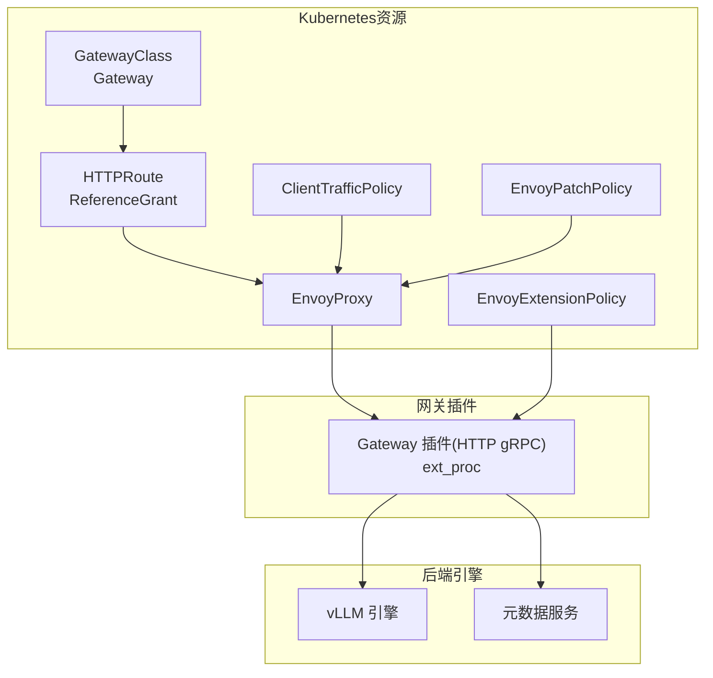
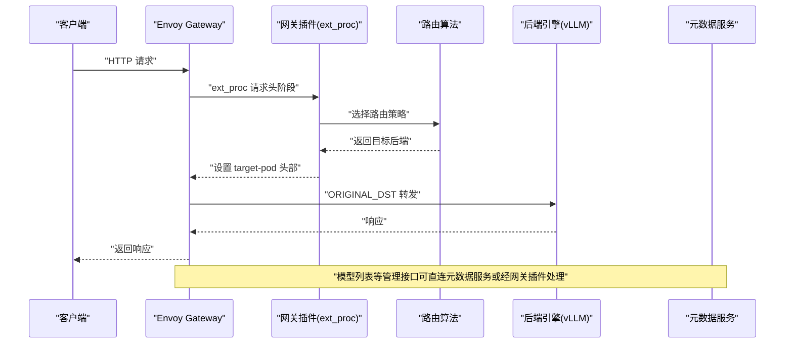
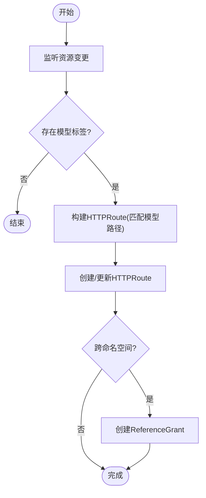
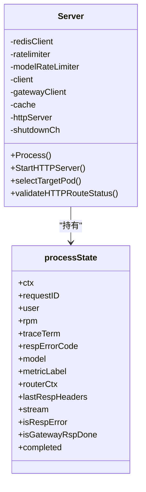
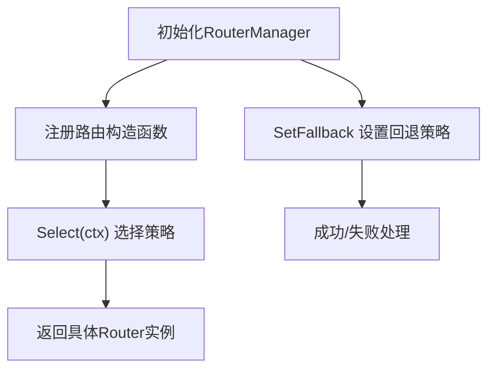
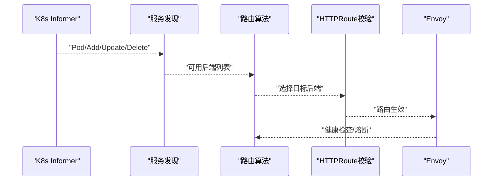
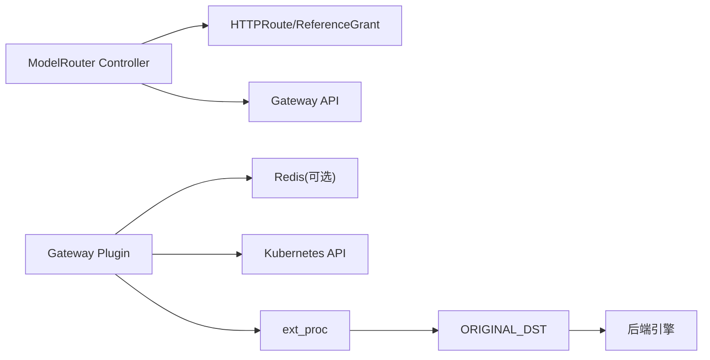

# AI网关集成

<cite>
**本文引用的文件**
- [config/gateway/gateway.yaml](file://config/gateway/gateway.yaml)
- [config/gateway/gateway-plugin/gateway-plugin.yaml](file://config/gateway/gateway-plugin/gateway-plugin.yaml)
- [deployment/local/configs/envoy.yaml](file://deployment/local/configs/envoy.yaml)
- [deployment/standalone/configs/envoy.yaml](file://deployment/standalone/configs/envoy.yaml)
- [samples/ai-gateway-integration/gateway.yaml](file://samples/ai-gateway-integration/gateway.yaml)
- [samples/ai-gateway-integration/aigatewayroute.yaml](file://samples/ai-gateway-integration/aigatewayroute.yaml)
- [pkg/plugins/gateway/gateway.go](file://pkg/plugins/gateway/gateway.go)
- [pkg/plugins/gateway/types.go](file://pkg/plugins/gateway/types.go)
- [pkg/plugins/gateway/algorithms/router.go](file://pkg/plugins/gateway/algorithms/router.go)
- [pkg/controller/modelrouter/modelrouter_controller.go](file://pkg/controller/modelrouter/modelrouter_controller.go)
- [pkg/cache/discovery/kubernetes.go](file://pkg/cache/discovery/kubernetes.go)
- [deployment/local/configs/endpoints.yaml](file://deployment/local/configs/endpoints.yaml)
- [deployment/standalone/configs/endpoints.yaml](file://deployment/standalone/configs/endpoints.yaml)
</cite>

## 目录
1. [简介](#简介)
2. [项目结构](#项目结构)
3. [核心组件](#核心组件)
4. [架构总览](#架构总览)
5. [详细组件分析](#详细组件分析)
6. [依赖关系分析](#依赖关系分析)
7. [性能考量](#性能考量)
8. [故障排查指南](#故障排查指南)
9. [结论](#结论)
10. [附录：配置模板与部署示例](#附录配置模板与部署示例)

## 简介
本指南面向企业级AI服务网关的高级部署与运维，围绕AIBrix AI网关集成系统，系统性阐述与Envoy Gateway的集成架构、路由配置、负载均衡策略与流量控制机制。文档覆盖以下关键主题：
- 基于Envoy Gateway的Kubernetes原生网关与扩展处理器（ext_proc）集成
- 网关路由规则、上游服务发现与健康检查
- 负载均衡与流量治理（速率限制、会话亲和、前缀缓存）
- 多场景集成方案：模型池化、边缘计算、多云部署
- 完整配置模板与部署步骤，支持本地开发、单机与生产集群

## 项目结构
本仓库中与AI网关集成直接相关的关键目录与文件如下：
- 配置层：Kubernetes GatewayClass/Gateway、EnvoyProxy、ClientTrafficPolicy、EnvoyPatchPolicy、EnvoyExtensionPolicy等
- 网关插件：gRPC扩展处理器，负责请求头/体处理、路由选择、速率限制、指标导出
- 路由算法：多种路由策略（最小请求数、最小延迟、前缀缓存、会话亲和、P/D解耦等）
- 控制器：自动为模型适配器/部署/射集群舰队生成HTTPRoute与ReferenceGrant
- 部署样例：本地与单机模式的Envoy配置、后端端点定义

图表来源
- [config/gateway/gateway.yaml:1-147](file://config/gateway/gateway.yaml#L1-L147)
- [config/gateway/gateway-plugin/gateway-plugin.yaml:1-227](file://config/gateway/gateway-plugin/gateway-plugin.yaml#L1-L227)
- [pkg/controller/modelrouter/modelrouter_controller.go:241-327](file://pkg/controller/modelrouter/modelrouter_controller.go#L241-L327)

章节来源
- [config/gateway/gateway.yaml:1-147](file://config/gateway/gateway.yaml#L1-L147)
- [config/gateway/gateway-plugin/gateway-plugin.yaml:1-227](file://config/gateway/gateway-plugin/gateway-plugin.yaml#L1-L227)
- [pkg/controller/modelrouter/modelrouter_controller.go:85-149](file://pkg/controller/modelrouter/modelrouter_controller.go#L85-L149)

## 核心组件
- 网关控制器（ModelRouter Controller）
  - 自动监听模型适配器、部署、射集群舰队等资源变更，为每个模型生成对应的HTTPRoute，并在跨命名空间时创建ReferenceGrant以允许从网关命名空间引用后端服务。
  - 支持自定义路径匹配，便于扩展非标准推理接口。
- 网关插件（Gateway Plugin）
  - 作为Envoy的外部处理器（ext_proc），在请求头阶段提取模型信息，在请求体阶段进行路由决策与速率限制，在响应头/体阶段回写目标后端地址（target-pod）并处理错误。
  - 提供HTTP服务器用于暴露/v1/models与指标端点。
- 路由算法（Routing Algorithms）
  - 提供多种路由策略注册与选择机制，支持随机、最小请求数、最小延迟、最小GPU/KV缓存占用、吞吐优先、会话亲和、VTc前缀缓存、P/D解耦等。
- 服务发现与健康检查
  - 通过Kubernetes Informer监听Pod与ModelAdapter事件，结合HTTPRoute状态校验，确保路由对象有效后再进行转发。
  - Envoy侧对后端集群配置健康检查与熔断参数。

章节来源
- [pkg/controller/modelrouter/modelrouter_controller.go:151-327](file://pkg/controller/modelrouter/modelrouter_controller.go#L151-L327)
- [pkg/plugins/gateway/gateway.go:62-121](file://pkg/plugins/gateway/gateway.go#L62-L121)
- [pkg/plugins/gateway/algorithms/router.go:41-153](file://pkg/plugins/gateway/algorithms/router.go#L41-L153)
- [pkg/cache/discovery/kubernetes.go:49-126](file://pkg/cache/discovery/kubernetes.go#L49-L126)

## 架构总览
下图展示了从客户端到后端引擎的完整链路：客户端请求经由GatewayClass/Gateway暴露的监听器进入Envoy；Envoy通过ext_proc调用网关插件，插件根据路由策略选择目标后端（通过target-pod头部），随后Envoy使用ORIGINAL_DST将请求转发至对应Pod。

图表来源
- [deployment/standalone/configs/envoy.yaml:152-176](file://deployment/standalone/configs/envoy.yaml#L152-L176)
- [pkg/plugins/gateway/gateway.go:333-360](file://pkg/plugins/gateway/gateway.go#L333-L360)
- [config/gateway/gateway-plugin/gateway-plugin.yaml:217-227](file://config/gateway/gateway-plugin/gateway-plugin.yaml#L217-L227)

## 详细组件分析

### 组件A：网关控制器（ModelRouter Controller）
职责与流程：
- 监听Deployment、ModelAdapter、RayClusterFleet等资源，按模型标签生成HTTPRoute，匹配常见推理路径（如/chat/completions、/embeddings等）。
- 将HTTPRoute绑定到指定Gateway（默认命名空间与名称），并在跨命名空间时创建ReferenceGrant。
- 支持通过注解追加自定义路径，增强兼容性。

图表来源
- [pkg/controller/modelrouter/modelrouter_controller.go:241-327](file://pkg/controller/modelrouter/modelrouter_controller.go#L241-L327)
- [pkg/controller/modelrouter/modelrouter_controller.go:329-369](file://pkg/controller/modelrouter/modelrouter_controller.go#L329-L369)

章节来源
- [pkg/controller/modelrouter/modelrouter_controller.go:151-327](file://pkg/controller/modelrouter/modelrouter_controller.go#L151-L327)
- [pkg/controller/modelrouter/modelrouter_controller.go:329-369](file://pkg/controller/modelrouter/modelrouter_controller.go#L329-L369)

### 组件B：网关插件（Gateway Plugin）
职责与流程：
- 作为ext_proc处理器，分阶段处理请求：请求头阶段提取模型与用户信息；请求体阶段执行路由与限流；响应头/体阶段回写目标后端并处理错误。
- 提供HTTP服务器，暴露/v1/models与/metrics端点；支持健康检查。
- 通过环境变量与配置文件控制路由算法、前缀缓存、超时等行为。

图表来源
- [pkg/plugins/gateway/gateway.go:62-121](file://pkg/plugins/gateway/gateway.go#L62-L121)
- [pkg/plugins/gateway/gateway.go:123-331](file://pkg/plugins/gateway/gateway.go#L123-L331)

章节来源
- [pkg/plugins/gateway/gateway.go:62-121](file://pkg/plugins/gateway/gateway.go#L62-L121)
- [pkg/plugins/gateway/gateway.go:123-331](file://pkg/plugins/gateway/gateway.go#L123-L331)
- [pkg/plugins/gateway/types.go:24-116](file://pkg/plugins/gateway/types.go#L24-L116)

### 组件C：路由算法（Router Manager）
职责与流程：
- 提供路由策略注册、选择与回退机制；初始化完成后锁定策略工厂，确保线程安全。
- 支持设置回退策略（当主策略不支持回退时抛出错误）。

图表来源
- [pkg/plugins/gateway/algorithms/router.go:41-153](file://pkg/plugins/gateway/algorithms/router.go#L41-L153)

章节来源
- [pkg/plugins/gateway/algorithms/router.go:41-153](file://pkg/plugins/gateway/algorithms/router.go#L41-L153)

### 组件D：服务发现与健康检查
- 服务发现：通过Kubernetes Informer监听Pod与ModelAdapter事件，建立模型到Pod的映射，支持过滤与洗牌。
- HTTPRoute状态校验：在非P/D路由算法下，验证HTTPRoute的Accepted与ResolvedRefs条件，确保路由生效后再转发。
- Envoy健康检查与熔断：为vLLM与元数据服务配置健康检查与熔断阈值，提升稳定性。

图表来源
- [pkg/cache/discovery/kubernetes.go:49-126](file://pkg/cache/discovery/kubernetes.go#L49-L126)
- [pkg/plugins/gateway/gateway.go:362-397](file://pkg/plugins/gateway/gateway.go#L362-L397)
- [deployment/standalone/configs/envoy.yaml:254-277](file://deployment/standalone/configs/envoy.yaml#L254-L277)

章节来源
- [pkg/cache/discovery/kubernetes.go:49-126](file://pkg/cache/discovery/kubernetes.go#L49-L126)
- [pkg/plugins/gateway/gateway.go:362-397](file://pkg/plugins/gateway/gateway.go#L362-L397)
- [deployment/standalone/configs/envoy.yaml:254-277](file://deployment/standalone/configs/envoy.yaml#L254-L277)

## 依赖关系分析
- 网关控制器依赖Gateway API（HTTPRoute/ReferenceGrant）与Kubernetes Informer，动态生成路由规则。
- 网关插件依赖Redis（可选）进行全局与模型级速率限制，依赖Kubernetes API查询HTTPRoute状态。
- Envoy侧依赖ext_proc与ORIGINAL_DST，结合Cluster健康检查与熔断策略。

图表来源
- [pkg/controller/modelrouter/modelrouter_controller.go:85-149](file://pkg/controller/modelrouter/modelrouter_controller.go#L85-L149)
- [pkg/plugins/gateway/gateway.go:94-121](file://pkg/plugins/gateway/gateway.go#L94-L121)
- [config/gateway/gateway-plugin/gateway-plugin.yaml:157-227](file://config/gateway/gateway-plugin/gateway-plugin.yaml#L157-L227)

章节来源
- [pkg/controller/modelrouter/modelrouter_controller.go:85-149](file://pkg/controller/modelrouter/modelrouter_controller.go#L85-L149)
- [pkg/plugins/gateway/gateway.go:94-121](file://pkg/plugins/gateway/gateway.go#L94-L121)
- [config/gateway/gateway-plugin/gateway-plugin.yaml:157-227](file://config/gateway/gateway-plugin/gateway-plugin.yaml#L157-L227)

## 性能考量
- 流式响应与超时
  - 启用HTTP流式传输以支持长文本生成；合理设置请求与空闲超时，避免长时间连接占用。
- 负载均衡与熔断
  - 对后端集群启用健康检查与熔断阈值，降低故障传播；在ORIGINAL_DST模式下，结合路由策略选择最优后端。
- 前缀缓存与会话亲和
  - 使用前缀缓存感知路由与VTc策略，减少重复计算；对需要保持会话一致性的场景使用会话亲和路由。
- 资源隔离与亲和
  - 通过节点与Pod反亲和策略避免网关与推理引擎在同一节点，降低资源争用。

章节来源
- [deployment/standalone/configs/envoy.yaml:46-48](file://deployment/standalone/configs/envoy.yaml#L46-L48)
- [deployment/standalone/configs/envoy.yaml:254-277](file://deployment/standalone/configs/envoy.yaml#L254-L277)
- [config/gateway/gateway.yaml:43-63](file://config/gateway/gateway.yaml#L43-L63)
- [pkg/plugins/gateway/algorithms/router.go:41-153](file://pkg/plugins/gateway/algorithms/router.go#L41-L153)

## 故障排查指南
- HTTPRoute未被接受
  - 检查HTTPRoute状态中的Accepted与ResolvedRefs条件；若为P/D路由算法，跳过HTTPRoute状态校验。
- 网关插件gRPC不可达
  - 确认ext_proc集群可达且健康检查通过；检查网关插件日志与指标端点。
- 路由目标为空或无就绪后端
  - 检查模型标签与后端Pod状态；确认服务发现已同步；必要时重试或调整过滤条件。
- 速率限制触发
  - 检查全局与模型级速率限制配置；核对请求头中的用户标识与模型标识是否正确。

章节来源
- [pkg/plugins/gateway/gateway.go:362-397](file://pkg/plugins/gateway/gateway.go#L362-L397)
- [pkg/plugins/gateway/gateway.go:474-507](file://pkg/plugins/gateway/gateway.go#L474-L507)
- [deployment/standalone/configs/envoy.yaml:200-206](file://deployment/standalone/configs/envoy.yaml#L200-L206)

## 结论
通过将Envoy Gateway与AIBrix网关插件深度集成，系统实现了基于Kubernetes原生API的统一入口、灵活的路由策略与强大的流量治理能力。结合自动化的HTTPRoute生成、服务发现与健康检查，可在本地、单机与多云环境下稳定运行，并支持模型池化、边缘计算等多种场景。

## 附录：配置模板与部署示例

### 1) Kubernetes网关与Envoy配置（标准部署）
- GatewayClass/Gateway：定义网关类与监听器
- EnvoyProxy：定义Envoy副本数、亲和与资源限制
- ClientTrafficPolicy/EnvoyPatchPolicy/EnvoyExtensionPolicy：扩展路由与目标集群配置

章节来源
- [config/gateway/gateway.yaml:1-147](file://config/gateway/gateway.yaml#L1-L147)

### 2) 网关插件与预留路由（HTTPRoute与ext_proc）
- Service/Deployment：网关插件服务与部署，包含探针与环境变量
- HTTPRoute（预留）：/v1/models等管理接口路由
- EnvoyExtensionPolicy：为特定HTTPRoute启用ext_proc，设置消息超时与请求/响应处理模式

章节来源
- [config/gateway/gateway-plugin/gateway-plugin.yaml:1-227](file://config/gateway/gateway-plugin/gateway-plugin.yaml#L1-L227)

### 3) 本地与单机Envoy配置
- 本地模式（bare-process）：Listener监听10080，ext_proc指向本地网关插件，ORIGINAL_DST读取target-pod
- 单机模式（Docker Compose）：各服务主机名解析，vLLM与元数据服务健康检查与熔断

章节来源
- [deployment/local/configs/envoy.yaml:1-155](file://deployment/local/configs/envoy.yaml#L1-L155)
- [deployment/standalone/configs/envoy.yaml:1-320](file://deployment/standalone/configs/envoy.yaml#L1-L320)

### 4) 端点配置
- 简单模式：直接列出后端引擎地址
- P/D解耦模式：按prefill/decode角色集划分

章节来源
- [deployment/local/configs/endpoints.yaml:1-33](file://deployment/local/configs/endpoints.yaml#L1-L33)
- [deployment/standalone/configs/endpoints.yaml:1-15](file://deployment/standalone/configs/endpoints.yaml#L1-L15)

### 5) AI Gateway Route（AIGatewayRoute）
- 基于自定义头部与API Key的多模型路由规则，指向InferencePool

章节来源
- [samples/ai-gateway-integration/aigatewayroute.yaml:1-39](file://samples/ai-gateway-integration/aigatewayroute.yaml#L1-L39)

### 6) 示例Gateway（Kubernetes）
- 最简Gateway定义，监听HTTP 80端口

章节来源
- [samples/ai-gateway-integration/gateway.yaml:1-20](file://samples/ai-gateway-integration/gateway.yaml#L1-L20)

### 7) 自动路由生成（控制器）
- 为模型适配器/部署/射集群舰队生成HTTPRoute与ReferenceGrant，支持自定义路径

章节来源
- [pkg/controller/modelrouter/modelrouter_controller.go:241-327](file://pkg/controller/modelrouter/modelrouter_controller.go#L241-L327)
- [pkg/controller/modelrouter/modelrouter_controller.go:329-369](file://pkg/controller/modelrouter/modelrouter_controller.go#L329-L369)