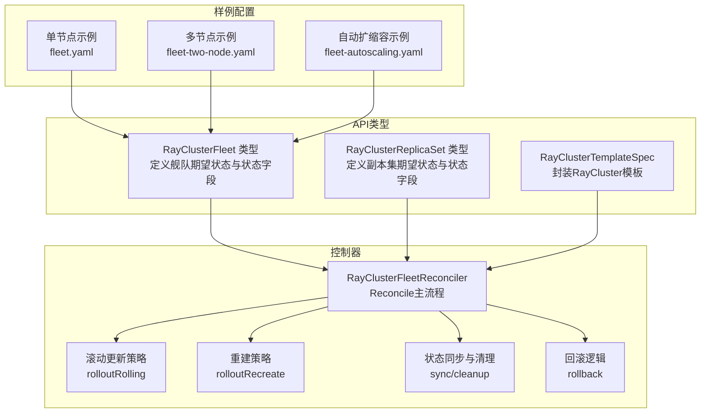
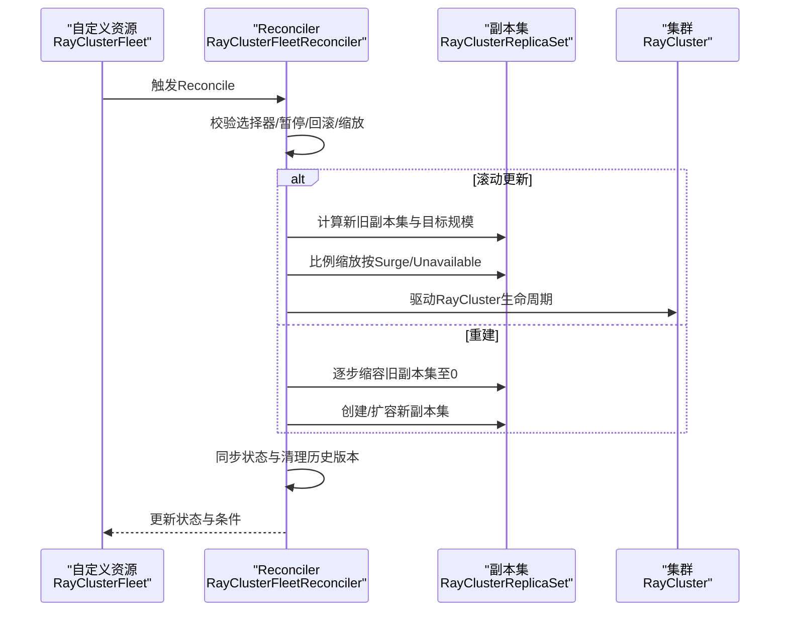
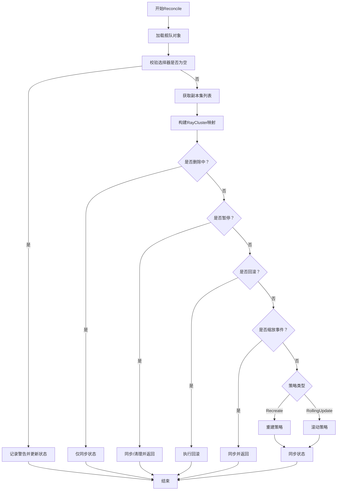
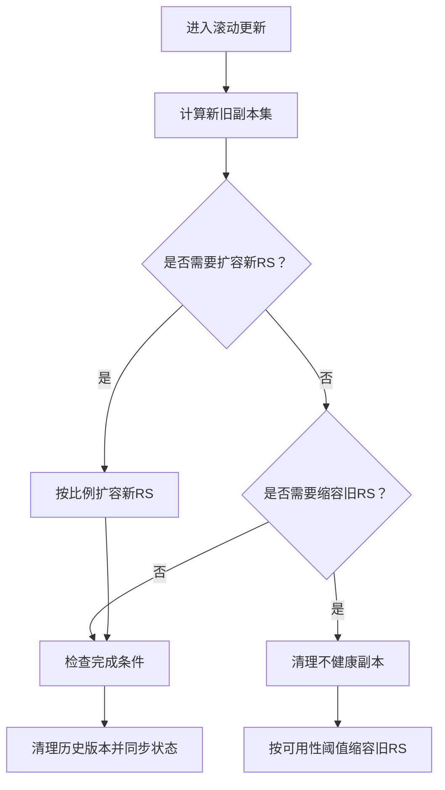
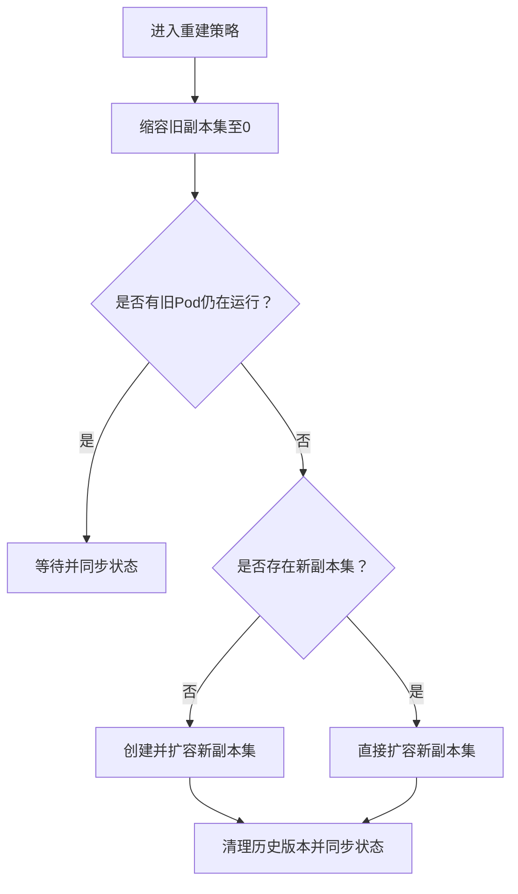
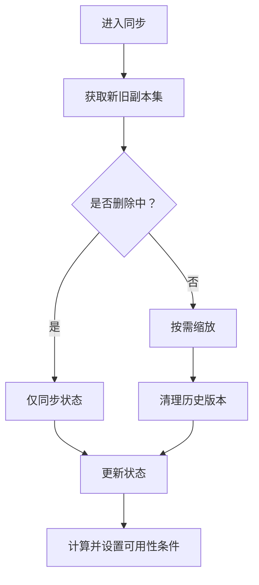
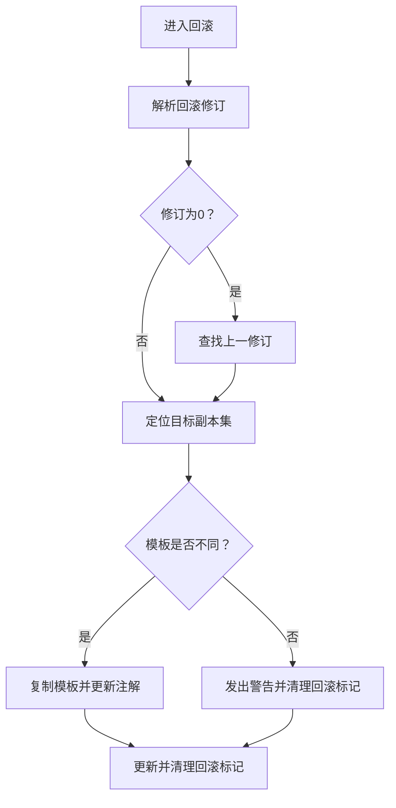
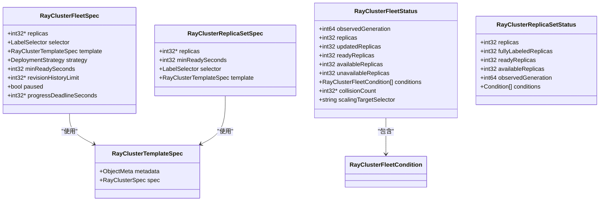
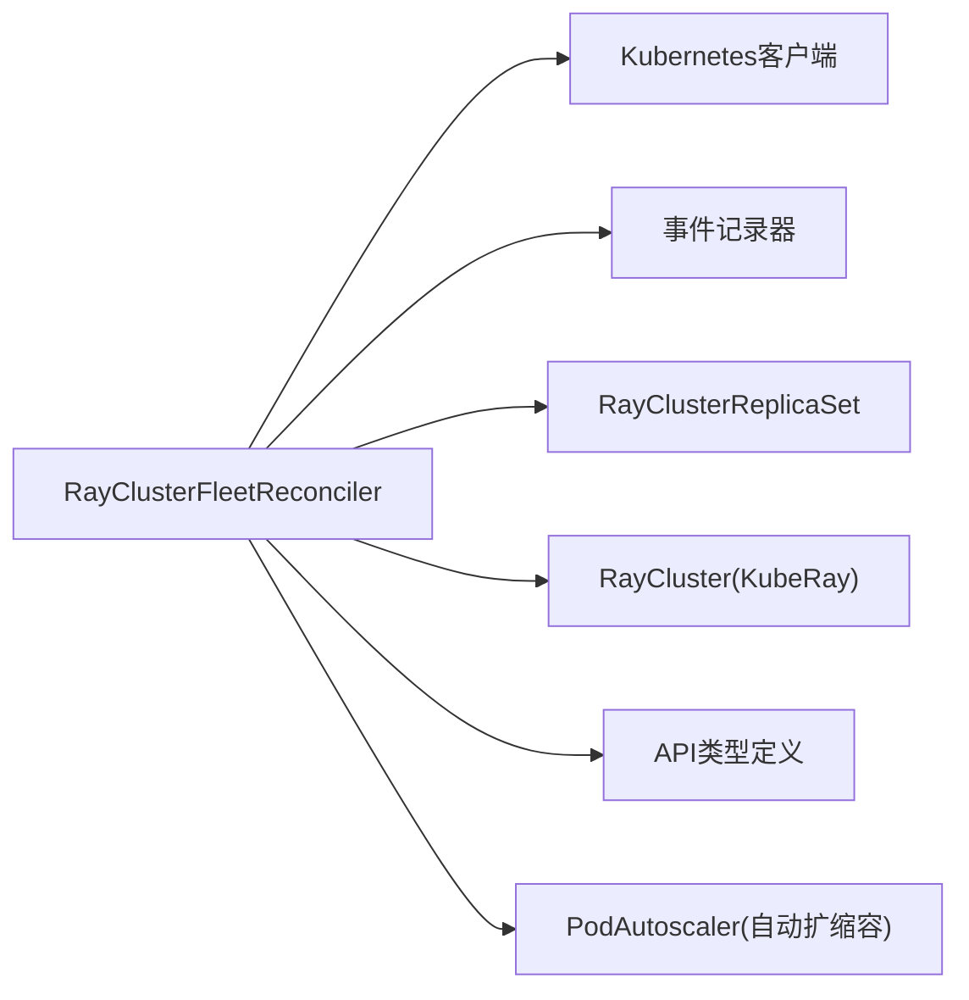

# RayCluster舰队编排

<cite>
**本文引用的文件**
- [rayclusterfleet_types.go](file://api/orchestration/v1alpha1/rayclusterfleet_types.go)
- [rayclusterreplicaset_types.go](file://api/orchestration/v1alpha1/rayclusterreplicaset_types.go)
- [raycluster_type.go](file://api/orchestration/v1alpha1/raycluster_type.go)
- [rayclusterfleet_controller.go](file://pkg/controller/rayclusterfleet/rayclusterfleet_controller.go)
- [rolling.go](file://pkg/controller/rayclusterfleet/rolling.go)
- [recreate.go](file://pkg/controller/rayclusterfleet/recreate.go)
- [sync.go](file://pkg/controller/rayclusterfleet/sync.go)
- [rollback.go](file://pkg/controller/rayclusterfleet/rollback.go)
- [rayclusterfleet.yaml](file://config/samples/orchestration_v1alpha1_rayclusterfleet.yaml)
- [fleet.yaml](file://samples/distributed/fleet.yaml)
- [fleet-two-node.yaml](file://samples/distributed/fleet-two-node.yaml)
- [fleet-autoscaling.yaml](file://development/tutorials/distributed/fleet-autoscaling.yaml)
</cite>

## 目录
1. [简介](#简介)
2. [项目结构](#项目结构)
3. [核心组件](#核心组件)
4. [架构总览](#架构总览)
5. [详细组件分析](#详细组件分析)
6. [依赖关系分析](#依赖关系分析)
7. [性能考量](#性能考量)
8. [故障排查指南](#故障排查指南)
9. [结论](#结论)
10. [附录](#附录)

## 简介
本技术文档围绕RayCluster舰队编排系统展开，重点解析RayClusterFleet控制器的工作原理、编排策略与资源管理机制。文档覆盖单节点与多节点集群配置差异（资源分配、网络拓扑、负载均衡）、YAML配置示例（节点调度、副本管理、滚动更新）、状态同步机制、故障检测与自动恢复策略，并结合实际部署案例给出性能优化建议（资源利用率、延迟与成本控制）。

## 项目结构
RayCluster舰队编排系统由API类型定义、控制器实现与样例配置三部分组成：
- API层：定义RayClusterFleet、RayClusterReplicaSet与模板规范
- 控制器层：实现Reconcile循环、滚动/重建策略、回滚与状态同步
- 样例层：提供单节点与多节点部署示例及自动扩缩容配置

**图表来源**
- [rayclusterfleet_types.go:27-119](file://api/orchestration/v1alpha1/rayclusterfleet_types.go#L27-L119)
- [rayclusterreplicaset_types.go:27-86](file://api/orchestration/v1alpha1/rayclusterreplicaset_types.go#L27-L86)
- [raycluster_type.go:24-34](file://api/orchestration/v1alpha1/raycluster_type.go#L24-L34)
- [rayclusterfleet_controller.go:106-183](file://pkg/controller/rayclusterfleet/rayclusterfleet_controller.go#L106-L183)
- [rolling.go:29-65](file://pkg/controller/rayclusterfleet/rolling.go#L29-L65)
- [recreate.go:30-77](file://pkg/controller/rayclusterfleet/recreate.go#L30-L77)
- [sync.go:48-70](file://pkg/controller/rayclusterfleet/sync.go#L48-L70)
- [rollback.go:32-72](file://pkg/controller/rayclusterfleet/rollback.go#L32-L72)
- [fleet.yaml:1-55](file://samples/distributed/fleet.yaml#L1-L55)
- [fleet-two-node.yaml:1-208](file://samples/distributed/fleet-two-node.yaml#L1-L208)
- [fleet-autoscaling.yaml:1-25](file://development/tutorials/distributed/fleet-autoscaling.yaml#L1-L25)

**章节来源**
- [rayclusterfleet_types.go:27-119](file://api/orchestration/v1alpha1/rayclusterfleet_types.go#L27-L119)
- [rayclusterreplicaset_types.go:27-86](file://api/orchestration/v1alpha1/rayclusterreplicaset_types.go#L27-L86)
- [raycluster_type.go:24-34](file://api/orchestration/v1alpha1/raycluster_type.go#L24-L34)
- [rayclusterfleet_controller.go:50-87](file://pkg/controller/rayclusterfleet/rayclusterfleet_controller.go#L50-L87)

## 核心组件
- RayClusterFleet：定义舰队的期望状态（副本数、选择器、模板、策略、最小可用秒数、历史版本限制、暂停标志、进度截止时间等），以及状态（观察代数、副本总数、已更新副本、就绪/可用/不可用副本、条件、碰撞计数、缩放目标选择器）。
- RayClusterReplicaSet：定义副本集的期望状态（副本数、最小就绪秒数、标签选择器、模板），以及状态（副本数、完全匹配副本、就绪/可用副本、观察代数、条件）。
- RayClusterTemplateSpec：封装RayCluster模板元数据与规范，作为舰队模板的核心载体。

这些类型共同构成舰队编排的“声明式模型”，控制器通过Reconcile循环将其转换为实际的RayCluster集群实例。

**章节来源**
- [rayclusterfleet_types.go:27-119](file://api/orchestration/v1alpha1/rayclusterfleet_types.go#L27-L119)
- [rayclusterreplicaset_types.go:27-86](file://api/orchestration/v1alpha1/rayclusterreplicaset_types.go#L27-L86)
- [raycluster_type.go:24-34](file://api/orchestration/v1alpha1/raycluster_type.go#L24-L34)

## 架构总览
控制器采用Reconcile主循环模式，按以下顺序执行：
- 读取并校验舰队对象
- 获取关联的副本集列表与RayCluster映射
- 处理删除、暂停、回滚、缩放事件
- 根据策略类型执行滚动或重建
- 同步状态并清理历史版本

**图表来源**
- [rayclusterfleet_controller.go:106-183](file://pkg/controller/rayclusterfleet/rayclusterfleet_controller.go#L106-L183)
- [rolling.go:29-65](file://pkg/controller/rayclusterfleet/rolling.go#L29-L65)
- [recreate.go:30-77](file://pkg/controller/rayclusterfleet/recreate.go#L30-L77)
- [sync.go:48-70](file://pkg/controller/rayclusterfleet/sync.go#L48-L70)

## 详细组件分析

### 组件A：Reconcile主流程与控制循环
- 负责读取舰队对象、校验非空选择器、获取副本集与RayCluster映射
- 判断暂停、回滚、缩放事件，分支到对应处理路径
- 默认根据策略类型执行滚动或重建
- 最终统一进行状态同步与历史版本清理

**图表来源**
- [rayclusterfleet_controller.go:106-183](file://pkg/controller/rayclusterfleet/rayclusterfleet_controller.go#L106-L183)

**章节来源**
- [rayclusterfleet_controller.go:106-183](file://pkg/controller/rayclusterfleet/rayclusterfleet_controller.go#L106-L183)

### 组件B：滚动更新策略
- 计算新旧副本集，按Surge/Unavailable策略比例缩放
- 先扩容新副本集至可接受的最大值，再按可用性阈值缩容旧副本集
- 清理不健康副本优先，避免可用性进一步下降
- 完成后清理历史版本并同步状态

**图表来源**
- [rolling.go:29-65](file://pkg/controller/rayclusterfleet/rolling.go#L29-L65)
- [rolling.go:85-151](file://pkg/controller/rayclusterfleet/rolling.go#L85-L151)
- [rolling.go:190-235](file://pkg/controller/rayclusterfleet/rolling.go#L190-L235)

**章节来源**
- [rolling.go:29-235](file://pkg/controller/rayclusterfleet/rolling.go#L29-L235)

### 组件C：重建策略
- 逐步将旧副本集缩容至0，等待无旧Pod运行
- 若无新副本集则创建并扩容至目标规模
- 完成后清理历史版本并同步状态

**图表来源**
- [recreate.go:30-77](file://pkg/controller/rayclusterfleet/recreate.go#L30-L77)
- [recreate.go:100-117](file://pkg/controller/rayclusterfleet/recreate.go#L100-L117)

**章节来源**
- [recreate.go:30-124](file://pkg/controller/rayclusterfleet/recreate.go#L30-L124)

### 组件D：状态同步与清理
- 同步仅在删除时进行状态更新，不进行变更操作
- 在暂停或缩放事件下进行比例缩放并更新状态
- 根据RevisionHistoryLimit清理历史副本集
- 计算可用/不可用副本，设置可用性条件

**图表来源**
- [sync.go:37-70](file://pkg/controller/rayclusterfleet/sync.go#L37-L70)
- [sync.go:450-488](file://pkg/controller/rayclusterfleet/sync.go#L450-L488)
- [sync.go:490-548](file://pkg/controller/rayclusterfleet/sync.go#L490-L548)

**章节来源**
- [sync.go:37-572](file://pkg/controller/rayclusterfleet/sync.go#L37-L572)

### 组件E：回滚机制
- 从所有副本集中查找指定修订版本
- 将舰队模板回滚到该副本集模板
- 清理回滚标记并更新状态

**图表来源**
- [rollback.go:32-72](file://pkg/controller/rayclusterfleet/rollback.go#L32-L72)
- [rollback.go:74-103](file://pkg/controller/rayclusterfleet/rollback.go#L74-L103)

**章节来源**
- [rollback.go:32-152](file://pkg/controller/rayclusterfleet/rollback.go#L32-L152)

### 组件F：类图（代码级）

**图表来源**
- [rayclusterfleet_types.go:27-119](file://api/orchestration/v1alpha1/rayclusterfleet_types.go#L27-L119)
- [rayclusterreplicaset_types.go:27-86](file://api/orchestration/v1alpha1/rayclusterreplicaset_types.go#L27-L86)
- [raycluster_type.go:24-34](file://api/orchestration/v1alpha1/raycluster_type.go#L24-L34)

## 依赖关系分析
- 控制器依赖Kubernetes客户端与事件记录器
- 与KubeRay的RayCluster类型协作，通过控制器引用建立所有权
- 与副本集管理器协作，按模板哈希生成唯一标签并维护修订历史
- 与自动扩缩容控制器协作，通过PodAutoscaler对舰队进行动态扩缩

**图表来源**
- [rayclusterfleet_controller.go:92-98](file://pkg/controller/rayclusterfleet/rayclusterfleet_controller.go#L92-L98)
- [rayclusterreplicaset_types.go:101-108](file://api/orchestration/v1alpha1/rayclusterreplicaset_types.go#L101-L108)
- [raycluster_type.go:19-34](file://api/orchestration/v1alpha1/raycluster_type.go#L19-L34)
- [fleet-autoscaling.yaml:1-25](file://development/tutorials/distributed/fleet-autoscaling.yaml#L1-L25)

**章节来源**
- [rayclusterfleet_controller.go:92-98](file://pkg/controller/rayclusterfleet/rayclusterfleet_controller.go#L92-L98)

## 性能考量
- 资源利用率
  - 合理设置CPU/GPU请求/限制，避免过度预留导致资源闲置
  - 使用多节点配置时，确保worker组规格与head组一致，避免调度不均
- 延迟优化
  - 滚动更新时启用合理的maxSurge/maxUnavailable，平衡可用性与吞吐
  - 通过自动扩缩容指标（如GPU缓存使用率）动态调整副本数
- 成本控制
  - 利用RevisionHistoryLimit限制历史版本数量，减少存储与查询开销
  - 在重建策略下先缩容旧副本集，避免同时运行多个版本造成资源浪费

[本节为通用指导，无需特定文件来源]

## 故障排查指南
- 选择器为空
  - 现象：控制器记录警告并跳过处理
  - 处理：为舰队配置非空选择器
- 暂停状态
  - 现象：进度条件被置为暂停/恢复
  - 处理：检查暂停标志与进度截止时间
- 回滚失败
  - 现象：无法找到目标修订或模板未变更
  - 处理：确认修订号与副本集模板一致性
- 可用性不足
  - 现象：可用副本数低于最低要求
  - 处理：检查Surge/Unavailable参数与节点资源

**章节来源**
- [rayclusterfleet_controller.go:125-137](file://pkg/controller/rayclusterfleet/rayclusterfleet_controller.go#L125-L137)
- [sync.go:72-103](file://pkg/controller/rayclusterfleet/sync.go#L72-L103)
- [rollback.go:42-71](file://pkg/controller/rayclusterfleet/rollback.go#L42-L71)
- [sync.go:539-545](file://pkg/controller/rayclusterfleet/sync.go#L539-L545)

## 结论
RayCluster舰队编排系统通过声明式API与控制器Reconcile循环实现了对RayCluster集群的高效编排。其滚动与重建策略兼顾可用性与性能，状态同步与回滚机制保障了运维可控性。结合自动扩缩容与合理的资源配置，可在保证低延迟与高可用的同时实现资源利用率与成本的优化。

[本节为总结，无需特定文件来源]

## 附录

### A. 单节点与多节点配置差异
- 单节点
  - 仅定义headGroupSpec，容器内启动Ray head与推理引擎
  - 资源集中在head节点，适合小规模推理
- 多节点
  - 定义headGroupSpec与workerGroupSpecs，支持横向扩展
  - 通过worker组实现分布式推理，提升吞吐与弹性

**章节来源**
- [fleet.yaml:24-55](file://samples/distributed/fleet.yaml#L24-L55)
- [fleet-two-node.yaml:26-143](file://samples/distributed/fleet-two-node.yaml#L26-L143)

### B. YAML配置示例与关键字段说明
- 基础舰队
  - 关键字段：replicas、selector、template、strategy
  - 示例参考：[rayclusterfleet.yaml:8-17](file://config/samples/orchestration_v1alpha1_rayclusterfleet.yaml#L8-L17)
- 单节点部署
  - 关键字段：headGroupSpec、容器命令与端口、资源请求/限制
  - 示例参考：[fleet.yaml:18-55](file://samples/distributed/fleet.yaml#L18-L55)
- 多节点部署
  - 关键字段：headGroupSpec、workerGroupSpecs、Service与HTTPRoute
  - 示例参考：[fleet-two-node.yaml:1-208](file://samples/distributed/fleet-two-node.yaml#L1-L208)
- 自动扩缩容
  - 关键字段：PodAutoscaler、指标来源与目标值、作用目标
  - 示例参考：[fleet-autoscaling.yaml:1-25](file://development/tutorials/distributed/fleet-autoscaling.yaml#L1-L25)

**章节来源**
- [rayclusterfleet.yaml:8-17](file://config/samples/orchestration_v1alpha1_rayclusterfleet.yaml#L8-L17)
- [fleet.yaml:18-55](file://samples/distributed/fleet.yaml#L18-L55)
- [fleet-two-node.yaml:1-208](file://samples/distributed/fleet-two-node.yaml#L1-L208)
- [fleet-autoscaling.yaml:1-25](file://development/tutorials/distributed/fleet-autoscaling.yaml#L1-L25)

### C. 编排策略与资源管理要点
- 滚动更新
  - Surge：允许超出目标副本数的额外副本
  - Unavailable：允许暂时不可用的副本数
  - 通过比例缩放平衡可用性与吞吐
- 重建
  - 先缩容旧副本集至0，再扩容新副本集
  - 适用于模板重大变更或需要完全替换的场景
- 副本管理
  - RevisionHistoryLimit：限制历史版本数量
  - MinReadySeconds：最小就绪秒数，确保稳定性
- 滚动更新与重建的切换
  - 依据fleet.spec.strategy.type选择策略
  - 回滚时清空回滚标记并应用目标模板

**章节来源**
- [sync.go:450-488](file://pkg/controller/rayclusterfleet/sync.go#L450-L488)
- [sync.go:490-548](file://pkg/controller/rayclusterfleet/sync.go#L490-L548)
- [rolling.go:29-65](file://pkg/controller/rayclusterfleet/rolling.go#L29-L65)
- [recreate.go:30-77](file://pkg/controller/rayclusterfleet/recreate.go#L30-L77)
- [rollback.go:113-151](file://pkg/controller/rayclusterfleet/rollback.go#L113-L151)

### D. 实际部署案例与优化建议
- 案例一：单节点Qwen-Coder推理
  - 使用单节点head，容器内启动Ray与推理服务
  - 资源：CPU/GPU按模型需求配置，端口暴露服务与仪表盘
  - 参考：[fleet.yaml:18-55](file://samples/distributed/fleet.yaml#L18-L55)
- 案例二：多节点Qwen-Coder推理
  - head负责协调，worker负责推理
  - Service与HTTPRoute提供统一入口与路由规则
  - 参考：[fleet-two-node.yaml:1-208](file://samples/distributed/fleet-two-node.yaml#L1-L208)
- 优化建议
  - 资源利用率：根据实际负载调整请求/限制，避免过度预留
  - 延迟优化：合理设置Surge/Unavailable，启用自动扩缩容以应对突发流量
  - 成本控制：清理历史版本，避免同时运行多个版本；在重建策略下先缩容旧副本集

**章节来源**
- [fleet.yaml:18-55](file://samples/distributed/fleet.yaml#L18-L55)
- [fleet-two-node.yaml:1-208](file://samples/distributed/fleet-two-node.yaml#L1-L208)
- [sync.go:450-488](file://pkg/controller/rayclusterfleet/sync.go#L450-L488)