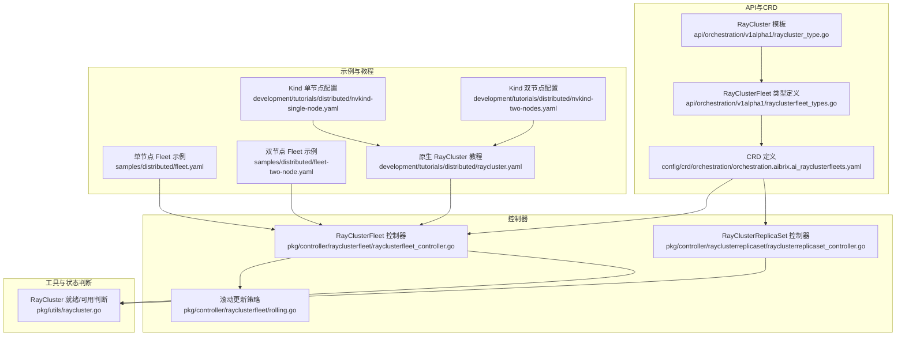
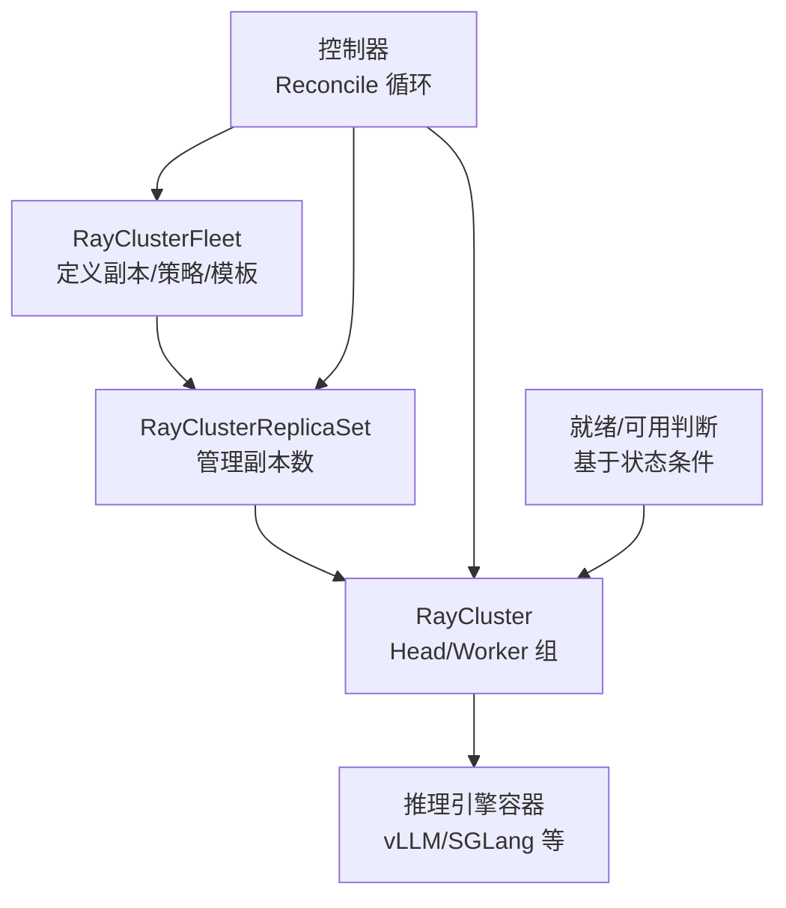
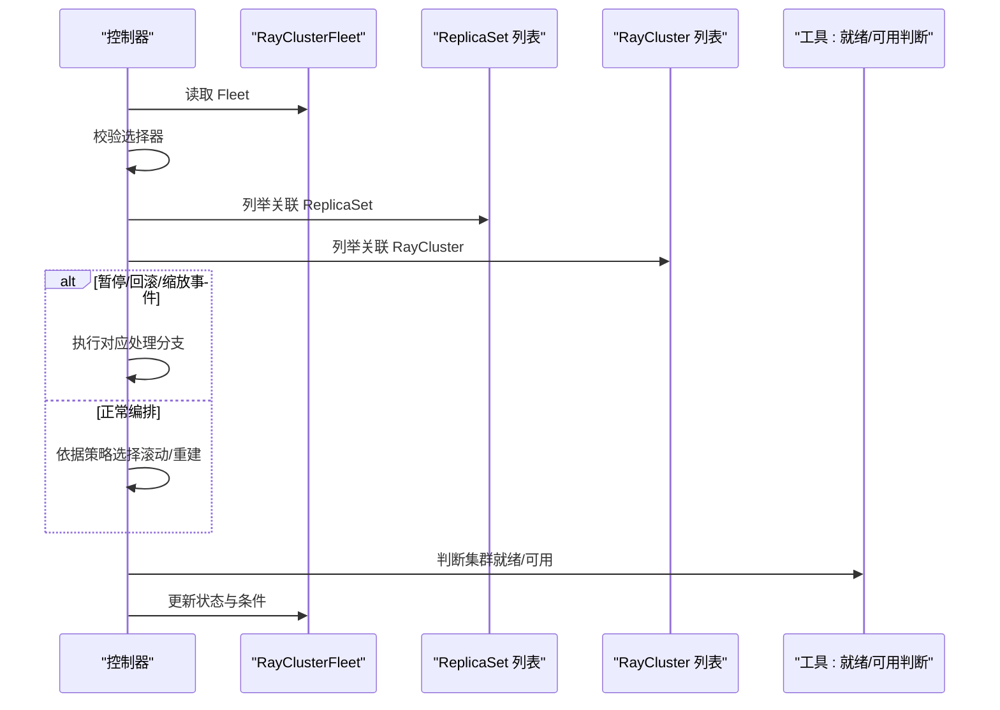
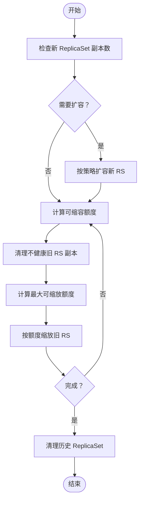
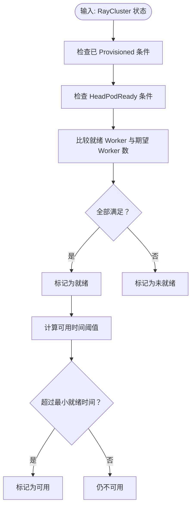
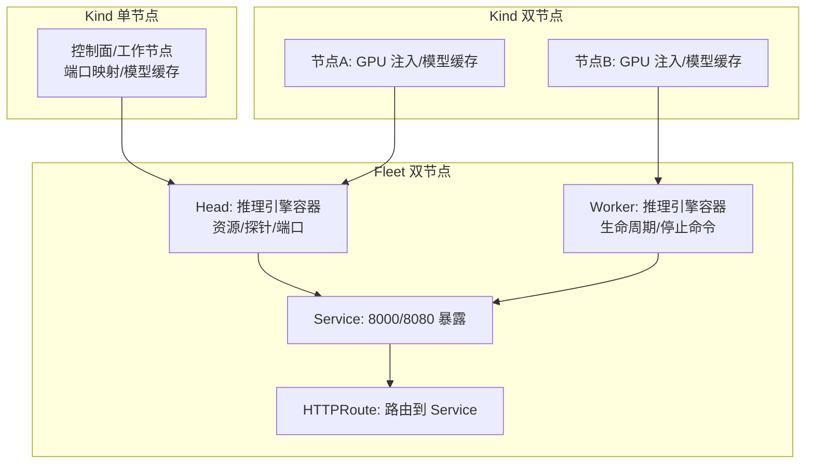
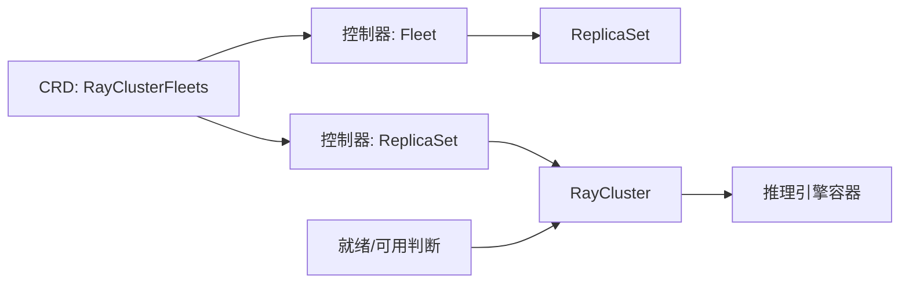

# 分布式推理

<cite>
**本文引用的文件**
- [api/orchestration/v1alpha1/raycluster_type.go](file://api/orchestration/v1alpha1/raycluster_type.go)
- [api/orchestration/v1alpha1/rayclusterfleet_types.go](file://api/orchestration/v1alpha1/rayclusterfleet_types.go)
- [pkg/controller/rayclusterfleet/rayclusterfleet_controller.go](file://pkg/controller/rayclusterfleet/rayclusterfleet_controller.go)
- [pkg/controller/rayclusterreplicaset/rayclusterreplicaset_controller.go](file://pkg/controller/rayclusterreplicaset/rayclusterreplicaset_controller.go)
- [pkg/utils/raycluster.go](file://pkg/utils/raycluster.go)
- [samples/distributed/fleet.yaml](file://samples/distributed/fleet.yaml)
- [samples/distributed/fleet-two-node.yaml](file://samples/distributed/fleet-two-node.yaml)
- [development/tutorials/distributed/raycluster.yaml](file://development/tutorials/distributed/raycluster.yaml)
- [development/tutorials/distributed/nvkind-single-node.yaml](file://development/tutorials/distributed/nvkind-single-node.yaml)
- [development/tutorials/distributed/nvkind-two-nodes.yaml](file://development/tutorials/distributed/nvkind-two-nodes.yaml)
- [config/crd/orchestration/orchestration.aibrix.ai_rayclusterfleets.yaml](file://config/crd/orchestration/orchestration.aibrix.ai_rayclusterfleets.yaml)
- [pkg/controller/rayclusterfleet/rolling.go](file://pkg/controller/rayclusterfleet/rolling.go)
</cite>

## 目录
1. [简介](#简介)
2. [项目结构](#项目结构)
3. [核心组件](#核心组件)
4. [架构总览](#架构总览)
5. [详细组件分析](#详细组件分析)
6. [依赖分析](#依赖分析)
7. [性能考虑](#性能考虑)
8. [故障排查指南](#故障排查指南)
9. [结论](#结论)
10. [附录](#附录)

## 简介
本指南面向希望在生产环境中构建高可用、可扩展的分布式推理平台的工程师与架构师。AIBrix 提供以 RayCluster 舰队编排为核心的分布式推理能力，结合模型解耦架构与跨节点推理优化，支持 vLLM、SGLang 等推理引擎在 Kubernetes 上的统一管理与弹性伸缩。本文将从架构设计、控制器实现、资源配置策略、性能优化到部署模板与故障转移机制进行系统性阐述，并给出多节点集群与多引擎的最佳实践。

## 项目结构
AIBrix 将分布式推理的关键抽象定义在自定义资源类型中，并通过专用控制器实现编排逻辑；示例与教程提供了可直接落地的部署模板。下图展示了与分布式推理相关的核心模块与文件映射关系：

**图表来源**
- [api/orchestration/v1alpha1/raycluster_type.go:1-35](file://api/orchestration/v1alpha1/raycluster_type.go#L1-L35)
- [api/orchestration/v1alpha1/rayclusterfleet_types.go:1-182](file://api/orchestration/v1alpha1/rayclusterfleet_types.go#L1-L182)
- [config/crd/orchestration/orchestration.aibrix.ai_rayclusterfleets.yaml:1-800](file://config/crd/orchestration/orchestration.aibrix.ai_rayclusterfleets.yaml#L1-L800)
- [pkg/controller/rayclusterfleet/rayclusterfleet_controller.go:1-271](file://pkg/controller/rayclusterfleet/rayclusterfleet_controller.go#L1-L271)
- [pkg/controller/rayclusterreplicaset/rayclusterreplicaset_controller.go:1-248](file://pkg/controller/rayclusterreplicaset/rayclusterreplicaset_controller.go#L1-L248)
- [pkg/controller/rayclusterfleet/rolling.go:1-235](file://pkg/controller/rayclusterfleet/rolling.go#L1-L235)
- [pkg/utils/raycluster.go:1-74](file://pkg/utils/raycluster.go#L1-L74)
- [samples/distributed/fleet.yaml:1-55](file://samples/distributed/fleet.yaml#L1-L55)
- [samples/distributed/fleet-two-node.yaml:1-208](file://samples/distributed/fleet-two-node.yaml#L1-L208)
- [development/tutorials/distributed/raycluster.yaml:1-66](file://development/tutorials/distributed/raycluster.yaml#L1-L66)
- [development/tutorials/distributed/nvkind-single-node.yaml:1-30](file://development/tutorials/distributed/nvkind-single-node.yaml#L1-L30)
- [development/tutorials/distributed/nvkind-two-nodes.yaml:1-47](file://development/tutorials/distributed/nvkind-two-nodes.yaml#L1-L47)

**章节来源**
- [api/orchestration/v1alpha1/raycluster_type.go:1-35](file://api/orchestration/v1alpha1/raycluster_type.go#L1-L35)
- [api/orchestration/v1alpha1/rayclusterfleet_types.go:1-182](file://api/orchestration/v1alpha1/rayclusterfleet_types.go#L1-L182)
- [config/crd/orchestration/orchestration.aibrix.ai_rayclusterfleets.yaml:1-800](file://config/crd/orchestration/orchestration.aibrix.ai_rayclusterfleets.yaml#L1-L800)

## 核心组件
- 自定义资源与类型
  - RayClusterTemplateSpec：封装 RayCluster 的元数据与规格，作为 Fleet/ReplicaSet 的模板字段。
  - RayClusterFleet：对一组 RayCluster 的编排抽象，支持滚动/重建策略、暂停、最小就绪时间、进度截止时间等。
  - CRD 定义：声明了 Fleet 的字段、校验规则与默认值，确保在集群中以标准 CRD 形式被识别与持久化。
- 控制器
  - RayClusterFleet 控制器：负责根据 Fleet 的期望状态，协调 ReplicaSet 与底层 RayCluster 的创建/删除/滚动更新。
  - RayClusterReplicaSet 控制器：负责按副本数对底层 RayCluster 进行扩缩容，支持并发删除限流与状态回写。
- 工具函数
  - RayCluster 就绪/可用判断：基于条件与副本计数，判断集群是否满足“已就绪”和“可用”的标准。

**章节来源**
- [api/orchestration/v1alpha1/raycluster_type.go:24-34](file://api/orchestration/v1alpha1/raycluster_type.go#L24-L34)
- [api/orchestration/v1alpha1/rayclusterfleet_types.go:27-74](file://api/orchestration/v1alpha1/rayclusterfleet_types.go#L27-L74)
- [pkg/controller/rayclusterfleet/rayclusterfleet_controller.go:106-183](file://pkg/controller/rayclusterfleet/rayclusterfleet_controller.go#L106-L183)
- [pkg/controller/rayclusterreplicaset/rayclusterreplicaset_controller.go:108-161](file://pkg/controller/rayclusterreplicaset/rayclusterreplicaset_controller.go#L108-L161)
- [pkg/utils/raycluster.go:38-73](file://pkg/utils/raycluster.go#L38-L73)

## 架构总览
AIBrix 的分布式推理架构围绕“Fleet → ReplicaSet → RayCluster → 引擎容器”的层级展开。Fleet 作为顶层编排单元，定义副本数、选择器与滚动策略；ReplicaSet 负责具体副本数量与生命周期；RayCluster 由 KubeRay 管理，承载 Head/Worker Pod 并运行推理引擎容器（如 vLLM/SGLang）。控制器通过 Reconcile 循环保证目标状态与实际状态一致，并在滚动更新时遵循最大可用/不可用约束。

**图表来源**
- [api/orchestration/v1alpha1/rayclusterfleet_types.go:27-74](file://api/orchestration/v1alpha1/rayclusterfleet_types.go#L27-L74)
- [pkg/controller/rayclusterfleet/rayclusterfleet_controller.go:106-183](file://pkg/controller/rayclusterfleet/rayclusterfleet_controller.go#L106-L183)
- [pkg/controller/rayclusterreplicaset/rayclusterreplicaset_controller.go:108-161](file://pkg/controller/rayclusterreplicaset/rayclusterreplicaset_controller.go#L108-L161)
- [pkg/utils/raycluster.go:38-73](file://pkg/utils/raycluster.go#L38-L73)

## 详细组件分析

### RayClusterFleet 编排流程（Reconcile）
Fleet 控制器在每次 Reconcile 中执行以下关键步骤：
- 校验选择器合法性，避免全选场景。
- 列举关联的 ReplicaSet 与底层 RayCluster。
- 处理暂停、回滚、扩容/缩容事件。
- 根据策略执行滚动或重建更新。
- 更新状态并记录事件。

**图表来源**
- [pkg/controller/rayclusterfleet/rayclusterfleet_controller.go:106-183](file://pkg/controller/rayclusterfleet/rayclusterfleet_controller.go#L106-L183)
- [pkg/utils/raycluster.go:38-73](file://pkg/utils/raycluster.go#L38-L73)

**章节来源**
- [pkg/controller/rayclusterfleet/rayclusterfleet_controller.go:106-183](file://pkg/controller/rayclusterfleet/rayclusterfleet_controller.go#L106-L183)

### 滚动更新策略（Rolling）
滚动更新在新旧 ReplicaSet 之间平衡“最大不可用”与“最大 Surge”，优先清理不健康副本，再按配额缩放旧 ReplicaSet，最后清理历史版本，确保服务连续性与可用性。

**图表来源**
- [pkg/controller/rayclusterfleet/rolling.go:29-235](file://pkg/controller/rayclusterfleet/rolling.go#L29-L235)

**章节来源**
- [pkg/controller/rayclusterfleet/rolling.go:29-235](file://pkg/controller/rayclusterfleet/rolling.go#L29-L235)

### RayCluster 就绪/可用判定
- 就绪：集群状态包含“已 Provisioned”、“Head 就绪”且“所有 Worker 就绪”。
- 可用：在就绪基础上，满足最小就绪时间阈值，避免短暂抖动。

**图表来源**
- [pkg/utils/raycluster.go:38-73](file://pkg/utils/raycluster.go#L38-L73)

**章节来源**
- [pkg/utils/raycluster.go:38-73](file://pkg/utils/raycluster.go#L38-L73)

### 多节点与资源调度
- 单节点与双节点 Kind 配置演示了端口映射、GPU 注入与模型缓存挂载，便于本地验证多节点拓扑。
- 双节点 Fleet 示例展示了 Head/Worker 的镜像、资源限制、探针与服务路由配置，适合生产级部署参考。

**图表来源**
- [development/tutorials/distributed/nvkind-single-node.yaml:1-30](file://development/tutorials/distributed/nvkind-single-node.yaml#L1-L30)
- [development/tutorials/distributed/nvkind-two-nodes.yaml:1-47](file://development/tutorials/distributed/nvkind-two-nodes.yaml#L1-L47)
- [samples/distributed/fleet-two-node.yaml:1-208](file://samples/distributed/fleet-two-node.yaml#L1-L208)

**章节来源**
- [development/tutorials/distributed/nvkind-single-node.yaml:1-30](file://development/tutorials/distributed/nvkind-single-node.yaml#L1-L30)
- [development/tutorials/distributed/nvkind-two-nodes.yaml:1-47](file://development/tutorials/distributed/nvkind-two-nodes.yaml#L1-L47)
- [samples/distributed/fleet-two-node.yaml:1-208](file://samples/distributed/fleet-two-node.yaml#L1-L208)

## 依赖分析
- 控制器依赖
  - Fleet 控制器同时拥有 ReplicaSet 与 RayCluster 的所有权，确保生命周期闭环。
  - ReplicaSet 控制器拥有 RayCluster 的所有权，负责具体扩缩容。
- 状态依赖
  - 就绪/可用判断依赖 KubeRay 的状态条件与副本计数，控制器据此决定下一步动作。
- CRD 依赖
  - Fleet 的字段与默认值由 CRD 定义，控制器在 Reconcile 中严格遵循。

**图表来源**
- [config/crd/orchestration/orchestration.aibrix.ai_rayclusterfleets.yaml:1-800](file://config/crd/orchestration/orchestration.aibrix.ai_rayclusterfleets.yaml#L1-L800)
- [pkg/controller/rayclusterfleet/rayclusterfleet_controller.go:76-86](file://pkg/controller/rayclusterfleet/rayclusterfleet_controller.go#L76-L86)
- [pkg/controller/rayclusterreplicaset/rayclusterreplicaset_controller.go:73-79](file://pkg/controller/rayclusterreplicaset/rayclusterreplicaset_controller.go#L73-L79)
- [pkg/utils/raycluster.go:38-73](file://pkg/utils/raycluster.go#L38-L73)

**章节来源**
- [config/crd/orchestration/orchestration.aibrix.ai_rayclusterfleets.yaml:1-800](file://config/crd/orchestration/orchestration.aibrix.ai_rayclusterfleets.yaml#L1-L800)
- [pkg/controller/rayclusterfleet/rayclusterfleet_controller.go:76-86](file://pkg/controller/rayclusterfleet/rayclusterfleet_controller.go#L76-L86)
- [pkg/controller/rayclusterreplicaset/rayclusterreplicaset_controller.go:73-79](file://pkg/controller/rayclusterreplicaset/rayclusterreplicaset_controller.go#L73-L79)

## 性能考虑
- 资源规划
  - Head/Worker 的 CPU/GPU 资源应与模型规模匹配，合理设置 requests/limits，避免抢占与 OOM。
  - 使用探针（存活/就绪）缩短故障发现时间，提升滚动更新稳定性。
- 并发与吞吐
  - ReplicaSet 控制器在删除时采用并发限流，建议结合业务峰值流量评估并发度。
  - 滚动更新中的 maxSurge/maxUnavailable 应与 SLA 对齐，兼顾恢复速度与可用性。
- 存储与缓存
  - 模型缓存目录挂载至本地 SSD 或共享存储，减少冷启动时间。
  - 结合 KV Cache 与推理引擎参数（如 dtype、并行度）优化显存占用与吞吐。
- 网络与路由
  - 通过 Service/HTTPRoute 将请求路由到后端推理端口，确保端口一致与超时合理。

[本节为通用指导，无需特定文件来源]

## 故障排查指南
- 常见问题定位
  - 集群未就绪：检查 Head/Worker 条件与副本数，确认最小就绪时间是否满足。
  - 滚动更新卡住：查看最大不可用/最大 Surge 配置与可用副本数，确认是否存在不健康副本。
  - 扩缩容异常：检查 ReplicaSet 控制器日志与并发删除错误聚合信息。
- 建议操作
  - 查看控制器事件与状态字段，定位具体失败阶段。
  - 在本地 Kind 环境复现双节点拓扑，验证端口映射与 GPU 注入。
  - 使用示例模板快速对比配置差异，逐步缩小问题范围。

**章节来源**
- [pkg/utils/raycluster.go:38-73](file://pkg/utils/raycluster.go#L38-L73)
- [pkg/controller/rayclusterreplicaset/rayclusterreplicaset_controller.go:175-213](file://pkg/controller/rayclusterreplicaset/rayclusterreplicaset_controller.go#L175-L213)
- [development/tutorials/distributed/nvkind-two-nodes.yaml:1-47](file://development/tutorials/distributed/nvkind-two-nodes.yaml#L1-L47)

## 结论
AIBrix 的分布式推理体系以 Fleet/ReplicaSet/RayCluster 三层编排为核心，配合控制器的 Reconcile 与滚动更新策略，实现了对多节点、多引擎推理任务的自动化管理。通过合理的资源配置、并发控制与可观测性，可在生产环境中构建高可用、低延迟的推理平台。建议以示例模板为起点，结合业务负载特征迭代调优，持续完善自动扩缩容与故障转移机制。

[本节为总结性内容，无需特定文件来源]

## 附录

### 部署配置模板与最佳实践
- 单节点 Fleet 示例
  - 适用于本地开发与小规模测试，包含 Head 容器与推理命令、资源限制与端口暴露。
  - 参考路径：[samples/distributed/fleet.yaml:1-55](file://samples/distributed/fleet.yaml#L1-L55)
- 双节点 Fleet 示例
  - 包含 Head/Worker 容器、资源、探针、生命周期钩子、Service 与 HTTPRoute 路由，适合生产部署。
  - 参考路径：[samples/distributed/fleet-two-node.yaml:1-208](file://samples/distributed/fleet-two-node.yaml#L1-L208)
- 原生 RayCluster 教程
  - 展示 Head/Worker 的基础配置与卷挂载，便于理解底层 Pod 行为。
  - 参考路径：[development/tutorials/distributed/raycluster.yaml:1-66](file://development/tutorials/distributed/raycluster.yaml#L1-L66)
- Kind 本地多节点
  - 提供单/双节点 Kind 配置，包含 GPU 注入、端口映射与模型缓存挂载。
  - 参考路径：
    - [development/tutorials/distributed/nvkind-single-node.yaml:1-30](file://development/tutorials/distributed/nvkind-single-node.yaml#L1-L30)
    - [development/tutorials/distributed/nvkind-two-nodes.yaml:1-47](file://development/tutorials/distributed/nvkind-two-nodes.yaml#L1-L47)

### 不同推理引擎（vLLM、SGLang）配置要点
- vLLM
  - 在 Head 容器中通过命令行参数指定模型、并行度与后端（Ray），并暴露服务端口。
  - 参考路径：[samples/distributed/fleet-two-node.yaml:52-58](file://samples/distributed/fleet-two-node.yaml#L52-L58)
- SGLang
  - 在 Head 容器中以 SGLang 启动参数配置模型与后端，确保与 Service/Route 端口一致。
  - 参考路径：[samples/distributed/fleet-two-node.yaml:119-143](file://samples/distributed/fleet-two-node.yaml#L119-L143)

### 跨节点推理优化建议
- 节点亲和与拓扑
  - 通过亲和规则将 Head/Worker 调度到具备相同 GPU 型号的节点，降低跨节点通信开销。
- 显存与批处理
  - 根据 GPU 显存与模型大小调整 tensor parallel size 与 batch 参数，避免 OOM。
- 网络与 RDMA
  - 在支持 RDMA 的集群中启用相关网络插件，减少跨节点通信延迟。

[本节为通用指导，无需特定文件来源]