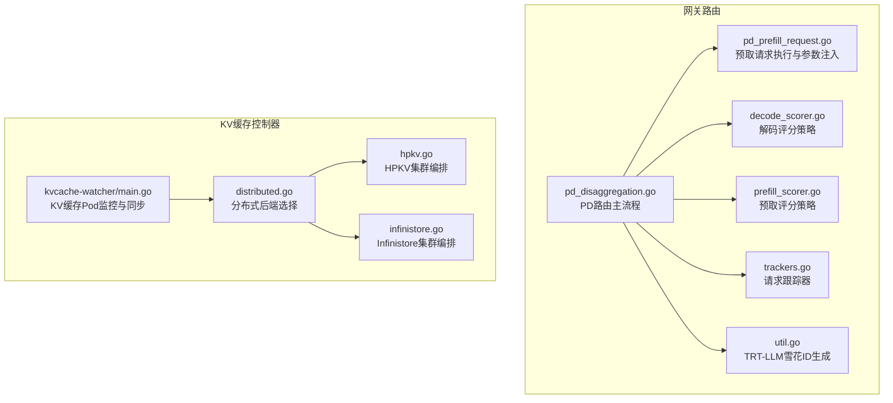
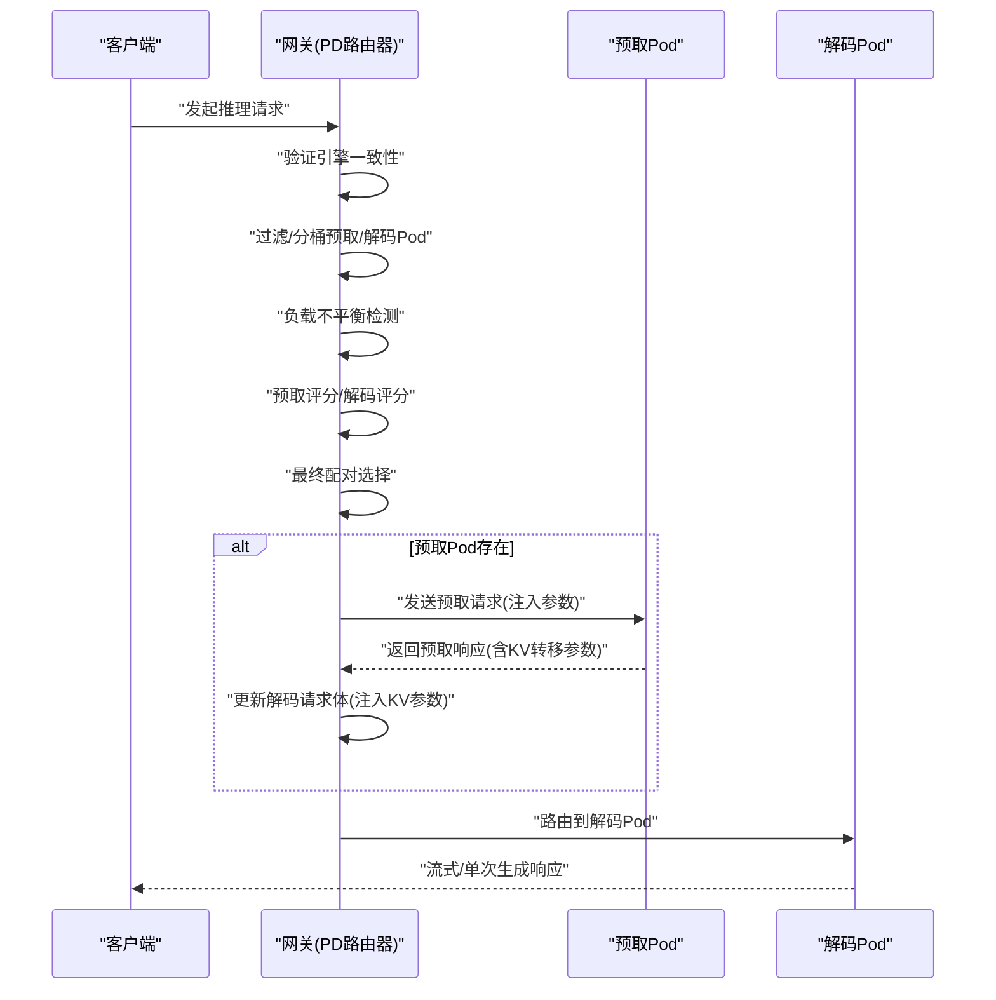
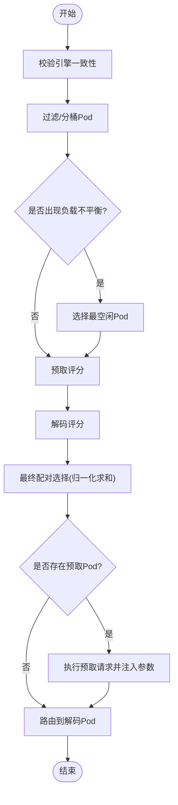
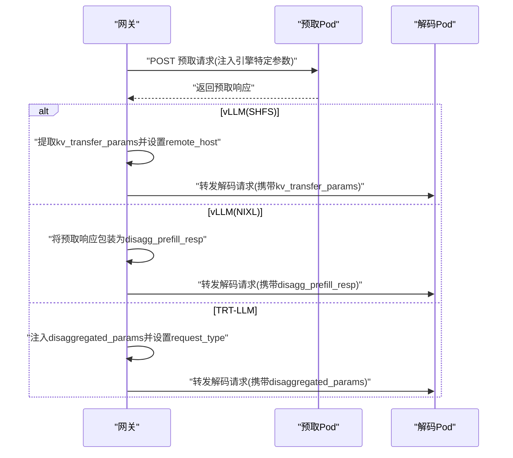
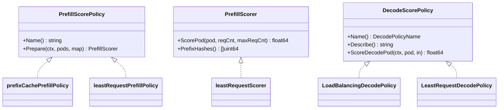
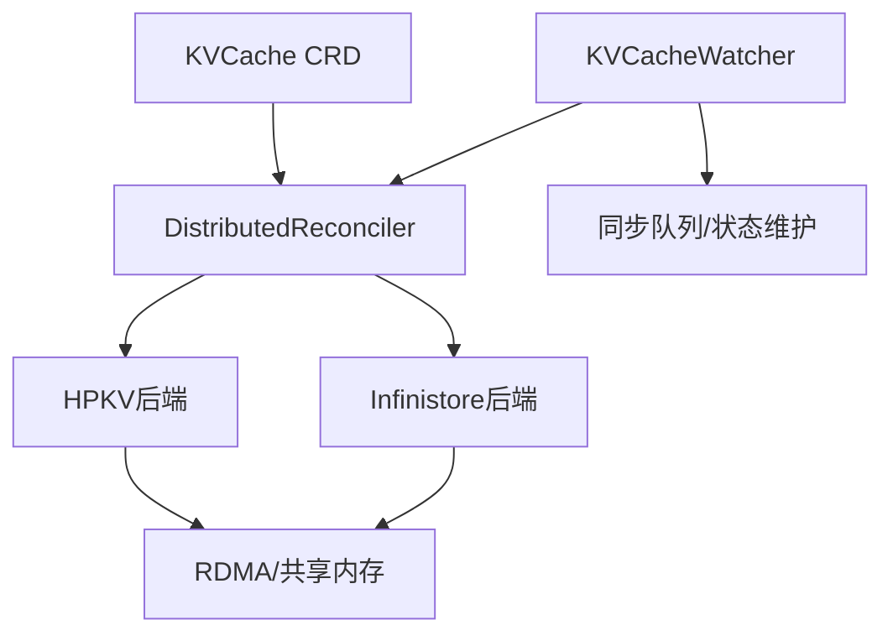
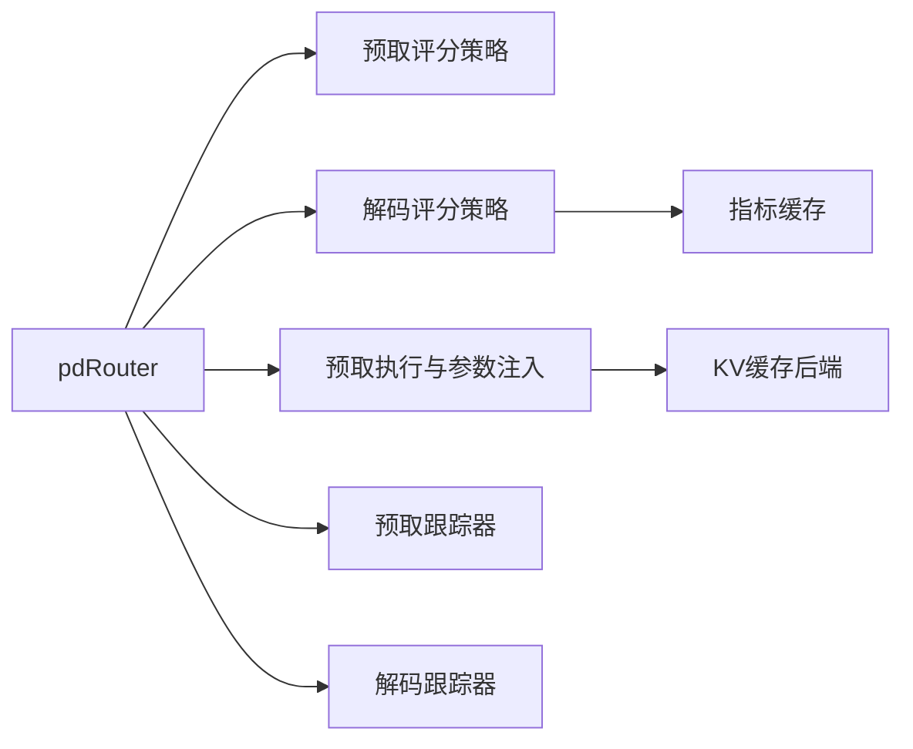

# 模型解耦架构

<cite>
**本文引用的文件**
- [pkg/plugins/gateway/algorithms/pd_disaggregation.go](file://pkg/plugins/gateway/algorithms/pd_disaggregation.go)
- [pkg/plugins/gateway/algorithms/pd_readme.md](file://pkg/plugins/gateway/algorithms/pd_readme.md)
- [pkg/plugins/gateway/algorithms/pd_prefill_request.go](file://pkg/plugins/gateway/algorithms/pd_prefill_request.go)
- [pkg/plugins/gateway/algorithms/pd/decode_scorer.go](file://pkg/plugins/gateway/algorithms/pd/decode_scorer.go)
- [pkg/plugins/gateway/algorithms/pd/prefill_scorer.go](file://pkg/plugins/gateway/algorithms/pd/prefill_scorer.go)
- [pkg/plugins/gateway/algorithms/pd/trackers.go](file://pkg/plugins/gateway/algorithms/pd/trackers.go)
- [pkg/plugins/gateway/algorithms/util.go](file://pkg/plugins/gateway/algorithms/util.go)
- [pkg/controller/kvcache/backends/distributed.go](file://pkg/controller/kvcache/backends/distributed.go)
- [pkg/controller/kvcache/backends/hpkv.go](file://pkg/controller/kvcache/backends/hpkv.go)
- [pkg/controller/kvcache/backends/infinistore.go](file://pkg/controller/kvcache/backends/infinistore.go)
- [cmd/kvcache-watcher/main.go](file://cmd/kvcache-watcher/main.go)
- [samples/disaggregation/vllm/vllm-prefill-decode.yaml](file://samples/disaggregation/vllm/vllm-prefill-decode.yaml)
- [samples/disaggregation/sglang/sglang-prefill-decode.yaml](file://samples/disaggregation/sglang/sglang-prefill-decode.yaml)
- [benchmarks/scenarios/gateway/benchmark.py](file://benchmarks/scenarios/gateway/benchmark.py)
- [benchmarks/client/client.py](file://benchmarks/client/client.py)
</cite>

## 目录
1. [引言](#引言)
2. [项目结构](#项目结构)
3. [核心组件](#核心组件)
4. [架构总览](#架构总览)
5. [详细组件分析](#详细组件分析)
6. [依赖关系分析](#依赖关系分析)
7. [性能考量](#性能考量)
8. [故障排查指南](#故障排查指南)
9. [结论](#结论)
10. [附录](#附录)

## 引言
本技术指南围绕“模型解耦架构”展开，系统阐述基于 Prefill-Decode（PD）解耦模式的请求处理流程、评分与调度策略、跨节点通信机制、数据传输协议与同步控制方法，并结合 vLLM 与 SGLang 两种引擎在解耦场景下的配置与优化要点，提供性能对比分析、部署配置模板与故障排查建议，帮助读者在生产环境中稳定高效地落地解耦推理。

## 项目结构
本仓库中与模型解耦相关的关键模块集中在网关路由算法与 KV 缓存控制器两大部分：
- 网关 PD 路由算法：负责请求进入时的引擎一致性校验、预取/解码节点选择、预取阶段执行与参数注入、响应头设置与指标上报。
- KV 缓存后端控制器：负责分布式 KV 缓存集群的编排与管理，支持 HPKV、Infinistore 等后端，提供 RDMA 等网络能力以支撑跨节点 KV 数据传输。

图示来源
- [pkg/plugins/gateway/algorithms/pd_disaggregation.go:1-995](file://pkg/plugins/gateway/algorithms/pd_disaggregation.go#L1-L995)
- [pkg/plugins/gateway/algorithms/pd_prefill_request.go:1-478](file://pkg/plugins/gateway/algorithms/pd_prefill_request.go#L1-L478)
- [pkg/plugins/gateway/algorithms/pd/decode_scorer.go:1-244](file://pkg/plugins/gateway/algorithms/pd/decode_scorer.go#L1-L244)
- [pkg/plugins/gateway/algorithms/pd/prefill_scorer.go:1-181](file://pkg/plugins/gateway/algorithms/pd/prefill_scorer.go#L1-L181)
- [pkg/plugins/gateway/algorithms/pd/trackers.go:1-208](file://pkg/plugins/gateway/algorithms/pd/trackers.go#L1-L208)
- [pkg/plugins/gateway/algorithms/util.go:1-105](file://pkg/plugins/gateway/algorithms/util.go#L1-L105)
- [pkg/controller/kvcache/backends/distributed.go:1-51](file://pkg/controller/kvcache/backends/distributed.go#L1-L51)
- [pkg/controller/kvcache/backends/hpkv.go:263-424](file://pkg/controller/kvcache/backends/hpkv.go#L263-L424)
- [pkg/controller/kvcache/backends/infinistore.go:284-319](file://pkg/controller/kvcache/backends/infinistore.go#L284-L319)
- [cmd/kvcache-watcher/main.go:315-375](file://cmd/kvcache-watcher/main.go#L315-L375)

章节来源
- [pkg/plugins/gateway/algorithms/pd_disaggregation.go:1-995](file://pkg/plugins/gateway/algorithms/pd_disaggregation.go#L1-L995)
- [pkg/controller/kvcache/backends/distributed.go:1-51](file://pkg/controller/kvcache/backends/distributed.go#L1-L51)

## 核心组件
- PD 路由器（pdRouter）
  - 负责引擎一致性校验、预取/解码节点过滤与分桶、负载不平衡检测、预取与解码评分、最终配对选择、预取请求执行与参数注入、响应头设置与指标上报。
- 预取评分策略
  - prefix_cache：基于共享前缀哈希表匹配已缓存的 token 前缀，结合运行中的请求数进行评分。
  - least_request：仅依据运行中的请求数评分。
- 解码评分策略
  - load_balancing：综合归一化的运行请求数、反向吞吐与空闲 GPU 百分比进行评分。
  - least_request：仅依据运行中的请求数评分。
- 请求跟踪器
  - PrefillRequestTracker：记录每个 Pod 的活跃预取请求数，用于预取侧负载均衡与评分。
  - PendingDecodeTracker：桥接解码选择与实际开始之间的时间窗，避免并发请求全部落到同一解码 Pod。
- KV 缓存后端控制器
  - 支持 HPKV 与 Infinistore 后端，提供 RDMA 网络与共享内存配置，保障跨节点 KV 数据传输性能与稳定性。

章节来源
- [pkg/plugins/gateway/algorithms/pd_disaggregation.go:191-270](file://pkg/plugins/gateway/algorithms/pd_disaggregation.go#L191-L270)
- [pkg/plugins/gateway/algorithms/pd/prefill_scorer.go:40-86](file://pkg/plugins/gateway/algorithms/pd/prefill_scorer.go#L40-L86)
- [pkg/plugins/gateway/algorithms/pd/decode_scorer.go:98-111](file://pkg/plugins/gateway/algorithms/pd/decode_scorer.go#L98-L111)
- [pkg/plugins/gateway/algorithms/pd/trackers.go:27-126](file://pkg/plugins/gateway/algorithms/pd/trackers.go#L27-L126)
- [pkg/controller/kvcache/backends/distributed.go:31-51](file://pkg/controller/kvcache/backends/distributed.go#L31-L51)

## 架构总览
PD 解耦将一次推理请求拆分为两个阶段：
- 预取（Prefill）：在预取 Pod 中完成上下文编码与 KV 缓存构建。
- 解码（Decode）：在解码 Pod 中使用预取阶段构建的 KV 缓存逐 token 生成输出。

图示来源
- [pkg/plugins/gateway/algorithms/pd_readme.md:14-50](file://pkg/plugins/gateway/algorithms/pd_readme.md#L14-L50)
- [pkg/plugins/gateway/algorithms/pd_disaggregation.go:272-311](file://pkg/plugins/gateway/algorithms/pd_disaggregation.go#L272-L311)
- [pkg/plugins/gateway/algorithms/pd_prefill_request.go:53-160](file://pkg/plugins/gateway/algorithms/pd_prefill_request.go#L53-L160)

## 详细组件分析

### 组件A：PD 路由器与评分体系
- 引擎一致性校验
  - 在所有候选预取 Pod 中确保引擎类型一致（vLLM / SGLang / TRT-LLM），否则拒绝路由。
- Pod 分类与分桶
  - 按角色集（roleset）与角色（prefill/decode/combined）分组；可选按提示长度桶过滤；多节点张量并行下仅选择带 HTTP 服务的 Pod。
- 负载不平衡检测
  - 预取侧：当最大与最小运行请求数差超过阈值时，直接选择最空闲的预取 Pod。
  - 解码侧：三步检查（运行请求数差、吞吐差异、排队耗时评分），优先选择最空闲或最优的解码 Pod。
- 预取与解码评分
  - 预取：prefix_cache（基于前缀缓存命中率）与 least_request（仅看运行请求数）。
  - 解码：load_balancing（综合运行数、吞吐、空闲 GPU）与 least_request。
- 最终配对与归一化
  - 对每个角色集内的预取与解码分数分别归一化后相加，选择总分最低的角色集作为目标组合。
- 指标与响应头
  - 上报预取成功/失败计数与所选 Pod 计数；设置预取目标 Pod 名称与 IP 响应头。

图示来源
- [pkg/plugins/gateway/algorithms/pd_disaggregation.go:318-377](file://pkg/plugins/gateway/algorithms/pd_disaggregation.go#L318-L377)
- [pkg/plugins/gateway/algorithms/pd_disaggregation.go:530-716](file://pkg/plugins/gateway/algorithms/pd_disaggregation.go#L530-L716)

章节来源
- [pkg/plugins/gateway/algorithms/pd_disaggregation.go:272-311](file://pkg/plugins/gateway/algorithms/pd_disaggregation.go#L272-L311)
- [pkg/plugins/gateway/algorithms/pd_disaggregation.go:318-377](file://pkg/plugins/gateway/algorithms/pd_disaggregation.go#L318-L377)
- [pkg/plugins/gateway/algorithms/pd_disaggregation.go:530-716](file://pkg/plugins/gateway/algorithms/pd_disaggregation.go#L530-L716)

### 组件B：预取请求执行与参数注入
- SGLang 异步握手
  - 通过引导主机/端口/房间字段协调预取与解码，预取异步发起，不阻塞路由。
- vLLM 参数注入
  - 预取响应中提取 KV 转移参数，注入到解码请求体；默认通过共享文件系统（SHFS）传输 KV 块，也可使用 NIXL（Neuron）封装整个预取响应。
- TensorRT-LLM 参数注入
  - 使用雪花风格请求 ID 关联预取与解码阶段，预取响应中携带解码所需参数与提示词 ID，解码阶段将其转换为生成阶段参数。

图示来源
- [pkg/plugins/gateway/algorithms/pd_prefill_request.go:53-160](file://pkg/plugins/gateway/algorithms/pd_prefill_request.go#L53-L160)
- [pkg/plugins/gateway/algorithms/pd_prefill_request.go:203-275](file://pkg/plugins/gateway/algorithms/pd_prefill_request.go#L203-L275)
- [pkg/plugins/gateway/algorithms/pd_prefill_request.go:339-406](file://pkg/plugins/gateway/algorithms/pd_prefill_request.go#L339-L406)
- [pkg/plugins/gateway/algorithms/pd_prefill_request.go:408-477](file://pkg/plugins/gateway/algorithms/pd_prefill_request.go#L408-L477)
- [pkg/plugins/gateway/algorithms/util.go:76-93](file://pkg/plugins/gateway/algorithms/util.go#L76-L93)

章节来源
- [pkg/plugins/gateway/algorithms/pd_prefill_request.go:53-160](file://pkg/plugins/gateway/algorithms/pd_prefill_request.go#L53-L160)
- [pkg/plugins/gateway/algorithms/pd_prefill_request.go:203-275](file://pkg/plugins/gateway/algorithms/pd_prefill_request.go#L203-L275)
- [pkg/plugins/gateway/algorithms/pd_prefill_request.go:339-406](file://pkg/plugins/gateway/algorithms/pd_prefill_request.go#L339-L406)
- [pkg/plugins/gateway/algorithms/pd_prefill_request.go:408-477](file://pkg/plugins/gateway/algorithms/pd_prefill_request.go#L408-L477)
- [pkg/plugins/gateway/algorithms/util.go:76-93](file://pkg/plugins/gateway/algorithms/util.go#L76-L93)

### 组件C：评分策略与请求跟踪
- 预取评分策略
  - prefix_cache：根据前缀缓存命中百分比与运行请求数计算分数。
  - least_request：仅考虑运行请求数。
- 解码评分策略
  - load_balancing：运行请求数、吞吐与空闲 GPU 的综合评分；权重可通过环境变量调节。
  - least_request：仅考虑运行请求数。
- 请求跟踪器
  - 预取跟踪器：记录活跃预取请求数，避免将新请求路由到过载 Pod。
  - 解码跟踪器：在指标尚未刷新期间，将待开始的解码请求计入运行请求数，避免集中路由。

图示来源
- [pkg/plugins/gateway/algorithms/pd/prefill_scorer.go:69-86](file://pkg/plugins/gateway/algorithms/pd/prefill_scorer.go#L69-L86)
- [pkg/plugins/gateway/algorithms/pd/prefill_scorer.go:88-111](file://pkg/plugins/gateway/algorithms/pd/prefill_scorer.go#L88-L111)
- [pkg/plugins/gateway/algorithms/pd/prefill_scorer.go:148-181](file://pkg/plugins/gateway/algorithms/pd/prefill_scorer.go#L148-L181)
- [pkg/plugins/gateway/algorithms/pd/decode_scorer.go:98-111](file://pkg/plugins/gateway/algorithms/pd/decode_scorer.go#L98-L111)
- [pkg/plugins/gateway/algorithms/pd/decode_scorer.go:113-146](file://pkg/plugins/gateway/algorithms/pd/decode_scorer.go#L113-L146)
- [pkg/plugins/gateway/algorithms/pd/decode_scorer.go:148-165](file://pkg/plugins/gateway/algorithms/pd/decode_scorer.go#L148-L165)

章节来源
- [pkg/plugins/gateway/algorithms/pd/prefill_scorer.go:40-86](file://pkg/plugins/gateway/algorithms/pd/prefill_scorer.go#L40-L86)
- [pkg/plugins/gateway/algorithms/pd/decode_scorer.go:32-47](file://pkg/plugins/gateway/algorithms/pd/decode_scorer.go#L32-L47)
- [pkg/plugins/gateway/algorithms/pd/trackers.go:27-126](file://pkg/plugins/gateway/algorithms/pd/trackers.go#L27-L126)

### 组件D：KV 缓存后端与跨节点通信
- 后端选择
  - HPKV 与 Infinistore 两类分布式后端，通过控制器统一编排。
- 网络与资源
  - 支持 RDMA 网络与共享内存（/dev/shm），通过注解与安全上下文启用。
- 监控与同步
  - KV 缓存观察者监听 Pod 变更，维护后端状态与同步队列，保证跨节点 KV 数据一致性。

图示来源
- [pkg/controller/kvcache/backends/distributed.go:31-51](file://pkg/controller/kvcache/backends/distributed.go#L31-L51)
- [pkg/controller/kvcache/backends/hpkv.go:263-424](file://pkg/controller/kvcache/backends/hpkv.go#L263-L424)
- [pkg/controller/kvcache/backends/infinistore.go:284-319](file://pkg/controller/kvcache/backends/infinistore.go#L284-L319)
- [cmd/kvcache-watcher/main.go:315-375](file://cmd/kvcache-watcher/main.go#L315-L375)

章节来源
- [pkg/controller/kvcache/backends/distributed.go:31-51](file://pkg/controller/kvcache/backends/distributed.go#L31-L51)
- [pkg/controller/kvcache/backends/hpkv.go:263-424](file://pkg/controller/kvcache/backends/hpkv.go#L263-L424)
- [pkg/controller/kvcache/backends/infinistore.go:284-319](file://pkg/controller/kvcache/backends/infinistore.go#L284-L319)
- [cmd/kvcache-watcher/main.go:315-375](file://cmd/kvcache-watcher/main.go#L315-L375)

## 依赖关系分析
- 组件耦合与内聚
  - pdRouter 将路由决策与预取执行解耦，评分策略通过接口抽象，便于扩展与替换。
  - 预取执行与参数注入独立于评分逻辑，便于针对不同引擎定制。
- 外部依赖
  - Kubernetes Pod 元数据与标签（roleset、role、pod-group-index、engine）用于路由决策。
  - 指标缓存（运行请求数、吞吐、GPU 使用率）用于负载均衡与不平衡检测。
  - KV 缓存后端提供跨节点 KV 数据传输能力。

图示来源
- [pkg/plugins/gateway/algorithms/pd_disaggregation.go:191-270](file://pkg/plugins/gateway/algorithms/pd_disaggregation.go#L191-L270)
- [pkg/plugins/gateway/algorithms/pd_prefill_request.go:53-160](file://pkg/plugins/gateway/algorithms/pd_prefill_request.go#L53-L160)
- [pkg/plugins/gateway/algorithms/pd/decode_scorer.go:62-72](file://pkg/plugins/gateway/algorithms/pd/decode_scorer.go#L62-L72)
- [pkg/controller/kvcache/backends/distributed.go:31-51](file://pkg/controller/kvcache/backends/distributed.go#L31-L51)

章节来源
- [pkg/plugins/gateway/algorithms/pd_disaggregation.go:191-270](file://pkg/plugins/gateway/algorithms/pd_disaggregation.go#L191-L270)
- [pkg/plugins/gateway/algorithms/pd_prefill_request.go:53-160](file://pkg/plugins/gateway/algorithms/pd_prefill_request.go#L53-L160)
- [pkg/plugins/gateway/algorithms/pd/decode_scorer.go:62-72](file://pkg/plugins/gateway/algorithms/pd/decode_scorer.go#L62-L72)

## 性能考量
- 吞吐量提升
  - PD 解耦允许预取与解码阶段并行扩展，预取侧专注于上下文编码与 KV 构建，解码侧专注逐 token 生成，避免单点瓶颈。
- 延迟优化
  - 预取阶段限制为单 token 返回，减少首 token 延迟；通过负载不平衡检测与评分策略降低排队等待时间。
- 资源利用率改善
  - 解码侧评分综合运行请求数、吞吐与空闲 GPU，避免热点 Pod；预取侧前缀缓存命中率越高，越能复用已有 KV，减少重复计算。
- 引擎差异
  - vLLM：通过 KV 转移参数在 GPU/共享文件系统间传输 KV；SGLang：通过引导握手异步协调；TRT-LLM：通过雪花 ID 关联阶段并注入解码参数。

章节来源
- [pkg/plugins/gateway/algorithms/pd_readme.md:148-233](file://pkg/plugins/gateway/algorithms/pd_readme.md#L148-L233)
- [pkg/plugins/gateway/algorithms/pd_prefill_request.go:203-275](file://pkg/plugins/gateway/algorithms/pd_prefill_request.go#L203-L275)

## 故障排查指南
- 引擎一致性错误
  - 现象：路由失败，指标上报“引擎校验失败”。
  - 排查：确认所有预取 Pod 使用相同引擎类型（vLLM / SGLang / TRT-LLM）。
- 预取/解码 Pod 不足
  - 现象：路由失败，提示预取或解码 Pod 不可用。
  - 排查：检查 Pod 标签（roleset、role、pod-group-index、engine）与健康状态；确认提示长度桶过滤未误伤。
- 预取超时
  - 现象：预取阶段超时。
  - 排查：调整预取超时时间；检查网络连通性与后端 KV 传输；查看预取日志与指标。
- 解码评分异常
  - 现象：解码评分无效（NaN），导致无法选择 Pod。
  - 排查：检查指标缓存是否可用；确认权重配置合理；必要时回退至 load_balancing 策略。
- KV 参数缺失
  - 现象：vLLM 预取响应缺少 KV 转移参数，解码阶段无法获取 KV。
  - 排查：确认预取响应包含 KV 参数；检查 KV 连接类型（SHFS/NIXL）与后端配置。

章节来源
- [pkg/plugins/gateway/algorithms/pd_disaggregation.go:272-311](file://pkg/plugins/gateway/algorithms/pd_disaggregation.go#L272-L311)
- [pkg/plugins/gateway/algorithms/pd_prefill_request.go:285-337](file://pkg/plugins/gateway/algorithms/pd_prefill_request.go#L285-L337)
- [pkg/plugins/gateway/algorithms/pd/decode_scorer.go:237-243](file://pkg/plugins/gateway/algorithms/pd/decode_scorer.go#L237-L243)

## 结论
PD 解耦架构通过清晰的阶段划分与可插拔的评分策略，在多引擎环境下实现了高吞吐、低延迟与高资源利用率的推理服务。结合 KV 缓存后端的跨节点传输能力与网关侧的负载均衡机制，可在复杂拓扑与混合工作负载下保持稳定性能。建议在生产中结合业务特征选择合适的评分策略与提示长度桶配置，并持续观测指标以动态调优。

## 附录

### vLLM 与 SGLang 在解耦场景下的配置与优化
- vLLM（SHFS）
  - 预取阶段：发送单 token 请求，等待 KV 转移参数；解码阶段注入远程主机与块 ID。
  - 优化：启用前缀缓存命中率高的预取策略；合理设置预取超时与连接池。
- vLLM（NIXL，Neuron）
  - 预取阶段：返回完整响应；解码阶段使用 disagg_prefill_resp 包装。
  - 优化：确保后端正确处理 KV 传输；减少预取响应体积。
- SGLang
  - 预取阶段：通过引导握手异步协调，不阻塞路由；解码阶段携带引导信息。
  - 优化：合理设置引导端口与房间号；监控异步预取状态。
- TRT-LLM
  - 预取阶段：注入雪花风格请求 ID；解码阶段转换为生成参数。
  - 优化：设置机器 ID 与计数器范围；确保整数 ID 不丢失精度。

章节来源
- [pkg/plugins/gateway/algorithms/pd_readme.md:237-301](file://pkg/plugins/gateway/algorithms/pd_readme.md#L237-L301)
- [pkg/plugins/gateway/algorithms/pd_prefill_request.go:203-275](file://pkg/plugins/gateway/algorithms/pd_prefill_request.go#L203-L275)
- [pkg/plugins/gateway/algorithms/util.go:76-93](file://pkg/plugins/gateway/algorithms/util.go#L76-L93)

### 部署配置模板
- vLLM 预取-解码分离部署样例
  - 参考路径：samples/disaggregation/vllm/vllm-prefill-decode.yaml
- SGLang 预取-解码分离部署样例
  - 参考路径：samples/disaggregation/sglang/sglang-prefill-decode.yaml

章节来源
- [samples/disaggregation/vllm/vllm-prefill-decode.yaml](file://samples/disaggregation/vllm/vllm-prefill-decode.yaml)
- [samples/disaggregation/sglang/sglang-prefill-decode.yaml](file://samples/disaggregation/sglang/sglang-prefill-decode.yaml)

### 性能对比分析与基准测试
- 端到端基准脚本
  - 网关基准：benchmarks/scenarios/gateway/benchmark.py
  - 客户端：benchmarks/client/client.py
- 建议指标
  - 首 token 延迟、吞吐量、排队时间、GPU 利用率、KV 传输时延。

章节来源
- [benchmarks/scenarios/gateway/benchmark.py](file://benchmarks/scenarios/gateway/benchmark.py)
- [benchmarks/client/client.py](file://benchmarks/client/client.py)