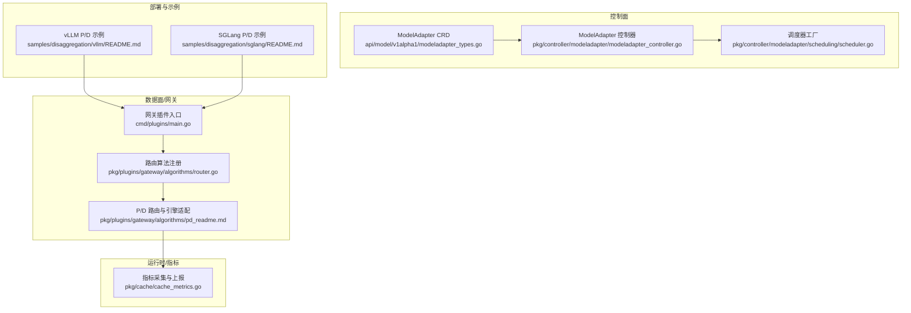
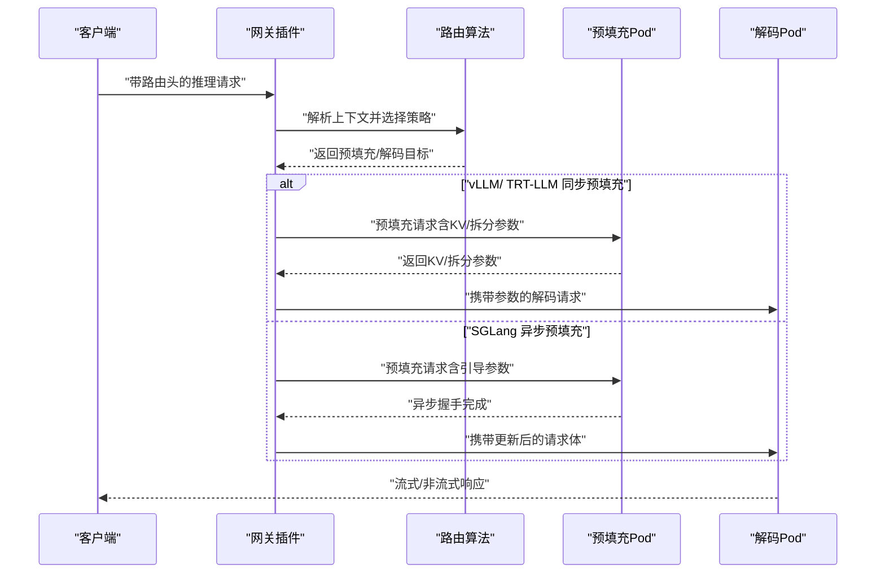
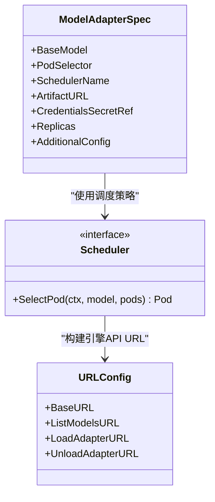
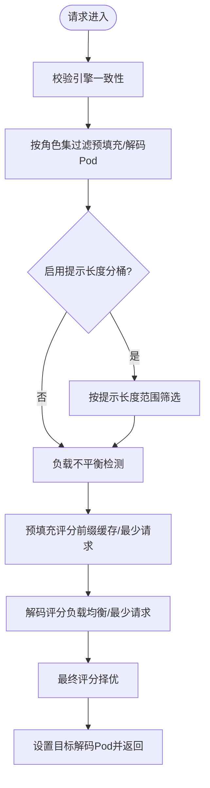
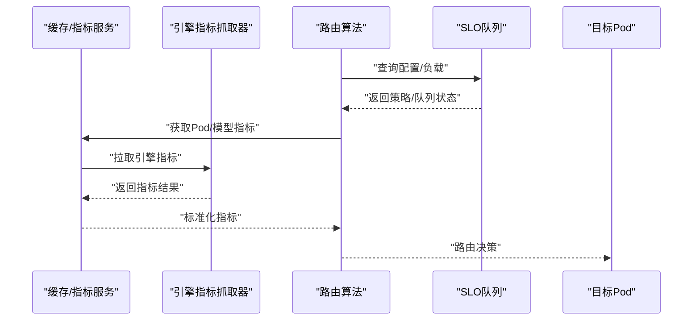
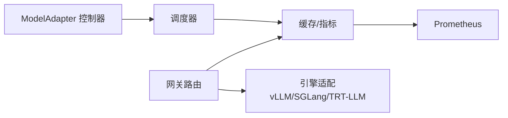

# 跨引擎支持

<cite>
**本文引用的文件**   
- [console.pb.go](file://apps/console/api/gen/console/v1/console.pb.go)
- [modeladapter_types.go](file://api/model/v1alpha1/modeladapter_types.go)
- [scheduler.go](file://pkg/controller/modeladapter/scheduling/scheduler.go)
- [modeladapter_controller.go](file://pkg/controller/modeladapter/modeladapter_controller.go)
- [utils.go](file://pkg/controller/modeladapter/utils.go)
- [pd_readme.md](file://pkg/plugins/gateway/algorithms/pd_readme.md)
- [pd_prefill_request.go](file://pkg/plugins/gateway/algorithms/pd_prefill_request.go)
- [pd_disaggregation.go](file://pkg/plugins/gateway/algorithms/pd_disaggregation.go)
- [router.go](file://pkg/plugins/gateway/algorithms/router.go)
- [slo.go](file://pkg/plugins/gateway/algorithms/slo.go)
- [main.go](file://cmd/plugins/main.go)
- [cache_metrics.go](file://pkg/cache/cache_metrics.go)
- [README.md（vLLM P/D 示例）](file://samples/disaggregation/vllm/README.md)
- [README.md（SGLang P/D 示例）](file://samples/disaggregation/sglang/README.md)
- [benchmark.py](file://benchmarks/benchmark.py)
- [README.md（基准测试）](file://benchmarks/README.md)
</cite>

## 目录
1. [简介](#简介)
2. [项目结构](#项目结构)
3. [核心组件](#核心组件)
4. [架构总览](#架构总览)
5. [详细组件分析](#详细组件分析)
6. [依赖分析](#依赖分析)
7. [性能考虑](#性能考虑)
8. [故障排查指南](#故障排查指南)
9. [结论](#结论)
10. [附录：配置模板与最佳实践](#附录配置模板与最佳实践)

## 简介
本技术文档聚焦于跨引擎支持系统，围绕 vLLM、SGLang 等推理引擎的架构差异与兼容性处理机制展开，系统阐述引擎适配器的工作原理、资源调度策略与性能优化方法，并给出配置模板、最佳实践、负载均衡与故障转移策略以及性能监控方案。文档同时结合部署示例与基准测试工具，帮助在生产环境中选择与组合最合适的引擎，实现成本与性能的平衡。

## 项目结构
跨引擎支持涉及以下关键层次：
- 控制面与编排：模型适配器 CRD、调度器、控制器与路由算法注册
- 数据面与网关：基于 Envoy 的网关插件、路由策略与 P/D（预填充/解码）拆分
- 运行时与指标：引擎指标采集、缓存与度量上报
- 部署与示例：vLLM/SGLang P/D 拆分部署样例与网关集成
- 基准测试：工作负载生成、客户端与分析工具

**图示来源**
- [modeladapter_types.go:1-161](file://api/model/v1alpha1/modeladapter_types.go#L1-L161)
- [modeladapter_controller.go:606-714](file://pkg/controller/modeladapter/modeladapter_controller.go#L606-L714)
- [scheduler.go:34-50](file://pkg/controller/modeladapter/scheduling/scheduler.go#L34-L50)
- [main.go:147-197](file://cmd/plugins/main.go#L147-L197)
- [router.go:49-85](file://pkg/plugins/gateway/algorithms/router.go#L49-L85)
- [pd_readme.md:1-486](file://pkg/plugins/gateway/algorithms/pd_readme.md#L1-L486)
- [cache_metrics.go:268-495](file://pkg/cache/cache_metrics.go#L268-L495)
- [README.md（vLLM P/D 示例）:1-140](file://samples/disaggregation/vllm/README.md#L1-L140)
- [README.md（SGLang P/D 示例）:1-151](file://samples/disaggregation/sglang/README.md#L1-L151)

**章节来源**
- [modeladapter_types.go:1-161](file://api/model/v1alpha1/modeladapter_types.go#L1-L161)
- [modeladapter_controller.go:606-714](file://pkg/controller/modeladapter/modeladapter_controller.go#L606-L714)
- [scheduler.go:34-50](file://pkg/controller/modeladapter/scheduling/scheduler.go#L34-L50)
- [main.go:147-197](file://cmd/plugins/main.go#L147-L197)
- [router.go:49-85](file://pkg/plugins/gateway/algorithms/router.go#L49-L85)
- [pd_readme.md:1-486](file://pkg/plugins/gateway/algorithms/pd_readme.md#L1-L486)
- [cache_metrics.go:268-495](file://pkg/cache/cache_metrics.go#L268-L495)
- [README.md（vLLM P/D 示例）:1-140](file://samples/disaggregation/vllm/README.md#L1-L140)
- [README.md（SGLang P/D 示例）:1-151](file://samples/disaggregation/sglang/README.md#L1-L151)

## 核心组件
- 引擎规范与运行参数
  - 引擎类型、版本、镜像、调用方式、启动参数、健康/指标端点、就绪超时等字段定义见控制面消息体，用于统一描述不同引擎的启动与探测要求。
- 模型适配器（ModelAdapter）
  - 通过 CRD 定义适配器的基模、选择器、调度策略、制品地址与凭据、副本分布策略（全量或单实例）等；控制器负责在 Pod 上加载/卸载适配器并维护状态。
- 调度器
  - 工厂模式按策略名称返回具体调度器：随机、最少适配器、装箱、最低延迟、最低吞吐等，用于在多 Pod 场景中选择承载适配器的节点。
- 网关与路由算法
  - 路由算法注册中心支持多种策略；P/D（预填充/解码）路由针对 vLLM、SGLang、TensorRT-LLM 等引擎提供差异化预填充行为与参数传递。
- 指标采集与上报
  - 统一从引擎 Pod 抓取指标，进行标签清洗、模型级/实例级指标合并与 Prometheus 上报，支撑实时可观测与 SLO 队列。

**章节来源**
- [console.pb.go:1827-1839](file://apps/console/api/gen/console/v1/console.pb.go#L1827-L1839)
- [modeladapter_types.go:26-61](file://api/model/v1alpha1/modeladapter_types.go#L26-L61)
- [modeladapter_controller.go:606-714](file://pkg/controller/modeladapter/modeladapter_controller.go#L606-L714)
- [scheduler.go:28-50](file://pkg/controller/modeladapter/scheduling/scheduler.go#L28-L50)
- [router.go:49-85](file://pkg/plugins/gateway/algorithms/router.go#L49-L85)
- [pd_readme.md:237-486](file://pkg/plugins/gateway/algorithms/pd_readme.md#L237-L486)
- [cache_metrics.go:268-495](file://pkg/cache/cache_metrics.go#L268-L495)

## 架构总览
跨引擎支持以“控制面 + 数据面 + 运行时”的三层协同实现：
- 控制面：ModelAdapter CRD 描述适配器需求，控制器根据调度策略选择 Pod 并执行加载/卸载；调度器支持多策略以适配不同场景。
- 数据面：网关插件在请求进入时根据路由策略选择目标 Pod；对 P/D 拆分场景，依据引擎类型注入预填充参数或异步握手信息。
- 运行时：统一抓取引擎指标，输出到 Prometheus，供 SLO 队列与路由决策使用。

**图示来源**
- [pd_readme.md:14-50](file://pkg/plugins/gateway/algorithms/pd_readme.md#L14-L50)
- [pd_prefill_request.go:203-227](file://pkg/plugins/gateway/algorithms/pd_prefill_request.go#L203-L227)
- [pd_disaggregation.go:967-994](file://pkg/plugins/gateway/algorithms/pd_disaggregation.go#L967-L994)

## 详细组件分析

### 引擎适配器与调度
- 适配器生命周期与状态机
  - 通过 CRD 字段控制适配器的基模、选择器、调度策略与副本分布；控制器在“全量加载”与“单实例加载”两种模式间切换，前者面向高可用与扩展，后者面向资源受限场景。
- 调度策略
  - 支持随机、最少适配器、装箱、最低延迟、最低吞吐等策略；通过工厂函数按策略名创建调度器实例，便于扩展新策略。
- URL 构造与引擎 API 兼容
  - 根据是否启用 Sidecar 与引擎类型，动态拼接模型列表、LoRA 加载/卸载等 API 路径，确保不同引擎的 API 行为一致。

**图示来源**
- [modeladapter_types.go:26-61](file://api/model/v1alpha1/modeladapter_types.go#L26-L61)
- [scheduler.go:28-50](file://pkg/controller/modeladapter/scheduling/scheduler.go#L28-L50)
- [utils.go:118-158](file://pkg/controller/modeladapter/utils.go#L118-L158)

**章节来源**
- [modeladapter_types.go:26-116](file://api/model/v1alpha1/modeladapter_types.go#L26-L116)
- [modeladapter_controller.go:606-714](file://pkg/controller/modeladapter/modeladapter_controller.go#L606-L714)
- [scheduler.go:28-50](file://pkg/controller/modeladapter/scheduling/scheduler.go#L28-L50)
- [utils.go:118-158](file://pkg/controller/modeladapter/utils.go#L118-L158)

### 网关与路由算法
- 路由算法注册与选择
  - 提供路由算法注册中心，支持按策略名选择具体路由器；若策略不受支持则回退至随机策略，保证鲁棒性。
- P/D 拆分路由与引擎适配
  - 对 vLLM（SHFS/Nixl）、SGLang（异步引导）、TensorRT-LLM（上下文/生成拆分）分别构造预填充请求体与参数，确保预填充与解码阶段正确衔接。
- 环境变量与评分策略
  - 通过环境变量控制预填充/解码评分策略、负载均衡权重、提示长度分桶、TensorRT-LLM 机器 ID 等，支持按请求覆盖模型配置文件中的路由配置。

**图示来源**
- [pd_readme.md:14-144](file://pkg/plugins/gateway/algorithms/pd_readme.md#L14-L144)
- [pd_disaggregation.go:976-994](file://pkg/plugins/gateway/algorithms/pd_disaggregation.go#L976-L994)

**章节来源**
- [router.go:49-85](file://pkg/plugins/gateway/algorithms/router.go#L49-L85)
- [pd_readme.md:14-486](file://pkg/plugins/gateway/algorithms/pd_readme.md#L14-L486)
- [pd_prefill_request.go:203-227](file://pkg/plugins/gateway/algorithms/pd_prefill_request.go#L203-L227)
- [pd_disaggregation.go:967-994](file://pkg/plugins/gateway/algorithms/pd_disaggregation.go#L967-L994)

### 指标采集与 SLO 队列
- 指标采集
  - 从引擎 Pod 抓取所有可用指标，进行标签标准化与跳过规则过滤，区分实例级与模型级指标并统一上报。
- SLO 队列与降级回退
  - 在路由层引入 SLO 队列，若未命中配置文件或出现错误，则回退到指定策略（如最少请求），保障稳定性。

**图示来源**
- [cache_metrics.go:268-495](file://pkg/cache/cache_metrics.go#L268-L495)
- [slo.go:38-94](file://pkg/plugins/gateway/algorithms/slo.go#L38-L94)

**章节来源**
- [cache_metrics.go:268-495](file://pkg/cache/cache_metrics.go#L268-L495)
- [slo.go:38-94](file://pkg/plugins/gateway/algorithms/slo.go#L38-L94)

## 依赖分析
- 控制面与数据面耦合点
  - ModelAdapter 控制器依赖调度器接口；调度器依赖缓存以获取负载信息；网关路由依赖缓存提供的实时指标。
- 引擎差异抽象
  - 通过统一的 EngineSpec 与 URL 构造逻辑，屏蔽 vLLM、SGLang、TRT-LLM 的 API 差异；P/D 路由通过环境变量与请求体改写实现引擎特定行为。
- 可观测性依赖
  - 指标采集模块依赖引擎暴露的指标端点与标签约定，统一输出到 Prometheus，供路由与 SLO 使用。

**图示来源**
- [modeladapter_controller.go:606-714](file://pkg/controller/modeladapter/modeladapter_controller.go#L606-L714)
- [scheduler.go:34-50](file://pkg/controller/modeladapter/scheduling/scheduler.go#L34-L50)
- [router.go:49-85](file://pkg/plugins/gateway/algorithms/router.go#L49-L85)
- [cache_metrics.go:268-495](file://pkg/cache/cache_metrics.go#L268-L495)

**章节来源**
- [modeladapter_controller.go:606-714](file://pkg/controller/modeladapter/modeladapter_controller.go#L606-L714)
- [scheduler.go:34-50](file://pkg/controller/modeladapter/scheduling/scheduler.go#L34-L50)
- [router.go:49-85](file://pkg/plugins/gateway/algorithms/router.go#L49-L85)
- [cache_metrics.go:268-495](file://pkg/cache/cache_metrics.go#L268-L495)

## 性能考虑
- 资源调度
  - 优先采用“最少适配器/最低延迟/最低吞吐”等策略，降低热点与抖动；在高并发场景下结合装箱策略提升设备利用率。
- P/D 拆分
  - vLLM（SHFS）：预填充后携带远程解码参数；SGLang：异步引导握手；TRT-LLM：上下文/生成拆分并使用唯一请求 ID 关联。
- 网络与通信
  - 通过提示长度分桶减少跨节点通信；在 RDMA/高性能网络环境下可进一步降低跨节点 KV 传输延迟。
- 指标驱动
  - 利用实时请求量、吞吐与 GPU 缓存使用率进行评分，避免空闲设备被选中，提升整体吞吐。

**章节来源**
- [pd_readme.md:14-486](file://pkg/plugins/gateway/algorithms/pd_readme.md#L14-L486)
- [scheduler.go:34-50](file://pkg/controller/modeladapter/scheduling/scheduler.go#L34-L50)
- [cache_metrics.go:268-495](file://pkg/cache/cache_metrics.go#L268-L495)

## 故障排查指南
- 引擎一致性校验失败
  - 当同一请求路径下的 Pod 使用不同引擎时会触发错误；检查 Pod 标签与引擎类型注解，确保一致性。
- 预填充超时或失败
  - 检查预填充超时阈值、引擎健康端点与就绪时间；确认预填充请求体已按引擎类型正确改写。
- 解码目标选择异常
  - 若解码评分出现 NaN 或异常分数，检查负载均衡权重与 GPU 使用率指标；必要时回退到最少请求策略。
- 指标缺失或标签不一致
  - 确认引擎指标端口与路径、标签清洗规则与跳过规则；核对模型名解析与命名空间映射。

**章节来源**
- [pd_disaggregation.go:976-994](file://pkg/plugins/gateway/algorithms/pd_disaggregation.go#L976-L994)
- [pd_prefill_request.go:203-227](file://pkg/plugins/gateway/algorithms/pd_prefill_request.go#L203-L227)
- [cache_metrics.go:268-495](file://pkg/cache/cache_metrics.go#L268-L495)

## 结论
跨引擎支持系统通过统一的引擎规范、适配器与调度机制，结合网关的 P/D 拆分与指标驱动的路由策略，实现了对 vLLM、SGLang、TRT-LLM 等引擎的兼容与优化。配合 SLO 队列与丰富的环境变量配置，系统在生产环境中具备良好的弹性、可观测性与可运维性。建议在部署时优先采用“全量加载 + 最少适配器/最低延迟”策略，并结合提示长度分桶与 RDMA 网络以获得更优性能。

## 附录：配置模板与最佳实践

### 引擎规范与运行参数（EngineSpec）
- 字段说明
  - 类型：引擎类型（vllm、sglang、trtllm 等）
  - 版本：引擎版本号
  - 镜像：推理引擎容器镜像
  - 调用方式：如 http_server
  - 启动参数：引擎启动参数列表
  - 健康端点：健康检查路径
  - 就绪超时：Pod 就绪等待秒数
  - 指标端点：Prometheus 指标导出路径
- 使用建议
  - 明确各引擎的健康/指标端口与路径，确保控制面与网关可正确探测与采集。
  - 为不同引擎设置合理的就绪超时，避免过短导致误判。

**章节来源**
- [console.pb.go:1827-1839](file://apps/console/api/gen/console/v1/console.pb.go#L1827-L1839)

### 模型适配器（ModelAdapter）配置要点
- 基本字段
  - 基模标识、Pod 选择器、调度器名称、制品地址与凭据、副本分布策略（nil 表示全量加载，1 表示单实例加载）。
- 最佳实践
  - 生产环境推荐“全量加载”，提高可用性；仅在资源紧张时使用“单实例加载”并配合最低延迟/最少适配器策略。
  - 凭据安全存储，避免明文配置。

**章节来源**
- [modeladapter_types.go:26-61](file://api/model/v1alpha1/modeladapter_types.go#L26-L61)
- [modeladapter_controller.go:606-714](file://pkg/controller/modeladapter/modeladapter_controller.go#L606-L714)

### 调度策略选择
- 推荐策略
  - 随机：简单但易产生热点
  - 最少适配器：降低适配器重复加载
  - 装箱：提升设备利用率
  - 最低延迟：降低首 token 时间
  - 最低吞吐：提升整体吞吐
- 扩展新策略
  - 实现 Scheduler 接口并通过工厂注册，保持与现有缓存/指标系统的兼容。

**章节来源**
- [scheduler.go:28-50](file://pkg/controller/modeladapter/scheduling/scheduler.go#L28-L50)

### 网关与 P/D 拆分配置
- 策略选择
  - 通过路由头启用 pd 策略，确保预填充与解码阶段正确拆分。
- 引擎特定参数
  - vLLM（SHFS）：预填充后携带远程解码参数；SGLang：预填充请求包含引导主机/端口/房间；TRT-LLM：上下文/生成拆分并使用唯一请求 ID。
- 环境变量
  - 预填充/解码评分策略、负载均衡权重、提示长度分桶开关、TensorRT-LLM 机器 ID 等。

**章节来源**
- [pd_readme.md:14-486](file://pkg/plugins/gateway/algorithms/pd_readme.md#L14-L486)
- [pd_prefill_request.go:203-227](file://pkg/plugins/gateway/algorithms/pd_prefill_request.go#L203-L227)
- [pd_disaggregation.go:967-994](file://pkg/plugins/gateway/algorithms/pd_disaggregation.go#L967-L994)

### 部署示例与集成
- vLLM P/D 示例
  - 提供静态路由与动态路由两种方式；需构建带 Nixl 的 vLLM 镜像；支持 Replica/Pool 模式。
- SGLang P/D 示例
  - 提供上游路由器镜像与 AIBrix 网关动态路由；需构建带 Nixl 的 SGLang 镜像与路由器镜像；RBAC 权限要求。
- 网关集成
  - 通过 Envoy Gateway 暴露统一入口，请求需携带路由头以启用 P/D 拆分。

**章节来源**
- [README.md（vLLM P/D 示例）:1-140](file://samples/disaggregation/vllm/README.md#L1-L140)
- [README.md（SGLang P/D 示例）:1-151](file://samples/disaggregation/sglang/README.md#L1-L151)

### 性能测试与分析
- 工作负载生成与客户端
  - 使用基准测试脚本生成数据集、工作负载并执行客户端压测；支持多策略对比与分析。
- 分析配置
  - 指定 trace 输出目录、吞吐目标与延迟指标阈值，输出分析报告。

**章节来源**
- [benchmark.py:353-369](file://benchmarks/benchmark.py#L353-L369)
- [README.md（基准测试）:398-418](file://benchmarks/README.md#L398-L418)