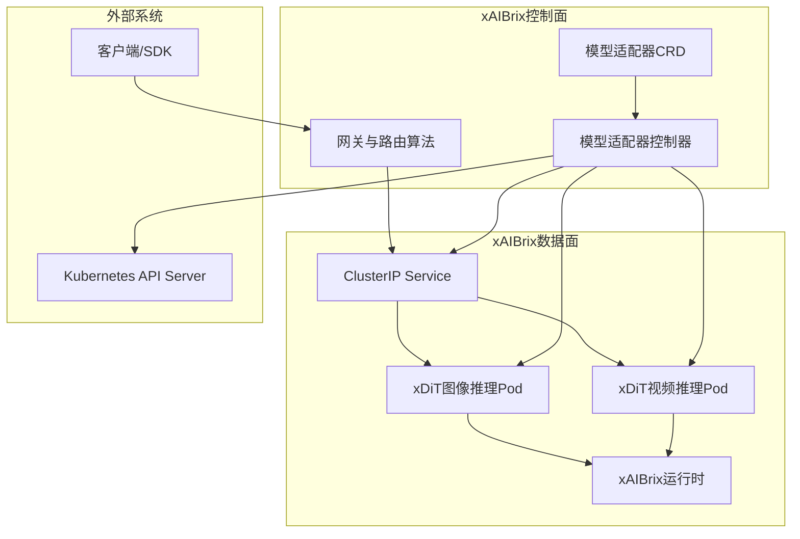
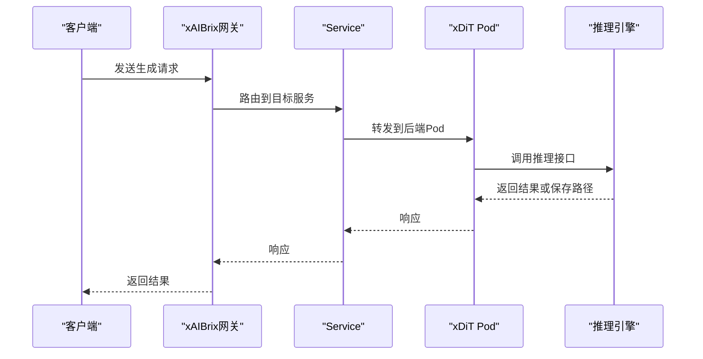
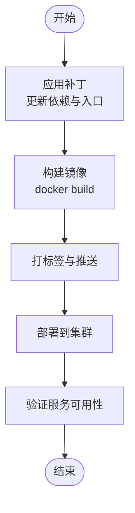
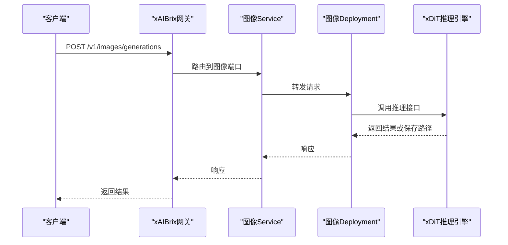
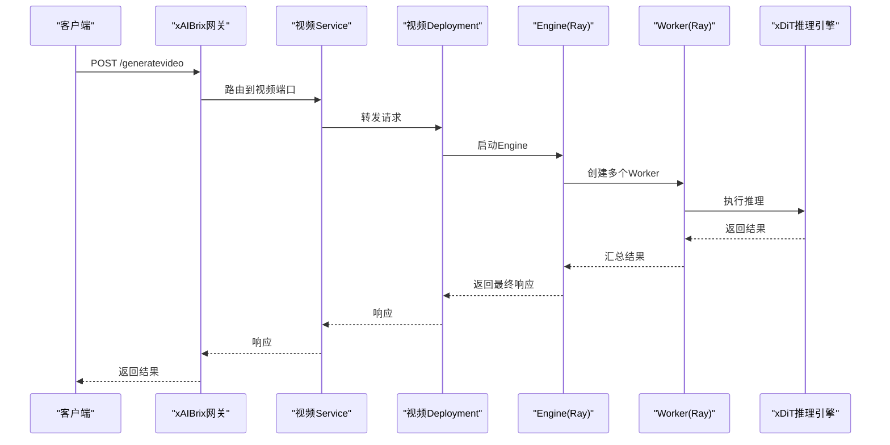
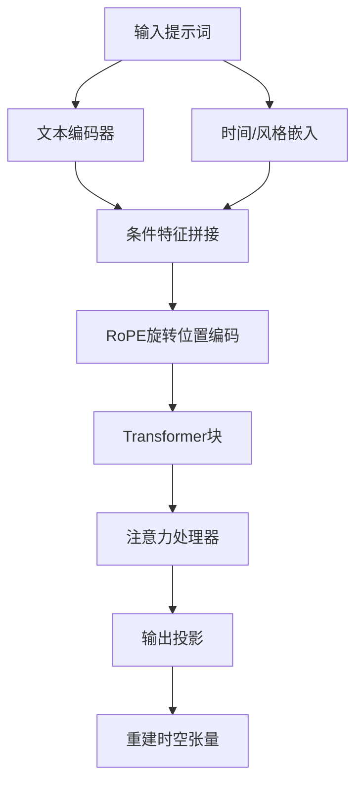
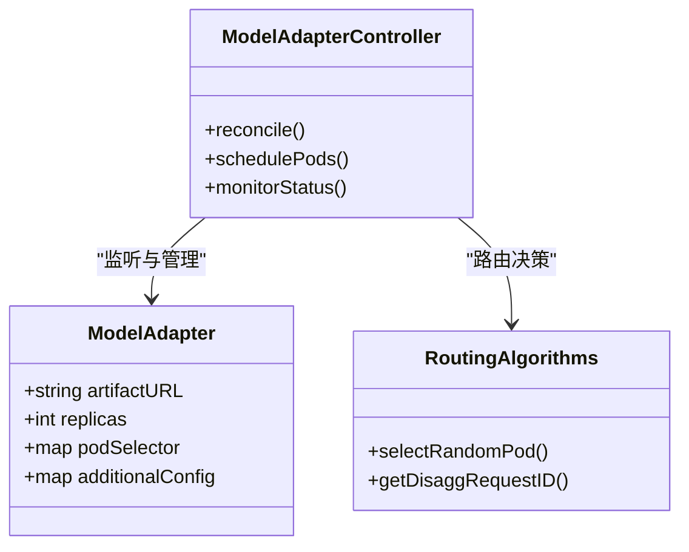
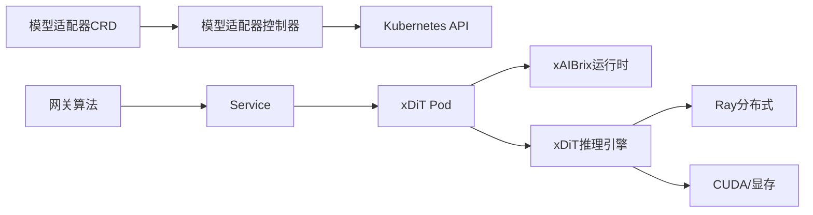

# xDiT集成与优化

<cite>
**本文引用的文件**
- [samples/multimodality/xDiT/README.md](file://samples/multimodality/xDiT/README.md)
- [samples/multimodality/xDiT/xDiT-integration/xdit-52e74e88d2332281eefe68894af02f805a1d2b4f.patch](file://samples/multimodality/xDiT/xDiT-integration/xdit-52e74e88d2332281eefe68894af02f805a1d2b4f.patch)
- [samples/multimodality/xDiT/image-generation/aibrix_vke_kv_image_hunyuanDiT.yaml](file://samples/multimodality/xDiT/image-generation/aibrix_vke_kv_image_hunyuanDiT.yaml)
- [samples/multimodality/xDiT/video-generation/aibrix_vke_staging_video_cogvideo_parallel.yaml](file://samples/multimodality/xDiT/video-generation/aibrix_vke_staging_video_cogvideo_parallel.yaml)
- [config/crd/model/model.aibrix.ai_modeladapters.yaml](file://config/crd/model/model.aibrix.ai_modeladapters.yaml)
- [pkg/controller/modeladapter/modeladapter_controller.go](file://pkg/controller/modeladapter/modeladapter_controller.go)
- [pkg/plugins/gateway/algorithms/util.go](file://pkg/plugins/gateway/algorithms/util.go)
</cite>

## 目录
1. [简介](#简介)
2. [项目结构](#项目结构)
3. [核心组件](#核心组件)
4. [架构总览](#架构总览)
5. [详细组件分析](#详细组件分析)
6. [依赖关系分析](#依赖关系分析)
7. [性能考量](#性能考量)
8. [故障排除指南](#故障排除指南)
9. [结论](#结论)
10. [附录](#附录)

## 简介
本指南面向希望将xAIBrix系统与xDiT多模态推理框架（图像与视频生成）进行深度集成的工程师与运维人员。文档围绕以下目标展开：
- 解析xDiT与xAIBrix的集成方式：补丁应用、镜像构建、部署配置与路由策略
- 深入介绍xDiT多模态架构设计：文本到图像/视频的特征融合与注意力机制
- 提供完整集成示例：从本地构建镜像到集群部署，再到A/B测试与流量路由
- 性能基准与内存优化：显存管理、分片并行与预热策略
- 故障排除：常见问题定位与修复建议

## 项目结构
xAIBrix通过自定义资源与控制器管理多模态模型的生命周期，结合网关算法实现请求路由与负载均衡。xDiT作为推理引擎以容器形式部署，并通过xAIBrix的模型适配器与服务发现机制接入现有流水线。

图表来源
- [config/crd/model/model.aibrix.ai_modeladapters.yaml:1-160](file://config/crd/model/model.aibrix.ai_modeladapters.yaml#L1-L160)
- [pkg/controller/modeladapter/modeladapter_controller.go:1-200](file://pkg/controller/modeladapter/modeladapter_controller.go#L1-L200)
- [samples/multimodality/xDiT/image-generation/aibrix_vke_kv_image_hunyuanDiT.yaml:1-130](file://samples/multimodality/xDiT/image-generation/aibrix_vke_kv_image_hunyuanDiT.yaml#L1-L130)
- [samples/multimodality/xDiT/video-generation/aibrix_vke_staging_video_cogvideo_parallel.yaml:1-136](file://samples/multimodality/xDiT/video-generation/aibrix_vke_staging_video_cogvideo_parallel.yaml#L1-L136)

章节来源
- [config/crd/model/model.aibrix.ai_modeladapters.yaml:1-160](file://config/crd/model/model.aibrix.ai_modeladapters.yaml#L1-L160)
- [pkg/controller/modeladapter/modeladapter_controller.go:1-200](file://pkg/controller/modeladapter/modeladapter_controller.go#L1-L200)

## 核心组件
- 模型适配器CRD与控制器：负责模型的声明式管理、实例调度与状态跟踪
- 网关与路由算法：根据请求特征选择合适的数据面Pod，支持随机与基于指标的策略
- xDiT推理引擎：图像与视频生成的高性能推理服务，支持分布式并行
- 部署清单：定义Deployment、Service与卷挂载，确保模型缓存与输出共享

章节来源
- [config/crd/model/model.aibrix.ai_modeladapters.yaml:1-160](file://config/crd/model/model.aibrix.ai_modeladapters.yaml#L1-L160)
- [pkg/controller/modeladapter/modeladapter_controller.go:1-200](file://pkg/controller/modeladapter/modeladapter_controller.go#L1-L200)
- [samples/multimodality/xDiT/README.md:1-203](file://samples/multimodality/xDiT/README.md#L1-L203)
- [samples/multimodality/xDiT/image-generation/aibrix_vke_kv_image_hunyuanDiT.yaml:1-130](file://samples/multimodality/xDiT/image-generation/aibrix_vke_kv_image_hunyuanDiT.yaml#L1-L130)
- [samples/multimodality/xDiT/video-generation/aibrix_vke_staging_video_cogvideo_parallel.yaml:1-136](file://samples/multimodality/xDiT/video-generation/aibrix_vke_staging_video_cogvideo_parallel.yaml#L1-L136)

## 架构总览
xAIBrix通过模型适配器CRD抽象多模态模型，控制器将其转换为可调度的Pod与Service；网关根据路由策略将请求转发至对应服务端口。xDiT推理引擎以FastAPI提供REST接口，支持图像与视频生成两种模式。

图表来源
- [samples/multimodality/xDiT/image-generation/aibrix_vke_kv_image_hunyuanDiT.yaml:108-130](file://samples/multimodality/xDiT/image-generation/aibrix_vke_kv_image_hunyuanDiT.yaml#L108-L130)
- [samples/multimodality/xDiT/video-generation/aibrix_vke_staging_video_cogvideo_parallel.yaml:113-136](file://samples/multimodality/xDiT/video-generation/aibrix_vke_staging_video_cogvideo_parallel.yaml#L113-L136)
- [samples/multimodality/xDiT/README.md:46-97](file://samples/multimodality/xDiT/README.md#L46-L97)

## 详细组件分析

### 补丁与镜像构建
- 补丁内容要点
  - 更新基础镜像版本与依赖安装
  - 移除旧依赖并引入新版本以提升兼容性
  - 替换xDiT启动脚本为新的入口点，新增视频推理入口
  - 引入FastAPI与uvicorn，统一HTTP服务栈
  - 修正序列长度参数以避免兼容性问题
  - 新增环形并行度参数以支持更大规模并行
- 镜像构建流程
  - 使用Dockerfile构建自定义xDiT镜像
  - 推送至企业镜像仓库并打标签
  - 在部署清单中引用该镜像

图表来源
- [samples/multimodality/xDiT/xDiT-integration/xdit-52e74e88d2332281eefe68894af02f805a1d2b4f.patch:1-699](file://samples/multimodality/xDiT/xDiT-integration/xdit-52e74e88d2332281eefe68894af02f805a1d2b4f.patch#L1-L699)
- [samples/multimodality/xDiT/README.md:15-26](file://samples/multimodality/xDiT/README.md#L15-L26)

章节来源
- [samples/multimodality/xDiT/xDiT-integration/xdit-52e74e88d2332281eefe68894af02f805a1d2b4f.patch:1-699](file://samples/multimodality/xDiT/xDiT-integration/xdit-52e74e88d2332281eefe68894af02f805a1d2b4f.patch#L1-L699)
- [samples/multimodality/xDiT/README.md:15-26](file://samples/multimodality/xDiT/README.md#L15-L26)

### 图像生成集成
- 关键配置
  - 单GPU部署：使用HunyuanDiT模型，端口6000
  - 模型下载：通过初始化容器从对象存储拉取模型
  - 输出共享：通过emptyDir共享生成结果
- 请求流程
  - 客户端向xAIBrix网关发起生成请求
  - 网关路由到图像服务端口
  - xDIT推理引擎执行生成并返回结果或保存路径

图表来源
- [samples/multimodality/xDiT/image-generation/aibrix_vke_kv_image_hunyuanDiT.yaml:1-130](file://samples/multimodality/xDiT/image-generation/aibrix_vke_kv_image_hunyuanDiT.yaml#L1-L130)
- [samples/multimodality/xDiT/README.md:46-97](file://samples/multimodality/xDiT/README.md#L46-L97)

章节来源
- [samples/multimodality/xDiT/image-generation/aibrix_vke_kv_image_hunyuanDiT.yaml:1-130](file://samples/multimodality/xDiT/image-generation/aibrix_vke_kv_image_hunyuanDiT.yaml#L1-L130)
- [samples/multimodality/xDiT/README.md:29-97](file://samples/multimodality/xDiT/README.md#L29-L97)

### 视频生成集成
- 关键配置
  - 多GPU并行：使用CogVideoX-2b，设置环形并行度与世界规模
  - 分布式推理：通过Ray远程工作进程承载多个xDiT实例
  - 内存优化：启用CUDA内存分配配置与VAE平铺
- 请求流程
  - 客户端发送视频生成请求（可指定帧数、分辨率等）
  - 网关路由到视频服务端口
  - 推理引擎执行生成并将结果保存到磁盘或返回base64编码

图表来源
- [samples/multimodality/xDiT/video-generation/aibrix_vke_staging_video_cogvideo_parallel.yaml:1-136](file://samples/multimodality/xDiT/video-generation/aibrix_vke_staging_video_cogvideo_parallel.yaml#L1-L136)
- [samples/multimodality/xDiT/xDiT-integration/xdit-52e74e88d2332281eefe68894af02f805a1d2b4f.patch:80-445](file://samples/multimodality/xDiT/xDiT-integration/xdit-52e74e88d2332281eefe68894af02f805a1d2b4f.patch#L80-L445)

章节来源
- [samples/multimodality/xDiT/video-generation/aibrix_vke_staging_video_cogvideo_parallel.yaml:1-136](file://samples/multimodality/xDiT/video-generation/aibrix_vke_staging_video_cogvideo_parallel.yaml#L1-L136)
- [samples/multimodality/xDiT/xDiT-integration/xdit-52e74e88d2332281eefe68894af02f805a1d2b4f.patch:80-445](file://samples/multimodality/xDiT/xDiT-integration/xdit-52e74e88d2332281eefe68894af02f805a1d2b4f.patch#L80-L445)

### 多模态架构设计与注意力机制
- 文本到图像/视频的特征融合
  - 文本编码器与时间/风格嵌入结合，形成条件特征
  - 通过RoPE旋转位置编码对时空特征进行编码
  - 条件嵌入按序列并行维度切分，保证跨设备一致性
- 注意力机制
  - 使用专门的注意力处理器（如HunyuanVideoAttnProcessor2_0）实现高效注意力计算
  - 支持梯度检查点与序列并行，降低显存占用
  - 在CFG组内进行条件分支并行，提升吞吐

图表来源
- [samples/multimodality/xDiT/xDiT-integration/xdit-52e74e88d2332281eefe68894af02f805a1d2b4f.patch:496-699](file://samples/multimodality/xDiT/xDiT-integration/xdit-52e74e88d2332281eefe68894af02f805a1d2b4f.patch#L496-L699)

章节来源
- [samples/multimodality/xDiT/xDiT-integration/xdit-52e74e88d2332281eefe68894af02f805a1d2b4f.patch:496-699](file://samples/multimodality/xDiT/xDiT-integration/xdit-52e74e88d2332281eefe68894af02f805a1d2b4f.patch#L496-L699)

### 模型适配器与路由策略
- 模型适配器CRD
  - 定义模型路径、副本数、节点选择器等关键字段
  - 控制器负责监听CRD变更并驱动K8s资源创建
- 路由策略
  - 支持随机策略与基于指标的策略
  - 当无合适Pod时回退到随机选择，保障可用性

图表来源
- [config/crd/model/model.aibrix.ai_modeladapters.yaml:46-100](file://config/crd/model/model.aibrix.ai_modeladapters.yaml#L46-L100)
- [pkg/controller/modeladapter/modeladapter_controller.go:1-200](file://pkg/controller/modeladapter/modeladapter_controller.go#L1-L200)
- [pkg/plugins/gateway/algorithms/util.go:1-154](file://pkg/plugins/gateway/algorithms/util.go#L1-L154)

章节来源
- [config/crd/model/model.aibrix.ai_modeladapters.yaml:1-160](file://config/crd/model/model.aibrix.ai_modeladapters.yaml#L1-L160)
- [pkg/controller/modeladapter/modeladapter_controller.go:1-200](file://pkg/controller/modeladapter/modeladapter_controller.go#L1-L200)
- [pkg/plugins/gateway/algorithms/util.go:121-133](file://pkg/plugins/gateway/algorithms/util.go#L121-L133)

## 依赖关系分析
- 组件耦合
  - 模型适配器控制器与K8s API紧密耦合，负责CRD状态与Pod生命周期管理
  - 网关算法与Pod就绪状态解耦，具备回退策略
  - xDIT推理引擎通过FastAPI与xAIBrix运行时解耦
- 外部依赖
  - 对象存储用于模型下载
  - Ray用于分布式推理工作进程管理
  - CUDA与PyTorch生态用于加速推理

图表来源
- [config/crd/model/model.aibrix.ai_modeladapters.yaml:1-160](file://config/crd/model/model.aibrix.ai_modeladapters.yaml#L1-L160)
- [pkg/controller/modeladapter/modeladapter_controller.go:1-200](file://pkg/controller/modeladapter/modeladapter_controller.go#L1-L200)
- [samples/multimodality/xDiT/video-generation/aibrix_vke_staging_video_cogvideo_parallel.yaml:58-72](file://samples/multimodality/xDiT/video-generation/aibrix_vke_staging_video_cogvideo_parallel.yaml#L58-L72)
- [samples/multimodality/xDiT/xDiT-integration/xdit-52e74e88d2332281eefe68894af02f805a1d2b4f.patch:80-445](file://samples/multimodality/xDiT/xDiT-integration/xdit-52e74e88d2332281eefe68894af02f805a1d2b4f.patch#L80-L445)

章节来源
- [samples/multimodality/xDiT/video-generation/aibrix_vke_staging_video_cogvideo_parallel.yaml:1-136](file://samples/multimodality/xDiT/video-generation/aibrix_vke_staging_video_cogvideo_parallel.yaml#L1-L136)
- [samples/multimodality/xDiT/xDiT-integration/xdit-52e74e88d2332281eefe68894af02f805a1d2b4f.patch:80-445](file://samples/multimodality/xDiT/xDiT-integration/xdit-52e74e88d2332281eefe68894af02f805a1d2b4f.patch#L80-L445)

## 性能考量
- 显存与内存优化
  - 设置CUDA内存分配配置，限制最大分割块大小
  - 为每个进程设置显存占比，预留空间给其他组件
  - VAE启用平铺以降低显存峰值
- 并行策略
  - 环形并行度与Ulysses并行度协同，提升吞吐
  - 序列并行与CFG并行结合，平衡延迟与资源利用率
- 预热与清理
  - 推理前进行小尺寸预热，释放中间缓存
  - 生成后主动清空CUDA缓存，回收显存

章节来源
- [samples/multimodality/xDiT/xDiT-integration/xdit-52e74e88d2332281eefe68894af02f805a1d2b4f.patch:144-265](file://samples/multimodality/xDiT/xDiT-integration/xdit-52e74e88d2332281eefe68894af02f805a1d2b4f.patch#L144-L265)
- [samples/multimodality/xDiT/video-generation/aibrix_vke_staging_video_cogvideo_parallel.yaml:66-79](file://samples/multimodality/xDiT/video-generation/aibrix_vke_staging_video_cogvideo_parallel.yaml#L66-L79)

## 故障排除指南
- 模型加载失败
  - 检查初始化容器日志与对象存储凭据
  - 确认模型路径与镜像内路径一致
- 推理超时或OOM
  - 降低分辨率或帧数，减少num_inference_steps
  - 启用VAE平铺与显存占比限制
  - 调整并行度，避免过度切分导致通信开销增大
- 路由异常
  - 检查Service端口映射与目标端口
  - 若无可用Pod，确认控制器是否正确创建Pod与EndpointSlice
- 输出路径问题
  - 确保共享卷挂载正确，路径存在且有写权限
  - 检查xAIBrix运行时日志，确认输出文件已生成

章节来源
- [samples/multimodality/xDiT/image-generation/aibrix_vke_kv_image_hunyuanDiT.yaml:78-94](file://samples/multimodality/xDiT/image-generation/aibrix_vke_kv_image_hunyuanDiT.yaml#L78-L94)
- [samples/multimodality/xDiT/README.md:46-97](file://samples/multimodality/xDiT/README.md#L46-L97)
- [pkg/controller/modeladapter/modeladapter_controller.go:78-112](file://pkg/controller/modeladapter/modeladapter_controller.go#L78-L112)

## 结论
通过补丁改造与镜像构建，xAIBrix成功将xDiT多模态推理引擎纳入其统一的多模态推理流水线。借助模型适配器CRD与控制器，系统实现了模型的声明式管理与自动调度；结合网关路由策略与分布式并行技术，能够在保证性能的同时提升可用性与扩展性。配合显存优化与预热清理策略，xDiT在xAIBrix上可稳定支撑高质量图像与视频生成任务。

## 附录
- 快速开始步骤
  - 下载并应用补丁，构建自定义xDiT镜像
  - 准备模型与部署清单，应用到集群
  - 通过xAIBrix网关发送生成请求，验证输出
- 参考示例
  - 图像生成：参考图像生成部署清单与示例请求
  - 视频生成：参考视频生成部署清单与分布式参数

章节来源
- [samples/multimodality/xDiT/README.md:1-203](file://samples/multimodality/xDiT/README.md#L1-L203)
- [samples/multimodality/xDiT/image-generation/aibrix_vke_kv_image_hunyuanDiT.yaml:1-130](file://samples/multimodality/xDiT/image-generation/aibrix_vke_kv_image_hunyuanDiT.yaml#L1-L130)
- [samples/multimodality/xDiT/video-generation/aibrix_vke_staging_video_cogvideo_parallel.yaml:1-136](file://samples/multimodality/xDiT/video-generation/aibrix_vke_staging_video_cogvideo_parallel.yaml#L1-L136)