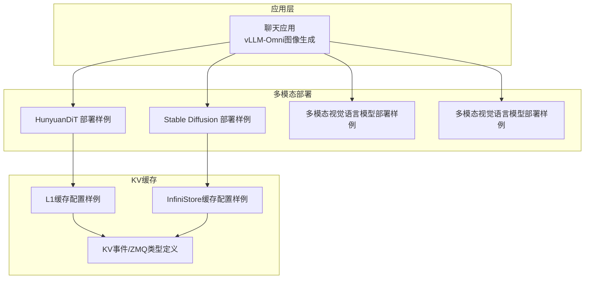
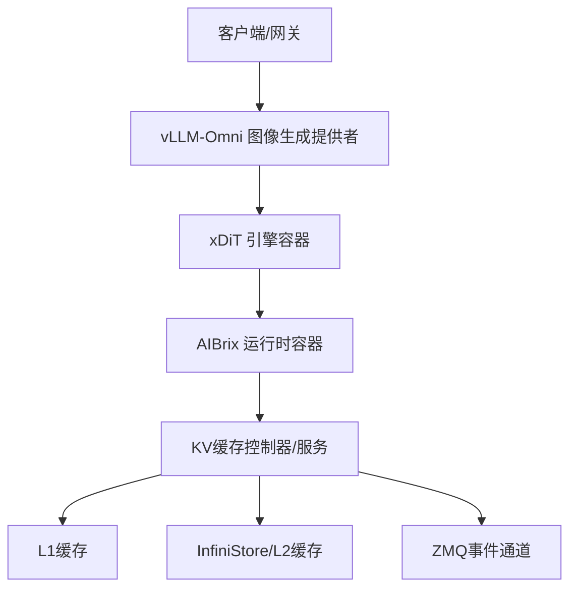
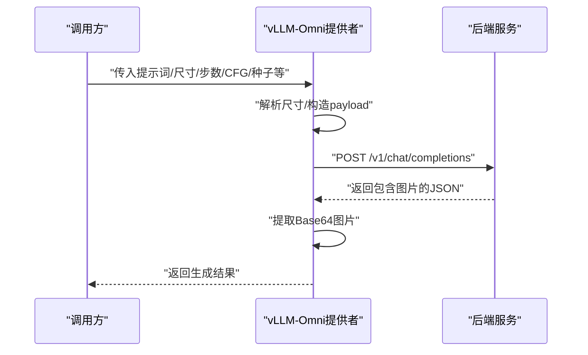
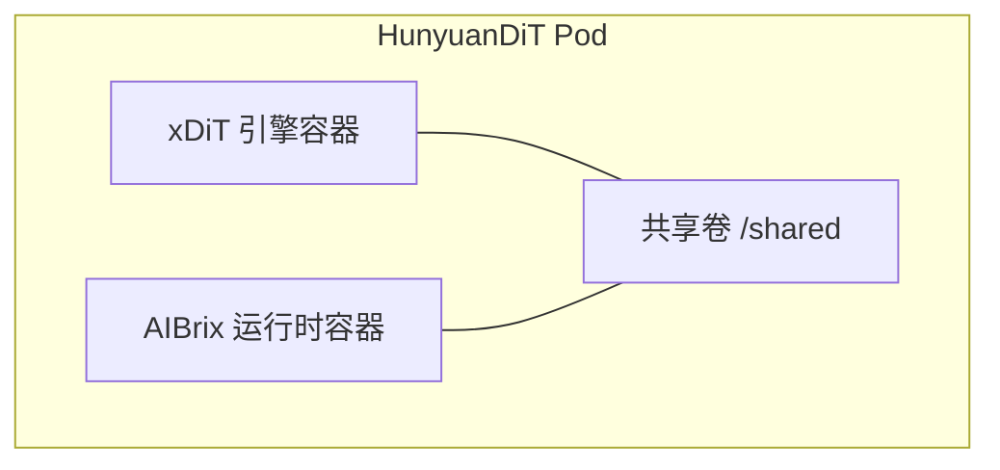
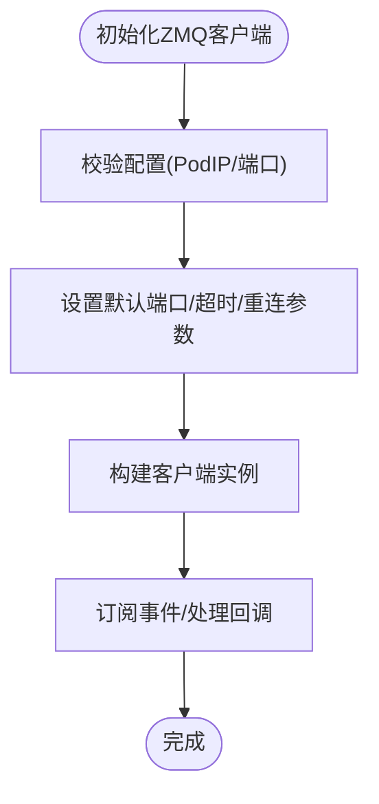
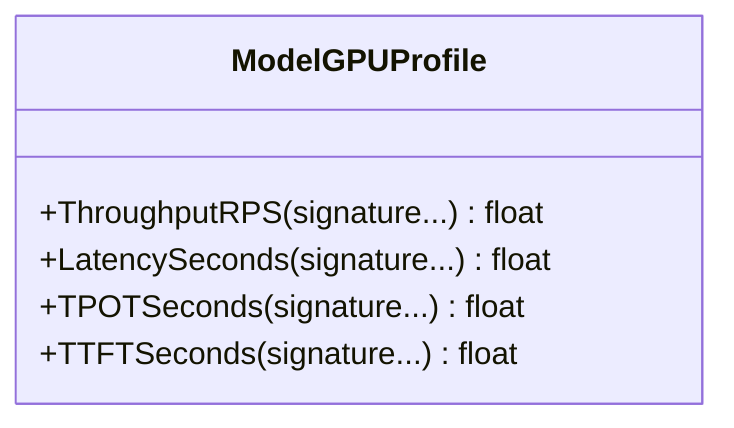
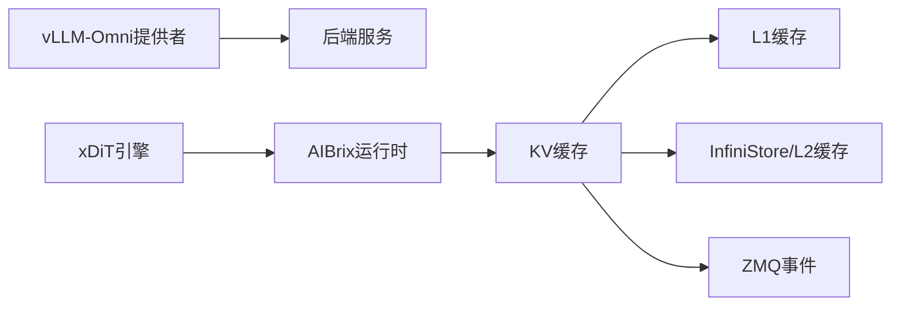

# 图像生成多模态

<cite>
**本文引用的文件**
- [apps/chat/api/services/providers/vllm_omni.py](file://apps/chat/api/services/providers/vllm_omni.py)
- [samples/multimodality/xDiT/image-generation/aibrix_vke_kv_image_hunyuanDiT.yaml](file://samples/multimodality/xDiT/image-generation/aibrix_vke_kv_image_hunyuanDiT.yaml)
- [samples/multimodality/xDiT/image-generation/aibrix_vke_kv_image_sd.yaml](file://samples/multimodality/xDiT/image-generation/aibrix_vke_kv_image_sd.yaml)
- [samples/kvcache/l1cache/vllm.yaml](file://samples/kvcache/l1cache/vllm.yaml)
- [samples/kvcache/infinistore/vllm.yaml](file://samples/kvcache/infinistore/vllm.yaml)
- [pkg/cache/kvcache/types.go](file://pkg/cache/kvcache/types.go)
- [pkg/cache/model_gpu_profile.go](file://pkg/cache/model_gpu_profile.go)
- [samples/multimodality/vllm/llava-7b.yaml](file://samples/multimodality/vllm/llava-7b.yaml)
- [samples/multimodality/vllm/qwen-vl.yaml](file://samples/multimodality/vllm/qwen-vl.yaml)
</cite>

## 目录
1. [简介](#简介)
2. [项目结构](#项目结构)
3. [核心组件](#核心组件)
4. [架构总览](#架构总览)
5. [详细组件分析](#详细组件分析)
6. [依赖分析](#依赖分析)
7. [性能考虑](#性能考虑)
8. [故障排查指南](#故障排查指南)
9. [结论](#结论)
10. [附录](#附录)

## 简介
本技术文档面向AIBrix图像生成多模态系统，聚焦于扩散模型（如HunyuanDiT与Stable Diffusion）在AIBrix中的部署、配置与优化。内容覆盖以下关键主题：
- 扩散模型的部署配置与并行化方案
- 显存管理、批处理大小与推理速度优化策略
- 文本到图像生成工作流：提示词处理、噪声调度与图像重建
- 基于KV缓存框架的多模态图像生成性能提升
- 实际生成示例、参数调优指南与质量评估方法

## 项目结构
围绕图像生成与多模态能力，本仓库的关键目录与文件如下：
- 应用层：聊天应用中集成的vLLM-Omni图像生成功能，负责接收提示词、构造请求并返回生成结果
- 多模态示例：HunyuanDiT与Stable Diffusion的部署样例，展示如何通过xDiT引擎与AIBrix运行时协同
- KV缓存：提供L1/L2离线缓存与InfiniStore RDMA加速的KV缓存配置样例
- 缓存与调度：KV事件、ZMQ客户端配置、模型GPU性能画像等支撑模块

**图表来源**
- [apps/chat/api/services/providers/vllm_omni.py:238-275](file://apps/chat/api/services/providers/vllm_omni.py#L238-L275)
- [samples/multimodality/xDiT/image-generation/aibrix_vke_kv_image_hunyuanDiT.yaml:1-130](file://samples/multimodality/xDiT/image-generation/aibrix_vke_kv_image_hunyuanDiT.yaml#L1-L130)
- [samples/multimodality/xDiT/image-generation/aibrix_vke_kv_image_sd.yaml:1-130](file://samples/multimodality/xDiT/image-generation/aibrix_vke_kv_image_sd.yaml#L1-L130)
- [samples/kvcache/l1cache/vllm.yaml:1-145](file://samples/kvcache/l1cache/vllm.yaml#L1-L145)
- [samples/kvcache/infinistore/vllm.yaml:1-170](file://samples/kvcache/infinistore/vllm.yaml#L1-L170)
- [pkg/cache/kvcache/types.go:1-93](file://pkg/cache/kvcache/types.go#L1-L93)

**章节来源**
- [apps/chat/api/services/providers/vllm_omni.py:238-275](file://apps/chat/api/services/providers/vllm_omni.py#L238-L275)
- [samples/multimodality/xDiT/image-generation/aibrix_vke_kv_image_hunyuanDiT.yaml:1-130](file://samples/multimodality/xDiT/image-generation/aibrix_vke_kv_image_hunyuanDiT.yaml#L1-L130)
- [samples/multimodality/xDiT/image-generation/aibrix_vke_kv_image_sd.yaml:1-130](file://samples/multimodality/xDiT/image-generation/aibrix_vke_kv_image_sd.yaml#L1-L130)
- [samples/kvcache/l1cache/vllm.yaml:1-145](file://samples/kvcache/l1cache/vllm.yaml#L1-L145)
- [samples/kvcache/infinistore/vllm.yaml:1-170](file://samples/kvcache/infinistore/vllm.yaml#L1-L170)
- [pkg/cache/kvcache/types.go:1-93](file://pkg/cache/kvcache/types.go#L1-L93)

## 核心组件
- vLLM-Omni图像生成提供者：封装OpenAI兼容接口，支持图像生成参数（尺寸、步数、CFG缩放、种子等），并从响应中提取生成图片
- xDiT引擎与AIBrix运行时：通过xDiT容器与AIBrix运行时容器组合，实现多模态推理与服务暴露
- KV缓存框架：提供ZMQ事件处理、发布/路由端口、超时与重连策略，以及L1/L2缓存配置
- 模型GPU性能画像：提供吞吐、延迟、TPOT、TTFT等指标查询接口，用于调度与容量规划

**章节来源**
- [apps/chat/api/services/providers/vllm_omni.py:238-275](file://apps/chat/api/services/providers/vllm_omni.py#L238-L275)
- [samples/multimodality/xDiT/image-generation/aibrix_vke_kv_image_hunyuanDiT.yaml:58-94](file://samples/multimodality/xDiT/image-generation/aibrix_vke_kv_image_hunyuanDiT.yaml#L58-L94)
- [samples/multimodality/xDiT/image-generation/aibrix_vke_kv_image_sd.yaml:58-94](file://samples/multimodality/xDiT/image-generation/aibrix_vke_kv_image_sd.yaml#L58-L94)
- [pkg/cache/kvcache/types.go:23-92](file://pkg/cache/kvcache/types.go#L23-L92)
- [pkg/cache/model_gpu_profile.go:167-196](file://pkg/cache/model_gpu_profile.go#L167-L196)

## 架构总览
下图展示了从应用层到xDiT引擎与KV缓存的整体架构：

**图表来源**
- [apps/chat/api/services/providers/vllm_omni.py:238-275](file://apps/chat/api/services/providers/vllm_omni.py#L238-L275)
- [samples/multimodality/xDiT/image-generation/aibrix_vke_kv_image_hunyuanDiT.yaml:58-94](file://samples/multimodality/xDiT/image-generation/aibrix_vke_kv_image_hunyuanDiT.yaml#L58-L94)
- [samples/multimodality/xDiT/image-generation/aibrix_vke_kv_image_sd.yaml:58-94](file://samples/multimodality/xDiT/image-generation/aibrix_vke_kv_image_sd.yaml#L58-L94)
- [samples/kvcache/l1cache/vllm.yaml:88-100](file://samples/kvcache/l1cache/vllm.yaml#L88-L100)
- [samples/kvcache/infinistore/vllm.yaml:94-118](file://samples/kvcache/infinistore/vllm.yaml#L94-L118)
- [pkg/cache/kvcache/types.go:23-92](file://pkg/cache/kvcache/types.go#L23-L92)

## 详细组件分析

### 组件A：vLLM-Omni图像生成提供者
- 职责：将用户提示词转换为图像生成请求，设置分辨率、采样步数、CFG缩放、种子等参数，并解析返回的Base64图片数据
- 关键流程：
  - 解析尺寸字符串，构造payload
  - 可选参数：负向提示词、输出数量、随机种子
  - 发送HTTP请求至后端服务，校验状态码并解析响应
- 参数要点：
  - 尺寸：宽×高
  - 步数：控制采样迭代次数
  - CFG缩放：控制条件强度
  - 种子：可复现实验结果

**图表来源**
- [apps/chat/api/services/providers/vllm_omni.py:238-275](file://apps/chat/api/services/providers/vllm_omni.py#L238-L275)

**章节来源**
- [apps/chat/api/services/providers/vllm_omni.py:238-275](file://apps/chat/api/services/providers/vllm_omni.py#L238-L275)

### 组件B：HunyuanDiT与Stable Diffusion部署
- HunyuanDiT部署：使用xDiT引擎容器与AIBrix运行时容器组合，通过共享卷进行中间数据传递；服务端口分别为6000（模型服务）与8080（运行时）
- Stable Diffusion部署：采用相同架构，模型路径指向SD 3.5 Large
- 关键点：
  - 使用initContainer下载模型
  - 通过hostPath挂载模型目录
  - 通过nodeSelector绑定节点

**图表来源**
- [samples/multimodality/xDiT/image-generation/aibrix_vke_kv_image_hunyuanDiT.yaml:58-103](file://samples/multimodality/xDiT/image-generation/aibrix_vke_kv_image_hunyuanDiT.yaml#L58-L103)

**章节来源**
- [samples/multimodality/xDiT/image-generation/aibrix_vke_kv_image_hunyuanDiT.yaml:1-130](file://samples/multimodality/xDiT/image-generation/aibrix_vke_kv_image_hunyuanDiT.yaml#L1-L130)
- [samples/multimodality/xDiT/image-generation/aibrix_vke_kv_image_sd.yaml:1-130](file://samples/multimodality/xDiT/image-generation/aibrix_vke_kv_image_sd.yaml#L1-L130)

### 组件C：KV缓存框架与ZMQ事件
- ZMQ客户端配置：包含发布/路由端口、轮询与重播超时、重连间隔与最大重连间隔、事件通道缓冲区大小
- 校验规则：校验Pod IP格式、端口范围
- L1缓存：启用开关、淘汰策略、容量（单位GB）
- InfiniStore：启用开关、RDMA连接类型、可见设备列表、元服务地址与集群元信息键

**图表来源**
- [pkg/cache/kvcache/types.go:23-92](file://pkg/cache/kvcache/types.go#L23-L92)

**章节来源**
- [pkg/cache/kvcache/types.go:23-92](file://pkg/cache/kvcache/types.go#L23-L92)
- [samples/kvcache/l1cache/vllm.yaml:88-100](file://samples/kvcache/l1cache/vllm.yaml#L88-L100)
- [samples/kvcache/infinistore/vllm.yaml:94-118](file://samples/kvcache/infinistore/vllm.yaml#L94-L118)

### 组件D：模型GPU性能画像
- 提供吞吐（RPS）、端到端延迟（秒）、单Token处理时间（TPOT）、首次Token时间（TTFT）等指标查询
- 支持根据特征签名获取对应指标值

**图表来源**
- [pkg/cache/model_gpu_profile.go:167-196](file://pkg/cache/model_gpu_profile.go#L167-L196)

**章节来源**
- [pkg/cache/model_gpu_profile.go:167-196](file://pkg/cache/model_gpu_profile.go#L167-L196)

### 组件E：多模态视觉语言模型（可选参考）
- LLaVA-7B与Qwen-VL部署样例展示了图像/视频/音频资源拉取超时配置，便于理解多模态输入的资源准备与访问策略

**章节来源**
- [samples/multimodality/vllm/llava-7b.yaml:79-87](file://samples/multimodality/vllm/llava-7b.yaml#L79-L87)
- [samples/multimodality/vllm/qwen-vl.yaml:83-91](file://samples/multimodality/vllm/qwen-vl.yaml#L83-L91)

## 依赖分析
- 组件耦合：
  - vLLM-Omni提供者依赖后端服务接口，参数直接影响生成质量与速度
  - xDiT部署依赖AIBrix运行时容器与共享卷，确保引擎与运行时协同
  - KV缓存通过ZMQ事件通道与控制器交互，L1/L2缓存作为离线加速层
- 外部依赖：
  - vLLM服务端（通过OpenAI兼容接口）
  - InfiniStore/Redis等外部缓存与元服务
  - Kubernetes资源（Deployment/Service）

**图表来源**
- [apps/chat/api/services/providers/vllm_omni.py:238-275](file://apps/chat/api/services/providers/vllm_omni.py#L238-L275)
- [samples/multimodality/xDiT/image-generation/aibrix_vke_kv_image_hunyuanDiT.yaml:58-94](file://samples/multimodality/xDiT/image-generation/aibrix_vke_kv_image_hunyuanDiT.yaml#L58-L94)
- [samples/kvcache/l1cache/vllm.yaml:88-100](file://samples/kvcache/l1cache/vllm.yaml#L88-L100)
- [samples/kvcache/infinistore/vllm.yaml:94-118](file://samples/kvcache/infinistore/vllm.yaml#L94-L118)
- [pkg/cache/kvcache/types.go:23-92](file://pkg/cache/kvcache/types.go#L23-L92)

**章节来源**
- [apps/chat/api/services/providers/vllm_omni.py:238-275](file://apps/chat/api/services/providers/vllm_omni.py#L238-L275)
- [samples/multimodality/xDiT/image-generation/aibrix_vke_kv_image_hunyuanDiT.yaml:58-94](file://samples/multimodality/xDiT/image-generation/aibrix_vke_kv_image_hunyuanDiT.yaml#L58-L94)
- [samples/kvcache/l1cache/vllm.yaml:88-100](file://samples/kvcache/l1cache/vllm.yaml#L88-L100)
- [samples/kvcache/infinistore/vllm.yaml:94-118](file://samples/kvcache/infinistore/vllm.yaml#L94-L118)
- [pkg/cache/kvcache/types.go:23-92](file://pkg/cache/kvcache/types.go#L23-L92)

## 性能考虑
- 显存管理
  - 合理设置max-model-len与swap-space，避免OOM
  - 在vLLM部署中禁用或启用chunked prefill以平衡吞吐与延迟
- 批处理大小与并发
  - 通过后端服务的并发参数与队列策略控制每批次请求数
  - 结合KV缓存命中率与L1/L2容量，动态调整批大小
- 推理速度优化
  - 启用前缀缓存与KV缓存，减少重复计算
  - 对于大模型，优先使用InfiniStore结合RDMA提升跨节点传输效率
- 参数调优建议
  - 步数：根据图像复杂度与质量目标折中
  - CFG缩放：在真实CFG与条件CFG之间权衡
  - 种子：固定种子便于复现与A/B对比
- 质量评估
  - 客观指标：吞吐（RPS）、延迟（端到端/TTFT/TPOT）
  - 主观评估：视觉质量、一致性与多样性

[本节为通用指导，不直接分析具体文件]

## 故障排查指南
- vLLM-Omni请求失败
  - 检查后端服务可达性与状态码
  - 校验请求参数（尺寸、步数、CFG等）是否合理
- KV缓存配置错误
  - 校验Pod IP格式与端口范围
  - 检查ZMQ轮询与重播超时、重连间隔是否合适
- 缓存未生效
  - 确认L1/L2缓存开关与容量设置
  - InfiniStore需检查RDMA设备与可见设备列表

**章节来源**
- [apps/chat/api/services/providers/vllm_omni.py:268-274](file://apps/chat/api/services/providers/vllm_omni.py#L268-L274)
- [pkg/cache/kvcache/types.go:72-92](file://pkg/cache/kvcache/types.go#L72-L92)
- [samples/kvcache/l1cache/vllm.yaml:88-100](file://samples/kvcache/l1cache/vllm.yaml#L88-L100)
- [samples/kvcache/infinistore/vllm.yaml:94-118](file://samples/kvcache/infinistore/vllm.yaml#L94-L118)

## 结论
AIBrix为图像生成多模态提供了从部署到性能优化的完整方案：通过vLLM-Omni提供统一的图像生成接口，借助xDiT引擎与AIBrix运行时实现多模态推理，配合KV缓存框架（L1/L2/InfiniStore）显著降低延迟并提升吞吐。结合模型GPU性能画像与合理的参数调优，可在不同硬件与负载条件下获得稳定且高质量的生成效果。

[本节为总结性内容，不直接分析具体文件]

## 附录
- 实际生成示例
  - 使用vLLM-Omni提供者，传入提示词、尺寸、步数、CFG缩放与种子，即可获得Base64图片
- 并行化部署方案
  - 通过xDiT部署样例与AIBrix运行时组合，结合L1/L2缓存与ZMQ事件通道，实现多副本与跨节点扩展
- 参数调优清单
  - 尺寸、步数、CFG缩放、种子、批大小、并发度、缓存容量与策略
- 质量评估方法
  - 吞吐（RPS）、端到端延迟、首次Token时间、单Token处理时间

[本节为概览性内容，不直接分析具体文件]