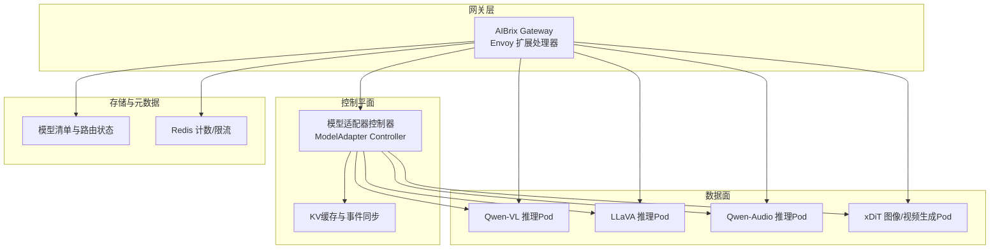
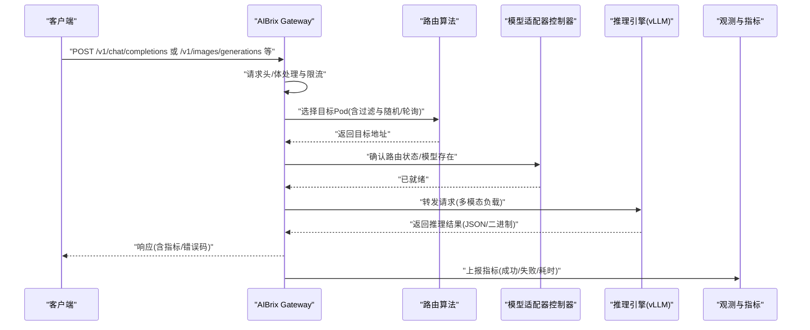
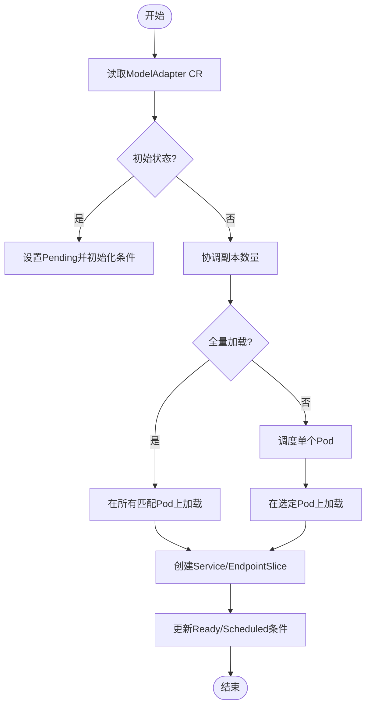
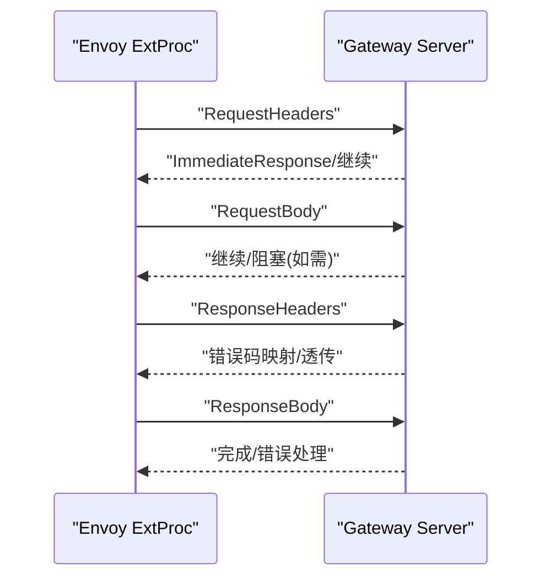
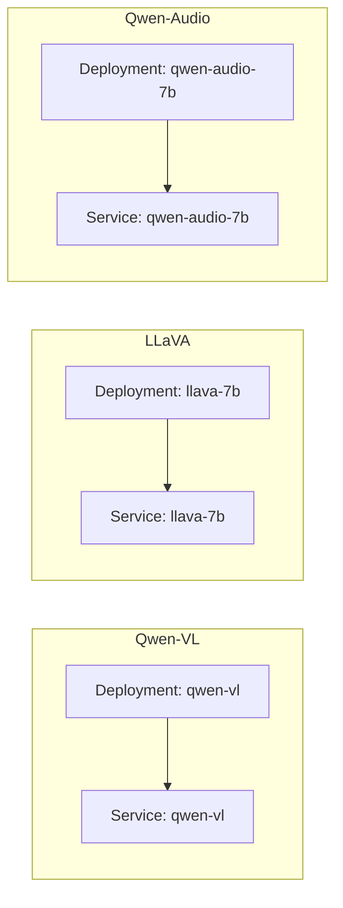
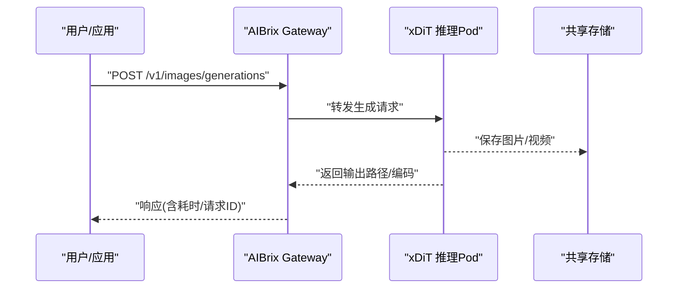
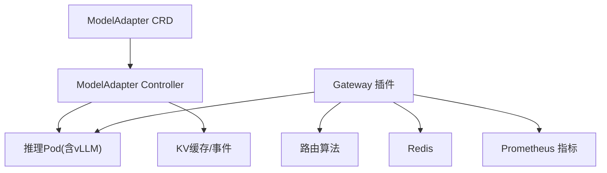

# 多模态推理

<cite>
**本文引用的文件**
- [README.md](file://README.md)
- [samples/multimodality/vllm/README.md](file://samples/multimodality/vllm/README.md)
- [samples/multimodality/vllm/qwen-vl.yaml](file://samples/multimodality/vllm/qwen-vl.yaml)
- [samples/multimodality/vllm/llava-7b.yaml](file://samples/multimodality/vllm/llava-7b.yaml)
- [samples/multimodality/vllm/qwen-audio.yaml](file://samples/multimodality/vllm/qwen-audio.yaml)
- [samples/multimodality/xDiT/README.md](file://samples/multimodality/xDiT/README.md)
- [pkg/controller/modeladapter/modeladapter_controller.go](file://pkg/controller/modeladapter/modeladapter_controller.go)
- [pkg/plugins/gateway/gateway.go](file://pkg/plugins/gateway/gateway.go)
- [api/model/v1alpha1/modeladapter_types.go](file://api/model/v1alpha1/modeladapter_types.go)
</cite>

## 目录
1. [简介](#简介)
2. [项目结构](#项目结构)
3. [核心组件](#核心组件)
4. [架构总览](#架构总览)
5. [详细组件分析](#详细组件分析)
6. [依赖关系分析](#依赖关系分析)
7. [性能考量](#性能考量)
8. [故障排查指南](#故障排查指南)
9. [结论](#结论)
10. [附录](#附录)

## 简介
本指南面向希望在AIBrix平台上构建与运维多模态推理系统的工程师与架构师。文档聚焦于统一的文本、图像、音频、视频等多模态推理架构与处理流程，覆盖从模型部署、资源分配到性能优化的全链路实践，并提供可直接落地的配置模板与端到端示例，帮助快速搭建AI绘画、视频生成、语音合成等多模态应用系统。

## 项目结构
AIBrix采用云原生架构，围绕Kubernetes与Gateway扩展（Envoy）实现统一的推理入口与路由调度。多模态能力通过vLLM引擎与自定义适配器控制器协同完成，结合KV缓存与指标监控，形成高可用、可观测的推理平台。

图示来源
- [pkg/plugins/gateway/gateway.go:333-360](file://pkg/plugins/gateway/gateway.go#L333-L360)
- [pkg/controller/modeladapter/modeladapter_controller.go:581-618](file://pkg/controller/modeladapter/modeladapter_controller.go#L581-L618)
- [samples/multimodality/vllm/qwen-vl.yaml:1-136](file://samples/multimodality/vllm/qwen-vl.yaml#L1-L136)
- [samples/multimodality/vllm/llava-7b.yaml:1-132](file://samples/multimodality/vllm/llava-7b.yaml#L1-L132)
- [samples/multimodality/vllm/qwen-audio.yaml:1-128](file://samples/multimodality/vllm/qwen-audio.yaml#L1-L128)

章节来源
- [README.md:41-48](file://README.md#L41-L48)

## 核心组件
- 模型适配器控制器：负责根据ModelAdapter CRD在目标Pod上加载/卸载多模态模型，管理实例列表与状态，支持单点或全量加载策略。
- 网关插件：基于Envoy外部处理器扩展，实现请求头/体处理、响应头/体处理、速率限制、路由选择与错误处理，统一OpenAI兼容接口。
- 多模态模型部署：通过Deployment+Service暴露vLLM引擎，支持图像/视频/音频多模态输入与输出。
- KV缓存与事件同步：跨引擎共享KV缓存，降低重复计算成本，提升吞吐。
- 指标与可观测性：Prometheus指标、HTTP模型列表接口、路由状态校验，便于运维与容量规划。

章节来源
- [pkg/controller/modeladapter/modeladapter_controller.go:1-120](file://pkg/controller/modeladapter/modeladapter_controller.go#L1-L120)
- [pkg/plugins/gateway/gateway.go:62-121](file://pkg/plugins/gateway/gateway.go#L62-L121)
- [api/model/v1alpha1/modeladapter_types.go:26-61](file://api/model/v1alpha1/modeladapter_types.go#L26-L61)

## 架构总览
下图展示了AIBrix多模态推理的关键交互路径：客户端经由Gateway进入，控制器负责模型实例化与路由选择，目标Pod执行多模态推理，返回结果并记录指标。

图示来源
- [pkg/plugins/gateway/gateway.go:238-303](file://pkg/plugins/gateway/gateway.go#L238-L303)
- [pkg/plugins/gateway/gateway.go:333-360](file://pkg/plugins/gateway/gateway.go#L333-L360)
- [pkg/controller/modeladapter/modeladapter_controller.go:417-493](file://pkg/controller/modeladapter/modeladapter_controller.go#L417-L493)

## 详细组件分析

### 组件A：模型适配器控制器（ModelAdapter Controller）
职责与流程
- 周期性重均衡：定时扫描所有ModelAdapter对象，触发一致性检查与状态更新。
- 副本与实例管理：根据Spec.Replicas决定“全量加载”或“单点加载”，维护Instances列表。
- 加载与卸载：在目标Pod上执行加载/卸载，处理失败重试与最终化清理。
- 状态机：Pending → Scheduled → Bound → ResourceCreated → Running/Failed/Unknown/Scaled。

图示来源
- [pkg/controller/modeladapter/modeladapter_controller.go:417-493](file://pkg/controller/modeladapter/modeladapter_controller.go#L417-L493)
- [pkg/controller/modeladapter/modeladapter_controller.go:581-618](file://pkg/controller/modeladapter/modeladapter_controller.go#L581-L618)
- [pkg/controller/modeladapter/modeladapter_controller.go:728-800](file://pkg/controller/modeladapter/modeladapter_controller.go#L728-L800)

章节来源
- [pkg/controller/modeladapter/modeladapter_controller.go:1-120](file://pkg/controller/modeladapter/modeladapter_controller.go#L1-L120)
- [pkg/controller/modeladapter/modeladapter_controller.go:417-493](file://pkg/controller/modeladapter/modeladapter_controller.go#L417-L493)
- [api/model/v1alpha1/modeladapter_types.go:86-116](file://api/model/v1alpha1/modeladapter_types.go#L86-L116)

### 组件B：网关插件（Gateway Plugin）
职责与流程
- 请求生命周期：按阶段处理请求头、请求体、响应头、响应体；在每个阶段发射指标。
- 路由选择：根据RoutingContext与Pod集合选择目标地址，支持标签过滤与随机/轮询等策略。
- 错误处理：对鉴权失败、服务不可用、发送失败等情况生成标准化错误响应。
- 模型列表：提供/v1/models接口用于本地模式下的模型发现。

图示来源
- [pkg/plugins/gateway/gateway.go:238-303](file://pkg/plugins/gateway/gateway.go#L238-L303)
- [pkg/plugins/gateway/gateway.go:333-360](file://pkg/plugins/gateway/gateway.go#L333-L360)

章节来源
- [pkg/plugins/gateway/gateway.go:62-121](file://pkg/plugins/gateway/gateway.go#L62-L121)
- [pkg/plugins/gateway/gateway.go:403-431](file://pkg/plugins/gateway/gateway.go#L403-L431)

### 组件C：多模态模型部署（Qwen-VL、LLaVA、Qwen-Audio）
- Qwen-VL：支持图像/视频问答，通过image_url/video_url字段接收多模态输入，支持远程URL与本地文件路径。
- LLaVA：支持图像问答，部署方式与参数与Qwen-VL类似。
- Qwen-Audio：提供OpenAI兼容的音频转写/翻译接口，使用multipart/form-data提交音频文件。

图示来源
- [samples/multimodality/vllm/qwen-vl.yaml:1-136](file://samples/multimodality/vllm/qwen-vl.yaml#L1-L136)
- [samples/multimodality/vllm/llava-7b.yaml:1-132](file://samples/multimodality/vllm/llava-7b.yaml#L1-L132)
- [samples/multimodality/vllm/qwen-audio.yaml:1-128](file://samples/multimodality/vllm/qwen-audio.yaml#L1-L128)

章节来源
- [samples/multimodality/vllm/README.md:1-224](file://samples/multimodality/vllm/README.md#L1-L224)
- [samples/multimodality/vllm/qwen-vl.yaml:58-101](file://samples/multimodality/vllm/qwen-vl.yaml#L58-L101)
- [samples/multimodality/vllm/llava-7b.yaml:58-97](file://samples/multimodality/vllm/llava-7b.yaml#L58-L97)
- [samples/multimodality/vllm/qwen-audio.yaml:56-93](file://samples/multimodality/vllm/qwen-audio.yaml#L56-L93)

### 组件D：图像/视频生成（xDiT）
- 支持图像生成与视频生成接口，通过/v1/images/generations与/v1/video/generations对外提供。
- 提供分布式并行部署样例，可在多GPU节点上并行生成，缩短时延。
- 输出支持落盘路径与Base64编码两种方式，便于前端或下游系统消费。

图示来源
- [samples/multimodality/xDiT/README.md:29-103](file://samples/multimodality/xDiT/README.md#L29-L103)
- [samples/multimodality/xDiT/README.md:135-182](file://samples/multimodality/xDiT/README.md#L135-L182)

章节来源
- [samples/multimodality/xDiT/README.md:1-203](file://samples/multimodality/xDiT/README.md#L1-L203)

## 依赖关系分析
- 控制器与API：ModelAdapter CRD定义了模型适配器的期望状态与状态机，控制器据此进行实例化与状态更新。
- 网关与路由：Gateway插件依赖路由算法模块选择目标Pod，同时依赖Kubernetes API与Gateway CRD验证路由状态。
- 引擎与存储：vLLM引擎通过initContainer下载模型至宿主机路径，容器内挂载该卷以供推理使用；网关与控制器通过Redis与缓存模块进行计数与事件同步。

图示来源
- [api/model/v1alpha1/modeladapter_types.go:140-146](file://api/model/v1alpha1/modeladapter_types.go#L140-L146)
- [pkg/controller/modeladapter/modeladapter_controller.go:177-190](file://pkg/controller/modeladapter/modeladapter_controller.go#L177-L190)
- [pkg/plugins/gateway/gateway.go:94-121](file://pkg/plugins/gateway/gateway.go#L94-L121)

章节来源
- [api/model/v1alpha1/modeladapter_types.go:1-161](file://api/model/v1alpha1/modeladapter_types.go#L1-L161)
- [pkg/controller/modeladapter/modeladapter_controller.go:1-120](file://pkg/controller/modeladapter/modeladapter_controller.go#L1-L120)
- [pkg/plugins/gateway/gateway.go:1-121](file://pkg/plugins/gateway/gateway.go#L1-L121)

## 性能考量
- 资源分配
  - GPU：多模态大模型通常需要较高显存，建议为每副本分配1张高端GPU，并预留CPU与内存余量。
  - 存储：模型下载与推理中间结果建议使用高性能SSD；持久卷或hostPath需确保IO吞吐满足峰值。
- 调度与副本
  - 全量加载：在多副本场景下启用“全量加载”，提升可用性与吞吐；控制器会自动维护Instances列表。
  - 单点加载：适用于LoRA微调或资源受限场景，通过调度器选择健康Pod。
- 超时与并发
  - vLLM相关超时（RPC、图像/视频/音频抓取）需结合网络与存储延迟合理设置。
  - 网关侧速率限制与并发控制可避免热点模型过载。
- 缓存与预取
  - 启用前缀缓存与KV缓存，减少重复解码与注意力计算；对高频提示词与长上下文场景收益显著。
- 观测与告警
  - 开启Prometheus指标导出，关注请求成功率、P95/P99时延、队列长度、GPU利用率与缓存命中率。

## 故障排查指南
- 模型未加载/实例为空
  - 检查Pod就绪状态与日志；确认控制器是否标记“AdapterMigrating/Rescheduling”并重新调度。
  - 查看ModelAdapter状态中的Conditions与Instances列表。
- 路由失败/无可用Pod
  - 确认HTTPRoute状态为Accepted且引用解析成功；检查Pod标签与选择器匹配。
  - 使用“external-filter”头进行二次过滤，定位特定节点/拓扑。
- 网关错误
  - 鉴权失败：返回401，检查API Key与凭证。
  - 发送失败：检查Envoy连接、目标Pod可达性与端口映射。
- 指标异常
  - 关注失败计数与错误码分布，结合请求ID定位具体环节（请求头/请求体/响应头/响应体）。

章节来源
- [pkg/controller/modeladapter/modeladapter_controller.go:507-554](file://pkg/controller/modeladapter/modeladapter_controller.go#L507-L554)
- [pkg/plugins/gateway/gateway.go:362-397](file://pkg/plugins/gateway/gateway.go#L362-L397)
- [pkg/plugins/gateway/gateway.go:474-507](file://pkg/plugins/gateway/gateway.go#L474-L507)

## 结论
AIBrix通过统一的网关与控制器，将多模态模型（文本、图像、音频、视频）以一致的方式接入Kubernetes生态，既保证了易用性，又提供了高扩展性与可观测性。结合合理的资源配置、调度策略与缓存机制，可稳定支撑生产级多模态推理任务。

## 附录

### A. 多模态输入输出与预处理/后处理要点
- 文本
  - 输入：OpenAI兼容消息数组，支持system/user/assistant角色与工具调用占位。
  - 输出：标准聊天补全响应，包含usage统计与finish_reason。
- 图像/视频
  - 输入：messages.content中使用type为image_url/video_url，支持URL与file路径（受allowed-local-media-path限制）。
  - 输出：JSON文本描述或二进制媒体（视接口而定），部分场景支持Base64编码。
- 音频
  - 输入：multipart/form-data，字段包含file、model、response_format等。
  - 输出：JSON文本（转写/翻译结果）。
- 图像/视频生成
  - 输入：prompt、model、尺寸/步数等参数；可选保存路径或返回Base64。
  - 输出：生成结果路径或编码，包含耗时与请求ID。

章节来源
- [samples/multimodality/vllm/README.md:19-158](file://samples/multimodality/vllm/README.md#L19-L158)
- [samples/multimodality/vllm/README.md:160-224](file://samples/multimodality/vllm/README.md#L160-L224)
- [samples/multimodality/xDiT/README.md:29-103](file://samples/multimodality/xDiT/README.md#L29-L103)
- [samples/multimodality/xDiT/README.md:135-182](file://samples/multimodality/xDiT/README.md#L135-L182)

### B. 配置模板与部署示例
- Qwen-VL（视觉语言）
  - 参考：[qwen-vl.yaml:1-136](file://samples/multimodality/vllm/qwen-vl.yaml#L1-L136)
  - 关键点：initContainer下载模型、vLLM参数（端口、缓存、超时）、Service暴露端口、GPU资源声明。
- LLaVA（多模态）
  - 参考：[llava-7b.yaml:1-132](file://samples/multimodality/vllm/llava-7b.yaml#L1-L132)
  - 关键点：镜像与命令、模型路径、资源限制。
- Qwen-Audio（音频）
  - 参考：[qwen-audio.yaml:1-128](file://samples/multimodality/vllm/qwen-audio.yaml#L1-L128)
  - 关键点：安装vllm[audio]、模型路径、端口与超时。
- xDiT（图像/视频生成）
  - 参考：[xDiT README:29-103](file://samples/multimodality/xDiT/README.md#L29-L103)、[视频生成示例:135-182](file://samples/multimodality/xDiT/README.md#L135-L182)
  - 关键点：并行部署、保存路径、输出格式。

章节来源
- [samples/multimodality/vllm/qwen-vl.yaml:26-101](file://samples/multimodality/vllm/qwen-vl.yaml#L26-L101)
- [samples/multimodality/vllm/llava-7b.yaml:26-97](file://samples/multimodality/vllm/llava-7b.yaml#L26-L97)
- [samples/multimodality/vllm/qwen-audio.yaml:56-93](file://samples/multimodality/vllm/qwen-audio.yaml#L56-L93)
- [samples/multimodality/xDiT/README.md:29-103](file://samples/multimodality/xDiT/README.md#L29-L103)

### C. 实际应用场景与最佳实践
- AI绘画
  - 使用xDiT图像生成接口，结合并行部署提升吞吐；前端可选择落盘路径或Base64返回。
- 视频生成
  - 使用xDiT视频生成接口，合理设置num_inference_steps与保存路径；注意GPU显存与I/O瓶颈。
- 语音合成/转写
  - 使用Qwen-Audio接口，注意multipart/form-data格式与语言提示；结合速率限制避免突发流量。
- 多模态问答
  - 使用Qwen-VL/LLaVA接口，预处理图像/视频URL与本地路径，确保allowed-local-media-path配置正确。

章节来源
- [samples/multimodality/xDiT/README.md:29-103](file://samples/multimodality/xDiT/README.md#L29-L103)
- [samples/multimodality/xDiT/README.md:135-182](file://samples/multimodality/xDiT/README.md#L135-L182)
- [samples/multimodality/vllm/README.md:19-158](file://samples/multimodality/vllm/README.md#L19-L158)
- [samples/multimodality/vllm/README.md:160-224](file://samples/multimodality/vllm/README.md#L160-L224)