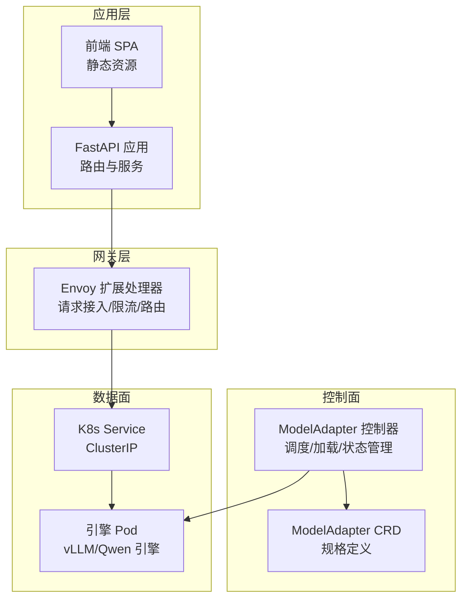
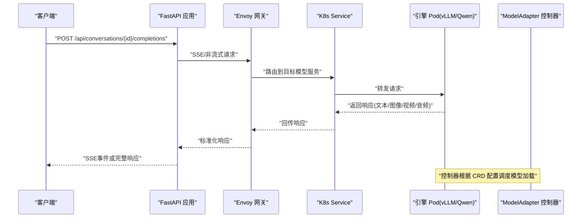
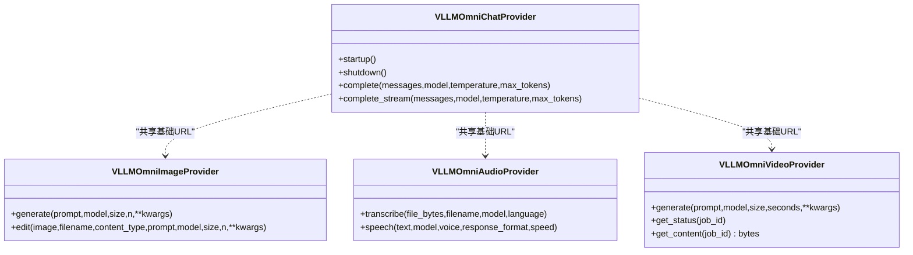
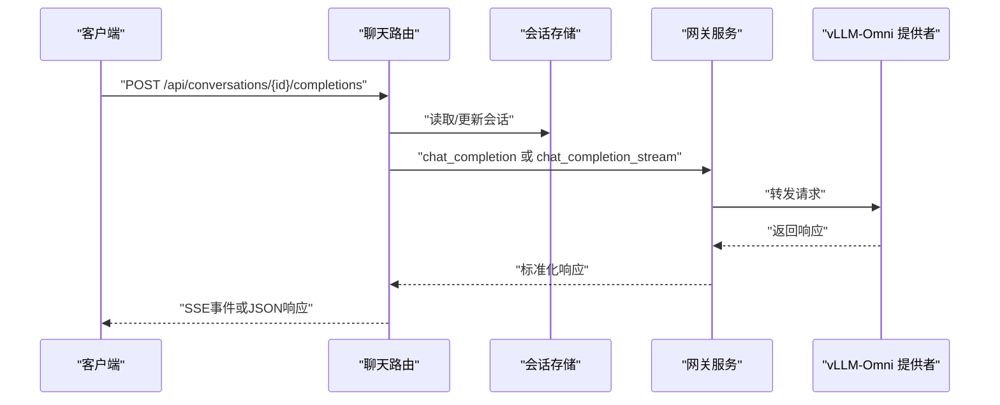
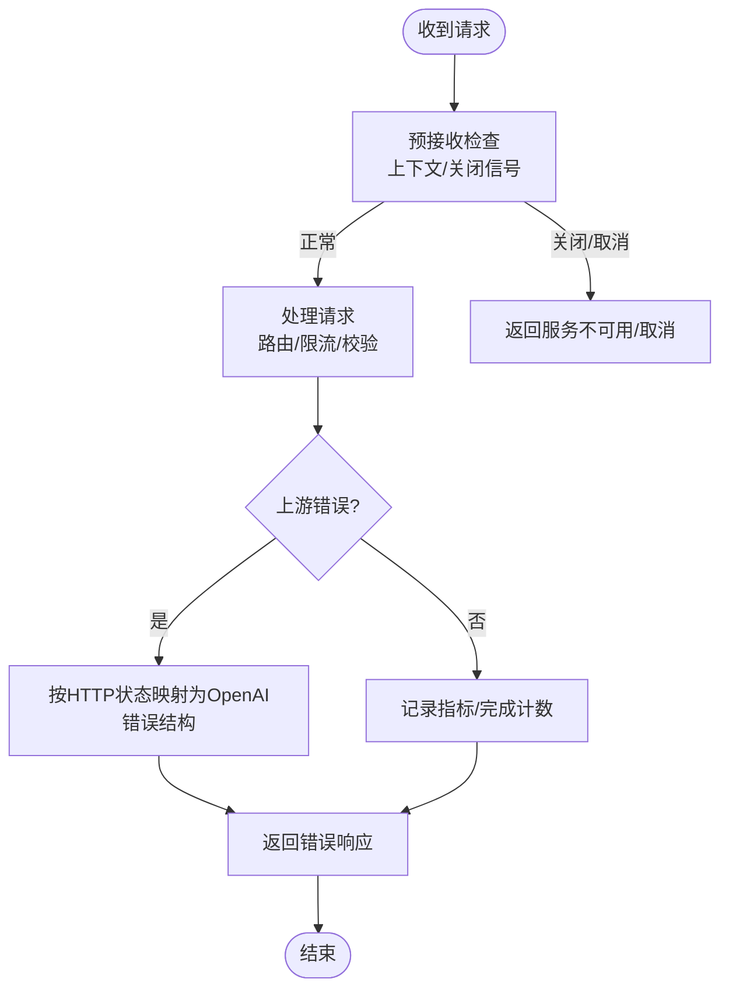
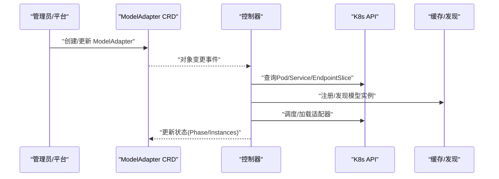
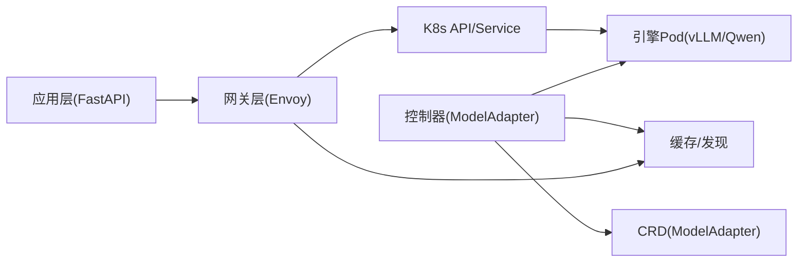

# 文本多模态处理

<cite>
**本文引用的文件**
- [apps/chat/api/services/providers/vllm_omni.py](file://apps/chat/api/services/providers/vllm_omni.py)
- [samples/multimodality/vllm/README.md](file://samples/multimodality/vllm/README.md)
- [samples/multimodality/vllm/qwen-vl.yaml](file://samples/multimodality/vllm/qwen-vl.yaml)
- [apps/chat/api/routers/chat.py](file://apps/chat/api/routers/chat.py)
- [apps/chat/api/main.py](file://apps/chat/api/main.py)
- [pkg/plugins/gateway/gateway.go](file://pkg/plugins/gateway/gateway.go)
- [pkg/plugins/gateway/util.go](file://pkg/plugins/gateway/util.go)
- [api/model/v1alpha1/modeladapter_types.go](file://api/model/v1alpha1/modeladapter_types.go)
- [pkg/controller/modeladapter/modeladapter_controller.go](file://pkg/controller/modeladapter/modeladapter_controller.go)
- [apps/console/web/src/data/mockData.ts](file://apps/console/web/src/data/mockData.ts)
- [apps/chat/api/routers/models.py](file://apps/chat/api/routers/models.py)
</cite>

## 目录
1. [简介](#简介)
2. [项目结构](#项目结构)
3. [核心组件](#核心组件)
4. [架构总览](#架构总览)
5. [详细组件分析](#详细组件分析)
6. [依赖关系分析](#依赖关系分析)
7. [性能考虑](#性能考虑)
8. [故障排查指南](#故障排查指南)
9. [结论](#结论)
10. [附录](#附录)

## 简介
本技术文档面向AIBrix文本多模态处理系统，聚焦于视觉语言模型（如QwenVL）的部署与使用，覆盖以下主题：
- 模型参数调优与资源分配策略
- 性能优化技巧
- 文本-图像联合推理工作流：输入格式、预处理与输出解析
- 在Kubernetes环境中的YAML部署示例
- API调用示例与错误处理策略

目标是帮助开发者快速集成并稳定运行多模态推理服务。

## 项目结构
AIBrix采用分层与模块化设计：
- 应用层：聊天前端与后端API（FastAPI），提供对话、图片、音频、视频等多模态能力入口
- 网关层：Envoy扩展处理器（External Processor），负责请求接入、限流、路由与错误映射
- 控制器层：基于Kubernetes CRD的ModelAdapter控制器，实现模型适配器的调度与加载
- 样例与部署：多模态样例（Qwen-VL、Qwen-Audio）的Kubernetes部署清单与使用说明

图表来源
- [apps/chat/api/main.py:37-50](file://apps/chat/api/main.py#L37-L50)
- [pkg/plugins/gateway/gateway.go:123-138](file://pkg/plugins/gateway/gateway.go#L123-L138)
- [api/model/v1alpha1/modeladapter_types.go:42-61](file://api/model/v1alpha1/modeladapter_types.go#L42-L61)
- [pkg/controller/modeladapter/modeladapter_controller.go:127-135](file://pkg/controller/modeladapter/modeladapter_controller.go#L127-L135)

章节来源
- [apps/chat/api/main.py:1-87](file://apps/chat/api/main.py#L1-L87)
- [pkg/plugins/gateway/gateway.go:1-200](file://pkg/plugins/gateway/gateway.go#L1-L200)
- [api/model/v1alpha1/modeladapter_types.go:42-160](file://api/model/v1alpha1/modeladapter_types.go#L42-L160)
- [pkg/controller/modeladapter/modeladapter_controller.go:1-200](file://pkg/controller/modeladapter/modeladapter_controller.go#L1-L200)

## 核心组件
- vLLM-Omni 多模态提供者：封装Qwen系列视觉/音频/视频能力，统一适配OpenAI兼容接口
- 聊天与多模态路由：接收用户消息与附件，构建历史消息并转发至网关
- Envoy 网关：外部请求处理、速率限制、错误映射与指标上报
- ModelAdapter 控制器：根据CRD定义在K8s集群内调度模型适配器的加载与实例化

章节来源
- [apps/chat/api/services/providers/vllm_omni.py:1-602](file://apps/chat/api/services/providers/vllm_omni.py#L1-L602)
- [apps/chat/api/routers/chat.py:1-199](file://apps/chat/api/routers/chat.py#L1-L199)
- [pkg/plugins/gateway/gateway.go:1-200](file://pkg/plugins/gateway/gateway.go#L1-L200)
- [pkg/controller/modeladapter/modeladapter_controller.go:1-200](file://pkg/controller/modeladapter/modeladapter_controller.go#L1-L200)

## 架构总览
下图展示了从客户端到引擎的完整链路，以及多模态输入（文本+图像/视频/音频）的处理路径。

图表来源
- [apps/chat/api/routers/chat.py:40-125](file://apps/chat/api/routers/chat.py#L40-L125)
- [pkg/plugins/gateway/gateway.go:123-138](file://pkg/plugins/gateway/gateway.go#L123-L138)
- [pkg/controller/modeladapter/modeladapter_controller.go:606-714](file://pkg/controller/modeladapter/modeladapter_controller.go#L606-L714)

## 详细组件分析

### 组件A：vLLM-Omni 多模态提供者
该组件统一了Qwen系列多模态能力，支持：
- 文本对话（modalities: ["text"]）
- 图像生成/编辑（通过 /v1/chat/completions 返回 base64 图像）
- 语音合成（TTS，需 language 字段）
- 视频生成（同步返回 base64 MP4）

关键点：
- 请求头与超时设置、连接池上限
- 基于消息内容数组的多模态输入（text + image_url/video_url）
- 输出解析：从 choices[].message.content 中提取 image_url.data-uri

图表来源
- [apps/chat/api/services/providers/vllm_omni.py:60-121](file://apps/chat/api/services/providers/vllm_omni.py#L60-L121)
- [apps/chat/api/services/providers/vllm_omni.py:197-338](file://apps/chat/api/services/providers/vllm_omni.py#L197-L338)
- [apps/chat/api/services/providers/vllm_omni.py:344-444](file://apps/chat/api/services/providers/vllm_omni.py#L344-L444)
- [apps/chat/api/services/providers/vllm_omni.py:473-602](file://apps/chat/api/services/providers/vllm_omni.py#L473-L602)

章节来源
- [apps/chat/api/services/providers/vllm_omni.py:1-602](file://apps/chat/api/services/providers/vllm_omni.py#L1-L602)

### 组件B：聊天与多模态路由
- 接收表单参数（消息、模型、温度、最大token、是否流式）
- 支持文件上传（图片预览 base64）
- 构建完整消息历史并调用网关
- 流式与非流式两种响应模式；异常捕获并转换为HTTP错误

图表来源
- [apps/chat/api/routers/chat.py:40-125](file://apps/chat/api/routers/chat.py#L40-L125)
- [apps/chat/api/routers/chat.py:127-199](file://apps/chat/api/routers/chat.py#L127-L199)

章节来源
- [apps/chat/api/routers/chat.py:1-199](file://apps/chat/api/routers/chat.py#L1-L199)

### 组件C：Envoy 网关与错误处理
- 外部处理器循环处理请求，进行预接收检查、错误映射与指标上报
- 将HTTP状态码映射为OpenAI风格错误类型（认证、无效请求、限流、过载等）
- 支持SSE流式响应与非流式响应

图表来源
- [pkg/plugins/gateway/gateway.go:140-200](file://pkg/plugins/gateway/gateway.go#L140-L200)
- [pkg/plugins/gateway/util.go:501-531](file://pkg/plugins/gateway/util.go#L501-L531)

章节来源
- [pkg/plugins/gateway/gateway.go:1-200](file://pkg/plugins/gateway/gateway.go#L1-L200)
- [pkg/plugins/gateway/util.go:132-159](file://pkg/plugins/gateway/util.go#L132-L159)
- [pkg/plugins/gateway/util.go:501-531](file://pkg/plugins/gateway/util.go#L501-L531)

### 组件D：ModelAdapter 控制器与CRD
- ModelAdapter CRD 定义模型来源、凭证、副本策略与附加配置
- 控制器根据副本策略（全部节点加载/单节点加载）进行调度与实例管理
- 与Kubernetes API与缓存交互，维护模型可用性状态

图表来源
- [api/model/v1alpha1/modeladapter_types.go:42-61](file://api/model/v1alpha1/modeladapter_types.go#L42-L61)
- [pkg/controller/modeladapter/modeladapter_controller.go:606-714](file://pkg/controller/modeladapter/modeladapter_controller.go#L606-L714)

章节来源
- [api/model/v1alpha1/modeladapter_types.go:42-160](file://api/model/v1alpha1/modeladapter_types.go#L42-L160)
- [pkg/controller/modeladapter/modeladapter_controller.go:1-200](file://pkg/controller/modeladapter/modeladapter_controller.go#L1-L200)

## 依赖关系分析
- 应用层依赖网关层进行请求接入与错误映射
- 网关层依赖Kubernetes服务发现与模型实例缓存
- 控制器层依赖CRD与K8s API，负责模型适配器的生命周期管理

图表来源
- [apps/chat/api/main.py:11-18](file://apps/chat/api/main.py#L11-L18)
- [pkg/plugins/gateway/gateway.go:94-121](file://pkg/plugins/gateway/gateway.go#L94-L121)
- [pkg/controller/modeladapter/modeladapter_controller.go:127-135](file://pkg/controller/modeladapter/modeladapter_controller.go#L127-L135)

章节来源
- [apps/chat/api/main.py:1-87](file://apps/chat/api/main.py#L1-L87)
- [pkg/plugins/gateway/gateway.go:1-200](file://pkg/plugins/gateway/gateway.go#L1-L200)
- [pkg/controller/modeladapter/modeladapter_controller.go:1-200](file://pkg/controller/modeladapter/modeladapter_controller.go#L1-L200)

## 性能考虑
- 连接池与超时：提供者对HTTP客户端设置了连接超时、读写超时与连接池上限，避免并发阻塞
- 资源分配：引擎部署清单中显式声明GPU与CPU资源，确保推理稳定性
- 缓存与前缀缓存：引擎启动参数启用前缀缓存以提升长上下文性能
- I/O与超时：针对图像/视频/音频的远程获取设置了专门的超时参数
- 模型参数：建议结合任务规模调整 max_tokens、temperature、采样步数等参数

章节来源
- [apps/chat/api/services/providers/vllm_omni.py:72-90](file://apps/chat/api/services/providers/vllm_omni.py#L72-L90)
- [apps/chat/api/services/providers/vllm_omni.py:218-236](file://apps/chat/api/services/providers/vllm_omni.py#L218-L236)
- [apps/chat/api/services/providers/vllm_omni.py:369-387](file://apps/chat/api/services/providers/vllm_omni.py#L369-L387)
- [apps/chat/api/services/providers/vllm_omni.py:488-506](file://apps/chat/api/services/providers/vllm_omni.py#L488-L506)
- [samples/multimodality/vllm/qwen-vl.yaml:95-101](file://samples/multimodality/vllm/qwen-vl.yaml#L95-L101)
- [samples/multimodality/vllm/qwen-vl.yaml:72-82](file://samples/multimodality/vllm/qwen-vl.yaml#L72-L82)

## 故障排查指南
- 网关错误映射：根据HTTP状态码自动映射为OpenAI风格错误类型，便于前端统一处理
- 上游HTTP错误：应用层捕获上游HTTP错误并转换为可读的HTTP 502
- 日志与指标：网关层记录请求计数、成功/失败统计与模型标签，便于定位问题
- 常见问题
  - 模型未就绪：检查ModelAdapter状态与Pod就绪情况
  - 资源不足：核对GPU/CPU限额与节点可用资源
  - 远程媒体获取超时：检查网络连通性与超时配置

章节来源
- [pkg/plugins/gateway/util.go:514-531](file://pkg/plugins/gateway/util.go#L514-L531)
- [apps/chat/api/routers/chat.py:196-199](file://apps/chat/api/routers/chat.py#L196-L199)
- [pkg/plugins/gateway/gateway.go:181-200](file://pkg/plugins/gateway/gateway.go#L181-L200)

## 结论
AIBrix通过清晰的分层架构与标准的OpenAI兼容接口，实现了对Qwen等多模态模型的高效集成与稳定运行。结合本文提供的部署清单、API调用示例与错误处理策略，开发者可以快速搭建并优化多模态推理服务。

## 附录

### A. 文本-图像联合推理工作流程
- 输入数据格式
  - 文本：字符串
  - 图像：支持URL、本地路径(file://)、Base64 data URI
  - 视频：支持URL
- 预处理步骤
  - 图像/视频：由引擎侧下载/解码；注意超时与路径白名单
  - 音频：multipart/form-data，非JSON
- 输出结果解析
  - 文本：choices[0].message.content
  - 图像：choices[0].message.content 中的 image_url.data-uri

章节来源
- [samples/multimodality/vllm/README.md:19-158](file://samples/multimodality/vllm/README.md#L19-L158)
- [apps/chat/api/services/providers/vllm_omni.py:172-194](file://apps/chat/api/services/providers/vllm_omni.py#L172-L194)

### B. Kubernetes 部署示例（Qwen-VL）
- 部署清单要点
  - 初始化容器下载模型资产
  - 引擎容器暴露服务端口与指标端口
  - 设置资源配额与GPU请求
  - 允许访问本地媒体路径
- 访问方式
  - 通过K8s Service与Envoy网关对外提供OpenAI兼容接口

章节来源
- [samples/multimodality/vllm/qwen-vl.yaml:1-136](file://samples/multimodality/vllm/qwen-vl.yaml#L1-L136)

### C. API 调用示例与错误处理
- 文本-图像问答（curl）
  - 使用 /v1/chat/completions，消息内容数组包含 text 与 image_url
- 视频问答（curl）
  - 使用 /v1/chat/completions，消息内容数组包含 text 与 video_url
- 音频转写/翻译（curl）
  - 使用 /v1/audio/transcriptions 或 /v1/audio/translations，multipart/form-data
- 错误处理
  - 网关层将HTTP错误映射为OpenAI风格错误
  - 应用层捕获上游HTTP错误并返回HTTP 502

章节来源
- [samples/multimodality/vllm/README.md:19-224](file://samples/multimodality/vllm/README.md#L19-L224)
- [apps/chat/api/routers/chat.py:196-199](file://apps/chat/api/routers/chat.py#L196-L199)
- [pkg/plugins/gateway/util.go:514-531](file://pkg/plugins/gateway/util.go#L514-L531)

### D. 模型能力与前端展示
- 前端模型列表包含Qwen3 VL等视觉模型信息，便于选择与展示
- 能力推断：根据模型ID模式匹配图像/视频/音频/嵌入能力

章节来源
- [apps/console/web/src/data/mockData.ts:454-482](file://apps/console/web/src/data/mockData.ts#L454-L482)
- [apps/chat/api/routers/models.py:15-40](file://apps/chat/api/routers/models.py#L15-L40)