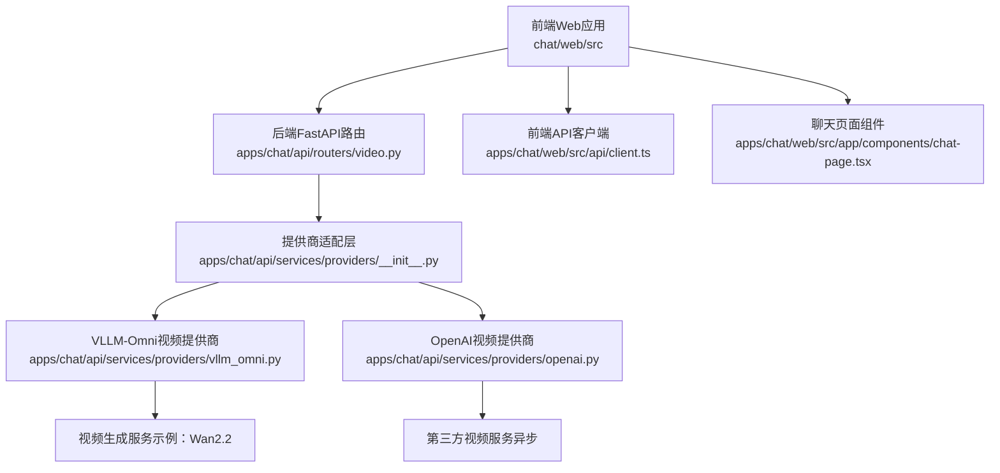
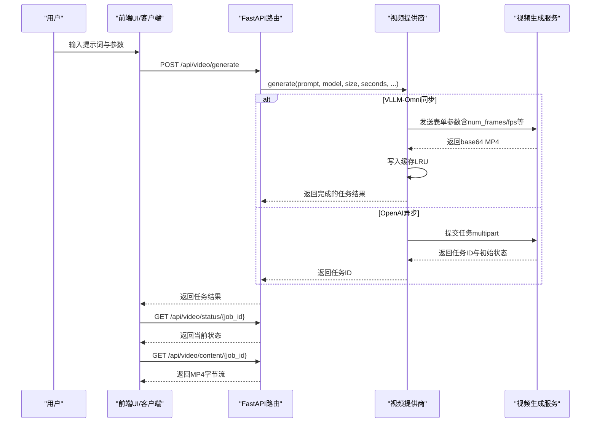
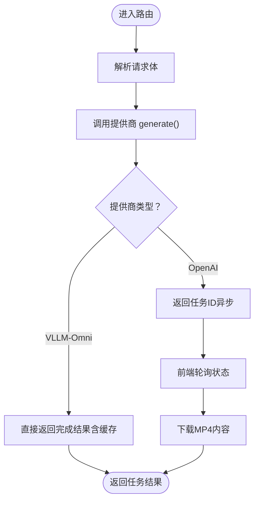
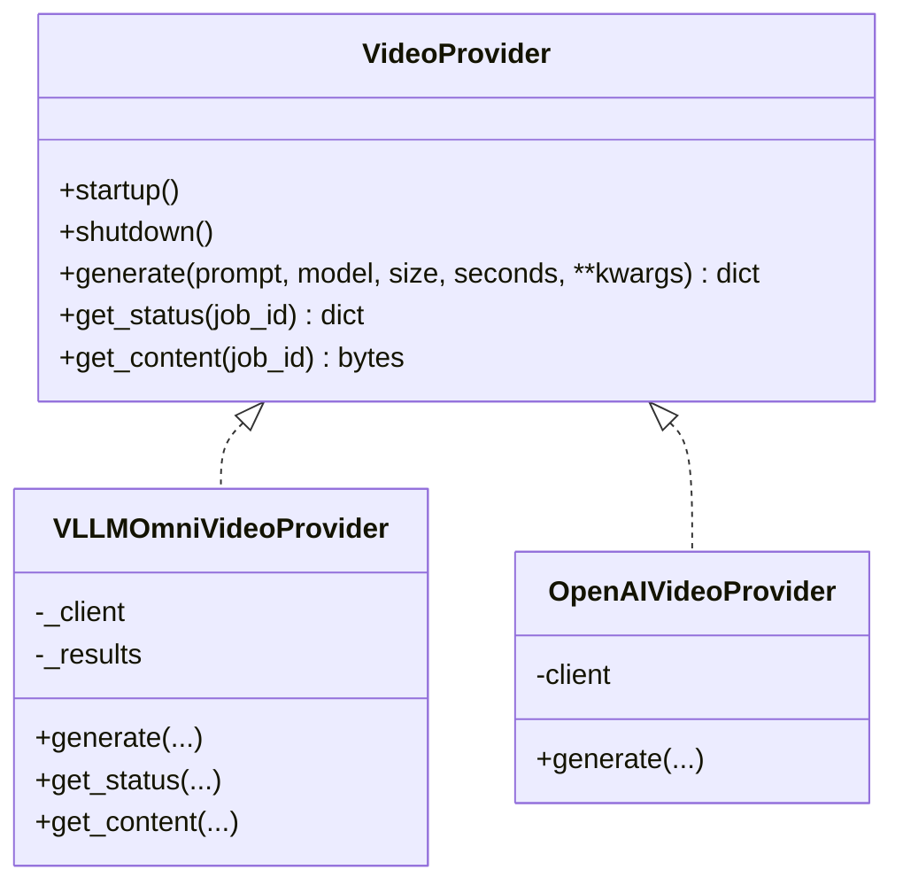
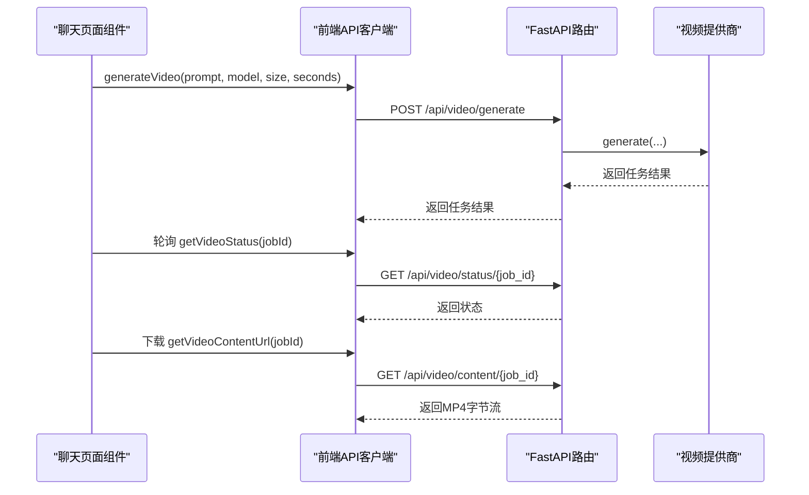
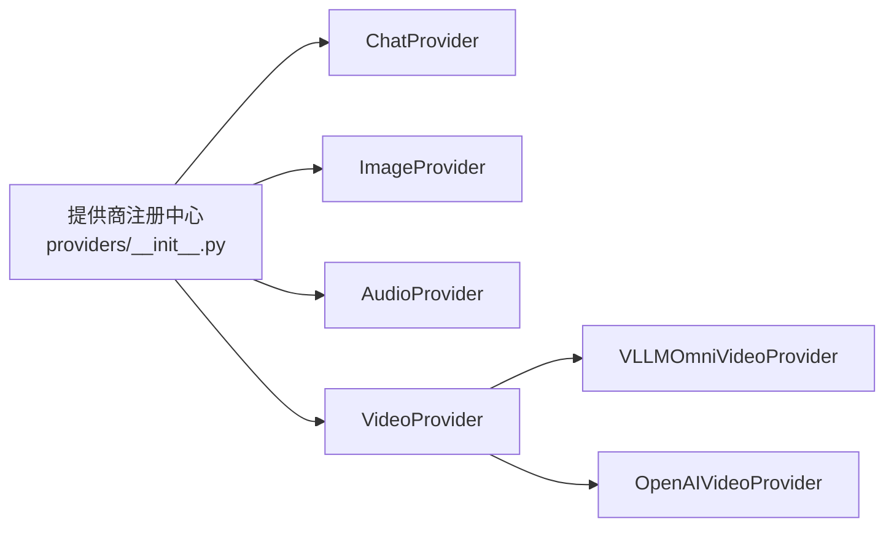

# 视频生成多模态

<cite>
**本文引用的文件**
- [apps/chat/api/routers/video.py](file://apps/chat/api/routers/video.py)
- [apps/chat/api/services/providers/vllm_omni.py](file://apps/chat/api/services/providers/vllm_omni.py)
- [apps/chat/api/services/providers/base.py](file://apps/chat/api/services/providers/base.py)
- [apps/chat/api/services/providers/__init__.py](file://apps/chat/api/services/providers/__init__.py)
- [apps/chat/api/routers/models.py](file://apps/chat/api/routers/models.py)
- [apps/chat/web/src/api/client.ts](file://apps/chat/web/src/api/client.ts)
- [apps/chat/web/src/app/components/chat-page.tsx](file://apps/chat/web/src/app/components/chat-page.tsx)
- [apps/console/web/src/components/CreateModelDeploymentTemplate.tsx](file://apps/console/web/src/components/CreateModelDeploymentTemplate.tsx)
- [apps/console/web/src/components/CreateDeployment.tsx](file://apps/console/web/src/components/CreateDeployment.tsx)
- [benchmarks/generator/dataset_generator/synthetic_prefix_sharing_dataset.py](file://benchmarks/generator/dataset_generator/synthetic_prefix_sharing_dataset.py)
- [benchmarks/generator/workload_generator/workload_generator.py](file://benchmarks/generator/workload_generator/workload_generator.py)
</cite>

## 目录
1. [简介](#简介)
2. [项目结构](#项目结构)
3. [核心组件](#核心组件)
4. [架构总览](#架构总览)
5. [详细组件分析](#详细组件分析)
6. [依赖关系分析](#依赖关系分析)
7. [性能考量](#性能考量)
8. [故障排查指南](#故障排查指南)
9. [结论](#结论)
10. [附录](#附录)

## 简介
本技术指南面向AIBrix视频生成多模态系统，聚焦于C端与后端的视频生成能力，覆盖以下目标：
- 配置与部署：vLLM-Omni视频生成服务（如“Wan2.2”）的接入与参数映射。
- 技术实现：文本到视频生成的关键流程、参数与接口形态、同步返回与缓存策略。
- 时序建模与一致性：基于帧率与帧数推导的时序参数设计，以及对长视频生成的并行化思路。
- 编解码与推理：MP4封装与base64传输、HTTP客户端连接池与超时控制、错误处理与可观测性。
- 分布式与扩展：通过部署模板与副本/并行度配置，支持多引擎、多副本与自动扩缩容。
- 质量评估与调优：结合工作负载生成器与数据集生成器，指导参数调优与场景适配。

## 项目结构
围绕视频生成的前端与后端关键模块如下：
- 前端Web应用：提供视频生成入口、轮询状态与下载MP4。
- 后端FastAPI路由：统一暴露视频生成、状态查询与内容下载接口。
- 提供商适配层：抽象VideoProvider接口，具体实现为VLLMOmniVideoProvider（同步视频生成）与OpenAIVideoProvider（异步视频生成）。
- 控制台部署：提供模型部署模板与副本/并行度配置，支撑分布式与弹性伸缩。

图表来源
- [apps/chat/api/routers/video.py:1-66](file://apps/chat/api/routers/video.py#L1-L66)
- [apps/chat/api/services/providers/__init__.py:1-102](file://apps/chat/api/services/providers/__init__.py#L1-L102)
- [apps/chat/api/services/providers/vllm_omni.py:1-602](file://apps/chat/api/services/providers/vllm_omni.py#L1-L602)

章节来源
- [apps/chat/api/routers/video.py:1-66](file://apps/chat/api/routers/video.py#L1-L66)
- [apps/chat/api/services/providers/__init__.py:1-102](file://apps/chat/api/services/providers/__init__.py#L1-L102)
- [apps/chat/api/services/providers/vllm_omni.py:1-602](file://apps/chat/api/services/providers/vllm_omni.py#L1-L602)
- [apps/chat/web/src/api/client.ts:365-398](file://apps/chat/web/src/api/client.ts#L365-L398)
- [apps/chat/web/src/app/components/chat-page.tsx:240-297](file://apps/chat/web/src/app/components/chat-page.tsx#L240-L297)

## 核心组件
- 视频生成路由：提供POST提交任务、GET轮询状态、GET下载MP4的三段式接口。
- 视频提供商接口：定义generate/get_status/get_content三个抽象方法，确保不同后端的一致行为。
- VLLM-Omni视频提供商：将本地参数映射为后端字段，同步返回base64 MP4并缓存结果。
- OpenAI视频提供商：使用multipart表单提交，遵循异步任务模式（需轮询进度）。
- 前端API客户端：封装视频生成、状态轮询与MP4下载的HTTP调用。
- 前端UI组件：触发视频生成、轮询状态并在完成后展示或下载。

章节来源
- [apps/chat/api/routers/video.py:19-66](file://apps/chat/api/routers/video.py#L19-L66)
- [apps/chat/api/services/providers/base.py:111-137](file://apps/chat/api/services/providers/base.py#L111-L137)
- [apps/chat/api/services/providers/vllm_omni.py:473-602](file://apps/chat/api/services/providers/vllm_omni.py#L473-L602)
- [apps/chat/api/services/providers/openai.py:429-470](file://apps/chat/api/services/providers/openai.py#L429-L470)
- [apps/chat/web/src/api/client.ts:365-398](file://apps/chat/web/src/api/client.ts#L365-L398)

## 架构总览
下图展示了从用户请求到视频生成与交付的端到端流程，重点体现参数映射、同步/异步差异与缓存策略。

图表来源
- [apps/chat/api/routers/video.py:19-66](file://apps/chat/api/routers/video.py#L19-L66)
- [apps/chat/api/services/providers/vllm_omni.py:508-576](file://apps/chat/api/services/providers/vllm_omni.py#L508-L576)
- [apps/chat/api/services/providers/openai.py:429-470](file://apps/chat/api/services/providers/openai.py#L429-L470)

## 详细组件分析

### 组件A：视频生成路由与状态管理
- POST /api/video/generate：接收请求体中的prompt、model、size、seconds，调用提供商执行生成，并返回标准任务响应。
- GET /api/video/status/{job_id}：轮询任务状态；VLLM-Omni提供商采用本地缓存返回已完成结果。
- GET /api/video/content/{job_id}：下载MP4，以二进制流形式返回并设置合适的响应头。

图表来源
- [apps/chat/api/routers/video.py:19-66](file://apps/chat/api/routers/video.py#L19-L66)
- [apps/chat/api/services/providers/vllm_omni.py:578-587](file://apps/chat/api/services/providers/vllm_omni.py#L578-L587)

章节来源
- [apps/chat/api/routers/video.py:19-66](file://apps/chat/api/routers/video.py#L19-L66)

### 组件B：视频提供商接口与实现
- VideoProvider抽象：定义startup/shutdown与generate/get_status/get_content三类方法，确保统一生命周期与行为契约。
- VLLMOmniVideoProvider：
  - 参数映射：将seconds转换为num_frames（按fps计算），并将尺寸、步数、引导强度等映射到后端字段。
  - 同步返回：直接返回base64 MP4，封装为“已完成”的任务结果，并写入LRU缓存。
  - 缓存策略：限制最大条目数量，避免内存膨胀。
- OpenAIVideoProvider：
  - 使用multipart表单提交，遵循异步任务模式，返回任务ID与进度字段。

图表来源
- [apps/chat/api/services/providers/base.py:111-137](file://apps/chat/api/services/providers/base.py#L111-L137)
- [apps/chat/api/services/providers/vllm_omni.py:473-602](file://apps/chat/api/services/providers/vllm_omni.py#L473-L602)
- [apps/chat/api/services/providers/openai.py:429-470](file://apps/chat/api/services/providers/openai.py#L429-L470)

章节来源
- [apps/chat/api/services/providers/base.py:111-137](file://apps/chat/api/services/providers/base.py#L111-L137)
- [apps/chat/api/services/providers/vllm_omni.py:473-602](file://apps/chat/api/services/providers/vllm_omni.py#L473-L602)
- [apps/chat/api/services/providers/openai.py:429-470](file://apps/chat/api/services/providers/openai.py#L429-L470)

### 组件C：前端集成与交互
- 前端API客户端：封装视频生成、状态轮询与MP4下载的fetch调用，支持鉴权头注入。
- 聊天页面组件：触发视频生成、根据状态更新消息、轮询直至完成并展示下载链接。

图表来源
- [apps/chat/web/src/api/client.ts:365-398](file://apps/chat/web/src/api/client.ts#L365-L398)
- [apps/chat/web/src/app/components/chat-page.tsx:240-297](file://apps/chat/web/src/app/components/chat-page.tsx#L240-L297)
- [apps/chat/api/routers/video.py:19-66](file://apps/chat/api/routers/video.py#L19-L66)

章节来源
- [apps/chat/web/src/api/client.ts:365-398](file://apps/chat/web/src/api/client.ts#L365-L398)
- [apps/chat/web/src/app/components/chat-page.tsx:240-297](file://apps/chat/web/src/app/components/chat-page.tsx#L240-L297)

### 组件D：模型发现与能力识别
- 模型ID模式匹配：通过正则表达式识别视频模型（如“hunyuan-video”、“sora”等），用于前端能力展示与路由选择。

章节来源
- [apps/chat/api/routers/models.py:15-31](file://apps/chat/api/routers/models.py#L15-L31)

### 组件E：部署与并行化（控制台）
- 部署模板：定义引擎类型、模型来源、加速器、并行度（tp/pp/dp）、量化与端点支持等。
- 部署配置：支持副本数、自动扩缩容与多LoRA等高级特性，便于在分布式环境中承载长视频生成任务。

章节来源
- [apps/console/web/src/components/CreateModelDeploymentTemplate.tsx:124-161](file://apps/console/web/src/components/CreateModelDeploymentTemplate.tsx#L124-L161)
- [apps/console/web/src/components/CreateDeployment.tsx:294-467](file://apps/console/web/src/components/CreateDeployment.tsx#L294-L467)

## 依赖关系分析
- 提供商注册中心：按模态（chat/image/audio/video）维护提供商映射，按配置动态实例化并复用连接池。
- 前后端耦合：前端仅依赖后端暴露的REST接口；后端通过提供商抽象屏蔽底层差异。
- 外部服务：VLLM-Omni视频端点（同步）与第三方视频服务（异步）并存，满足不同场景需求。

图表来源
- [apps/chat/api/services/providers/__init__.py:27-44](file://apps/chat/api/services/providers/__init__.py#L27-L44)

章节来源
- [apps/chat/api/services/providers/__init__.py:1-102](file://apps/chat/api/services/providers/__init__.py#L1-L102)

## 性能考量
- 连接池与超时：提供商内部使用httpx.AsyncClient，设置连接/读写/池化上限与超时，降低并发下的资源竞争。
- 同步生成优势：VLLM-Omni视频端点为同步返回，减少轮询开销，适合中小规模与低延迟场景。
- 异步生成策略：第三方视频服务采用异步任务，需合理安排轮询频率与重试策略，避免频繁请求。
- 并行化与扩展：通过部署模板配置副本数与并行度，结合自动扩缩容，提升吞吐与稳定性。
- 内存优化：VLLM-Omni提供商内置LRU缓存，限制缓存项数量，避免长时间运行导致内存增长。

章节来源
- [apps/chat/api/services/providers/vllm_omni.py:488-492](file://apps/chat/api/services/providers/vllm_omni.py#L488-L492)
- [apps/chat/api/services/providers/vllm_omni.py:449-471](file://apps/chat/api/services/providers/vllm_omni.py#L449-L471)
- [apps/console/web/src/components/CreateDeployment.tsx:294-467](file://apps/console/web/src/components/CreateDeployment.tsx#L294-L467)

## 故障排查指南
- 视频生成失败：检查后端日志与HTTP状态码，确认提供商初始化、鉴权头与URL配置正确。
- 状态轮询异常：确认job_id有效且提供商缓存中存在对应结果（VLLM-Omni）；异步提供商需等待任务完成。
- 下载为空：确认任务已完成且返回了base64 MP4；若为空，检查提供商返回结构与字段映射。
- 超时与连接问题：适当增大超时时间与连接池上限，避免高并发下的连接耗尽。
- 模型识别问题：核对模型ID是否匹配预设正则，确保前端能力展示与后端路由一致。

章节来源
- [apps/chat/api/routers/video.py:31-65](file://apps/chat/api/routers/video.py#L31-L65)
- [apps/chat/api/services/providers/vllm_omni.py:541-576](file://apps/chat/api/services/providers/vllm_omni.py#L541-L576)
- [apps/chat/api/services/providers/vllm_omni.py:589-601](file://apps/chat/api/services/providers/vllm_omni.py#L589-L601)

## 结论
AIBrix视频生成多模态系统通过统一的提供商接口与清晰的前后端边界，实现了对多种视频生成后端（同步与异步）的兼容与扩展。结合部署模板与自动扩缩容，可在分布式环境中稳定地处理长视频生成任务。建议在生产环境优先采用同步视频生成以降低延迟，同时通过参数映射与缓存策略保障性能与稳定性。

## 附录

### 文本到视频生成参数映射与调优要点
- 关键参数映射：
  - seconds → num_frames（由fps推导）
  - size → width/height
  - num_inference_steps → 推理步数
  - guidance_scale → 引导强度
  - flow_shift → 流场偏移（影响运动估计）
  - negative_prompt/seed → 负向提示与随机种子
  - guidance_scale_2/boundary_ratio → 可选增强参数
- 调优建议：
  - 帧率与时长：根据场景选择合适fps与seconds，平衡质量与时延。
  - 步数与引导：逐步增加推理步数与引导强度，观察质量与显存占用的折中。
  - 运动估计：通过flow_shift与边界比例参数微调运动一致性。
  - 编解码：后端返回base64 MP4，前端直接下载为MP4，注意网络带宽与存储成本。

章节来源
- [apps/chat/api/services/providers/vllm_omni.py:520-538](file://apps/chat/api/services/providers/vllm_omni.py#L520-L538)

### 工作负载与数据集生成（用于评测与参数调优）
- 前缀共享数据集生成：支持设定平均提示长度、共享比例与标准差，生成具有前缀共享特征的数据集，便于评测长上下文与重复提示场景。
- 统计分布工作负载：基于统计CSV生成请求分布，模拟真实流量的RPS、输入/输出长度分布，辅助压测与容量规划。

章节来源
- [benchmarks/generator/dataset_generator/synthetic_prefix_sharing_dataset.py:54-76](file://benchmarks/generator/dataset_generator/synthetic_prefix_sharing_dataset.py#L54-L76)
- [benchmarks/generator/workload_generator/workload_generator.py:41-424](file://benchmarks/generator/workload_generator/workload_generator.py#L41-L424)