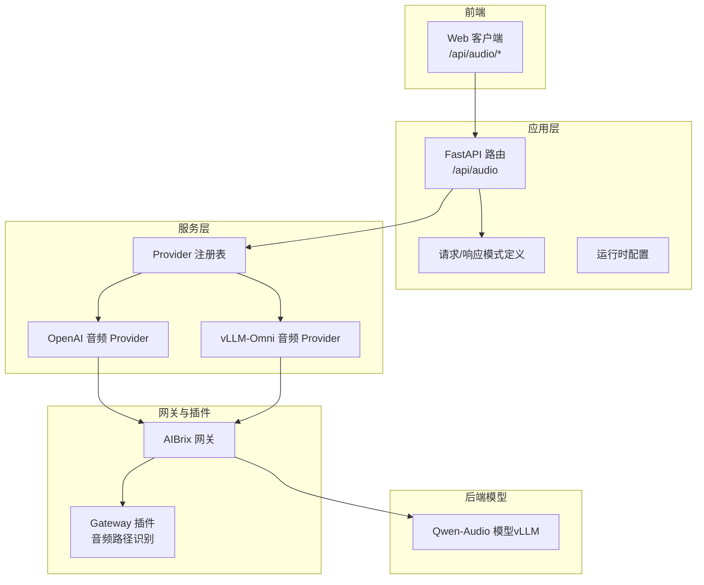
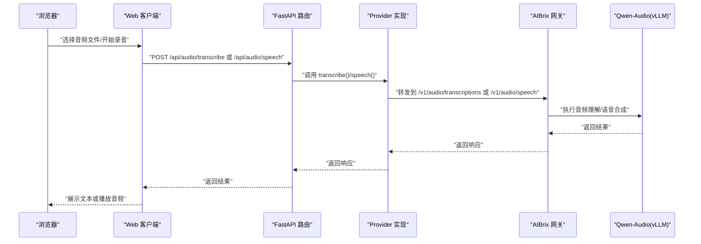
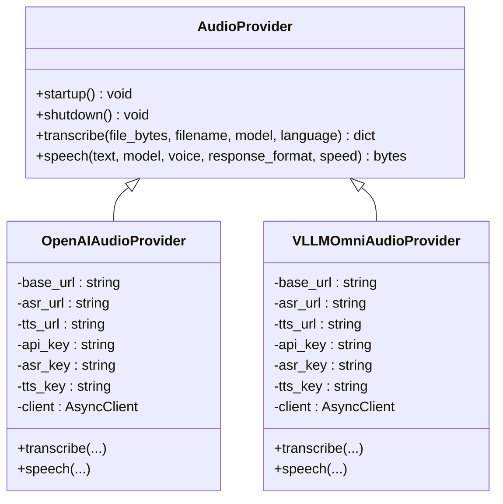
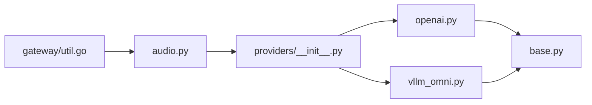
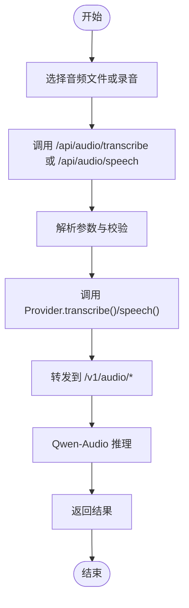

# 音频多模态处理

<cite>
**本文引用的文件**
- [apps/chat/api/routers/audio.py](file://apps/chat/api/routers/audio.py)
- [apps/chat/api/services/providers/__init__.py](file://apps/chat/api/services/providers/__init__.py)
- [apps/chat/api/services/providers/base.py](file://apps/chat/api/services/providers/base.py)
- [apps/chat/api/services/providers/openai.py](file://apps/chat/api/services/providers/openai.py)
- [apps/chat/api/services/providers/vllm_omni.py](file://apps/chat/api/services/providers/vllm_omni.py)
- [apps/chat/api/models/schemas.py](file://apps/chat/api/models/schemas.py)
- [apps/chat/api/config.py](file://apps/chat/api/config.py)
- [apps/chat/web/src/api/client.ts](file://apps/chat/web/src/api/client.ts)
- [apps/chat/web/src/app/hooks/use-audio-recording.ts](file://apps/chat/web/src/app/hooks/use-audio-recording.ts)
- [samples/multimodality/vllm/qwen-audio.yaml](file://samples/multimodality/vllm/qwen-audio.yaml)
- [samples/multimodality/vllm/send_audio.py](file://samples/multimodality/vllm/send_audio.py)
- [pkg/plugins/gateway/util.go](file://pkg/plugins/gateway/util.go)
</cite>

## 目录
1. [简介](#简介)
2. [项目结构](#项目结构)
3. [核心组件](#核心组件)
4. [架构总览](#架构总览)
5. [详细组件分析](#详细组件分析)
6. [依赖分析](#依赖分析)
7. [性能考虑](#性能考虑)
8. [故障排查指南](#故障排查指南)
9. [结论](#结论)
10. [附录](#附录)

## 简介
本技术指南面向AIBrix音频多模态处理系统，聚焦于Qwen-Audio等音频理解模型的配置与部署、音频格式与采样率处理、编码解码流程、以及音频-文本联合推理的实现要点（特征提取、时序对齐、语义理解策略）。文档提供从音频文件上传到多模态推理结果的完整处理流程示例，并总结音频数据预处理最佳实践、性能优化建议与常见问题解决方案。

## 项目结构
AIBrix在应用层通过FastAPI路由暴露音频能力（转写STT与语音合成TTS），在服务层以“Provider”抽象适配不同后端（OpenAI兼容与vLLM-Omni），并通过网关插件进行请求路径识别与路由分发。多模态模型（如Qwen-Audio）通过Kubernetes部署并在vLLM引擎上提供OpenAI兼容的音频接口。

图表来源
- [apps/chat/api/routers/audio.py:1-65](file://apps/chat/api/routers/audio.py#L1-L65)
- [apps/chat/api/services/providers/__init__.py:1-102](file://apps/chat/api/services/providers/__init__.py#L1-L102)
- [apps/chat/api/services/providers/openai.py:297-386](file://apps/chat/api/services/providers/openai.py#L297-L386)
- [apps/chat/api/services/providers/vllm_omni.py:344-444](file://apps/chat/api/services/providers/vllm_omni.py#L344-L444)
- [pkg/plugins/gateway/util.go:235-238](file://pkg/plugins/gateway/util.go#L235-L238)
- [samples/multimodality/vllm/qwen-audio.yaml:1-128](file://samples/multimodality/vllm/qwen-audio.yaml#L1-L128)

章节来源
- [apps/chat/api/routers/audio.py:1-65](file://apps/chat/api/routers/audio.py#L1-L65)
- [apps/chat/api/services/providers/__init__.py:1-102](file://apps/chat/api/services/providers/__init__.py#L1-L102)
- [apps/chat/api/services/providers/base.py:1-138](file://apps/chat/api/services/providers/base.py#L1-L138)
- [apps/chat/api/config.py:1-94](file://apps/chat/api/config.py#L1-L94)
- [pkg/plugins/gateway/util.go:235-238](file://pkg/plugins/gateway/util.go#L235-L238)
- [samples/multimodality/vllm/qwen-audio.yaml:1-128](file://samples/multimodality/vllm/qwen-audio.yaml#L1-L128)

## 核心组件
- 音频路由与端点：提供转写与语音合成的HTTP接口，负责参数校验、错误处理与媒体类型映射。
- Provider 抽象与实现：统一音频能力接口，分别对接OpenAI兼容服务与vLLM-Omni（含Qwen3-ASR/TTS）。
- Provider 注册表：按模态选择具体实现，支持连接池复用与URL/密钥覆盖。
- 请求体与响应模式：定义音频请求参数与返回结构，确保前后端一致性。
- 运行时配置：集中管理网关地址、各服务URL与密钥、默认模型名与过滤列表。
- 前端客户端：封装音频上传与TTS生成调用，支持录音与文件上传。
- 网关插件：识别音频相关请求路径，辅助路由与鉴权。

章节来源
- [apps/chat/api/routers/audio.py:1-65](file://apps/chat/api/routers/audio.py#L1-L65)
- [apps/chat/api/services/providers/base.py:80-109](file://apps/chat/api/services/providers/base.py#L80-L109)
- [apps/chat/api/services/providers/__init__.py:76-89](file://apps/chat/api/services/providers/__init__.py#L76-L89)
- [apps/chat/api/models/schemas.py:123-136](file://apps/chat/api/models/schemas.py#L123-L136)
- [apps/chat/api/config.py:4-94](file://apps/chat/api/config.py#L4-L94)
- [apps/chat/web/src/api/client.ts:331-365](file://apps/chat/web/src/api/client.ts#L331-L365)
- [pkg/plugins/gateway/util.go:235-238](file://pkg/plugins/gateway/util.go#L235-L238)

## 架构总览
下图展示从浏览器到后端模型的端到端链路，包括音频上传、转写/合成、以及网关插件的路径识别。

图表来源
- [apps/chat/api/routers/audio.py:20-65](file://apps/chat/api/routers/audio.py#L20-L65)
- [apps/chat/api/services/providers/__init__.py:76-89](file://apps/chat/api/services/providers/__init__.py#L76-L89)
- [apps/chat/api/services/providers/openai.py:337-383](file://apps/chat/api/services/providers/openai.py#L337-L383)
- [apps/chat/api/services/providers/vllm_omni.py:389-443](file://apps/chat/api/services/providers/vllm_omni.py#L389-L443)
- [apps/chat/web/src/api/client.ts:331-365](file://apps/chat/web/src/api/client.ts#L331-L365)

## 详细组件分析

### 音频路由与端点
- 转写端点：接收multipart文件与可选语言参数，调用Provider并返回文本结果；异常转换为HTTP 502。
- 语音合成端点：接收JSON请求，调用Provider并根据响应格式返回对应媒体类型字节流。
- 参数与模型：默认模型名来自配置；前端可传入语言代码（转写）与响应格式（合成）。

章节来源
- [apps/chat/api/routers/audio.py:20-65](file://apps/chat/api/routers/audio.py#L20-L65)
- [apps/chat/api/models/schemas.py:126-136](file://apps/chat/api/models/schemas.py#L126-L136)
- [apps/chat/api/config.py:29-35](file://apps/chat/api/config.py#L29-L35)

### Provider 抽象与实现
- 抽象接口：定义transcribe与speech两个核心方法，保证实现一致性。
- OpenAI Provider：遵循OpenAI音频接口规范，支持转写与语音合成，具备超时与连接限制配置。
- vLLM-Omni Provider：转写兼容OpenAI；语音合成扩展语言字段以启用自动语言检测；内部使用异步HTTP客户端。

图表来源
- [apps/chat/api/services/providers/base.py:80-109](file://apps/chat/api/services/providers/base.py#L80-L109)
- [apps/chat/api/services/providers/openai.py:297-386](file://apps/chat/api/services/providers/openai.py#L297-L386)
- [apps/chat/api/services/providers/vllm_omni.py:344-444](file://apps/chat/api/services/providers/vllm_omni.py#L344-L444)

章节来源
- [apps/chat/api/services/providers/base.py:80-109](file://apps/chat/api/services/providers/base.py#L80-L109)
- [apps/chat/api/services/providers/openai.py:297-386](file://apps/chat/api/services/providers/openai.py#L297-L386)
- [apps/chat/api/services/providers/vllm_omni.py:344-444](file://apps/chat/api/services/providers/vllm_omni.py#L344-L444)

### Provider 注册表与配置
- 注册表：按模态（chat/image/audio/video）选择具体实现类，支持缓存复用避免重复初始化。
- 配置项：提供统一的URL与密钥覆盖机制，便于将ASR/TTS指向不同后端或网关。
- 默认模型：未设置时使用配置中的默认模型名。

章节来源
- [apps/chat/api/services/providers/__init__.py:27-89](file://apps/chat/api/services/providers/__init__.py#L27-L89)
- [apps/chat/api/config.py:4-94](file://apps/chat/api/config.py#L4-L94)

### 前端集成与录音
- 客户端API：封装转写与TTS调用，支持语言参数与响应格式控制。
- 录音Hook：基于浏览器MediaRecorder实现录音，自动选择可用MIME类型并生成Blob文件。

章节来源
- [apps/chat/web/src/api/client.ts:331-365](file://apps/chat/web/src/api/client.ts#L331-L365)
- [apps/chat/web/src/app/hooks/use-audio-recording.ts:1-45](file://apps/chat/web/src/app/hooks/use-audio-recording.ts#L1-L45)

### 网关插件与路径识别
- 路径识别：通过请求路径判断是否为音频相关端点，用于后续路由与策略处理。
- 集成位置：在网关侧进行请求分类，确保音频流量被正确分发。

章节来源
- [pkg/plugins/gateway/util.go:235-238](file://pkg/plugins/gateway/util.go#L235-L238)

### 多模态模型部署（Qwen-Audio）
- 部署方式：通过Deployment与Service在Kubernetes中托管，使用vLLM引擎提供OpenAI兼容音频接口。
- 模型下载：InitContainer从对象存储拉取模型至本地卷，支持并发线程与凭证配置。
- 环境变量：设置音频资源加载超时与RPC超时，保障大模型推理稳定性。
- 访问端口：对外暴露服务端口与监控端口，便于观测与扩缩容。

章节来源
- [samples/multimodality/vllm/qwen-audio.yaml:1-128](file://samples/multimodality/vllm/qwen-audio.yaml#L1-L128)

### 示例脚本与命令行工具
- 发送音频：支持转写与翻译两种模式，可指定语言与响应格式，便于离线测试与集成验证。

章节来源
- [samples/multimodality/vllm/send_audio.py:7-75](file://samples/multimodality/vllm/send_audio.py#L7-L75)

## 依赖分析
- 组件耦合：路由依赖Provider注册表；Provider实现依赖HTTP客户端；网关插件依赖请求路径常量。
- 外部依赖：vLLM引擎、OpenAI兼容服务、Kubernetes资源与对象存储。
- 可能的循环依赖：当前模块间采用单向依赖，未见循环导入迹象。

图表来源
- [apps/chat/api/routers/audio.py:1-65](file://apps/chat/api/routers/audio.py#L1-L65)
- [apps/chat/api/services/providers/__init__.py:1-102](file://apps/chat/api/services/providers/__init__.py#L1-L102)
- [apps/chat/api/services/providers/openai.py:297-386](file://apps/chat/api/services/providers/openai.py#L297-L386)
- [apps/chat/api/services/providers/vllm_omni.py:344-444](file://apps/chat/api/services/providers/vllm_omni.py#L344-L444)
- [apps/chat/api/services/providers/base.py:1-138](file://apps/chat/api/services/providers/base.py#L1-L138)
- [pkg/plugins/gateway/util.go:235-238](file://pkg/plugins/gateway/util.go#L235-L238)

章节来源
- [apps/chat/api/routers/audio.py:1-65](file://apps/chat/api/routers/audio.py#L1-L65)
- [apps/chat/api/services/providers/__init__.py:1-102](file://apps/chat/api/services/providers/__init__.py#L1-L102)
- [apps/chat/api/services/providers/base.py:1-138](file://apps/chat/api/services/providers/base.py#L1-L138)
- [pkg/plugins/gateway/util.go:235-238](file://pkg/plugins/gateway/util.go#L235-L238)

## 性能考虑
- 连接池与超时：Provider内部使用异步HTTP客户端并设置连接上限与超时，有助于高并发场景下的稳定性。
- 缓存与复用：注册表对Provider实例进行缓存，减少重复初始化开销。
- 模型资源：部署配置中设置音频资源加载超时与RPC超时，避免长时间阻塞。
- 响应格式：前端与后端对媒体类型进行严格映射，减少不必要的编解码转换。
- 扩展性：通过网关插件识别音频请求路径，便于后续引入限流、鉴权与路由策略。

## 故障排查指南
- 转写失败（HTTP 502）：检查Provider日志与上游网关状态；确认文件格式与语言参数是否符合要求。
- 语音合成为空或格式错误：核对响应格式参数与媒体类型映射；确认后端模型支持该格式。
- Provider初始化异常：检查配置中的URL与密钥覆盖是否生效；确认网络连通性。
- 录音不可用：确认浏览器权限与MIME类型支持；尝试更换浏览器或设备。
- 网关路径识别：若音频请求未被识别，请检查请求路径是否匹配已知音频端点。

章节来源
- [apps/chat/api/routers/audio.py:37-39](file://apps/chat/api/routers/audio.py#L37-L39)
- [apps/chat/api/routers/audio.py:63-65](file://apps/chat/api/routers/audio.py#L63-L65)
- [apps/chat/api/services/providers/openai.py:316-321](file://apps/chat/api/services/providers/openai.py#L316-L321)
- [apps/chat/api/services/providers/vllm_omni.py:369-373](file://apps/chat/api/services/providers/vllm_omni.py#L369-L373)
- [apps/chat/web/src/app/hooks/use-audio-recording.ts:40-45](file://apps/chat/web/src/app/hooks/use-audio-recording.ts#L40-L45)
- [pkg/plugins/gateway/util.go:235-238](file://pkg/plugins/gateway/util.go#L235-L238)

## 结论
AIBrix通过统一的Provider抽象与灵活的配置体系，实现了对OpenAI兼容与vLLM-Omni音频能力的无缝接入。结合Kubernetes部署与网关插件，系统能够稳定地支撑从音频上传到多模态推理的完整链路。建议在生产环境中关注连接池与超时配置、模型资源加载策略与前端媒体类型一致性，并通过网关插件完善鉴权与限流策略以提升整体可靠性与安全性。

## 附录

### 音频处理管道示例（从上传到推理）
- 前端：用户选择文件或开始录音，调用转写或TTS接口。
- 应用层：FastAPI路由解析参数，调用Provider实现。
- Provider：构造OpenAI兼容请求，转发至网关。
- 网关：识别音频端点，将请求路由至Qwen-Audio模型。
- 模型：执行音频理解/语音合成，返回结果。
- 返回：应用层封装响应，前端展示文本或播放音频。

图表来源
- [apps/chat/api/routers/audio.py:20-65](file://apps/chat/api/routers/audio.py#L20-L65)
- [apps/chat/api/services/providers/__init__.py:76-89](file://apps/chat/api/services/providers/__init__.py#L76-L89)
- [apps/chat/api/services/providers/openai.py:337-383](file://apps/chat/api/services/providers/openai.py#L337-L383)
- [apps/chat/api/services/providers/vllm_omni.py:389-443](file://apps/chat/api/services/providers/vllm_omni.py#L389-L443)
- [apps/chat/web/src/api/client.ts:331-365](file://apps/chat/web/src/api/client.ts#L331-L365)

### 音频格式与采样率支持
- 转写输入：支持multipart文件上传，语言参数可选（仅转写）。
- 合成输出：支持多种响应格式（如MP3、WAV、FLAC等），前端按需选择。
- 建议：优先使用高质量音频（如16kHz/24bit WAV）以提升转写准确率；TTS输出格式按播放设备选择。

章节来源
- [apps/chat/api/routers/audio.py:20-65](file://apps/chat/api/routers/audio.py#L20-L65)
- [apps/chat/api/models/schemas.py:126-136](file://apps/chat/api/models/schemas.py#L126-L136)
- [apps/chat/web/src/api/client.ts:331-365](file://apps/chat/web/src/api/client.ts#L331-L365)

### 音频-文本联合推理实现要点
- 特征提取：由模型侧完成音频特征提取与编码，应用层仅负责传输与格式化。
- 时序对齐：模型内部处理音频时序与文本对齐，应用层无需额外对齐逻辑。
- 语义理解：通过提示词与上下文组织，引导模型输出符合预期的文本结果。

章节来源
- [apps/chat/api/services/providers/vllm_omni.py:344-444](file://apps/chat/api/services/providers/vllm_omni.py#L344-L444)