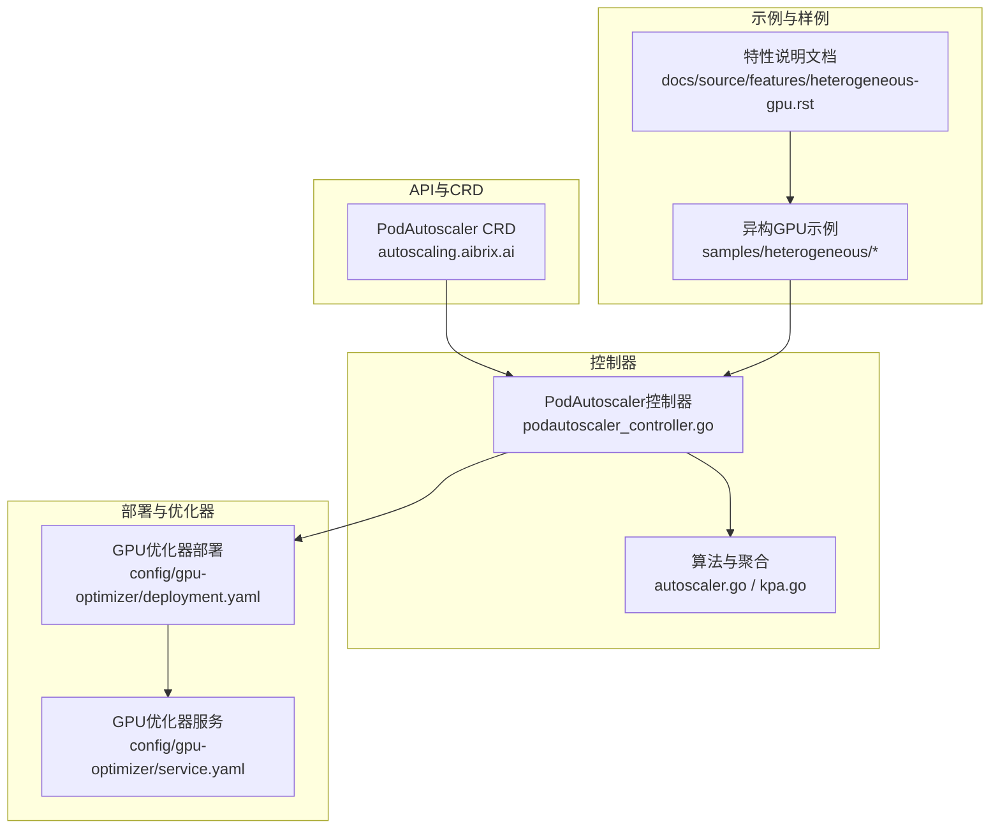
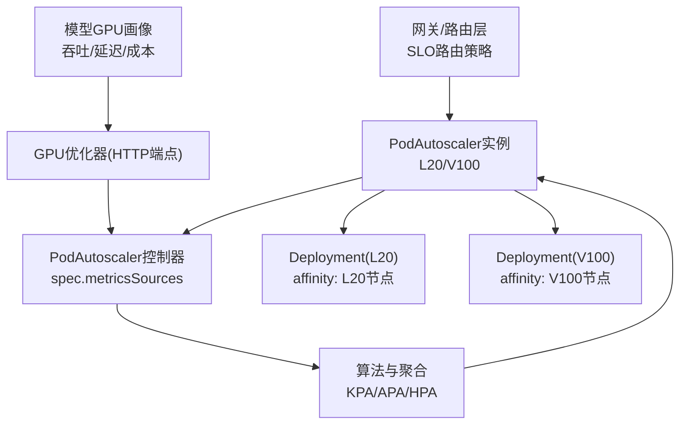
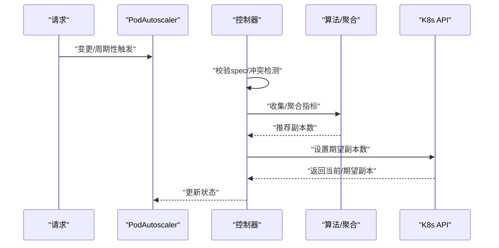
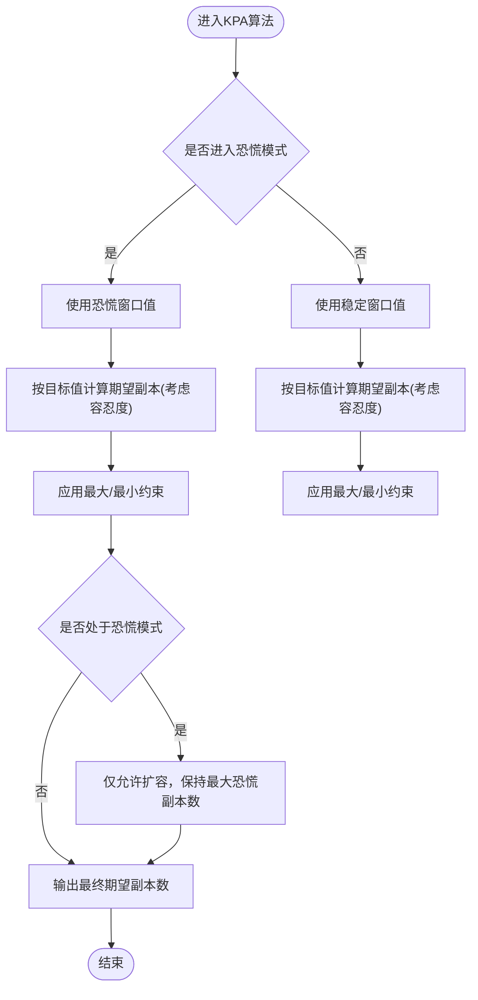
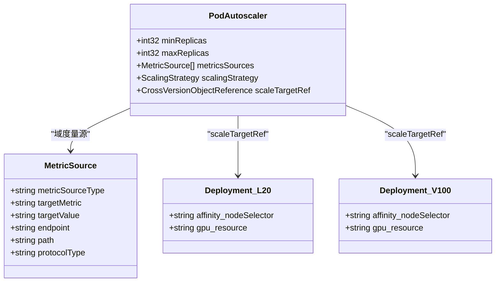
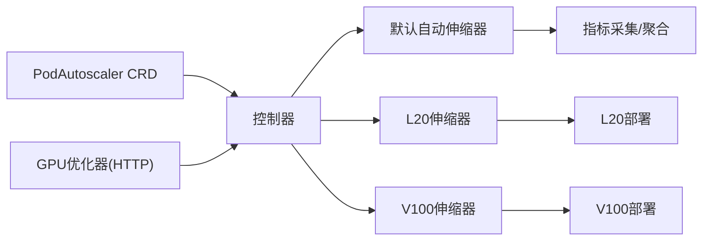

# 异构GPU资源管理

<cite>
**本文引用的文件**
- [heterogeneous-gpu.rst](file://docs/source/features/heterogeneous-gpu.rst)
- [model_gpu_profile.go](file://pkg/cache/model_gpu_profile.go)
- [kustomization.yaml](file://samples/heterogeneous/kustomization.yaml)
- [deepseek-coder-7b-l20-deployment.yaml](file://samples/heterogeneous/deepseek-coder-7b-l20-deployment.yaml)
- [deepseek-coder-7b-v100-deployment.yaml](file://samples/heterogeneous/deepseek-coder-7b-v100-deployment.yaml)
- [deepseek-coder-7b-l20-podautoscaler.yaml](file://samples/heterogeneous/deepseek-coder-7b-l20-podautoscaler.yaml)
- [deepseek-coder-7b-v100-podautoscaler.yaml](file://samples/heterogeneous/deepseek-coder-7b-v100-podautoscaler.yaml)
- [autoscaling.aibrix.ai_podautoscalers.yaml](file://config/crd/autoscaling/autoscaling.aibrix.ai_podautoscalers.yaml)
- [podautoscaler_controller.go](file://pkg/controller/podautoscaler/podautoscaler_controller.go)
- [autoscaler.go](file://pkg/controller/podautoscaler/autoscaler.go)
- [kpa.go](file://pkg/controller/podautoscaler/algorithm/kpa.go)
- [deployment.yaml](file://config/gpu-optimizer/deployment.yaml)
- [service.yaml](file://config/gpu-optimizer/service.yaml)
- [README.md](file://development/tutorials/podautoscaler/README.md)
</cite>

## 目录
1. [简介](#简介)
2. [项目结构](#项目结构)
3. [核心组件](#核心组件)
4. [架构总览](#架构总览)
5. [详细组件分析](#详细组件分析)
6. [依赖关系分析](#依赖关系分析)
7. [性能考量](#性能考量)
8. [故障排查指南](#故障排查指南)
9. [结论](#结论)
10. [附录](#附录)

## 简介
本指南面向在Kubernetes集群中混合部署与调度异构GPU（如A100、A40、V100）推理工作负载的高级用户。文档围绕以下目标展开：统一资源发现与能力评估、基于性能画像的智能调度、多策略弹性伸缩（HPA/KPA/APA）、以及面向SLO的请求路由优化。我们将结合仓库中的异构GPU示例、自定义资源定义（CRD）、控制器实现与Python侧GPU优化器，给出可落地的配置模板与Kustomization示例，并提供性能优化、成本控制与资源利用率提升策略。

## 项目结构
本项目采用分层与功能域结合的组织方式：
- API与CRD：定义PodAutoscaler等资源规范，支撑弹性伸缩与编排。
- 控制器：实现PodAutoscaler控制器、算法与指标采集聚合。
- 示例与样例：提供异构GPU部署、伸缩策略与教程。
- 配置与部署：包含GPU优化器、服务与RBAC等部署清单。



**图表来源**
- [autoscaling.aibrix.ai_podautoscalers.yaml:1-198](file://config/crd/autoscaling/autoscaling.aibrix.ai_podautoscalers.yaml#L1-L198)
- [podautoscaler_controller.go:103-227](file://pkg/controller/podautoscaler/podautoscaler_controller.go#L103-L227)
- [autoscaler.go:65-98](file://pkg/controller/podautoscaler/autoscaler.go#L65-L98)
- [kpa.go:30-88](file://pkg/controller/podautoscaler/algorithm/kpa.go#L30-L88)
- [kustomization.yaml:1-32](file://samples/heterogeneous/kustomization.yaml#L1-L32)
- [deployment.yaml:1-33](file://config/gpu-optimizer/deployment.yaml#L1-L33)
- [service.yaml:1-13](file://config/gpu-optimizer/service.yaml#L1-L13)

**章节来源**
- [autoscaling.aibrix.ai_podautoscalers.yaml:1-198](file://config/crd/autoscaling/autoscaling.aibrix.ai_podautoscalers.yaml#L1-L198)
- [podautoscaler_controller.go:103-227](file://pkg/controller/podautoscaler/podautoscaler_controller.go#L103-L227)
- [kustomization.yaml:1-32](file://samples/heterogeneous/kustomization.yaml#L1-L32)

## 核心组件
- 自定义资源与控制器
  - PodAutoscaler CRD定义了最小/最大副本数、度量源、目标引用与伸缩策略（HPA/KPA/APA），控制器负责校验、冲突检测、状态更新与执行伸缩。
  - 参考：[CRD定义:44-117](file://config/crd/autoscaling/autoscaling.aibrix.ai_podautoscalers.yaml#L44-L117)，[控制器入口与注册:103-227](file://pkg/controller/podautoscaler/podautoscaler_controller.go#L103-L227)。
- 指标采集与聚合
  - 默认自动伸缩器通过工厂模式创建指标采集器，聚合稳定/恐慌窗口指标，再交由具体算法计算推荐副本数。
  - 参考：[默认自动伸缩器:65-98](file://pkg/controller/podautoscaler/autoscaler.go#L65-L98)、[指标采集与聚合流程:237-320](file://pkg/controller/podautoscaler/autoscaler.go#L237-L320)。
- KPA算法（Knase样式）
  - 基于稳定/恐慌窗口阈值与波动容忍度，动态决定是否扩容/缩容；支持激活阈值与最大扩容/缩容速率约束。
  - 参考：[KPA算法实现:30-88](file://pkg/controller/podautoscaler/algorithm/kpa.go#L30-L88)、[核心计算逻辑:98-191](file://pkg/controller/podautoscaler/algorithm/kpa.go#L98-L191)。
- 异构GPU示例与伸缩策略
  - 提供针对不同GPU型号（如L20/V100）的Deployment与PodAutoscaler，分别指向同一模型的不同GPU后端，控制器按度量源决策副本数。
  - 参考：[异构Kustomization:1-32](file://samples/heterogeneous/kustomization.yaml#L1-L32)、[L20部署:1-171](file://samples/heterogeneous/deepseek-coder-7b-l20-deployment.yaml#L1-L171)、[V100部署:1-172](file://samples/heterogeneous/deepseek-coder-7b-v100-deployment.yaml#L1-L172)、[L20伸缩器:1-25](file://samples/heterogeneous/deepseek-coder-7b-l20-podautoscaler.yaml#L1-L25)、[V100伸缩器:1-26](file://samples/heterogeneous/deepseek-coder-7b-v100-podautoscaler.yaml#L1-L26)。
- GPU优化器与SLO路由
  - Python侧GPU优化器提供异构配置的副本建议，通过HTTP端点向PodAutoscaler暴露“域度量”；SLO路由策略根据画像预测选择最优GPU类型与负载。
  - 参考：[特性文档:1-183](file://docs/source/features/heterogeneous-gpu.rst#L1-L183)、[优化器部署:1-33](file://config/gpu-optimizer/deployment.yaml#L1-L33)、[优化器服务:1-13](file://config/gpu-optimizer/service.yaml#L1-L13)。

**章节来源**
- [autoscaling.aibrix.ai_podautoscalers.yaml:44-117](file://config/crd/autoscaling/autoscaling.aibrix.ai_podautoscalers.yaml#L44-L117)
- [podautoscaler_controller.go:270-312](file://pkg/controller/podautoscaler/podautoscaler_controller.go#L270-L312)
- [autoscaler.go:126-205](file://pkg/controller/podautoscaler/autoscaler.go#L126-L205)
- [kpa.go:98-191](file://pkg/controller/podautoscaler/algorithm/kpa.go#L98-L191)
- [kustomization.yaml:1-32](file://samples/heterogeneous/kustomization.yaml#L1-L32)
- [deepseek-coder-7b-l20-podautoscaler.yaml:1-25](file://samples/heterogeneous/deepseek-coder-7b-l20-podautoscaler.yaml#L1-L25)
- [deepseek-coder-7b-v100-podautoscaler.yaml:1-26](file://samples/heterogeneous/deepseek-coder-7b-v100-podautoscaler.yaml#L1-L26)
- [deployment.yaml:1-33](file://config/gpu-optimizer/deployment.yaml#L1-L33)
- [service.yaml:1-13](file://config/gpu-optimizer/service.yaml#L1-L13)

## 架构总览
下图展示了从请求到弹性伸缩与GPU调度的整体流程，包括资源发现、能力评估、任务调度与负载均衡的关键节点。



**图表来源**
- [podautoscaler_controller.go:303-311](file://pkg/controller/podautoscaler/podautoscaler_controller.go#L303-L311)
- [autoscaler.go:126-205](file://pkg/controller/podautoscaler/autoscaler.go#L126-L205)
- [deepseek-coder-7b-l20-podautoscaler.yaml:12-20](file://samples/heterogeneous/deepseek-coder-7b-l20-podautoscaler.yaml#L12-L20)
- [deepseek-coder-7b-v100-podautoscaler.yaml:12-20](file://samples/heterogeneous/deepseek-coder-7b-v100-podautoscaler.yaml#L12-L20)
- [deepseek-coder-7b-l20-deployment.yaml:28-37](file://samples/heterogeneous/deepseek-coder-7b-l20-deployment.yaml#L28-L37)
- [deepseek-coder-7b-v100-deployment.yaml:28-36](file://samples/heterogeneous/deepseek-coder-7b-v100-deployment.yaml#L28-L36)
- [deployment.yaml:18-33](file://config/gpu-optimizer/deployment.yaml#L18-L33)

## 详细组件分析

### 组件A：PodAutoscaler控制器与伸缩策略
- 资源校验与冲突检测：确保目标引用有效、副本上下界合法、策略类型受支持；避免多个伸缩器同时控制同一目标。
- HPA策略：生成并维护标准HPA对象，同步其状态至PodAutoscaler。
- KPA/APA策略：直接计算推荐副本数并应用，支持多度量聚合与算法缓存。
- 关键路径参考：
  - [控制器入口与注册:103-227](file://pkg/controller/podautoscaler/podautoscaler_controller.go#L103-L227)
  - [Reconcile主流程:270-312](file://pkg/controller/podautoscaler/podautoscaler_controller.go#L270-L312)
  - [HPA处理:662-715](file://pkg/controller/podautoscaler/podautoscaler_controller.go#L662-L715)
  - [KPA/APA处理:716-794](file://pkg/controller/podautoscaler/podautoscaler_controller.go#L716-L794)
  - [默认自动伸缩器:65-98](file://pkg/controller/podautoscaler/autoscaler.go#L65-L98)



**图表来源**
- [podautoscaler_controller.go:270-312](file://pkg/controller/podautoscaler/podautoscaler_controller.go#L270-L312)
- [autoscaler.go:126-205](file://pkg/controller/podautoscaler/autoscaler.go#L126-L205)

**章节来源**
- [podautoscaler_controller.go:270-312](file://pkg/controller/podautoscaler/podautoscaler_controller.go#L270-L312)
- [autoscaler.go:126-205](file://pkg/controller/podautoscaler/autoscaler.go#L126-L205)

### 组件B：KPA算法与弹性窗口
- 核心思想：区分稳定窗口与恐慌窗口，恐慌阈值用于快速扩容；通过上/下波动容忍与最大扩容/缩容速率限制抖动。
- 关键参数：目标值、恐慌阈值、激活阈值、上/下波动容忍、最大扩容/缩容速率。
- 参考实现：
  - [KPA算法主体:30-88](file://pkg/controller/podautoscaler/algorithm/kpa.go#L30-L88)
  - [核心计算与约束:98-191](file://pkg/controller/podautoscaler/algorithm/kpa.go#L98-L191)



**图表来源**
- [kpa.go:90-191](file://pkg/controller/podautoscaler/algorithm/kpa.go#L90-L191)

**章节来源**
- [kpa.go:90-191](file://pkg/controller/podautoscaler/algorithm/kpa.go#L90-L191)

### 组件C：异构GPU部署与PodAutoscaler
- 资源组织：每个GPU型号一个Deployment，配合独立的PodAutoscaler；通过节点亲和限定GPU类型。
- 最小副本策略：通过标签指定无负载时的最小副本数，避免系统在空闲时完全缩容。
- 参考样例：
  - [异构Kustomization:1-32](file://samples/heterogeneous/kustomization.yaml#L1-L32)
  - [L20部署（节点亲和）:28-37](file://samples/heterogeneous/deepseek-coder-7b-l20-deployment.yaml#L28-L37)
  - [V100部署（节点亲和）:28-36](file://samples/heterogeneous/deepseek-coder-7b-v100-deployment.yaml#L28-L36)
  - [L20伸缩器（域度量源）:12-20](file://samples/heterogeneous/deepseek-coder-7b-l20-podautoscaler.yaml#L12-L20)
  - [V100伸缩器（域度量源）:12-20](file://samples/heterogeneous/deepseek-coder-7b-v100-podautoscaler.yaml#L12-L20)



**图表来源**
- [deepseek-coder-7b-l20-podautoscaler.yaml:12-20](file://samples/heterogeneous/deepseek-coder-7b-l20-podautoscaler.yaml#L12-L20)
- [deepseek-coder-7b-v100-podautoscaler.yaml:12-20](file://samples/heterogeneous/deepseek-coder-7b-v100-podautoscaler.yaml#L12-L20)
- [deepseek-coder-7b-l20-deployment.yaml:28-37](file://samples/heterogeneous/deepseek-coder-7b-l20-deployment.yaml#L28-L37)
- [deepseek-coder-7b-v100-deployment.yaml:28-36](file://samples/heterogeneous/deepseek-coder-7b-v100-deployment.yaml#L28-L36)

**章节来源**
- [kustomization.yaml:1-32](file://samples/heterogeneous/kustomization.yaml#L1-L32)
- [deepseek-coder-7b-l20-podautoscaler.yaml:1-25](file://samples/heterogeneous/deepseek-coder-7b-l20-podautoscaler.yaml#L1-L25)
- [deepseek-coder-7b-v100-podautoscaler.yaml:1-26](file://samples/heterogeneous/deepseek-coder-7b-v100-podautoscaler.yaml#L1-L26)
- [deepseek-coder-7b-l20-deployment.yaml:28-37](file://samples/heterogeneous/deepseek-coder-7b-l20-deployment.yaml#L28-L37)
- [deepseek-coder-7b-v100-deployment.yaml:28-36](file://samples/heterogeneous/deepseek-coder-7b-v100-deployment.yaml#L28-L36)

### 组件D：GPU优化器与SLO路由
- 运行机制：Python侧GPU优化器持续运行，依据离线画像数据与实时请求特征，输出每种GPU类型的最优副本建议；通过HTTP端点暴露给PodAutoscaler作为域度量源。
- SLO路由策略：请求需显式携带路由策略头以启用SLO路由，系统据此将请求分配至满足SLO的GPU组合，减少排队与抖动。
- 参考：
  - [特性文档（含SLO路由与流程）:130-183](file://docs/source/features/heterogeneous-gpu.rst#L130-L183)
  - [优化器部署与服务:1-33](file://config/gpu-optimizer/deployment.yaml#L1-L33)、(file://config/gpu-optimizer/service.yaml#L1-L13)

```mermaid
sequenceDiagram
participant Client as "客户端"
participant Gateway as "网关/SLO路由"
participant Opt as "GPU优化器(HTTP)"
participant PA as "PodAutoscaler"
participant Ctrl as "控制器"
participant K8s as "K8s API"
Client->>Gateway : "带SLO路由头的请求"
Gateway->>Opt : "查询最优GPU配置"
Opt-->>Gateway : "返回副本建议"
Gateway-->>PA : "转发请求"
PA->>Ctrl : "读取域度量源"
Ctrl->>Opt : "HTTP GET /metrics/... (域度量)"
Opt-->>Ctrl : "返回推荐副本数"
Ctrl->>K8s : "设置期望副本"
K8s-->>Ctrl : "返回当前/期望副本"
Ctrl-->>PA : "更新状态"
```

**图表来源**
- [heterogeneous-gpu.rst:130-183](file://docs/source/features/heterogeneous-gpu.rst#L130-L183)
- [deployment.yaml:18-33](file://config/gpu-optimizer/deployment.yaml#L18-L33)
- [service.yaml:1-13](file://config/gpu-optimizer/service.yaml#L1-L13)
- [podautoscaler_controller.go:303-311](file://pkg/controller/podautoscaler/podautoscaler_controller.go#L303-L311)

**章节来源**
- [heterogeneous-gpu.rst:130-183](file://docs/source/features/heterogeneous-gpu.rst#L130-L183)
- [deployment.yaml:1-33](file://config/gpu-optimizer/deployment.yaml#L1-L33)
- [service.yaml:1-13](file://config/gpu-optimizer/service.yaml#L1-L13)

## 依赖关系分析
- 控制器对CRD的依赖：PodAutoscaler控制器依赖CRD定义的字段与校验规则。
- 指标与算法：默认自动伸缩器依赖指标采集器与聚合器，算法缓存提升并发效率。
- 异构部署：每个GPU型号对应独立Deployment与PodAutoscaler，互不冲突且共享同一模型。
- 优化器集成：PodAutoscaler通过域度量源访问GPU优化器HTTP端点。



**图表来源**
- [autoscaling.aibrix.ai_podautoscalers.yaml:44-117](file://config/crd/autoscaling/autoscaling.aibrix.ai_podautoscalers.yaml#L44-L117)
- [podautoscaler_controller.go:103-227](file://pkg/controller/podautoscaler/podautoscaler_controller.go#L103-L227)
- [autoscaler.go:65-98](file://pkg/controller/podautoscaler/autoscaler.go#L65-L98)
- [deepseek-coder-7b-l20-podautoscaler.yaml:12-20](file://samples/heterogeneous/deepseek-coder-7b-l20-podautoscaler.yaml#L12-L20)
- [deepseek-coder-7b-v100-podautoscaler.yaml:12-20](file://samples/heterogeneous/deepseek-coder-7b-v100-podautoscaler.yaml#L12-L20)
- [deployment.yaml:18-33](file://config/gpu-optimizer/deployment.yaml#L18-L33)

**章节来源**
- [autoscaling.aibrix.ai_podautoscalers.yaml:44-117](file://config/crd/autoscaling/autoscaling.aibrix.ai_podautoscalers.yaml#L44-L117)
- [podautoscaler_controller.go:103-227](file://pkg/controller/podautoscaler/podautoscaler_controller.go#L103-L227)
- [autoscaler.go:65-98](file://pkg/controller/podautoscaler/autoscaler.go#L65-L98)

## 性能考量
- 指标采集与聚合
  - 使用稳定的窗口与恐慌窗口分离，降低抖动；通过波动容忍与最大/最小速率限制，避免频繁扩缩。
  - 参考：[KPA算法约束:98-191](file://pkg/controller/podautoscaler/algorithm/kpa.go#L98-L191)。
- 多度量聚合
  - 对多个度量源取最大推荐副本，确保满足最严苛指标；注意度量源失败不影响其他度量。
  - 参考：[多度量聚合:178-204](file://pkg/controller/podautoscaler/autoscaler.go#L178-L204)。
- 节点亲和与隔离
  - 通过节点亲和限定GPU类型，避免跨型号混部导致的资源争用与调度不确定性。
  - 参考：[L20亲和:28-37](file://samples/heterogeneous/deepseek-coder-7b-l20-deployment.yaml#L28-L37)、[V100亲和:28-36](file://samples/heterogeneous/deepseek-coder-7b-v100-deployment.yaml#L28-L36)。
- SLO路由
  - 启用SLO路由策略，结合画像预测，将请求定向至更优GPU，减少排队与尾延迟。
  - 参考：[SLO路由说明:130-183](file://docs/source/features/heterogeneous-gpu.rst#L130-L183)。

[本节为通用指导，无需特定文件来源]

## 故障排查指南
- PodAutoscaler状态异常
  - 检查控制器日志中“ValidSpec/ScalingActive/AbleToScale/Ready”条件与事件，定位配置错误或冲突。
  - 参考：[状态计算与条件:595-660](file://pkg/controller/podautoscaler/podautoscaler_controller.go#L595-L660)。
- 度量源无效
  - 确认度量源类型、目标指标、目标值与协议端口正确；域度量源需可达优化器HTTP端点。
  - 参考：[度量源校验:421-460](file://pkg/controller/podautoscaler/podautoscaler_controller.go#L421-L460)、[域度量源:13-18](file://samples/heterogeneous/deepseek-coder-7b-l20-podautoscaler.yaml#L13-L18)。
- 冲突与覆盖
  - 若多个PodAutoscaler控制同一目标，会报告冲突；请清理重复配置。
  - 参考：[冲突检测:351-380](file://pkg/controller/podautoscaler/podautoscaler_controller.go#L351-L380)。
- HPA创建失败
  - 检查RBAC权限与HPA资源存在性；控制器会尝试创建/更新HPA。
  - 参考：[HPA处理:662-715](file://pkg/controller/podautoscaler/podautoscaler_controller.go#L662-L715)。
- KPA/APA未生效
  - 确认策略类型为KPA/APA且目标引用正确；查看事件中“AlgorithmRun/SuccessfulRescale”。
  - 参考：[KPA/APA处理:716-794](file://pkg/controller/podautoscaler/podautoscaler_controller.go#L716-L794)、[教程事件示例:196-223](file://development/tutorials/podautoscaler/README.md#L196-L223)。

**章节来源**
- [podautoscaler_controller.go:595-660](file://pkg/controller/podautoscaler/podautoscaler_controller.go#L595-L660)
- [podautoscaler_controller.go:421-460](file://pkg/controller/podautoscaler/podautoscaler_controller.go#L421-L460)
- [podautoscaler_controller.go:351-380](file://pkg/controller/podautoscaler/podautoscaler_controller.go#L351-L380)
- [podautoscaler_controller.go:662-715](file://pkg/controller/podautoscaler/podautoscaler_controller.go#L662-L715)
- [podautoscaler_controller.go:716-794](file://pkg/controller/podautoscaler/podautoscaler_controller.go#L716-L794)
- [README.md:196-223](file://development/tutorials/podautoscaler/README.md#L196-L223)

## 结论
通过将PodAutoscaler控制器、KPA/APA算法、域度量源与GPU优化器有机结合，AIBrix实现了对异构GPU集群的智能化管理与动态分配。结合节点亲和与SLO路由，可在保证SLA的前提下最大化资源利用率并控制成本。建议在生产环境中：
- 为每种GPU型号分别部署独立的Deployment与PodAutoscaler；
- 使用域度量源对接GPU优化器，提供动态副本建议；
- 启用SLO路由策略，结合画像数据进行请求定向；
- 设置合理的波动容忍与最大/最小速率，平衡稳定性与响应速度。

[本节为总结，无需特定文件来源]

## 附录

### A. 异构GPU配置模板与Kustomization示例
- 异构Kustomization
  - 资源清单：服务、L20/V100部署、各自PodAutoscaler。
  - 最小副本标签：为V100设置非零最小副本，确保空闲时仍保活。
  - 参考：[kustomization.yaml:1-32](file://samples/heterogeneous/kustomization.yaml#L1-L32)
- L20部署
  - 节点亲和限定L20；容器镜像与模型路径；健康探针与生命周期钩子。
  - 参考：[L20部署:1-171](file://samples/heterogeneous/deepseek-coder-7b-l20-deployment.yaml#L1-L171)
- V100部署
  - 节点亲和限定V100；容器镜像与模型路径；健康探针与生命周期钩子。
  - 参考：[V100部署:1-172](file://samples/heterogeneous/deepseek-coder-7b-v100-deployment.yaml#L1-L172)
- L20伸缩器
  - 域度量源指向优化器HTTP端点；最小/最大副本与策略类型。
  - 参考：[L20伸缩器:1-25](file://samples/heterogeneous/deepseek-coder-7b-l20-podautoscaler.yaml#L1-L25)
- V100伸缩器
  - 域度量源指向优化器HTTP端点；最小/最大副本与策略类型。
  - 参考：[V100伸缩器:1-26](file://samples/heterogeneous/deepseek-coder-7b-v100-podautoscaler.yaml#L1-L26)

**章节来源**
- [kustomization.yaml:1-32](file://samples/heterogeneous/kustomization.yaml#L1-L32)
- [deepseek-coder-7b-l20-deployment.yaml:1-171](file://samples/heterogeneous/deepseek-coder-7b-l20-deployment.yaml#L1-L171)
- [deepseek-coder-7b-v100-deployment.yaml:1-172](file://samples/heterogeneous/deepseek-coder-7b-v100-deployment.yaml#L1-L172)
- [deepseek-coder-7b-l20-podautoscaler.yaml:1-25](file://samples/heterogeneous/deepseek-coder-7b-l20-podautoscaler.yaml#L1-L25)
- [deepseek-coder-7b-v100-podautoscaler.yaml:1-26](file://samples/heterogeneous/deepseek-coder-7b-v100-podautoscaler.yaml#L1-L26)

### B. 模型GPU画像与性能指标
- 数据结构
  - 包含吞吐、端到端延迟、首Token时间、每输出Token时间、SLO等；支持对特征进行对数归一化与签名匹配。
  - 参考：[模型GPU画像结构:59-79](file://pkg/cache/model_gpu_profile.go#L59-L79)、[签名与查找:99-154](file://pkg/cache/model_gpu_profile.go#L99-L154)
- 使用场景
  - 为不同GPU型号与工作负载生成画像，驱动GPU优化器与SLO路由策略。
  - 参考：[特性文档（画像与SLO）:94-104](file://docs/source/features/heterogeneous-gpu.rst#L94-L104)

**章节来源**
- [model_gpu_profile.go:59-79](file://pkg/cache/model_gpu_profile.go#L59-L79)
- [model_gpu_profile.go:99-154](file://pkg/cache/model_gpu_profile.go#L99-L154)
- [heterogeneous-gpu.rst:94-104](file://docs/source/features/heterogeneous-gpu.rst#L94-L104)

### C. 部署与验证教程
- 安装与运行
  - 编译CRD与管理器；本地或容器部署；检查控制器日志与事件。
  - 参考：[教程说明:6-90](file://development/tutorials/podautoscaler/README.md#L6-L90)
- HPA/KPA/APA示例
  - 创建示例应用与不同类型的PodAutoscaler，观察扩缩容效果与事件。
  - 参考：[HPA示例:92-162](file://development/tutorials/podautoscaler/README.md#L92-L162)、[KPA示例:163-224](file://development/tutorials/podautoscaler/README.md#L163-L224)、[APA示例:307-378](file://development/tutorials/podautoscaler/README.md#L307-L378)

**章节来源**
- [README.md:6-90](file://development/tutorials/podautoscaler/README.md#L6-L90)
- [README.md:92-162](file://development/tutorials/podautoscaler/README.md#L92-L162)
- [README.md:163-224](file://development/tutorials/podautoscaler/README.md#L163-L224)
- [README.md:307-378](file://development/tutorials/podautoscaler/README.md#L307-L378)