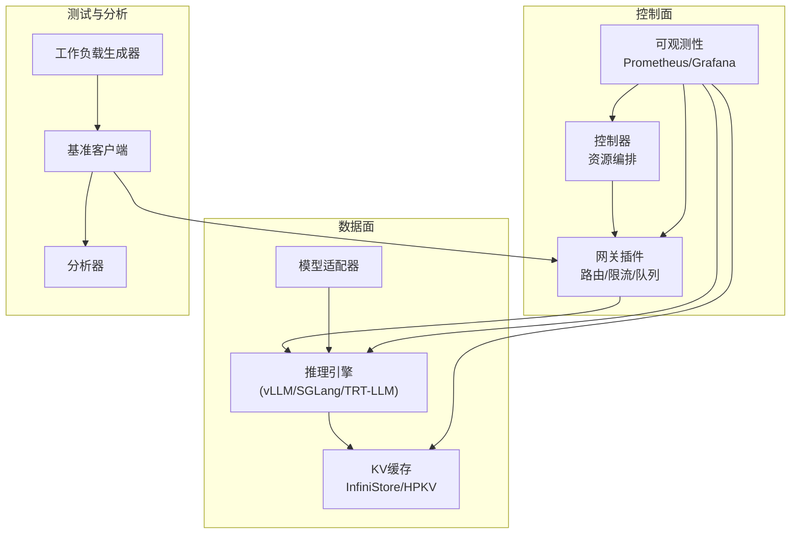
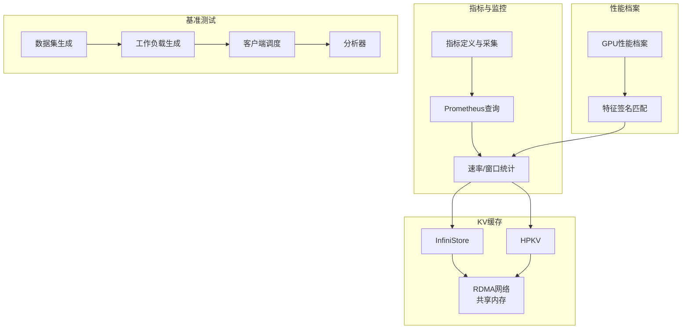
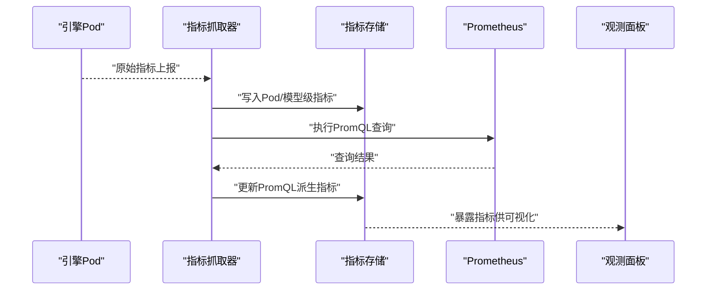
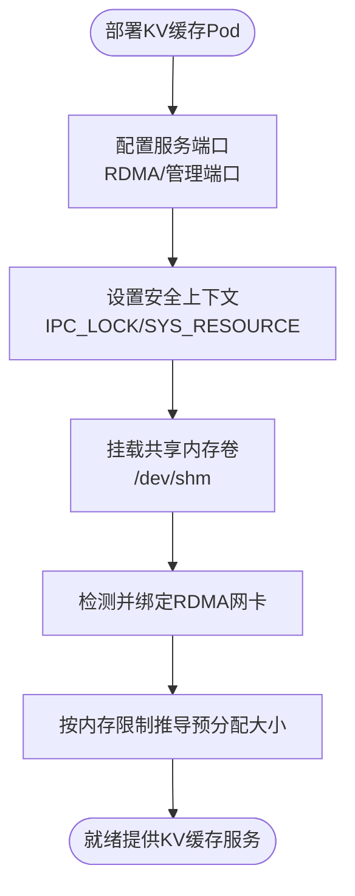
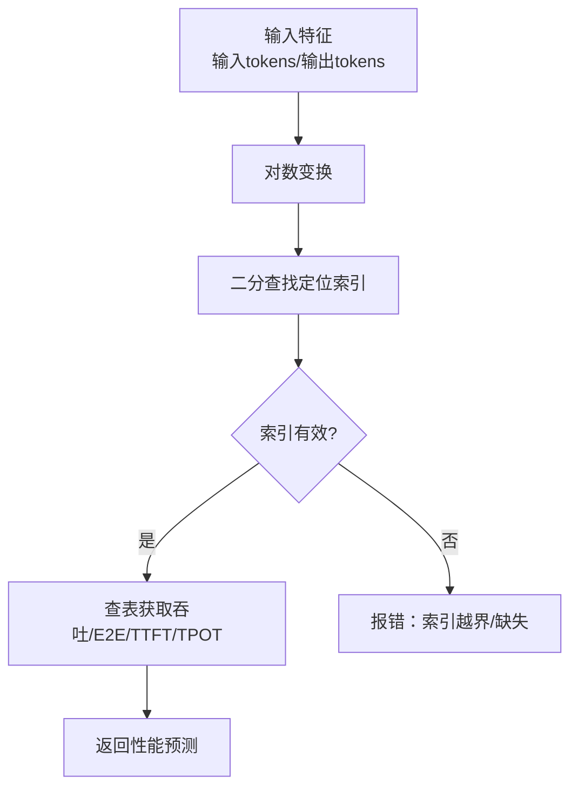
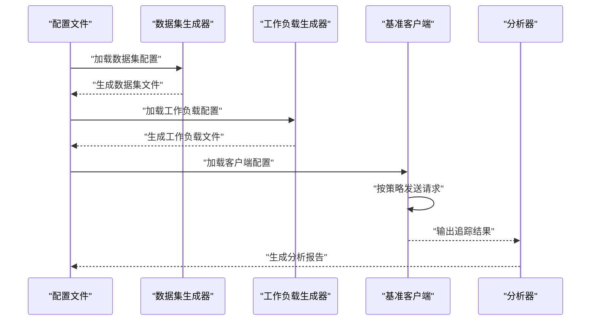
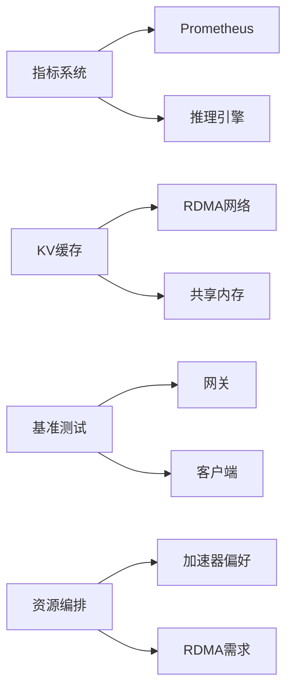

# 性能优化

<cite>
**本文引用的文件**
- [benchmarks/README.md](file://benchmarks/README.md)
- [benchmarks/benchmark.py](file://benchmarks/benchmark.py)
- [pkg/cache/cache_metrics.go](file://pkg/cache/cache_metrics.go)
- [pkg/metrics/metrics.go](file://pkg/metrics/metrics.go)
- [pkg/cache/cache_profile.go](file://pkg/cache/cache_profile.go)
- [pkg/cache/model_gpu_profile.go](file://pkg/cache/model_gpu_profile.go)
- [pkg/controller/kvcache/backends/infinistore.go](file://pkg/controller/kvcache/backends/infinistore.go)
- [pkg/controller/kvcache/backends/hpkv.go](file://pkg/controller/kvcache/backends/hpkv.go)
- [apps/console/api/resource_manager/types/provision.go](file://apps/console/api/resource_manager/types/provision.go)
- [hack/rdma/detect-gid-in-container.sh](file://hack/rdma/detect-gid-in-container.sh)
- [hack/rdma/search-gid.sh](file://hack/rdma/search-gid.sh)
</cite>

## 目录
1. [简介](#简介)
2. [项目结构](#项目结构)
3. [核心组件](#核心组件)
4. [架构总览](#架构总览)
5. [详细组件分析](#详细组件分析)
6. [依赖关系分析](#依赖关系分析)
7. [性能考量](#性能考量)
8. [故障排查指南](#故障排查指南)
9. [结论](#结论)
10. [附录](#附录)

## 简介
本指南面向AIBrix系统在生产环境中的性能优化与调优，聚焦以下目标：
- 系统性识别性能瓶颈（缓存、内存、网络、计算）
- 建立可落地的优化策略与监控体系
- 提供覆盖基准测试、压力测试与回归测试的性能测试工具使用方法
- 面向多硬件环境（GPU加速、RDMA网络、SSD存储）给出优化建议
- 通过真实测试案例展示吞吐与延迟的平衡优化路径

## 项目结构
AIBrix围绕“控制面+数据面”分层组织，性能相关能力主要分布在如下模块：
- 控制面：控制器、资源编排、网关插件、可观测性（Prometheus/Grafana）
- 数据面：推理引擎、KV缓存（含InfiniStore/HPKV）、模型适配器
- 测试与分析：基准测试框架、工作负载生成器、客户端与分析器

[本图为概念性结构示意，不直接映射具体源码文件，故无图表来源]

## 核心组件
- 指标采集与聚合：统一指标定义、按Pod/模型维度采集、PromQL查询与速率计算
- KV缓存后端：InfiniStore与HPKV，支持RDMA网络与共享内存，提供高吞吐低延迟缓存访问
- 模型GPU性能档案：基于输入/输出特征的索引化性能曲线，支撑成本与性能权衡
- 基准测试框架：数据集生成、工作负载生成、客户端调度与结果分析一体化流程

章节来源
- [pkg/cache/cache_metrics.go:1-581](file://pkg/cache/cache_metrics.go#L1-L581)
- [pkg/metrics/metrics.go:1-796](file://pkg/metrics/metrics.go#L1-L796)
- [pkg/cache/cache_profile.go:1-71](file://pkg/cache/cache_profile.go#L1-L71)
- [pkg/cache/model_gpu_profile.go:1-197](file://pkg/cache/model_gpu_profile.go#L1-L197)
- [pkg/controller/kvcache/backends/infinistore.go:1-438](file://pkg/controller/kvcache/backends/infinistore.go#L1-L438)
- [pkg/controller/kvcache/backends/hpkv.go:1-425](file://pkg/controller/kvcache/backends/hpkv.go#L1-L425)
- [benchmarks/benchmark.py:1-370](file://benchmarks/benchmark.py#L1-L370)

## 架构总览
下图展示性能相关的关键交互：指标采集与查询、KV缓存后端、GPU性能档案与基准测试。

图表来源
- [pkg/cache/cache_metrics.go:225-420](file://pkg/cache/cache_metrics.go#L225-L420)
- [pkg/metrics/metrics.go:102-794](file://pkg/metrics/metrics.go#L102-L794)
- [pkg/controller/kvcache/backends/infinistore.go:284-363](file://pkg/controller/kvcache/backends/infinistore.go#L284-L363)
- [pkg/controller/kvcache/backends/hpkv.go:291-376](file://pkg/controller/kvcache/backends/hpkv.go#L291-L376)
- [pkg/cache/model_gpu_profile.go:59-197](file://pkg/cache/model_gpu_profile.go#L59-L197)
- [benchmarks/benchmark.py:96-331](file://benchmarks/benchmark.py#L96-L331)

## 详细组件分析

### 组件A：指标采集与监控（缓存/引擎/网关）
- 指标类型覆盖：计数器/计量器、直方图、标签查询、PromQL查询
- 采集策略：按Pod与模型维度拉取原始指标；对特定指标计算每秒速率；PromQL聚合计算窗口统计
- 关键指标：请求时延、TTFT/TPOT、吞吐、KV缓存命中率、GPU/CPU缓存占用、排队时间、推理阶段耗时
- 速率与历史：维护滑动窗口与历史记录，支持丢弃过期条目，避免内存膨胀

图表来源
- [pkg/cache/cache_metrics.go:242-350](file://pkg/cache/cache_metrics.go#L242-L350)
- [pkg/cache/cache_metrics.go:353-420](file://pkg/cache/cache_metrics.go#L353-L420)
- [pkg/metrics/metrics.go:102-794](file://pkg/metrics/metrics.go#L102-L794)

章节来源
- [pkg/cache/cache_metrics.go:126-581](file://pkg/cache/cache_metrics.go#L126-L581)
- [pkg/metrics/metrics.go:19-100](file://pkg/metrics/metrics.go#L19-L100)

### 组件B：KV缓存后端（InfiniStore/HPKV）与RDMA
- InfiniStore/HPKV均启用共享内存（/dev/shm）以降低跨进程/跨节点拷贝开销
- 容器安全上下文要求IPC_LOCK与SYS_RESOURCE（InfiniStore），或仅IPC_LOCK（HPKV）
- RDMA端口与管理端口配置，结合CNI注解启用RDMA网络
- 内存预分配：根据容器内存限制推导预分配大小，避免运行时抖动

图表来源
- [pkg/controller/kvcache/backends/infinistore.go:313-363](file://pkg/controller/kvcache/backends/infinistore.go#L313-L363)
- [pkg/controller/kvcache/backends/hpkv.go:321-376](file://pkg/controller/kvcache/backends/hpkv.go#L321-L376)
- [pkg/controller/kvcache/backends/infinistore.go:414-437](file://pkg/controller/kvcache/backends/infinistore.go#L414-L437)
- [pkg/controller/kvcache/backends/hpkv.go:415-424](file://pkg/controller/kvcache/backends/hpkv.go#L415-L424)

章节来源
- [pkg/controller/kvcache/backends/infinistore.go:284-437](file://pkg/controller/kvcache/backends/infinistore.go#L284-L437)
- [pkg/controller/kvcache/backends/hpkv.go:291-424](file://pkg/controller/kvcache/backends/hpkv.go#L291-L424)

### 组件C：GPU性能档案与特征签名匹配
- 档案结构：包含成本、吞吐、E2E/TFFT/TPOT、SLO等，特征索引采用对数刻度离散化
- 签名匹配：对输入/输出特征取对数后二分查找最邻近索引，返回对应性能值
- 缓存开关：可通过环境变量控制是否启用Redis缓存更新

图表来源
- [pkg/cache/model_gpu_profile.go:99-154](file://pkg/cache/model_gpu_profile.go#L99-L154)
- [pkg/cache/model_gpu_profile.go:170-197](file://pkg/cache/model_gpu_profile.go#L170-L197)
- [pkg/cache/cache_profile.go:24-71](file://pkg/cache/cache_profile.go#L24-L71)

章节来源
- [pkg/cache/model_gpu_profile.go:59-197](file://pkg/cache/model_gpu_profile.go#L59-L197)
- [pkg/cache/cache_profile.go:24-71](file://pkg/cache/cache_profile.go#L24-L71)

### 组件D：基准测试工具链（数据集/工作负载/客户端/分析）
- 数据集生成：支持合成共享、多轮对话、ShareGPT转换、客户端trace转换
- 工作负载生成：常量/合成/统计/azure/mooncake等多种模式，支持并发会话上限
- 客户端：批处理/流式模式，支持超时、重试、路由策略、令牌上限
- 分析：按E2E/TTFT/TPOT等指标评估吞吐与延迟目标达成情况

图表来源
- [benchmarks/benchmark.py:96-331](file://benchmarks/benchmark.py#L96-L331)
- [benchmarks/README.md:72-431](file://benchmarks/README.md#L72-L431)

章节来源
- [benchmarks/benchmark.py:1-370](file://benchmarks/benchmark.py#L1-L370)
- [benchmarks/README.md:1-431](file://benchmarks/README.md#L1-L431)

## 依赖关系分析
- 指标系统依赖Prometheus端点与引擎指标暴露端口，PromQL查询用于派生速率与窗口统计
- KV缓存后端依赖RDMA网络与共享内存，容器需具备相应权限与CNI配置
- 基准测试依赖Kubernetes集群端口转发与API密钥，确保客户端可达网关服务
- 资源编排层面，可通过加速器偏好与RDMA需求描述硬件约束

图表来源
- [pkg/cache/cache_metrics.go:166-182](file://pkg/cache/cache_metrics.go#L166-L182)
- [pkg/controller/kvcache/backends/infinistore.go:260-271](file://pkg/controller/kvcache/backends/infinistore.go#L260-L271)
- [pkg/controller/kvcache/backends/hpkv.go:268-279](file://pkg/controller/kvcache/backends/hpkv.go#L268-L279)
- [apps/console/api/resource_manager/types/provision.go:136-192](file://apps/console/api/resource_manager/types/provision.go#L136-L192)

章节来源
- [pkg/cache/cache_metrics.go:166-182](file://pkg/cache/cache_metrics.go#L166-L182)
- [pkg/controller/kvcache/backends/infinistore.go:260-271](file://pkg/controller/kvcache/backends/infinistore.go#L260-L271)
- [pkg/controller/kvcache/backends/hpkv.go:268-279](file://pkg/controller/kvcache/backends/hpkv.go#L268-L279)
- [apps/console/api/resource_manager/types/provision.go:136-192](file://apps/console/api/resource_manager/types/provision.go#L136-L192)

## 性能考量
- 缓存优化
  - 启用共享内存与RDMA，减少跨进程/跨节点复制
  - 合理设置预分配内存，避免运行时扩容抖动
  - 利用前缀缓存命中与外部前缀缓存提升命中率
- 内存管理
  - 控制指标历史长度与窗口大小，防止内存持续增长
  - 在高变更频率集群中定期清理Pod级历史条目
- 网络传输
  - 使用RDMA网络与专用管理端口，降低时延与CPU占用
  - 通过CNI注解启用RDMA，确保容器内可见RDMA网卡
- 计算加速
  - 基于GPU性能档案进行成本-性能权衡，选择合适加速器类型与精度
  - 结合SLO目标（E2E、TTFT、TPOT）进行容量规划
- 监控与告警
  - 聚合关键指标（P95 TTFT/TPOT、平均E2E、吞吐）并设定阈值
  - 对PromQL查询失败与引擎指标查询失败进行告警

[本节为通用指导，不直接分析具体文件，故无章节来源]

## 故障排查指南
- 指标不可达/查询失败
  - 检查Prometheus端点与凭据配置，确认Pod指标端口与路径
  - 关注查询失败计数指标，定位查询异常
- RDMA无法启动
  - 确认容器具备IPC_LOCK/SYS_RESOURCE权限
  - 使用RDMA探测脚本检查GID/网卡状态
- 性能档案未生效
  - 检查Redis键扫描与反序列化过程，确认键命名规范
  - 开启/关闭缓存开关以验证性能影响

章节来源
- [pkg/cache/cache_metrics.go:166-223](file://pkg/cache/cache_metrics.go#L166-L223)
- [pkg/cache/cache_metrics.go:353-420](file://pkg/cache/cache_metrics.go#L353-L420)
- [hack/rdma/detect-gid-in-container.sh](file://hack/rdma/detect-gid-in-container.sh)
- [hack/rdma/search-gid.sh](file://hack/rdma/search-gid.sh)
- [pkg/cache/cache_profile.go:24-71](file://pkg/cache/cache_profile.go#L24-L71)

## 结论
AIBrix通过统一指标体系、RDMA/KV缓存优化与GPU性能档案，构建了从“观测—优化—验证”的闭环。结合基准测试工具链，可在不同硬件环境下实现吞吐与延迟的平衡优化，并通过持续监控与回归测试保障稳定性。

[本节为总结性内容，不直接分析具体文件，故无章节来源]

## 附录
- RDMA辅助脚本：用于容器内GID/网卡探测，辅助定位RDMA问题
- 资源编排：加速器偏好与RDMA需求字段，便于在部署时表达硬件约束

章节来源
- [hack/rdma/detect-gid-in-container.sh](file://hack/rdma/detect-gid-in-container.sh)
- [hack/rdma/search-gid.sh](file://hack/rdma/search-gid.sh)
- [apps/console/api/resource_manager/types/provision.go:136-192](file://apps/console/api/resource_manager/types/provision.go#L136-L192)