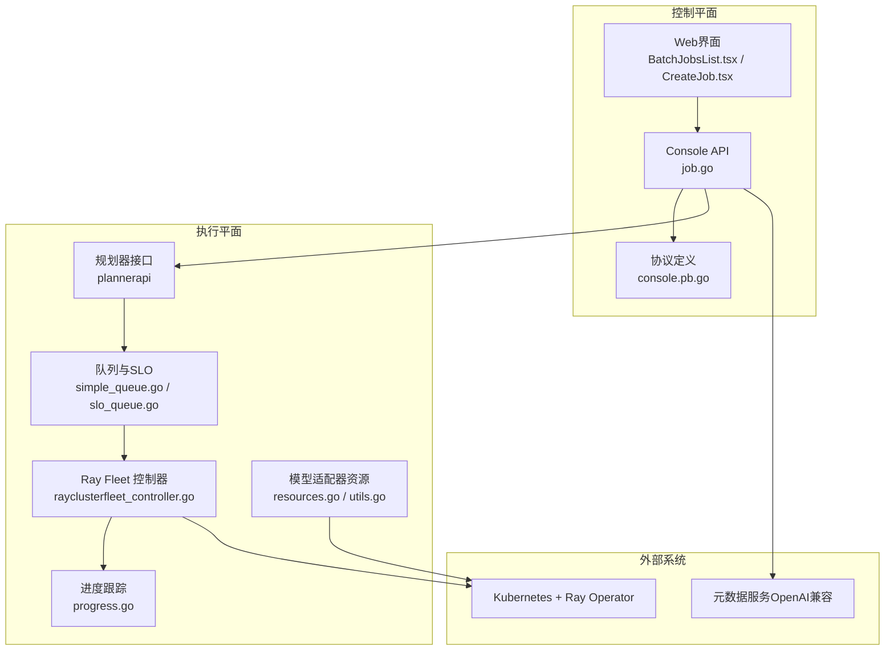
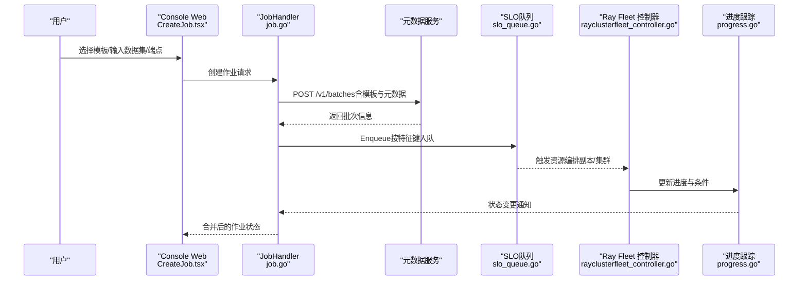
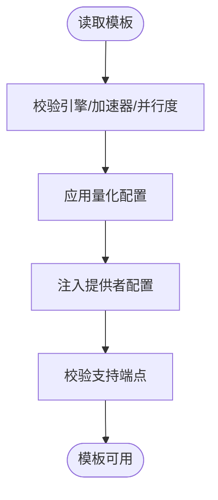
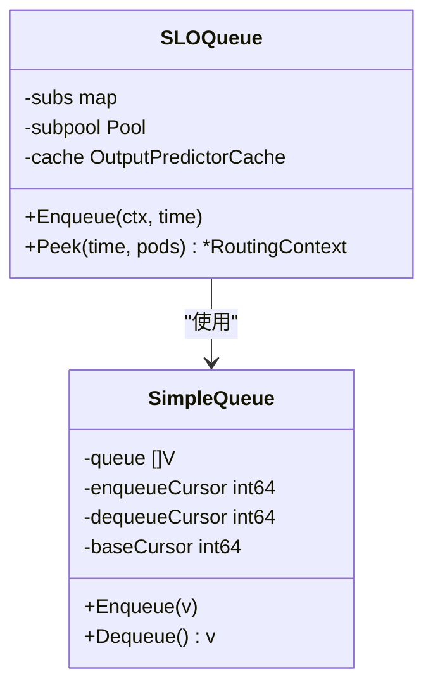
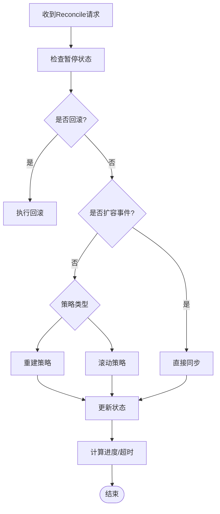
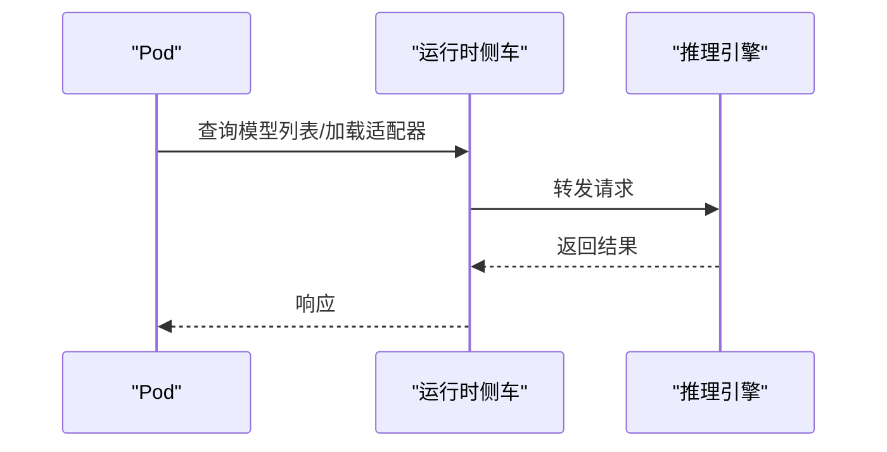
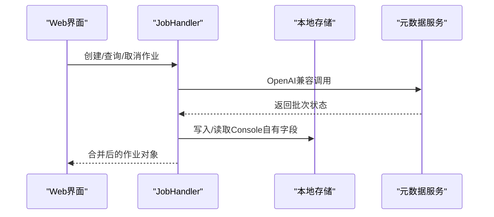
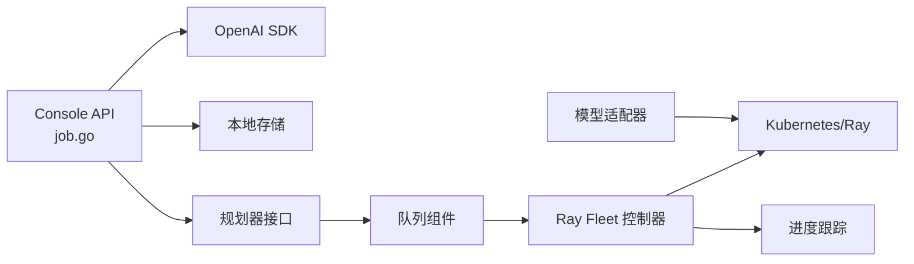

# 批处理优化

<cite>
**本文引用的文件**
- [batch_v1alpha1_model_deployment_templates.yaml](file://samples/batch/batch_v1alpha1_model_deployment_templates.yaml)
- [batch_v1alpha1_batch_profiles.yaml](file://samples/batch/batch_profiles.yaml)
- [job.go](file://apps/console/api/handler/job.go)
- [console.pb.go](file://apps/console/api/gen/console/v1/console.pb.go)
- [simple_queue.go](file://pkg/plugins/gateway/queue/simple_queue.go)
- [slo_queue.go](file://pkg/plugins/gateway/queue/slo_queue.go)
- [rayclusterfleet_controller.go](file://pkg/controller/rayclusterfleet/rayclusterfleet_controller.go)
- [progress.go](file://pkg/controller/rayclusterfleet/progress.go)
- [resources.go](file://pkg/controller/modeladapter/resources.go)
- [utils.go](file://pkg/controller/modeladapter/utils.go)
- [pd_disaggregation_test.go](file://pkg/plugins/gateway/algorithms/pd_disaggregation_test.go)
- [BatchJobsList.tsx](file://apps/console/web/src/components/BatchJobsList.tsx)
- [CreateJob.tsx](file://apps/console/web/src/components/CreateJob.tsx)
- [ModelDetail.tsx](file://apps/console/web/src/components/ModelDetail.tsx)
</cite>

## 目录
1. [简介](#简介)
2. [项目结构](#项目结构)
3. [核心组件](#核心组件)
4. [架构总览](#架构总览)
5. [详细组件分析](#详细组件分析)
6. [依赖分析](#依赖分析)
7. [性能考虑](#性能考虑)
8. [故障排查指南](#故障排查指南)
9. [结论](#结论)
10. [附录](#附录)

## 简介
本指南面向企业级批处理平台的高级配置与优化，围绕AIBrix批处理系统的模板体系、作业队列与进度跟踪、资源编排与调度策略展开，提供可落地的配置模板与优化建议，覆盖大规模数据处理、模型训练批处理、推理结果导出等典型场景，帮助实现资源的最优利用与任务的可靠执行。

## 项目结构
AIBrix批处理能力由“控制平面（Console）+ 执行平面（Kubernetes/Ray集群）+ 元数据服务（OpenAI兼容接口）”协同构成。前端通过Console API调用元数据服务，后端将作业请求经规划器路由到合适的执行环境，并通过Ray Fleet控制器进行弹性扩缩容与滚动升级，同时结合队列与负载均衡算法保障吞吐与延迟目标。

图示来源
- [job.go:138-166](file://apps/console/api/handler/job.go#L138-L166)
- [simple_queue.go:33-55](file://pkg/plugins/gateway/queue/simple_queue.go#L33-L55)
- [slo_queue.go:101-139](file://pkg/plugins/gateway/queue/slo_queue.go#L101-L139)
- [rayclusterfleet_controller.go:107-183](file://pkg/controller/rayclusterfleet/rayclusterfleet_controller.go#L107-L183)
- [progress.go:31-117](file://pkg/controller/rayclusterfleet/progress.go#L31-L117)
- [resources.go:28-102](file://pkg/controller/modeladapter/resources.go#L28-L102)
- [utils.go:120-159](file://pkg/controller/modeladapter/utils.go#L120-L159)

章节来源
- [job.go:138-166](file://apps/console/api/handler/job.go#L138-L166)
- [simple_queue.go:33-55](file://pkg/plugins/gateway/queue/simple_queue.go#L33-L55)
- [slo_queue.go:101-139](file://pkg/plugins/gateway/queue/slo_queue.go#L101-L139)
- [rayclusterfleet_controller.go:107-183](file://pkg/controller/rayclusterfleet/rayclusterfleet_controller.go#L107-L183)
- [progress.go:31-117](file://pkg/controller/rayclusterfleet/progress.go#L31-L117)
- [resources.go:28-102](file://pkg/controller/modeladapter/resources.go#L28-L102)
- [utils.go:120-159](file://pkg/controller/modeladapter/utils.go#L120-L159)

## 核心组件
- 模板与配置
  - 模型部署模板：定义引擎类型、加速器规格、并行度、量化参数、提供者配置等，用于统一作业执行基线。
  - 批处理配置文件：定义存储后端、调度优先级、并发上限、配额与SLO窗口等，作为作业执行策略依据。
- 作业生命周期与状态
  - Console API负责作业创建、查询、取消，并与元数据服务保持OpenAI兼容；协议层定义了时间戳、用量、请求计数等字段。
- 队列与SLO
  - 基于特征键的子队列聚合，支持按模型/特性维度进行排队与出队，结合输出预测器进行SLO保障。
- 资源编排与进度
  - Ray Fleet控制器负责副本集与Ray集群的创建、滚动更新与回滚；进度跟踪模块根据条件变化与超时逻辑推进状态机。
- 模型适配器
  - 生成EndpointSlice与Service，支持运行时侧车或直连引擎的URL构建，便于动态路由与负载均衡。

章节来源
- [batch_v1alpha1_model_deployment_templates.yaml:20-150](file://samples/batch/batch_v1alpha1_model_deployment_templates.yaml#L20-L150)
- [batch_v1alpha1_batch_profiles.yaml:24-68](file://samples/batch/batch_profiles.yaml#L24-L68)
- [job.go:243-306](file://apps/console/api/handler/job.go#L243-L306)
- [console.pb.go:577-680](file://apps/console/api/gen/console/v1/console.pb.go#L577-L680)
- [simple_queue.go:33-55](file://pkg/plugins/gateway/queue/simple_queue.go#L33-L55)
- [slo_queue.go:111-139](file://pkg/plugins/gateway/queue/slo_queue.go#L111-L139)
- [rayclusterfleet_controller.go:107-183](file://pkg/controller/rayclusterfleet/rayclusterfleet_controller.go#L107-L183)
- [progress.go:31-117](file://pkg/controller/rayclusterfleet/progress.go#L31-L117)
- [resources.go:28-102](file://pkg/controller/modeladapter/resources.go#L28-L102)
- [utils.go:120-159](file://pkg/controller/modeladapter/utils.go#L120-L159)

## 架构总览
下图展示了从用户提交批处理作业到执行完成的端到端流程，包括模板选择、队列入队、资源编排、进度推进与状态合并。

图示来源
- [CreateJob.tsx:390-419](file://apps/console/web/src/components/CreateJob.tsx#L390-L419)
- [job.go:243-306](file://apps/console/api/handler/job.go#L243-L306)
- [slo_queue.go:111-139](file://pkg/plugins/gateway/queue/slo_queue.go#L111-L139)
- [rayclusterfleet_controller.go:107-183](file://pkg/controller/rayclusterfleet/rayclusterfleet_controller.go#L107-L183)
- [progress.go:31-117](file://pkg/controller/rayclusterfleet/progress.go#L31-L117)

## 详细组件分析

### 组件A：批处理模板系统
- 设计要点
  - 模板以ConfigMap形式集中管理，包含引擎、加速器、并行度、量化、提供者配置与支持端点等关键字段。
  - 支持生产与开发两套模板，便于在不同环境中快速切换。
- 关键字段说明
  - 引擎：类型、版本、镜像、启动参数、健康检查端点与就绪超时。
  - 加速器：类型、数量、互连、显存与实例规格提示。
  - 并行度：张量/流水/数据并行参数。
  - 量化：权重与KV缓存量化格式。
  - 提供者配置：命名空间、ServiceAccount等。
  - 支持端点：模型支持的OpenAI兼容路径。
  - 部署模式：专用/共享等。
- 使用建议
  - 生产模板应启用前缀缓存、分块预填充等参数以提升吞吐。
  - 开发模板聚焦迭代速度，使用较小加速器与BF16量化。
  - 通过版本号与状态字段管理模板演进与启用策略。

图示来源
- [batch_v1alpha1_model_deployment_templates.yaml:20-150](file://samples/batch/batch_v1alpha1_model_deployment_templates.yaml#L20-L150)

章节来源
- [batch_v1alpha1_model_deployment_templates.yaml:20-150](file://samples/batch/batch_v1alpha1_model_deployment_templates.yaml#L20-L150)
- [ModelDetail.tsx:394-422](file://apps/console/web/src/components/ModelDetail.tsx#L394-L422)

### 组件B：作业队列与SLO
- 设计要点
  - 基于特征键的子队列聚合，避免跨模型/特性混流导致的资源争用。
  - 入队时注入输出预测器，结合SLO进行候选节点筛选与出队。
- 复杂度与性能
  - 入队/出队基于原子游标与环形缓冲，初始容量可按默认队列容量调整。
  - 子队列池化减少频繁分配，提高高并发下的吞吐。
- 优化建议
  - 根据模型特性（如最大上下文、序列数）设置合理的初始容量与扩展策略。
  - 在高延迟场景下，优先选择具备更好输出预测的节点，降低尾延迟。

图示来源
- [simple_queue.go:33-55](file://pkg/plugins/gateway/queue/simple_queue.go#L33-L55)
- [slo_queue.go:101-139](file://pkg/plugins/gateway/queue/slo_queue.go#L101-L139)

章节来源
- [simple_queue.go:33-55](file://pkg/plugins/gateway/queue/simple_queue.go#L33-L55)
- [slo_queue.go:111-139](file://pkg/plugins/gateway/queue/slo_queue.go#L111-L139)

### 组件C：资源编排与进度跟踪（Ray Fleet）
- 设计要点
  - Fleet控制器根据策略类型执行重建或滚动更新，维护副本集与Ray集群映射。
  - 进度跟踪模块根据条件变化与超时逻辑推进状态机，支持完成、进行中、超时等状态。
- 关键流程
  - 判断暂停/回滚/扩容事件，决定同步或滚动策略。
  - 计算新旧副本集状态，设置Progressing/ReplicaFailure等条件。
  - 对卡住的部署进行重试与超时判定。
- 优化建议
  - 设置合理的progressDeadlineSeconds，避免长时间停滞。
  - 在滚动更新中关注失败条件迁移，确保错误可见性。

图示来源
- [rayclusterfleet_controller.go:107-183](file://pkg/controller/rayclusterfleet/rayclusterfleet_controller.go#L107-L183)
- [progress.go:31-117](file://pkg/controller/rayclusterfleet/progress.go#L31-L117)

章节来源
- [rayclusterfleet_controller.go:107-183](file://pkg/controller/rayclusterfleet/rayclusterfleet_controller.go#L107-L183)
- [progress.go:31-117](file://pkg/controller/rayclusterfleet/progress.go#L31-L117)

### 组件D：模型适配器与运行时路由
- 设计要点
  - 生成EndpointSlice与Service，暴露引擎端点；支持运行时侧车或直连引擎的URL构建。
  - 提供检测运行时侧车容器、构建不同引擎的API路径等工具函数。
- 优化建议
  - 在多Pod场景下结合实时指标（请求数、吞吐、GPU缓存使用率）进行解码路由决策，避免热点不均。
  - 通过EndpointSlice与Service实现零依赖发现，简化客户端接入。

图示来源
- [utils.go:120-159](file://pkg/controller/modeladapter/utils.go#L120-L159)
- [resources.go:28-102](file://pkg/controller/modeladapter/resources.go#L28-L102)

章节来源
- [utils.go:120-159](file://pkg/controller/modeladapter/utils.go#L120-L159)
- [resources.go:28-102](file://pkg/controller/modeladapter/resources.go#L28-L102)

### 组件E：作业生命周期与状态合并
- 设计要点
  - Console API通过OpenAI兼容SDK与元数据服务交互，本地存储仅保留Console自有字段。
  - 协议层定义了丰富的状态时间戳、用量与请求计数字段，便于UI展示与审计。
- 优化建议
  - 在元数据服务不可达时启用开发回退，保证前端可用性。
  - 将Console自有字段（显示名、创建人、模板绑定）写入元数据命名空间，避免与用户自定义冲突。

图示来源
- [job.go:168-231](file://apps/console/api/handler/job.go#L168-L231)
- [console.pb.go:577-680](file://apps/console/api/gen/console/v1/console.pb.go#L577-L680)

章节来源
- [job.go:168-231](file://apps/console/api/handler/job.go#L168-L231)
- [console.pb.go:577-680](file://apps/console/api/gen/console/v1/console.pb.go#L577-L680)

## 依赖分析
- 组件耦合
  - Console API依赖OpenAI SDK与本地存储，向上提供统一的gRPC接口，向下对接元数据服务与规划器。
  - 队列组件与控制器之间通过接口解耦，便于替换与扩展。
  - 模型适配器与Kubernetes资源解耦，通过EndpointSlice与Service实现网络抽象。
- 外部依赖
  - Kubernetes与Ray Operator用于弹性扩缩容与集群编排。
  - 元数据服务遵循OpenAI Batch规范，确保生态兼容性。

图示来源
- [job.go:138-166](file://apps/console/api/handler/job.go#L138-L166)
- [rayclusterfleet_controller.go:107-183](file://pkg/controller/rayclusterfleet/rayclusterfleet_controller.go#L107-L183)
- [progress.go:31-117](file://pkg/controller/rayclusterfleet/progress.go#L31-L117)
- [resources.go:28-102](file://pkg/controller/modeladapter/resources.go#L28-L102)

章节来源
- [job.go:138-166](file://apps/console/api/handler/job.go#L138-L166)
- [rayclusterfleet_controller.go:107-183](file://pkg/controller/rayclusterfleet/rayclusterfleet_controller.go#L107-L183)
- [progress.go:31-117](file://pkg/controller/rayclusterfleet/progress.go#L31-L117)
- [resources.go:28-102](file://pkg/controller/modeladapter/resources.go#L28-L102)

## 性能考虑
- 队列与SLO
  - 使用特征键聚合子队列，降低跨模型竞争；合理设置初始容量与零值回收策略，减少内存碎片。
  - 结合输出预测器与延迟目标，优先调度具备更好预测的节点，降低尾延迟。
- 资源编排
  - 在滚动更新中关注Progressing条件与超时，避免长时间停滞；对失败条件进行迁移，确保可观测性。
  - 合理设置并发上限与请求超时，防止雪崩效应。
- 路由与负载均衡
  - 基于实时指标（请求数、吞吐、GPU缓存使用率）进行解码路由决策，避免热点不均。
  - 通过EndpointSlice与Service实现零依赖发现，简化客户端接入。
- 存储与I/O
  - 批处理配置文件中的存储后端与配额限制需与对象存储性能匹配，避免成为瓶颈。
- 模板优化
  - 生产模板启用前缀缓存、分块预填充等参数；开发模板聚焦迭代速度与成本控制。

## 故障排查指南
- 作业状态异常
  - 检查元数据服务可达性与返回状态码，必要时启用开发回退。
  - 查看Console日志中的请求/响应体，定位SDK错误与上游异常。
- 队列积压
  - 检查子队列数量与特征键分布，确认是否存在热点模型或异常特征组合。
  - 核对输出预测器是否正常加载，避免因预测缺失导致的调度阻塞。
- 编排卡顿
  - 关注Progressing条件与超时时间，确认是否达到progressDeadlineSeconds。
  - 检查副本集与Ray集群状态，定位失败条件与错误原因。
- 路由不均
  - 校验实时指标采集与阈值配置，确保路由算法按预期工作。
  - 检查EndpointSlice与Service是否正确生成与更新。

章节来源
- [job.go:56-123](file://apps/console/api/handler/job.go#L56-L123)
- [slo_queue.go:111-139](file://pkg/plugins/gateway/queue/slo_queue.go#L111-L139)
- [progress.go:153-199](file://pkg/controller/rayclusterfleet/progress.go#L153-L199)
- [pd_disaggregation_test.go:1815-2114](file://pkg/plugins/gateway/algorithms/pd_disaggregation_test.go#L1815-L2114)

## 结论
通过模板化配置、队列与SLO保障、Ray Fleet编排与进度跟踪、以及模型适配器的网络抽象，AIBrix批处理系统实现了从模板注册到作业执行的全链路优化。结合本文提供的配置模板与优化建议，可在不同业务场景下实现资源的最优利用与任务的可靠执行。

## 附录

### A. 批处理配置模板（节选）
- 模型部署模板
  - 字段：引擎、模型源、加速器、并行度、量化、提供者配置、支持端点、部署模式。
  - 示例参考：[batch_v1alpha1_model_deployment_templates.yaml:20-150](file://samples/batch/batch_v1alpha1_model_deployment_templates.yaml#L20-L150)
- 批处理配置文件
  - 字段：默认配置、存储后端、调度优先级、并发上限、请求超时、配额、OpenAI服务等级别。
  - 示例参考：[batch_v1alpha1_batch_profiles.yaml:24-68](file://samples/batch/batch_profiles.yaml#L24-L68)

章节来源
- [batch_v1alpha1_model_deployment_templates.yaml:20-150](file://samples/batch/batch_v1alpha1_model_deployment_templates.yaml#L20-L150)
- [batch_v1alpha1_batch_profiles.yaml:24-68](file://samples/batch/batch_profiles.yaml#L24-L68)

### B. 作业状态字段说明（节选）
- 时间戳：创建、进行中、到期、最终化、完成、失败、过期、取消中、已取消。
- 用量：输入/输出/总Token数。
- 请求计数：总数、已完成、失败。
- 参考：[console.pb.go:577-680](file://apps/console/api/gen/console/v1/console.pb.go#L577-L680)

章节来源
- [console.pb.go:577-680](file://apps/console/api/gen/console/v1/console.pb.go#L577-L680)

### C. 前端作业管理（节选）
- 作业列表：支持按状态过滤、搜索与分页。
- 创建作业：选择模板、加载模板列表、选择端点与数据集。
- 参考：
  - [BatchJobsList.tsx:1-58](file://apps/console/web/src/components/BatchJobsList.tsx#L1-L58)
  - [CreateJob.tsx:390-419](file://apps/console/web/src/components/CreateJob.tsx#L390-L419)

章节来源
- [BatchJobsList.tsx:1-58](file://apps/console/web/src/components/BatchJobsList.tsx#L1-L58)
- [CreateJob.tsx:390-419](file://apps/console/web/src/components/CreateJob.tsx#L390-L419)