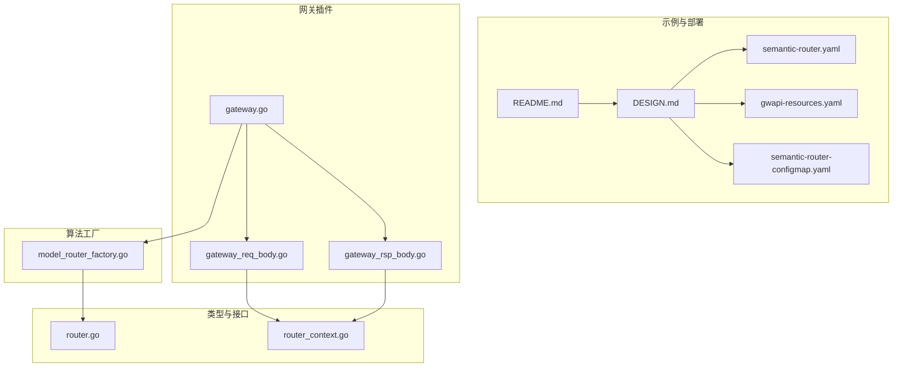
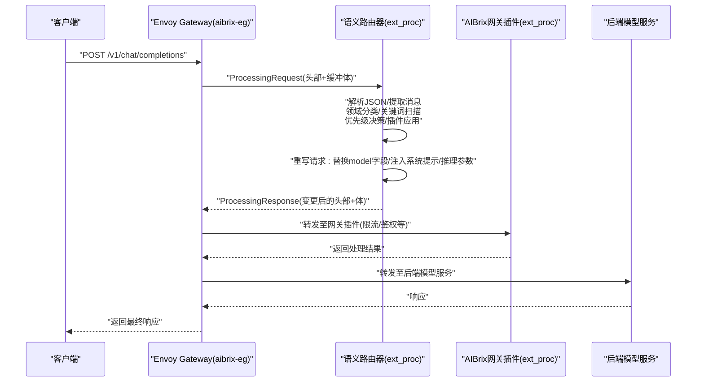
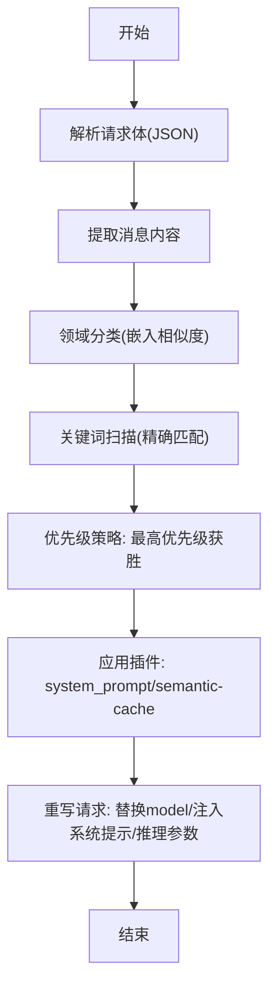
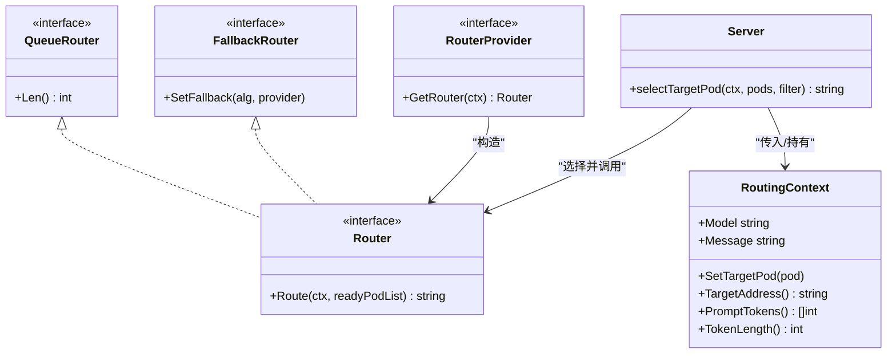
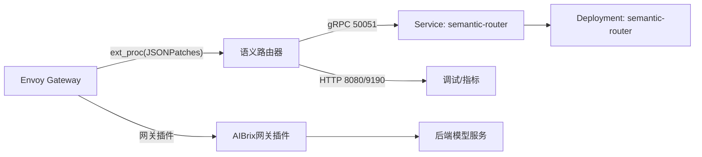

# 语义路由

<cite>
**本文引用的文件**
- [samples/semantic-router/README.md](file://samples/semantic-router/README.md)
- [samples/semantic-router/DESIGN.md](file://samples/semantic-router/DESIGN.md)
- [samples/semantic-router/semantic-router.yaml](file://samples/semantic-router/semantic-router.yaml)
- [samples/semantic-router/semantic-router-configmap.yaml](file://samples/semantic-router/semantic-router-configmap.yaml)
- [samples/semantic-router/gwapi-resources.yaml](file://samples/semantic-router/gwapi-resources.yaml)
- [pkg/plugins/gateway/gateway.go](file://pkg/plugins/gateway/gateway.go)
- [pkg/plugins/gateway/gateway_req_body.go](file://pkg/plugins/gateway/gateway_req_body.go)
- [pkg/plugins/gateway/gateway_rsp_body.go](file://pkg/plugins/gateway/gateway_rsp_body.go)
- [pkg/types/router.go](file://pkg/types/router.go)
- [pkg/types/router_context.go](file://pkg/types/router_context.go)
- [pkg/plugins/gateway/algorithms/model_router_factory.go](file://pkg/plugins/gateway/algorithms/model_router_factory.go)
</cite>

## 目录
1. [简介](#简介)
2. [项目结构](#项目结构)
3. [核心组件](#核心组件)
4. [架构总览](#架构总览)
5. [详细组件分析](#详细组件分析)
6. [依赖关系分析](#依赖关系分析)
7. [性能考量](#性能考量)
8. [故障排查指南](#故障排查指南)
9. [结论](#结论)
10. [附录：部署与配置模板](#附录部署与配置模板)

## 简介
本指南面向希望在AIBrix中落地“基于语义理解的智能路由”的工程团队与平台工程师。文档围绕以下目标展开：
- 深入解析语义路由器的工作原理、请求处理流程与决策机制
- 提供模型选择策略、路由策略与推理模式（reasoning）的配置方法
- 给出性能优化建议与调优技巧
- 提供可直接复用的部署配置模板，覆盖模型注册、路由规则、缓存与可观测性
- 覆盖多业务场景（内容分类、意图识别、个性化推荐等）的路由策略设计思路

## 项目结构
与语义路由直接相关的关键位置如下：
- 示例与部署样例：samples/semantic-router
- 网关插件（Envoy ext_proc集成点）：pkg/plugins/gateway
- 路由上下文与接口定义：pkg/types
- 路由算法工厂与具体算法：pkg/plugins/gateway/algorithms

**图表来源**
- [samples/semantic-router/README.md:1-110](file://samples/semantic-router/README.md#L1-L110)
- [samples/semantic-router/DESIGN.md:1-394](file://samples/semantic-router/DESIGN.md#L1-L394)
- [samples/semantic-router/semantic-router.yaml:1-228](file://samples/semantic-router/semantic-router.yaml#L1-L228)
- [samples/semantic-router/semantic-router-configmap.yaml:1-700](file://samples/semantic-router/semantic-router-configmap.yaml#L1-L700)
- [samples/semantic-router/gwapi-resources.yaml:1-56](file://samples/semantic-router/gwapi-resources.yaml#L1-L56)
- [pkg/plugins/gateway/gateway.go:1-535](file://pkg/plugins/gateway/gateway.go#L1-L535)
- [pkg/plugins/gateway/gateway_req_body.go:1-237](file://pkg/plugins/gateway/gateway_req_body.go#L1-L237)
- [pkg/plugins/gateway/gateway_rsp_body.go:1-200](file://pkg/plugins/gateway/gateway_rsp_body.go#L1-L200)
- [pkg/types/router.go:1-56](file://pkg/types/router.go#L1-L56)
- [pkg/types/router_context.go:1-353](file://pkg/types/router_context.go#L1-L353)
- [pkg/plugins/gateway/algorithms/model_router_factory.go:1-18](file://pkg/plugins/gateway/algorithms/model_router_factory.go#L1-L18)

**章节来源**
- [samples/semantic-router/README.md:1-110](file://samples/semantic-router/README.md#L1-L110)
- [samples/semantic-router/DESIGN.md:1-394](file://samples/semantic-router/DESIGN.md#L1-L394)

## 核心组件
- 语义路由器（ExtProc）：作为Envoy的外部处理器，负责解析请求、执行领域分类与关键词匹配、应用优先级策略、注入系统提示词与推理参数，并重写请求后转发给后端模型服务。
- 网关插件（AIBrix Gateway Plugins）：在语义路由器之后对请求进行限流、鉴权等网关级插件处理。
- 路由上下文（RoutingContext）：封装请求特征（消息、令牌长度、输出预测）、目标Pod选择结果与统计信息，贯穿路由生命周期。
- 路由算法工厂：根据策略选择具体路由算法（如SLORouter），并支持回退与队列能力。

**章节来源**
- [pkg/plugins/gateway/gateway.go:1-535](file://pkg/plugins/gateway/gateway.go#L1-L535)
- [pkg/types/router.go:1-56](file://pkg/types/router.go#L1-L56)
- [pkg/types/router_context.go:1-353](file://pkg/types/router_context.go#L1-L353)
- [pkg/plugins/gateway/algorithms/model_router_factory.go:1-18](file://pkg/plugins/gateway/algorithms/model_router_factory.go#L1-L18)

## 架构总览
下图展示了从客户端到后端模型的完整请求路径，以及语义路由器在其中的位置与职责。

**图表来源**
- [samples/semantic-router/DESIGN.md:92-128](file://samples/semantic-router/DESIGN.md#L92-L128)
- [samples/semantic-router/gwapi-resources.yaml:1-56](file://samples/semantic-router/gwapi-resources.yaml#L1-L56)
- [pkg/plugins/gateway/gateway.go:123-331](file://pkg/plugins/gateway/gateway.go#L123-L331)

## 详细组件分析

### 语义路由器工作原理与请求处理流程
- 请求入口：Envoy以ext_proc协议将请求头与完整请求体发送给语义路由器。
- 决策阶段：解析消息内容，执行嵌入相似度计算确定领域；同时扫描关键词集合；按优先级策略选择最高优先级决策。
- 插件阶段：按声明顺序应用插件（如system_prompt、semantic-cache）。
- 重写阶段：替换请求中的model字段为目标后端模型名；必要时注入推理参数（如enable_thinking）；可注入系统提示。
- 返回：将变更后的请求与响应返回给Envoy，再由Envoy转发到后端或网关插件。

**图表来源**
- [samples/semantic-router/DESIGN.md:92-128](file://samples/semantic-router/DESIGN.md#L92-L128)

**章节来源**
- [samples/semantic-router/DESIGN.md:92-128](file://samples/semantic-router/DESIGN.md#L92-L128)

### 配置参数与策略详解
- 路由策略
  - 全局策略：priority（数值越高越优先；同值时按声明顺序）
  - 决策项：包含名称、描述、优先级、规则（domain/keyword/OR条件）、模型引用与插件列表
  - 规则类型：domain（基于嵌入相似度）、keyword（大小写敏感/运算符可配置）
- 推理模式（reasoning）
  - 模型族映射：qwen3、deepseek、gpt等家族分别注入不同参数键
  - use_reasoning：控制是否向后端注入推理参数
- 插件
  - system_prompt：replace/append/prepend三种模式
  - semantic-cache：基于嵌入相似度缓存响应，支持阈值与存储配置

**章节来源**
- [samples/semantic-router/DESIGN.md:157-394](file://samples/semantic-router/DESIGN.md#L157-L394)
- [samples/semantic-router/semantic-router-configmap.yaml:14-510](file://samples/semantic-router/semantic-router-configmap.yaml#L14-L510)

### 网关插件与路由算法集成
- 网关插件在语义路由器之后运行，负责限流、鉴权等横切能力
- 路由算法工厂提供默认SLORouter，支持回退与队列能力
- 路由上下文承载请求特征与目标Pod选择结果，便于统计与追踪

**图表来源**
- [pkg/types/router.go:19-56](file://pkg/types/router.go#L19-L56)
- [pkg/types/router_context.go:57-105](file://pkg/types/router_context.go#L57-L105)
- [pkg/plugins/gateway/gateway.go:333-360](file://pkg/plugins/gateway/gateway.go#L333-L360)
- [pkg/plugins/gateway/algorithms/model_router_factory.go:1-18](file://pkg/plugins/gateway/algorithms/model_router_factory.go#L1-L18)

**章节来源**
- [pkg/plugins/gateway/gateway.go:1-535](file://pkg/plugins/gateway/gateway.go#L1-L535)
- [pkg/types/router.go:1-56](file://pkg/types/router.go#L1-L56)
- [pkg/types/router_context.go:1-353](file://pkg/types/router_context.go#L1-L353)
- [pkg/plugins/gateway/algorithms/model_router_factory.go:1-18](file://pkg/plugins/gateway/algorithms/model_router_factory.go#L1-L18)

### 请求体处理与目标Pod选择
- 网关插件在收到请求体后，校验模型可用性与路由策略，随后选择目标Pod并注入路由元信息（策略、目标Pod、请求ID等）
- 若未显式指定路由策略，则保持原请求；若指定策略，则通过路由算法选择目标Pod并重写路径

**章节来源**
- [pkg/plugins/gateway/gateway_req_body.go:38-175](file://pkg/plugins/gateway/gateway_req_body.go#L38-L175)
- [pkg/plugins/gateway/gateway.go:333-360](file://pkg/plugins/gateway/gateway.go#L333-L360)

### 响应体处理与统计
- 网关插件在收到后端响应体时，统计prompt/completion/total tokens，完成请求追踪并释放RoutingContext
- 支持TTFT阈值等指标控制

**章节来源**
- [pkg/plugins/gateway/gateway_rsp_body.go:48-200](file://pkg/plugins/gateway/gateway_rsp_body.go#L48-L200)

## 依赖关系分析
- Envoy通过EnvoyPatchPolicy将ext_proc过滤器注入到Gateway监听器，并配置上游集群指向语义路由器
- 语义路由器部署于独立命名空间，挂载配置CM与模型目录，提供gRPC(ext_proc)与HTTP接口
- 网关插件在语义路由器之后对请求进行限流、鉴权等处理

**图表来源**
- [samples/semantic-router/gwapi-resources.yaml:1-56](file://samples/semantic-router/gwapi-resources.yaml#L1-L56)
- [samples/semantic-router/semantic-router.yaml:75-228](file://samples/semantic-router/semantic-router.yaml#L75-L228)

**章节来源**
- [samples/semantic-router/gwapi-resources.yaml:1-56](file://samples/semantic-router/gwapi-resources.yaml#L1-L56)
- [samples/semantic-router/semantic-router.yaml:1-228](file://samples/semantic-router/semantic-router.yaml#L1-L228)

## 性能考量
- 模型加载与启动探针
  - 启动探针与就绪探针确保容器在模型下载完成后才对外提供服务
- 缓冲策略
  - ext_proc请求/响应体采用BUFFERED模式，便于一次性读取完整JSON，降低流式复杂度
- 推理模式与系统提示
  - 对需要链式思考的任务启用推理模式，但需评估延迟与成本
- 缓存命中率
  - 通过semantic-cache提升重复问题的响应速度，合理设置相似度阈值与存储容量
- 并发与批处理
  - 批量分类接口支持并发阈值与最大并发，有助于吞吐提升

**章节来源**
- [samples/semantic-router/DESIGN.md:61-61](file://samples/semantic-router/DESIGN.md#L61-L61)
- [samples/semantic-router/semantic-router.yaml:192-212](file://samples/semantic-router/semantic-router.yaml#L192-L212)
- [samples/semantic-router/semantic-router-configmap.yaml:30-83](file://samples/semantic-router/semantic-router-configmap.yaml#L30-L83)

## 故障排查指南
- 模型不存在或无可用Pod
  - 现象：返回400/503错误，携带“模型不存在/无可用后端”
  - 处理：检查模型注册、后端服务状态与路由对象状态
- HTTPRoute未被接受或引用未解析
  - 现象：路由对象状态异常
  - 处理：确认Gateway对象与HTTPRoute配置正确
- 客户端提前关闭或超时
  - 现象：日志记录“客户端取消/EOF”等
  - 处理：检查网络与客户端行为
- 网关插件错误
  - 现象：响应头中携带错误码
  - 处理：检查限流/鉴权策略与后端返回

**章节来源**
- [pkg/plugins/gateway/gateway_req_body.go:206-227](file://pkg/plugins/gateway/gateway_req_body.go#L206-L227)
- [pkg/plugins/gateway/gateway.go:362-397](file://pkg/plugins/gateway/gateway.go#L362-L397)
- [pkg/plugins/gateway/gateway.go:181-236](file://pkg/plugins/gateway/gateway.go#L181-L236)

## 结论
通过将语义路由器置于Envoy的ext_proc链路中，AIBrix实现了“以语义为驱动”的智能路由：既能基于领域与关键词进行精准分流，又能结合推理模式与系统提示提升回答质量。配合网关插件、缓存与可观测性，可在保证用户体验的同时实现高效资源利用。建议在生产环境中结合业务场景持续迭代路由规则、推理开关与缓存策略，并通过监控与压测不断优化阈值与并发参数。

## 附录：部署与配置模板

### 1) 准备与安装步骤（快速上手）
- 创建命名空间与Hugging Face密钥Secret
- 部署后端模型服务（示例：qwen3-8b、llama3-8b-instruct）
- 应用语义路由器配置与部署清单
- 应用Gateway API与Envoy资源
- 本地端口转发并验证

**章节来源**
- [samples/semantic-router/README.md:8-109](file://samples/semantic-router/README.md#L8-L109)

### 2) 关键配置说明
- 全局策略与服务
  - 路由策略：priority
  - 批量分类并发与批大小
- 存储与缓存
  - 语义缓存：内存后端、嵌入模型、阈值、TTL、最大条目数
  - 向量存储：嵌入模型
- 推理家族与模型映射
  - qwen3、deepseek、gpt等家族参数键位
  - 模型级别绑定推理家族
- 决策与规则
  - 决策项：名称、描述、优先级、规则（domain/keyword/OR）、模型引用、插件
  - 信号目录：领域标签与关键词集合

**章节来源**
- [samples/semantic-router/semantic-router-configmap.yaml:14-510](file://samples/semantic-router/semantic-router-configmap.yaml#L14-L510)

### 3) 网关与Envoy集成
- JSONPatch添加ext_proc过滤器与上游集群
- 上游集群严格DNS、HTTP/2、轮询策略与连接超时

**章节来源**
- [samples/semantic-router/gwapi-resources.yaml:1-56](file://samples/semantic-router/gwapi-resources.yaml#L1-L56)

### 4) 语义路由器部署清单要点
- ServiceAccount/ClusterRole/ClusterRoleBinding
- Service：gRPC 50051、HTTP 8080、指标9190
- Deployment：镜像、args、环境变量（HF_TOKEN/HUGGINGFACE_HUB_TOKEN）、卷挂载（配置CM与模型目录）
- 探针：启动/存活/就绪探针
- 资源限制与请求

**章节来源**
- [samples/semantic-router/semantic-router.yaml:1-228](file://samples/semantic-router/semantic-router.yaml#L1-L228)

### 5) 不同业务场景的路由策略配置思路
- 内容分类
  - 基于领域标签（如math/physics/chemistry/biology等）进行分类
  - 对需要链式思考的任务开启推理模式
- 意图识别
  - 使用关键词集合（如“step by step”、“chain of thought”等）触发推理路径
  - 通过优先级策略确保意图信号优先于通用领域匹配
- 个性化推荐
  - 可结合工具数据库与系统提示，为特定领域注入专家角色
  - 利用语义缓存减少重复推荐的响应时间

**章节来源**
- [samples/semantic-router/DESIGN.md:157-394](file://samples/semantic-router/DESIGN.md#L157-L394)
- [samples/semantic-router/semantic-router-configmap.yaml:459-510](file://samples/semantic-router/semantic-router-configmap.yaml#L459-L510)