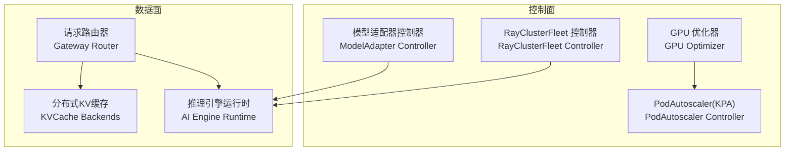
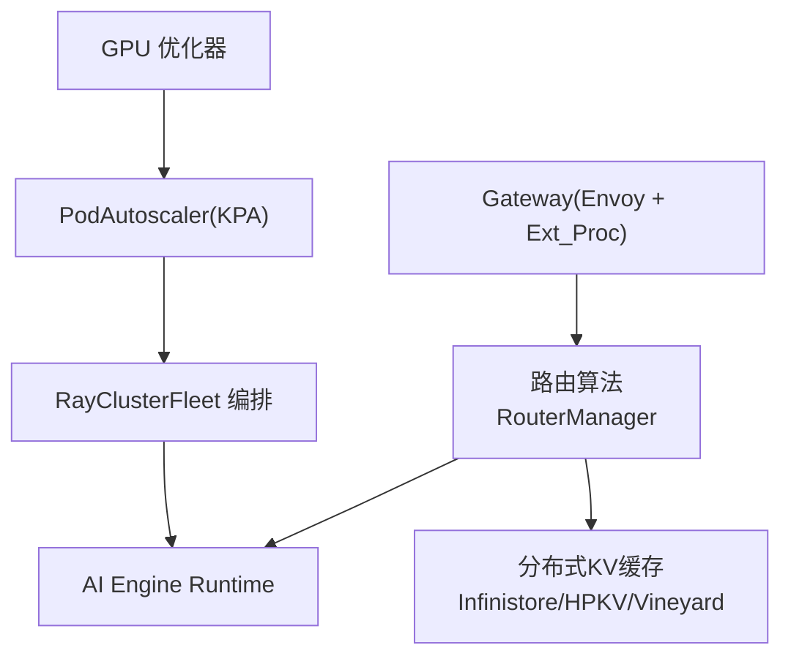
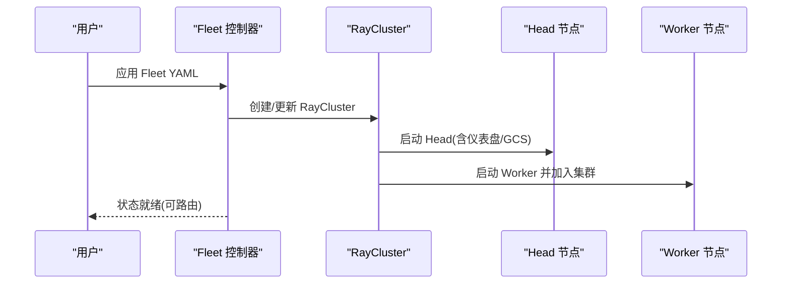
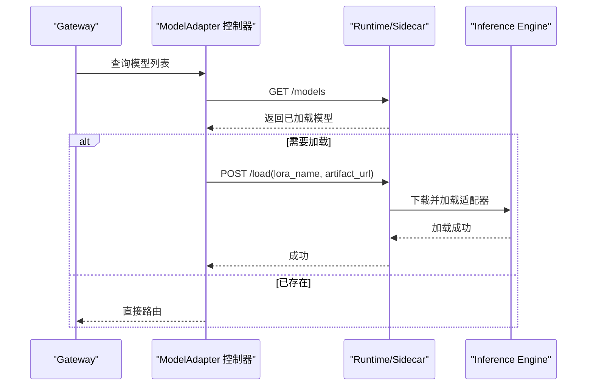
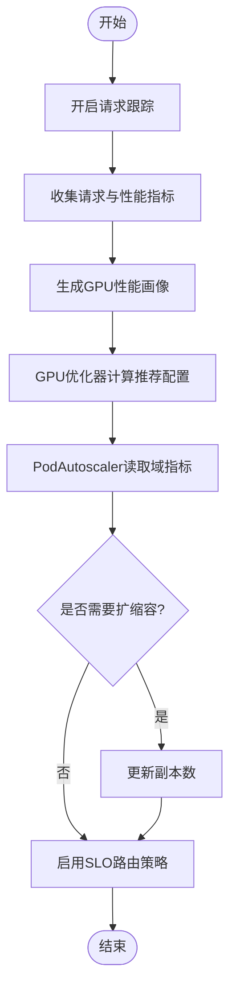
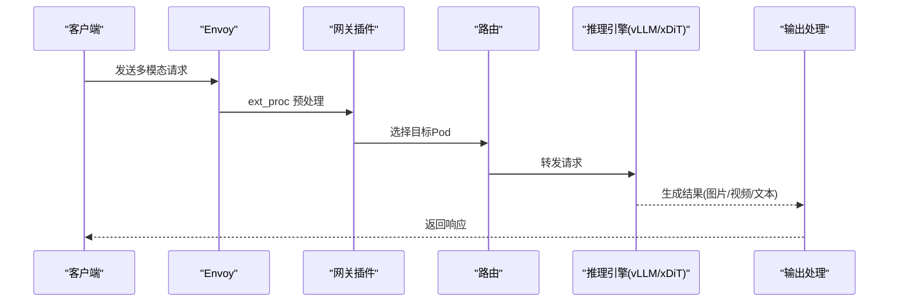
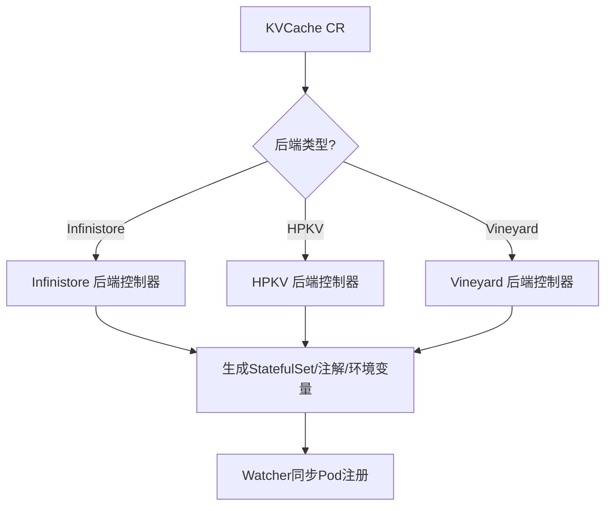
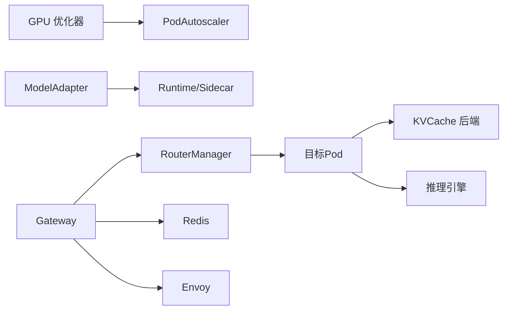
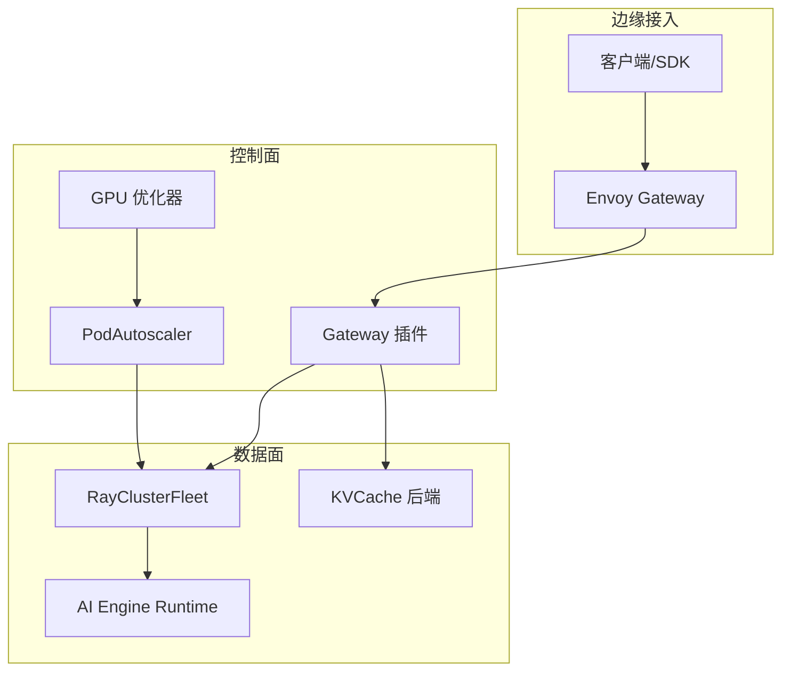

# 高级用法

<cite>
**本文引用的文件**
- [README.md](file://README.md)
- [架构总览（文档）](file://docs/source/designs/architecture.rst)
- [多节点推理（文档）](file://docs/source/features/multi-node-inference.rst)
- [异构GPU推理（文档）](file://docs/source/features/heterogeneous-gpu.rst)
- [多模态推理（vLLM 示例说明）](file://samples/multimodality/vllm/README.md)
- [多模态推理（xDiT 示例说明）](file://samples/multimodality/xDiT/README.md)
- [网关插件配置（YAML）](file://config/gateway/gateway-plugin/gateway-plugin.yaml)
- [网关配置（YAML）](file://config/gateway/gateway.yaml)
- [异构GPU PodAutoscaler 示例](file://samples/heterogeneous/deepseek-coder-7b-v100-podautoscaler.yaml)
- [分布式推理 Fleet 示例](file://samples/distributed/fleet.yaml)
- [RayClusterFleet 类型定义](file://api/orchestration/v1alpha1/rayclusterfleet_types.go)
- [网关插件入口（Go）](file://pkg/plugins/gateway/gateway.go)
- [路由算法注册与选择（Go）](file://pkg/plugins/gateway/algorithms/router.go)
- [KV缓存分布式控制器（Go）](file://pkg/controller/kvcache/backends/distributed.go)
- [KV缓存 Infinistore 后端（Go）](file://pkg/controller/kvcache/backends/infinistore.go)
- [KV缓存 HPKV 后端（Go）](file://pkg/controller/kvcache/backends/hpkv.go)
- [KV缓存 Vineyard 后端（Go）](file://pkg/controller/kvcache/backends/vineyard.go)
- [KV缓存 Watcher 入口（Go）](file://cmd/kvcache-watcher/main.go)
- [模型适配器控制器（Go）](file://pkg/controller/modeladapter/modeladapter_controller.go)
- [LoRA 客户端（Go）](file://pkg/controller/modeladapter/lora_client.go)
- [模型适配器工具函数（Go）](file://pkg/controller/modeladapter/utils.go)
- [RayClusterFleet 控制器（Go）](file://pkg/controller/rayclusterfleet/rayclusterfleet_controller.go)
- [KPA 算法（Go）](file://pkg/controller/podautoscaler/algorithm/kpa.go)
- [SLO 队列（Go）](file://pkg/plugins/gateway/queue/slo_queue.go)
- [前缀缓存预估成本（Go）](file://pkg/plugins/gateway/algorithms/prefix_cache_preble.go)
</cite>

## 目录
1. [简介](#简介)
2. [项目结构](#项目结构)
3. [核心组件](#核心组件)
4. [架构总览](#架构总览)
5. [详细组件分析](#详细组件分析)
6. [依赖关系分析](#依赖关系分析)
7. [性能考量](#性能考量)
8. [故障排除指南](#故障排除指南)
9. [结论](#结论)
10. [附录](#附录)

## 简介
本指南面向企业用户与高级工程师，系统讲解 AIBrix 的高级能力与落地实践，覆盖以下主题：
- 分布式推理集群：基于 KubeRay 的多节点推理编排与滚动更新策略
- 模型解耦架构：通过 ModelAdapter 与 AI Engine Runtime 实现模型与引擎解耦、动态加载/卸载 LoRA
- 异构GPU资源管理：请求监控、GPU优化器与路由策略协同，实现成本与SLA平衡
- 多模态推理：图像/视频/Audio 等多模态工作负载在 AIBrix 上的部署与路由
- 企业级最佳实践：高可用部署、成本优化、安全配置与可观测性

## 项目结构
AIBrix 采用“控制面 + 数据面”的分层架构：
- 控制面：负责模型元数据、自动伸缩、模型适配器、GPU优化、加速器诊断等
- 数据面：负责请求路由、调度、推理服务与分布式KV缓存

**图表来源**
- [架构总览（文档）](file://docs/source/designs/architecture.rst)
- [网关插件入口（Go）](file://pkg/plugins/gateway/gateway.go)
- [KV缓存分布式控制器（Go）](file://pkg/controller/kvcache/backends/distributed.go)
- [RayClusterFleet 控制器（Go）](file://pkg/controller/rayclusterfleet/rayclusterfleet_controller.go)

**章节来源**
- [README.md](file://README.md)
- [架构总览（文档）](file://docs/source/designs/architecture.rst)

## 核心组件
- 请求路由与扩展处理：基于 Envoy 扩展处理器（ext_proc），在网关侧完成鉴权、限流、路由与指标上报
- 分布式KV缓存：支持 Infinistore、HPKV、Vineyard 等后端，提供跨节点低延迟KV复用
- 模型适配器与运行时：统一模型列表、动态加载/卸载 LoRA，支持 Sidecar 与直连引擎两种调用路径
- 自动伸缩：KPA 策略结合 GPU 优化器输出，按域指标动态调整副本数
- 异构GPU：请求追踪、SLO 路由策略、最小副本保障标签，实现成本与稳定性平衡

**章节来源**
- [网关插件入口（Go）](file://pkg/plugins/gateway/gateway.go)
- [路由算法注册与选择（Go）](file://pkg/plugins/gateway/algorithms/router.go)
- [KV缓存分布式控制器（Go）](file://pkg/controller/kvcache/backends/distributed.go)
- [模型适配器控制器（Go）](file://pkg/controller/modeladapter/modeladapter_controller.go)
- [异构GPU推理（文档）](file://docs/source/features/heterogeneous-gpu.rst)

## 架构总览
下图展示了 AIBrix 在 Kubernetes 上的端到端架构：Gateway 作为统一入口，经由 Envoy 扩展处理器进行请求预处理；路由模块根据策略选择目标 Pod；推理引擎运行时负责模型加载与执行；分布式KV缓存提供跨节点KV共享。

**图表来源**
- [网关插件入口（Go）](file://pkg/plugins/gateway/gateway.go)
- [路由算法注册与选择（Go）](file://pkg/plugins/gateway/algorithms/router.go)
- [KV缓存分布式控制器（Go）](file://pkg/controller/kvcache/backends/distributed.go)
- [RayClusterFleet 控制器（Go）](file://pkg/controller/rayclusterfleet/rayclusterfleet_controller.go)
- [KPA 算法（Go）](file://pkg/controller/podautoscaler/algorithm/kpa.go)

## 详细组件分析

### 组件A：分布式推理集群（RayClusterFleet）
- 设计要点
  - 将 Kubernetes 的粗粒度资源编排与 Ray 的细粒度任务调度相结合
  - 提供 Fleet/ReplicaSet 语义，简化滚动更新与扩缩容
- 关键流程
  - Fleet 控制器根据模板生成 RayCluster，Head 节点负责调度与仪表盘
  - 支持滚动更新参数（maxSurge/maxUnavailable）与进度超时
- 配置要点
  - headGroupSpec 中设置 dashboard、gcs 端口与服务端口
  - 建议与 vLLM 官方镜像配合，启用分布式执行后端
- 性能优化
  - 合理设置 tensor-parallel-size 与 GPU 数量，避免过度切分导致通信开销增大
  - 使用滚动更新策略降低停机时间

**图表来源**
- [RayClusterFleet 类型定义](file://api/orchestration/v1alpha1/rayclusterfleet_types.go)
- [分布式推理（文档）](file://docs/source/features/multi-node-inference.rst)
- [分布式推理 Fleet 示例](file://samples/distributed/fleet.yaml)

**章节来源**
- [RayClusterFleet 控制器（Go）](file://pkg/controller/rayclusterfleet/rayclusterfleet_controller.go)
- [分布式推理（文档）](file://docs/source/features/multi-node-inference.rst)
- [分布式推理 Fleet 示例](file://samples/distributed/fleet.yaml)

### 组件B：模型解耦与动态适配（ModelAdapter + Runtime）
- 设计要点
  - ModelAdapter 抽象模型适配与加载，支持多副本部署与单实例加载两种模式
  - 运行时可选 Sidecar 或直连引擎，统一模型列表与 LoRA 加载接口
- 关键流程
  - 列表模型 → 判断是否已加载 → 加载/卸载 LoRA
  - 支持通过 API Key 注入鉴权头
- 配置要点
  - useSidecar 与引擎类型决定 API 路径
  - Artifact URL 透传给运行时以完成远程资源下载
- 性能优化
  - 优先使用 Sidecar 模式，减少引擎直接调用的网络开销
  - 合理设置副本数与候选集合，避免重复加载

**图表来源**
- [模型适配器控制器（Go）](file://pkg/controller/modeladapter/modeladapter_controller.go)
- [LoRA 客户端（Go）](file://pkg/controller/modeladapter/lora_client.go)
- [模型适配器工具函数（Go）](file://pkg/controller/modeladapter/utils.go)

**章节来源**
- [模型适配器控制器（Go）](file://pkg/controller/modeladapter/modeladapter_controller.go)
- [LoRA 客户端（Go）](file://pkg/controller/modeladapter/lora_client.go)
- [模型适配器工具函数（Go）](file://pkg/controller/modeladapter/utils.go)

### 组件C：异构GPU资源管理（请求监控 + GPU优化器 + SLO路由）
- 设计要点
  - 请求监控：收集请求特征与吞吐/延迟指标
  - GPU优化器：基于离线基准与在线观测，动态推荐最优 GPU 类型与数量
  - SLO 路由：根据 Profiling 结果与排队策略，将请求路由至满足 SLO 的 GPU
- 关键流程
  - 开启跟踪标志后，网关插件持续上报指标
  - GPU 优化器生成策略并写入 Redis，PodAutoscaler 读取域指标进行扩缩容
  - 路由策略通过请求头启用，支持 pack-load/least-load/least-load-pulling 变体
- 配置要点
  - 确保每个 GPU 类型均有基准数据
  - 设置最小副本标签，避免无负载时完全缩容
  - PodAutoscaler 的 minReplicas 必须为 0，以允许优化器自由决策

**图表来源**
- [异构GPU推理（文档）](file://docs/source/features/heterogeneous-gpu.rst)
- [网关插件配置（YAML）](file://config/gateway/gateway-plugin/gateway-plugin.yaml)
- [异构GPU PodAutoscaler 示例](file://samples/heterogeneous/deepseek-coder-7b-v100-podautoscaler.yaml)
- [SLO 队列（Go）](file://pkg/plugins/gateway/queue/slo_queue.go)

**章节来源**
- [异构GPU推理（文档）](file://docs/source/features/heterogeneous-gpu.rst)
- [KPA 算法（Go）](file://pkg/controller/podautoscaler/algorithm/kpa.go)
- [SLO 队列（Go）](file://pkg/plugins/gateway/queue/slo_queue.go)

### 组件D：多模态推理（图像/视频/Audio）
- 设计要点
  - 通过 Gateway 暴露 OpenAI 兼容接口，支持多模态输入（图片URL/本地路径/Base64、视频URL、音频文件）
  - 支持分布式部署以提升吞吐与延迟表现
- 关键流程
  - 端到端请求：客户端 → Envoy → 网关插件 → 路由 → 推理引擎 → 返回结果
  - 支持保存到磁盘或返回 Base64 图片/视频
- 配置要点
  - 为不同模态准备专用模型部署与路由规则
  - 使用分布式部署提升并发处理能力

**图表来源**
- [多模态推理（vLLM 示例说明）](file://samples/multimodality/vllm/README.md)
- [多模态推理（xDiT 示例说明）](file://samples/multimodality/xDiT/README.md)
- [网关插件入口（Go）](file://pkg/plugins/gateway/gateway.go)

**章节来源**
- [多模态推理（vLLM 示例说明）](file://samples/multimodality/vllm/README.md)
- [多模态推理（xDiT 示例说明）](file://samples/multimodality/xDiT/README.md)

### 组件E：分布式KV缓存（Infinistore/HPKV/Vineyard）
- 设计要点
  - 支持多种后端，提供跨节点 KV 共享，降低重复计算
  - HPKV/Infinistore 支持 RDMA 网络与共享内存，提升吞吐
- 关键流程
  - 根据注解与参数构建 StatefulSet/Deployment，注入 RDMA/IPC 等配置
  - Watcher 监控 Pod 注册状态，维护后端拓扑
- 配置要点
  - HPKV/Infinistore 需要 RDMA 网络与特权/IPC 锁权限
  - 通过注解控制端口、块大小、虚拟节点数等参数

**图表来源**
- [KV缓存分布式控制器（Go）](file://pkg/controller/kvcache/backends/distributed.go)
- [KV缓存 Infinistore 后端（Go）](file://pkg/controller/kvcache/backends/infinistore.go)
- [KV缓存 HPKV 后端（Go）](file://pkg/controller/kvcache/backends/hpkv.go)
- [KV缓存 Vineyard 后端（Go）](file://pkg/controller/kvcache/backends/vineyard.go)
- [KV缓存 Watcher 入口（Go）](file://cmd/kvcache-watcher/main.go)

**章节来源**
- [KV缓存分布式控制器（Go）](file://pkg/controller/kvcache/backends/distributed.go)
- [KV缓存 Infinistore 后端（Go）](file://pkg/controller/kvcache/backends/infinistore.go)
- [KV缓存 HPKV 后端（Go）](file://pkg/controller/kvcache/backends/hpkv.go)
- [KV缓存 Vineyard 后端（Go）](file://pkg/controller/kvcache/backends/vineyard.go)
- [KV缓存 Watcher 入口（Go）](file://cmd/kvcache-watcher/main.go)

## 依赖关系分析
- 控制面组件之间
  - GPU 优化器输出 → PodAutoscaler 域指标 → 动态扩缩容
  - ModelAdapter 控制器依赖运行时 API，支持 Sidecar/直连两种路径
- 数据面组件之间
  - Gateway 路由器 → 路由算法工厂 → 目标 Pod
  - 路由器 → KVCache 后端 → 推理引擎
- 外部依赖
  - Redis：用于限流、指标存储与 GPU 优化器域指标
  - Envoy：扩展处理器、路由与连接管理
  - KubeRay：RayCluster 编排

**图表来源**
- [KPA 算法（Go）](file://pkg/controller/podautoscaler/algorithm/kpa.go)
- [模型适配器工具函数（Go）](file://pkg/controller/modeladapter/utils.go)
- [路由算法注册与选择（Go）](file://pkg/plugins/gateway/algorithms/router.go)
- [网关插件入口（Go）](file://pkg/plugins/gateway/gateway.go)

**章节来源**
- [KPA 算法（Go）](file://pkg/controller/podautoscaler/algorithm/kpa.go)
- [模型适配器工具函数（Go）](file://pkg/controller/modeladapter/utils.go)
- [路由算法注册与选择（Go）](file://pkg/plugins/gateway/algorithms/router.go)
- [网关插件入口（Go）](file://pkg/plugins/gateway/gateway.go)

## 性能考量
- 路由与队列
  - SLO 路由策略优先满足 SLA，必要时在网关排队或拒绝，避免尾延迟放大
  - 前缀缓存直方图估算预填充与解码成本，指导路由与扩容
- KV缓存
  - HPKV/Infinistore 启用 RDMA 与共享内存，降低跨节点访问延迟
  - 合理设置块大小与槽位数，避免内存碎片与抖动
- 自动伸缩
  - KPA 结合激活阈值与最大上下速率，平滑扩容/缩容
  - GPU 优化器域指标作为目标值，避免过度/不足扩容
- 多模态
  - 对大体积媒体建议使用文件路径或 Base64，减少网络传输
  - 分布式部署提升并发，合理设置模型并行度

[本节为通用指导，不直接分析具体文件]

## 故障排除指南
- 网关路由失败
  - 检查 HTTPRoute 状态是否 Accepted/ResolvedRefs
  - 确认路由策略名称与请求头一致
- 模型加载失败
  - 核对 API Key 是否正确注入
  - 切换 Sidecar/直连引擎路径排查网络连通性
- KV缓存不可用
  - 检查 RDMA 网络与特权/IPC 权限
  - 查看后端日志与 Pod 注册状态
- 异构GPU不生效
  - 确认已开启请求跟踪标志
  - 检查 GPU 优化器域指标是否可达
  - 确认 PodAutoscaler 的 minReplicas 为 0

**章节来源**
- [网关插件入口（Go）](file://pkg/plugins/gateway/gateway.go)
- [LoRA 客户端（Go）](file://pkg/controller/modeladapter/lora_client.go)
- [KV缓存 HPKV 后端（Go）](file://pkg/controller/kvcache/backends/hpkv.go)
- [异构GPU推理（文档）](file://docs/source/features/heterogeneous-gpu.rst)

## 结论
AIBrix 通过“控制面 + 数据面”解耦设计，为企业提供了可扩展、可观测且具备成本优化能力的 GenAI 推理基础设施。借助分布式推理、模型解耦、异构GPU与多模态能力，可在保证 SLA 的前提下显著降低运营成本，并支持高可用与弹性伸缩的企业级场景。

[本节为总结，不直接分析具体文件]

## 附录

### A. 部署架构图（概念示意）

[本图为概念示意，不对应具体源码文件]

### B. 配置文件模板与示例
- 网关插件部署（含 Redis、探针、环境变量）
  - [网关插件配置（YAML）](file://config/gateway/gateway-plugin/gateway-plugin.yaml)
- 网关与扩展策略（Envoy PatchPolicy、Ext_Proc）
  - [网关配置（YAML）](file://config/gateway/gateway.yaml)
- 异构GPU PodAutoscaler（域指标来源）
  - [异构GPU PodAutoscaler 示例](file://samples/heterogeneous/deepseek-coder-7b-v100-podautoscaler.yaml)
- 分布式推理 Fleet（多节点 RayCluster）
  - [分布式推理 Fleet 示例](file://samples/distributed/fleet.yaml)
- 多模态部署示例（vLLM/xDiT）
  - [多模态推理（vLLM 示例说明）](file://samples/multimodality/vllm/README.md)
  - [多模态推理（xDiT 示例说明）](file://samples/multimodality/xDiT/README.md)

**章节来源**
- [网关插件配置（YAML）](file://config/gateway/gateway-plugin/gateway-plugin.yaml)
- [网关配置（YAML）](file://config/gateway/gateway.yaml)
- [异构GPU PodAutoscaler 示例](file://samples/heterogeneous/deepseek-coder-7b-v100-podautoscaler.yaml)
- [分布式推理 Fleet 示例](file://samples/distributed/fleet.yaml)
- [多模态推理（vLLM 示例说明）](file://samples/multimodality/vllm/README.md)
- [多模态推理（xDiT 示例说明）](file://samples/multimodality/xDiT/README.md)