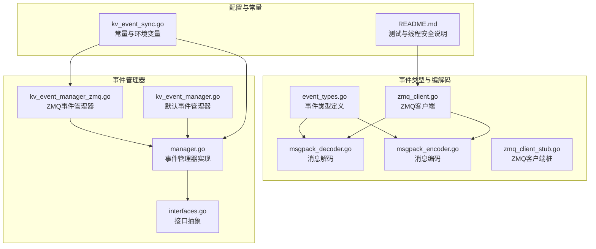
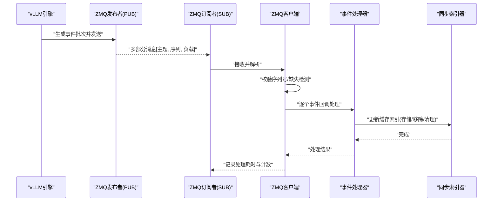
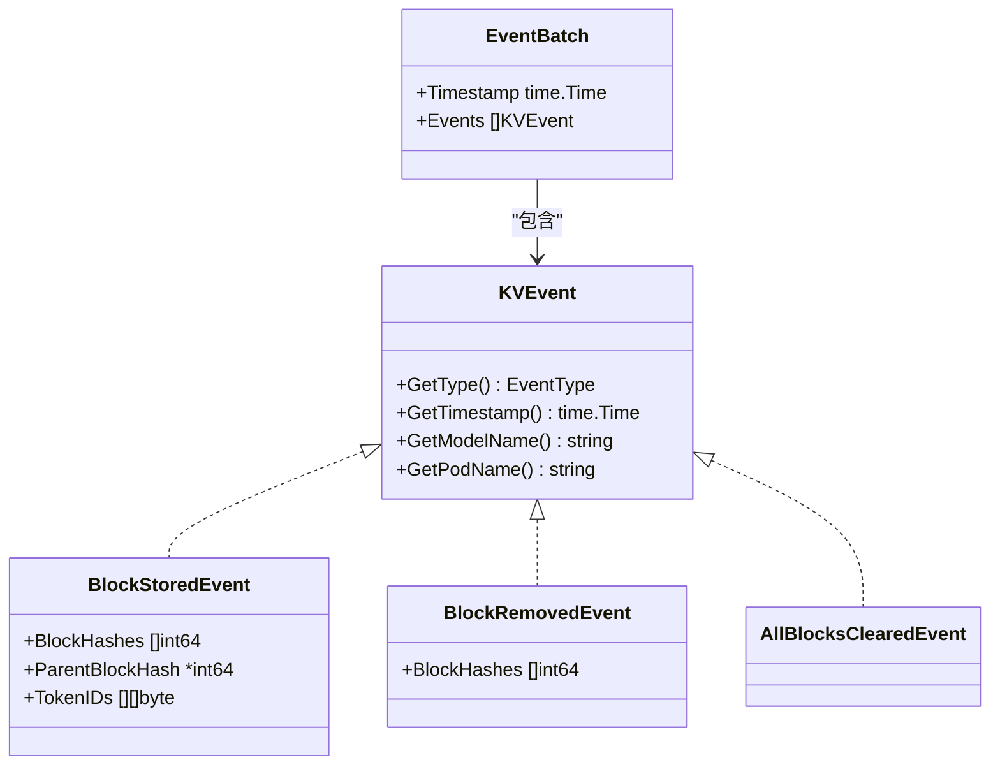
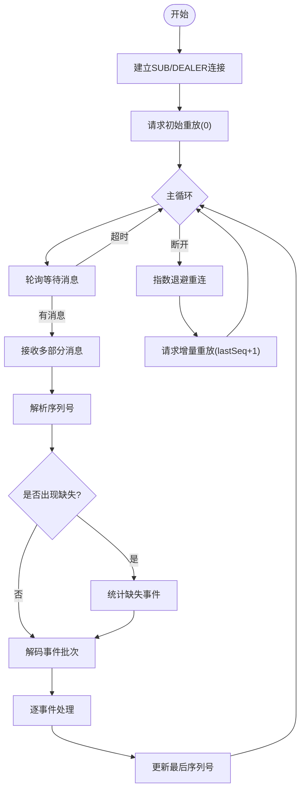
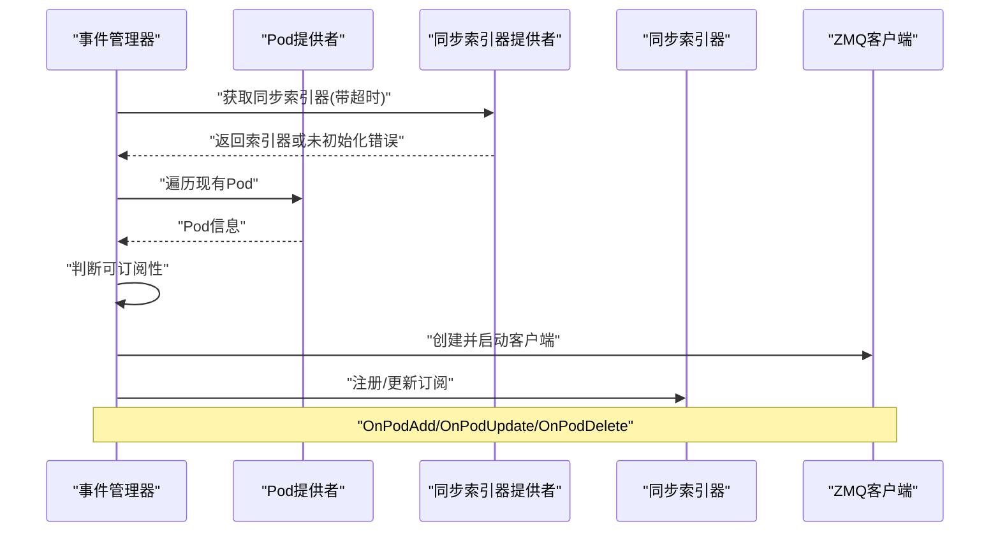
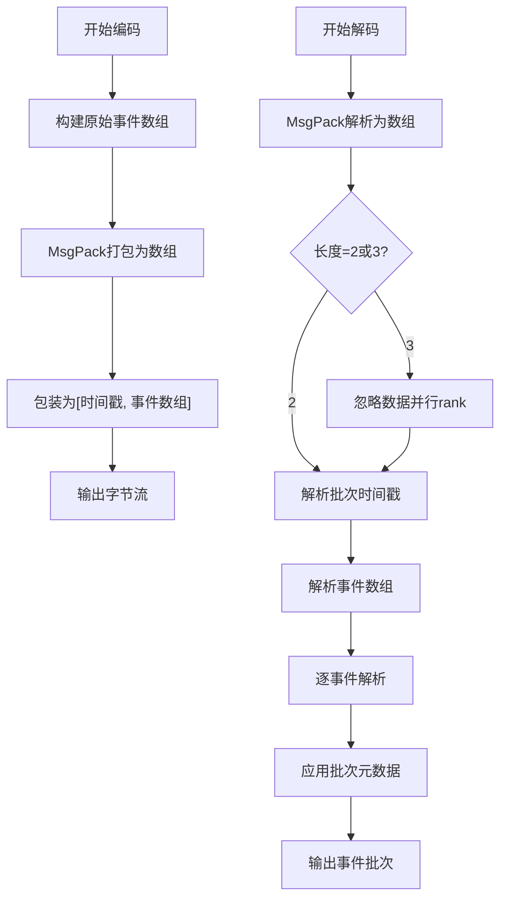
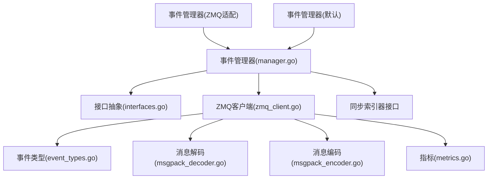

# 事件同步机制

<cite>
**本文档引用的文件**
- [kv_event_manager.go](file://pkg/cache/kv_event_manager.go)
- [kv_event_manager_zmq.go](file://pkg/cache/kv_event_manager_zmq.go)
- [event_types.go](file://pkg/cache/kvcache/event_types.go)
- [types.go](file://pkg/cache/kvcache/types.go)
- [zmq_client.go](file://pkg/cache/kvcache/zmq_client.go)
- [zmq_client_stub.go](file://pkg/cache/kvcache/zmq_client_stub.go)
- [msgpack_decoder.go](file://pkg/cache/kvcache/msgpack_decoder.go)
- [msgpack_encoder.go](file://pkg/cache/kvcache/msgpack_encoder.go)
- [metrics.go](file://pkg/cache/kvcache/metrics.go)
- [manager.go](file://pkg/kvevent/manager.go)
- [interfaces.go](file://pkg/kvevent/interfaces.go)
- [kv_event_sync.go](file://pkg/constants/kv_event_sync.go)
- [README.md](file://pkg/cache/README.md)
</cite>

## 目录
1. [简介](#简介)
2. [项目结构](#项目结构)
3. [核心组件](#核心组件)
4. [架构总览](#架构总览)
5. [详细组件分析](#详细组件分析)
6. [依赖关系分析](#依赖关系分析)
7. [性能考虑](#性能考虑)
8. [故障排查指南](#故障排查指南)
9. [结论](#结论)
10. [附录](#附录)

## 简介
本文件系统性阐述AIBrix中基于ZeroMQ的分布式KV缓存事件同步机制。该机制通过事件发布/订阅模式实现vLLM引擎与控制平面之间的KV缓存状态同步，覆盖事件类型定义、消息编解码协议、事件管理器工作原理、订阅与分发策略、序列化与重放、可靠性保障（连接、重连、重放）、与缓存一致性的协同，以及可观测性与性能优化建议。

## 项目结构
事件同步相关代码主要分布在以下模块：
- 事件类型与编解码：pkg/cache/kvcache 下的事件类型、消息编解码与ZMQ客户端
- 事件管理器：pkg/kvevent 下的事件管理器与接口抽象
- 配置与常量：pkg/constants 下的KV事件同步相关环境变量与标签
- 缓存层适配：pkg/cache 下的事件管理器适配与构建验证

**图表来源**
- [event_types.go:1-178](file://pkg/cache/kvcache/event_types.go#L1-L178)
- [msgpack_decoder.go:1-578](file://pkg/cache/kvcache/msgpack_decoder.go#L1-L578)
- [msgpack_encoder.go:1-44](file://pkg/cache/kvcache/msgpack_encoder.go#L1-L44)
- [zmq_client.go:1-426](file://pkg/cache/kvcache/zmq_client.go#L1-L426)
- [zmq_client_stub.go:1-89](file://pkg/cache/kvcache/zmq_client_stub.go#L1-L89)
- [kv_event_manager_zmq.go:1-77](file://pkg/cache/kv_event_manager_zmq.go#L1-L77)
- [kv_event_manager.go:1-56](file://pkg/cache/kv_event_manager.go#L1-L56)
- [manager.go:1-345](file://pkg/kvevent/manager.go#L1-L345)
- [interfaces.go:1-90](file://pkg/kvevent/interfaces.go#L1-L90)
- [kv_event_sync.go:1-79](file://pkg/constants/kv_event_sync.go#L1-L79)
- [README.md:143-160](file://pkg/cache/README.md#L143-L160)

**章节来源**
- [README.md:143-160](file://pkg/cache/README.md#L143-L160)

## 核心组件
- 事件类型与元数据：定义KV事件类型、批次封装与事件携带的模型名、Pod键、时间戳等元信息。
- 消息编解码：使用MsgPack对事件批次进行编码/解码，支持vLLM不同版本字段差异与兼容转换。
- ZMQ客户端：负责SUB/DEALER套接字建立、事件消费循环、序列号跟踪、重连与重放请求。
- 事件管理器：统一管理订阅生命周期、按Pod维度订阅/退订、与同步索引器交互。
- 接口抽象：通过Provider/SyncIndexer接口解耦Pod发现与缓存索引同步逻辑。
- 可观测性：Prometheus指标采集连接、事件、错误、重放与序列号等关键指标。

**章节来源**
- [event_types.go:45-178](file://pkg/cache/kvcache/event_types.go#L45-L178)
- [msgpack_decoder.go:27-86](file://pkg/cache/kvcache/msgpack_decoder.go#L27-L86)
- [zmq_client.go:30-70](file://pkg/cache/kvcache/zmq_client.go#L30-L70)
- [manager.go:36-53](file://pkg/kvevent/manager.go#L36-L53)
- [interfaces.go:24-70](file://pkg/kvevent/interfaces.go#L24-L70)
- [metrics.go:35-87](file://pkg/cache/kvcache/metrics.go#L35-L87)

## 架构总览
下图展示了从vLLM引擎到控制平面的事件同步路径，包括事件产生、传输、解码、处理与缓存索引更新。

**图表来源**
- [zmq_client.go:294-367](file://pkg/cache/kvcache/zmq_client.go#L294-L367)
- [msgpack_decoder.go:27-86](file://pkg/cache/kvcache/msgpack_decoder.go#L27-L86)
- [manager.go:280-320](file://pkg/kvevent/manager.go#L280-L320)
- [interfaces.go:64-70](file://pkg/kvevent/interfaces.go#L64-L70)

## 详细组件分析

### 事件类型与消息协议
- 事件类型：包含块存储、块移除、全部清理三类事件；每条事件携带共享批次时间戳、模型名与Pod键。
- 批次格式：[时间戳, [事件数组]]，其中事件数组按vLLM约定的字段顺序编码。
- 兼容性：解码器支持旧版int64块哈希与新版SHA-256前8字节转换，确保内部一致性。
- Token表示：vLLM以[]int32发送，网关侧需要[]byte，解码器按块大小分组并大端编码。

**图表来源**
- [event_types.go:63-178](file://pkg/cache/kvcache/event_types.go#L63-L178)

**章节来源**
- [event_types.go:21-61](file://pkg/cache/kvcache/event_types.go#L21-L61)
- [event_types.go:75-154](file://pkg/cache/kvcache/event_types.go#L75-L154)
- [msgpack_decoder.go:27-86](file://pkg/cache/kvcache/msgpack_decoder.go#L27-L86)
- [msgpack_decoder.go:202-310](file://pkg/cache/kvcache/msgpack_decoder.go#L202-L310)
- [msgpack_decoder.go:542-577](file://pkg/cache/kvcache/msgpack_decoder.go#L542-L577)

### ZMQ客户端与事件消费
- 连接与订阅：创建SUB套接字订阅所有主题，并建立DEALER用于向ROUTER发起重放请求。
- 事件循环：基于轮询等待消息，接收多部分消息后解析序列号与负载，解码为事件批次。
- 序列跟踪：比较当前序列与上次序列，检测缺失并统计丢失事件数量。
- 处理与指标：逐事件调用处理器，记录处理耗时与事件计数，失败时记录错误类型。
- 重连与指数退避：断开后按退避因子增长重连间隔，最大不超过上限。
- 初始重放：启动时请求从0开始的全量重放，断线重连后请求从lastSeq+1的增量重放。

**图表来源**
- [zmq_client.go:72-160](file://pkg/cache/kvcache/zmq_client.go#L72-L160)
- [zmq_client.go:197-255](file://pkg/cache/kvcache/zmq_client.go#L197-L255)
- [zmq_client.go:257-292](file://pkg/cache/kvcache/zmq_client.go#L257-L292)
- [zmq_client.go:294-367](file://pkg/cache/kvcache/zmq_client.go#L294-L367)
- [zmq_client.go:369-404](file://pkg/cache/kvcache/zmq_client.go#L369-L404)

**章节来源**
- [zmq_client.go:72-160](file://pkg/cache/kvcache/zmq_client.go#L72-L160)
- [zmq_client.go:222-255](file://pkg/cache/kvcache/zmq_client.go#L222-L255)
- [zmq_client.go:294-367](file://pkg/cache/kvcache/zmq_client.go#L294-L367)
- [zmq_client.go:369-404](file://pkg/cache/kvcache/zmq_client.go#L369-L404)

### 事件管理器与订阅生命周期
- 启动初始化：检查配置开关与远程分词器要求，等待同步索引器就绪。
- 现有Pod处理：遍历已知Pod，满足条件则建立订阅。
- 事件驱动：监听Pod增删改，动态订阅/退订；删除时清理索引器前缀。
- 订阅细节：根据Pod标签判断可订阅性，构造事件处理器（含模型名、LoRA ID），创建并启动ZMQ客户端。

**图表来源**
- [manager.go:71-131](file://pkg/kvevent/manager.go#L71-L131)
- [manager.go:159-257](file://pkg/kvevent/manager.go#L159-L257)
- [manager.go:280-320](file://pkg/kvevent/manager.go#L280-L320)

**章节来源**
- [manager.go:55-131](file://pkg/kvevent/manager.go#L55-L131)
- [manager.go:159-257](file://pkg/kvevent/manager.go#L159-L257)
- [manager.go:280-320](file://pkg/kvevent/manager.go#L280-L320)

### 编解码与消息协议
- 编码：将事件批次编码为MsgPack数组，仅包含事件字段，不包含订阅端注入的元数据（时间戳、模型名、Pod键）。
- 解码：解析批次头[时间戳, 事件数组]，逐事件解析类型与字段，应用批次元数据到事件对象。
- 类型解析：BlockStored需至少5个字段，BlockRemoved至少2个字段；AllBlocksCleared无额外字段。
- 块哈希兼容：支持旧版int64与新版bytes（取前8字节）转换为int64。
- Token转换：将[]int32按blockSize分组并大端编码为[]byte。

**图表来源**
- [msgpack_encoder.go:24-44](file://pkg/cache/kvcache/msgpack_encoder.go#L24-L44)
- [msgpack_decoder.go:27-86](file://pkg/cache/kvcache/msgpack_decoder.go#L27-L86)
- [msgpack_decoder.go:88-180](file://pkg/cache/kvcache/msgpack_decoder.go#L88-L180)
- [msgpack_decoder.go:182-200](file://pkg/cache/kvcache/msgpack_decoder.go#L182-L200)

**章节来源**
- [msgpack_encoder.go:24-44](file://pkg/cache/kvcache/msgpack_encoder.go#L24-L44)
- [msgpack_decoder.go:27-86](file://pkg/cache/kvcache/msgpack_decoder.go#L27-L86)
- [msgpack_decoder.go:88-180](file://pkg/cache/kvcache/msgpack_decoder.go#L88-L180)
- [msgpack_decoder.go:182-200](file://pkg/cache/kvcache/msgpack_decoder.go#L182-L200)
- [msgpack_decoder.go:202-310](file://pkg/cache/kvcache/msgpack_decoder.go#L202-L310)
- [msgpack_decoder.go:542-577](file://pkg/cache/kvcache/msgpack_decoder.go#L542-L577)

### 可靠性与幂等性
- 连接可靠性：SUB/DEALER双通道，断线自动重连，指数退避，最大间隔限制。
- 重放机制：启动与重连后请求重放，支持从指定序列号增量重放，确保离线期间事件不丢失。
- 序列跟踪：严格按序列号顺序处理，检测并统计缺失事件，便于告警与审计。
- 幂等处理：事件处理器需具备幂等能力，避免重复处理导致的状态不一致；可通过序列号与事件内容去重策略实现。

**章节来源**
- [zmq_client.go:222-255](file://pkg/cache/kvcache/zmq_client.go#L222-L255)
- [zmq_client.go:369-404](file://pkg/cache/kvcache/zmq_client.go#L369-L404)
- [zmq_client.go:326-336](file://pkg/cache/kvcache/zmq_client.go#L326-L336)

### 与缓存一致性的协同
- 事件到索引：事件管理器将事件转换为同步索引器所需的格式，执行存储/移除/清理操作。
- 模型与LoRA隔离：通过模型名与LoRA ID区分不同上下文的缓存视图，避免交叉污染。
- 删除清理：Pod删除时清理对应前缀，防止悬挂索引。

**章节来源**
- [interfaces.go:64-89](file://pkg/kvevent/interfaces.go#L64-L89)
- [manager.go:233-257](file://pkg/kvevent/manager.go#L233-L257)

### 配置与标签
- 开关与参数：通过环境变量启用事件同步、设置远程分词器类型与端点、控制本地路由器指标开关等。
- Pod标签：通过标签指示Pod是否启用KV事件、LoRA ID等，影响订阅决策与索引隔离。

**章节来源**
- [kv_event_sync.go:34-63](file://pkg/constants/kv_event_sync.go#L34-L63)
- [kv_event_sync.go:67-78](file://pkg/constants/kv_event_sync.go#L67-L78)
- [kv_event_manager_zmq.go:41-69](file://pkg/cache/kv_event_manager_zmq.go#L41-L69)

## 依赖关系分析
- 组件耦合：事件管理器通过接口抽象依赖Pod提供者与同步索引器提供者，降低与具体实现的耦合。
- 外部依赖：ZMQ客户端依赖ZeroMQ库；指标依赖Prometheus；日志依赖klog。
- 构建标签：ZMQ功能通过构建标签控制，未启用时使用桩实现。

**图表来源**
- [manager.go:36-53](file://pkg/kvevent/manager.go#L36-L53)
- [interfaces.go:24-70](file://pkg/kvevent/interfaces.go#L24-L70)
- [zmq_client.go:30-70](file://pkg/cache/kvcache/zmq_client.go#L30-L70)
- [event_types.go:63-178](file://pkg/cache/kvcache/event_types.go#L63-L178)
- [msgpack_decoder.go:27-86](file://pkg/cache/kvcache/msgpack_decoder.go#L27-L86)
- [msgpack_encoder.go:24-44](file://pkg/cache/kvcache/msgpack_encoder.go#L24-L44)
- [metrics.go:35-87](file://pkg/cache/kvcache/metrics.go#L35-L87)
- [kv_event_manager_zmq.go:28-39](file://pkg/cache/kv_event_manager_zmq.go#L28-L39)
- [kv_event_manager.go:28-45](file://pkg/cache/kv_event_manager.go#L28-L45)

**章节来源**
- [manager.go:36-53](file://pkg/kvevent/manager.go#L36-L53)
- [interfaces.go:24-70](file://pkg/kvevent/interfaces.go#L24-L70)
- [zmq_client.go:30-70](file://pkg/cache/kvcache/zmq_client.go#L30-L70)

## 性能考虑
- 指标观测：记录事件接收/处理总数、处理耗时直方图、丢失事件数、重放次数与成功率、错误类型分布、连接状态与最后序列号。
- 轮询与超时：合理设置轮询超时与重放超时，平衡延迟与资源占用。
- 指数退避：避免频繁重连造成网络压力，同时尽快恢复服务。
- 块大小与Token转换：按blockSize分组转换，减少内存拷贝与提高处理效率。
- 线程安全：读写锁保护状态，原子操作与通道用于并发安全。

**章节来源**
- [metrics.go:125-158](file://pkg/cache/kvcache/metrics.go#L125-L158)
- [metrics.go:160-184](file://pkg/cache/kvcache/metrics.go#L160-L184)
- [metrics.go:216-244](file://pkg/cache/kvcache/metrics.go#L216-L244)
- [zmq_client.go:46-51](file://pkg/cache/kvcache/zmq_client.go#L46-L51)
- [README.md:155-160](file://pkg/cache/README.md#L155-L160)

## 故障排查指南
- 构建问题：未启用ZMQ标签时，ZMQ客户端为桩实现，会返回错误提示。请使用带-zmq标签的构建方式。
- 配置检查：确认事件同步开关、远程分词器类型与端点均已正确设置。
- 连接问题：查看连接/断开计数与重连尝试计数，确认ZMQ端点可达且端口正确。
- 事件丢失：关注丢失事件计数与序列号，结合重放成功/失败计数定位问题。
- 处理异常：查看事件处理耗时直方图与错误类型分布，定位具体事件处理器的异常。
- 测试验证：参考包内测试用例与运行脚本，验证ZMQ编解码、序列号跟踪与重放功能。

**章节来源**
- [zmq_client_stub.go:42-55](file://pkg/cache/kvcache/zmq_client_stub.go#L42-L55)
- [kv_event_manager_zmq.go:41-69](file://pkg/cache/kv_event_manager_zmq.go#L41-L69)
- [metrics.go:301-378](file://pkg/cache/kvcache/metrics.go#L301-L378)
- [README.md:143-160](file://pkg/cache/README.md#L143-L160)

## 结论
AIBrix的KV事件同步机制通过ZMQ实现低延迟、高可靠的消息传递，配合严格的序列号跟踪与重放机制，确保缓存状态在分布式场景下的最终一致性。事件管理器以接口抽象解耦实现细节，支持动态订阅与清理，配合丰富的可观测性指标，为运维与排障提供了坚实基础。建议在生产环境中启用远程分词器、合理配置重连与重放参数，并对事件处理器实现幂等与去重策略，以获得最佳的一致性与性能表现。

## 附录
- 关键配置项
  - 事件同步开关：AIBRIX_PREFIX_CACHE_KV_EVENT_SYNC_ENABLED
  - 远程分词器类型：AIBRIX_PREFIX_CACHE_TOKENIZER_TYPE
  - 远程分词器端点：AIBRIX_PREFIX_CACHE_REMOTE_TOKENIZER_ENDPOINT
  - 本地路由器指标开关：AIBRIX_PREFIX_CACHE_LOCAL_ROUTER_METRICS_ENABLED
- 关键标签
  - KV事件开关：model.aibrix.ai/kv-events-enabled
  - LoRA ID：model.aibrix.ai/lora-id

**章节来源**
- [kv_event_sync.go:34-63](file://pkg/constants/kv_event_sync.go#L34-L63)
- [kv_event_sync.go:67-78](file://pkg/constants/kv_event_sync.go#L67-L78)