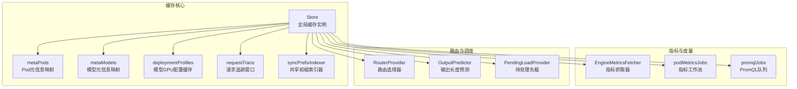
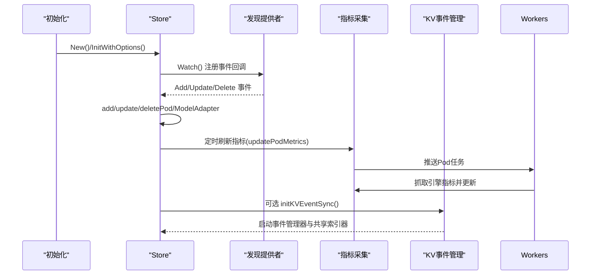
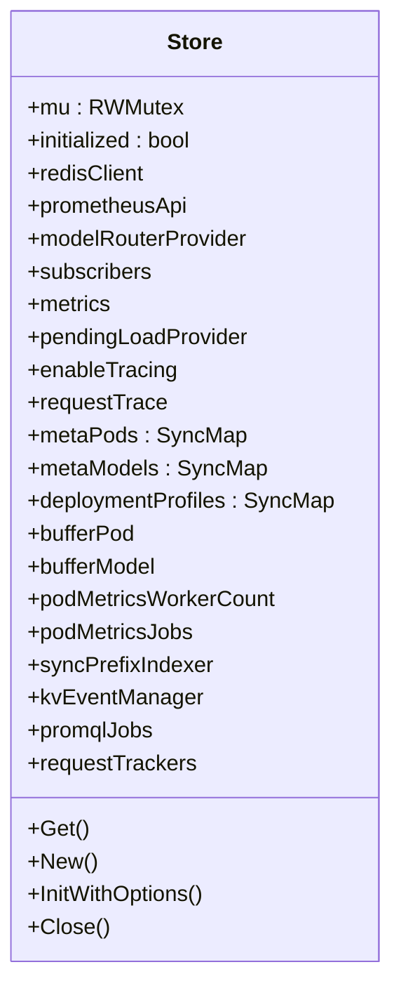
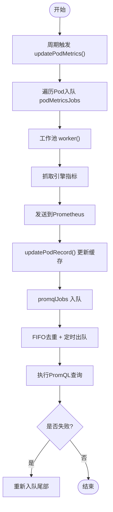
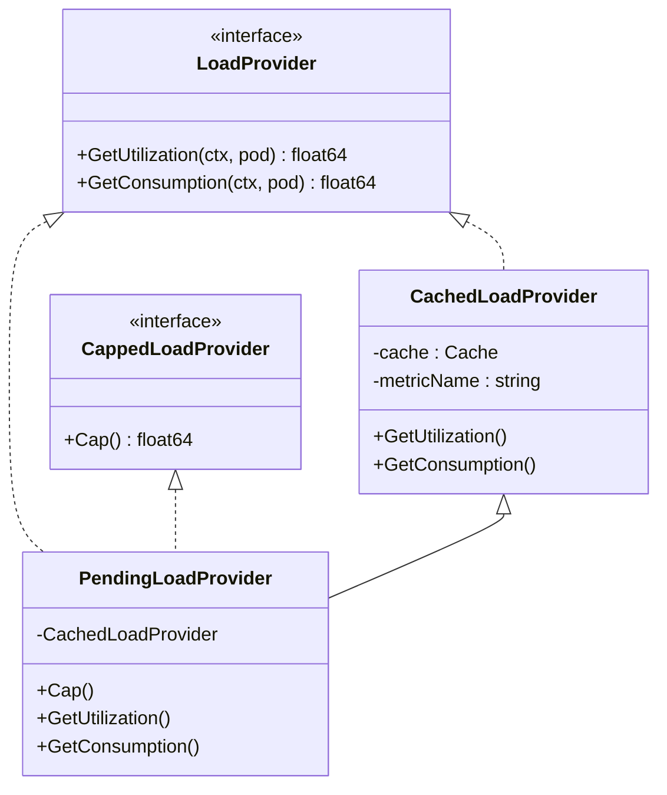
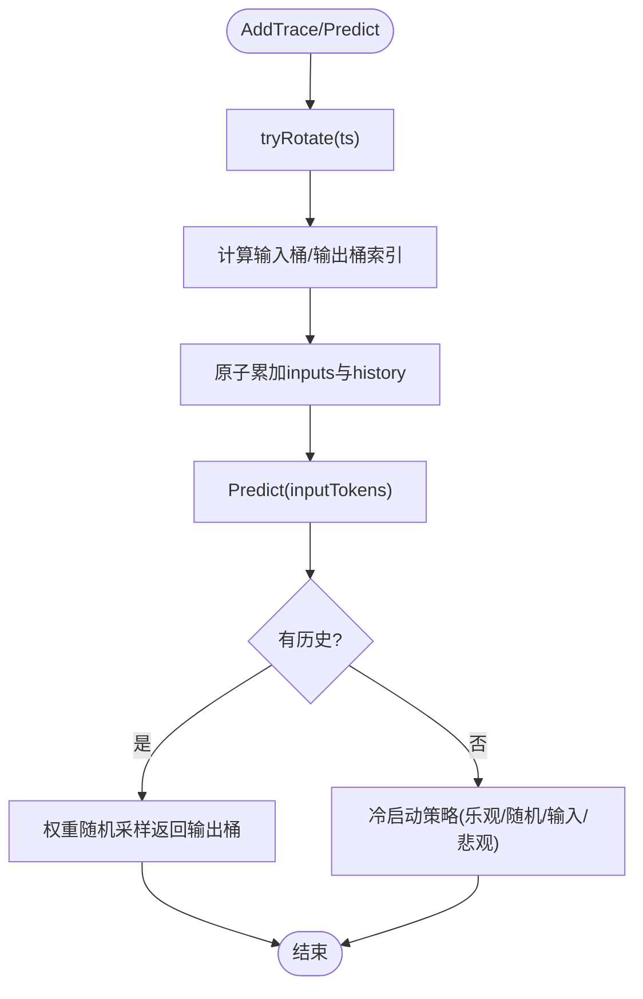
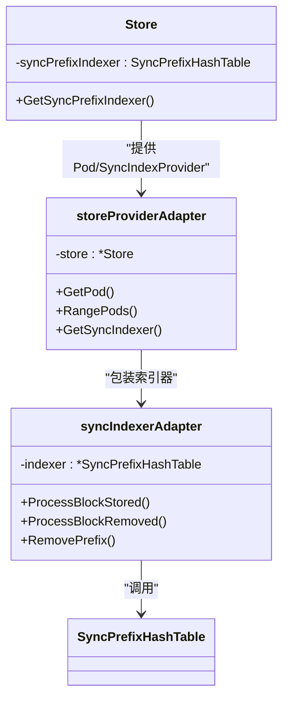
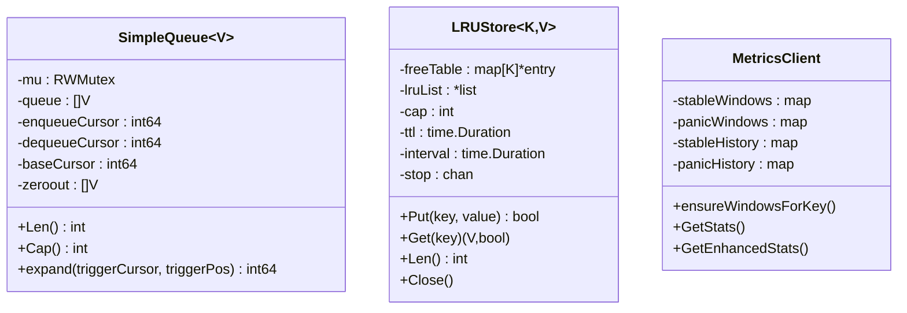
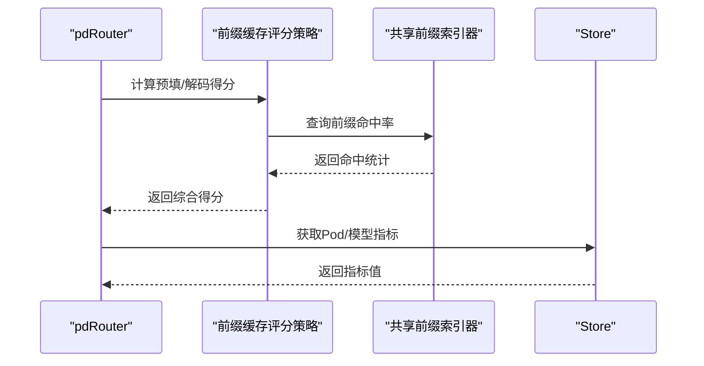
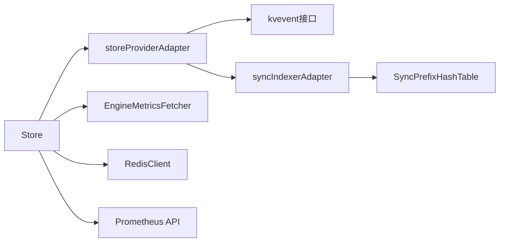

# 内存管理与优化

<cite>
**本文档引用的文件**
- [pkg/cache/cache_init.go](file://pkg/cache/cache_init.go)
- [pkg/cache/cache_impl.go](file://pkg/cache/cache_impl.go)
- [pkg/cache/cache_metrics.go](file://pkg/cache/cache_metrics.go)
- [pkg/cache/cache_api.go](file://pkg/cache/cache_api.go)
- [pkg/cache/load_provider.go](file://pkg/cache/load_provider.go)
- [pkg/cache/pending_load_provider.go](file://pkg/cache/pending_load_provider.go)
- [pkg/cache/output_predictor.go](file://pkg/cache/output_predictor.go)
- [pkg/cache/store_providers.go](file://pkg/cache/store_providers.go)
- [pkg/cache/README.md](file://pkg/cache/README.md)
- [pkg/utils/sync_map.go](file://pkg/utils/sync_map.go)
- [pkg/utils/lrustore/lru_store.go](file://pkg/utils/lrustore/lru_store.go)
- [pkg/plugins/gateway/queue/simple_queue.go](file://pkg/plugins/gateway/queue/simple_queue.go)
- [pkg/plugins/gateway/algorithms/pd/prefill_scorer.go](file://pkg/plugins/gateway/algorithms/pd/prefill_scorer.go)
- [pkg/plugins/gateway/algorithms/pd_disaggregation.go](file://pkg/plugins/gateway/algorithms/pd_disaggregation.go)
- [pkg/plugins/gateway/algorithms/pd_disaggregation_test.go](file://pkg/plugins/gateway/algorithms/pd_disaggregation_test.go)
- [pkg/controller/podautoscaler/metrics/client.go](file://pkg/controller/podautoscaler/metrics/client.go)
- [pkg/controller/util/expectation/expectation.go](file://pkg/controller/util/expectation/expectation.go)
</cite>

## 目录
1. [简介](#简介)
2. [项目结构](#项目结构)
3. [核心组件](#核心组件)
4. [架构总览](#架构总览)
5. [详细组件分析](#详细组件分析)
6. [依赖关系分析](#依赖关系分析)
7. [性能考量](#性能考量)
8. [故障排查指南](#故障排查指南)
9. [结论](#结论)
10. [附录](#附录)

## 简介
本文件面向AIBrix在推理与路由场景下的内存管理与优化，系统性梳理缓存系统中的内存分配器设计、内存区域管理、引用计数与并发控制机制，并深入解析以下关键主题：
- 外部内存区域（KV事件同步）与共享索引器的内存边界与生命周期管理
- 内存池与对象池：队列扩容策略、LRU缓存淘汰、时间窗口与历史统计的内存占用
- 存储提供者与指标采集的内存优化：批量更新、异步工作池、PromQL查询节流
- 输出预测器与待处理负载提供者的内存使用优化：滑动窗口、桶分布、原子计数
- 内存使用监控、性能调优与泄漏检测的实践建议

## 项目结构
AIBrix的内存管理主要集中在缓存子系统(pkg/cache)及其周边组件中，围绕“全局Store”聚合各类缓存与追踪能力，通过接口抽象解耦上层路由与控制器。

图示来源
- [pkg/cache/cache_init.go:72-122](file://pkg/cache/cache_init.go#L72-L122)
- [pkg/cache/cache_metrics.go:242-351](file://pkg/cache/cache_metrics.go#L242-L351)
- [pkg/cache/cache_api.go:25-35](file://pkg/cache/cache_api.go#L25-L35)

章节来源
- [pkg/cache/cache_init.go:124-166](file://pkg/cache/cache_init.go#L124-L166)
- [pkg/cache/cache_metrics.go:378-402](file://pkg/cache/cache_metrics.go#L378-L402)

## 核心组件
- 全局缓存Store：统一管理Pod/模型/指标/追踪/索引器等资源，提供线程安全的读写接口与初始化流程。
- 指标采集与缓存：集中式指标抓取器、工作池、PromQL队列，支持按需异步更新并限制峰值内存占用。
- 负载与消费估算：基于缓存指标的负载提供者，支持“待处理负载”估算与容量上限。
- 输出预测器：基于滑动窗口与分桶直方图的输出长度预测，支持冷启动策略与权重随机采样。
- 存储提供者适配器：KV事件同步的适配层，隔离kvevent与syncprefixcacheindexer包，避免循环依赖。
- 并发容器与内存池：SyncMap原子计数、LRUStore TTL淘汰、简单队列的逻辑地址映射与零填充回收。

章节来源
- [pkg/cache/cache_api.go:25-170](file://pkg/cache/cache_api.go#L25-L170)
- [pkg/cache/cache_init.go:71-122](file://pkg/cache/cache_init.go#L71-L122)
- [pkg/utils/sync_map.go:24-110](file://pkg/utils/sync_map.go#L24-L110)
- [pkg/utils/lrustore/lru_store.go:31-185](file://pkg/utils/lrustore/lru_store.go#L31-L185)

## 架构总览
下图展示缓存初始化、指标采集与KV事件同步的关键路径，以及内存热点与并发点：

图示来源
- [pkg/cache/cache_init.go:302-376](file://pkg/cache/cache_init.go#L302-L376)
- [pkg/cache/cache_init.go:404-448](file://pkg/cache/cache_init.go#L404-L448)
- [pkg/cache/cache_metrics.go:242-351](file://pkg/cache/cache_metrics.go#L242-L351)

## 详细组件分析

### 缓存Store与内存区域管理
- 初始化与单例：通过once保证全局唯一实例；根据服务角色动态启用追踪、配置缓存与KV同步。
- 数据结构：使用SyncMap[K,V]替代标准map，内置原子计数，降低锁粒度；Store字段涵盖Pod/模型/配置/追踪/索引器/工作池等。
- 生命周期：Close清理KV事件同步资源，但不关闭共享索引器（由其全局生命周期管理）。

图示来源
- [pkg/cache/cache_init.go:72-122](file://pkg/cache/cache_init.go#L72-L122)
- [pkg/cache/cache_init.go:612-620](file://pkg/cache/cache_init.go#L612-L620)

章节来源
- [pkg/cache/cache_init.go:124-166](file://pkg/cache/cache_init.go#L124-L166)
- [pkg/cache/cache_init.go:302-376](file://pkg/cache/cache_init.go#L302-L376)

### 指标采集与内存优化
- 集中式抓取器：EngineMetricsFetcher统一处理不同引擎指标，减少重复连接与解析开销。
- 工作池与背压：podMetricsJobs通道缓冲与默认10个worker，饱和时丢弃以避免阻塞主路径。
- PromQL队列：promqlJobs独立队列+FIFO去重，定时器限速，失败重试入队，避免雪崩。
- 历史清理：RateCalculator按最大年龄与数量限制历史快照，防止无限增长。

图示来源
- [pkg/cache/cache_metrics.go:242-351](file://pkg/cache/cache_metrics.go#L242-L351)
- [pkg/cache/cache_metrics.go:622-719](file://pkg/cache/cache_metrics.go#L622-L719)
- [pkg/cache/cache_metrics.go:132-164](file://pkg/cache/cache_metrics.go#L132-L164)

章节来源
- [pkg/cache/cache_metrics.go:121-124](file://pkg/cache/cache_metrics.go#L121-L124)
- [pkg/cache/cache_metrics.go:422-440](file://pkg/cache/cache_metrics.go#L422-L440)

### 负载提供者与待处理负载
- CachedLoadProvider：从缓存读取指标值，封装GetUtilization。
- PendingLoadProvider：基于模型配置签名计算吞吐与平均延迟，Little’s Law推导待处理负载，Cap固定为1.0。

图示来源
- [pkg/cache/load_provider.go:31-88](file://pkg/cache/load_provider.go#L31-L88)
- [pkg/cache/pending_load_provider.go:24-86](file://pkg/cache/pending_load_provider.go#L24-L86)

章节来源
- [pkg/cache/load_provider.go:50-88](file://pkg/cache/load_provider.go#L50-L88)
- [pkg/cache/pending_load_provider.go:32-86](file://pkg/cache/pending_load_provider.go#L32-L86)

### 输出预测器与内存使用优化
- 滑动窗口：按10秒间隔推进头指针，窗口大小受移动窗口与对齐规则影响。
- 分桶直方图：输入/输出均采用对数分桶，冷启动采用乐观策略（最小输出长度），热数据用权重随机采样。
- 历史回卷：旋转时先更新跳过槽，再重置尾部，避免旋转期间出现负值或越界。

图示来源
- [pkg/cache/output_predictor.go:146-169](file://pkg/cache/output_predictor.go#L146-L169)
- [pkg/cache/output_predictor.go:171-194](file://pkg/cache/output_predictor.go#L171-L194)
- [pkg/cache/output_predictor.go:196-213](file://pkg/cache/output_predictor.go#L196-L213)
- [pkg/cache/output_predictor.go:215-227](file://pkg/cache/output_predictor.go#L215-L227)
- [pkg/cache/output_predictor.go:244-285](file://pkg/cache/output_predictor.go#L244-L285)

章节来源
- [pkg/cache/output_predictor.go:30-45](file://pkg/cache/output_predictor.go#L30-L45)
- [pkg/cache/output_predictor.go:146-169](file://pkg/cache/output_predictor.go#L146-L169)

### 存储提供者与KV事件同步的内存边界
- 适配器模式：storeProviderAdapter桥接Store与kvevent接口，避免直接依赖；syncIndexerAdapter转换事件类型，保持包间解耦。
- 共享索引器：通过全局单例获取，Store仅持有引用；清理时仅清空引用，不关闭单例，避免多组件竞态关闭。

图示来源
- [pkg/cache/store_providers.go:58-152](file://pkg/cache/store_providers.go#L58-L152)
- [pkg/cache/store_providers.go:154-201](file://pkg/cache/store_providers.go#L154-L201)
- [pkg/cache/cache_init.go:568-610](file://pkg/cache/cache_init.go#L568-L610)

章节来源
- [pkg/cache/store_providers.go:23-46](file://pkg/cache/store_providers.go#L23-L46)
- [pkg/cache/cache_init.go:529-583](file://pkg/cache/cache_init.go#L529-L583)

### 队列与对象池设计
- 简单队列：逻辑地址与物理地址映射，基于位左移扩容，使用零填充回收旧空间；读写分离锁保护。
- LRU缓存：双向链表+哈希表，支持TTL与定期驱逐；Put/Len/Get带互斥锁，Close停止后台驱逐。
- 时间窗口：控制器侧MetricsClient维护稳定/紧急窗口与历史，避免重复分配。

图示来源
- [pkg/plugins/gateway/queue/simple_queue.go:33-42](file://pkg/plugins/gateway/queue/simple_queue.go#L33-L42)
- [pkg/plugins/gateway/queue/simple_queue.go:171-218](file://pkg/plugins/gateway/queue/simple_queue.go#L171-L218)
- [pkg/utils/lrustore/lru_store.go:31-185](file://pkg/utils/lrustore/lru_store.go#L31-L185)
- [pkg/controller/podautoscaler/metrics/client.go:75-84](file://pkg/controller/podautoscaler/metrics/client.go#L75-L84)

章节来源
- [pkg/plugins/gateway/queue/simple_queue.go:153-165](file://pkg/plugins/gateway/queue/simple_queue.go#L153-L165)
- [pkg/utils/lrustore/lru_store.go:60-76](file://pkg/utils/lrustore/lru_store.go#L60-L76)
- [pkg/controller/podautoscaler/metrics/client.go:86-104](file://pkg/controller/podautoscaler/metrics/client.go#L86-L104)

### 路由与前缀缓存的内存优化
- 前缀缓存评分策略：结合前缀命中率与运行请求数，共享tokenizer与PrefixHashTable，避免重复分配。
- 解耦与降级：当KV同步未启用或远程分词器不可用时，路由可退化至本地索引器。

图示来源
- [pkg/plugins/gateway/algorithms/pd/prefill_scorer.go:88-111](file://pkg/plugins/gateway/algorithms/pd/prefill_scorer.go#L88-L111)
- [pkg/cache/cache_init.go:568-610](file://pkg/cache/cache_init.go#L568-L610)

章节来源
- [pkg/plugins/gateway/algorithms/pd/prefill_scorer.go:88-111](file://pkg/plugins/gateway/algorithms/pd/prefill_scorer.go#L88-L111)
- [pkg/cache/cache_init.go:529-583](file://pkg/cache/cache_init.go#L529-L583)

## 依赖关系分析
- 组件内聚与耦合：Store作为聚合根，通过接口向下层提供能力；KV事件与指标采集通过适配器与独立协程解耦。
- 外部依赖：Redis用于追踪持久化与KV同步；Prometheus用于PromQL查询；Kubernetes Informer用于服务发现。
- 循环依赖规避：通过storeProviderAdapter与syncIndexerAdapter打破kvevent与syncprefixcacheindexer之间的直接依赖。

图示来源
- [pkg/cache/store_providers.go:58-152](file://pkg/cache/store_providers.go#L58-L152)
- [pkg/cache/cache_init.go:529-583](file://pkg/cache/cache_init.go#L529-L583)

章节来源
- [pkg/cache/store_providers.go:23-46](file://pkg/cache/store_providers.go#L23-L46)
- [pkg/cache/cache_init.go:302-376](file://pkg/cache/cache_init.go#L302-L376)

## 性能考量
- 指标抓取背压：通过通道缓冲与默认worker数量限制峰值内存与CPU占用；PromQL队列FIFO去重与限速避免抖动。
- 队列扩容策略：指数扩容与打包回收，减少频繁分配；零填充避免GC压力。
- LRU驱逐：定期扫描与TTL阈值控制内存上限；关闭时优雅退出后台协程。
- 滑动窗口：窗口大小与对齐策略平衡精度与内存；冷启动策略降低首次预测偏差。
- 路由前缀缓存：共享索引器与只读访问，避免每次请求重复构建。

## 故障排查指南
- 指标缺失与错误
  - 现象：GetMetricValueByPod/Model返回“指标不存在”或PromQL查询失败。
  - 排查：检查Prometheus端点配置、认证密钥、引擎指标端口标签；确认Pod就绪状态与指标抓取超时设置。
  - 参考
    - [pkg/cache/cache_metrics.go:225-240](file://pkg/cache/cache_metrics.go#L225-L240)
    - [pkg/cache/cache_metrics.go:353-396](file://pkg/cache/cache_metrics.go#L353-L396)
- KV事件同步异常
  - 现象：启用KV同步后仍无法使用共享索引器。
  - 排查：确认环境变量开启、远程分词器可用；检查事件管理器配置校验与启动日志。
  - 参考
    - [pkg/cache/cache_init.go:529-583](file://pkg/cache/cache_init.go#L529-L583)
- 内存增长与泄漏
  - 现象：进程内存持续上升。
  - 排查：检查RateCalculator历史快照上限、SyncMap键值清理、LRUStore TTL与驱逐频率；确认PromQL队列未被阻塞导致堆积。
  - 参考
    - [pkg/cache/cache_metrics.go:132-164](file://pkg/cache/cache_metrics.go#L132-L164)
    - [pkg/utils/lrustore/lru_store.go:120-139](file://pkg/utils/lrustore/lru_store.go#L120-L139)
- 路由评分异常
  - 现象：前缀命中率异常或路由偏向单一Pod。
  - 排查：确认tokenizer与PrefixHashTable共享实例一致；检查Pod模型标签与指标一致性。
  - 参考
    - [pkg/plugins/gateway/algorithms/pd/prefill_scorer.go:88-111](file://pkg/plugins/gateway/algorithms/pd/prefill_scorer.go#L88-L111)

章节来源
- [pkg/cache/cache_metrics.go:166-223](file://pkg/cache/cache_metrics.go#L166-L223)
- [pkg/cache/cache_init.go:529-583](file://pkg/cache/cache_init.go#L529-L583)
- [pkg/utils/lrustore/lru_store.go:120-139](file://pkg/utils/lrustore/lru_store.go#L120-L139)

## 结论
AIBrix的内存管理以“全局Store聚合+适配器解耦+异步工作池+滑动窗口/LRU”为核心策略，在高并发与动态拓扑下实现了稳定的内存占用与可观测性。通过合理的扩容与回收策略、背压与限速机制、共享索引器与只读访问，系统在路由与推理场景中具备良好的扩展性与鲁棒性。

## 附录
- 线程安全声明与测试
  - 缓存操作通过读写锁、原子计数与通道处理保障线程安全。
  - 参考
    - [pkg/cache/README.md:155-160](file://pkg/cache/README.md#L155-L160)
- 路由与控制器内存相关组件
  - 控制器期望值与时间窗口：通过原子计数与时间窗口统计，避免重复分配与竞争。
  - 参考
    - [pkg/controller/util/expectation/expectation.go:204-232](file://pkg/controller/util/expectation/expectation.go#L204-L232)
    - [pkg/controller/podautoscaler/metrics/client.go:75-104](file://pkg/controller/podautoscaler/metrics/client.go#L75-L104)