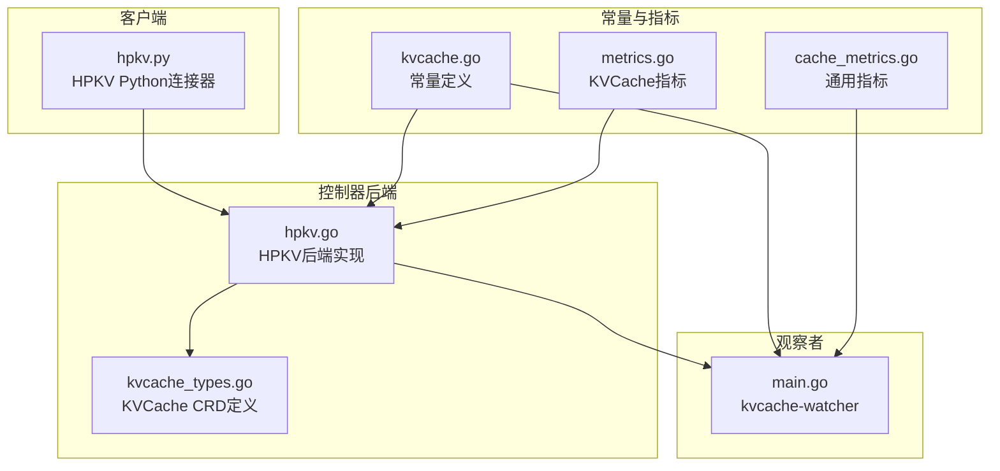
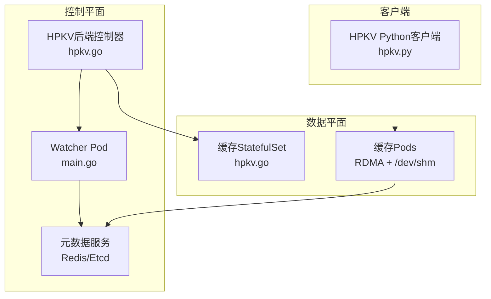
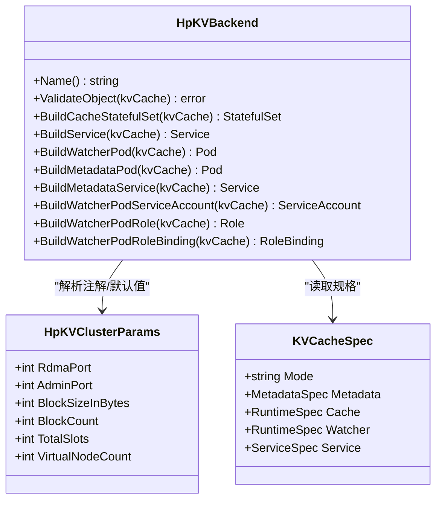
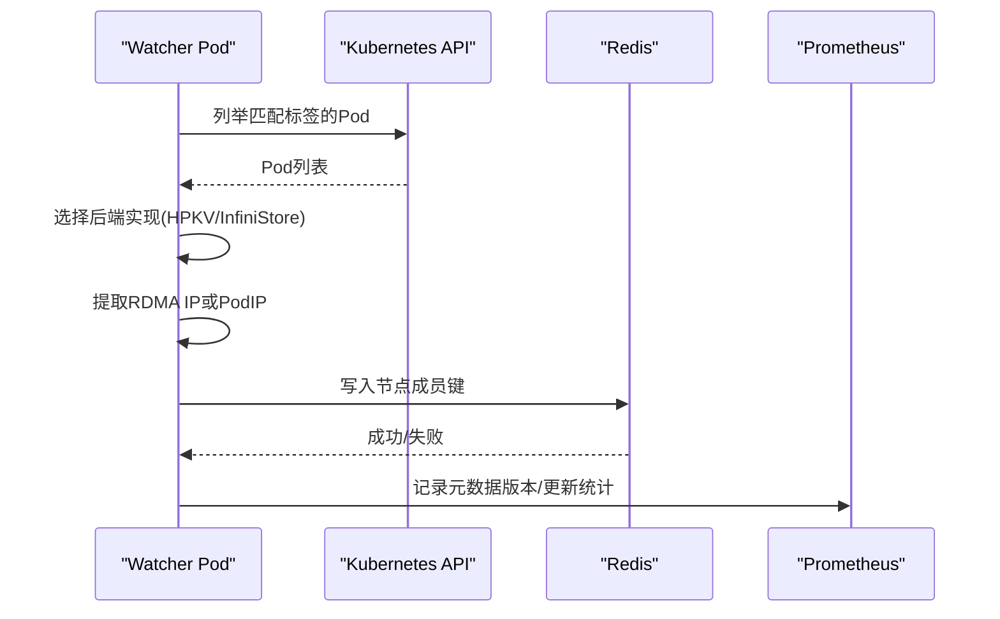
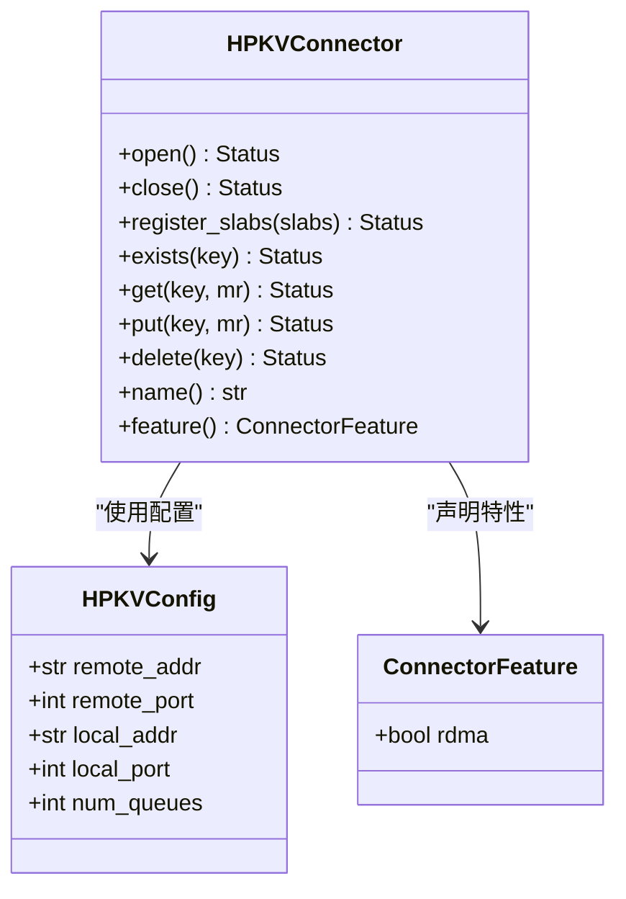
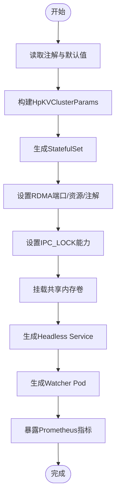
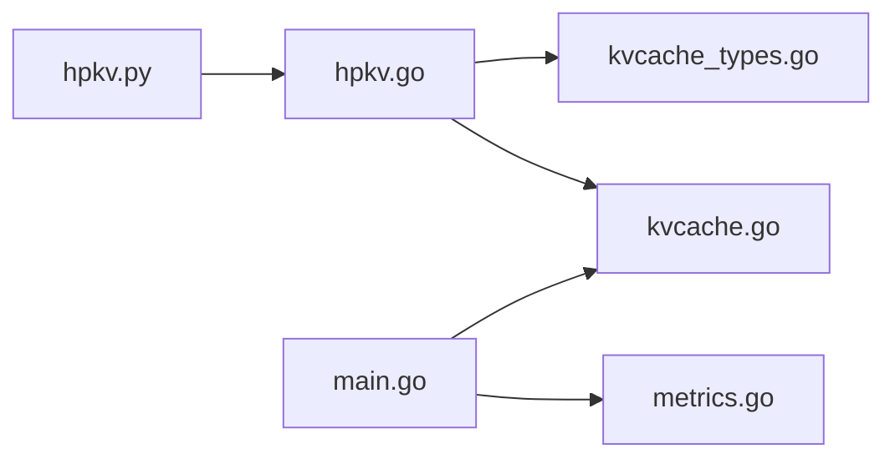

# HPKV缓存后端

<cite>
**本文档引用的文件**
- [hpkv.go](file://pkg/controller/kvcache/backends/hpkv.go)
- [hpkv_test.go](file://pkg/controller/kvcache/backends/hpkv_test.go)
- [kvcache_types.go](file://api/orchestration/v1alpha1/kvcache_types.go)
- [main.go](file://cmd/kvcache-watcher/main.go)
- [hpkv.py](file://python/aibrix_kvcache/aibrix_kvcache/l2/connectors/hpkv.py)
- [kvcache.go](file://pkg/constants/kvcache.go)
- [metrics.go](file://pkg/cache/kvcache/metrics.go)
- [cache_metrics.go](file://pkg/cache/cache_metrics.go)
</cite>

## 目录
1. [简介](#简介)
2. [项目结构](#项目结构)
3. [核心组件](#核心组件)
4. [架构概览](#架构概览)
5. [详细组件分析](#详细组件分析)
6. [依赖分析](#依赖分析)
7. [性能考虑](#性能考虑)
8. [故障排查指南](#故障排查指南)
9. [结论](#结论)
10. [附录](#附录)

## 简介
本文件为HPKV（高性能键值存储）缓存后端的完整技术文档。HPKV是Aibrix项目中用于KV缓存的高性能后端实现，基于RDMA网络与共享内存优化，结合一致性哈希进行分布式节点管理。该后端通过Kubernetes控制器生成缓存服务、元数据服务与监控观察者，并提供Python客户端以支持RDMA直接内存注册与零拷贝传输。

HPKV后端的关键特性：
- 基于RDMA的高性能数据平面，降低CPU开销与网络延迟
- 使用共享内存（/dev/shm）提升数据访问速度
- 通过一致性哈希实现稳定的节点分布与扩缩容
- 支持元数据服务（Redis或Etcd）与成员注册观察者
- 提供丰富的环境变量与注解配置项，便于容量规划与性能调优

## 项目结构
HPKV相关代码主要分布在以下模块：
- 控制器后端实现：负责根据KVCache CRD生成HPKV所需的StatefulSet、Service、Watcher Pod等资源
- CRD定义：描述KVCache的规格、模式与服务暴露方式
- 观察者程序：监听Pod状态变化，向元数据服务注册缓存节点
- Python客户端：提供RDMA连接、内存注册与键值操作接口
- 常量与指标：统一后端标识、标签与监控指标

**图表来源**
- [hpkv.go:1-425](file://pkg/controller/kvcache/backends/hpkv.go#L1-L425)
- [kvcache_types.go:1-141](file://api/orchestration/v1alpha1/kvcache_types.go#L1-L141)
- [main.go:190-389](file://cmd/kvcache-watcher/main.go#L190-L389)
- [hpkv.py:1-205](file://python/aibrix_kvcache/aibrix_kvcache/l2/connectors/hpkv.py#L1-L205)
- [kvcache.go:1-44](file://pkg/constants/kvcache.go#L1-L44)
- [metrics.go:96-244](file://pkg/cache/kvcache/metrics.go#L96-L244)
- [cache_metrics.go:153-182](file://pkg/cache/cache_metrics.go#L153-L182)

**章节来源**
- [hpkv.go:1-425](file://pkg/controller/kvcache/backends/hpkv.go#L1-L425)
- [kvcache_types.go:1-141](file://api/orchestration/v1alpha1/kvcache_types.go#L1-L141)
- [main.go:190-389](file://cmd/kvcache-watcher/main.go#L190-L389)
- [hpkv.py:1-205](file://python/aibrix_kvcache/aibrix_kvcache/l2/connectors/hpkv.py#L1-L205)
- [kvcache.go:1-44](file://pkg/constants/kvcache.go#L1-L44)
- [metrics.go:96-244](file://pkg/cache/kvcache/metrics.go#L96-L244)
- [cache_metrics.go:153-182](file://pkg/cache/cache_metrics.go#L153-L182)

## 核心组件
- HPKV后端控制器：实现KVCache后端构建逻辑，生成缓存StatefulSet、Headless Service、Watcher Pod以及元数据服务
- 观察者程序：监听指定命名空间与标签的缓存Pod，提取RDMA IP并注册到Redis，同时暴露Prometheus指标
- Python客户端：封装RDMA连接、内存区域注册与键值操作，支持异步接口
- CRD与常量：定义KVCache规格、标签与后端类型常量，确保跨模块一致

关键职责与交互：
- 后端控制器从注解与环境变量读取参数，注入到缓存容器与Watcher容器
- 观察者通过Redis键空间同步缓存节点列表，支持一致性哈希参数传递
- 客户端通过RDMA直连HPKV服务，使用注册的内存区域进行零拷贝读写

**章节来源**
- [hpkv.go:62-104](file://pkg/controller/kvcache/backends/hpkv.go#L62-L104)
- [main.go:192-226](file://cmd/kvcache-watcher/main.go#L192-L226)
- [hpkv.py:58-102](file://python/aibrix_kvcache/aibrix_kvcache/l2/connectors/hpkv.py#L58-L102)
- [kvcache_types.go:85-107](file://api/orchestration/v1alpha1/kvcache_types.go#L85-L107)
- [kvcache.go:39-42](file://pkg/constants/kvcache.go#L39-L42)

## 架构概览
HPKV缓存后端的整体架构由三层组成：
- 数据平面：HPKV缓存服务（StatefulSet），通过RDMA端口提供高性能KV服务，使用共享内存加速
- 控制平面：HPKV后端控制器与Watcher Pod，负责资源编排与节点注册
- 元数据平面：Redis/Etcd，保存缓存节点列表与一致性哈希配置

**图表来源**
- [hpkv.go:98-104](file://pkg/controller/kvcache/backends/hpkv.go#L98-L104)
- [hpkv.go:191-377](file://pkg/controller/kvcache/backends/hpkv.go#L191-L377)
- [main.go:228-346](file://cmd/kvcache-watcher/main.go#L228-L346)
- [hpkv.py:110-133](file://python/aibrix_kvcache/aibrix_kvcache/l2/connectors/hpkv.py#L110-L133)

## 详细组件分析

### HPKV后端控制器
HPKV后端控制器负责：
- 解析注解与默认值，生成缓存参数结构体
- 构建缓存StatefulSet：设置RDMA端口、管理端口、共享内存卷、IPC锁能力、RDMA资源注解
- 构建Headless Service：暴露RDMA与管理端口
- 构建Watcher Pod：传入后端类型、RDMA端口、管理端口、一致性哈希参数与Redis连接信息
- 构建元数据服务（Redis）与RBAC资源

**图表来源**
- [hpkv.go:53-62](file://pkg/controller/kvcache/backends/hpkv.go#L53-L62)
- [hpkv.go:72-104](file://pkg/controller/kvcache/backends/hpkv.go#L72-L104)
- [hpkv.go:415-424](file://pkg/controller/kvcache/backends/hpkv.go#L415-L424)
- [kvcache_types.go:85-107](file://api/orchestration/v1alpha1/kvcache_types.go#L85-L107)

**章节来源**
- [hpkv.go:53-62](file://pkg/controller/kvcache/backends/hpkv.go#L53-L62)
- [hpkv.go:72-104](file://pkg/controller/kvcache/backends/hpkv.go#L72-L104)
- [hpkv.go:191-377](file://pkg/controller/kvcache/backends/hpkv.go#L191-L377)
- [hpkv.go:379-413](file://pkg/controller/kvcache/backends/hpkv.go#L379-L413)
- [hpkv.go:415-424](file://pkg/controller/kvcache/backends/hpkv.go#L415-L424)

### 观察者程序（kvcache-watcher）
观察者程序负责：
- 从环境变量读取Redis地址、数据库与密码
- 创建Kubernetes客户端与Informers，监听指定命名空间与标签的Pod
- 根据后端类型选择提取IP的方式（HPKV使用RDMA IP，InfiniStore使用PodIP）
- 将缓存节点注册到Redis，键名由后端类型决定
- 暴露Prometheus指标端点，记录元数据版本、更新次数与失败计数

**图表来源**
- [main.go:228-346](file://cmd/kvcache-watcher/main.go#L228-L346)
- [main.go:192-226](file://cmd/kvcache-watcher/main.go#L192-L226)
- [main.go:249-256](file://cmd/kvcache-watcher/main.go#L249-L256)

**章节来源**
- [main.go:192-226](file://cmd/kvcache-watcher/main.go#L192-L226)
- [main.go:228-346](file://cmd/kvcache-watcher/main.go#L228-L346)
- [main.go:249-256](file://cmd/kvcache-watcher/main.go#L249-L256)

### Python客户端（HPKVConnector）
HPKV Python客户端提供：
- 连接建立与关闭：通过RDMA直连远程HPKV服务
- 内存注册：将本地张量内存区域注册为可共享缓冲区
- 键值操作：支持存在性检查、读取、写入与删除
- 异步包装：对常用操作提供异步接口

**图表来源**
- [hpkv.py:58-102](file://python/aibrix_kvcache/aibrix_kvcache/l2/connectors/hpkv.py#L58-L102)
- [hpkv.py:110-133](file://python/aibrix_kvcache/aibrix_kvcache/l2/connectors/hpkv.py#L110-L133)
- [hpkv.py:135-197](file://python/aibrix_kvcache/aibrix_kvcache/l2/connectors/hpkv.py#L135-L197)

**章节来源**
- [hpkv.py:58-102](file://python/aibrix_kvcache/aibrix_kvcache/l2/connectors/hpkv.py#L58-L102)
- [hpkv.py:110-133](file://python/aibrix_kvcache/aibrix_kvcache/l2/connectors/hpkv.py#L110-L133)
- [hpkv.py:135-197](file://python/aibrix_kvcache/aibrix_kvcache/l2/connectors/hpkv.py#L135-L197)

### 配置与部署要点
- 注解与默认值：RDMA端口、管理端口、块大小、块数量、一致性哈希槽位与虚拟节点数
- 环境变量：后端类型、RDMA端口、管理端口、块大小、块数量、Pod IP/名称等
- 资源与权限：IPC锁能力、RDMA资源请求、共享内存卷
- 服务暴露：Headless Service用于稳定网络标识，端口映射RDMA与管理端口

**图表来源**
- [hpkv.go:415-424](file://pkg/controller/kvcache/backends/hpkv.go#L415-L424)
- [hpkv.go:281-287](file://pkg/controller/kvcache/backends/hpkv.go#L281-L287)
- [hpkv.go:344-353](file://pkg/controller/kvcache/backends/hpkv.go#L344-L353)
- [hpkv.go:362-371](file://pkg/controller/kvcache/backends/hpkv.go#L362-L371)
- [hpkv.go:379-413](file://pkg/controller/kvcache/backends/hpkv.go#L379-L413)
- [hpkv.go:106-189](file://pkg/controller/kvcache/backends/hpkv.go#L106-L189)

**章节来源**
- [hpkv.go:35-51](file://pkg/controller/kvcache/backends/hpkv.go#L35-L51)
- [hpkv.go:106-189](file://pkg/controller/kvcache/backends/hpkv.go#L106-L189)
- [hpkv.go:281-287](file://pkg/controller/kvcache/backends/hpkv.go#L281-L287)
- [hpkv.go:344-353](file://pkg/controller/kvcache/backends/hpkv.go#L344-L353)
- [hpkv.go:362-371](file://pkg/controller/kvcache/backends/hpkv.go#L362-L371)
- [hpkv.go:379-413](file://pkg/controller/kvcache/backends/hpkv.go#L379-L413)
- [hpkv.go:415-424](file://pkg/controller/kvcache/backends/hpkv.go#L415-L424)

## 依赖分析
- 后端控制器依赖Kubernetes API与CRD定义，生成StatefulSet、Service与Pod
- 观察者依赖Redis客户端与Kubernetes Informer，负责节点注册与指标上报
- Python客户端依赖HPKV原生库与RDMA能力，实现零拷贝传输
- 常量模块统一后端标识与标签，避免硬编码

**图表来源**
- [hpkv.go:19-33](file://pkg/controller/kvcache/backends/hpkv.go#L19-L33)
- [kvcache_types.go:19-22](file://api/orchestration/v1alpha1/kvcache_types.go#L19-L22)
- [kvcache.go:19-43](file://pkg/constants/kvcache.go#L19-L43)
- [main.go:228-282](file://cmd/kvcache-watcher/main.go#L228-L282)
- [metrics.go:96-244](file://pkg/cache/kvcache/metrics.go#L96-L244)
- [hpkv.py:19-27](file://python/aibrix_kvcache/aibrix_kvcache/l2/connectors/hpkv.py#L19-L27)

**章节来源**
- [hpkv.go:19-33](file://pkg/controller/kvcache/backends/hpkv.go#L19-L33)
- [kvcache_types.go:19-22](file://api/orchestration/v1alpha1/kvcache_types.go#L19-L22)
- [kvcache.go:19-43](file://pkg/constants/kvcache.go#L19-L43)
- [main.go:228-282](file://cmd/kvcache-watcher/main.go#L228-L282)
- [metrics.go:96-244](file://pkg/cache/kvcache/metrics.go#L96-L244)
- [hpkv.py:19-27](file://python/aibrix_kvcache/aibrix_kvcache/l2/connectors/hpkv.py#L19-L27)

## 性能考虑
- RDMA优先：HPKV通过RDMA端口提供数据面，显著降低CPU占用与网络时延
- 共享内存：使用/dev/shm提升数据访问速度，减少系统调用
- 一致性哈希：通过总槽位与虚拟节点数平衡分布均匀性与计算开销
- 资源与权限：IPC_LOCK能力与RDMA资源请求确保稳定运行
- 监控指标：Prometheus指标覆盖连接、事件与序列号，便于性能观测与告警

优化建议：
- 根据模型参数规模调整块大小与块数量，平衡内存占用与吞吐
- 在高并发场景下增加副本数与总槽位，提高扩展性
- 结合监控指标设置告警阈值，及时发现异常

**章节来源**
- [hpkv.go:263-279](file://pkg/controller/kvcache/backends/hpkv.go#L263-L279)
- [hpkv.go:344-353](file://pkg/controller/kvcache/backends/hpkv.go#L344-L353)
- [hpkv.go:362-371](file://pkg/controller/kvcache/backends/hpkv.go#L362-L371)
- [metrics.go:96-244](file://pkg/cache/kvcache/metrics.go#L96-L244)
- [cache_metrics.go:153-182](file://pkg/cache/cache_metrics.go#L153-L182)

## 故障排查指南
常见问题与定位方法：
- 节点未注册：检查Watcher日志与Redis键空间，确认后端类型与RDMA IP提取是否正确
- 连接失败：验证RDMA端口、管理端口与防火墙策略；确认共享内存卷挂载与IPC锁权限
- 指标缺失：检查Prometheus端点与服务发现配置，确认注解中的端口与路径
- 扩缩容异常：核对一致性哈希参数与副本数，避免槽位不足导致分布不均

**章节来源**
- [main.go:228-346](file://cmd/kvcache-watcher/main.go#L228-L346)
- [hpkv.go:331-341](file://pkg/controller/kvcache/backends/hpkv.go#L331-L341)
- [metrics.go:96-244](file://pkg/cache/kvcache/metrics.go#L96-L244)

## 结论
HPKV缓存后端通过RDMA与共享内存实现高性能KV缓存，结合一致性哈希与元数据服务，提供了可扩展、可观测的缓存解决方案。控制器与观察者协同工作，简化了部署与运维；Python客户端则为上层应用提供了高效的RDMA直连能力。通过合理的配置与监控，HPKV能够在高并发、大数据集与低延迟场景下稳定运行。

## 附录
- 配置示例与最佳实践可在测试用例与CRD示例中参考，重点关注注解与环境变量的组合使用
- 监控与告警建议结合Prometheus指标与Kubernetes告警规则，形成完整的可观测体系

**章节来源**
- [hpkv_test.go:151-229](file://pkg/controller/kvcache/backends/hpkv_test.go#L151-L229)
- [kvcache_types.go:85-107](file://api/orchestration/v1alpha1/kvcache_types.go#L85-L107)