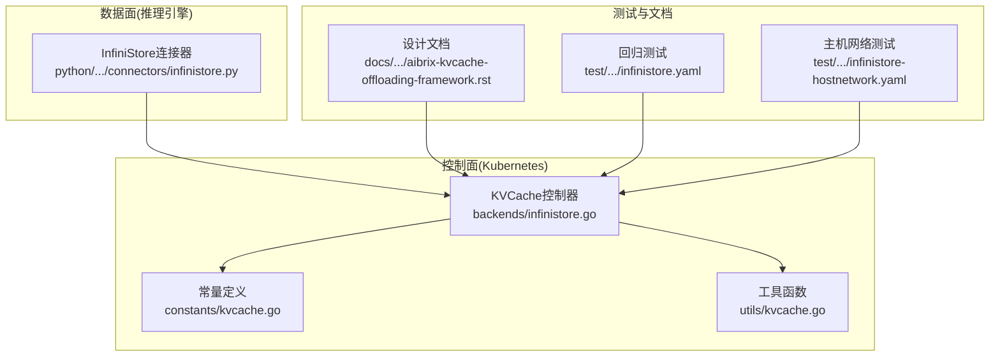
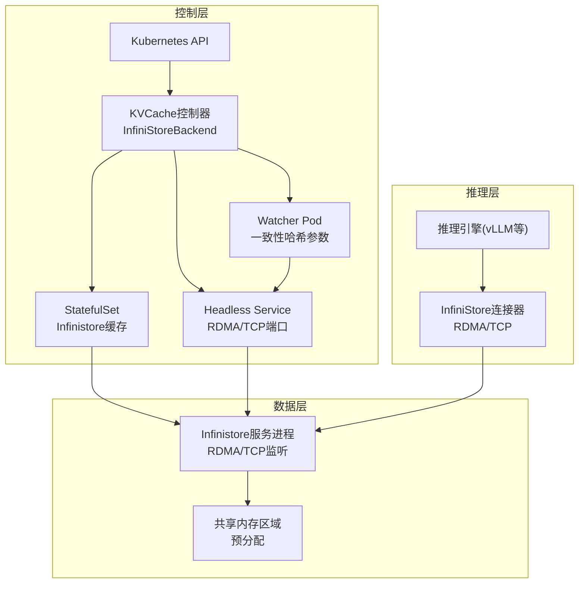
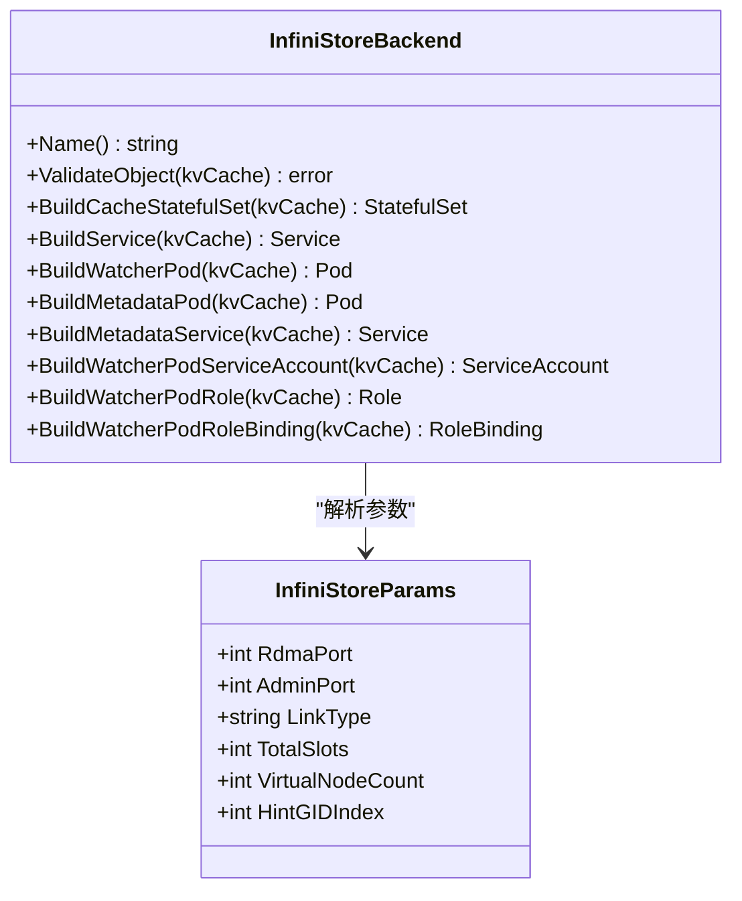
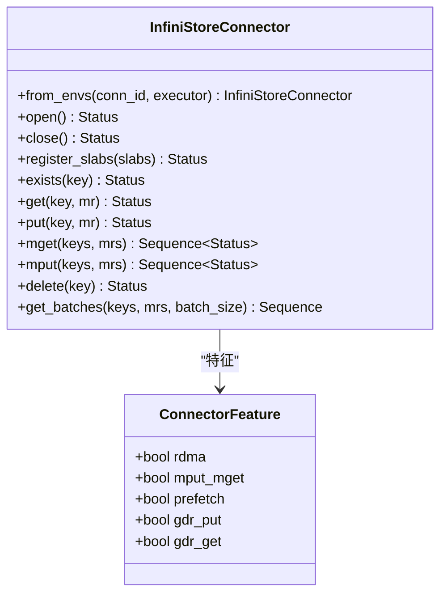
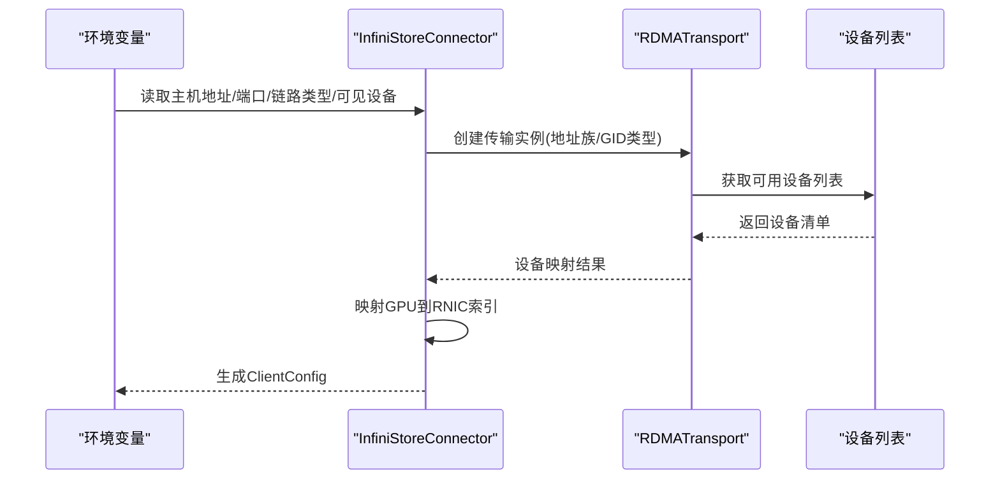
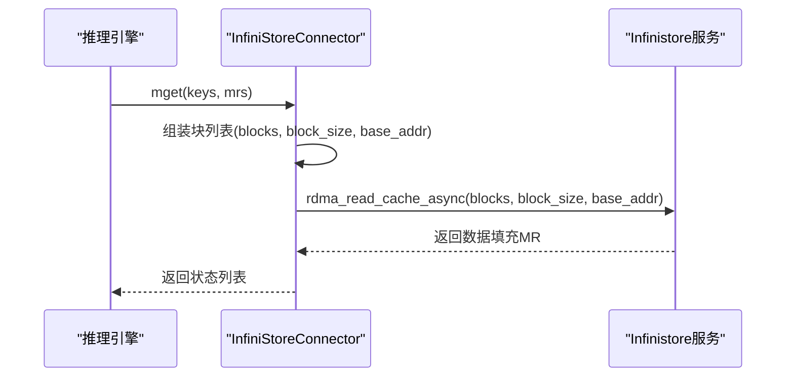
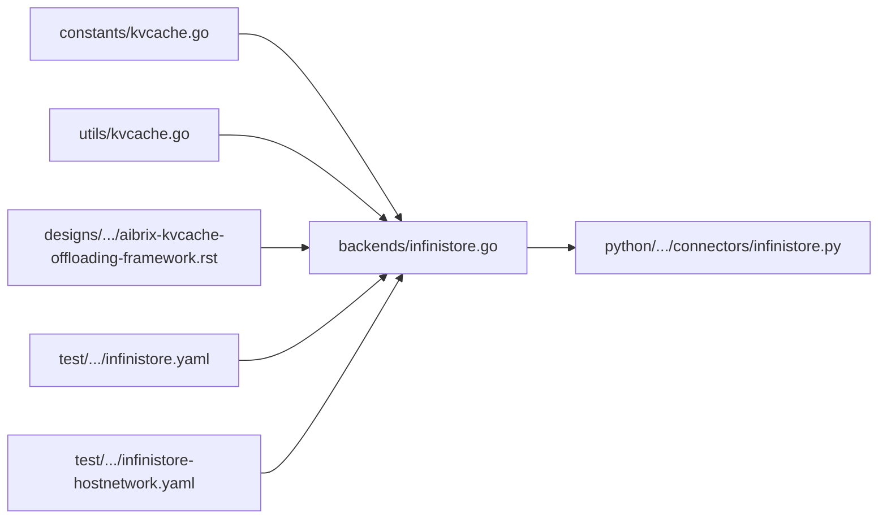

# Infinistore缓存后端

<cite>
**本文档引用的文件**
- [infinistore.go](file://pkg/controller/kvcache/backends/infinistore.go)
- [infinistore_test.go](file://pkg/controller/kvcache/backends/infinistore_test.go)
- [infinistore.py](file://python/aibrix_kvcache/aibrix_kvcache/l2/connectors/infinistore.py)
- [kvcache.go](file://pkg/constants/kvcache.go)
- [kvcache.go](file://pkg/utils/kvcache.go)
- [aibrix-kvcache-offloading-framework.rst](file://docs/source/designs/aibrix-kvcache-offloading-framework.rst)
- [infinistore.yaml](file://test/regression/v0.3.0/infinistore.yaml)
- [infinistore-hostnetwork.yaml](file://test/regression/v0.3.0/infinistore-hostnetwork.yaml)
</cite>

## 目录
1. [简介](#简介)
2. [项目结构](#项目结构)
3. [核心组件](#核心组件)
4. [架构概览](#架构概览)
5. [详细组件分析](#详细组件分析)
6. [依赖关系分析](#依赖关系分析)
7. [性能考虑](#性能考虑)
8. [故障排查指南](#故障排查指南)
9. [结论](#结论)
10. [附录](#附录)

## 简介
本文件为Infinistore缓存后端的详细技术文档，面向需要在AIBrix框架中使用Infinistore作为分布式KV缓存后端的工程师与运维人员。文档涵盖Infinistore在AIBrix中的实现方式、架构设计、配置参数、网络与硬件要求、性能基准、大规模部署优势、部署指南、运维建议、性能调优与故障诊断方法。

Infinistore是字节跳动开源的高性能存储系统，支持RDMA与TCP两种连接模式，通过Kubernetes控制器在集群内编排Infinistore缓存服务，并由推理引擎侧的Python连接器通过RDMA或TCP访问缓存数据，实现跨引擎共享与低延迟KV缓存。

## 项目结构
Infinistore相关代码主要分布在以下模块：
- 控制器后端实现：负责在Kubernetes中生成Infinistore缓存的Pod、Service、StatefulSet等资源对象
- Python连接器：负责在推理引擎侧建立RDMA/TCP连接并执行读写操作
- 常量与工具：定义后端名称、验证逻辑与默认参数
- 文档与测试：包含设计文档、环境变量参考以及回归测试样例

**图表来源**
- [infinistore.go:1-438](file://pkg/controller/kvcache/backends/infinistore.go#L1-L438)
- [kvcache.go:1-44](file://pkg/constants/kvcache.go#L1-L44)
- [kvcache.go:1-66](file://pkg/utils/kvcache.go#L1-L66)
- [infinistore.py:1-432](file://python/aibrix_kvcache/aibrix_kvcache/l2/connectors/infinistore.py#L1-L432)
- [aibrix-kvcache-offloading-framework.rst:1-514](file://docs/source/designs/aibrix-kvcache-offloading-framework.rst#L1-L514)
- [infinistore.yaml:1-66](file://test/regression/v0.3.0/infinistore.yaml#L1-L66)
- [infinistore-hostnetwork.yaml:1-53](file://test/regression/v0.3.0/infinistore-hostnetwork.yaml#L1-L53)

**章节来源**
- [infinistore.go:1-438](file://pkg/controller/kvcache/backends/infinistore.go#L1-L438)
- [kvcache.go:1-44](file://pkg/constants/kvcache.go#L1-L44)
- [kvcache.go:1-66](file://pkg/utils/kvcache.go#L1-L66)
- [infinistore.py:1-432](file://python/aibrix_kvcache/aibrix_kvcache/l2/connectors/infinistore.py#L1-L432)
- [aibrix-kvcache-offloading-framework.rst:1-514](file://docs/source/designs/aibrix-kvcache-offloading-framework.rst#L1-L514)
- [infinistore.yaml:1-66](file://test/regression/v0.3.0/infinistore.yaml#L1-L66)
- [infinistore-hostnetwork.yaml:1-53](file://test/regression/v0.3.0/infinistore-hostnetwork.yaml#L1-L53)

## 核心组件
- InfiniStoreBackend：实现KVCache后端接口，负责构建缓存服务、元数据服务、Watcher Pod、RBAC资源以及StatefulSet
- InfiniStoreParams：从注解与默认值推导出运行参数（RDMA端口、管理端口、链路类型、总槽位数、虚拟节点数、GID索引）
- InfiniStore连接器：在推理引擎侧通过RDMA或TCP连接Infinistore服务，支持批量mget/mput、注册GPU内存区域、序列化控制面TCP调用等
- 默认参数与校验：提供默认端口、链路类型、预分配内存大小计算、后端有效性校验等

关键职责与行为：
- 控制面：根据KVCache CRD生成Infinistore缓存StatefulSet、Headless Service、Watcher Pod及RBAC；注入RDMA资源注解与安全上下文
- 数据面：连接器根据环境变量选择RDMA或TCP，自动检测设备列表，映射GPU到RNIC，注册内存区域，执行异步RDMA读写

**章节来源**
- [infinistore.go:49-100](file://pkg/controller/kvcache/backends/infinistore.go#L49-L100)
- [infinistore.go:402-437](file://pkg/controller/kvcache/backends/infinistore.go#L402-L437)
- [infinistore.py:36-188](file://python/aibrix_kvcache/aibrix_kvcache/l2/connectors/infinistore.py#L36-L188)

## 架构概览
Infinistore在AIBrix中的整体架构分为三层：
- 控制层：KVCache控制器根据注解与规格生成Infinistore缓存实例（StatefulSet）、Headless Service、Watcher Pod与元数据服务
- 数据层：Infinistore缓存服务监听RDMA/TCP端口，管理共享内存区域，提供KV读写接口
- 推理层：推理引擎通过InfiniStore连接器以RDMA或TCP访问缓存，实现跨引擎共享与低延迟访问

**图表来源**
- [infinistore.go:89-99](file://pkg/controller/kvcache/backends/infinistore.go#L89-L99)
- [infinistore.go:366-400](file://pkg/controller/kvcache/backends/infinistore.go#L366-L400)
- [infinistore.py:36-188](file://python/aibrix_kvcache/aibrix_kvcache/l2/connectors/infinistore.py#L36-L188)

## 详细组件分析

### 控制器后端实现（InfiniStoreBackend）
- 资源构建
  - 缓存StatefulSet：设置RDMA端口、管理端口、链接类型、GID索引、预分配内存大小等参数；启用IPC共享内存卷；注入环境变量（Pod IP、节点名、UID等）；根据RDMA资源自动添加CNI网络注解
  - Headless Service：暴露RDMA与管理端口，用于无头服务访问
  - Watcher Pod：传递Redis元数据地址、命名空间、集群标识等环境变量，启动一致性哈希相关参数
  - RBAC：为Watcher Pod创建ServiceAccount、Role与RoleBinding
- 参数解析
  - 从注解读取链路类型与GID索引，其余参数采用默认值
  - 预分配内存大小按容器内存限制的90%向下取整，最小为1GiB
- 后端校验
  - 若指定元数据配置但未提供Etcd或Redis，则返回错误

**图表来源**
- [infinistore.go:49-100](file://pkg/controller/kvcache/backends/infinistore.go#L49-L100)
- [infinistore.go:402-437](file://pkg/controller/kvcache/backends/infinistore.go#L402-L437)

**章节来源**
- [infinistore.go:60-99](file://pkg/controller/kvcache/backends/infinistore.go#L60-L99)
- [infinistore.go:186-364](file://pkg/controller/kvcache/backends/infinistore.go#L186-L364)
- [infinistore.go:366-400](file://pkg/controller/kvcache/backends/infinistore.go#L366-L400)
- [infinistore.go:402-437](file://pkg/controller/kvcache/backends/infinistore.go#L402-L437)

### Python连接器（InfiniStoreConnector）
- 连接建立
  - 支持RDMA与TCP两种连接类型；RDMA模式下自动检测设备列表，映射GPU到RNIC；TCP模式下维护连接池
  - 从环境变量读取主机地址、服务端口、连接类型、IB端口、链路类型等
- 内存管理
  - 注册GPU显存页（Memory Region），以便RDMA直接读写
  - 批量操作支持mget/mput，按块大小与基地址组织数据
- 操作接口
  - 异步exists/get/put/delete，RDMA路径使用异步RDMA读写，TCP路径使用连接池复用
  - 控制面TCP调用加锁，避免交错发送/接收导致的异常

**图表来源**
- [infinistore.py:36-204](file://python/aibrix_kvcache/aibrix_kvcache/l2/connectors/infinistore.py#L36-L204)
- [infinistore.py:262-432](file://python/aibrix_kvcache/aibrix_kvcache/l2/connectors/infinistore.py#L262-L432)

**章节来源**
- [infinistore.py:58-188](file://python/aibrix_kvcache/aibrix_kvcache/l2/connectors/infinistore.py#L58-L188)
- [infinistore.py:262-432](file://python/aibrix_kvcache/aibrix_kvcache/l2/connectors/infinistore.py#L262-L432)

### 关键流程时序

#### 连接器初始化与RDMA设备选择

**图表来源**
- [infinistore.py:83-188](file://python/aibrix_kvcache/aibrix_kvcache/l2/connectors/infinistore.py#L83-L188)

#### RDMA批量读取流程

**图表来源**
- [infinistore.py:318-350](file://python/aibrix_kvcache/aibrix_kvcache/l2/connectors/infinistore.py#L318-L350)

## 依赖关系分析
- 控制器依赖
  - 常量：KVCache后端名称、标签键、角色值
  - 工具：注解解析与默认值处理
- 连接器依赖
  - 环境变量：主机地址、服务端口、连接类型、IB端口、链路类型、可见设备列表
  - RDMA传输：设备请求、地址范围、GID类型等
- 测试与文档
  - 回归测试样例覆盖了RDMA/TCP模式、主机网络模式、预分配内存计算等场景

**图表来源**
- [kvcache.go:19-43](file://pkg/constants/kvcache.go#L19-L43)
- [kvcache.go:26-66](file://pkg/utils/kvcache.go#L26-L66)
- [infinistore.go:1-438](file://pkg/controller/kvcache/backends/infinistore.go#L1-L438)
- [infinistore.py:1-432](file://python/aibrix_kvcache/aibrix_kvcache/l2/connectors/infinistore.py#L1-L432)
- [aibrix-kvcache-offloading-framework.rst:1-514](file://docs/source/designs/aibrix-kvcache-offloading-framework.rst#L1-L514)
- [infinistore.yaml:1-66](file://test/regression/v0.3.0/infinistore.yaml#L1-L66)
- [infinistore-hostnetwork.yaml:1-53](file://test/regression/v0.3.0/infinistore-hostnetwork.yaml#L1-L53)

**章节来源**
- [kvcache.go:19-43](file://pkg/constants/kvcache.go#L19-L43)
- [kvcache.go:26-66](file://pkg/utils/kvcache.go#L26-L66)
- [infinistore.go:1-438](file://pkg/controller/kvcache/backends/infinistore.go#L1-L438)
- [infinistore.py:1-432](file://python/aibrix_kvcache/aibrix_kvcache/l2/connectors/infinistore.py#L1-L432)

## 性能考虑
- 预分配内存策略
  - 依据容器内存限制的90%进行预分配，确保Infinistore服务有足够的共享内存空间承载KV缓存
  - 最小预分配为1GiB，避免过小导致缓存容量不足
- RDMA优化
  - 使用IPC_LOCK与SYS_RESOURCE权限，启用RDMA设备直连，降低CPU开销
  - 自动检测设备列表并映射GPU到RNIC，减少跨设备通信
- 批量操作
  - 连接器支持mget/mput批量读写，提升吞吐并降低控制面开销
- 一致性哈希
  - Watcher Pod传入总槽位数与虚拟节点数，便于跨实例的缓存定位与扩容

**章节来源**
- [infinistore.go:414-437](file://pkg/controller/kvcache/backends/infinistore.go#L414-L437)
- [infinistore.go:101-184](file://pkg/controller/kvcache/backends/infinistore.go#L101-L184)
- [infinistore.py:318-350](file://python/aibrix_kvcache/aibrix_kvcache/l2/connectors/infinistore.py#L318-L350)

## 故障排查指南
常见问题与排查步骤：
- RDMA资源未就绪
  - 检查StatefulSet是否声明了RDMA资源请求与限制，确认CNI网络注解已注入
  - 参考回归测试样例中的RDMA资源声明与CNI配置
- 设备列表为空或不可用
  - 确认环境变量中可见设备列表是否正确；若为空，连接器会尝试自动检测
  - 检查GPU到RNIC映射是否合理，必要时手动指定设备与GID索引
- 内存不足
  - 检查容器内存限制与预分配参数，适当提高内存限制或调整批大小
- TCP回退失败
  - 确认连接池大小与并发度匹配；检查目标Infinistore服务可达性与端口开放情况

**章节来源**
- [infinistore.yaml:38-47](file://test/regression/v0.3.0/infinistore.yaml#L38-L47)
- [infinistore-hostnetwork.yaml:27-34](file://test/regression/v0.3.0/infinistore-hostnetwork.yaml#L27-L34)
- [infinistore.py:83-188](file://python/aibrix_kvcache/aibrix_kvcache/l2/connectors/infinistore.py#L83-L188)

## 结论
Infinistore作为AIBrix的分布式KV缓存后端，在控制面通过Kubernetes原生资源编排，在数据面通过RDMA/TCP实现高性能访问。其参数可配置性强、预分配内存策略合理、连接器具备批量操作与设备自动发现能力，适合大规模部署与跨引擎共享场景。结合本文档的配置、部署、运维与调优建议，可在生产环境中稳定高效地运行Infinistore缓存后端。

## 附录

### 配置参数与环境变量
- 控制面参数（注解与默认值）
  - 链路类型：默认Ethernet，可通过注解覆盖
  - GID索引：默认7，可通过注解覆盖
  - RDMA端口：默认12345
  - 管理端口：默认8088
  - 总槽位数：默认4096
  - 虚拟节点数：默认100
- 连接器环境变量
  - 主机地址、服务端口、连接类型（RDMA/TCP）、IB端口、链路类型、可见设备列表等

**章节来源**
- [infinistore.go:35-47](file://pkg/controller/kvcache/backends/infinistore.go#L35-L47)
- [infinistore.go:402-412](file://pkg/controller/kvcache/backends/infinistore.go#L402-L412)
- [aibrix-kvcache-offloading-framework.rst:370-398](file://docs/source/designs/aibrix-kvcache-offloading-framework.rst#L370-L398)

### 网络与硬件要求
- 网络
  - RDMA模式需启用RDMA资源与相应CNI网络插件
  - TCP模式无需特殊网络插件，确保服务端口可达
- 硬件
  - 需要支持RDMA的网卡与驱动
  - GPU与RNIC映射需合理规划，避免跨设备通信

**章节来源**
- [infinistore.go:260-271](file://pkg/controller/kvcache/backends/infinistore.go#L260-L271)
- [infinistore.py:83-188](file://python/aibrix_kvcache/aibrix_kvcache/l2/connectors/infinistore.py#L83-L188)

### 部署指南
- 在Kubernetes中创建KVCache CRD，指定后端为infinistore
- 控制器将自动生成StatefulSet、Headless Service、Watcher Pod与RBAC资源
- 根据需求设置RDMA资源、内存限制与预分配参数
- 推理引擎侧配置连接器环境变量并启动

**章节来源**
- [infinistore.go:89-99](file://pkg/controller/kvcache/backends/infinistore.go#L89-L99)
- [infinistore.go:186-364](file://pkg/controller/kvcache/backends/infinistore.go#L186-L364)
- [infinistore.yaml:1-66](file://test/regression/v0.3.0/infinistore.yaml#L1-L66)

### 运维建议
- 监控指标
  - 通过Prometheus抓取管理端口的/metrics
  - 关注RDMA连接状态、内存使用率与批量操作吞吐
- 扩容策略
  - 增加副本数时注意一致性哈希参数保持一致
  - 合理设置预分配内存，避免内存碎片与抖动

**章节来源**
- [infinistore.go:134-147](file://pkg/controller/kvcache/backends/infinistore.go#L134-L147)
- [infinistore.go:310-311](file://pkg/controller/kvcache/backends/infinistore.go#L310-L311)

### 性能调优
- 批大小与并发度
  - 根据模型与硬件调整批大小与异步工作线程数
- 内存预分配
  - 按容器内存限制的90%预分配，避免频繁扩容
- RDMA设备映射
  - 将多GPU映射到同一RNIC，减少跨设备通信

**章节来源**
- [infinistore.go:414-437](file://pkg/controller/kvcache/backends/infinistore.go#L414-L437)
- [infinistore.py:145-159](file://python/aibrix_kvcache/aibrix_kvcache/l2/connectors/infinistore.py#L145-L159)