# Vineyard缓存后端

<cite>
**本文档引用的文件**
- [vineyard.go](file://pkg/controller/kvcache/backends/vineyard.go)
- [kvcache.go](file://pkg/constants/kvcache.go)
- [kvcache_controller.go](file://pkg/controller/kvcache/kvcache_controller.go)
- [kvcache.yaml](file://samples/kvcache/vineyard/kvcache.yaml)
- [deployment.yaml](file://samples/kvcache/vineyard/deployment.yaml)
- [deployment-tp.yaml](file://samples/kvcache/vineyard/deployment-tp.yaml)
- [kvcache-tp.yaml](file://samples/kvcache/vineyard/kvcache-tp.yaml)
- [kvcache.go](file://pkg/utils/kvcache.go)
- [infinistore.go](file://pkg/controller/kvcache/backends/infinistore.go)
- [hpkv.go](file://pkg/controller/kvcache/backends/hpkv.go)
- [kvcache_controller_test.go](file://pkg/controller/kvcache/kvcache_controller_test.go)
</cite>

## 目录
1. [简介](#简介)
2. [项目结构](#项目结构)
3. [核心组件](#核心组件)
4. [架构概览](#架构概览)
5. [详细组件分析](#详细组件分析)
6. [依赖关系分析](#依赖关系分析)
7. [性能考虑](#性能考虑)
8. [故障排除指南](#故障排除指南)
9. [结论](#结论)
10. [附录](#附录)

## 简介

Vineyard是AIBrix项目中的分布式内存计算系统，作为KV缓存后端提供高性能的键值对存储服务。该系统基于Vineyard分布式内存计算框架，通过Kubernetes原生资源编排实现自动化的缓存服务部署和管理。

Vineyard缓存后端采用集中式架构设计，通过专用的Deployment控制器管理和协调缓存实例，支持与多种推理引擎（如vLLM）的深度集成。系统提供了完整的生命周期管理、资源调度和监控能力，适用于大规模AI推理场景中的KV缓存需求。

## 项目结构

Vineyard缓存后端在项目中的组织结构如下：

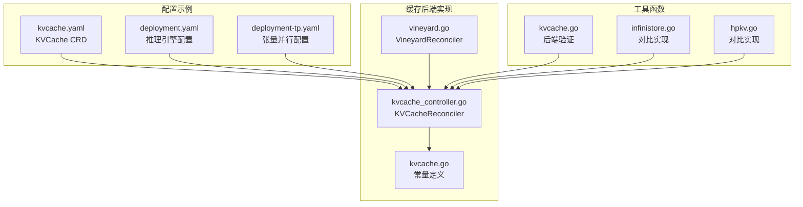

**图表来源**
- [vineyard.go:1-429](file://pkg/controller/kvcache/backends/vineyard.go#L1-L429)
- [kvcache_controller.go:1-194](file://pkg/controller/kvcache/kvcache_controller.go#L1-L194)

**章节来源**
- [vineyard.go:1-429](file://pkg/controller/kvcache/backends/vineyard.go#L1-L429)
- [kvcache_controller.go:1-194](file://pkg/controller/kvcache/kvcache_controller.go#L1-L194)

## 核心组件

### VineyardReconciler控制器

VineyardReconciler是Vineyard缓存后端的核心控制器，负责协调和管理Vineyard缓存实例的完整生命周期。

**关键特性：**
- 自动化部署管理：根据KVCache资源规范自动生成和管理Vineyard实例
- 元数据服务集成：支持Etcd等元数据服务的自动部署和配置
- 资源亲和性管理：智能的节点亲和性和反亲和性调度策略
- 健康检查机制：完善的就绪探针和存活探针配置

### KVCacheReconciler主控制器

KVCacheReconciler作为统一的入口点，根据后端类型分发到相应的具体实现：

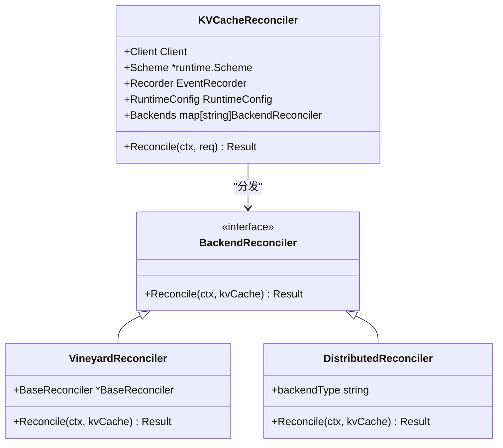

**图表来源**
- [kvcache_controller.go:134-194](file://pkg/controller/kvcache/kvcache_controller.go#L134-L194)
- [vineyard.go:35-41](file://pkg/controller/kvcache/backends/vineyard.go#L35-L41)

**章节来源**
- [kvcache_controller.go:61-75](file://pkg/controller/kvcache/kvcache_controller.go#L61-L75)
- [kvcache_controller.go:134-194](file://pkg/controller/kvcache/kvcache_controller.go#L134-L194)

## 架构概览

Vineyard缓存后端采用集中式架构设计，通过以下核心组件实现完整的缓存服务：

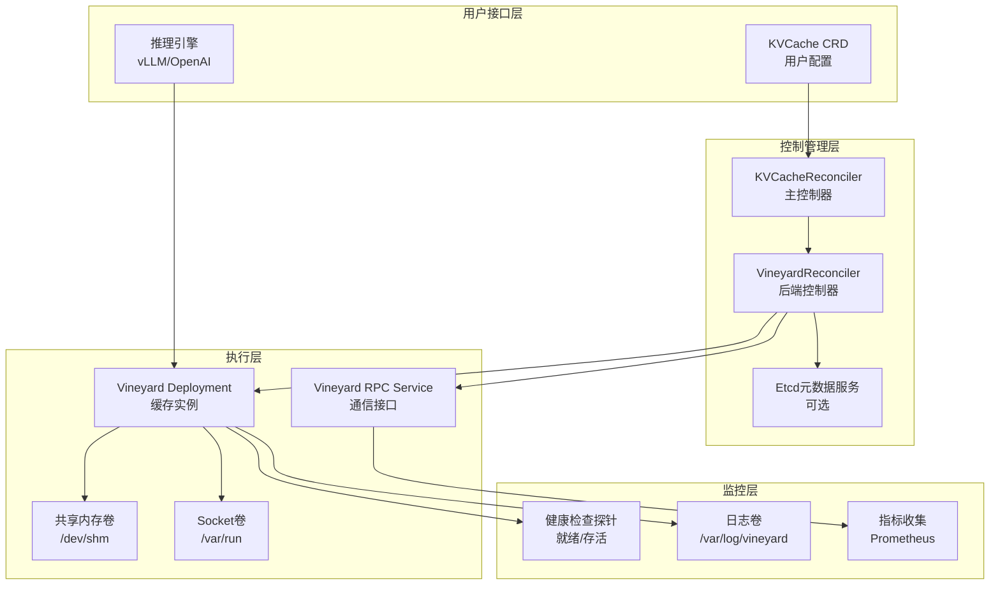

**图表来源**
- [vineyard.go:219-429](file://pkg/controller/kvcache/backends/vineyard.go#L219-L429)
- [kvcache_controller.go:160-181](file://pkg/controller/kvcache/kvcache_controller.go#L160-L181)

### 数据流处理

Vineyard缓存后端的数据处理流程如下：

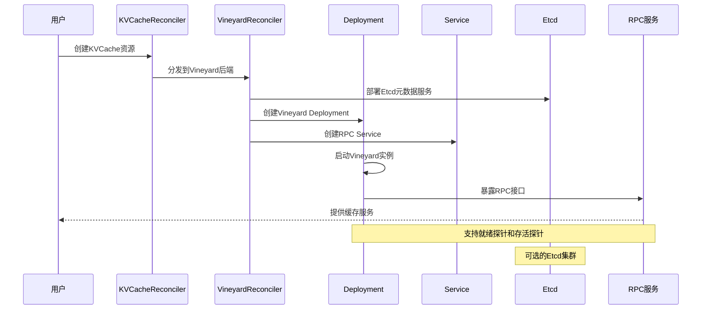

**图表来源**
- [vineyard.go:43-65](file://pkg/controller/kvcache/backends/vineyard.go#L43-L65)
- [vineyard.go:79-108](file://pkg/controller/kvcache/backends/vineyard.go#L79-L108)

## 详细组件分析

### 部署配置管理

Vineyard缓存后端的部署配置包含多个关键组件：

#### Deployment配置

Deployment负责管理Vineyard缓存实例的副本数量和容器配置：

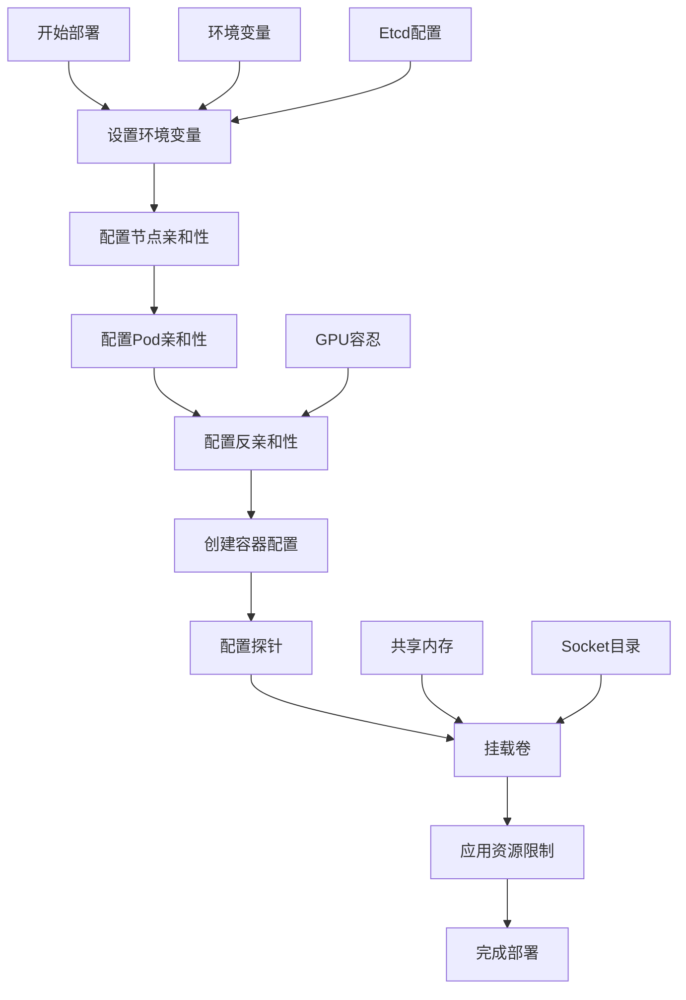

**图表来源**
- [vineyard.go:219-402](file://pkg/controller/kvcache/backends/vineyard.go#L219-L402)

#### 服务配置

RPC服务提供缓存实例的网络访问接口：

| 服务属性 | 配置值 | 说明 |
|---------|--------|------|
| 服务名称 | `{kvCache.Name}-rpc` | 动态生成的服务名 |
| 端口 | 9600 | Vineyard RPC默认端口 |
| 协议 | TCP | 传输协议 |
| 类型 | ClusterIP | Kubernetes服务类型 |

**章节来源**
- [vineyard.go:404-429](file://pkg/controller/kvcache/backends/vineyard.go#L404-L429)

### 元数据服务集成

Vineyard缓存后端支持可选的Etcd元数据服务集成：

#### Etcd部署策略

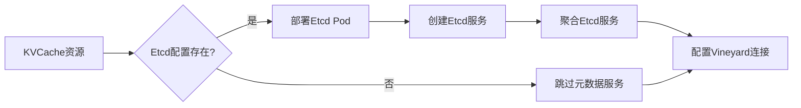

**图表来源**
- [vineyard.go:67-108](file://pkg/controller/kvcache/backends/vineyard.go#L67-L108)

#### Etcd配置参数

| 参数 | 默认值 | 说明 |
|------|--------|------|
| 客户端端口 | 2379 | Etcd客户端连接端口 |
| 服务器端口 | 2380 | Etcd节点间通信端口 |
| 初始集群状态 | new | 新集群初始化状态 |
| 存储路径 | /var/lib/etcd | 数据存储目录 |

**章节来源**
- [vineyard.go:110-160](file://pkg/controller/kvcache/backends/vineyard.go#L110-L160)

### 资源调度策略

Vineyard缓存后端实现了多层次的资源调度策略：

#### 节点亲和性

支持基于GPU类型的节点亲和性配置：

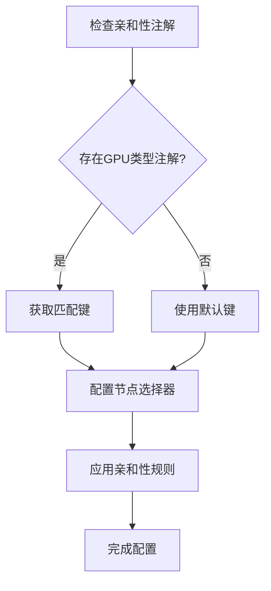

**图表来源**
- [vineyard.go:235-257](file://pkg/controller/kvcache/backends/vineyard.go#L235-L257)

#### Pod亲和性与反亲和性

支持与特定工作负载的亲和性和反亲和性配置：

| 类型 | 触发条件 | 行为 |
|------|----------|------|
| 亲和性 | 匹配指定标签 | 优先调度到相同主机 |
| 反亲和性 | 匹配缓存角色 | 避免调度到同一主机 |

**章节来源**
- [vineyard.go:259-294](file://pkg/controller/kvcache/backends/vineyard.go#L259-L294)

## 依赖关系分析

### 后端实现对比

Vineyard缓存后端与其他缓存后端的实现对比：

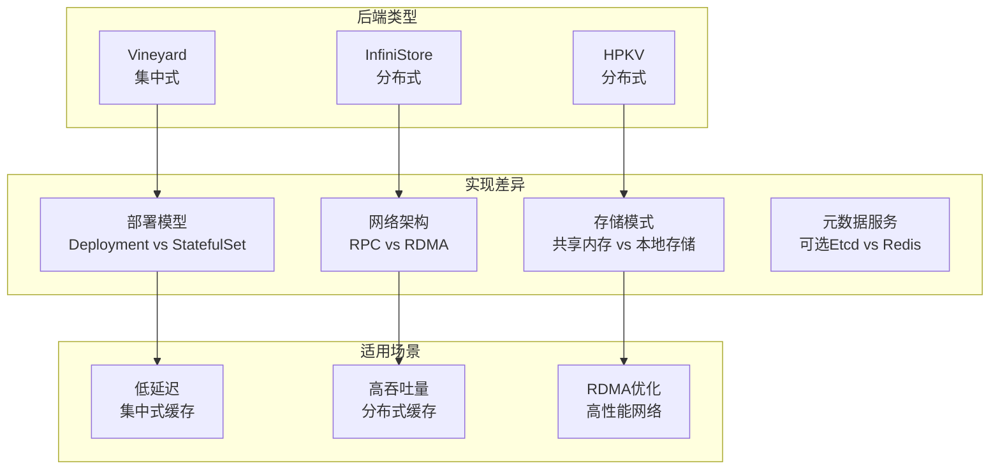

**图表来源**
- [infinistore.go:186-364](file://pkg/controller/kvcache/backends/infinistore.go#L186-L364)
- [hpkv.go:191-377](file://pkg/controller/kvcache/backends/hpkv.go#L191-L377)

### 组件耦合度分析

Vineyard缓存后端的组件关系：

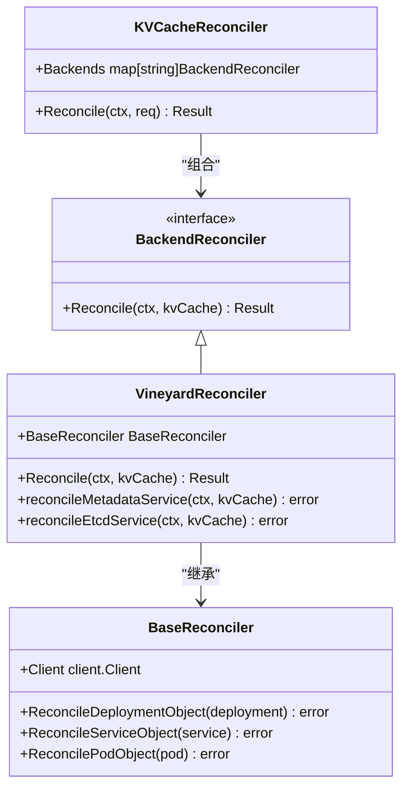

**图表来源**
- [kvcache_controller.go:134-194](file://pkg/controller/kvcache/kvcache_controller.go#L134-L194)
- [vineyard.go:35-41](file://pkg/controller/kvcache/backends/vineyard.go#L35-L41)

**章节来源**
- [kvcache_controller.go:61-75](file://pkg/controller/kvcache/kvcache_controller.go#L61-L75)
- [vineyard.go:1-429](file://pkg/controller/kvcache/backends/vineyard.go#L1-L429)

## 性能考虑

### 内存管理策略

Vineyard缓存后端采用高效的内存管理策略：

#### 共享内存配置

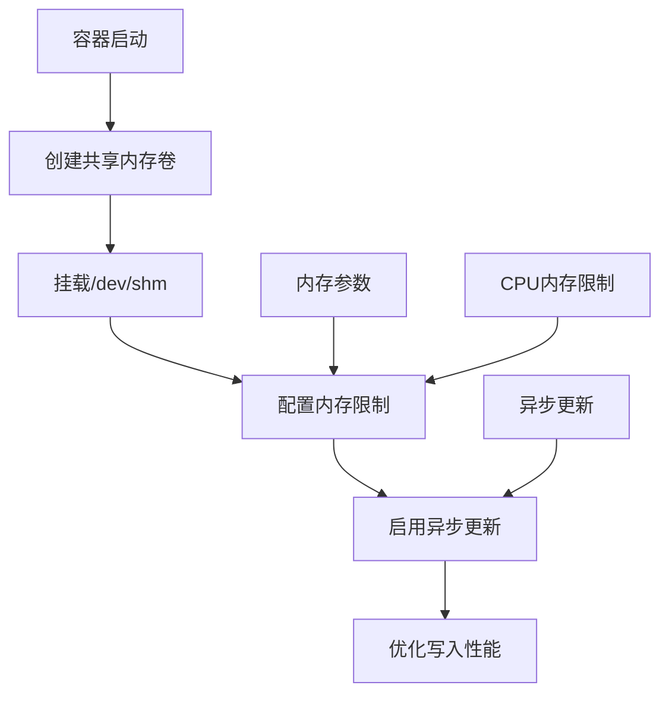

**图表来源**
- [deployment.yaml:61-73](file://samples/kvcache/vineyard/deployment.yaml#L61-L73)

#### 缓存参数调优

| 参数 | 默认值 | 说明 |
|------|--------|------|
| CPU内存限制 | 10GB | CPU侧缓存大小 |
| 异步更新 | 启用 | 异步数据更新 |
| 分块大小 | 16 | 缓存分块大小 |
| Socket路径 | /var/run/vineyard.sock | 通信套接字 |

**章节来源**
- [deployment.yaml:42-60](file://samples/kvcache/vineyard/deployment.yaml#L42-L60)

### 扩展性设计

Vineyard缓存后端支持水平扩展和垂直扩展：

#### 副本管理

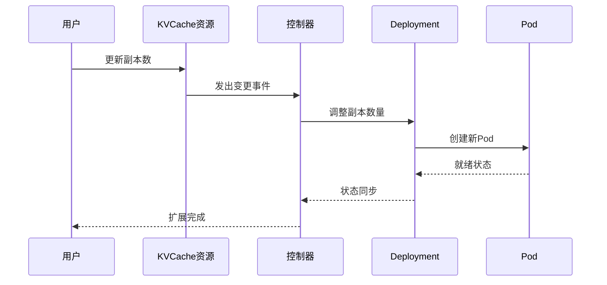

**图表来源**
- [kvcache.yaml:8-27](file://samples/kvcache/vineyard/kvcache.yaml#L8-L27)

## 故障排除指南

### 常见问题诊断

#### 部署失败排查

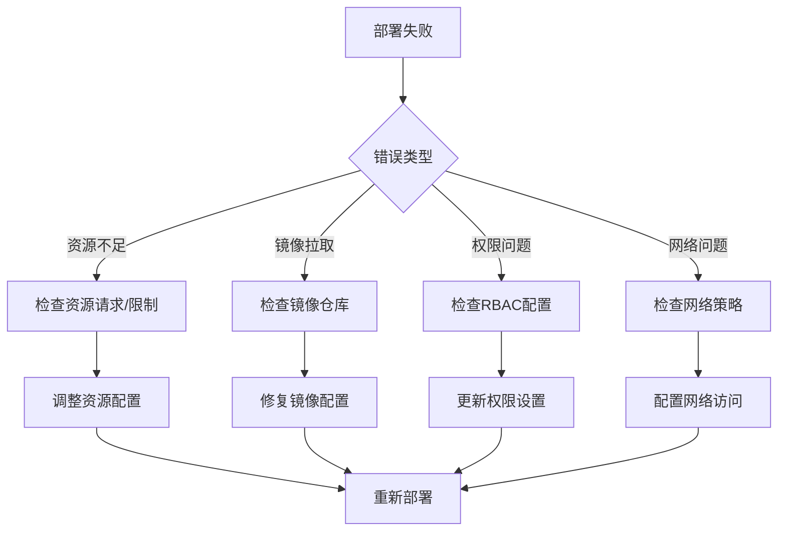

#### 健康检查失败

| 探针类型 | 检查内容 | 解决方案 |
|----------|----------|----------|
| 就绪探针 | 检查socket文件 | 确认Vineyard进程启动 |
| 存活探针 | 检查RPC端口 | 验证服务监听状态 |
| 资源探针 | 检查内存使用 | 调整内存限制 |

**章节来源**
- [vineyard.go:340-357](file://pkg/controller/kvcache/backends/vineyard.go#L340-L357)

### 监控指标收集

Vineyard缓存后端支持完整的监控指标收集：

#### Prometheus集成

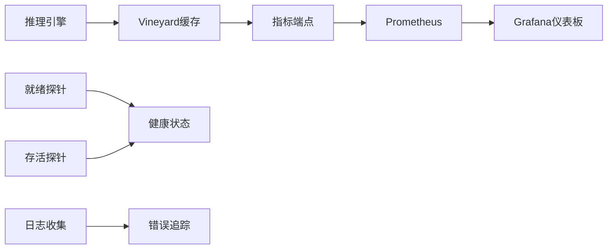

**图表来源**
- [deployment.yaml:82-90](file://samples/kvcache/vineyard/deployment.yaml#L82-L90)

## 结论

Vineyard缓存后端作为AIBrix项目的重要组成部分，提供了高性能、可扩展的KV缓存解决方案。其核心优势包括：

### 技术优势

1. **集中式架构**：简化了部署和管理复杂度
2. **高效内存利用**：通过共享内存和优化的缓存策略
3. **完整的生命周期管理**：从部署到监控的全栈支持
4. **灵活的调度策略**：支持多种亲和性和反亲和性配置

### 局限性分析

1. **扩展性限制**：集中式架构在超大规模场景下的扩展能力有限
2. **单点故障风险**：需要考虑缓存实例的高可用性设计
3. **资源竞争**：多工作负载共享缓存时的资源分配问题

### 最佳实践建议

1. **合理配置资源**：根据工作负载特点调整内存和CPU配置
2. **监控告警**：建立完善的监控体系和告警机制
3. **容量规划**：基于历史数据进行容量预测和规划
4. **备份策略**：制定数据备份和恢复计划

## 附录

### 部署配置示例

#### 基础部署配置

```yaml
apiVersion: orchestration.aibrix.ai/v1alpha1
kind: KVCache
metadata:
  name: my-vineyard-cache
  annotations:
    kvcache.orchestration.aibrix.ai/pod-affinity-workload: my-model
spec:
  mode: centralized
  service:
    type: ClusterIP
    ports:
      - name: service
        port: 9600
        targetPort: 9600
        protocol: TCP
  cache:
    image: aibrix/vineyardd:latest
    replicas: 1
    resources:
      requests:
        cpu: "1000m"
        memory: "2Gi"
      limits:
        cpu: "2000m"
        memory: "4Gi"
```

#### 推理引擎集成配置

```yaml
env:
  - name: VLLM_USE_VINEYARD_CACHE
    value: "1"
  - name: VINEYARD_CACHE_CPU_MEM_LIMIT_GB
    value: "10"
  - name: AIBRIX_LLM_KV_CACHE
    value: "1"
  - name: AIBRIX_LLM_KV_CACHE_RPC_ENDPOINT
    value: "my-vineyard-cache-rpc:9600"
  - name: VINEYARD_CACHE_METRICS_ENABLED
    value: "1"
volumeMounts:
  - mountPath: /var/run
    name: kvcache-socket
volumes:
  - name: kvcache-socket
    hostPath:
      path: /var/run/vineyard-kubernetes/default/my-vineyard-cache
```

**章节来源**
- [kvcache.yaml:1-27](file://samples/kvcache/vineyard/kvcache.yaml#L1-L27)
- [deployment.yaml:42-73](file://samples/kvcache/vineyard/deployment.yaml#L42-L73)