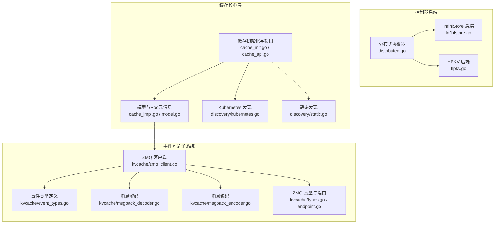
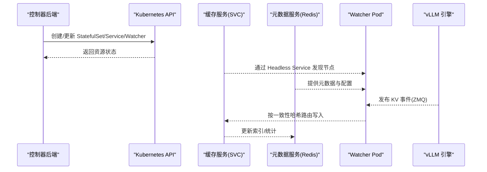
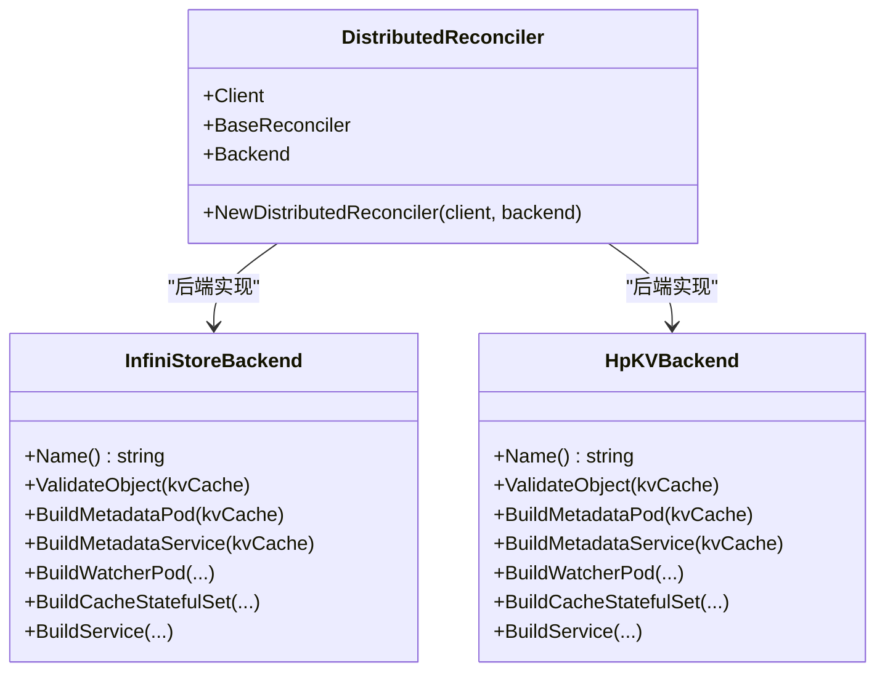
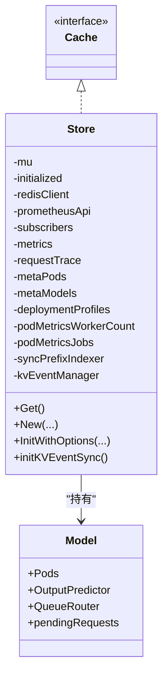
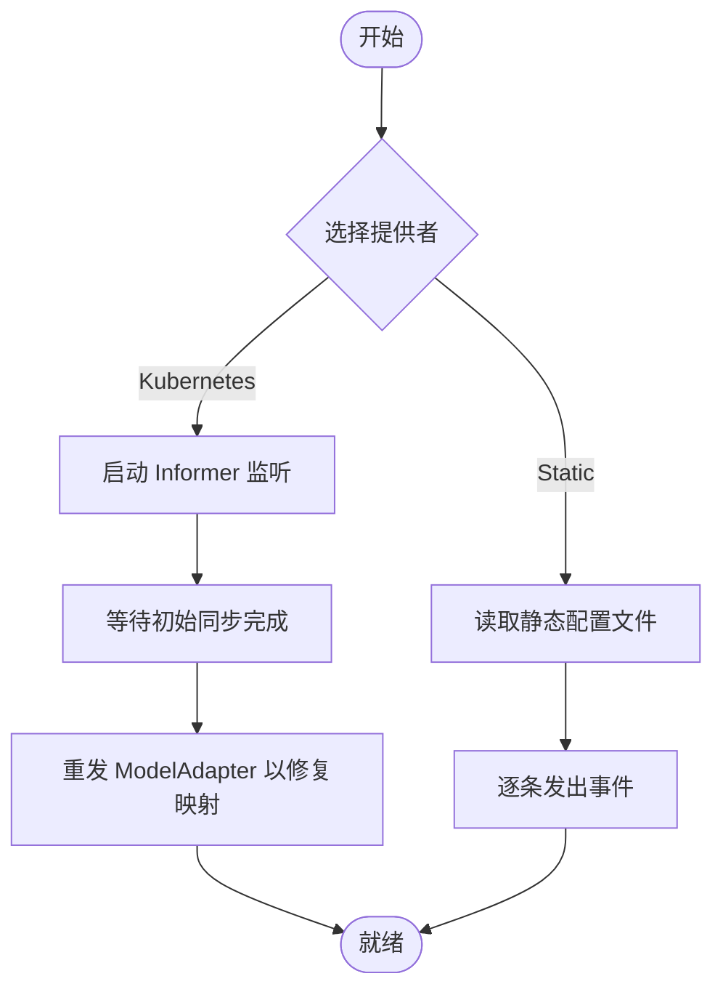
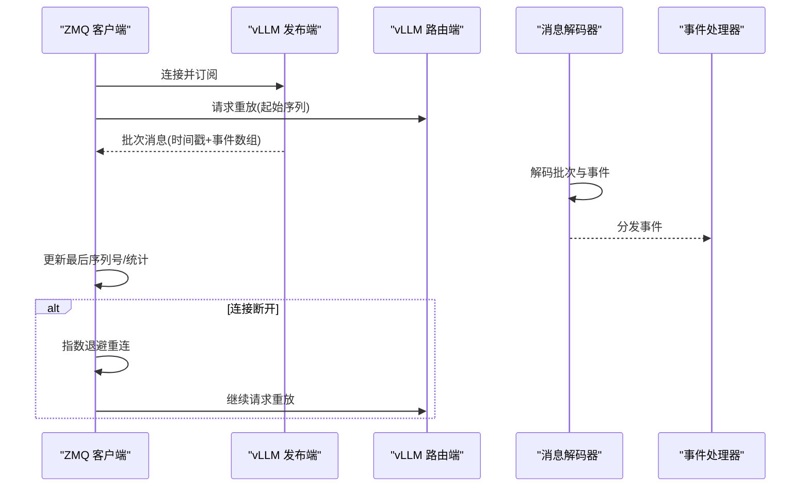
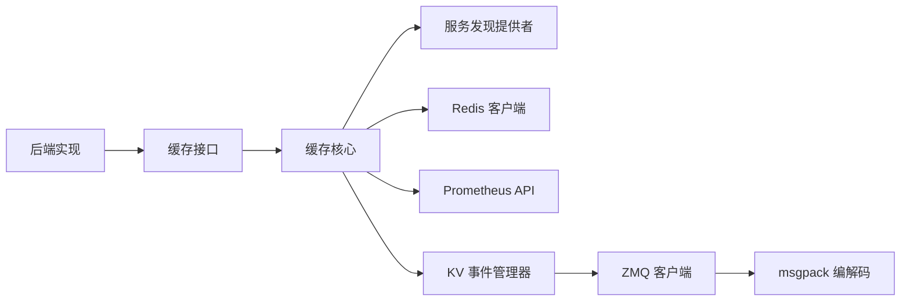

# 分布式缓存后端

<cite>
**本文引用的文件**
- [pkg/controller/kvcache/backends/distributed.go](file://pkg/controller/kvcache/backends/distributed.go)
- [pkg/controller/kvcache/backends/infinistore.go](file://pkg/controller/kvcache/backends/infinistore.go)
- [pkg/controller/kvcache/backends/hpkv.go](file://pkg/controller/kvcache/backends/hpkv.go)
- [pkg/cache/cache_init.go](file://pkg/cache/cache_init.go)
- [pkg/cache/cache_api.go](file://pkg/cache/cache_api.go)
- [pkg/cache/cache_impl.go](file://pkg/cache/cache_impl.go)
- [pkg/cache/model.go](file://pkg/cache/model.go)
- [pkg/cache/discovery/kubernetes.go](file://pkg/cache/discovery/kubernetes.go)
- [pkg/cache/discovery/static.go](file://pkg/cache/discovery/static.go)
- [pkg/cache/kvcache/zmq_client.go](file://pkg/cache/kvcache/zmq_client.go)
- [pkg/cache/kvcache/event_types.go](file://pkg/cache/kvcache/event_types.go)
- [pkg/cache/kvcache/msgpack_decoder.go](file://pkg/cache/kvcache/msgpack_decoder.go)
- [pkg/cache/kvcache/msgpack_encoder.go](file://pkg/cache/kvcache/msgpack_encoder.go)
- [pkg/cache/kvcache/types.go](file://pkg/cache/kvcache/types.go)
- [pkg/cache/kvcache/endpoint.go](file://pkg/cache/kvcache/endpoint.go)
</cite>

## 目录
1. [简介](#简介)
2. [项目结构](#项目结构)
3. [核心组件](#核心组件)
4. [架构总览](#架构总览)
5. [详细组件分析](#详细组件分析)
6. [依赖分析](#依赖分析)
7. [性能考虑](#性能考虑)
8. [故障排查指南](#故障排查指南)
9. [结论](#结论)
10. [附录](#附录)

## 简介
本技术文档面向分布式缓存后端，系统性阐述其设计理念、实现架构与关键能力，覆盖以下主题：
- 分布式一致性与可用性：通过元数据存储（Redis）与事件同步机制保障跨节点的一致性与可观测性
- 数据分片与路由：基于一致性哈希的分片策略与节点映射，支持 RDMA 网络加速
- 节点发现与动态编排：Kubernetes Informer 与静态配置两种模式，支持独立开发环境
- 故障转移与自愈：ZMQ 事件重放、指数退避重连、序列号校验与丢包告警
- 配置与运维：后端选择、参数化部署、监控指标与健康检查
- 性能优化：批处理解码、异步度量更新、限流与背压

## 项目结构
分布式缓存后端由“控制器后端”“缓存核心层”“事件同步子系统”三部分组成，并通过服务发现与元数据存储协同工作。

**图表来源**
- [pkg/controller/kvcache/backends/distributed.go:31-51](file://pkg/controller/kvcache/backends/distributed.go#L31-L51)
- [pkg/controller/kvcache/backends/infinistore.go:58-100](file://pkg/controller/kvcache/backends/infinistore.go#L58-L100)
- [pkg/controller/kvcache/backends/hpkv.go:62-104](file://pkg/controller/kvcache/backends/hpkv.go#L62-L104)
- [pkg/cache/cache_init.go:71-122](file://pkg/cache/cache_init.go#L71-L122)
- [pkg/cache/cache_api.go:25-35](file://pkg/cache/cache_api.go#L25-L35)
- [pkg/cache/cache_impl.go:30-88](file://pkg/cache/cache_impl.go#L30-L88)
- [pkg/cache/model.go:27-42](file://pkg/cache/model.go#L27-L42)
- [pkg/cache/discovery/kubernetes.go:34-47](file://pkg/cache/discovery/kubernetes.go#L34-L47)
- [pkg/cache/discovery/static.go:66-82](file://pkg/cache/discovery/static.go#L66-L82)
- [pkg/cache/kvcache/zmq_client.go:30-55](file://pkg/cache/kvcache/zmq_client.go#L30-L55)
- [pkg/cache/kvcache/event_types.go:45-73](file://pkg/cache/kvcache/event_types.go#L45-L73)
- [pkg/cache/kvcache/msgpack_decoder.go:27-86](file://pkg/cache/kvcache/msgpack_decoder.go#L27-L86)
- [pkg/cache/kvcache/msgpack_encoder.go:24-53](file://pkg/cache/kvcache/msgpack_encoder.go#L24-L53)
- [pkg/cache/kvcache/types.go:28-38](file://pkg/cache/kvcache/types.go#L28-L38)
- [pkg/cache/kvcache/endpoint.go:23-49](file://pkg/cache/kvcache/endpoint.go#L23-L49)

**章节来源**
- [pkg/controller/kvcache/backends/distributed.go:17-51](file://pkg/controller/kvcache/backends/distributed.go#L17-L51)
- [pkg/cache/cache_init.go:47-122](file://pkg/cache/cache_init.go#L47-L122)

## 核心组件
- 分布式协调器：根据后端类型（InfiniStore/HPKV）构建缓存实例与配套资源（StatefulSet、Headless Service、Watcher Pod）
- 缓存核心层：统一缓存接口、并发安全的数据结构、指标聚合与请求追踪；支持服务发现与静态配置
- 事件同步子系统：基于 ZeroMQ 的发布/订阅与重放机制，按批次解码 vLLM KV 事件，维护序列号与丢包统计

**章节来源**
- [pkg/controller/kvcache/backends/distributed.go:31-51](file://pkg/controller/kvcache/backends/distributed.go#L31-L51)
- [pkg/cache/cache_api.go:25-35](file://pkg/cache/cache_api.go#L25-L35)
- [pkg/cache/cache_init.go:71-122](file://pkg/cache/cache_init.go#L71-L122)
- [pkg/cache/kvcache/zmq_client.go:30-55](file://pkg/cache/kvcache/zmq_client.go#L30-L55)

## 架构总览
分布式缓存后端采用“控制器驱动 + 缓存核心 + 事件同步”的三层架构：
- 控制器后端负责生成缓存服务与元数据服务（Redis）的 Kubernetes 清单，并注入一致性哈希与 RDMA 参数
- 缓存核心层在运行时通过服务发现获取 Pod 与模型信息，周期性拉取指标并维护请求追踪
- 事件同步子系统从 vLLM 引擎订阅 KV 事件，进行批处理解码与事件分发，确保跨节点一致

**图表来源**
- [pkg/controller/kvcache/backends/infinistore.go:186-364](file://pkg/controller/kvcache/backends/infinistore.go#L186-L364)
- [pkg/controller/kvcache/backends/hpkv.go:191-377](file://pkg/controller/kvcache/backends/hpkv.go#L191-L377)
- [pkg/cache/discovery/kubernetes.go:52-126](file://pkg/cache/discovery/kubernetes.go#L52-L126)
- [pkg/cache/kvcache/zmq_client.go:142-160](file://pkg/cache/kvcache/zmq_client.go#L142-L160)

## 详细组件分析

### 分布式协调器与后端实现
- 分布式协调器根据后端类型选择具体实现：InfiniStore 或 HPKV
- 后端负责：
  - 构建元数据服务（Redis）与 Headless Service
  - 构建缓存 StatefulSet，注入 RDMA 端口、管理端口、一致性哈希参数
  - 构建 Watcher Pod，连接 Redis 并监听缓存事件
- 参数化配置：
  - InfiniStore：RDMA 端口、管理端口、链路类型、总槽位数、虚拟节点数、GID 索引
  - HPKV：RDMA 端口、管理端口、块大小、块数量、总槽位数、虚拟节点数

**图表来源**
- [pkg/controller/kvcache/backends/distributed.go:31-51](file://pkg/controller/kvcache/backends/distributed.go#L31-L51)
- [pkg/controller/kvcache/backends/infinistore.go:58-100](file://pkg/controller/kvcache/backends/infinistore.go#L58-L100)
- [pkg/controller/kvcache/backends/hpkv.go:62-104](file://pkg/controller/kvcache/backends/hpkv.go#L62-L104)

**章节来源**
- [pkg/controller/kvcache/backends/distributed.go:37-51](file://pkg/controller/kvcache/backends/distributed.go#L37-L51)
- [pkg/controller/kvcache/backends/infinistore.go:101-184](file://pkg/controller/kvcache/backends/infinistore.go#L101-L184)
- [pkg/controller/kvcache/backends/hpkv.go:93-189](file://pkg/controller/kvcache/backends/hpkv.go#L93-L189)

### 缓存核心层：接口、数据结构与初始化
- 接口抽象：统一的缓存接口聚合了 Pod/模型/指标/请求追踪/配置缓存与路由器提供者
- 数据结构：并发安全的映射（SyncMap）、模型与 Pod 元信息、输出预测器、队列路由器、待处理请求数
- 初始化流程：根据服务角色启用/禁用追踪与配置缓存；注册服务发现提供者；启动指标与配置缓存更新循环；可选启用 KV 事件同步

**图表来源**
- [pkg/cache/cache_api.go:25-35](file://pkg/cache/cache_api.go#L25-L35)
- [pkg/cache/cache_init.go:71-122](file://pkg/cache/cache_init.go#L71-L122)
- [pkg/cache/model.go:27-42](file://pkg/cache/model.go#L27-L42)

**章节来源**
- [pkg/cache/cache_api.go:25-170](file://pkg/cache/cache_api.go#L25-L170)
- [pkg/cache/cache_init.go:124-376](file://pkg/cache/cache_init.go#L124-L376)
- [pkg/cache/cache_impl.go:30-355](file://pkg/cache/cache_impl.go#L30-L355)
- [pkg/cache/model.go:27-42](file://pkg/cache/model.go#L27-L42)

### 服务发现与静态配置
- Kubernetes 发现：通过 Informer 监听 Pod 与 ModelAdapter 变更，初始列表完成后进行一次适配器重放以修复映射顺序
- 静态发现：加载本地 YAML 配置，将地址转换为合成 Pod，用于独立/开发模式

**图表来源**
- [pkg/cache/discovery/kubernetes.go:52-126](file://pkg/cache/discovery/kubernetes.go#L52-L126)
- [pkg/cache/discovery/static.go:84-160](file://pkg/cache/discovery/static.go#L84-L160)

**章节来源**
- [pkg/cache/discovery/kubernetes.go:34-129](file://pkg/cache/discovery/kubernetes.go#L34-L129)
- [pkg/cache/discovery/static.go:66-237](file://pkg/cache/discovery/static.go#L66-L237)

### 事件同步子系统：ZMQ 客户端与消息编解码
- ZMQ 客户端：SUB 订阅发布端口，DEALER 与 ROUTER 交互请求重放；支持 IPv6、指数退避重连、序列号校验与丢包统计
- 事件类型：BlockStored、BlockRemoved、AllBlocksCleared；批次包含时间戳与事件数组
- 编解码：使用 msgpack 解析 vLLM 事件，支持新旧块哈希格式与 tokenID 编解码

**图表来源**
- [pkg/cache/kvcache/zmq_client.go:72-160](file://pkg/cache/kvcache/zmq_client.go#L72-L160)
- [pkg/cache/kvcache/zmq_client.go:197-255](file://pkg/cache/kvcache/zmq_client.go#L197-L255)
- [pkg/cache/kvcache/msgpack_decoder.go:27-86](file://pkg/cache/kvcache/msgpack_decoder.go#L27-L86)
- [pkg/cache/kvcache/event_types.go:164-178](file://pkg/cache/kvcache/event_types.go#L164-L178)

**章节来源**
- [pkg/cache/kvcache/zmq_client.go:30-426](file://pkg/cache/kvcache/zmq_client.go#L30-L426)
- [pkg/cache/kvcache/event_types.go:45-178](file://pkg/cache/kvcache/event_types.go#L45-L178)
- [pkg/cache/kvcache/msgpack_decoder.go:27-578](file://pkg/cache/kvcache/msgpack_decoder.go#L27-L578)
- [pkg/cache/kvcache/msgpack_encoder.go:24-110](file://pkg/cache/kvcache/msgpack_encoder.go#L24-L110)
- [pkg/cache/kvcache/types.go:28-93](file://pkg/cache/kvcache/types.go#L28-L93)
- [pkg/cache/kvcache/endpoint.go:23-49](file://pkg/cache/kvcache/endpoint.go#L23-L49)

## 依赖分析
- 控制器后端对缓存接口与常量的依赖清晰，通过后端接口屏蔽具体实现差异
- 缓存核心层依赖服务发现提供者、Redis 客户端、Prometheus API 与 KV 事件管理器
- 事件同步子系统依赖 ZeroMQ 库与 msgpack 编解码器

**图表来源**
- [pkg/controller/kvcache/backends/distributed.go:31-51](file://pkg/controller/kvcache/backends/distributed.go#L31-L51)
- [pkg/cache/cache_init.go:71-122](file://pkg/cache/cache_init.go#L71-L122)
- [pkg/cache/kvcache/zmq_client.go:30-55](file://pkg/cache/kvcache/zmq_client.go#L30-L55)
- [pkg/cache/kvcache/msgpack_decoder.go:27-86](file://pkg/cache/kvcache/msgpack_decoder.go#L27-L86)

**章节来源**
- [pkg/cache/cache_init.go:19-40](file://pkg/cache/cache_init.go#L19-L40)
- [pkg/cache/kvcache/zmq_client.go:19-28](file://pkg/cache/kvcache/zmq_client.go#L19-L28)

## 性能考虑
- 批处理与异步更新：事件解码与指标查询采用批处理与异步通道，避免阻塞主路径
- 并发与锁：使用读写锁与并发安全映射，降低锁竞争
- 指标与追踪：定期刷新指标与请求追踪，支持可配置窗口与落盘策略
- 网络与序列化：ZeroMQ 双栈支持 IPv6，msgpack 高效编码 KV 事件，减少序列化开销

[本节为通用性能指导，不直接分析具体文件]

## 故障排查指南
- 事件丢失与重连
  - 现象：日志提示丢弃事件或错过事件
  - 处理：检查 ZMQ 客户端是否处于断线状态，确认指数退避重连是否生效，核对序列号与重放请求
- 连接失败
  - 现象：无法连接到 vLLM 发布端或路由端
  - 处理：验证 IP 地址与端口配置，确认 IPv6 支持与防火墙策略
- 编解码错误
  - 现象：解码事件失败或字段类型不匹配
  - 处理：检查 vLLM 版本与事件格式兼容性，确认块哈希与 tokenID 编码规则
- 服务发现异常
  - 现象：Pod/模型映射缺失或顺序错乱
  - 处理：确认 Informer 是否完成初始同步，必要时触发适配器重发

**章节来源**
- [pkg/cache/kvcache/zmq_client.go:222-255](file://pkg/cache/kvcache/zmq_client.go#L222-L255)
- [pkg/cache/kvcache/zmq_client.go:338-367](file://pkg/cache/kvcache/zmq_client.go#L338-L367)
- [pkg/cache/discovery/kubernetes.go:112-121](file://pkg/cache/discovery/kubernetes.go#L112-L121)
- [pkg/cache/kvcache/msgpack_decoder.go:88-180](file://pkg/cache/kvcache/msgpack_decoder.go#L88-L180)

## 结论
分布式缓存后端通过“控制器驱动 + 缓存核心 + 事件同步”的架构实现了高可用、可扩展的 KV 缓存服务：
- 一致性哈希与 RDMA 参数化配置确保高效分片与低延迟通信
- 事件同步子系统提供强一致性的跨节点观测与控制面联动
- 服务发现与静态配置满足多场景部署需求
- 面向生产的重连、重放与指标体系为线上稳定运行提供保障

[本节为总结性内容，不直接分析具体文件]

## 附录

### 部署与配置要点
- 后端选择：根据 RDMA 与块管理需求选择 InfiniStore 或 HPKV
- 关键参数：
  - InfiniStore：RDMA 端口、管理端口、链路类型、总槽位数、虚拟节点数、GID 索引
  - HPKV：RDMA 端口、管理端口、块大小、块数量、总槽位数、虚拟节点数
- 服务发现：生产环境使用 Kubernetes Informer；开发/独立环境可使用静态配置
- 事件同步：启用 KV 事件同步需同时启用远程分词器与 Redis 元数据存储

**章节来源**
- [pkg/controller/kvcache/backends/infinistore.go:402-412](file://pkg/controller/kvcache/backends/infinistore.go#L402-L412)
- [pkg/controller/kvcache/backends/hpkv.go:415-424](file://pkg/controller/kvcache/backends/hpkv.go#L415-L424)
- [pkg/cache/discovery/static.go:66-82](file://pkg/cache/discovery/static.go#L66-L82)
- [pkg/cache/cache_init.go:534-546](file://pkg/cache/cache_init.go#L534-L546)