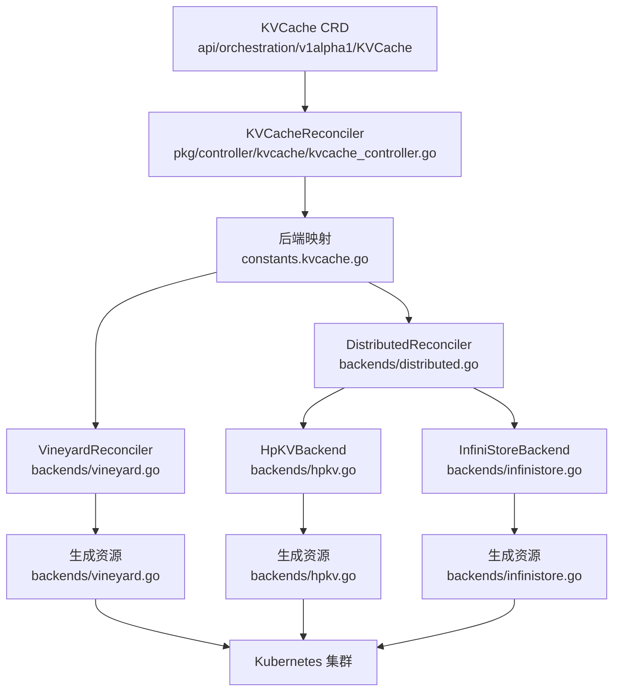
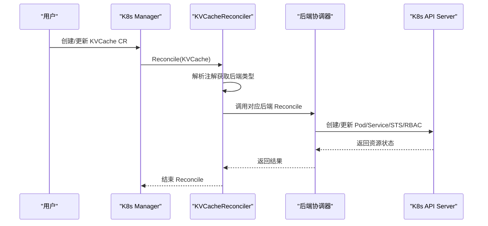
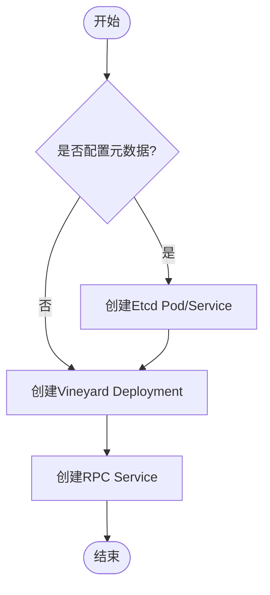
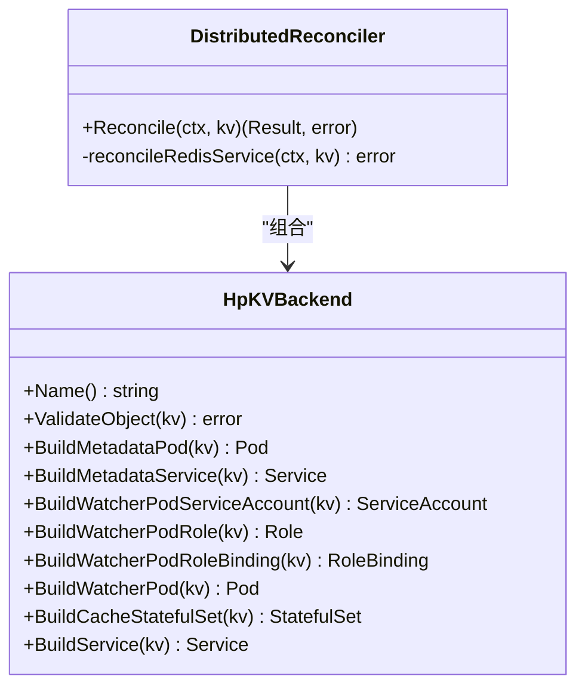
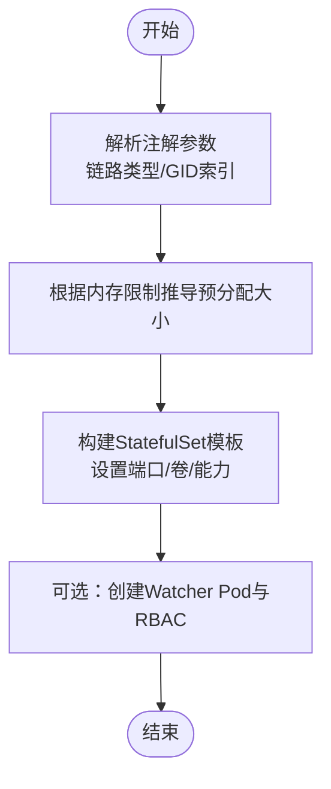
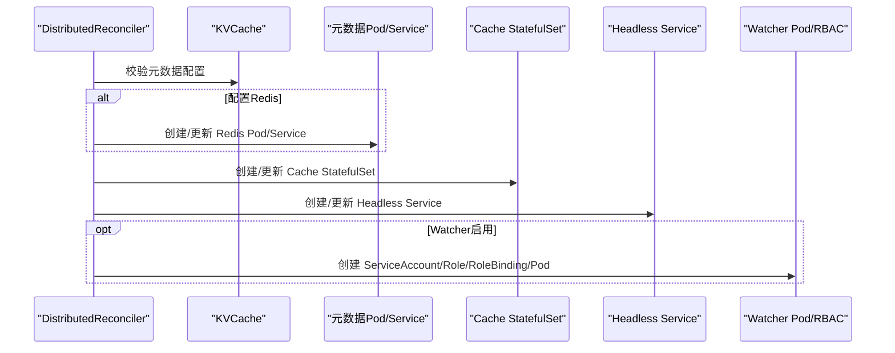
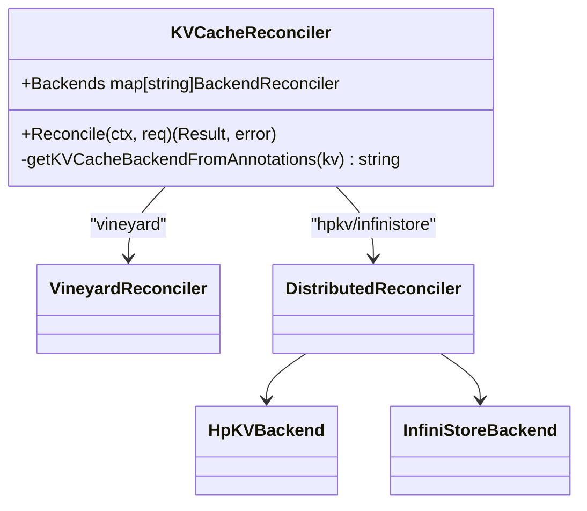
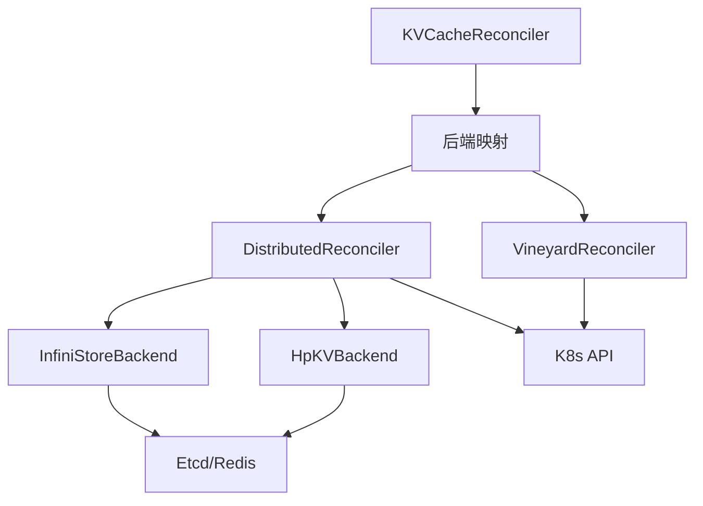

# 缓存后端实现

<cite>
**本文档引用的文件**
- [pkg/controller/kvcache/backends/reconciler.go](file://pkg/controller/kvcache/backends/reconciler.go)
- [pkg/controller/kvcache/backends/common.go](file://pkg/controller/kvcache/backends/common.go)
- [pkg/controller/kvcache/backends/vineyard.go](file://pkg/controller/kvcache/backends/vineyard.go)
- [pkg/controller/kvcache/backends/hpkv.go](file://pkg/controller/kvcache/backends/hpkv.go)
- [pkg/controller/kvcache/backends/infinistore.go](file://pkg/controller/kvcache/backends/infinistore.go)
- [pkg/controller/kvcache/backends/distributed.go](file://pkg/controller/kvcache/backends/distributed.go)
- [pkg/controller/kvcache/kvcache_controller.go](file://pkg/controller/kvcache/kvcache_controller.go)
- [pkg/constants/kvcache.go](file://pkg/constants/kvcache.go)
- [pkg/controller/kvcache/kvcache_controller_ginkgo_test.go](file://pkg/controller/kvcache/kvcache_controller_ginkgo_test.go)
- [pkg/controller/kvcache/kvcache_controller_test.go](file://pkg/controller/kvcache/kvcache_controller_test.go)
</cite>

## 目录
1. [简介](#简介)
2. [项目结构](#项目结构)
3. [核心组件](#核心组件)
4. [架构总览](#架构总览)
5. [详细组件分析](#详细组件分析)
6. [依赖关系分析](#依赖关系分析)
7. [性能考虑](#性能考虑)
8. [故障排查指南](#故障排查指南)
9. [结论](#结论)
10. [附录](#附录)

## 简介
本文件面向AIBrix缓存后端实现，系统性梳理并对比三种KV缓存后端：Vineyard、HPKV与InfiniStore。文档从架构设计、数据存储策略、访问模式、性能特征、配置方法、部署要求、监控指标到故障处理策略进行全链路说明，并给出在不同硬件与网络条件下的选型建议与迁移指南。

## 项目结构
AIBrix通过自定义资源KVCache驱动缓存后端的编排，控制器根据注解选择具体后端实现，后端再生成对应的Kubernetes资源（Deployment/StatefulSet、Service、RBAC等）。

**图表来源**
- [pkg/controller/kvcache/kvcache_controller.go:68-72](file://pkg/controller/kvcache/kvcache_controller.go#L68-L72)
- [pkg/constants/kvcache.go:39-42](file://pkg/constants/kvcache.go#L39-L42)
- [pkg/controller/kvcache/backends/vineyard.go:43-64](file://pkg/controller/kvcache/backends/vineyard.go#L43-L64)
- [pkg/controller/kvcache/backends/distributed.go:37-51](file://pkg/controller/kvcache/backends/distributed.go#L37-L51)

**章节来源**
- [pkg/controller/kvcache/kvcache_controller.go:100-131](file://pkg/controller/kvcache/kvcache_controller.go#L100-L131)
- [pkg/constants/kvcache.go:19-43](file://pkg/constants/kvcache.go#L19-L43)

## 核心组件
- 后端接口与基类
  - 接口定义了后端生命周期管理所需的方法集合，包括构建元数据、缓存服务、Watcher Pod与RBAC等。
  - 基类封装了通用的K8s对象协调逻辑（Pod/Deployment/Service/StatefulSet），减少重复代码。
- 分布式后端协调器
  - 负责根据KVCache Spec与注解，校验元数据配置，协调生成分布式缓存StatefulSet与Headless Service，并可选地创建Watcher Pod与RBAC。
- Vineyard协调器
  - 专用于Vineyard后端，支持Etcd作为元数据存储，生成Deployment与RPC Service；支持节点亲和、反亲和与GPU容忍等调度策略。
- 元数据构建工具
  - 提供Redis Pod/Service的统一构建函数，供HPKV与InfiniStore使用。

**章节来源**
- [pkg/controller/kvcache/backends/reconciler.go:35-72](file://pkg/controller/kvcache/backends/reconciler.go#L35-L72)
- [pkg/controller/kvcache/backends/distributed.go:31-51](file://pkg/controller/kvcache/backends/distributed.go#L31-L51)
- [pkg/controller/kvcache/backends/vineyard.go:35-64](file://pkg/controller/kvcache/backends/vineyard.go#L35-L64)
- [pkg/controller/kvcache/backends/common.go:30-116](file://pkg/controller/kvcache/backends/common.go#L30-L116)

## 架构总览
下图展示KVCache控制器如何根据注解选择后端，并由后端生成对应Kubernetes资源。

**图表来源**
- [pkg/controller/kvcache/kvcache_controller.go:160-181](file://pkg/controller/kvcache/kvcache_controller.go#L160-L181)
- [pkg/controller/kvcache/backends/distributed.go:53-94](file://pkg/controller/kvcache/backends/distributed.go#L53-L94)
- [pkg/controller/kvcache/backends/vineyard.go:43-64](file://pkg/controller/kvcache/backends/vineyard.go#L43-L64)

## 详细组件分析

### 组件A：Vineyard后端
- 架构设计
  - 使用Etcd作为元数据存储，Vineyard主进程通过命令行参数连接Etcd，暴露RPC端口用于上层引擎访问。
  - 支持节点亲和（按GPU类型）、Pod亲和/反亲和、GPU容忍等调度策略，确保缓存与模型在同一节点或拓扑友好环境。
- 数据存储策略
  - 采用共享内存卷与Socket通信，适合同机多进程共享数据的场景。
- 访问模式
  - 上层通过RPC端口访问Vineyard，典型用于大模型推理中的KV缓存共享。
- 性能特征
  - 低延迟、高吞吐，适合单机/同机架内共享场景；对RDMA无强依赖。
- 关键实现要点
  - Etcd Pod逐个创建并绑定独立Service，聚合Service统一对外暴露。
  - Deployment模板包含探针、卷挂载与环境变量注入。
  - 通过注解控制节点亲和键名与值，以及Pod亲和/反亲和策略。

**图表来源**
- [pkg/controller/kvcache/backends/vineyard.go:67-108](file://pkg/controller/kvcache/backends/vineyard.go#L67-L108)
- [pkg/controller/kvcache/backends/vineyard.go:219-402](file://pkg/controller/kvcache/backends/vineyard.go#L219-L402)
- [pkg/controller/kvcache/backends/vineyard.go:404-428](file://pkg/controller/kvcache/backends/vineyard.go#L404-L428)

**章节来源**
- [pkg/controller/kvcache/backends/vineyard.go:219-428](file://pkg/controller/kvcache/backends/vineyard.go#L219-L428)

### 组件B：HPKV后端
- 架构设计
  - 基于RDMA的高性能KV缓存，使用Consistent Hash分片，支持管理员端口与服务端口分离。
  - 通过Watcher Pod监控集群成员变化，结合Redis存储成员信息。
- 数据存储策略
  - 使用共享内存卷，配合RDMA网卡实现零拷贝高效传输。
- 访问模式
  - 客户端通过RDMA端口访问缓存服务；管理员端口用于健康检查与运维。
- 性能特征
  - 高带宽、低延迟，适合跨节点RDMA网络环境；需要RDMA能力与专用CNI。
- 关键实现要点
  - 参数通过注解配置（RDMA端口、管理员端口、块大小、槽位数等），默认值在代码中定义。
  - 当检测到RDMA资源时，自动注入RDMA相关CNI注解以启用RDMA网络。
  - StatefulSet模板包含特权能力与共享内存卷。

**图表来源**
- [pkg/controller/kvcache/backends/hpkv.go:62-104](file://pkg/controller/kvcache/backends/hpkv.go#L62-L104)
- [pkg/controller/kvcache/backends/distributed.go:31-51](file://pkg/controller/kvcache/backends/distributed.go#L31-L51)

**章节来源**
- [pkg/controller/kvcache/backends/hpkv.go:191-377](file://pkg/controller/kvcache/backends/hpkv.go#L191-L377)
- [pkg/controller/kvcache/backends/hpkv.go:415-424](file://pkg/controller/kvcache/backends/hpkv.go#L415-L424)

### 组件C：InfiniStore后端
- 架构设计
  - 基于RDMA的高性能KV缓存，支持指定链路类型与GID索引提示，自动推断预分配内存大小。
  - 通过Watcher Pod与Redis协作维护成员列表。
- 数据存储策略
  - 与HPKV类似，使用共享内存卷与RDMA网络，适合高性能计算场景。
- 访问模式
  - 服务端口用于业务请求，管理端口用于运维与监控。
- 性能特征
  - 面向RDMA网络优化，具备更高的吞吐与更低的CPU占用。
- 关键实现要点
  - 默认端口与参数在代码中定义，注解仅支持链路类型与GID索引；其他参数通过默认值推导。
  - 自动根据容器内存限制推导预分配内存大小（乘以0.9并向下取整）。

**图表来源**
- [pkg/controller/kvcache/backends/infinistore.go:227-363](file://pkg/controller/kvcache/backends/infinistore.go#L227-L363)
- [pkg/controller/kvcache/backends/infinistore.go:402-412](file://pkg/controller/kvcache/backends/infinistore.go#L402-L412)
- [pkg/controller/kvcache/backends/infinistore.go:414-437](file://pkg/controller/kvcache/backends/infinistore.go#L414-L437)

**章节来源**
- [pkg/controller/kvcache/backends/infinistore.go:186-400](file://pkg/controller/kvcache/backends/infinistore.go#L186-L400)
- [pkg/controller/kvcache/backends/infinistore.go:414-437](file://pkg/controller/kvcache/backends/infinistore.go#L414-L437)

### 组件D：分布式后端协调器
- 职责
  - 校验KVCache对象的元数据配置（Etcd/Redis），协调生成缓存StatefulSet与Headless Service。
  - 可选创建Watcher Pod与RBAC，用于监控缓存集群成员变化。
- 实现细节
  - 对HPKV与InfiniStore分别注入不同的参数与注解，确保RDMA网络与资源正确配置。

**图表来源**
- [pkg/controller/kvcache/backends/distributed.go:53-94](file://pkg/controller/kvcache/backends/distributed.go#L53-L94)
- [pkg/controller/kvcache/backends/common.go:30-116](file://pkg/controller/kvcache/backends/common.go#L30-L116)

**章节来源**
- [pkg/controller/kvcache/backends/distributed.go:53-127](file://pkg/controller/kvcache/backends/distributed.go#L53-L127)

### 组件E：控制器与后端映射
- 控制器根据KVCache注解选择后端，映射关系如下：
  - 注解为vineyard → VineyardReconciler
  - 注解为hpkv → DistributedReconciler + HpKVBackend
  - 注解为infinistore → DistributedReconciler + InfiniStoreBackend
- 测试覆盖
  - 单元测试验证注解解析逻辑。
  - 集成测试验证控制器对三种后端的Reconcile流程。

**图表来源**
- [pkg/controller/kvcache/kvcache_controller.go:62-74](file://pkg/controller/kvcache/kvcache_controller.go#L62-L74)
- [pkg/controller/kvcache/kvcache_controller.go:173-180](file://pkg/controller/kvcache/kvcache_controller.go#L173-L180)
- [pkg/constants/kvcache.go:39-42](file://pkg/constants/kvcache.go#L39-L42)

**章节来源**
- [pkg/controller/kvcache/kvcache_controller.go:173-193](file://pkg/controller/kvcache/kvcache_controller.go#L173-L193)
- [pkg/controller/kvcache/kvcache_controller_test.go:28-62](file://pkg/controller/kvcache/kvcache_controller_test.go#L28-L62)
- [pkg/controller/kvcache/kvcache_controller_ginkgo_test.go:140-144](file://pkg/controller/kvcache/kvcache_controller_ginkgo_test.go#L140-L144)

## 依赖关系分析
- 组件耦合
  - KVCacheReconciler与后端映射表松耦合，新增后端只需扩展映射与实现对应Backend接口。
  - DistributedReconciler与具体后端（HPKV/InfiniStore）通过组合关系解耦。
- 外部依赖
  - Kubernetes API：Pod/Service/Deployment/StatefulSet/ServiceAccount/Role/RoleBinding。
  - 元数据服务：Etcd（Vineyard）或Redis（HPKV/InfiniStore）。
  - RDMA网络：HPKV与InfiniStore依赖RDMA资源与CNI插件。

**图表来源**
- [pkg/controller/kvcache/kvcache_controller.go:68-72](file://pkg/controller/kvcache/kvcache_controller.go#L68-L72)
- [pkg/controller/kvcache/backends/distributed.go:37-51](file://pkg/controller/kvcache/backends/distributed.go#L37-L51)

**章节来源**
- [pkg/controller/kvcache/kvcache_controller.go:134-140](file://pkg/controller/kvcache/kvcache_controller.go#L134-L140)

## 性能考虑
- RDMA网络
  - HPKV与InfiniStore均需RDMA能力与专用CNI；未满足条件时无法发挥性能优势。
  - InfiniStore会根据内存限制自动推导预分配内存大小，避免过度或不足。
- 调度与亲和
  - Vineyard支持节点亲和（GPU类型）、Pod亲和/反亲和，有助于降低跨节点访问开销。
- 共享内存
  - 两类分布式后端均使用共享内存卷，减少拷贝成本，提升吞吐。
- 探针与可用性
  - Vineyard提供就绪/存活探针，保障服务可用性与快速恢复。

[本节为通用性能讨论，无需“章节来源”]

## 故障排查指南
- 后端不被识别
  - 检查KVCache注解是否设置为vineyard/hpkv/infinistore之一；控制器会据此选择后端。
- 元数据配置缺失
  - HPKV与InfiniStore要求至少配置Etcd或Redis之一；否则Reconcile失败。
- RDMA相关问题
  - 确认节点具备RDMA资源与CNI插件；若存在RDMA资源，后端会自动注入RDMA网络注解。
- 资源更新
  - 控制器仅比较镜像与副本数等关键字段，如需变更其他字段请直接修改对应K8s对象。
- 监控与日志
  - Watcher Pod与缓存服务均暴露Prometheus指标端口，便于采集与告警。

**章节来源**
- [pkg/controller/kvcache/backends/distributed.go:54-56](file://pkg/controller/kvcache/backends/distributed.go#L54-L56)
- [pkg/controller/kvcache/backends/hpkv.go:268-279](file://pkg/controller/kvcache/backends/hpkv.go#L268-L279)
- [pkg/controller/kvcache/backends/infinistore.go:260-271](file://pkg/controller/kvcache/backends/infinistore.go#L260-L271)

## 结论
AIBrix通过统一的KVCache CRD与后端接口，实现了对Vineyard、HPKV与InfiniStore三类缓存后端的标准化编排。Vineyard适合非RDMA场景与简单部署；HPKV与InfiniStore面向RDMA网络优化，具备更高性能。选择时应综合考虑硬件能力（RDMA/CPU/内存/网络）、数据规模与延迟要求，并结合调度策略与监控体系进行落地。

[本节为总结性内容，无需“章节来源”]

## 附录

### 选型建议与场景匹配
- 小规模/开发测试/非RDMA环境
  - 推荐Vineyard：部署简单、资源占用低、易调试。
- 大规模/生产/跨节点RDMA网络
  - 推荐HPKV/InfiniStore：高吞吐、低延迟；InfiniStore在特定厂商网络栈下表现更优。
- 混合场景
  - 可先用Vineyard验证流程，再在生产环境切换至HPKV/InfiniStore。

[本节为通用建议，无需“章节来源”]

### 配置方法与部署要求
- 注解与标签
  - 通过KVCache注解指定后端类型；通过标签区分角色（cache/metadata/kvwatcher）。
- 元数据服务
  - Vineyard使用Etcd；HPKV/InfiniStore使用Redis。
- RDMA网络
  - 在节点上启用RDMA资源与CNI插件；后端会自动注入网络注解。
- 资源规格
  - 根据模型与并发需求配置副本数、CPU/内存与RDMA资源；InfiniStore会基于内存限制推导预分配大小。

**章节来源**
- [pkg/constants/kvcache.go:19-43](file://pkg/constants/kvcache.go#L19-L43)
- [pkg/controller/kvcache/backends/common.go:30-116](file://pkg/controller/kvcache/backends/common.go#L30-L116)
- [pkg/controller/kvcache/backends/infinistore.go:414-437](file://pkg/controller/kvcache/backends/infinistore.go#L414-L437)

### 监控指标与可观测性
- 指标端口
  - HPKV/InfiniStore：管理端口（默认9100/8088）暴露Prometheus指标。
  - Watcher：端口8000暴露Prometheus指标。
- 采集建议
  - 使用ServiceMonitor或Prometheus Operator抓取上述端口；结合Grafana仪表盘进行可视化。

**章节来源**
- [pkg/controller/kvcache/backends/hpkv.go:167-171](file://pkg/controller/kvcache/backends/hpkv.go#L167-L171)
- [pkg/controller/kvcache/backends/infinistore.go:160-166](file://pkg/controller/kvcache/backends/infinistore.go#L160-L166)

### 迁移指南
- 从Vineyard迁移到HPKV/InfiniStore
  - 步骤：更新KVCache注解为目标后端；确认节点具备RDMA资源与CNI；调整副本数与资源配额；验证指标与延迟。
  - 注意：HPKV/InfiniStore需要Headless Service与RDMA端口，确保网络策略允许RDMA流量。
- 回滚策略
  - 将注解改回vineyard，控制器会自动回退到Etcd+Vineyard部署。

**章节来源**
- [pkg/controller/kvcache/kvcache_controller.go:173-180](file://pkg/controller/kvcache/kvcache_controller.go#L173-L180)
- [pkg/controller/kvcache/backends/distributed.go:53-94](file://pkg/controller/kvcache/backends/distributed.go#L53-L94)