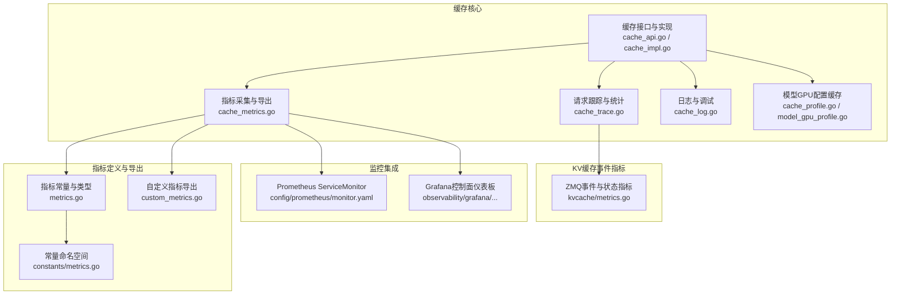
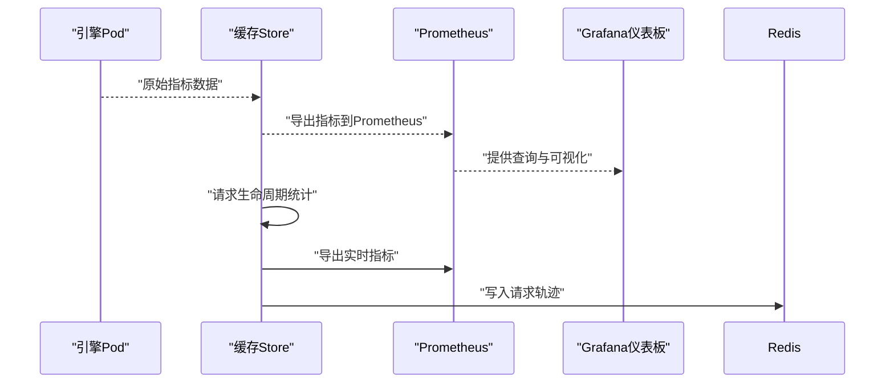
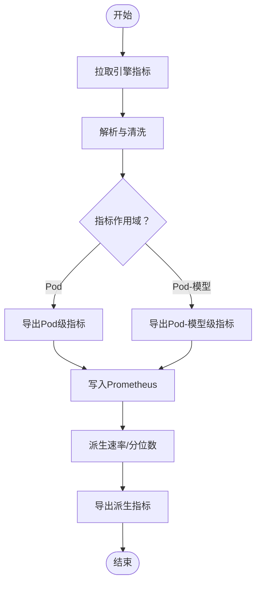
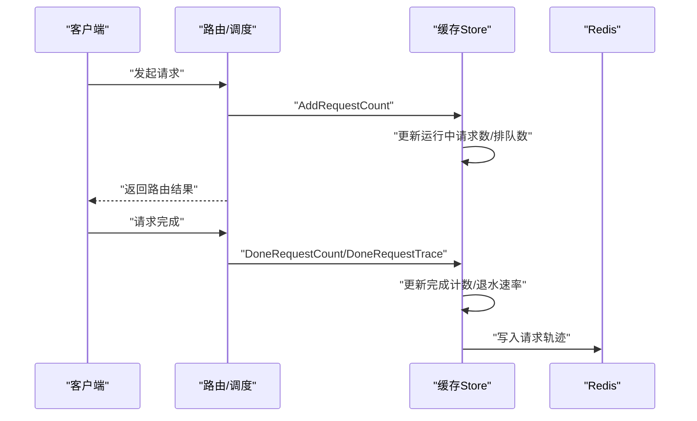
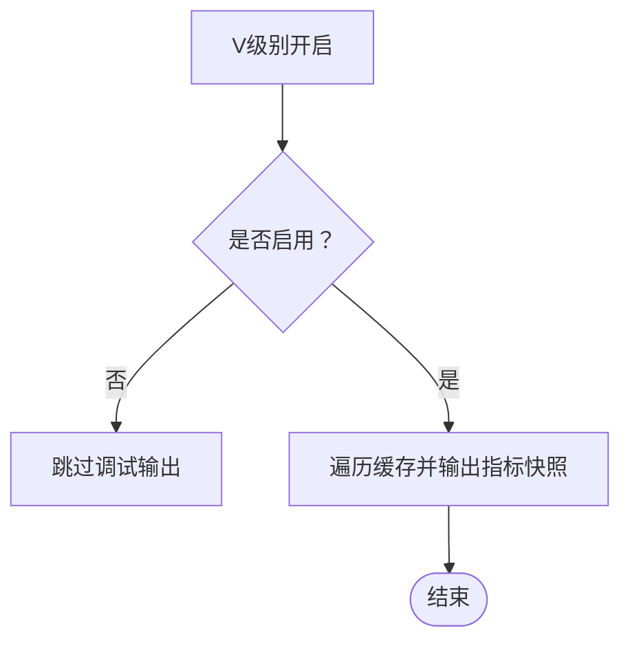
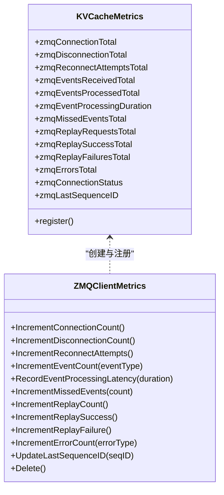
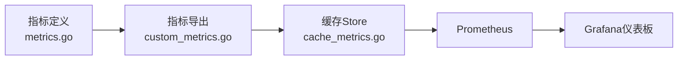

# 缓存指标与监控

<cite>
**本文档引用的文件**
- [cache_metrics.go](file://pkg/cache/cache_metrics.go)
- [cache_log.go](file://pkg/cache/cache_log.go)
- [cache_trace.go](file://pkg/cache/cache_trace.go)
- [cache_api.go](file://pkg/cache/cache_api.go)
- [cache_impl.go](file://pkg/cache/cache_impl.go)
- [metrics.go](file://pkg/metrics/metrics.go)
- [custom_metrics.go](file://pkg/metrics/custom_metrics.go)
- [metrics.go](file://pkg/constants/metrics.go)
- [metrics.go](file://pkg/cache/kvcache/metrics.go)
- [monitor.yaml](file://config/prometheus/monitor.yaml)
- [AIBrix_Control_Plane_Runtime_Dashboard.json](file://observability/grafana/AIBrix_Control_Plane_Runtime_Dashboard.json)
- [cache_profile.go](file://pkg/cache/cache_profile.go)
- [model_gpu_profile.go](file://pkg/cache/model_gpu_profile.go)
</cite>

## 目录
1. [简介](#简介)
2. [项目结构](#项目结构)
3. [核心组件](#核心组件)
4. [架构总览](#架构总览)
5. [详细组件分析](#详细组件分析)
6. [依赖关系分析](#依赖关系分析)
7. [性能考量](#性能考量)
8. [故障排查指南](#故障排查指南)
9. [结论](#结论)
10. [附录](#附录)

## 简介
本文件面向AIBrix缓存系统的指标与监控，系统性梳理缓存指标采集机制（缓存命中率、内存使用率、请求延迟等）、日志记录策略（操作日志、性能日志、错误日志）、请求跟踪与性能分析、Prometheus集成与Grafana仪表板配置，并提供监控指标解读、趋势分析与容量规划的实践方法。目标是帮助开发者与运维人员快速理解并高效使用缓存监控体系。

## 项目结构
围绕缓存指标与监控的相关代码主要分布在以下模块：
- 缓存核心：指标采集、请求跟踪、日志与调试、模型GPU配置缓存
- 指标定义与导出：指标常量、指标类型与查询定义、自定义指标导出
- KV缓存事件同步指标：ZMQ客户端与事件处理指标
- 监控集成：Prometheus ServiceMonitor配置、Grafana仪表板

**图表来源**
- [cache_api.go:25-170](file://pkg/cache/cache_api.go#L25-L170)
- [cache_impl.go:1-355](file://pkg/cache/cache_impl.go#L1-L355)
- [cache_metrics.go:1-581](file://pkg/cache/cache_metrics.go#L1-L581)
- [cache_trace.go:1-190](file://pkg/cache/cache_trace.go#L1-L190)
- [cache_log.go:1-58](file://pkg/cache/cache_log.go#L1-L58)
- [cache_profile.go:1-71](file://pkg/cache/cache_profile.go#L1-L71)
- [model_gpu_profile.go:1-197](file://pkg/cache/model_gpu_profile.go#L1-L197)
- [metrics.go:1-796](file://pkg/metrics/metrics.go#L1-L796)
- [custom_metrics.go:1-390](file://pkg/metrics/custom_metrics.go#L1-L390)
- [metrics.go:1-22](file://pkg/constants/metrics.go#L1-L22)
- [metrics.go:1-426](file://pkg/cache/kvcache/metrics.go#L1-L426)
- [monitor.yaml:1-19](file://config/prometheus/monitor.yaml#L1-L19)
- [AIBrix_Control_Plane_Runtime_Dashboard.json:1-1228](file://observability/grafana/AIBrix_Control_Plane_Runtime_Dashboard.json#L1-L1228)

**章节来源**
- [cache_api.go:25-170](file://pkg/cache/cache_api.go#L25-L170)
- [cache_metrics.go:1-581](file://pkg/cache/cache_metrics.go#L1-L581)
- [metrics.go:1-796](file://pkg/metrics/metrics.go#L1-L796)

## 核心组件
- 指标采集与导出
  - 支持原始引擎指标与PromQL查询指标两类来源，统一通过指标定义表进行映射与导出。
  - 提供速率计算与直方图分位数派生指标，便于端到端延迟与吞吐分析。
- 请求跟踪与实时统计
  - 基于请求生命周期（开始/完成）更新运行中请求数、排队数、耗时等指标。
  - 支持将请求轨迹写入Redis，用于离线分析与瓶颈定位。
- 日志与调试
  - 在高V级别启用时输出缓存内各Pod与模型的指标快照，辅助问题定位。
- 模型GPU配置缓存
  - 定期从Redis扫描并加载模型GPU配置，支持按部署维度的资源与性能画像。
- KV缓存事件指标
  - 面向ZMQ事件同步场景，提供连接、事件处理、重放、错误与状态类指标。

**章节来源**
- [cache_metrics.go:126-581](file://pkg/cache/cache_metrics.go#L126-L581)
- [cache_trace.go:37-190](file://pkg/cache/cache_trace.go#L37-L190)
- [cache_log.go:26-58](file://pkg/cache/cache_log.go#L26-L58)
- [cache_profile.go:24-71](file://pkg/cache/cache_profile.go#L24-L71)
- [model_gpu_profile.go:59-197](file://pkg/cache/model_gpu_profile.go#L59-L197)
- [metrics.go:102-796](file://pkg/metrics/metrics.go#L102-L796)
- [custom_metrics.go:96-335](file://pkg/metrics/custom_metrics.go#L96-L335)
- [metrics.go:36-426](file://pkg/cache/kvcache/metrics.go#L36-L426)

## 架构总览
缓存监控的整体流程如下：
- 引擎指标采集：定时拉取引擎Pod的原始指标，解析后写入Prometheus。
- PromQL指标：基于实例与模型标签构建查询，聚合得到时序指标。
- 实时统计：在请求生命周期内更新运行中请求数、排队数与耗时等指标。
- 轨迹存储：将请求轨迹按时间窗口写入Redis，供后续分析。
- 可视化：通过ServiceMonitor暴露/metrics端点，Grafana仪表板展示关键KPI。

**图表来源**
- [cache_metrics.go:242-420](file://pkg/cache/cache_metrics.go#L242-L420)
- [custom_metrics.go:308-335](file://pkg/metrics/custom_metrics.go#L308-L335)
- [monitor.yaml:12-16](file://config/prometheus/monitor.yaml#L12-L16)
- [AIBrix_Control_Plane_Runtime_Dashboard.json:1-1228](file://observability/grafana/AIBrix_Control_Plane_Runtime_Dashboard.json#L1-L1228)

## 详细组件分析

### 指标采集与导出
- 指标来源与分类
  - 原始引擎指标：如运行/等待请求数、吞吐、KV/CPU/GPU缓存使用率、TTFT/TPOT等。
  - PromQL查询指标：如P95 TTFT/Pod平均E2E延迟、请求速率等。
  - 标签与作用域：区分Pod级与Pod-模型级指标，确保查询与聚合正确。
- 导出机制
  - 统一通过指标定义表进行名称映射与类型判定，自动选择Gauge/Counter/Histogram导出。
  - 对直方图可派生P50/P90/P99等分位数指标，便于SLA评估。
- 速率与历史
  - 提供速率计算器，维护固定窗口的历史快照，支持1分钟退水速率等派生指标。

**图表来源**
- [cache_metrics.go:242-420](file://pkg/cache/cache_metrics.go#L242-L420)
- [custom_metrics.go:308-335](file://pkg/metrics/custom_metrics.go#L308-L335)

**章节来源**
- [cache_metrics.go:126-581](file://pkg/cache/cache_metrics.go#L126-L581)
- [metrics.go:102-796](file://pkg/metrics/metrics.go#L102-L796)
- [custom_metrics.go:96-335](file://pkg/metrics/custom_metrics.go#L96-L335)

### 请求跟踪与性能分析
- 生命周期管理
  - 开始：增加运行中请求数、累计排队/待处理负载。
  - 完成：减少运行中请求数、更新完成计数、派生1分钟退水速率。
- 轨迹存储
  - 将请求轨迹按模型维度与时间窗口写入Redis，支持Dump与后续分析。
- 负载预测与路由
  - 结合模型GPU配置画像，对负载进行归一化与路由决策。

**图表来源**
- [cache_impl.go:167-286](file://pkg/cache/cache_impl.go#L167-L286)
- [cache_trace.go:48-135](file://pkg/cache/cache_trace.go#L48-L135)
- [cache_profile.go:24-71](file://pkg/cache/cache_profile.go#L24-L71)

**章节来源**
- [cache_impl.go:167-286](file://pkg/cache/cache_impl.go#L167-L286)
- [cache_trace.go:37-190](file://pkg/cache/cache_trace.go#L37-L190)
- [cache_profile.go:24-71](file://pkg/cache/cache_profile.go#L24-L71)
- [model_gpu_profile.go:59-197](file://pkg/cache/model_gpu_profile.go#L59-L197)

### 日志记录策略
- 调试信息
  - 在V级别开启时，输出每个Pod与模型的指标快照，便于快速核对缓存一致性与指标状态。
- 错误与警告
  - 指标拉取失败、PromQL查询失败、ZMQ事件处理异常等均会记录日志并上报对应错误指标。

**图表来源**
- [cache_log.go:26-58](file://pkg/cache/cache_log.go#L26-L58)

**章节来源**
- [cache_log.go:26-58](file://pkg/cache/cache_log.go#L26-L58)

### KV缓存事件指标
- 指标类别
  - 连接：建立/断开/重连次数
  - 事件：接收/处理/丢失事件总数
  - 处理：事件处理时延直方图
  - 重放：重放请求/成功/失败计数
  - 错误：按错误类型计数
  - 状态：连接状态、最后序列号
- 注册与使用
  - 仅在启用事件同步时初始化全局指标实例，并注册到Prometheus。

**图表来源**
- [metrics.go:36-426](file://pkg/cache/kvcache/metrics.go#L36-L426)

**章节来源**
- [metrics.go:36-426](file://pkg/cache/kvcache/metrics.go#L36-L426)

## 依赖关系分析
- 指标定义与导出
  - 指标常量与类型定义集中于指标包，缓存层通过统一接口导出，避免重复定义。
- 缓存层与指标层
  - 缓存Store在指标采集、PromQL查询、实时统计等路径上，均调用指标导出函数。
- 监控集成
  - 通过ServiceMonitor暴露/metrics端点，Grafana仪表板基于PromQL查询指标。

**图表来源**
- [metrics.go:102-796](file://pkg/metrics/metrics.go#L102-L796)
- [custom_metrics.go:308-335](file://pkg/metrics/custom_metrics.go#L308-L335)
- [cache_metrics.go:242-420](file://pkg/cache/cache_metrics.go#L242-L420)
- [monitor.yaml:12-16](file://config/prometheus/monitor.yaml#L12-L16)

**章节来源**
- [metrics.go:102-796](file://pkg/metrics/metrics.go#L102-L796)
- [custom_metrics.go:308-335](file://pkg/metrics/custom_metrics.go#L308-L335)
- [cache_metrics.go:242-420](file://pkg/cache/cache_metrics.go#L242-L420)

## 性能考量
- 指标采集频率与并发
  - 引擎指标刷新间隔与PromQL查询间隔可通过环境变量配置，需结合集群规模与查询复杂度权衡。
- 历史窗口与内存占用
  - 速率计算器维护固定窗口的历史快照，注意峰值场景下的内存增长。
- 路由与负载
  - 使用模型GPU配置画像进行负载归一化，有助于提升资源利用率与稳定性。
- 可观测性成本
  - 启用高V级别调试与ZMQ事件指标会增加日志与指标数量，建议在排障阶段临时开启。

[本节为通用指导，无需具体文件分析]

## 故障排查指南
- 指标缺失或为空
  - 检查Prometheus端点是否可用、认证配置是否正确、ServiceMonitor是否匹配。
  - 查看“Prometheus查询失败”与“LLM引擎指标查询失败”指标值。
- 请求轨迹未写入
  - 确认Redis连接状态与写入权限；检查请求轨迹写入窗口与过期时间。
- 指标不一致
  - 对比原始指标与导出指标的标签，确认模型名与引擎类型解析逻辑。
- KV事件异常
  - 关注ZMQ连接/断开/重连次数、事件处理时延、重放成功率与错误类型分布。

**章节来源**
- [cache_metrics.go:166-223](file://pkg/cache/cache_metrics.go#L166-L223)
- [cache_trace.go:137-180](file://pkg/cache/cache_trace.go#L137-L180)
- [metrics.go:301-385](file://pkg/cache/kvcache/metrics.go#L301-L385)

## 结论
AIBrix缓存监控体系以统一的指标定义与导出为核心，覆盖引擎原始指标、PromQL查询、实时统计与请求轨迹存储，并通过Prometheus与Grafana实现可观测性闭环。结合模型GPU配置画像与ZMQ事件指标，可实现更精细的性能分析与容量规划。建议在生产环境中合理配置采集频率、启用必要的日志级别，并持续优化查询与可视化面板以满足业务需求。

[本节为总结性内容，无需具体文件分析]

## 附录

### 指标清单与计算方法
- 缓存命中率
  - 计算方式：前缀缓存命中/查询或外部前缀缓存命中/查询。
  - 指标来源：前缀缓存命中/查询、外部前缀缓存命中/查询。
- 内存使用率
  - 指标来源：KV缓存使用率、GPU缓存使用率、CPU缓存使用率。
- 请求延迟
  - 指标来源：端到端延迟、队列时延、推理时延、TTFT、TPOT。
  - 分位数：P95 TTFT/Pod平均E2E延迟等。
- 吞吐与速率
  - 指标来源：提示/生成令牌总量、吞吐（tokens/s）、1分钟退水速率。
- 负载与排队
  - 指标来源：运行/等待请求数、排队数、归一化待处理负载。

**章节来源**
- [metrics.go:29-82](file://pkg/metrics/metrics.go#L29-L82)
- [cache_metrics.go:304-333](file://pkg/cache/cache_metrics.go#L304-L333)

### 监控配置与仪表板
- Prometheus集成
  - 通过ServiceMonitor暴露/metrics端点，确保端口名称与选择器匹配。
- Grafana仪表板
  - 控制面仪表板包含工作队列深度、重建速率与错误等关键指标，可作为模板扩展缓存相关面板。
- 告警规则
  - 建议基于PromQL构建告警规则，关注P95 TTFT上升、E2E延迟异常、请求失败率、ZMQ事件丢失与重放失败等。

**章节来源**
- [monitor.yaml:12-16](file://config/prometheus/monitor.yaml#L12-L16)
- [AIBrix_Control_Plane_Runtime_Dashboard.json:1-1228](file://observability/grafana/AIBrix_Control_Plane_Runtime_Dashboard.json#L1-L1228)

### 容量规划与趋势分析
- 利用模型GPU配置画像（吞吐、E2E、TTFT、TPOT）进行工作负载归因与容量估算。
- 结合1分钟退水速率与吞吐指标，识别流量高峰与资源瓶颈。
- 通过直方图分位数与速率派生指标，建立SLA基线与预警阈值。

**章节来源**
- [model_gpu_profile.go:59-197](file://pkg/cache/model_gpu_profile.go#L59-L197)
- [cache_profile.go:24-71](file://pkg/cache/cache_profile.go#L24-L71)
- [metrics.go:589-796](file://pkg/metrics/metrics.go#L589-L796)