# 缓存架构与设计

<cite>
**本文引用的文件**
- [cache_api.go](file://pkg/cache/cache_api.go)
- [cache_impl.go](file://pkg/cache/cache_impl.go)
- [cache_init.go](file://pkg/cache/cache_init.go)
- [pod.go](file://pkg/cache/pod.go)
- [model.go](file://pkg/cache/model.go)
- [cache_profile.go](file://pkg/cache/cache_profile.go)
- [model_gpu_profile.go](file://pkg/cache/model_gpu_profile.go)
- [store_providers.go](file://pkg/cache/store_providers.go)
- [load_provider.go](file://pkg/cache/load_provider.go)
- [pending_load_provider.go](file://pkg/cache/pending_load_provider.go)
- [informers.go](file://pkg/cache/informers.go)
- [utils.go](file://pkg/cache/utils.go)
- [cache_metrics.go](file://pkg/cache/cache_metrics.go)
- [cache_log.go](file://pkg/cache/cache_log.go)
- [cache_trace.go](file://pkg/cache/cache_trace.go)
</cite>

## 目录
1. [简介](#简介)
2. [项目结构](#项目结构)
3. [核心组件](#核心组件)
4. [架构总览](#架构总览)
5. [详细组件分析](#详细组件分析)
6. [依赖分析](#依赖分析)
7. [性能考虑](#性能考虑)
8. [故障排查指南](#故障排查指南)
9. [结论](#结论)
10. [附录](#附录)

## 简介
本文件系统化阐述 AIBrix 缓存子系统的整体设计与实现，重点覆盖以下方面：
- L1/L2 缓存层次：以内存为主的一致性缓存（L1）与基于 Redis 的请求轨迹持久化（L2）协同工作
- 接口抽象：统一的 Cache 接口聚合 PodCache、ModelCache、MetricCache、RequestTracker、ProfileCache 等能力
- 初始化流程：支持多种服务角色（控制器、元数据服务、网关）的差异化初始化路径
- 核心实现：Pod/Model 元信息、指标采集与聚合、请求追踪与统计、模型 GPU 配置缓存
- 性能优化：并发安全、限流与背压、PromQL 异步队列、速率计算与降噪
- 扩展指南：KV 事件同步、适配器模式解耦、可插拔的发现与路由提供者

## 项目结构
缓存子系统位于 pkg/cache，围绕 Store 单例与一组接口抽象构建，核心文件如下：
- 接口定义：cache_api.go
- 实现与方法：cache_impl.go
- 初始化与生命周期：cache_init.go
- 数据模型：pod.go、model.go
- 指标与速率：cache_metrics.go、utils.go
- 请求追踪：cache_trace.go
- 模型 GPU 配置缓存：cache_profile.go、model_gpu_profile.go
- 负载提供器：load_provider.go、pending_load_provider.go
- 发现与 Informers：informers.go
- KV 同步适配器：store_providers.go
- 日志与调试：cache_log.go

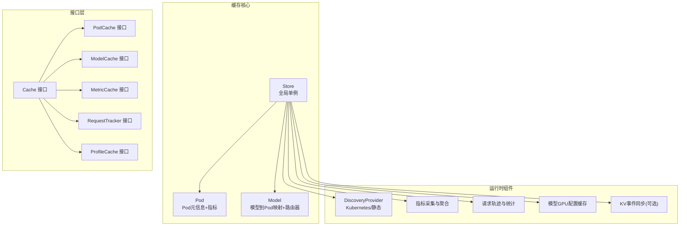

图示来源
- [cache_api.go:25-35](file://pkg/cache/cache_api.go#L25-L35)
- [cache_init.go:71-122](file://pkg/cache/cache_init.go#L71-L122)
- [pod.go:29-42](file://pkg/cache/pod.go#L29-L42)
- [model.go:27-41](file://pkg/cache/model.go#L27-L41)

章节来源
- [cache_api.go:25-35](file://pkg/cache/cache_api.go#L25-L35)
- [cache_init.go:71-122](file://pkg/cache/cache_init.go#L71-L122)
- [pod.go:29-42](file://pkg/cache/pod.go#L29-L42)
- [model.go:27-41](file://pkg/cache/model.go#L27-L41)

## 核心组件
- Cache 接口：统一聚合多类缓存能力，便于上层按需注入与替换
- Store：全局单例，承载 Pod/Model 映射、指标存储、请求追踪、模型配置缓存、KV 同步等
- Pod/Model 数据模型：封装指标、模型关联、实时统计与路由器
- 指标采集：引擎直连拉取 + Prometheus 查询，异步队列与速率计算
- 请求追踪：按模型维度的请求轨迹，周期性写入 Redis
- 模型 GPU 配置缓存：从 Redis 扫描并反序列化，提供吞吐/延迟等查询能力
- 负载提供器：基于缓存指标或模型配置估算利用率与负载消耗
- 发现与 Informers：Kubernetes Informer 或静态提供者，驱动缓存状态变更

章节来源
- [cache_api.go:25-35](file://pkg/cache/cache_api.go#L25-L35)
- [cache_impl.go:30-355](file://pkg/cache/cache_impl.go#L30-L355)
- [cache_init.go:71-122](file://pkg/cache/cache_init.go#L71-L122)
- [pod.go:29-42](file://pkg/cache/pod.go#L29-L42)
- [model.go:27-41](file://pkg/cache/model.go#L27-L41)
- [cache_metrics.go:37-124](file://pkg/cache/cache_metrics.go#L37-L124)
- [cache_trace.go:32-190](file://pkg/cache/cache_trace.go#L32-L190)
- [model_gpu_profile.go:46-57](file://pkg/cache/model_gpu_profile.go#L46-L57)

## 架构总览
缓存系统通过 InitWithOptions 在不同服务角色下进行差异化初始化：
- 控制器/元数据服务：关闭 GPU 优化追踪与模型配置缓存，仅保留基础指标与发现
- 网关：启用 KV 事件同步与远程分词器，结合 Redis 进行请求轨迹持久化

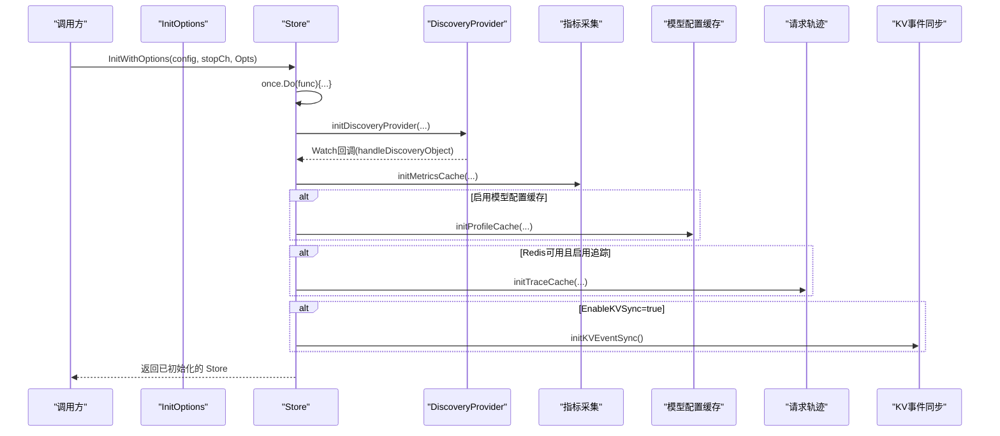

图示来源
- [cache_init.go:302-376](file://pkg/cache/cache_init.go#L302-L376)
- [cache_init.go:404-448](file://pkg/cache/cache_init.go#L404-L448)
- [cache_init.go:450-474](file://pkg/cache/cache_init.go#L450-L474)
- [cache_init.go:476-527](file://pkg/cache/cache_init.go#L476-L527)
- [cache_init.go:529-620](file://pkg/cache/cache_init.go#L529-L620)

章节来源
- [cache_init.go:302-376](file://pkg/cache/cache_init.go#L302-L376)
- [cache_init.go:404-448](file://pkg/cache/cache_init.go#L404-L448)
- [cache_init.go:450-474](file://pkg/cache/cache_init.go#L450-L474)
- [cache_init.go:476-527](file://pkg/cache/cache_init.go#L476-L527)
- [cache_init.go:529-620](file://pkg/cache/cache_init.go#L529-L620)

## 详细组件分析

### Cache 接口与职责划分
- Cache：聚合 PodCache、ModelCache、MetricCache、RequestTracker、RequestTrackerRegistry、ProfileCache、OutputPredictorProvider、RouterProvider
- PodCache：按名称获取 Pod、按模型列出关联 Pod
- ModelCache：模型存在性检查、列举模型、按 Pod 列举模型
- MetricCache：按 Pod/模型读取指标、订阅指标
- RequestTracker：请求开始/结束跟踪，支持带用量的完成接口
- RequestTrackerRegistry：注册多个追踪器并保证调用顺序
- ProfileCache：按 Pod/部署名获取模型 GPU 配置

```mermaid
classDiagram
class Cache {
<<interface>>
}
class PodCache {
<<interface>>
+GetPod(podName, podNamespace) Pod
+ListPodsByModel(modelName) PodList
}
class ModelCache {
<<interface>>
+HasModel(modelName) bool
+ListModels() []string
+ListModelsByPod(podName, podNamespace) []string
}
class MetricCache {
<<interface>>
+GetMetricValueByPod(podName, podNamespace, metricName) MetricValue
+GetMetricValueByPodModel(podName, podNamespace, modelName, metricName) MetricValue
+AddSubscriber(subscriber)
}
class RequestTracker {
<<interface>>
+AddRequestCount(ctx, requestID, modelName) int64
+DoneRequestCount(ctx, requestID, modelName, traceTerm)
+DoneRequestTrace(ctx, requestID, modelName, inputTokens, outputTokens, traceTerm)
}
class RequestTrackerRegistry {
<<interface>>
+RegisterRequestTracker(tracker)
}
class ProfileCache {
<<interface>>
+GetModelProfileByPod(pod, modelName) ModelGPUProfile
+GetModelProfileByDeploymentName(deploymentName, modelName) ModelGPUProfile
}
Cache <|.. PodCache
Cache <|.. ModelCache
Cache <|.. MetricCache
Cache <|.. RequestTracker
Cache <|.. RequestTrackerRegistry
Cache <|.. ProfileCache
```

图示来源
- [cache_api.go:25-170](file://pkg/cache/cache_api.go#L25-L170)

章节来源
- [cache_api.go:25-170](file://pkg/cache/cache_api.go#L25-L170)

### Store 初始化与生命周期
- 单例与初始化选项：InitOptions 支持启用 KV 同步、Redis 客户端、模型路由提供者、自定义发现提供者
- Store 字段：读写锁、Redis/Prometheus 客户端、指标订阅者、请求轨迹、Pod/模型/部署配置缓存、工作池与作业通道、KV 事件管理器、PromQL 作业队列、请求追踪器列表
- 生命周期：
  - Get：未初始化返回错误
  - New：创建 Store 并启动 Pod 指标工作池
  - InitWithOptions：根据服务类型调整行为，初始化发现、指标、配置缓存、追踪、KV 同步
  - Close：清理 KV 事件同步资源

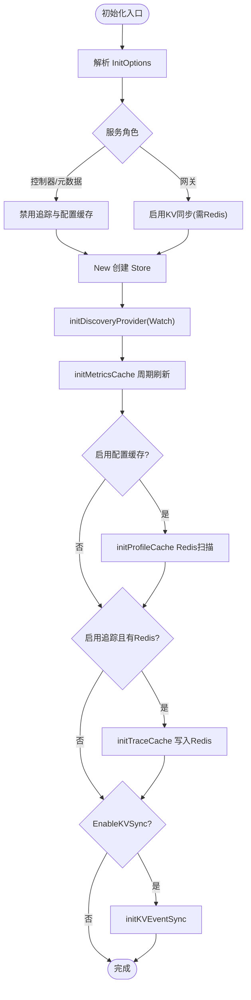

图示来源
- [cache_init.go:302-376](file://pkg/cache/cache_init.go#L302-L376)
- [cache_init.go:378-402](file://pkg/cache/cache_init.go#L378-L402)
- [cache_init.go:450-474](file://pkg/cache/cache_init.go#L450-L474)
- [cache_init.go:476-527](file://pkg/cache/cache_init.go#L476-L527)
- [cache_init.go:529-620](file://pkg/cache/cache_init.go#L529-L620)

章节来源
- [cache_init.go:42-62](file://pkg/cache/cache_init.go#L42-L62)
- [cache_init.go:71-122](file://pkg/cache/cache_init.go#L71-L122)
- [cache_init.go:124-166](file://pkg/cache/cache_init.go#L124-L166)
- [cache_init.go:302-376](file://pkg/cache/cache_init.go#L302-L376)
- [cache_init.go:378-402](file://pkg/cache/cache_init.go#L378-L402)
- [cache_init.go:450-474](file://pkg/cache/cache_init.go#L450-L474)
- [cache_init.go:476-527](file://pkg/cache/cache_init.go#L476-L527)
- [cache_init.go:529-620](file://pkg/cache/cache_init.go#L529-L620)

### 指标采集与聚合
- 拉取策略：引擎直连拉取 + Prometheus 查询
- 异步处理：工作池 + 作业队列，避免阻塞主路径；PromQL 使用独立队列与去重 FIFO
- 速率计算：对计数器类指标计算秒级速率与 1 分钟窗口速率，支持历史快照清理
- 标签清洗与回退：对模型名/引擎类型标签进行清洗与回退解析

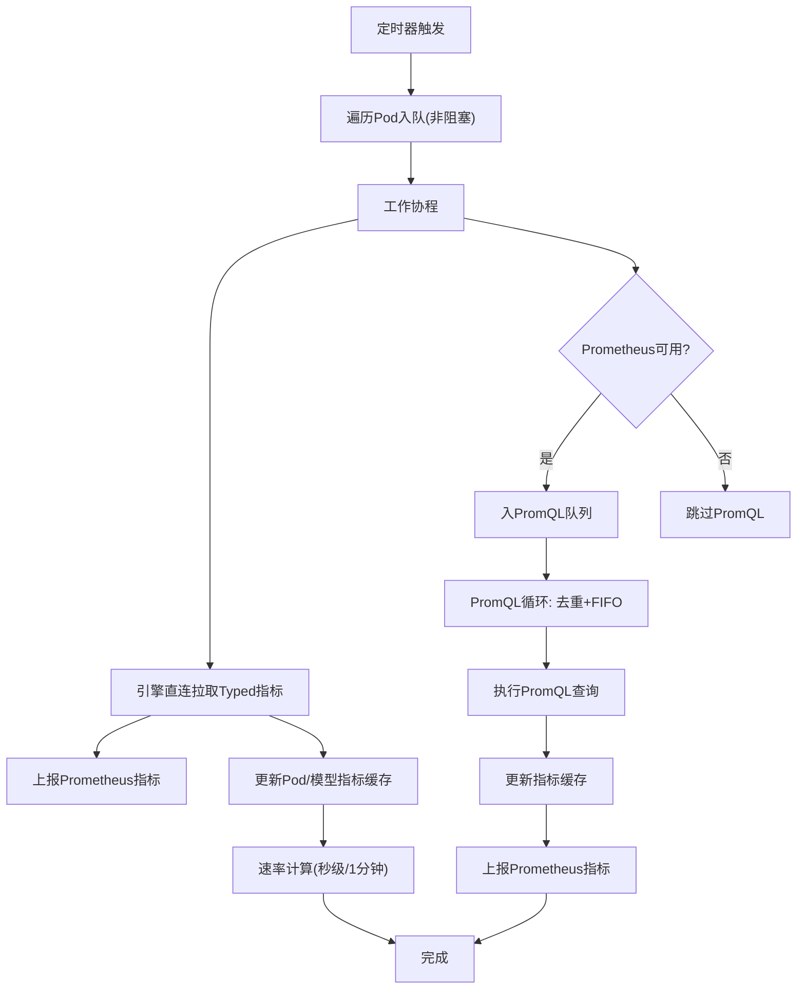

图示来源
- [cache_metrics.go:242-351](file://pkg/cache/cache_metrics.go#L242-L351)
- [cache_metrics.go:352-420](file://pkg/cache/cache_metrics.go#L352-L420)
- [cache_metrics.go:475-510](file://pkg/cache/cache_metrics.go#L475-L510)
- [utils.go:180-286](file://pkg/cache/utils.go#L180-L286)

章节来源
- [cache_metrics.go:37-124](file://pkg/cache/cache_metrics.go#L37-L124)
- [cache_metrics.go:242-351](file://pkg/cache/cache_metrics.go#L242-L351)
- [cache_metrics.go:352-420](file://pkg/cache/cache_metrics.go#L352-L420)
- [cache_metrics.go:475-510](file://pkg/cache/cache_metrics.go#L475-L510)
- [utils.go:180-286](file://pkg/cache/utils.go#L180-L286)

### 请求追踪与统计
- 追踪开关：由环境标志控制，Store 内部维护按模型维度的 RequestTrace
- 开始/结束：AddRequestCount/DoneRequestCount/DoneRequestTrace 支持多次开始与带用量完成
- 统计更新：实时运行请求数、归一化等待负载、Drain Rate 等指标写入 Pod 指标缓存
- 周期落盘：按时间窗口将请求轨迹序列化写入 Redis

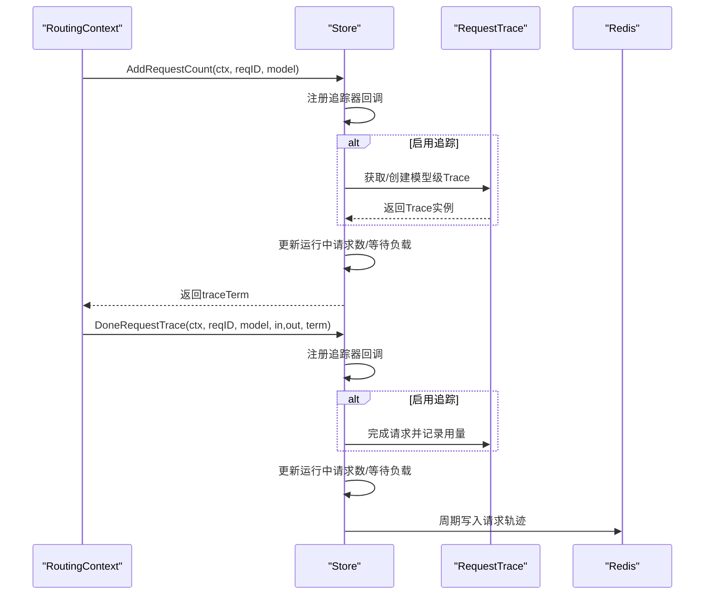

图示来源
- [cache_impl.go:167-286](file://pkg/cache/cache_impl.go#L167-L286)
- [cache_trace.go:37-190](file://pkg/cache/cache_trace.go#L37-L190)

章节来源
- [cache_impl.go:167-286](file://pkg/cache/cache_impl.go#L167-L286)
- [cache_trace.go:37-190](file://pkg/cache/cache_trace.go#L37-L190)

### 模型 GPU 配置缓存
- 键命名：aibrix:profile_{model}_{deployment}
- 刷新策略：周期扫描 Redis，反序列化后更新缓存
- 查询能力：吞吐、E2E、TTFT、TPOT 查询，签名对数化索引二分查找

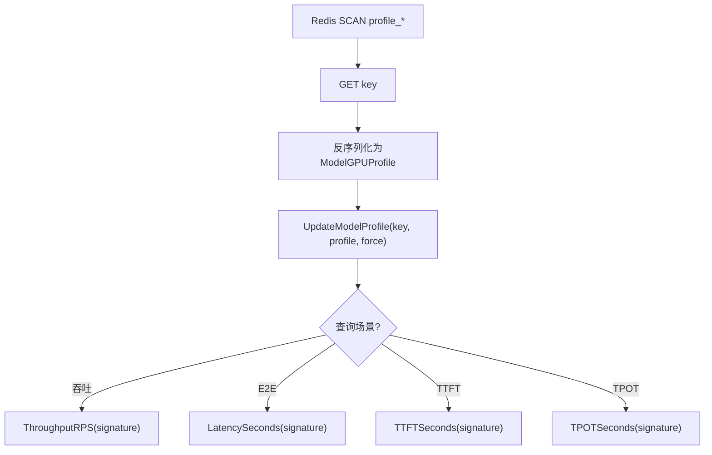

图示来源
- [cache_profile.go:24-70](file://pkg/cache/cache_profile.go#L24-L70)
- [model_gpu_profile.go:81-197](file://pkg/cache/model_gpu_profile.go#L81-L197)

章节来源
- [cache_profile.go:24-70](file://pkg/cache/cache_profile.go#L24-L70)
- [model_gpu_profile.go:59-197](file://pkg/cache/model_gpu_profile.go#L59-L197)

### 负载提供器
- CachedLoadProvider：从缓存读取指标值
- PendingLoadProvider：基于模型配置估算负载消耗，Little’s Law 推导

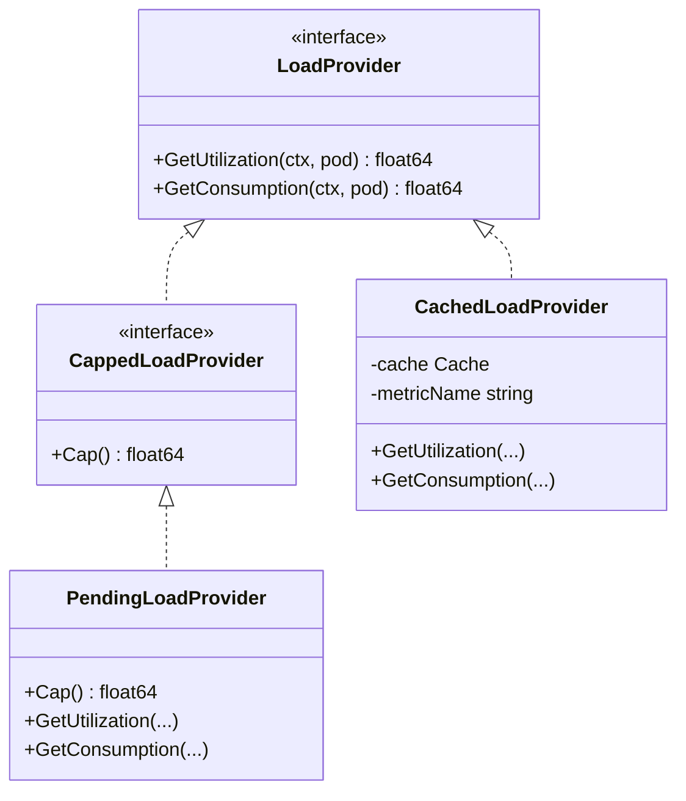

图示来源
- [load_provider.go:31-48](file://pkg/cache/load_provider.go#L31-L48)
- [pending_load_provider.go:24-87](file://pkg/cache/pending_load_provider.go#L24-L87)

章节来源
- [load_provider.go:31-48](file://pkg/cache/load_provider.go#L31-L48)
- [pending_load_provider.go:24-87](file://pkg/cache/pending_load_provider.go#L24-L87)

### 发现与 Informers
- 默认使用 Kubernetes Informer，支持静态提供者
- 处理 Pod/ModelAdapter 的增删改事件，建立/更新/删除 Pod 与模型的映射
- 启动后进行 ModelAdapter 重同步，确保启动阶段缺失的 Pod 映射最终补齐

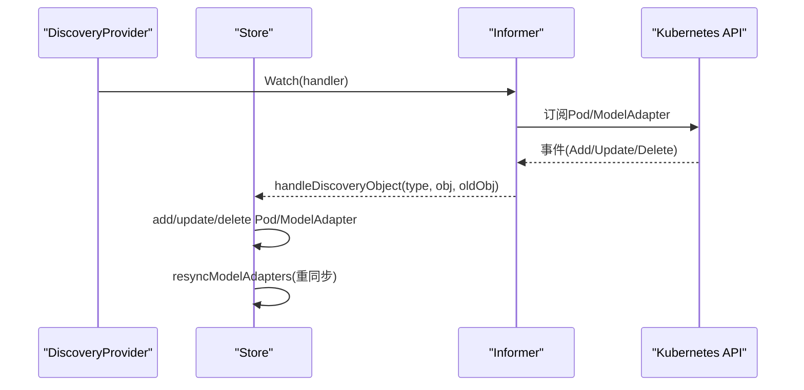

图示来源
- [cache_init.go:404-448](file://pkg/cache/cache_init.go#L404-L448)
- [informers.go:51-102](file://pkg/cache/informers.go#L51-L102)
- [informers.go:118-257](file://pkg/cache/informers.go#L118-L257)
- [informers.go:398-469](file://pkg/cache/informers.go#L398-L469)

章节来源
- [cache_init.go:404-448](file://pkg/cache/cache_init.go#L404-L448)
- [informers.go:51-102](file://pkg/cache/informers.go#L51-L102)
- [informers.go:118-257](file://pkg/cache/informers.go#L118-L257)
- [informers.go:398-469](file://pkg/cache/informers.go#L398-L469)

### KV 事件同步适配器
- storeProviderAdapter：向 kvevent 提供 Pod 信息与同步索引器访问
- syncIndexerAdapter：在 kvevent 与 syncprefixcacheindexer 类型之间转换
- 解耦 kvevent 与 syncprefixcacheindexer，避免循环依赖

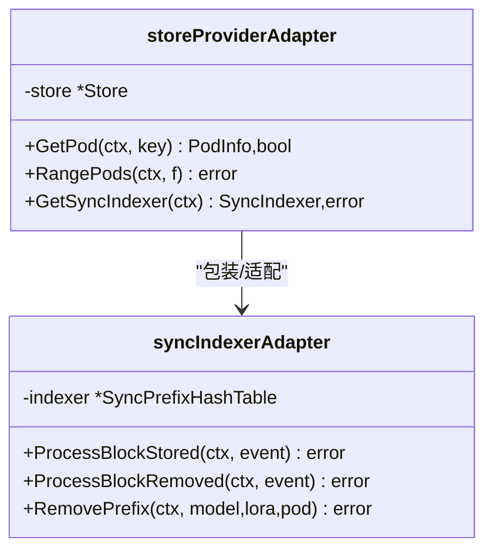

图示来源
- [store_providers.go:58-201](file://pkg/cache/store_providers.go#L58-L201)

章节来源
- [store_providers.go:58-201](file://pkg/cache/store_providers.go#L58-L201)

## 依赖分析
- 组件内聚与耦合
  - Store 对外暴露统一接口，内部通过字段组合多种能力，内聚度高
  - 通过接口抽象（Cache、RequestTracker、ProfileCache 等）降低模块间耦合
- 外部依赖
  - Kubernetes Informer：用于发现与事件监听
  - Prometheus：用于 PromQL 指标查询
  - Redis：用于请求轨迹持久化与模型配置缓存
- 可能的循环依赖
  - 通过适配器模式隔离 kvevent 与 syncprefixcacheindexer，避免直接依赖

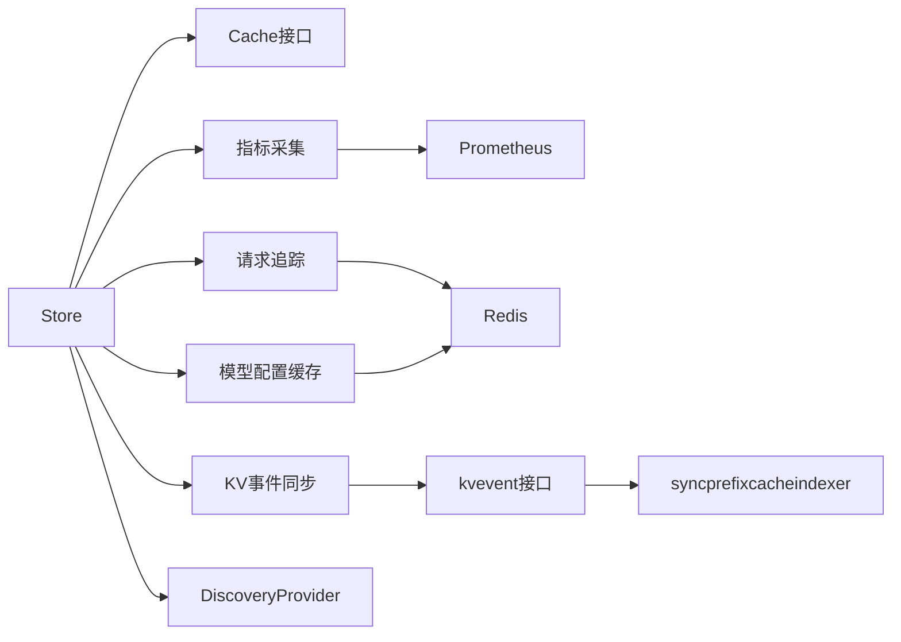

图示来源
- [cache_init.go:302-376](file://pkg/cache/cache_init.go#L302-L376)
- [store_providers.go:58-201](file://pkg/cache/store_providers.go#L58-L201)

章节来源
- [cache_init.go:302-376](file://pkg/cache/cache_init.go#L302-L376)
- [store_providers.go:58-201](file://pkg/cache/store_providers.go#L58-L201)

## 性能考虑
- 并发安全
  - 读写锁保护 Store 关键结构；指标存储采用并发安全映射
- 背压与限流
  - 指标工作池使用带缓冲的通道；PromQL 队列采用 FIFO 去重，避免慢查询阻塞主路径
- 指标更新
  - 引擎直连拉取 + Prometheus 查询分离；速率计算仅在必要时进行
- 请求追踪
  - 按模型维度的追踪对象复用与回收；周期性批量写入 Redis，减少 IO 压力
- 内存使用
  - 速率历史窗口大小与最大条目限制可控；Pod 删除时清理速率历史，防止无限增长

## 故障排查指南
- 未初始化错误
  - 调用 Get() 前必须完成 InitWithOptions/New
- 指标缺失
  - 检查引擎指标端点、标签解析与回退逻辑；确认 Prometheus 配置与认证
- 追踪未落盘
  - 确认 Redis 可用与追踪开关；检查时间窗口对齐与写入间隔
- KV 同步异常
  - 检查 KV 同步开关与远程分词器开关；验证配置并通过验证流程
- 模型配置缓存
  - 确认 Redis 中存在 profile 键；检查反序列化与签名索引范围

章节来源
- [cache_init.go:124-134](file://pkg/cache/cache_init.go#L124-L134)
- [cache_metrics.go:166-182](file://pkg/cache/cache_metrics.go#L166-L182)
- [cache_trace.go:137-180](file://pkg/cache/cache_trace.go#L137-L180)
- [cache_init.go:529-620](file://pkg/cache/cache_init.go#L529-L620)
- [cache_profile.go:24-70](file://pkg/cache/cache_profile.go#L24-L70)

## 结论
AIBrix 缓存系统通过清晰的接口抽象与模块化设计，在控制器、元数据服务与网关等不同角色下实现了可插拔的初始化与运行时行为。其以 Store 为核心，结合并发安全的数据结构、异步指标采集与请求追踪、以及可扩展的发现与同步机制，形成了稳定高效的缓存基础设施。建议在生产环境中合理配置指标刷新与 PromQL 查询参数，并结合 KV 同步与模型配置缓存提升调度与观测能力。

## 附录
- 最佳实践
  - 优先使用 Typed 指标拉取，必要时补充 PromQL 查询
  - 合理设置工作池数量与队列容量，避免饱和丢弃
  - 在高变更集群中定期清理速率历史，防止内存膨胀
  - 通过适配器模式接入 KV 同步，保持包边界清晰
- 扩展指南
  - 新增指标：在指标定义与查询处添加，确保标签清洗与回退
  - 新增追踪器：实现 RequestTracker 接口并通过 RegisterRequestTracker 注册
  - 新增发现提供者：实现 discovery.Provider 接口并在 InitWithOptions 中注入
  - 新增负载提供器：实现 LoadProvider/CappedLoadProvider 接口并集成到路由决策