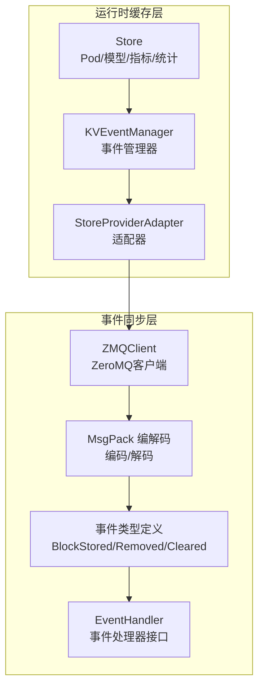
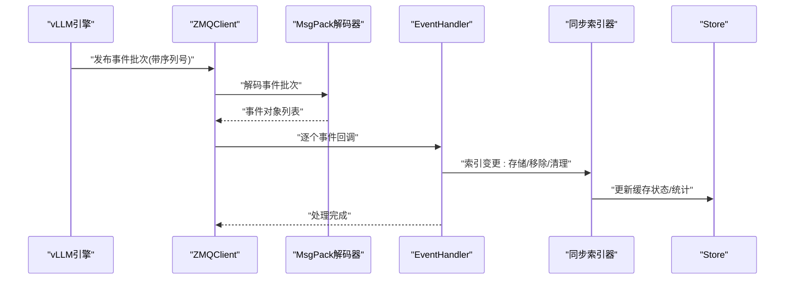
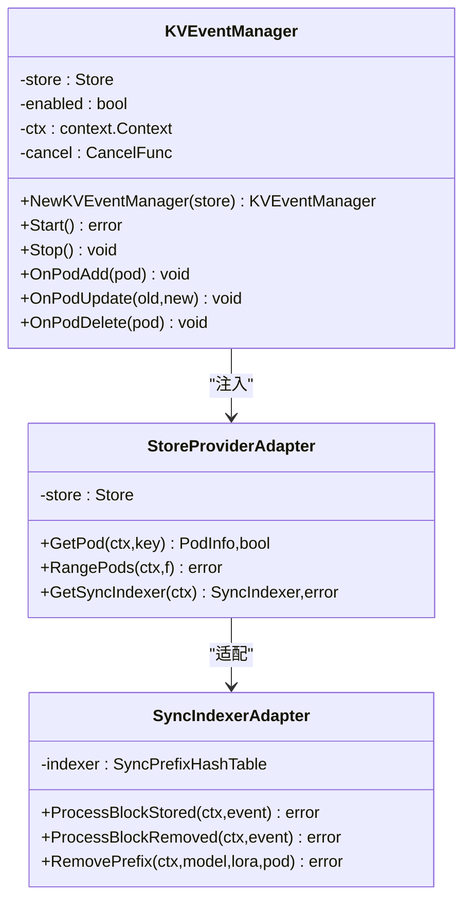
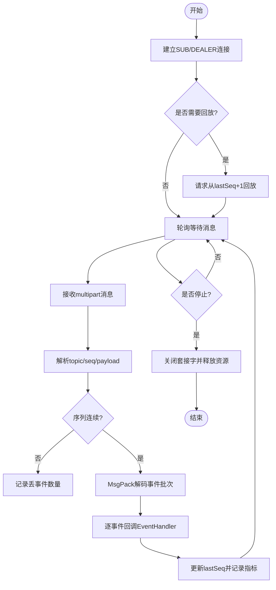
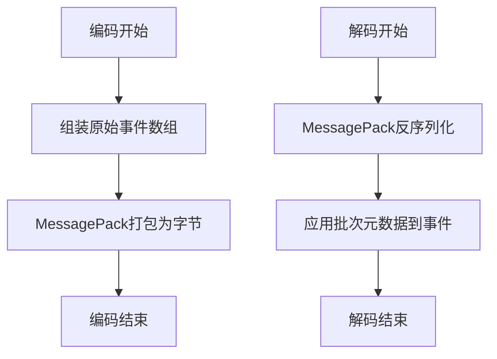
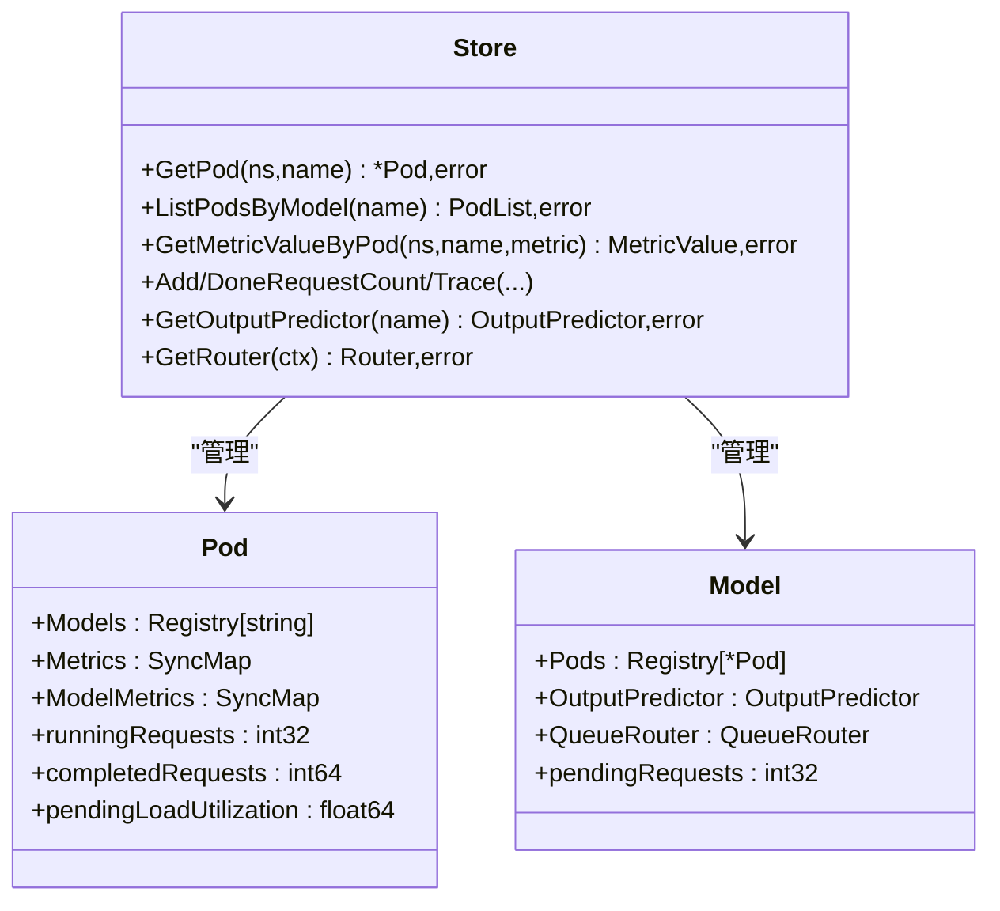
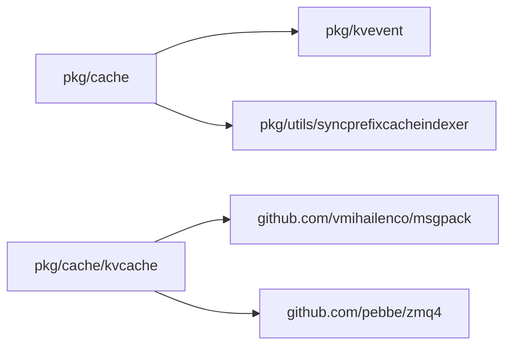

# 缓存系统

<cite>
**本文引用的文件**
- [kv_event_manager.go](file://pkg/cache/kv_event_manager.go)
- [kv_event_manager_zmq.go](file://pkg/cache/kv_event_manager_zmq.go)
- [store_providers.go](file://pkg/cache/store_providers.go)
- [cache_api.go](file://pkg/cache/cache_api.go)
- [cache_impl.go](file://pkg/cache/cache_impl.go)
- [model.go](file://pkg/cache/model.go)
- [pod.go](file://pkg/cache/pod.go)
- [load_provider.go](file://pkg/cache/load_provider.go)
- [kvcache/event_types.go](file://pkg/cache/kvcache/event_types.go)
- [kvcache/msgpack_encoder.go](file://pkg/cache/kvcache/msgpack_encoder.go)
- [kvcache/msgpack_decoder.go](file://pkg/cache/kvcache/msgpack_decoder.go)
- [kvcache/types.go](file://pkg/cache/kvcache/types.go)
- [kvcache/zmq_client.go](file://pkg/cache/kvcache/zmq_client.go)
- [kvcache/endpoint.go](file://pkg/cache/kvcache/endpoint.go)
- [kvcache/zmq_client_stub.go](file://pkg/cache/kvcache/zmq_client_stub.go)
- [kvcache/metrics.go](file://pkg/cache/kvcache/metrics.go)
- [controller/kvcache/backends/vineyard.go](file://pkg/controller/kvcache/backends/vineyard.go)
- [controller/kvcache/kvcache_controller_ginkgo_test.go](file://pkg/controller/kvcache/kvcache_controller_ginkgo_test.go)
- [cache/README.md](file://pkg/cache/README.md)
</cite>

## 目录
1. [简介](#简介)
2. [项目结构](#项目结构)
3. [核心组件](#核心组件)
4. [架构总览](#架构总览)
5. [详细组件分析](#详细组件分析)
6. [依赖关系分析](#依赖关系分析)
7. [性能考量](#性能考量)
8. [故障排查指南](#故障排查指南)
9. [结论](#结论)
10. [附录](#附录)

## 简介
本文件面向AIBrix缓存系统，聚焦分布式KV缓存框架的设计理念与实现架构，覆盖以下主题：
- L1/L2缓存层次结构与职责边界
- 基于ZeroMQ的事件驱动数据同步机制
- 内存管理策略与并发控制
- 缓存事件管理器（KVEventManager）工作原理（含ZMQ集成、事件处理流程、故障恢复）
- 多种缓存后端实现：Vineyard支持、Infinistore集成等
- 淘汰策略、数据序列化与压缩要点
- 性能优化、容量规划与监控告警实践

## 项目结构
AIBrix缓存系统由“运行时缓存层”和“事件同步层”两大部分组成：
- 运行时缓存层：提供Pod、模型、指标、请求跟踪、输出预测、路由队列等缓存能力，支撑调度与可观测性。
- 事件同步层：通过ZeroMQ订阅vLLM引擎发出的KV缓存事件，进行跨实例的数据一致性与索引同步。

图表来源
- [cache_impl.go:30-355](file://pkg/cache/cache_impl.go#L30-L355)
- [kv_event_manager_zmq.go:28-39](file://pkg/cache/kv_event_manager_zmq.go#L28-L39)
- [store_providers.go:58-201](file://pkg/cache/store_providers.go#L58-L201)
- [kvcache/zmq_client.go:30-70](file://pkg/cache/kvcache/zmq_client.go#L30-L70)
- [kvcache/msgpack_decoder.go:27-86](file://pkg/cache/kvcache/msgpack_decoder.go#L27-L86)
- [kvcache/event_types.go:45-178](file://pkg/cache/kvcache/event_types.go#L45-L178)

章节来源
- [cache_api.go:25-170](file://pkg/cache/cache_api.go#L25-L170)
- [cache_impl.go:30-355](file://pkg/cache/cache_impl.go#L30-L355)
- [model.go:24-42](file://pkg/cache/model.go#L24-L42)
- [pod.go:29-59](file://pkg/cache/pod.go#L29-L59)

## 核心组件
- 缓存接口与聚合
  - Cache接口聚合了PodCache、ModelCache、MetricCache、RequestTracker、ProfileCache、RouterProvider等能力，统一对外暴露。
- 运行时缓存Store
  - 提供Pod、模型、指标、请求计数、输出预测器、队列路由器等的读写与查询能力；内部使用并发安全的数据结构与原子计数保障线程安全。
- 事件管理器KVEventManager
  - 在启用ZMQ构建标签时，包装底层kvevent.Manager并注入StoreProvider与SyncIndexProvider；在未启用ZMQ时提供空实现以保证编译兼容性。
- 事件同步子系统
  - ZMQClient负责连接vLLM发布者，订阅消息并按序处理；MsgPack编解码器负责与vLLM事件格式互操作；事件类型定义涵盖BlockStored、BlockRemoved、AllBlocksCleared等。

章节来源
- [cache_api.go:25-170](file://pkg/cache/cache_api.go#L25-L170)
- [cache_impl.go:30-355](file://pkg/cache/cache_impl.go#L30-L355)
- [kv_event_manager.go:28-71](file://pkg/cache/kv_event_manager.go#L28-L71)
- [kv_event_manager_zmq.go:28-77](file://pkg/cache/kv_event_manager_zmq.go#L28-L77)
- [store_providers.go:58-201](file://pkg/cache/store_providers.go#L58-L201)

## 架构总览
下图展示从vLLM到缓存层的事件流：ZeroMQ订阅、消息解码、事件分发、索引更新与统计追踪。

图表来源
- [kvcache/zmq_client.go:257-367](file://pkg/cache/kvcache/zmq_client.go#L257-L367)
- [kvcache/msgpack_decoder.go:27-86](file://pkg/cache/kvcache/msgpack_decoder.go#L27-L86)
- [kvcache/event_types.go:63-178](file://pkg/cache/kvcache/event_types.go#L63-L178)
- [store_providers.go:131-201](file://pkg/cache/store_providers.go#L131-L201)

## 详细组件分析

### 组件A：KV事件管理器（KVEventManager）
- 设计要点
  - 构建标签控制：未启用zmq时返回空实现；启用zmq时包装kvevent.Manager并注入StoreProvider与SyncIndexProvider。
  - 配置校验：当启用KV事件同步时，要求远程分词器开启且类型为remote，并设置远程分词器端点。
- 适配器模式
  - StoreProviderAdapter桥接Store与kvevent接口，屏蔽kvevent包对具体实现细节的耦合。
  - syncIndexerAdapter在事件类型层面做转换，避免循环依赖。
- 线程安全
  - 通过上下文取消、互斥锁与原子变量确保并发安全。

图表来源
- [kv_event_manager_zmq.go:28-77](file://pkg/cache/kv_event_manager_zmq.go#L28-L77)
- [store_providers.go:58-201](file://pkg/cache/store_providers.go#L58-L201)

章节来源
- [kv_event_manager.go:28-71](file://pkg/cache/kv_event_manager.go#L28-L71)
- [kv_event_manager_zmq.go:41-77](file://pkg/cache/kv_event_manager_zmq.go#L41-L77)
- [store_providers.go:58-201](file://pkg/cache/store_providers.go#L58-L201)

### 组件B：ZeroMQ事件客户端（ZMQClient）
- 连接与重连
  - SUB套接字订阅事件，DEALER套接字向ROUTER发起回放请求；连接失败采用指数退避重连，最大间隔受控。
- 事件消费
  - 使用轮询等待消息，解析多段消息（topic、sequence、payload），校验序列连续性，解码后逐条分发给EventHandler。
- 序列与回放
  - 记录最后处理序列号，断线后根据lastSeq请求增量回放，减少数据丢失风险。
- IPv6与端点格式
  - 支持IPv6双栈，端点格式化函数同时兼容IPv4与IPv6地址。

图表来源
- [kvcache/zmq_client.go:72-181](file://pkg/cache/kvcache/zmq_client.go#L72-L181)
- [kvcache/zmq_client.go:197-255](file://pkg/cache/kvcache/zmq_client.go#L197-L255)
- [kvcache/zmq_client.go:257-367](file://pkg/cache/kvcache/zmq_client.go#L257-L367)
- [kvcache/endpoint.go:23-49](file://pkg/cache/kvcache/endpoint.go#L23-L49)

章节来源
- [kvcache/zmq_client.go:30-426](file://pkg/cache/kvcache/zmq_client.go#L30-L426)
- [kvcache/endpoint.go:23-49](file://pkg/cache/kvcache/endpoint.go#L23-L49)
- [kvcache/zmq_client_stub.go:25-50](file://pkg/cache/kvcache/zmq_client_stub.go#L25-L50)

### 组件C：事件编解码与类型定义
- 类型体系
  - EventType枚举包含BlockStored、BlockRemoved、AllBlocksCleared三类事件。
  - KVEvent基础接口与各事件结构体携带时间戳、模型名、Pod名等元信息。
- 编解码规则
  - 编码：仅编码数组字段，不包含Timestamp/ModelName/PodName等元数据；vLLM期望的批次格式为[timestamp, [events...]]。
  - 解码：解析批次头与事件数组，应用批次元数据到每个事件；支持新旧两种block hash格式（int64与32字节SHA取前8字节）。
- Token表示
  - vLLM发送token ID为[]int32，网关侧转换为[]byte（每int32大端4字节）以用于哈希与索引。

图表来源
- [kvcache/msgpack_encoder.go:24-53](file://pkg/cache/kvcache/msgpack_encoder.go#L24-L53)
- [kvcache/msgpack_encoder.go:55-97](file://pkg/cache/kvcache/msgpack_encoder.go#L55-L97)
- [kvcache/msgpack_decoder.go:27-86](file://pkg/cache/kvcache/msgpack_decoder.go#L27-L86)
- [kvcache/event_types.go:45-178](file://pkg/cache/kvcache/event_types.go#L45-L178)

章节来源
- [kvcache/event_types.go:45-178](file://pkg/cache/kvcache/event_types.go#L45-L178)
- [kvcache/msgpack_encoder.go:24-110](file://pkg/cache/kvcache/msgpack_encoder.go#L24-L110)
- [kvcache/msgpack_decoder.go:27-578](file://pkg/cache/kvcache/msgpack_decoder.go#L27-L578)

### 组件D：运行时缓存Store与数据模型
- Store职责
  - 提供Pod查询、模型查询、指标读取、请求计数与追踪、输出预测器与队列路由器获取等能力。
  - 内部使用并发安全容器与原子计数，保障高并发下的正确性。
- 数据模型
  - Pod结构包含模型集合、指标映射、实时统计字段与日志节流控制。
  - Model结构包含模型关联的Pod集合、输出预测器、队列路由器以及待处理请求数。

图表来源
- [cache_impl.go:30-355](file://pkg/cache/cache_impl.go#L30-L355)
- [pod.go:29-59](file://pkg/cache/pod.go#L29-L59)
- [model.go:27-42](file://pkg/cache/model.go#L27-L42)

章节来源
- [cache_impl.go:30-355](file://pkg/cache/cache_impl.go#L30-L355)
- [pod.go:29-59](file://pkg/cache/pod.go#L29-L59)
- [model.go:27-42](file://pkg/cache/model.go#L27-L42)

### 组件E：负载提供器与度量
- CachedLoadProvider
  - 从缓存中读取指标值作为利用率；消费量计算在当前实现中未支持。
- 负载接口
  - LoadProvider/CappedLoadProvider抽象了利用率与容量的读取；CachedLoadProvider实现了基于缓存的利用率读取。

章节来源
- [load_provider.go:31-88](file://pkg/cache/load_provider.go#L31-L88)

### 组件F：缓存后端实现（Vineyard、Infinistore等）
- Vineyard后端
  - 控制器通过Deployment生成Vineyard守护进程，注入节点亲和性、环境变量等，确保与GPU类型匹配与拓扑一致。
- Infinistore后端
  - 控制器示例中展示了以镜像名称标识Infinistore部署，便于在Kubernetes中编排与扩缩容。

章节来源
- [controller/kvcache/backends/vineyard.go:219-239](file://pkg/controller/kvcache/backends/vineyard.go#L219-L239)
- [controller/kvcache/kvcache_controller_ginkgo_test.go:50-85](file://pkg/controller/kvcache/kvcache_controller_ginkgo_test.go#L50-L85)

## 依赖关系分析
- 包间依赖
  - pkg/cache依赖pkg/kvevent（启用zmq时）以实现事件管理；通过适配器隔离具体实现细节。
  - pkg/cache/kvcache依赖msgpack库进行事件编解码；ZeroMQ客户端依赖pebbe/zmq4。
- 关键耦合点
  - StoreProviderAdapter与syncIndexerAdapter避免kvevent与syncindexer之间的循环依赖。
  - KVEventManager在zmq构建标签下委托kvevent.Manager，否则为空实现。

图表来源
- [store_providers.go:48-56](file://pkg/cache/store_providers.go#L48-L56)
- [kv_event_manager_zmq.go:20-26](file://pkg/cache/kv_event_manager_zmq.go#L20-L26)
- [kvcache/zmq_client.go:19-28](file://pkg/cache/kvcache/zmq_client.go#L19-L28)
- [kvcache/msgpack_encoder.go:17-22](file://pkg/cache/kvcache/msgpack_encoder.go#L17-L22)

章节来源
- [store_providers.go:48-56](file://pkg/cache/store_providers.go#L48-L56)
- [kv_event_manager_zmq.go:20-26](file://pkg/cache/kv_event_manager_zmq.go#L20-L26)

## 性能考量
- 并发与内存
  - Store内部广泛使用并发安全容器与原子操作，降低锁粒度，提升高并发场景吞吐。
- ZeroMQ参数调优
  - Poll超时、回放超时、重连间隔可按网络状况与延迟目标调整；IPv6双栈支持提升容器网络兼容性。
- 编解码效率
  - 采用MessagePack紧凑二进制格式，事件批次按数组编码，减少序列化开销。
- 指标与观测
  - ZMQClientMetrics提供连接、错误、事件处理延迟、回放次数等指标，便于定位瓶颈。

章节来源
- [cache_impl.go:167-286](file://pkg/cache/cache_impl.go#L167-L286)
- [kvcache/zmq_client.go:30-70](file://pkg/cache/kvcache/zmq_client.go#L30-L70)
- [kvcache/metrics.go:246-281](file://pkg/cache/kvcache/metrics.go#L246-L281)

## 故障排查指南
- 启用ZMQ构建标签
  - 若出现“需要ZMQ支持”的错误，请使用带zmq标签的构建方式；测试可用标签验证。
- KV事件同步配置
  - 启用KV事件同步需满足：开启远程分词器、分词器类型为remote、设置远程分词器端点。
- ZMQ连接问题
  - 检查端点格式（IPv4/IPv6）、端口范围、网络连通性；关注重连日志与指数退避行为。
- 事件处理异常
  - 查看解码错误、事件类型未知、序列长度不合法等问题；确认vLLM版本与事件格式兼容性。
- 指标缺失或异常
  - 确认指标订阅已注册、缓存中存在对应Pod/模型；检查CachedLoadProvider读取路径。

章节来源
- [cache/README.md:143-160](file://pkg/cache/README.md#L143-L160)
- [kv_event_manager_zmq.go:41-69](file://pkg/cache/kv_event_manager_zmq.go#L41-L69)
- [kvcache/zmq_client.go:72-140](file://pkg/cache/kvcache/zmq_client.go#L72-L140)
- [kvcache/msgpack_decoder.go:88-180](file://pkg/cache/kvcache/msgpack_decoder.go#L88-L180)
- [cache_impl.go:288-295](file://pkg/cache/cache_impl.go#L288-L295)

## 结论
AIBrix缓存系统通过清晰的分层设计与适配器模式，将事件同步与运行时缓存解耦，既保证了扩展性，又兼顾了性能与可靠性。ZeroMQ事件通道与MessagePack编解码提供了高效的跨实例数据同步能力；Store的并发安全设计与指标体系为调度与可观测性提供了坚实基础。结合Vineyard与Infinistore等后端，系统可在多样化环境中稳定运行并持续演进。

## 附录
- 测试与构建
  - 可使用带zmq标签的测试命令验证事件同步功能；无zmq标签时应使用空实现进行编译兼容性测试。
- 监控与告警
  - 建议采集ZMQClientMetrics中的连接、错误、回放、事件处理延迟等指标，设置阈值告警与重连失败告警。

章节来源
- [cache/README.md:143-160](file://pkg/cache/README.md#L143-L160)
- [kvcache/metrics.go:246-281](file://pkg/cache/kvcache/metrics.go#L246-L281)