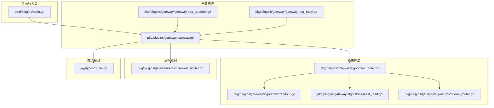
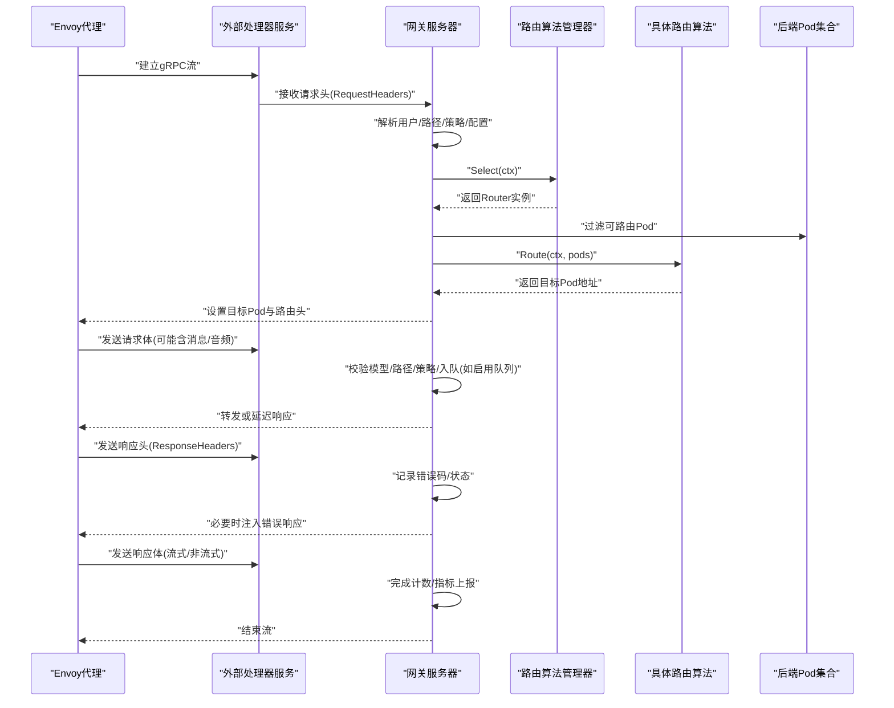
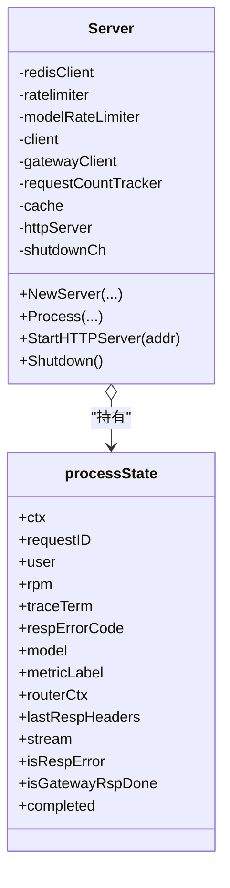
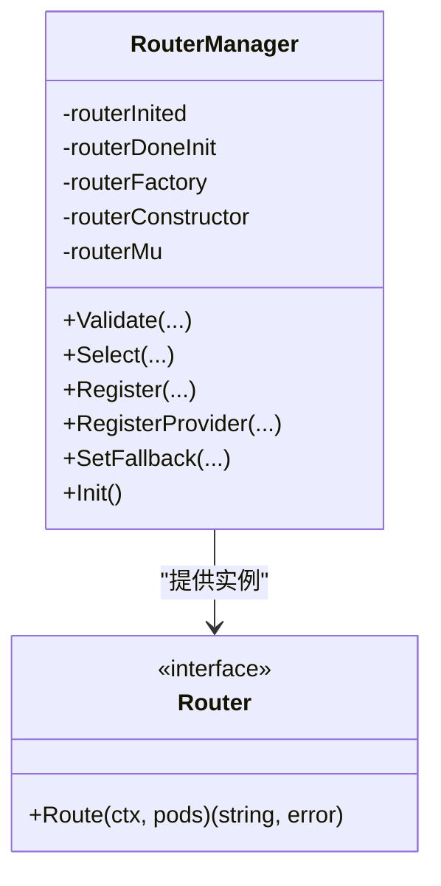
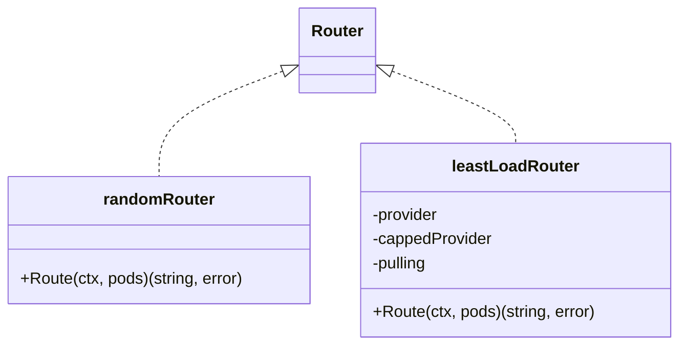
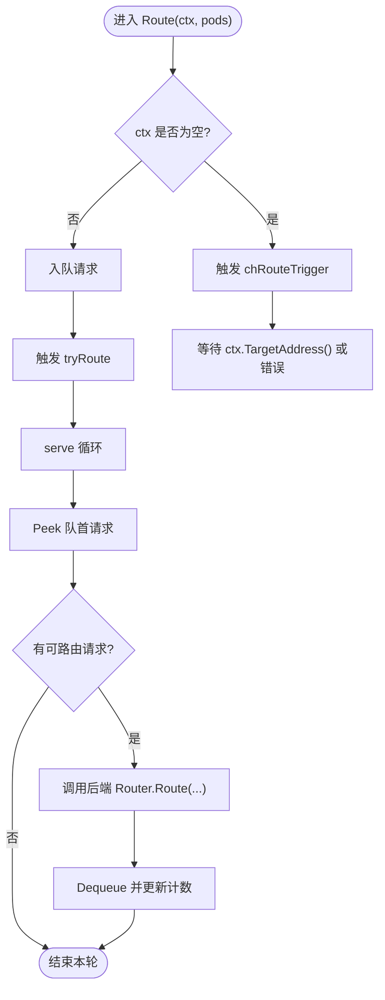
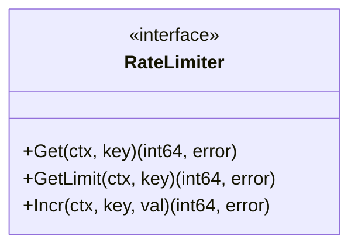
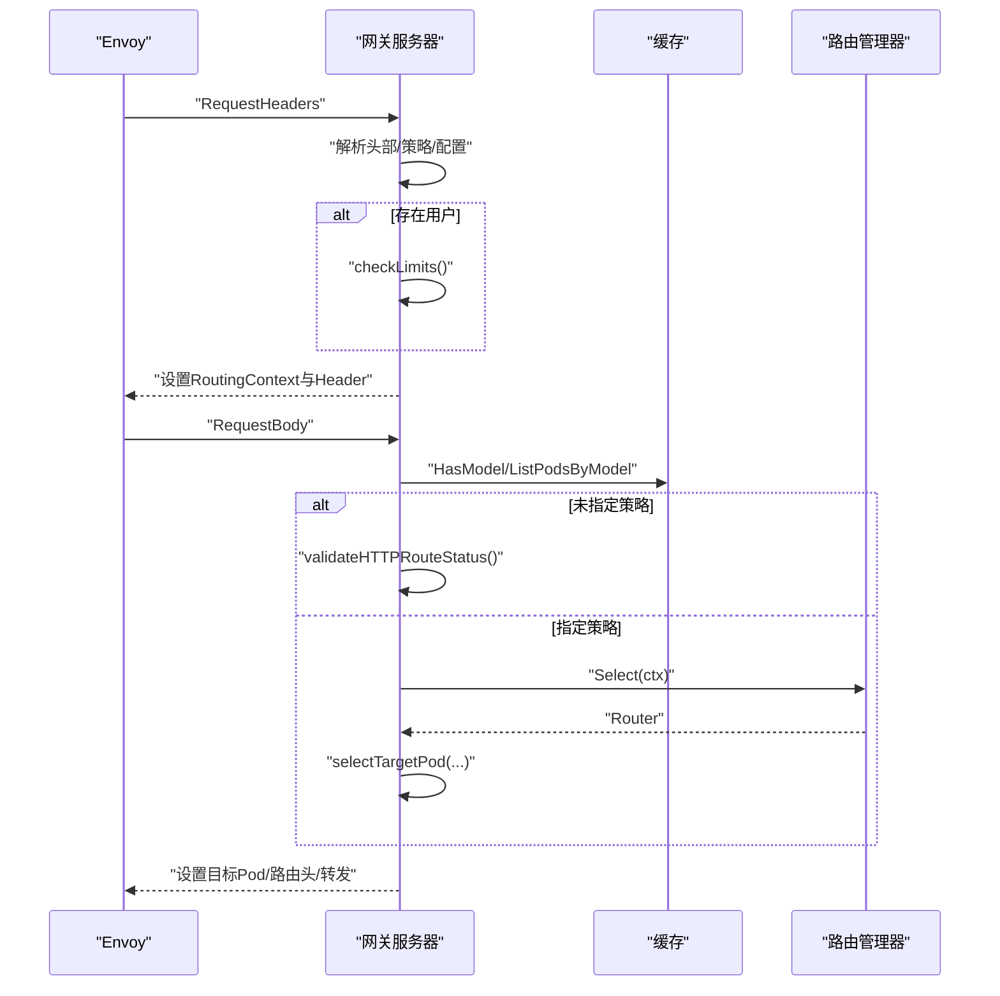
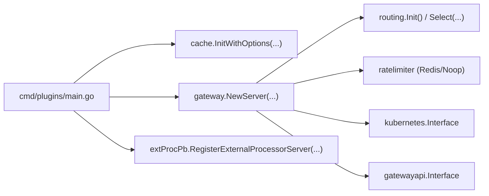

# 插件开发指南

<cite>
**本文引用的文件**   
- [pkg/plugins/gateway/gateway.go](file://pkg/plugins/gateway/gateway.go)
- [pkg/plugins/gateway/gateway_req_headers.go](file://pkg/plugins/gateway/gateway_req_headers.go)
- [pkg/plugins/gateway/gateway_req_body.go](file://pkg/plugins/gateway/gateway_req_body.go)
- [pkg/plugins/gateway/algorithms/router.go](file://pkg/plugins/gateway/algorithms/router.go)
- [pkg/plugins/gateway/algorithms/random.go](file://pkg/plugins/gateway/algorithms/random.go)
- [pkg/plugins/gateway/algorithms/least_load.go](file://pkg/plugins/gateway/algorithms/least_load.go)
- [pkg/plugins/gateway/algorithms/queue_router.go](file://pkg/plugins/gateway/algorithms/queue_router.go)
- [pkg/plugins/gateway/ratelimiter/rate_limiter.go](file://pkg/plugins/gateway/ratelimiter/rate_limiter.go)
- [pkg/types/router.go](file://pkg/types/router.go)
- [cmd/plugins/main.go](file://cmd/plugins/main.go)
</cite>

## 目录
1. [简介](#简介)
2. [项目结构](#项目结构)
3. [核心组件](#核心组件)
4. [架构总览](#架构总览)
5. [详细组件分析](#详细组件分析)
6. [依赖分析](#依赖分析)
7. [性能考虑](#性能考虑)
8. [故障排查指南](#故障排查指南)
9. [结论](#结论)
10. [附录](#附录)

## 简介
本指南面向AIBrix网关插件开发者，系统讲解插件架构设计原则、接口与生命周期、配置机制；深入解析路由算法插件的开发流程（Router接口实现、算法注册、参数配置）；阐述网关插件扩展点（自定义路由算法、速率限制策略、队列管理器）；并提供最佳实践（错误处理、性能优化、测试策略）、完整示例路径、调试技巧、部署与发布流程，以及版本兼容与升级迁移策略。

## 项目结构
AIBrix网关插件位于Go模块中，核心入口在命令行程序，插件逻辑集中在gateway包，路由算法集中于algorithms子包，速率限制接口定义在ratelimiter子包，类型接口定义在types包。

**图表来源**
- [cmd/plugins/main.go:54-198](file://cmd/plugins/main.go#L54-L198)
- [pkg/plugins/gateway/gateway.go:94-121](file://pkg/plugins/gateway/gateway.go#L94-L121)
- [pkg/plugins/gateway/algorithms/router.go:41-153](file://pkg/plugins/gateway/algorithms/router.go#L41-L153)

**章节来源**
- [cmd/plugins/main.go:54-198](file://cmd/plugins/main.go#L54-L198)
- [pkg/plugins/gateway/gateway.go:94-121](file://pkg/plugins/gateway/gateway.go#L94-L121)
- [pkg/plugins/gateway/algorithms/router.go:41-153](file://pkg/plugins/gateway/algorithms/router.go#L41-L153)

## 核心组件
- 网关服务器：负责接收Envoy外部处理器流事件，按阶段处理请求头、请求体、响应头、响应体，并进行路由选择、速率限制、指标上报与错误处理。
- 路由算法管理器：统一注册、校验、选择路由算法，支持状态化构造器与无状态提供者两种方式，支持回退路由设置。
- 路由算法接口：定义Router、QueueRouter、FallbackRouter等接口，支撑不同调度策略与队列能力。
- 速率限制接口：定义通用RateLimiter接口，支持账户级与模型级限流。
- 队列路由器：封装队列化调度，将请求入队并在可用时出队交由后端Router选择目标Pod。

**章节来源**
- [pkg/plugins/gateway/gateway.go:62-121](file://pkg/plugins/gateway/gateway.go#L62-L121)
- [pkg/plugins/gateway/algorithms/router.go:41-153](file://pkg/plugins/gateway/algorithms/router.go#L41-L153)
- [pkg/types/router.go:19-56](file://pkg/types/router.go#L19-L56)
- [pkg/plugins/gateway/ratelimiter/rate_limiter.go:23-37](file://pkg/plugins/gateway/ratelimiter/rate_limiter.go#L23-L37)
- [pkg/plugins/gateway/algorithms/queue_router.go:47-147](file://pkg/plugins/gateway/algorithms/queue_router.go#L47-L147)

## 架构总览
下图展示从Envoy到网关插件再到后端Pod的调用链路与关键处理阶段。

**图表来源**
- [pkg/plugins/gateway/gateway.go:123-303](file://pkg/plugins/gateway/gateway.go#L123-L303)
- [pkg/plugins/gateway/gateway_req_headers.go:41-125](file://pkg/plugins/gateway/gateway_req_headers.go#L41-L125)
- [pkg/plugins/gateway/gateway_req_body.go:38-175](file://pkg/plugins/gateway/gateway_req_body.go#L38-L175)
- [pkg/plugins/gateway/algorithms/router.go:73-85](file://pkg/plugins/gateway/algorithms/router.go#L73-L85)

## 详细组件分析

### 组件A：网关服务器（Server）
- 职责
  - 处理Envoy外部处理器的流事件，按阶段生成响应。
  - 维护Redis限流器、模型级限流器、K8s客户端、缓存、HTTP指标服务。
  - 在请求生命周期内进行预检查、错误处理、指标上报与优雅关闭。
- 关键流程
  - 流循环：preRecvCheck → Recv → handleProcessingRequest → sendProcessingResponse。
  - 请求头阶段：解析用户信息、路由策略、配置文件、会话ID等，准备RoutingContext。
  - 请求体阶段：校验模型存在性与Pod就绪、派生引擎类型、应用RPS限制、选择路由算法或直接路由。
  - 响应头/体阶段：记录错误码、完成计数、更新指标、必要时注入错误响应。
- 生命周期
  - 启动：初始化缓存、注册路由算法、启动HTTP指标服务。
  - 运行：持续接收与处理流事件。
  - 关闭：优雅停止HTTP服务与gRPC服务，触发缓存计数清理。

**图表来源**
- [pkg/plugins/gateway/gateway.go:62-121](file://pkg/plugins/gateway/gateway.go#L62-L121)
- [pkg/plugins/gateway/gateway.go:123-303](file://pkg/plugins/gateway/gateway.go#L123-L303)

**章节来源**
- [pkg/plugins/gateway/gateway.go:94-121](file://pkg/plugins/gateway/gateway.go#L94-L121)
- [pkg/plugins/gateway/gateway.go:123-303](file://pkg/plugins/gateway/gateway.go#L123-L303)

### 组件B：路由算法管理器（RouterManager）
- 职责
  - 注册路由算法（状态化构造器或无状态提供者）。
  - 校验用户指定算法是否受支持。
  - 选择并提供Router实例给网关服务器。
  - 支持为实现FallbackRouter的算法设置回退算法。
- 关键接口
  - Register/ RegisterProvider：注册算法。
  - Validate/ Select：校验与选择。
  - SetFallback：设置回退算法。
  - Init：批量完成构造器到提供者的转换。

**图表来源**
- [pkg/plugins/gateway/algorithms/router.go:41-153](file://pkg/plugins/gateway/algorithms/router.go#L41-L153)
- [pkg/types/router.go:19-46](file://pkg/types/router.go#L19-L46)

**章节来源**
- [pkg/plugins/gateway/algorithms/router.go:41-153](file://pkg/plugins/gateway/algorithms/router.go#L41-L153)
- [pkg/types/router.go:19-46](file://pkg/types/router.go#L19-L46)

### 组件C：典型路由算法（随机/最小负载）
- 随机算法
  - 实现：随机选择一个可路由Pod作为目标。
  - 注册：通过RegisterProvider在初始化时注册。
- 最小负载算法
  - 实现：根据负载提供者计算利用率，优先选择最小利用率的Pod；支持拉取模式（pull）以结合容量上限。
  - 错误处理：对不可用Pod与获取指标失败进行容错与错误累积。

**图表来源**
- [pkg/plugins/gateway/algorithms/random.go:34-62](file://pkg/plugins/gateway/algorithms/random.go#L34-L62)
- [pkg/plugins/gateway/algorithms/least_load.go:42-140](file://pkg/plugins/gateway/algorithms/least_load.go#L42-L140)

**章节来源**
- [pkg/plugins/gateway/algorithms/random.go:34-62](file://pkg/plugins/gateway/algorithms/random.go#L34-L62)
- [pkg/plugins/gateway/algorithms/least_load.go:42-140](file://pkg/plugins/gateway/algorithms/least_load.go#L42-L140)

### 组件D：队列路由器（QueueRouter）
- 职责
  - 将请求入队，等待可用Pod时尝试Peek并交由后端Router选择目标。
  - 提供Len查询队列长度，用于监控与SLO控制。
  - 通过通道触发路由尝试，确保线程安全。
- 关键流程
  - Route(ctx, pods)：入队并触发尝试；若ctx为空则仅触发尝试。
  - serve循环：Peek队首请求，调用后端Router，Dequeue并更新缓存计数。

**图表来源**
- [pkg/plugins/gateway/algorithms/queue_router.go:72-147](file://pkg/plugins/gateway/algorithms/queue_router.go#L72-L147)

**章节来源**
- [pkg/plugins/gateway/algorithms/queue_router.go:47-147](file://pkg/plugins/gateway/algorithms/queue_router.go#L47-L147)

### 组件E：速率限制接口（RateLimiter）
- 接口职责
  - Get：获取当前计数。
  - GetLimit：获取配额上限。
  - Incr：增量计数并返回新值。
- 应用场景
  - 账户级RPM与模型级QPS限流，结合Redis实现跨实例一致性。

**图表来源**
- [pkg/plugins/gateway/ratelimiter/rate_limiter.go:23-37](file://pkg/plugins/gateway/ratelimiter/rate_limiter.go#L23-L37)

**章节来源**
- [pkg/plugins/gateway/ratelimiter/rate_limiter.go:23-37](file://pkg/plugins/gateway/ratelimiter/rate_limiter.go#L23-L37)

### 组件F：请求头/请求体处理（阶段化处理）
- 请求头阶段
  - 解析用户、路径、授权、内容类型、外部过滤表达式、路由策略、配置文件、会话ID。
  - 若存在用户名且Redis可用，则查询用户并执行限流检查。
  - 初始化RoutingContext并清空路由缓存。
- 请求体阶段
  - 校验模型存在性与Pod就绪。
  - 解析消息/音频multipart数据，派生引擎类型，应用RPS限制。
  - 若未显式指定策略：校验HTTPRoute状态；否则：调用selectTargetPod选择目标Pod并设置路由头。

**图表来源**
- [pkg/plugins/gateway/gateway_req_headers.go:41-125](file://pkg/plugins/gateway/gateway_req_headers.go#L41-L125)
- [pkg/plugins/gateway/gateway_req_body.go:38-175](file://pkg/plugins/gateway/gateway_req_body.go#L38-L175)
- [pkg/plugins/gateway/gateway.go:333-360](file://pkg/plugins/gateway/gateway.go#L333-L360)

**章节来源**
- [pkg/plugins/gateway/gateway_req_headers.go:41-125](file://pkg/plugins/gateway/gateway_req_headers.go#L41-L125)
- [pkg/plugins/gateway/gateway_req_body.go:38-175](file://pkg/plugins/gateway/gateway_req_body.go#L38-L175)
- [pkg/plugins/gateway/gateway.go:333-360](file://pkg/plugins/gateway/gateway.go#L333-L360)

## 依赖分析
- 入口程序负责构建K8s客户端、Redis客户端、缓存初始化、路由算法注册、gRPC/HTTP服务启动与信号处理。
- 网关服务器依赖路由管理器、速率限制器、缓存与K8s/Gateway API客户端。
- 路由算法依赖类型接口与工具库，部分算法依赖缓存提供的负载/容量信息。

**图表来源**
- [cmd/plugins/main.go:147-152](file://cmd/plugins/main.go#L147-L152)
- [pkg/plugins/gateway/gateway.go:94-121](file://pkg/plugins/gateway/gateway.go#L94-L121)
- [pkg/plugins/gateway/algorithms/router.go:101-103](file://pkg/plugins/gateway/algorithms/router.go#L101-L103)

**章节来源**
- [cmd/plugins/main.go:147-152](file://cmd/plugins/main.go#L147-L152)
- [pkg/plugins/gateway/gateway.go:94-121](file://pkg/plugins/gateway/gateway.go#L94-L121)
- [pkg/plugins/gateway/algorithms/router.go:101-103](file://pkg/plugins/gateway/algorithms/router.go#L101-L103)

## 性能考虑
- 路由算法
  - 优先使用可路由Pod过滤，避免无效调度。
  - 最小负载算法在拉取模式下结合容量上限，减少过载风险。
- 队列路由器
  - 使用带缓冲通道触发路由尝试，避免频繁上下文切换。
  - 出队后及时更新缓存计数，确保实时指标一致。
- 速率限制
  - 使用Redis实现全局计数，保障多实例一致性。
  - 分离账户级RPM与模型级QPS，精细化控制。
- 指标与日志
  - 按阶段与模型维度上报指标，便于定位瓶颈。
  - 对异常路径（取消、EOF、未知错误）进行分类统计。

[本节为通用指导，无需列出具体文件来源]

## 故障排查指南
- 常见错误与处理
  - 无可用Pod：检查模型是否存在、Pod是否就绪、标签选择器是否正确。
  - HTTPRoute未被接受：校验Gateway API对象状态，确认ResolvedRefs与Accepted条件。
  - 速率限制触发：检查账户/模型配额与Redis连接。
  - gRPC流错误：区分Canceled与Unknown，关注上下文取消与网络中断。
- 关键指标
  - 成功/失败计数、阶段标签、错误码映射、路由耗时。
- 日志要点
  - 请求ID贯穿全链路，便于问题复盘。
  - 对关键错误（如路由失败、队列出队不匹配）进行告警。

**章节来源**
- [pkg/plugins/gateway/gateway.go:181-236](file://pkg/plugins/gateway/gateway.go#L181-L236)
- [pkg/plugins/gateway/gateway.go:362-397](file://pkg/plugins/gateway/gateway.go#L362-L397)
- [pkg/plugins/gateway/gateway_req_body.go:206-227](file://pkg/plugins/gateway/gateway_req_body.go#L206-L227)

## 结论
AIBrix网关插件通过清晰的阶段化处理、可插拔的路由算法与队列化调度、统一的速率限制接口，提供了高扩展性的推理网关能力。开发者可基于Router接口快速实现自定义调度策略，结合队列路由器实现公平与低延迟，配合速率限制与指标体系保障生产稳定性。

[本节为总结性内容，无需列出具体文件来源]

## 附录

### 开发步骤与最佳实践
- 自定义路由算法
  - 实现Router接口，提供Route(ctx, pods)。
  - 如需队列能力，实现QueueRouter接口并提供Len()。
  - 如需回退策略，实现FallbackRouter接口并支持SetFallback。
  - 通过RegisterProvider或Register进行注册，确保在routing.Init()前完成。
- 速率限制策略
  - 实现RateLimiter接口，支持Get/GetLimit/Incr。
  - 在网关服务器中注入Redis实现或Noop实现，按环境选择。
- 队列管理器
  - 使用queueRouter封装后端Router与队列，遵循入队/Peek/Dequeue原子流程。
  - 通过缓存计数与指标上报，实现可观测性。
- 错误处理
  - 明确区分业务错误与系统错误，使用ImmediateResponse返回标准错误码与错误码标识。
  - 对EOF/Canceled/Unknown等gRPC错误进行分类处理与指标上报。
- 性能优化
  - 减少不必要的Pod遍历与指标查询，使用缓存与批处理。
  - 在队列路由器中合理设置触发策略，避免过度唤醒。
- 测试策略
  - 单元测试覆盖Router.Route与QueueRouter的Peek/Dequeue路径。
  - 集成测试模拟Envoy流事件，验证端到端路由与错误注入。
  - 压力测试评估不同路由策略与队列深度下的延迟与吞吐。

**章节来源**
- [pkg/types/router.go:19-56](file://pkg/types/router.go#L19-L56)
- [pkg/plugins/gateway/algorithms/router.go:87-113](file://pkg/plugins/gateway/algorithms/router.go#L87-L113)
- [pkg/plugins/gateway/algorithms/queue_router.go:72-147](file://pkg/plugins/gateway/algorithms/queue_router.go#L72-L147)
- [pkg/plugins/gateway/ratelimiter/rate_limiter.go:23-37](file://pkg/plugins/gateway/ratelimiter/rate_limiter.go#L23-L37)

### 示例代码路径
- 网关服务器与阶段处理
  - [pkg/plugins/gateway/gateway.go:123-303](file://pkg/plugins/gateway/gateway.go#L123-L303)
  - [pkg/plugins/gateway/gateway_req_headers.go:41-125](file://pkg/plugins/gateway/gateway_req_headers.go#L41-L125)
  - [pkg/plugins/gateway/gateway_req_body.go:38-175](file://pkg/plugins/gateway/gateway_req_body.go#L38-L175)
- 路由算法管理器
  - [pkg/plugins/gateway/algorithms/router.go:41-153](file://pkg/plugins/gateway/algorithms/router.go#L41-L153)
- 典型路由算法
  - [pkg/plugins/gateway/algorithms/random.go:34-62](file://pkg/plugins/gateway/algorithms/random.go#L34-L62)
  - [pkg/plugins/gateway/algorithms/least_load.go:42-140](file://pkg/plugins/gateway/algorithms/least_load.go#L42-L140)
- 队列路由器
  - [pkg/plugins/gateway/algorithms/queue_router.go:47-147](file://pkg/plugins/gateway/algorithms/queue_router.go#L47-L147)
- 速率限制接口
  - [pkg/plugins/gateway/ratelimiter/rate_limiter.go:23-37](file://pkg/plugins/gateway/ratelimiter/rate_limiter.go#L23-L37)
- 类型接口
  - [pkg/types/router.go:19-56](file://pkg/types/router.go#L19-L56)
- 入口程序
  - [cmd/plugins/main.go:54-198](file://cmd/plugins/main.go#L54-L198)

### 调试技巧
- 启用详细日志：通过Klog标志与环境变量提升日志级别。
- 指标观测：访问/在standalone模式下通过HTTP端口查看Prometheus指标。
- 本地运行：使用standalone模式与端点配置文件快速验证路由与队列行为。
- 信号优雅退出：通过SIGINT/SIGTERM触发HTTP与gRPC的GracefulStop，观察缓存计数清理。

**章节来源**
- [cmd/plugins/main.go:161-164](file://cmd/plugins/main.go#L161-L164)
- [pkg/plugins/gateway/gateway.go:403-431](file://pkg/plugins/gateway/gateway.go#L403-L431)
- [cmd/plugins/main.go:181-192](file://cmd/plugins/main.go#L181-L192)

### 部署与发布流程
- 构建镜像：基于入口程序编译二进制，打包至容器镜像。
- 配置清单：通过Kubernetes部署，挂载必要的Secret与ConfigMap。
- 环境变量：根据部署模式启用/禁用Redis、KV事件同步、远程分词器等特性。
- 健康检查：gRPC健康服务暴露SERVING状态，便于探针检测。
- 升级策略：滚动更新，确保新旧版本共存期间指标与路由稳定。

**章节来源**
- [cmd/plugins/main.go:108-141](file://cmd/plugins/main.go#L108-L141)
- [cmd/plugins/main.go:169-171](file://cmd/plugins/main.go#L169-L171)

### 版本兼容与升级迁移
- 接口稳定性：Router/FallbackRouter/QueueRouter接口保持稳定，新增算法通过注册机制接入。
- 算法注册：新增算法通过Register/RegisterProvider注册，避免破坏既有路由。
- 回退策略：SetFallback在初始化完成后生效，确保算法注册顺序与一致性。
- 配置演进：HTTPRoute状态校验与策略解析逐步增强，建议在升级前验证路由对象状态。
- 迁移建议：先在测试环境验证新算法与配置，再灰度发布，结合指标与日志监控。

**章节来源**
- [pkg/plugins/gateway/algorithms/router.go:115-139](file://pkg/plugins/gateway/algorithms/router.go#L115-L139)
- [pkg/plugins/gateway/gateway.go:362-397](file://pkg/plugins/gateway/gateway.go#L362-L397)