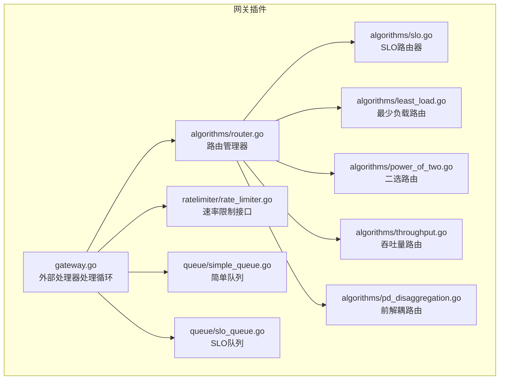
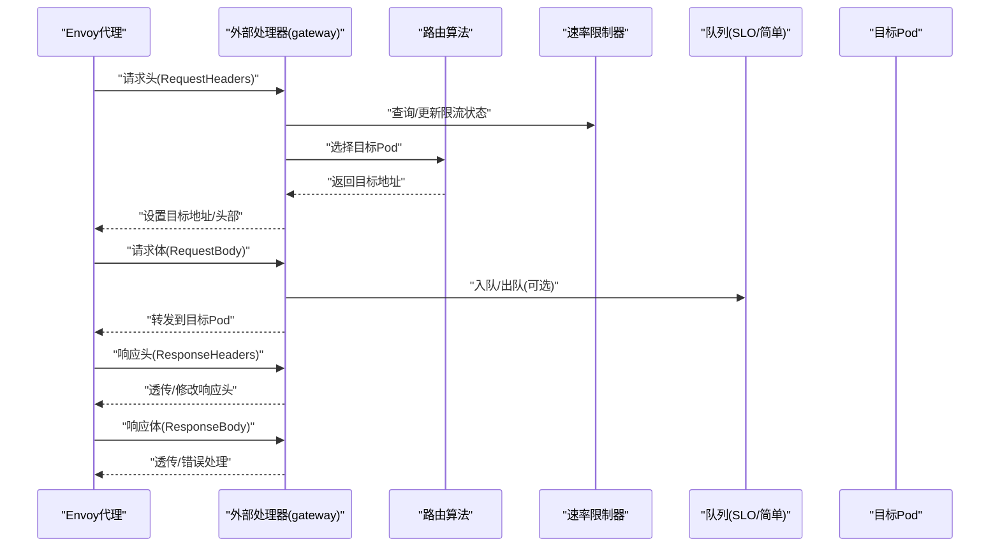
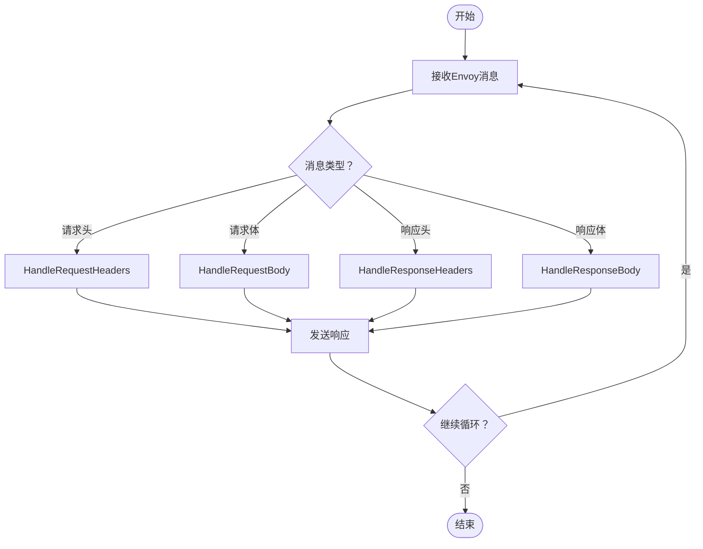
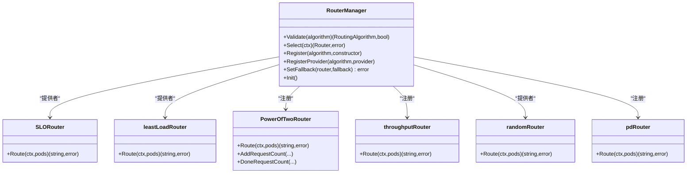
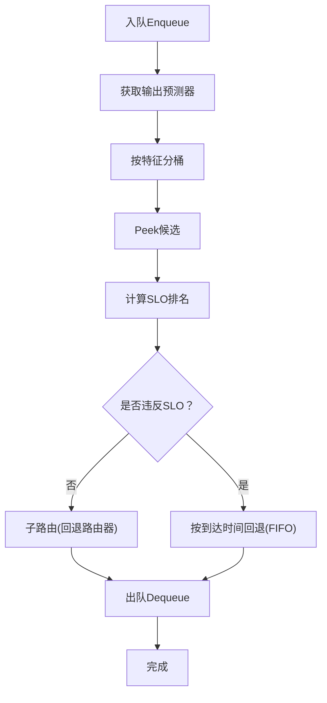
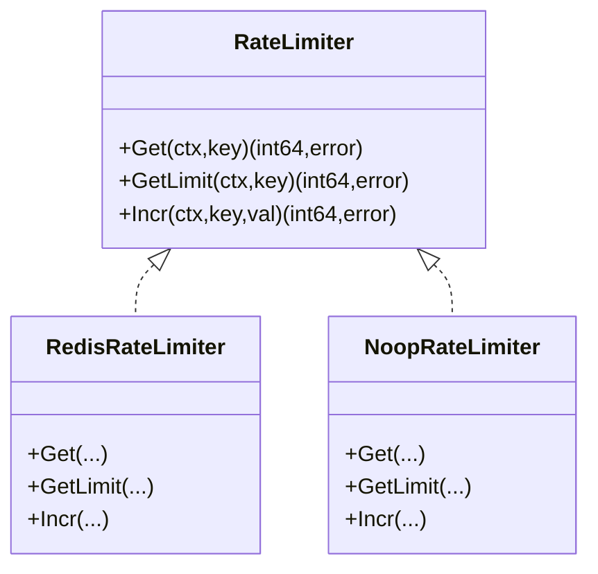
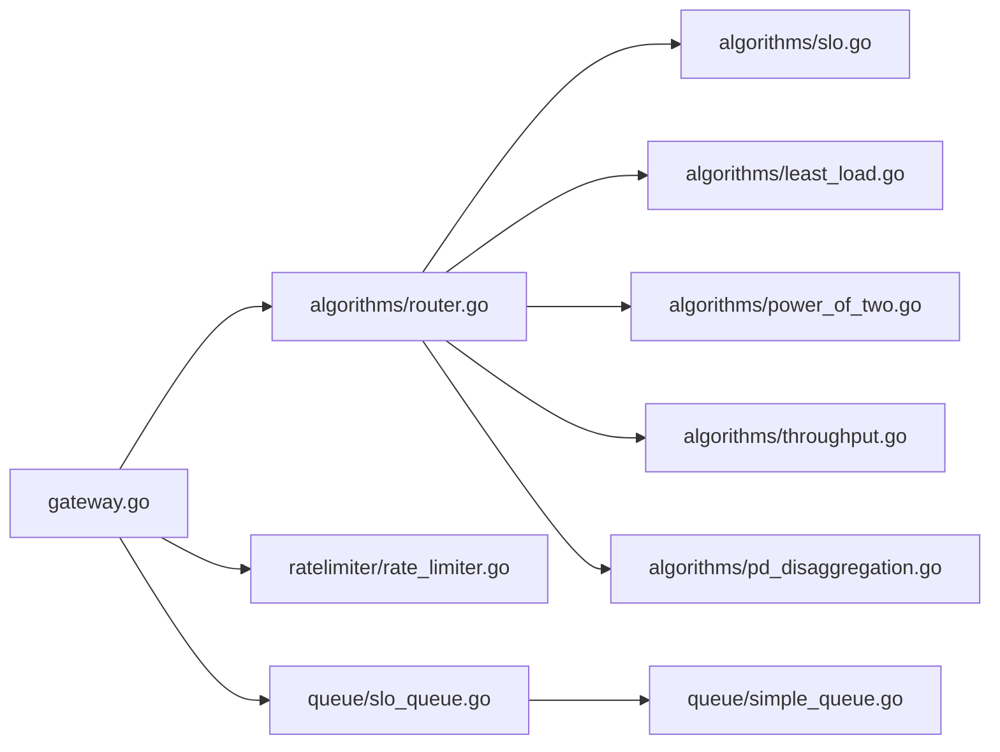

# 网关插件系统

<cite>
**本文引用的文件**
- [pkg/plugins/gateway/gateway.go](file://pkg/plugins/gateway/gateway.go)
- [pkg/plugins/gateway/types.go](file://pkg/plugins/gateway/types.go)
- [pkg/plugins/gateway/algorithms/router.go](file://pkg/plugins/gateway/algorithms/router.go)
- [pkg/plugins/gateway/algorithms/model_router_factory.go](file://pkg/plugins/gateway/algorithms/model_router_factory.go)
- [pkg/plugins/gateway/algorithms/slo.go](file://pkg/plugins/gateway/algorithms/slo.go)
- [pkg/plugins/gateway/algorithms/pd_disaggregation.go](file://pkg/plugins/gateway/algorithms/pd_disaggregation.go)
- [pkg/plugins/gateway/algorithms/least_load.go](file://pkg/plugins/gateway/algorithms/least_load.go)
- [pkg/plugins/gateway/algorithms/random.go](file://pkg/plugins/gateway/algorithms/random.go)
- [pkg/plugins/gateway/algorithms/power_of_two.go](file://pkg/plugins/gateway/algorithms/power_of_two.go)
- [pkg/plugins/gateway/algorithms/throughput.go](file://pkg/plugins/gateway/algorithms/throughput.go)
- [pkg/plugins/gateway/ratelimiter/rate_limiter.go](file://pkg/plugins/gateway/ratelimiter/rate_limiter.go)
- [pkg/plugins/gateway/queue/simple_queue.go](file://pkg/plugins/gateway/queue/simple_queue.go)
- [pkg/plugins/gateway/queue/slo_queue.go](file://pkg/plugins/gateway/queue/slo_queue.go)
- [pkg/types/router.go](file://pkg/types/router.go)
</cite>

## 目录
1. [引言](#引言)
2. [项目结构](#项目结构)
3. [核心组件](#核心组件)
4. [架构总览](#架构总览)
5. [详细组件分析](#详细组件分析)
6. [依赖关系分析](#依赖关系分析)
7. [性能考量](#性能考量)
8. [故障排查指南](#故障排查指南)
9. [结论](#结论)
10. [附录](#附录)

## 引言
本文件面向AIBrix网关插件系统的开发者与运维人员，系统性阐述网关的插件化扩展机制、与Envoy集成方式、请求路由策略以及速率限制与请求队列管理。重点覆盖以下主题：
- 外部处理器接口与Envoy集成流程
- 路由算法体系：一致性哈希、能力均衡、动态调度、SLO路由、前解耦（Disaggregation）等
- 速率限制机制：账户级限流、模型级限流与动态调整策略
- 请求队列管理：优先级、超时处理与负载均衡策略
- 插件开发指南、算法定制方法与性能调优建议

## 项目结构
网关插件位于pkg/plugins/gateway目录，包含路由算法、速率限制、队列管理与网关主流程。核心模块如下：
- 网关主流程：处理Envoy外部处理器流式事件，完成请求头、请求体、响应头、响应体阶段的处理与转发
- 路由算法：统一注册与选择机制，支持随机、最少负载、吞吐量、Power of Two、SLO队列、前解耦等
- 速率限制：基于Redis或空实现的账户级与模型级限流
- 队列管理：通用简单队列与SLO感知队列，支持按部署配置与GPU特征分桶排队

图表来源
- [pkg/plugins/gateway/gateway.go:123-331](file://pkg/plugins/gateway/gateway.go#L123-L331)
- [pkg/plugins/gateway/algorithms/router.go:73-152](file://pkg/plugins/gateway/algorithms/router.go#L73-L152)
- [pkg/plugins/gateway/algorithms/slo.go:56-94](file://pkg/plugins/gateway/algorithms/slo.go#L56-L94)
- [pkg/plugins/gateway/algorithms/least_load.go:64-130](file://pkg/plugins/gateway/algorithms/least_load.go#L64-L130)
- [pkg/plugins/gateway/algorithms/power_of_two.go:117-184](file://pkg/plugins/gateway/algorithms/power_of_two.go#L117-L184)
- [pkg/plugins/gateway/algorithms/throughput.go:52-91](file://pkg/plugins/gateway/algorithms/throughput.go#L52-L91)
- [pkg/plugins/gateway/algorithms/pd_disaggregation.go:272-311](file://pkg/plugins/gateway/algorithms/pd_disaggregation.go#L272-L311)
- [pkg/plugins/gateway/ratelimiter/rate_limiter.go:25-37](file://pkg/plugins/gateway/ratelimiter/rate_limiter.go#L25-L37)
- [pkg/plugins/gateway/queue/simple_queue.go:57-151](file://pkg/plugins/gateway/queue/simple_queue.go#L57-L151)
- [pkg/plugins/gateway/queue/slo_queue.go:137-331](file://pkg/plugins/gateway/queue/slo_queue.go#L137-L331)

章节来源
- [pkg/plugins/gateway/gateway.go:123-331](file://pkg/plugins/gateway/gateway.go#L123-L331)
- [pkg/plugins/gateway/algorithms/router.go:73-152](file://pkg/plugins/gateway/algorithms/router.go#L73-L152)

## 核心组件
- 外部处理器服务：接收并处理Envoy的ext_proc流式消息，按阶段生成响应，负责错误处理与指标上报
- 路由管理器：集中注册与选择路由算法，支持回退策略
- 速率限制器：提供账户级与模型级限流接口，默认使用Redis实现或空实现
- 队列系统：通用简单队列与SLO感知队列，支持按特征分桶与SLO违规规避
- 路由算法族：随机、最少负载（推/拉）、吞吐量、Power of Two、SLO队列、前解耦

章节来源
- [pkg/plugins/gateway/gateway.go:62-121](file://pkg/plugins/gateway/gateway.go#L62-L121)
- [pkg/plugins/gateway/algorithms/router.go:41-152](file://pkg/plugins/gateway/algorithms/router.go#L41-L152)
- [pkg/plugins/gateway/ratelimiter/rate_limiter.go:25-37](file://pkg/plugins/gateway/ratelimiter/rate_limiter.go#L25-L37)
- [pkg/plugins/gateway/queue/simple_queue.go:33-151](file://pkg/plugins/gateway/queue/simple_queue.go#L33-L151)
- [pkg/plugins/gateway/queue/slo_queue.go:80-331](file://pkg/plugins/gateway/queue/slo_queue.go#L80-L331)

## 架构总览
网关通过Envoy外部处理器扩展点接入，以流式处理模式在请求头、请求体、响应头、响应体四个阶段与Envoy交互。网关根据路由上下文选择目标Pod，并在必要时进行速率限制与队列调度。

图表来源
- [pkg/plugins/gateway/gateway.go:238-303](file://pkg/plugins/gateway/gateway.go#L238-L303)
- [pkg/plugins/gateway/algorithms/router.go:73-85](file://pkg/plugins/gateway/algorithms/router.go#L73-L85)
- [pkg/plugins/gateway/queue/slo_queue.go:137-331](file://pkg/plugins/gateway/queue/slo_queue.go#L137-L331)
- [pkg/plugins/gateway/ratelimiter/rate_limiter.go:25-37](file://pkg/plugins/gateway/ratelimiter/rate_limiter.go#L25-L37)

## 详细组件分析

### 外部处理器与Envoy集成
- 流式处理循环：持续接收Envoy消息，按阶段调用处理函数，发送响应；支持关闭与取消场景下的指标上报与清理
- 阶段处理：
  - 请求头：解析用户信息、RPM、路由上下文，设置目标Pod
  - 请求体：根据流式标记与追踪项决定是否进入队列或直接转发
  - 响应头：记录响应头、错误码，必要时生成错误响应
  - 响应体：完成计数与指标上报，处理完成标志
- HTTP服务：提供/指标与/v1/models列表接口，用于本地/独立模式下模型发现

图表来源
- [pkg/plugins/gateway/gateway.go:140-156](file://pkg/plugins/gateway/gateway.go#L140-L156)
- [pkg/plugins/gateway/gateway.go:238-303](file://pkg/plugins/gateway/gateway.go#L238-L303)

章节来源
- [pkg/plugins/gateway/gateway.go:123-331](file://pkg/plugins/gateway/gateway.go#L123-L331)

### 路由算法体系与选择机制
- 路由管理器：集中注册算法构造器与提供者，支持校验、选择、回退设置与初始化
- 算法族：
  - 随机：随机选择候选Pod
  - 最少负载（推/拉）：基于利用率或容量消费，支持拉模式（pull）
  - 吞吐量：基于提示与生成吞吐加权
  - Power of Two：二选策略，使用Redis计数，降低热点
  - SLO路由：结合SLO队列与回退路由器，优先满足SLO
  - 前解耦（PD）：预填充/解码分离，基于负载与评分策略动态选择

图表来源
- [pkg/plugins/gateway/algorithms/router.go:41-152](file://pkg/plugins/gateway/algorithms/router.go#L41-L152)
- [pkg/plugins/gateway/algorithms/slo.go:56-94](file://pkg/plugins/gateway/algorithms/slo.go#L56-L94)
- [pkg/plugins/gateway/algorithms/least_load.go:42-130](file://pkg/plugins/gateway/algorithms/least_load.go#L42-L130)
- [pkg/plugins/gateway/algorithms/power_of_two.go:65-184](file://pkg/plugins/gateway/algorithms/power_of_two.go#L65-L184)
- [pkg/plugins/gateway/algorithms/throughput.go:37-91](file://pkg/plugins/gateway/algorithms/throughput.go#L37-L91)
- [pkg/plugins/gateway/algorithms/random.go:38-57](file://pkg/plugins/gateway/algorithms/random.go#L38-L57)
- [pkg/plugins/gateway/algorithms/pd_disaggregation.go:191-311](file://pkg/plugins/gateway/algorithms/pd_disaggregation.go#L191-L311)

章节来源
- [pkg/plugins/gateway/algorithms/router.go:73-152](file://pkg/plugins/gateway/algorithms/router.go#L73-L152)
- [pkg/plugins/gateway/algorithms/model_router_factory.go:18](file://pkg/plugins/gateway/algorithms/model_router_factory.go#L18)

### SLO路由与队列管理
- SLO队列：按部署与GPU特征分桶，计算等待时间、队列服务时间与目标SLO的偏差，优先满足SLO；若无SLO可用或不可达，则回退到FIFO或回退路由器
- 简单队列：无锁环形队列，支持扩容与零值检测，保证并发安全
- 回退策略：SLORouter设置回退路由器（如最少请求数），在无SLO或不可达时兜底

图表来源
- [pkg/plugins/gateway/queue/slo_queue.go:111-331](file://pkg/plugins/gateway/queue/slo_queue.go#L111-L331)
- [pkg/plugins/gateway/queue/simple_queue.go:57-151](file://pkg/plugins/gateway/queue/simple_queue.go#L57-L151)
- [pkg/plugins/gateway/algorithms/slo.go:56-94](file://pkg/plugins/gateway/algorithms/slo.go#L56-L94)

章节来源
- [pkg/plugins/gateway/queue/slo_queue.go:137-331](file://pkg/plugins/gateway/queue/slo_queue.go#L137-L331)
- [pkg/plugins/gateway/queue/simple_queue.go:33-151](file://pkg/plugins/gateway/queue/simple_queue.go#L33-L151)

### 速率限制机制
- 接口定义：Get/GetLimit/Incr三元操作，支持账户级与模型级
- 默认实现：Redis账户级（分钟级窗口）与模型级（秒级窗口）；未配置Redis时使用空实现
- 使用场景：在请求头阶段查询/更新限流状态，避免超限请求进入后端

图表来源
- [pkg/plugins/gateway/ratelimiter/rate_limiter.go:25-37](file://pkg/plugins/gateway/ratelimiter/rate_limiter.go#L25-L37)
- [pkg/plugins/gateway/gateway.go:99-107](file://pkg/plugins/gateway/gateway.go#L99-L107)

章节来源
- [pkg/plugins/gateway/ratelimiter/rate_limiter.go:25-37](file://pkg/plugins/gateway/ratelimiter/rate_limiter.go#L25-L37)
- [pkg/plugins/gateway/gateway.go:99-107](file://pkg/plugins/gateway/gateway.go#L99-L107)

### 路由算法详解与适用场景

- 随机路由
  - 原理：对候选Pod集合进行随机选择
  - 适用：快速验证、均匀分布需求不高的场景
  - 性能：O(n)遍历，常数级开销

- 最少负载（推/拉）
  - 原理：基于利用率或容量消费最小化；拉模式考虑服务器实际承载能力
  - 适用：资源紧张或需要精确容量控制的场景
  - 性能：O(n)遍历，依赖负载提供者准确性

- 吞吐量路由
  - 原理：综合提示与生成吞吐，权重不同；无有效指标时回退随机
  - 适用：吞吐敏感型工作负载
  - 性能：O(n)，依赖指标采集

- Power of Two（二选）
  - 原理：二选候选Pod，选择运行中请求数更少者；使用Redis计数与键轮转
  - 适用：高并发、低延迟热点分散需求
  - 性能：批量MGET减少网络往返，键轮转避免长期累积

- SLO路由
  - 原理：SLO队列评估等待+服务时间与目标SLO的偏差，优先满足SLO；无SLO或不可达时回退
  - 适用：SLA/延迟敏感型场景
  - 性能：排序与评分开销，依赖模型GPU配置与输出预测器

- 前解耦（PD）
  - 原理：预填充与解码分离，基于多策略评分与负载不平衡检测，支持提示长度桶与KV传输策略
  - 适用：大模型推理、长序列、跨节点张量并行
  - 性能：多指标采集与评分，需关注网络与KV缓存延迟

章节来源
- [pkg/plugins/gateway/algorithms/random.go:45-57](file://pkg/plugins/gateway/algorithms/random.go#L45-L57)
- [pkg/plugins/gateway/algorithms/least_load.go:64-130](file://pkg/plugins/gateway/algorithms/least_load.go#L64-L130)
- [pkg/plugins/gateway/algorithms/throughput.go:52-91](file://pkg/plugins/gateway/algorithms/throughput.go#L52-L91)
- [pkg/plugins/gateway/algorithms/power_of_two.go:117-184](file://pkg/plugins/gateway/algorithms/power_of_two.go#L117-L184)
- [pkg/plugins/gateway/algorithms/slo.go:62-94](file://pkg/plugins/gateway/algorithms/slo.go#L62-L94)
- [pkg/plugins/gateway/algorithms/pd_disaggregation.go:272-311](file://pkg/plugins/gateway/algorithms/pd_disaggregation.go#L272-L311)

## 依赖关系分析
- 组件耦合
  - 网关主流程依赖路由管理器、速率限制器与队列
  - 路由算法通过统一接口与管理器解耦
  - SLO队列依赖模型GPU配置与输出预测器
- 外部依赖
  - Redis：二选路由与速率限制
  - Prometheus：指标导出
  - Kubernetes：HTTPRoute状态校验（标准部署）

图表来源
- [pkg/plugins/gateway/gateway.go:62-121](file://pkg/plugins/gateway/gateway.go#L62-L121)
- [pkg/plugins/gateway/algorithms/router.go:41-152](file://pkg/plugins/gateway/algorithms/router.go#L41-L152)
- [pkg/plugins/gateway/queue/slo_queue.go:80-109](file://pkg/plugins/gateway/queue/slo_queue.go#L80-L109)

章节来源
- [pkg/plugins/gateway/gateway.go:62-121](file://pkg/plugins/gateway/gateway.go#L62-L121)
- [pkg/plugins/gateway/algorithms/router.go:41-152](file://pkg/plugins/gateway/algorithms/router.go#L41-L152)

## 性能考量
- 路由算法
  - 随机与Power of Two：低开销，适合高并发；二选需关注Redis读写延迟与键轮转策略
  - 最少负载：依赖负载提供者准确性与时效性
  - 吞吐量：指标采集成本，建议启用必要的指标监控
  - SLO路由：排序与评分有额外CPU开销，建议合理配置分桶与特征维度
  - 前解耦：网络与KV缓存成为瓶颈，需优化KV传输与节点间通信
- 队列
  - 简单队列扩容与零值检测避免数据竞争，注意内存占用与扩容频率
  - SLO队列按部署与特征分桶，减少全局扫描，但排序与评分带来CPU压力
- 指标与日志
  - 合理使用KLOG级别，避免高频日志影响性能
  - Prometheus指标粒度与标签基数控制

## 故障排查指南
- 收到“无可用Pod”或“无就绪Pod”
  - 检查外部过滤表达式与就绪Pod筛选逻辑
  - 确认路由算法是否正确设置回退
- HTTPRoute状态异常
  - 在非独立模式下，校验HTTPRoute的Accepted与ResolvedRefs状态
- 速率限制触发
  - 检查账户级/模型级限流阈值与窗口；确认Redis连接与键空间
- 二选路由异常
  - 检查Redis键构建、MGET结果解析与键过期策略
- SLO队列回退
  - 检查模型GPU配置、输出预测器与SLO目标；确认分桶与特征映射

章节来源
- [pkg/plugins/gateway/gateway.go:333-360](file://pkg/plugins/gateway/gateway.go#L333-L360)
- [pkg/plugins/gateway/gateway.go:362-397](file://pkg/plugins/gateway/gateway.go#L362-L397)
- [pkg/plugins/gateway/algorithms/power_of_two.go:212-281](file://pkg/plugins/gateway/algorithms/power_of_two.go#L212-L281)
- [pkg/plugins/gateway/queue/slo_queue.go:154-156](file://pkg/plugins/gateway/queue/slo_queue.go#L154-L156)

## 结论
AIBrix网关插件系统通过统一的路由管理器与丰富的路由算法，结合SLO感知队列与速率限制，在Envoy外部处理器框架下实现了灵活、可观测且可扩展的请求转发与调度。针对不同业务场景（吞吐、延迟、SLA、前解耦），可按需选择路由策略与队列模式，并通过Redis与指标系统实现精细化治理。

## 附录

### 插件开发指南
- 新增路由算法
  - 实现types.Router接口的Route方法
  - 通过Register或RegisterProvider注册算法
  - 如需回退，实现FallbackRouter并设置SetFallback
- 自定义速率限制
  - 实现RateLimiter接口；在NewServer中注入自定义实现
- 自定义队列
  - 实现QueueRouter接口；在SLO路由工厂中替换默认队列

章节来源
- [pkg/types/router.go:20-56](file://pkg/types/router.go#L20-L56)
- [pkg/plugins/gateway/algorithms/router.go:87-113](file://pkg/plugins/gateway/algorithms/router.go#L87-L113)
- [pkg/plugins/gateway/algorithms/slo.go:70-94](file://pkg/plugins/gateway/algorithms/slo.go#L70-L94)
- [pkg/plugins/gateway/ratelimiter/rate_limiter.go:25-37](file://pkg/plugins/gateway/ratelimiter/rate_limiter.go#L25-L37)