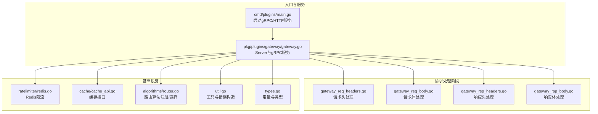
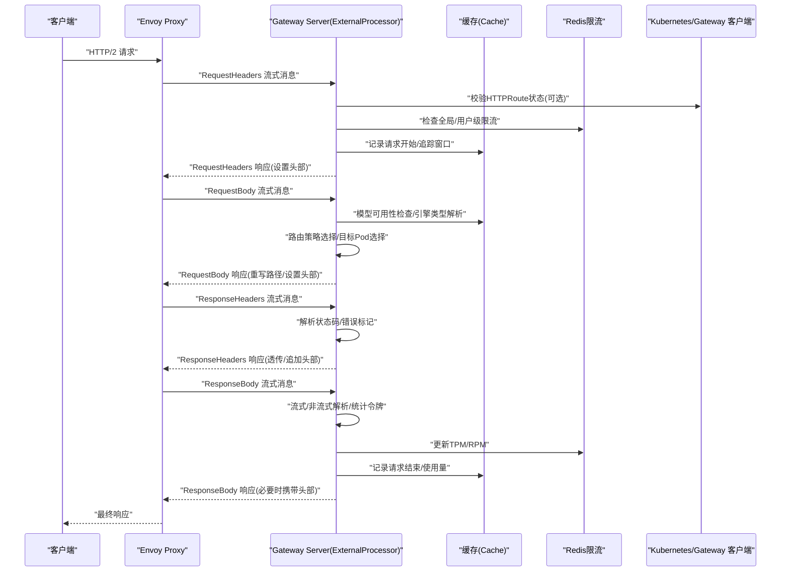
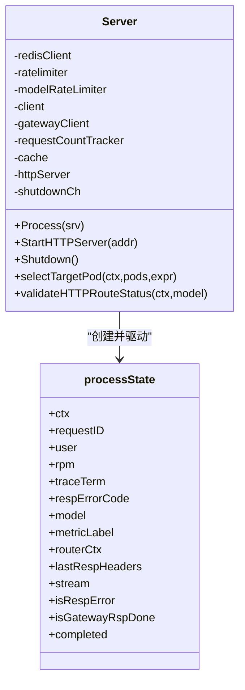
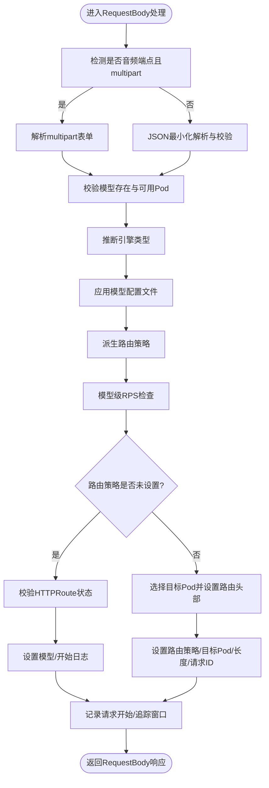
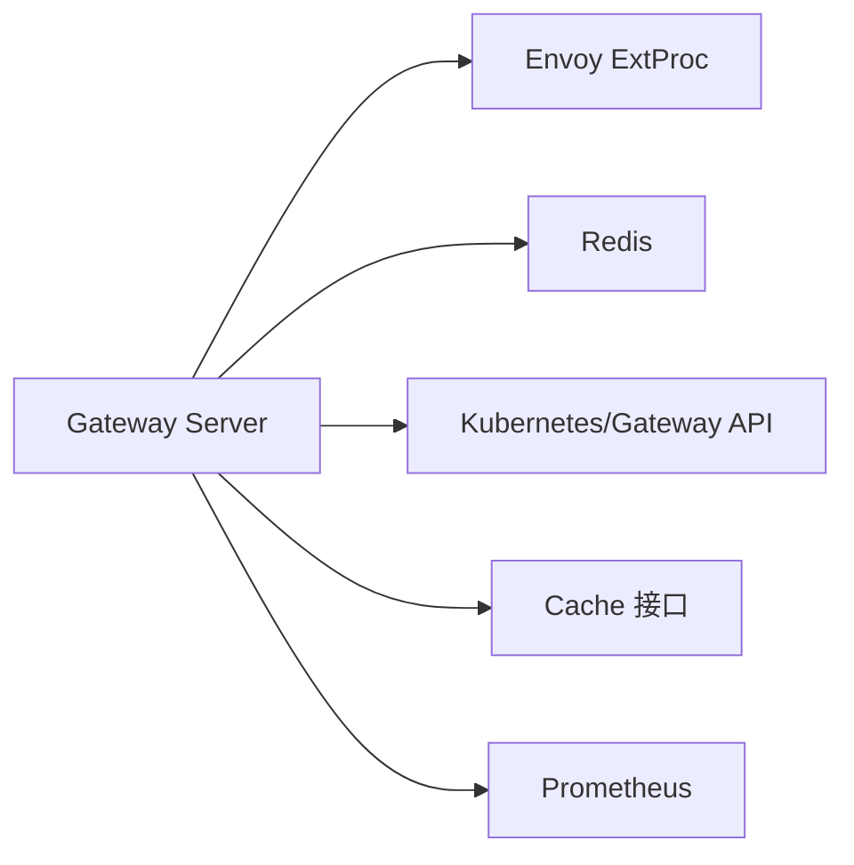

# 网关架构设计

<cite>
**本文引用的文件**
- [pkg/plugins/gateway/gateway.go](file://pkg/plugins/gateway/gateway.go)
- [pkg/plugins/gateway/types.go](file://pkg/plugins/gateway/types.go)
- [pkg/plugins/gateway/util.go](file://pkg/plugins/gateway/util.go)
- [pkg/plugins/gateway/gateway_req_headers.go](file://pkg/plugins/gateway/gateway_req_headers.go)
- [pkg/plugins/gateway/gateway_req_body.go](file://pkg/plugins/gateway/gateway_req_body.go)
- [pkg/plugins/gateway/gateway_rsp_headers.go](file://pkg/plugins/gateway/gateway_rsp_headers.go)
- [pkg/plugins/gateway/gateway_rsp_body.go](file://pkg/plugins/gateway/gateway_rsp_body.go)
- [pkg/plugins/gateway/algorithms/router.go](file://pkg/plugins/gateway/algorithms/router.go)
- [pkg/plugins/gateway/ratelimiter/redis.go](file://pkg/plugins/gateway/ratelimiter/redis.go)
- [pkg/cache/cache_api.go](file://pkg/cache/cache_api.go)
- [cmd/plugins/main.go](file://cmd/plugins/main.go)
</cite>

## 目录
1. [简介](#简介)
2. [项目结构](#项目结构)
3. [核心组件](#核心组件)
4. [架构总览](#架构总览)
5. [详细组件分析](#详细组件分析)
6. [依赖分析](#依赖分析)
7. [性能考虑](#性能考虑)
8. [故障排查指南](#故障排查指南)
9. [结论](#结论)
10. [附录](#附录)

## 简介
本文件面向AIBrix网关（Gateway Plugin）的架构设计与实现，重点覆盖以下方面：
- 外部处理器接口（External Processor）工作原理与Envoy集成
- gRPC通信机制与请求生命周期
- 核心组件：Server结构体、processState状态管理、请求处理流程
- 与Envoy Proxy的交互模式：请求头/请求体/响应头/响应体的完整生命周期
- 初始化流程：Redis客户端集成、Kubernetes客户端配置、HTTP服务器启动
- 架构图与组件交互示意，帮助开发者快速理解网关在整体系统中的定位与职责

## 项目结构
网关位于pkg/plugins/gateway目录，采用按职责分层的模块化组织：
- 入口与服务端：cmd/plugins/main.go负责初始化与启动；pkg/plugins/gateway/gateway.go定义Server与gRPC服务注册
- 请求处理：分别实现请求头、请求体、响应头、响应体阶段的处理逻辑
- 路由与限流：路由算法注册与选择、基于Redis的速率限制
- 缓存与指标：统一缓存接口与指标上报
- 工具与常量：通用工具函数、错误码与路径常量

图表来源
- [cmd/plugins/main.go:154-197](file://cmd/plugins/main.go#L154-L197)
- [pkg/plugins/gateway/gateway.go:123-138](file://pkg/plugins/gateway/gateway.go#L123-L138)
- [pkg/plugins/gateway/gateway_req_headers.go:41-125](file://pkg/plugins/gateway/gateway_req_headers.go#L41-L125)
- [pkg/plugins/gateway/gateway_req_body.go:38-175](file://pkg/plugins/gateway/gateway_req_body.go#L38-L175)
- [pkg/plugins/gateway/gateway_rsp_headers.go:29-97](file://pkg/plugins/gateway/gateway_rsp_headers.go#L29-L97)
- [pkg/plugins/gateway/gateway_rsp_body.go:62-156](file://pkg/plugins/gateway/gateway_rsp_body.go#L62-L156)
- [pkg/plugins/gateway/ratelimiter/redis.go:30-88](file://pkg/plugins/gateway/ratelimiter/redis.go#L30-L88)
- [pkg/cache/cache_api.go:25-170](file://pkg/cache/cache_api.go#L25-L170)
- [pkg/plugins/gateway/algorithms/router.go:41-153](file://pkg/plugins/gateway/algorithms/router.go#L41-L153)
- [pkg/plugins/gateway/util.go:47-549](file://pkg/plugins/gateway/util.go#L47-L549)
- [pkg/plugins/gateway/types.go:24-122](file://pkg/plugins/gateway/types.go#L24-L122)

章节来源
- [cmd/plugins/main.go:54-197](file://cmd/plugins/main.go#L54-L197)
- [pkg/plugins/gateway/gateway.go:62-121](file://pkg/plugins/gateway/gateway.go#L62-L121)

## 核心组件
- Server结构体
  - 职责：承载gRPC服务、HTTP服务、Redis限流器、Kubernetes/Gateway客户端、缓存、请求计数跟踪、优雅关闭通道
  - 关键字段：redisClient、ratelimiter、modelRateLimiter、client、gatewayClient、cache、httpServer、shutdownCh
- processState状态管理
  - 职责：单次请求在gRPC流中的状态机，包含上下文、请求ID、用户信息、RPM、traceTerm、模型名、路由上下文、响应头缓存、流标记、错误标记、完成标记等
- 请求处理循环
  - Process：接收Envoy的ext_proc流，循环调用processOnce
  - processOnce：预检查、Recv、handleProcessingRequest、sendProcessingResponse
  - handleProcessingRequest：根据消息类型分派到对应阶段处理，并维护指标标签与成功/失败统计

章节来源
- [pkg/plugins/gateway/gateway.go:62-121](file://pkg/plugins/gateway/gateway.go#L62-L121)
- [pkg/plugins/gateway/gateway.go:123-156](file://pkg/plugins/gateway/gateway.go#L123-L156)
- [pkg/plugins/gateway/gateway.go:238-303](file://pkg/plugins/gateway/gateway.go#L238-L303)

## 架构总览
网关通过gRPC External Processor服务与Envoy交互，形成“请求头→请求体→响应头→响应体”的四阶段流水线。Server在每个阶段对请求进行验证、路由、限流、指标上报与错误处理，并将结果返回给Envoy。

图表来源
- [pkg/plugins/gateway/gateway.go:123-156](file://pkg/plugins/gateway/gateway.go#L123-L156)
- [pkg/plugins/gateway/gateway_req_headers.go:41-125](file://pkg/plugins/gateway/gateway_req_headers.go#L41-L125)
- [pkg/plugins/gateway/gateway_req_body.go:38-175](file://pkg/plugins/gateway/gateway_req_body.go#L38-L175)
- [pkg/plugins/gateway/gateway_rsp_headers.go:29-97](file://pkg/plugins/gateway/gateway_rsp_headers.go#L29-L97)
- [pkg/plugins/gateway/gateway_rsp_body.go:62-156](file://pkg/plugins/gateway/gateway_rsp_body.go#L62-L156)

## 详细组件分析

### Server与gRPC服务
- 初始化
  - NewServer：构建Server，初始化缓存、Redis限流器（存在时）、路由算法初始化
  - 启动HTTP服务：StartHTTPServer提供/metrics与/v1/models接口
- 处理循环
  - Process：为每次请求生成requestID，进入无限循环处理
  - processOnce：预检查（关闭/取消）、Recv、handleProcessingRequest、sendProcessingResponse
  - handleProcessingRequest：按消息类型分发至各阶段处理，维护指标标签与成功/失败统计
  - sendProcessingResponse：发送响应并处理发送失败场景（记录指标、清理上下文）

图表来源
- [pkg/plugins/gateway/gateway.go:62-121](file://pkg/plugins/gateway/gateway.go#L62-L121)
- [pkg/plugins/gateway/gateway.go:123-156](file://pkg/plugins/gateway/gateway.go#L123-L156)

章节来源
- [pkg/plugins/gateway/gateway.go:94-121](file://pkg/plugins/gateway/gateway.go#L94-L121)
- [pkg/plugins/gateway/gateway.go:123-156](file://pkg/plugins/gateway/gateway.go#L123-L156)
- [pkg/plugins/gateway/gateway.go:316-331](file://pkg/plugins/gateway/gateway.go#L316-L331)

### 请求头处理（RequestHeaders）
- 功能要点
  - 解析用户、路径、鉴权、内容类型、外部过滤表达式、路由策略、会话ID、配置文件等头部
  - 若存在用户名且Redis可用，查询用户并检查全局/用户级限流
  - 构造RoutingContext（含请求路径、头部、配置文件），设置“已进入请求头”标记
  - 清空路由缓存以确保后续路由正确

章节来源
- [pkg/plugins/gateway/gateway_req_headers.go:41-125](file://pkg/plugins/gateway/gateway_req_headers.go#L41-L125)

### 请求体处理（RequestBody）
- 功能要点
  - 音频端点采用multipart解析；其他端点采用JSON最小化解析与校验
  - 校验模型存在性与可用Pod数量，推断引擎类型（用于路径重写）
  - 应用模型配置文件（从注解解析），派生路由策略（头部/配置/环境变量）
  - 模型级RPS检查与回滚
  - 路由策略为“未设置”时：校验HTTPRoute状态；否则：选择目标Pod并设置路由相关头部
  - 记录请求开始、追踪窗口号

图表来源
- [pkg/plugins/gateway/gateway_req_body.go:38-175](file://pkg/plugins/gateway/gateway_req_body.go#L38-L175)

章节来源
- [pkg/plugins/gateway/gateway_req_body.go:38-175](file://pkg/plugins/gateway/gateway_req_body.go#L38-L175)

### 响应头处理（ResponseHeaders）
- 功能要点
  - 追加“已进入响应头”与请求ID头部
  - 若已路由，附加路由策略、目标Pod名称与地址
  - 透传业务响应头（跳过伪头部）
  - 解析状态码，若非200则标记为处理错误，准备错误响应

章节来源
- [pkg/plugins/gateway/gateway_rsp_headers.go:29-97](file://pkg/plugins/gateway/gateway_rsp_headers.go#L29-L97)

### 响应体处理（ResponseBody）
- 功能要点
  - 流式：解析SSE片段，提取prompt/completion/total tokens
  - 非流式语言类：拼接缓冲区，最终解析OpenAI兼容响应，提取tokens
  - 更新用户TPM与RPM（若存在用户），设置更新头部
  - 记录请求结束指标（TTFT、桶分布、路由时间等），支持pd算法的多阶段时延统计

章节来源
- [pkg/plugins/gateway/gateway_rsp_body.go:62-156](file://pkg/plugins/gateway/gateway_rsp_body.go#L62-L156)

### 路由与目标选择
- 路由算法注册与选择
  - RouterManager：注册/选择/初始化路由算法，支持回退策略设置
  - Gateway在选择目标Pod时，先按路由算法获取Router，再对可用Pod集合执行路由
- 目标Pod选择
  - 过滤可路由Pod
  - 可选外部过滤表达式二次筛选
  - 使用Router.Route进行负载均衡或亲和策略

章节来源
- [pkg/plugins/gateway/algorithms/router.go:41-153](file://pkg/plugins/gateway/algorithms/router.go#L41-L153)
- [pkg/plugins/gateway/gateway.go:333-360](file://pkg/plugins/gateway/gateway.go#L333-L360)

### 速率限制（Redis）
- 实现
  - 固定窗口限流器，按窗口大小分桶计数
  - 支持账户级与模型级限流
- 使用
  - 用户级TPM累加
  - 模型级RPS检查与回滚

章节来源
- [pkg/plugins/gateway/ratelimiter/redis.go:30-88](file://pkg/plugins/gateway/ratelimiter/redis.go#L30-L88)
- [pkg/plugins/gateway/gateway_req_body.go:110-118](file://pkg/plugins/gateway/gateway_req_body.go#L110-L118)
- [pkg/plugins/gateway/gateway_rsp_body.go:122-136](file://pkg/plugins/gateway/gateway_rsp_body.go#L122-L136)

### 缓存与指标
- 缓存接口
  - 统一抽象：Pod/模型/Metric/请求追踪/配置文件等能力
- 指标
  - Prometheus指标：请求总量、成功/失败计数、令牌桶、TTFT桶、路由/预填充/KV传输/解码时延桶、首Token超阈统计等

章节来源
- [pkg/cache/cache_api.go:25-170](file://pkg/cache/cache_api.go#L25-L170)
- [pkg/plugins/gateway/gateway_rsp_body.go:234-301](file://pkg/plugins/gateway/gateway_rsp_body.go#L234-L301)

### 初始化与运行时
- 入口程序
  - 解析命令行参数（gRPC/HTTP绑定地址、独立模式、端点配置）
  - Redis客户端初始化（独立模式下可选）
  - 路由算法注册（如启用Redis）
  - 缓存初始化（支持KV事件同步与远程分词器）
  - gRPC服务注册ExternalProcessor与健康检查
  - HTTP服务启动/metrics与/v1/models
  - 信号处理与优雅关闭
- 独立模式
  - 使用静态端点发现替代Kubernetes API
  - /v1/models在独立模式下直接由网关提供

章节来源
- [cmd/plugins/main.go:54-197](file://cmd/plugins/main.go#L54-L197)

## 依赖分析
- 组件耦合
  - Server对Envoy的ext_proc协议强耦合，通过gRPC流驱动
  - 对Kubernetes/Gateway客户端仅在HTTPRoute状态校验与元数据查询时使用
  - 对Redis限流器与缓存接口存在条件依赖（独立模式可禁用）
- 外部依赖
  - Envoy（External Processor）、gRPC、Redis、Kubernetes API、Prometheus

图表来源
- [pkg/plugins/gateway/gateway.go:123-156](file://pkg/plugins/gateway/gateway.go#L123-L156)
- [pkg/plugins/gateway/ratelimiter/redis.go:30-88](file://pkg/plugins/gateway/ratelimiter/redis.go#L30-L88)
- [pkg/cache/cache_api.go:25-170](file://pkg/cache/cache_api.go#L25-L170)
- [cmd/plugins/main.go:154-197](file://cmd/plugins/main.go#L154-L197)

## 性能考虑
- 解析优化
  - 请求体JSON解析采用最小化结构与单次反序列化，避免SDK反射开销
  - 流式响应使用SSE解码器增量解析，降低内存峰值
- 路由与选择
  - 可路由Pod过滤与随机洗牌，结合Router算法实现低延迟与高吞吐
- 指标与可观测性
  - 多维桶统计（令牌桶、时延桶、路由时延桶）便于容量规划与问题定位
- 限流与回滚
  - 模型级RPS与用户级TPM/PMM限流，失败时快速回滚，保障稳定性

## 故障排查指南
- 常见错误与处理
  - HTTPRoute状态不合法：在非pd路由时校验并返回服务不可用错误
  - 无可用Pod/模型不存在：返回400/503并设置相应头部
  - 发送响应失败：记录指标、清理上下文、区分EOF与取消
  - 流式解析异常：返回内部错误并设置流式错误头部
- 关键指标
  - 请求总量/成功/失败、模型维度失败细分、首Token超阈计数
  - 令牌桶与路由/预填充/KV传输/解码时延桶
- 日志与头部
  - 请求开始/结束日志包含模型、令牌用量、路由时延、目标Pod等
  - 错误头部便于客户端与网关侧快速定位问题

章节来源
- [pkg/plugins/gateway/gateway.go:181-236](file://pkg/plugins/gateway/gateway.go#L181-L236)
- [pkg/plugins/gateway/gateway_rsp_body.go:99-108](file://pkg/plugins/gateway/gateway_rsp_body.go#L99-L108)
- [pkg/plugins/gateway/gateway_req_body.go:208-227](file://pkg/plugins/gateway/gateway_req_body.go#L208-L227)

## 结论
AIBrix网关通过gRPC External Processor与Envoy深度集成，实现了请求全生命周期的精细化控制：从请求头的用户与限流校验、请求体的模型与路由决策、到响应头/体的错误处理与指标统计。其模块化设计（路由、限流、缓存、指标）既保证了扩展性，也确保了在复杂推理后端场景下的稳定与高效。

## 附录
- 常量与头部
  - 错误头部、模型与部署头部、流式与Multipart头部、RPM/TPM更新头部、OpenAI错误类型与代码、路径常量、会话ID等
- 工具函数
  - OpenAI兼容错误构造、Envoy头部构建、输入校验（嵌入、分类、图像/视频等）、路径重写（引擎差异）

章节来源
- [pkg/plugins/gateway/types.go:24-122](file://pkg/plugins/gateway/types.go#L24-L122)
- [pkg/plugins/gateway/util.go:459-549](file://pkg/plugins/gateway/util.go#L459-L549)